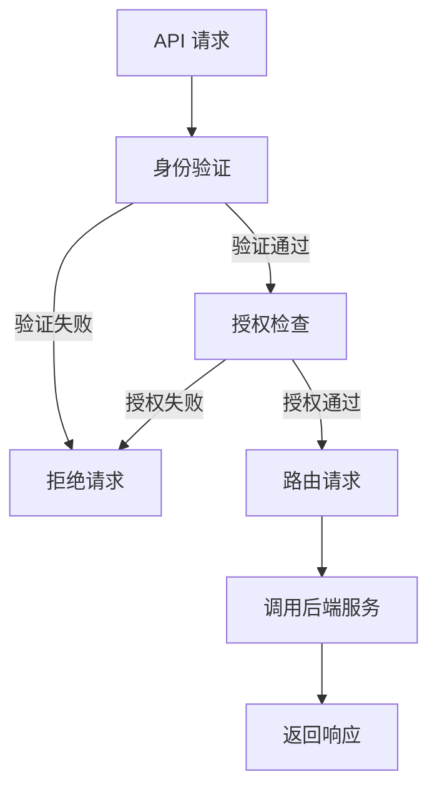

                 

关键词：API 网关、集中化安全管理、安全策略、微服务架构、访问控制、身份验证、网络安全

> 摘要：本文旨在探讨如何利用 API 网关实现集中化安全管理，为微服务架构提供高效、灵活的安全解决方案。通过阐述 API 网关的核心概念、架构设计、安全策略实现以及实际应用案例，本文为开发者提供了一套全面的安全管理方案。

## 1. 背景介绍

在当今的数字化时代，API（应用程序编程接口）已经成为企业构建分布式系统、实现服务化架构的核心手段。API 网关作为 API 通信的中枢枢纽，扮演着至关重要的角色。然而，随着 API 调用的激增和系统复杂性的增加，安全管理的挑战也越来越大。

传统的安全策略大多分散在各个微服务中，这不仅增加了安全管理的难度，还可能导致安全隐患的累积。为了解决这一问题，API 网关提供了集中化安全管理的可能性，使得开发者能够在一个统一的位置实施安全策略，提高系统的安全性和可维护性。

### 1.1 API 网关的定义与作用

API 网关是一种服务器，负责接收来自客户端的 API 请求，对其进行处理后再转发给相应的后端服务。其主要作用包括：

- 路由管理：根据请求的 URL 或其他参数，将请求路由到正确的后端服务。
- 安全控制：验证请求的合法性和安全性。
- 流量管理：控制 API 调用的频率、速率和容量。
- API 版本管理：处理不同版本的 API 请求。

### 1.2 微服务架构下的安全挑战

在微服务架构中，服务之间通过 API 进行通信。随着服务数量的增加，安全管理的复杂性也相应增加。主要挑战包括：

- 安全策略分散：每个微服务都需要实现自己的安全策略，导致管理难度增加。
- 身份验证与授权：多个服务需要统一的身份验证和授权机制。
- 数据安全：保护敏感数据不被未授权访问。
- 请求伪造与中间人攻击：防止恶意用户通过伪造请求访问系统。

## 2. 核心概念与联系

### 2.1 API 网关的安全架构

API 网关的安全架构通常包括以下几个方面：

- 身份验证（Authentication）：确认请求者的身份。
- 授权（Authorization）：确定请求者是否有权限执行特定的操作。
- 安全策略（Security Policies）：定义对 API 请求的访问控制规则。
- 数据加密（Data Encryption）：保护传输中的敏感数据。
- 日志审计（Logging and Auditing）：记录 API 请求和响应的信息，用于后续分析。

### 2.2 Mermaid 流程图



### 2.3 安全策略的实现

安全策略在 API 网关中通过一系列规则进行定义和实现，这些规则可以基于以下条件：

- 请求头（Headers）：如 `Authorization`、`Content-Type` 等。
- 请求体（Body）：如请求参数、JSON 数据等。
- 请求方法（Method）：如 `GET`、`POST`、`PUT` 等。
- 客户端 IP 地址（Client IP）。
- API 版本（API Version）。

## 3. 核心算法原理 & 具体操作步骤

### 3.1 算法原理概述

API 网关的安全算法主要基于以下原理：

- 基于令牌的认证（Token-Based Authentication）：如 JWT（JSON Web Tokens）。
- 访问控制列表（Access Control Lists, ACLs）：基于角色或用户组的访问控制。
- 请求签名（Request Signing）：确保请求在传输过程中未被篡改。

### 3.2 算法步骤详解

1. 客户端发送 API 请求。
2. API 网关接收请求并进行身份验证。
3. 验证通过后，API 网关检查请求的授权策略。
4. 授权通过，API 网关将请求路由到后端服务。
5. 后端服务处理请求并返回响应。
6. API 网关返回响应给客户端。

### 3.3 算法优缺点

#### 优点

- **集中化安全控制**：安全策略集中管理，降低管理难度。
- **灵活性和可扩展性**：支持自定义安全策略，适应不同业务需求。
- **性能优化**：减少后端服务的认证负担。

#### 缺点

- **性能瓶颈**：如果 API 网关负载过高，可能导致性能下降。
- **复杂性**：需要开发者具备一定的安全知识，以正确配置安全策略。

### 3.4 算法应用领域

API 网关的安全算法在以下领域有广泛应用：

- **电子商务平台**：确保用户数据和交易安全。
- **社交媒体**：防止恶意攻击和滥用。
- **企业内部服务**：保障企业数据安全。

## 4. 数学模型和公式

### 4.1 数学模型构建

安全模型构建主要基于以下公式：

$$
\text{Security Model} = \text{Authentication} + \text{Authorization} + \text{Data Encryption}
$$

### 4.2 公式推导过程

公式推导过程如下：

- **身份验证（Authentication）**：使用令牌（如 JWT）验证请求者的身份。
- **授权（Authorization）**：使用访问控制列表（ACLs）或基于角色的访问控制（RBAC）确定请求者的权限。
- **数据加密（Data Encryption）**：使用加密算法（如 AES）对传输中的数据进行加密。

### 4.3 案例分析与讲解

假设一个电子商务平台，要求用户必须通过 JWT 进行身份验证，并且只有具备购买权限的用户才能访问购物车接口。

$$
\text{Security Model} = \text{JWT Authentication} + \text{ACL-Based Authorization} + \text{AES Encryption}
$$

## 5. 项目实践：代码实例

### 5.1 开发环境搭建

- 使用 Spring Boot 搭建 API 网关。
- 引入 Spring Security 模块。
- 配置 JWT 认证和授权。

### 5.2 源代码详细实现

```java
// 身份验证过滤器
@Component
public class JwtAuthenticationFilter extends oncePerRequestFilter {
    // 省略具体实现
}

// 授权检查过滤器
@Component
public class JwtAuthorizationFilter extends oncePerRequestFilter {
    // 省略具体实现
}

// JWT 工具类
@Component
public class JwtUtil {
    // 省略具体实现
}

// 安全配置类
@Configuration
public class SecurityConfig extends WebSecurityConfigurerAdapter {
    // 省略具体实现
}
```

### 5.3 代码解读与分析

代码主要实现了 JWT 身份验证、授权检查以及数据加密功能，确保 API 请求的安全。

## 6. 实际应用场景

### 6.1 电子商务平台

电子商务平台通过 API 网关对用户请求进行身份验证和授权，确保用户数据和交易安全。

### 6.2 微信小程序

微信小程序通过 API 网关与后端服务进行通信，使用 JWT 进行身份验证，保障用户数据安全。

### 6.3 企业内部服务

企业内部服务使用 API 网关对员工请求进行认证和授权，确保企业数据不被未授权访问。

## 7. 未来应用展望

### 7.1 自动化安全策略

未来的 API 网关将支持自动化安全策略，减少人工配置的复杂度。

### 7.2 AI 防护

结合 AI 技术，API 网关能够更准确地识别和防范恶意攻击。

### 7.3 跨平台支持

API 网关将支持更多平台和协议，如 gRPC、WebSocket 等。

## 8. 总结

本文探讨了如何利用 API 网关实现集中化安全管理，为微服务架构提供高效、灵活的安全解决方案。通过核心算法原理的阐述、实际应用场景的分析以及未来展望，本文为开发者提供了一套全面的安全管理方案。

## 9. 附录：常见问题与解答

### Q: API 网关是否会降低系统性能？

A: API 网关确实会增加一定的性能开销，但现代高性能网关通常能够有效优化性能，减少对系统的影响。

### Q: 如何确保 JWT 的安全性？

A: JWT 应当使用强加密算法，并确保私钥的安全存储。同时，定期更换 JWT 私钥也是必要的。

### Q: API 网关能否防止 DDoS 攻击？

A: API 网关可以通过流量管理和速率限制等手段，减轻 DDoS 攻击的影响，但无法完全防止。

作者：禅与计算机程序设计艺术 / Zen and the Art of Computer Programming
----------------------------------------------------------------

### 注意事项：

- 请确保遵循给出的文章结构模板和内容要求。
- 文章中使用的 Mermaid 流程图需按照要求使用 Mermaid 语法编写。
- 文章中使用的 LaTeX 数学公式需按照 LaTeX 格式编写，确保正确显示。
- 文章内容需确保完整、准确、逻辑清晰，避免遗漏重要信息。
- 文章末尾需附上作者署名。

请您根据以上要求撰写完整的文章。祝您写作顺利！

