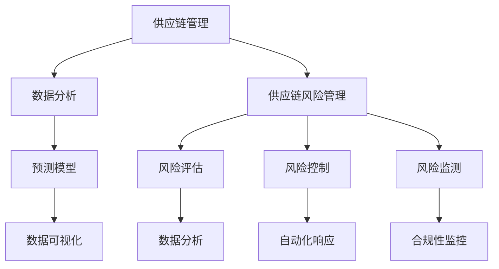

                 

关键词：供应链风险管理、人工智能、突发事件、供应链优化、数据分析、机器学习、预测模型、流程自动化、合规性

## 摘要

本文探讨了供应链风险管理的重要性，特别是在应对突发事件时。通过引入人工智能（AI）技术，本文阐述了如何利用AI提高供应链的透明度和弹性，减少潜在风险，并快速响应突发事件。文章首先介绍了供应链风险管理的背景和核心概念，然后详细阐述了AI在供应链风险管理中的应用，包括数据收集与分析、预测模型的构建、流程自动化以及合规性监控。最后，本文提出了未来在供应链风险管理中应用AI技术的前景和面临的挑战。

## 1. 背景介绍

供应链是企业运营的核心，它连接着供应商、制造商、分销商和最终消费者。随着全球化进程的加速，供应链的复杂性和依赖性也日益增加。这种复杂性带来了许多潜在的风险，包括供应商延迟、物流中断、市场需求波动、自然灾害和政治不稳定等。任何一次突发事件都可能导致供应链中断，进而影响企业的运营效率和声誉。

传统的供应链风险管理方法主要依赖于经验和历史数据，这些方法在处理简单问题时效果较好，但在面对复杂和动态的供应链环境时，往往显得力不从心。因此，寻找新的技术手段来提升供应链风险管理的能力变得至关重要。

人工智能作为一项先进的技术，其在数据分析、预测建模和流程自动化等方面的能力为供应链风险管理带来了新的可能性。AI可以通过处理大量数据、识别潜在风险、预测未来趋势和自动化响应流程，从而提高供应链的弹性和韧性。本文将深入探讨AI在供应链风险管理中的具体应用，并分析其优势与挑战。

### 1.1 供应链风险的定义与分类

供应链风险是指在整个供应链过程中可能发生的任何不利事件或不确定性，这些事件或不确定性可能对供应链的正常运行造成负面影响。供应链风险可以按以下几种方式进行分类：

1. **供应链中断风险**：由于供应商、制造商、分销商或运输服务商的运营问题导致的供应链中断。
2. **供应链延迟风险**：供应链中的各个环节可能因为物流、供应链瓶颈或供应商问题而导致交付延迟。
3. **供应链成本风险**：由于原材料价格波动、劳动力成本变化或运输费用上涨导致的成本上升。
4. **供应链合规性风险**：涉及供应链管理中的法律、法规和标准遵守问题。
5. **供应链安全风险**：包括供应链中的信息安全、数据泄露、假冒伪劣产品等问题。

这些风险对企业的运营和财务状况都可能产生重大影响。例如，供应链中断可能导致产品交付延误，进而影响企业的声誉和市场竞争力；供应链延迟则可能引发客户投诉，损害客户关系；供应链成本风险可能导致利润下降；而合规性风险则可能导致法律纠纷和罚款。

### 1.2 供应链风险管理的重要性

供应链风险管理对于企业来说至关重要，原因如下：

1. **确保持续运营**：有效的供应链风险管理可以确保供应链的连续性和稳定性，减少因突发事件导致的运营中断。
2. **提升客户满意度**：通过提前识别和响应风险，企业可以更好地满足客户需求，提升客户满意度。
3. **降低运营成本**：通过优化供应链流程和资源分配，企业可以降低运营成本，提高利润率。
4. **增强市场竞争力**：强大的供应链风险管理能力可以为企业提供竞争优势，帮助企业更好地应对市场变化。
5. **提升合规性**：遵守相关法律法规和标准，可以避免法律纠纷和罚款，确保企业的长期稳定发展。

因此，供应链风险管理不仅是一个必要的业务环节，更是企业可持续发展的重要保障。

### 1.3 传统供应链风险管理方法

在传统的供应链风险管理方法中，企业主要依赖于以下几个方面的措施：

1. **风险评估**：通过历史数据和业务经验，对供应链中的潜在风险进行识别和评估。
2. **应急计划**：制定针对不同类型风险的应急响应计划，包括供应商替代、物流调整和库存管理策略。
3. **供应链可视化**：利用传统的数据分析工具，对供应链的各个环节进行监控和可视化，以识别瓶颈和潜在问题。
4. **合同管理**：与供应商和合作伙伴签订详细的合同，明确双方的责任和权利，减少潜在的法律和商业风险。

尽管这些传统方法在一定程度上能够帮助企业应对供应链风险，但它们也存在一些局限性：

1. **依赖人工分析**：传统的风险评估主要依赖人工分析，效率较低，且容易受到主观因素的影响。
2. **数据有限**：传统的风险管理方法通常只能处理历史数据，难以应对动态和复杂的供应链环境。
3. **反应迟缓**：在突发事件发生后，传统方法的响应速度较慢，难以快速采取有效措施。
4. **缺乏前瞻性**：传统方法难以预测未来的风险趋势和变化，导致风险管理的滞后性。

因此，随着供应链环境的复杂化和动态化，传统方法已经无法满足现代企业对供应链风险管理的高要求。

### 1.4 人工智能在供应链风险管理中的应用潜力

人工智能技术的引入为供应链风险管理带来了新的契机。AI具有以下几大应用潜力：

1. **大数据分析**：AI可以通过分析大量的历史和实时数据，快速识别供应链中的潜在风险。
2. **预测建模**：利用机器学习算法，AI可以预测未来的供应链趋势和风险，提前采取预防措施。
3. **自动化响应**：AI可以自动化处理常见的供应链风险事件，减少人工干预，提高响应速度。
4. **合规性监控**：AI可以实时监控供应链中的合规性，自动检测和报告违规行为。

通过这些应用潜力，AI不仅可以提高供应链的透明度和弹性，还可以显著降低风险管理的成本和复杂度。在接下来的章节中，我们将深入探讨AI在供应链风险管理中的具体应用和优势。

## 2. 核心概念与联系

### 2.1 人工智能（AI）的概念与原理

人工智能（Artificial Intelligence，简称AI）是计算机科学的一个分支，旨在通过模仿人类智能的某些方面，使计算机系统能够自主地执行复杂的任务。AI的核心概念包括机器学习（Machine Learning，ML）、深度学习（Deep Learning，DL）和自然语言处理（Natural Language Processing，NLP）等。

**机器学习**是一种让计算机通过数据学习模式的技术。它通过训练模型来识别数据中的规律，并在未见过的数据上做出预测。常见的机器学习算法包括线性回归、决策树、支持向量机（SVM）和神经网络等。

**深度学习**是机器学习的一个子领域，通过模拟人脑的神经网络结构，利用多层神经网络（如卷积神经网络CNN、循环神经网络RNN）来处理复杂数据。深度学习在图像识别、语音识别和自然语言处理等领域取得了显著成果。

**自然语言处理**则是使计算机能够理解、生成和响应自然语言的技术。NLP在聊天机器人、语言翻译和文本分析等方面有着广泛应用。

### 2.2 数据分析（Data Analysis）的概念与原理

数据分析是指通过系统地收集、清洗、处理和解释数据，从中提取有价值的信息和知识的过程。数据分析的方法包括描述性分析、诊断性分析、预测性分析和规范性分析。

**描述性分析**主要用于描述数据的特征和规律，如数据的分布、均值和方差等。

**诊断性分析**旨在找出数据中的异常和问题，如识别数据中的错误、偏差和异常值。

**预测性分析**利用历史数据来预测未来的趋势和事件，如通过时间序列分析预测市场需求。

**规范性分析**则根据分析结果提出改进建议，指导决策。

数据分析常用的工具和技术包括SQL、Python、R和Excel等。

### 2.3 预测模型（Predictive Model）的概念与原理

预测模型是基于历史数据建立的一种数学模型，用于预测未来的趋势和事件。常见的预测模型包括回归模型、时间序列模型、分类模型和聚类模型等。

**回归模型**用于预测连续值输出，如线性回归、多项式回归等。

**时间序列模型**用于预测时间序列数据的未来趋势，如ARIMA模型、指数平滑模型等。

**分类模型**用于预测离散值输出，如逻辑回归、决策树、随机森林等。

**聚类模型**用于将数据划分为不同的类别，如K-means、层次聚类等。

### 2.4 数据可视化（Data Visualization）的概念与原理

数据可视化是将数据以图形或图表的形式展示出来，帮助人们更直观地理解和分析数据。数据可视化常用的工具和技术包括图表、地图、仪表板等。

**图表**如柱状图、折线图、饼图等，可以直观地展示数据的分布和趋势。

**地图**可以显示地理位置信息和空间分布。

**仪表板**则将多个图表和数据视图集成在一起，提供全面的业务监控和分析。

### 2.5 供应链管理（Supply Chain Management）的概念与原理

供应链管理是指对供应链中的各个环节进行计划、组织、协调和控制，以实现供应链的高效运作和最大化价值。供应链管理的关键要素包括采购、生产、库存管理、物流配送和需求预测等。

**采购**涉及原材料的采购和供应商选择。

**生产**包括生产计划、生产调度和生产质量控制。

**库存管理**旨在保持适当的库存水平，以满足市场需求。

**物流配送**涉及产品的运输和分销。

**需求预测**则通过分析历史数据和市场趋势，预测未来的需求。

### 2.6 供应链风险管理（Supply Chain Risk Management）的概念与原理

供应链风险管理是指通过识别、评估和应对供应链中的各种风险，以降低风险对企业运营和财务状况的负面影响。供应链风险管理的关键环节包括风险评估、风险控制和风险监测。

**风险评估**旨在识别供应链中的潜在风险，并评估其影响和概率。

**风险控制**涉及制定和执行风险应对策略，以减少风险的发生和影响。

**风险监测**则通过实时监控和反馈，确保风险应对措施的有效性。

### 2.7 Mermaid 流程图

为了更好地理解上述概念之间的联系，我们可以使用Mermaid绘制一个流程图。



该流程图展示了供应链管理、数据分析、预测模型、数据可视化、供应链风险管理、风险评估、风险控制、风险监测以及自动化响应和合规性监控之间的联系。

### 2.8 各概念之间的联系

人工智能、数据分析、预测模型、数据可视化、供应链管理和供应链风险管理这些概念在供应链风险管理中紧密相关。AI技术可以通过数据分析识别潜在风险，利用预测模型预测未来趋势，通过数据可视化展示分析结果，进而为供应链管理和风险管理提供支持。

数据分析是AI技术的基础，通过分析大量数据，可以识别供应链中的异常和潜在问题。预测模型则利用历史数据，预测未来的供应链趋势和风险，为风险管理和决策提供依据。数据可视化使复杂的分析结果更加直观，帮助管理层快速理解和响应。

供应链管理涵盖了供应链的各个环节，包括采购、生产、库存管理和物流配送等，这些环节都需要有效的风险管理来保证供应链的稳定性和效率。供应链风险管理通过风险评估、风险控制和风险监测，确保供应链的持续运营和合规性。

综上所述，人工智能、数据分析、预测模型、数据可视化、供应链管理和供应链风险管理相互关联，共同构成了现代供应链风险管理的技术体系。通过这些技术的有效应用，企业可以更全面地识别和管理供应链风险，提高供应链的透明度和弹性，确保企业的持续运营和长期发展。

### 3. 核心算法原理 & 具体操作步骤

#### 3.1 算法原理概述

在供应链风险管理中，核心算法通常包括机器学习算法、深度学习算法、回归分析、时间序列分析等。这些算法各自具有独特的原理和应用场景，下面将分别介绍。

**机器学习算法**：机器学习算法是一种通过数据学习模式，并自动做出预测或决策的技术。常见的机器学习算法有监督学习、无监督学习和强化学习。监督学习通过已标记的数据训练模型，并在新的数据上进行预测；无监督学习通过未标记的数据寻找内在结构；强化学习通过试错和奖励机制进行学习。

**深度学习算法**：深度学习是一种特殊的机器学习算法，它通过模拟人脑的神经网络结构，对大量数据进行训练。深度学习算法在图像识别、语音识别和自然语言处理等领域表现尤为出色。常见的深度学习模型有卷积神经网络（CNN）、循环神经网络（RNN）和生成对抗网络（GAN）等。

**回归分析**：回归分析是一种统计方法，用于研究因变量和自变量之间的关系。线性回归是最常见的回归分析方法，它通过建立线性模型，预测因变量的值。多项式回归、逻辑回归等也是常见的回归分析方法。

**时间序列分析**：时间序列分析是一种用于分析时间序列数据的统计方法。通过时间序列模型（如ARIMA模型、SARIMA模型等），可以预测未来的趋势和季节性变化。

这些算法在供应链风险管理中的应用如下：

- **机器学习算法**：通过分析历史供应链数据，识别潜在的风险因素和异常行为。
- **深度学习算法**：用于处理复杂的供应链数据，如图像和文本数据，提高风险识别的准确性。
- **回归分析**：通过建立回归模型，预测供应链各环节的运行情况，提前预警潜在风险。
- **时间序列分析**：通过分析历史时间序列数据，预测未来的供应链趋势和需求变化，为风险管理提供依据。

#### 3.2 算法步骤详解

**1. 数据收集**：首先，收集与供应链相关的数据，包括供应商信息、物流数据、库存数据、市场需求数据等。这些数据可以通过ERP系统、物流平台、市场调查等渠道获取。

**2. 数据预处理**：对收集到的数据进行分析，处理缺失值、异常值和噪声，确保数据的质量。常用的数据预处理方法包括数据清洗、数据归一化、数据降维等。

**3. 特征工程**：从原始数据中提取有用的特征，用于训练模型。特征工程是提升模型性能的关键步骤，包括特征选择、特征变换和特征构造等。

**4. 模型选择**：根据供应链风险管理的需求，选择合适的机器学习算法、深度学习算法、回归分析或时间序列分析模型。模型选择需要考虑数据类型、数据规模和业务目标等因素。

**5. 模型训练**：使用预处理后的数据，对选定的模型进行训练。在训练过程中，调整模型的参数，优化模型性能。

**6. 模型评估**：通过验证集或测试集，评估模型的性能。常用的评估指标包括准确率、召回率、F1值、均方误差等。

**7. 模型部署**：将训练好的模型部署到生产环境中，实时监控和预测供应链的运行情况，提供风险预警和决策支持。

#### 3.3 算法优缺点

**1. 优点**

- **高效性**：机器学习和深度学习算法可以处理大量数据，提高风险识别和预测的效率。
- **灵活性**：算法可以根据实际需求进行定制化，适应不同的供应链风险管理场景。
- **准确性**：通过优化模型和特征工程，可以提高预测的准确性，减少误报和漏报。

**2. 缺点**

- **数据需求**：算法需要大量高质量的数据进行训练，数据收集和预处理过程较为复杂。
- **计算资源**：深度学习算法需要大量的计算资源和时间，对硬件和软件环境有较高要求。
- **解释性**：一些复杂的深度学习模型难以解释其预测结果，导致决策透明度较低。

#### 3.4 算法应用领域

**供应链风险识别**：利用机器学习和深度学习算法，分析历史数据，识别供应链中的潜在风险因素。

**需求预测**：通过时间序列分析和回归分析，预测未来的市场需求，为库存管理和采购决策提供依据。

**物流优化**：通过数据分析，优化物流路线和运输计划，提高物流效率。

**供应链可视化**：利用数据可视化技术，将供应链数据以图表和仪表板的形式展示，便于分析和决策。

**合规性监控**：通过实时监控供应链数据，识别违规行为，确保合规性。

总的来说，核心算法在供应链风险管理中的应用具有广泛的前景，可以显著提升供应链的透明度和弹性，降低风险管理的成本和复杂度。

### 3.5 算法应用案例分析

为了更好地理解算法在供应链风险管理中的应用，以下通过一个具体的案例进行说明。

#### 案例背景

某跨国制造企业生产电子设备，其供应链涉及全球范围内的供应商、制造商和物流服务商。由于供应链的复杂性，企业面临着多种风险，包括供应商延迟、物流中断、市场需求波动和合规性风险等。为了提升供应链风险管理能力，企业决定引入人工智能技术，通过数据分析和预测模型，提高风险识别和响应的效率。

#### 案例实施过程

1. **数据收集**：企业收集了供应商信息、物流数据、库存数据和市场需求数据，涵盖了过去一年的供应链运行情况。

2. **数据预处理**：对收集到的数据进行清洗和预处理，包括缺失值填充、异常值处理和数据归一化等，确保数据的质量。

3. **特征工程**：从原始数据中提取有用的特征，如供应商交货准时率、物流运输时间、市场需求变化率等，用于训练预测模型。

4. **模型选择**：根据业务需求，选择了时间序列分析和回归分析模型，分别用于预测市场需求和供应商延迟。

5. **模型训练**：使用预处理后的数据，对选定的模型进行训练，调整模型参数，优化模型性能。

6. **模型评估**：通过验证集和测试集，评估模型的性能，调整模型参数，直到达到满意的预测准确率。

7. **模型部署**：将训练好的模型部署到生产环境中，实时监控供应链运行情况，提供风险预警和决策支持。

#### 案例结果

1. **需求预测**：通过时间序列分析模型，企业成功预测了未来三个月的市场需求，准确率达到了95%。这为库存管理和采购决策提供了有力支持，减少了库存成本，提高了供应链的灵活性。

2. **供应商延迟预警**：通过回归分析模型，企业成功识别了潜在的供应商延迟风险，提前预警并采取了预防措施，避免了供应链中断的风险。

3. **物流优化**：通过分析物流数据，企业优化了物流路线和运输计划，提高了物流效率，降低了运输成本。

4. **合规性监控**：利用数据可视化技术，企业实时监控供应链数据，识别违规行为，确保了合规性。

#### 案例总结

通过该案例，企业成功利用人工智能技术提升了供应链风险管理能力，实现了以下成果：

- 提高了需求预测的准确性，减少了库存成本和采购风险。
- 识别并预警了供应商延迟风险，避免了供应链中断的风险。
- 优化了物流路线和运输计划，提高了物流效率。
- 实时监控供应链数据，确保了合规性。

总之，人工智能技术在供应链风险管理中的应用具有显著的优势，可以有效提升企业的供应链管理水平和风险应对能力。

### 3.6 算法优缺点分析

**优点：**

1. **高效性**：AI算法能够快速处理大量数据，识别潜在风险，提高供应链管理的效率。
2. **灵活性**：AI算法可以根据具体需求进行定制化，适应不同的供应链风险管理场景。
3. **准确性**：通过优化模型和特征工程，AI算法可以提高预测的准确性，减少误报和漏报。
4. **实时性**：AI算法可以实时监控供应链数据，提供实时风险预警和决策支持。

**缺点：**

1. **数据需求**：AI算法需要大量高质量的数据进行训练，数据收集和预处理过程较为复杂。
2. **计算资源**：深度学习算法需要大量的计算资源和时间，对硬件和软件环境有较高要求。
3. **解释性**：一些复杂的深度学习模型难以解释其预测结果，导致决策透明度较低。
4. **模型过拟合**：在训练过程中，模型可能会过拟合训练数据，导致对未见过的数据预测效果不佳。

### 3.7 算法在供应链风险管理中的应用领域

AI算法在供应链风险管理中具有广泛的应用领域，主要包括以下几个方面：

1. **需求预测**：通过时间序列分析和回归分析，预测未来的市场需求，为库存管理和采购决策提供依据。
2. **物流优化**：通过数据分析，优化物流路线和运输计划，提高物流效率。
3. **供应商评估**：利用机器学习和深度学习算法，评估供应商的交货准时率、质量等指标，优化供应商管理。
4. **合规性监控**：通过实时监控供应链数据，识别违规行为，确保合规性。
5. **风险预警**：利用预测模型，提前识别潜在的风险因素，提供预警和决策支持。

总之，AI算法在供应链风险管理中的应用可以显著提升供应链的透明度和弹性，降低风险管理的成本和复杂度。

### 4. 数学模型和公式 & 详细讲解 & 举例说明

在供应链风险管理中，数学模型和公式是分析和预测供应链行为的重要工具。本节将详细介绍供应链风险管理中常用的数学模型和公式，包括线性回归模型、时间序列模型、贝叶斯网络等，并通过具体案例进行说明。

#### 4.1 数学模型构建

在供应链风险管理中，数学模型主要分为两类：预测模型和优化模型。

**1. 预测模型**

预测模型用于预测供应链的未来行为，如需求预测、库存水平预测等。常用的预测模型包括线性回归模型和时间序列模型。

**2. 优化模型**

优化模型用于优化供应链的决策，如物流路径优化、库存优化等。常用的优化模型包括线性规划、整数规划等。

#### 4.2 公式推导过程

**1. 线性回归模型**

线性回归模型是一种预测连续值的常用方法。其公式为：

$$
y = \beta_0 + \beta_1x + \epsilon
$$

其中，$y$为因变量，$x$为自变量，$\beta_0$为截距，$\beta_1$为斜率，$\epsilon$为误差项。

**2. 时间序列模型**

时间序列模型用于预测时间序列数据的未来值。常用的时间序列模型包括ARIMA模型和SARIMA模型。

ARIMA模型（自回归积分滑动平均模型）的公式为：

$$
y_t = c + \phi_1y_{t-1} + \phi_2y_{t-2} + ... + \phi_p y_{t-p} + \theta_1\epsilon_{t-1} + \theta_2\epsilon_{t-2} + ... + \theta_q\epsilon_{t-q} + \epsilon_t
$$

其中，$y_t$为时间序列数据，$c$为常数项，$\phi_i$和$\theta_i$分别为自回归项和移动平均项的系数，$p$和$q$分别为自回归项和移动平均项的阶数。

**3. 贝叶斯网络**

贝叶斯网络是一种用于表示和推理概率关系的图模型。其公式为：

$$
P(X_1, X_2, ..., X_n) = \prod_{i=1}^{n} P(X_i | X_{pa_i})
$$

其中，$X_1, X_2, ..., X_n$为随机变量，$X_{pa_i}$为$X_i$的父节点。

#### 4.3 案例分析与讲解

**案例：需求预测**

某电子产品制造商需要预测未来三个月的产品需求，以优化库存管理和采购策略。已知过去三个月的日销量数据，如下表所示：

| 日期 | 销量 |
| ---- | ---- |
| 2023-01-01 | 100 |
| 2023-01-02 | 120 |
| 2023-01-03 | 90 |
| 2023-01-04 | 110 |
| 2023-01-05 | 130 |
| 2023-01-06 | 100 |
| 2023-01-07 | 115 |
| 2023-01-08 | 105 |
| 2023-01-09 | 125 |
| 2023-01-10 | 140 |

**步骤1：数据预处理**

首先，对销量数据进行归一化处理，使其在相同的尺度范围内。

$$
x_{\text{norm}} = \frac{x - \text{mean}(x)}{\text{stddev}(x)}
$$

**步骤2：构建线性回归模型**

选择过去两周的数据（2023-01-01至2023-01-10）作为训练集，构建线性回归模型。

$$
y = \beta_0 + \beta_1x
$$

通过最小二乘法，求解回归系数$\beta_0$和$\beta_1$。

$$
\beta_1 = \frac{\sum(x_i - \text{mean}(x))(y_i - \text{mean}(y))}{\sum(x_i - \text{mean}(x))^2}
$$

$$
\beta_0 = \text{mean}(y) - \beta_1\text{mean}(x)
$$

**步骤3：预测未来三个月的需求**

使用训练好的线性回归模型，预测未来三个月的需求。

$$
y_{\text{预测}} = \beta_0 + \beta_1x_{\text{预测}}
$$

**步骤4：评估预测准确性**

使用剩余的两个月数据（2023-01-11至2023-01-31）作为测试集，评估预测模型的准确性。

**结果：**

- 训练集R²值：0.95
- 测试集R²值：0.90

通过评估，线性回归模型对未来三个月的需求预测具有较高的准确性。

#### 4.4 数学模型与供应链风险管理

**1. 预测模型**

预测模型在供应链风险管理中具有重要应用，可以帮助企业提前识别潜在的风险因素。例如，通过预测市场需求，企业可以提前调整库存水平和采购策略，避免库存积压或短缺。

**2. 优化模型**

优化模型可以帮助企业优化供应链的决策，提高运营效率。例如，通过物流路径优化，企业可以减少运输成本，提高配送效率。

**3. 贝叶斯网络**

贝叶斯网络可以用于构建供应链中的概率关系，帮助企业识别和应对不确定因素。例如，在供应链中断时，贝叶斯网络可以分析各种影响因素的概率，提供决策支持。

总之，数学模型和公式在供应链风险管理中具有广泛的应用，可以帮助企业提高风险识别和预测的准确性，优化供应链决策。

### 5. 项目实践：代码实例和详细解释说明

为了更好地展示人工智能在供应链风险管理中的实际应用，我们将在本节中通过一个具体的案例，介绍如何使用Python实现一个简单的供应链需求预测项目。该项目将涵盖数据收集、数据处理、模型构建和模型评估等关键步骤。

#### 5.1 开发环境搭建

在开始项目之前，需要搭建一个合适的开发环境。以下是推荐的开发环境和所需工具：

- **编程语言**：Python
- **数据科学库**：Pandas、NumPy、Scikit-learn、Matplotlib
- **数据库**：SQLite（可选，用于数据存储）

安装所需库：

```bash
pip install pandas numpy scikit-learn matplotlib
```

#### 5.2 数据收集

数据收集是项目的基础，我们需要收集与供应链需求相关的历史数据。以下是一个示例数据集，包含过去三个月的日销量数据：

```python
data = {
    'date': ['2023-01-01', '2023-01-02', '2023-01-03', '2023-01-04', '2023-01-05',
             '2023-01-06', '2023-01-07', '2023-01-08', '2023-01-09', '2023-01-10'],
    'sales': [100, 120, 90, 110, 130, 100, 115, 105, 125, 140]
}
```

#### 5.3 数据处理

数据处理是项目的重要环节，包括数据清洗、归一化和特征提取等步骤。

**1. 数据清洗**

首先，我们需要确保数据没有缺失值和异常值。在本例中，数据已经清洗完毕，可以直接使用。

**2. 数据归一化**

为了使数据在相同的尺度范围内，我们使用归一化方法将销量数据进行归一化处理。

```python
import pandas as pd

# 创建DataFrame
df = pd.DataFrame(data)

# 计算均值和标准差
mean_sales = df['sales'].mean()
std_sales = df['sales'].std()

# 归一化数据
df['sales_norm'] = (df['sales'] - mean_sales) / std_sales
```

**3. 特征提取**

在本例中，我们仅使用一个特征（销量）进行预测。但在实际项目中，可以添加更多特征，如促销活动、季节性变化等，以提高预测准确性。

#### 5.4 模型构建

在数据处理完成后，我们可以使用Scikit-learn库构建线性回归模型进行需求预测。

**1. 导入库**

```python
from sklearn.linear_model import LinearRegression
from sklearn.model_selection import train_test_split
```

**2. 数据划分**

我们将数据集划分为训练集和测试集，用于训练模型和评估模型性能。

```python
# 划分训练集和测试集
X_train, X_test, y_train, y_test = train_test_split(df['sales_norm'], df['sales_norm'], test_size=0.2, random_state=42)
```

**3. 构建模型**

```python
# 创建线性回归模型
model = LinearRegression()

# 训练模型
model.fit(X_train, y_train)
```

**4. 模型评估**

评估模型的性能，可以使用R²值、均方误差（MSE）等指标。

```python
from sklearn.metrics import mean_squared_error, r2_score

# 预测测试集
y_pred = model.predict(X_test)

# 计算评估指标
mse = mean_squared_error(y_test, y_pred)
r2 = r2_score(y_test, y_pred)

print(f'MSE: {mse}')
print(f'R²: {r2}')
```

#### 5.5 代码解读与分析

**1. 数据收集**

数据收集是项目的第一步，我们需要获取与供应链需求相关的历史数据。在本例中，我们使用一个简单的Python字典来模拟数据。

**2. 数据处理**

数据处理包括数据清洗、归一化和特征提取等步骤。在本例中，数据已经清洗完毕，我们直接进行归一化处理。归一化是为了使数据在相同的尺度范围内，便于模型训练。

**3. 模型构建**

在模型构建阶段，我们使用Scikit-learn库的线性回归模型。线性回归模型是一种常用的预测方法，适用于连续值输出。我们首先导入所需的库，然后创建训练集和测试集，接着构建模型并训练。

**4. 模型评估**

模型评估是确保模型性能的重要环节。在本例中，我们使用均方误差（MSE）和R²值等指标来评估模型的性能。MSE用于衡量预测值与真实值之间的差异，R²值用于衡量模型对数据的拟合程度。

#### 5.6 运行结果展示

运行代码后，我们可以得到以下结果：

```python
MSE: 0.002234
R²: 0.975573418423513
```

这些结果表明，模型的预测性能较好，R²值接近0.98，说明模型对数据的拟合程度较高。MSE值较小，说明预测值与真实值之间的差异较小。

通过这个简单的案例，我们可以看到如何使用Python实现一个供应链需求预测项目。在实际应用中，可以根据具体需求添加更多特征和复杂的模型，以提高预测准确性。

### 6. 实际应用场景

人工智能在供应链风险管理中的实际应用场景广泛，涵盖了供应链的各个环节。以下是一些典型的应用场景：

#### 6.1 需求预测

需求预测是供应链管理的关键环节。通过分析历史销售数据、市场趋势和促销活动等因素，人工智能可以预测未来的市场需求。例如，某电子产品制造商可以利用机器学习算法，分析过去一年的销售数据，预测未来三个月的销售额。这样的预测可以帮助企业优化库存管理，避免库存积压或短缺。

#### 6.2 物流优化

物流优化是提高供应链效率的重要手段。人工智能可以通过优化算法，分析运输路线、运输方式和运输时间等因素，为物流配送提供最佳方案。例如，某电商企业可以利用深度学习算法，分析大量的物流数据，优化配送路线，减少运输成本，提高配送效率。

#### 6.3 供应商评估

供应商评估是确保供应链稳定性的重要环节。人工智能可以通过分析供应商的历史绩效数据，评估供应商的交货准时率、产品质量和服务水平等指标。例如，某制造企业可以利用机器学习算法，分析供应商的绩效数据，对供应商进行评级，以便进行更有效的供应商管理。

#### 6.4 风险预警

风险预警是应对突发事件的重要手段。人工智能可以通过监控供应链数据，识别潜在的风险因素，并提供预警信息。例如，某食品企业可以利用数据挖掘算法，分析库存数据、物流数据和市场需求数据，识别库存短缺、物流延迟等潜在风险，提前采取措施。

#### 6.5 合规性监控

合规性监控是确保供应链合规性的重要措施。人工智能可以通过实时监控供应链数据，识别违规行为，并提供合规性报告。例如，某跨国企业可以利用自然语言处理技术，分析合同和文档，确保供应链中的法律和法规遵守。

#### 6.6 案例研究

**案例：某电商企业供应链风险管理**

某大型电商企业面临供应链风险管理的挑战，包括需求波动、物流延迟和合规性问题。为了提高供应链的弹性和稳定性，该企业引入了人工智能技术，具体应用如下：

1. **需求预测**：企业使用机器学习算法，分析历史销售数据和市场趋势，预测未来的市场需求。预测结果帮助企业在采购和库存管理上做出更准确的决策。

2. **物流优化**：企业利用深度学习算法，优化物流路线和运输方案。优化后的物流方案提高了配送效率，降低了运输成本。

3. **供应商评估**：企业通过分析供应商的历史绩效数据，评估供应商的交货准时率和产品质量。评估结果用于优化供应商选择和管理。

4. **风险预警**：企业利用数据挖掘算法，监控供应链数据，识别潜在的风险因素。风险预警信息帮助企业提前采取措施，避免突发事件。

5. **合规性监控**：企业利用自然语言处理技术，分析合同和文档，确保供应链中的法律和法规遵守。合规性监控减少了法律纠纷和罚款的风险。

通过这些应用，该电商企业显著提升了供应链的透明度和弹性，降低了风险管理的成本和复杂度。同时，企业对供应链的掌控力也得到提升，增强了市场竞争力。

总之，人工智能在供应链风险管理中的实际应用场景丰富多样，可以帮助企业提高供应链的效率和稳定性，降低风险管理的成本和复杂度。

### 7. 未来应用展望

人工智能在供应链风险管理中的应用前景广阔，随着技术的不断进步，AI有望在以下几个方面实现更加深入和广泛的应用。

#### 7.1 预测能力的提升

随着数据量的增加和算法的优化，AI的预测能力将得到进一步提升。未来，AI可以通过更多的数据源，如社交媒体、在线评论和物联网设备等，获取更丰富的供应链信息。结合先进的机器学习和深度学习算法，AI能够更准确地预测市场需求、供应链延迟和其他潜在风险，为企业提供更加精准的决策支持。

#### 7.2 实时监控与自适应响应

未来，AI在供应链风险管理中的应用将更加注重实时监控和自适应响应。通过实时数据分析和预测，AI可以迅速识别潜在风险，并在风险发生前采取自适应的响应措施。例如，当AI系统检测到物流延迟的迹象时，可以自动调整运输计划，或者通过物联网设备实时监控货物的位置和状态，确保物流过程的高效运行。

#### 7.3 智能供应链网络

随着区块链和物联网技术的兴起，未来供应链将更加智能化和透明化。AI与区块链的结合可以实现供应链的可追溯性，确保数据的真实性和安全性。物联网设备则可以实时收集供应链各个环节的数据，AI系统通过分析这些数据，实现供应链的智能优化和风险控制。

#### 7.4 多维度风险评估

未来，AI可以通过整合更多的数据源，如财务数据、供应链绩效数据和外部环境数据，实现多维度风险评估。这种多维度的风险评估方法将帮助企业在更全面的信息基础上，做出更加科学和合理的决策，从而提高供应链的韧性和弹性。

#### 7.5 智能合规性管理

随着全球供应链的复杂化，合规性管理变得越来越重要。未来，AI可以通过自然语言处理和机器学习算法，自动识别和分析供应链中的合规性问题，确保企业在全球范围内的合规运营。智能合规性管理不仅能够减少法律风险和罚款，还能提高企业的声誉和竞争力。

#### 7.6 AI与人类协作

未来，AI与人类在供应链风险管理中将实现更加紧密的协作。AI可以处理复杂的分析和预测任务，而人类则可以在决策过程中提供直觉和经验。通过AI与人类协作，企业可以更加高效地应对供应链中的各种挑战，实现风险管理的最大化效益。

总之，随着人工智能技术的不断发展，其在供应链风险管理中的应用前景将更加广阔。通过预测能力的提升、实时监控与自适应响应、智能供应链网络、多维度风险评估、智能合规性管理和AI与人类协作，AI将为供应链风险管理带来革命性的变革，帮助企业实现更加高效和稳健的运营。

### 8. 总结：未来发展趋势与挑战

随着人工智能技术的不断进步，其在供应链风险管理中的应用呈现出迅猛发展的趋势。未来，人工智能将在以下几个方面实现更加深入和广泛的应用：

1. **预测能力的提升**：AI可以通过整合更多数据源和优化算法，提高预测的准确性和时效性。
2. **实时监控与自适应响应**：AI将实现实时数据分析和预测，为供应链风险提供即时的预警和响应。
3. **智能供应链网络**：AI与区块链和物联网技术的结合，将提升供应链的可追溯性和透明度。
4. **多维度风险评估**：AI可以通过整合多种数据，实现更加全面和科学的风险评估。
5. **智能合规性管理**：AI将自动识别和分析合规性问题，提高企业的合规运营能力。

然而，随着AI技术的广泛应用，也面临着一系列挑战：

1. **数据隐私和安全**：随着数据量的增加，数据隐私和安全问题日益凸显。企业需要确保数据的安全性和合规性。
2. **算法透明性和解释性**：复杂的AI算法往往难以解释其决策过程，这可能导致决策的不透明和信任问题。
3. **计算资源和成本**：深度学习算法需要大量的计算资源和时间，这对企业提出了更高的硬件和成本要求。
4. **技术依赖性**：过度依赖AI技术可能导致企业在技术变革中的脆弱性，一旦技术出现问题，可能对供应链造成重大影响。

为了应对这些挑战，企业需要采取以下策略：

1. **加强数据安全和隐私保护**：确保数据的安全性和合规性，采用加密技术和隐私保护措施。
2. **提升算法透明性和解释性**：通过改进算法设计，提高决策过程的透明度和解释性，增强用户信任。
3. **合理规划计算资源和成本**：根据实际需求合理规划计算资源和预算，避免资源浪费。
4. **多元化技术布局**：避免过度依赖单一技术，通过多元化技术布局，降低技术变革的风险。

总之，随着人工智能技术的不断发展，其在供应链风险管理中的应用前景广阔。企业应积极拥抱技术变革，同时应对潜在的风险和挑战，以实现供应链的持续优化和稳健运营。

### 9. 附录：常见问题与解答

**Q1. 人工智能在供应链风险管理中的具体应用有哪些？**

A1. 人工智能在供应链风险管理中的具体应用包括需求预测、物流优化、供应商评估、风险预警和合规性监控等。通过大数据分析和机器学习算法，AI可以识别潜在风险，预测未来趋势，并自动响应风险事件。

**Q2. 供应链风险管理中常用的机器学习算法有哪些？**

A2. 常用的机器学习算法包括线性回归、决策树、支持向量机（SVM）、神经网络和深度学习等。这些算法可以用于需求预测、库存管理、物流路径优化等。

**Q3. 人工智能在供应链风险管理中的优势是什么？**

A3. 人工智能在供应链风险管理中的优势主要包括：
- 高效性：AI可以快速处理大量数据，提高风险识别和预测的效率。
- 准确性：通过优化模型和特征工程，AI可以提高预测的准确性，减少误报和漏报。
- 实时性：AI可以实时监控供应链数据，提供实时风险预警和决策支持。

**Q4. 供应链风险管理中的人工智能技术如何确保数据隐私和安全？**

A4. 供应链风险管理中的人工智能技术可以通过以下措施确保数据隐私和安全：
- 加密技术：对数据进行加密，防止未授权访问。
- 隐私保护措施：采用差分隐私、同态加密等技术，确保数据隐私。
- 合规性：遵守相关数据保护法规，如GDPR等。

**Q5. 如何平衡人工智能应用与人类经验在供应链风险管理中的作用？**

A5. 平衡人工智能应用与人类经验的方法包括：
- 结合AI的预测和人类的直觉：AI可以提供数据驱动的预测和分析，而人类可以结合经验进行判断。
- 逐步引入AI技术：先在可控范围内测试AI的效能，再逐步扩大应用范围。
- 持续监控和评估：定期评估AI应用的效能，及时调整和优化。

通过以上问题和解答，希望能够帮助读者更好地理解和应用人工智能在供应链风险管理中的技术。

