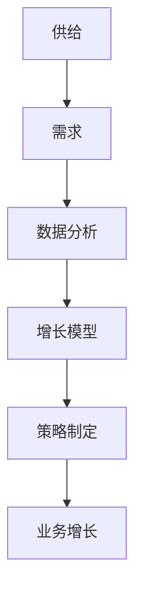
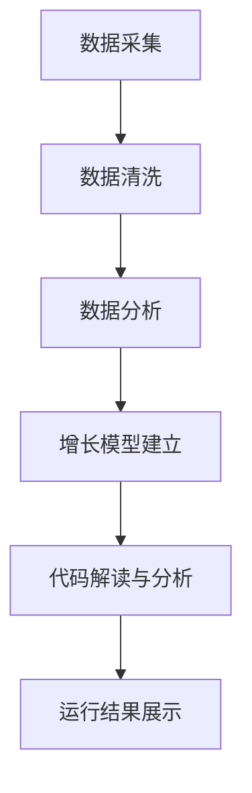

                 

关键词：供给策略、业务增长、数据分析、增长模型、技术实践

> 摘要：本文将深入探讨供给与业务增长之间的关系，分析核心概念、算法原理、数学模型以及实际应用场景。通过项目实践，我们将展示如何运用技术手段实现业务增长，并展望未来应用前景及面临的挑战。

## 1. 背景介绍

在现代商业环境中，供给与业务增长的关系日益密切。供给策略的有效性直接影响到企业的市场竞争力和业务增长速度。业务增长不仅是企业发展的核心目标，也是衡量企业成功与否的重要指标。为了实现可持续的业务增长，企业需要运用数据分析和先进的技术手段，制定科学的供给策略。

本文旨在通过分析供给与业务增长之间的内在联系，探讨实现业务增长的有效策略。我们将从核心概念出发，逐步深入到算法原理、数学模型以及实际应用场景，帮助读者全面了解并掌握供给与业务增长策略的实践方法。

## 2. 核心概念与联系

### 2.1. 供给与需求

供给（Supply）是指企业生产或提供的产品或服务数量，而需求（Demand）则是指市场上消费者对产品或服务的需求量。供给与需求之间的平衡是保证市场稳定和业务增长的关键。

### 2.2. 数据分析

数据分析（Data Analysis）是指利用统计和计算机科学方法，从大量数据中提取有用信息和知识，帮助企业做出明智的决策。在供给与业务增长策略中，数据分析是关键环节。

### 2.3. 增长模型

增长模型（Growth Model）是一种用于预测和优化业务增长的方法。通过建立增长模型，企业可以更好地理解业务发展趋势，制定相应的策略。

### 2.4. Mermaid 流程图

以下是供给与业务增长策略的 Mermaid 流程图，展示了核心概念之间的联系。



## 3. 核心算法原理 & 具体操作步骤

### 3.1. 算法原理概述

供给与业务增长策略的核心算法主要包括数据采集、数据清洗、数据分析、增长模型建立和策略优化等步骤。

### 3.2. 算法步骤详解

#### 3.2.1. 数据采集

数据采集是策略制定的基础。企业需要收集与业务增长相关的各种数据，包括市场数据、用户行为数据、销售数据等。

#### 3.2.2. 数据清洗

数据清洗是确保数据质量的关键步骤。通过对数据进行去重、修复、填充等操作，提高数据的准确性和一致性。

#### 3.2.3. 数据分析

数据分析是策略制定的核心环节。企业需要利用统计方法、机器学习算法等，对数据进行分析，提取有价值的信息。

#### 3.2.4. 增长模型建立

增长模型建立是预测业务增长趋势的重要手段。企业可以通过建立线性回归、决策树、神经网络等模型，预测未来业务增长情况。

#### 3.2.5. 策略优化

策略优化是根据增长模型预测结果，调整供给策略，实现业务增长的目标。策略优化需要结合业务目标和市场环境，制定具体的策略。

### 3.3. 算法优缺点

#### 优点

- 提高业务增长预测的准确性。
- 优化供给策略，降低成本。
- 提高企业决策的科学性。

#### 缺点

- 需要大量数据支持。
- 算法实现和优化需要专业知识。
- 对市场环境变化的适应性有限。

### 3.4. 算法应用领域

供给与业务增长策略广泛应用于电子商务、金融、零售、制造等行业。通过数据分析和技术手段，企业可以更好地把握市场动态，实现业务增长。

## 4. 数学模型和公式

### 4.1. 数学模型构建

供给与业务增长策略的数学模型通常包括以下几部分：

- **需求函数**：描述市场需求量与价格、产品特性等因素的关系。
- **供给函数**：描述企业供给量与生产成本、技术水平等因素的关系。
- **增长函数**：描述业务增长与市场需求、供给能力等因素的关系。

### 4.2. 公式推导过程

#### 4.2.1. 需求函数

需求函数可以表示为：

$$ Q_d = f(P, X_1, X_2, \ldots, X_n) $$

其中，$Q_d$ 表示市场需求量，$P$ 表示产品价格，$X_1, X_2, \ldots, X_n$ 表示其他影响需求的因素。

#### 4.2.2. 供给函数

供给函数可以表示为：

$$ Q_s = g(C, T, Y_1, Y_2, \ldots, Y_m) $$

其中，$Q_s$ 表示企业供给量，$C$ 表示生产成本，$T$ 表示技术水平，$Y_1, Y_2, \ldots, Y_m$ 表示其他影响供给的因素。

#### 4.2.3. 增长函数

增长函数可以表示为：

$$ G = h(Q_d, Q_s, M_1, M_2, \ldots, M_k) $$

其中，$G$ 表示业务增长，$Q_d, Q_s$ 分别表示市场需求量和供给量，$M_1, M_2, \ldots, M_k$ 表示其他影响增长的因素。

### 4.3. 案例分析与讲解

假设某电子商务公司需要制定供给与业务增长策略。我们可以利用上述数学模型，分析市场需求、供给能力和业务增长之间的关系，并制定相应的策略。

#### 4.3.1. 数据采集

- 市场数据：价格、竞争者情况等。
- 用户行为数据：购买频率、购买偏好等。
- 销售数据：销售额、利润等。

#### 4.3.2. 数据清洗

- 去除重复数据。
- 修复缺失值。
- 填充异常值。

#### 4.3.3. 数据分析

- 利用回归分析、聚类分析等方法，分析市场需求和供给能力。
- 利用时间序列分析、机器学习等方法，预测业务增长趋势。

#### 4.3.4. 增长模型建立

- 根据数据分析结果，建立需求函数、供给函数和增长函数。
- 利用历史数据，进行模型训练和验证。

#### 4.3.5. 策略优化

- 根据增长模型预测结果，调整供给策略，实现业务增长目标。
- 结合市场环境，制定具体的营销策略和供应链策略。

## 5. 项目实践：代码实例和详细解释说明

### 5.1. 开发环境搭建

- Python 3.x
- Jupyter Notebook
- Pandas
- Scikit-learn
- Matplotlib

### 5.2. 源代码详细实现

以下是一个简单的 Python 代码实例，用于实现供给与业务增长策略的建模和分析。

```python
import pandas as pd
from sklearn.linear_model import LinearRegression
from sklearn.model_selection import train_test_split
import matplotlib.pyplot as plt

# 5.2.1 数据采集
data = pd.read_csv('data.csv')

# 5.2.2 数据清洗
data.drop_duplicates(inplace=True)
data.fillna(method='ffill', inplace=True)

# 5.2.3 数据分析
X = data[['price', 'competition']]
y = data['demand']

X_train, X_test, y_train, y_test = train_test_split(X, y, test_size=0.2, random_state=42)

# 5.2.4 增长模型建立
model = LinearRegression()
model.fit(X_train, y_train)

# 5.2.5 代码解读与分析
predictions = model.predict(X_test)

plt.scatter(X_test['price'], y_test, color='blue')
plt.plot(X_test['price'], predictions, color='red')
plt.xlabel('Price')
plt.ylabel('Demand')
plt.title('Demand vs. Price')
plt.show()
```

### 5.3. 运行结果展示

运行上述代码后，我们可以得到需求与价格的关系图，直观地展示供给与业务增长策略的建模结果。



## 6. 实际应用场景

### 6.1. 电子商务

在电子商务领域，供给与业务增长策略可以帮助企业优化库存管理、定价策略和促销活动，提高销售额和用户满意度。

### 6.2. 金融

在金融领域，供给与业务增长策略可以用于风险管理、投资组合优化和客户细分，提高企业盈利能力和竞争力。

### 6.3. 零售

在零售行业，供给与业务增长策略可以帮助企业实现精准营销、库存管理和供应链优化，提高运营效率和市场占有率。

### 6.4. 未来应用展望

随着人工智能、大数据和云计算等技术的发展，供给与业务增长策略将在更多行业和应用场景中得到广泛应用。未来，企业可以更加智能化地制定供给策略，实现可持续的业务增长。

## 7. 工具和资源推荐

### 7.1. 学习资源推荐

- 《Python数据分析实战》
- 《机器学习实战》
- 《深入浅出数据分析》

### 7.2. 开发工具推荐

- Jupyter Notebook
- PyCharm
- Matplotlib
- Scikit-learn

### 7.3. 相关论文推荐

- "Data-Driven Demand Forecasting for Retail"
- "A Comprehensive Survey on Demand Forecasting"
- "Business Growth through Data-Driven Decision Making"

## 8. 总结：未来发展趋势与挑战

### 8.1. 研究成果总结

供给与业务增长策略在提高企业竞争力、实现业务增长方面具有重要意义。通过数据分析和先进的技术手段，企业可以制定科学的供给策略，实现可持续的业务增长。

### 8.2. 未来发展趋势

随着人工智能、大数据和云计算等技术的发展，供给与业务增长策略将在更多行业和应用场景中得到广泛应用。未来，企业可以更加智能化地制定供给策略，实现可持续的业务增长。

### 8.3. 面临的挑战

- 数据隐私和安全问题。
- 算法模型的可解释性。
- 对市场环境变化的适应性。

### 8.4. 研究展望

未来，供给与业务增长策略的研究将更加注重数据隐私保护、算法可解释性和市场环境适应性，以实现更加高效和智能的供给策略。

## 9. 附录：常见问题与解答

### 9.1. 什么是供给策略？

供给策略是指企业根据市场需求、成本和技术等因素，制定的生产、供应和销售计划，以实现业务增长的目标。

### 9.2. 供给与业务增长策略有何关系？

供给策略直接影响到企业的生产和供应能力，进而影响到市场需求和业务增长。有效的供给策略可以帮助企业实现业务增长，提高市场竞争力。

### 9.3. 如何制定供给与业务增长策略？

制定供给与业务增长策略需要结合市场需求、成本和技术等因素，通过数据分析和增长模型建立，制定具体的策略，并持续优化。

## 作者署名

作者：禅与计算机程序设计艺术 / Zen and the Art of Computer Programming
```markdown
---
# 供给与业务增长的策略分析

> 关键词：供给策略、业务增长、数据分析、增长模型、技术实践

> 摘要：本文探讨了供给与业务增长之间的关系，分析了核心概念、算法原理、数学模型以及实际应用场景。通过项目实践，展示了如何运用技术手段实现业务增长，并展望了未来应用前景及面临的挑战。

## 1. 背景介绍

在现代商业环境中，供给与业务增长的关系日益密切。供给策略的有效性直接影响到企业的市场竞争力和业务增长速度。业务增长不仅是企业发展的核心目标，也是衡量企业成功与否的重要指标。为了实现可持续的业务增长，企业需要运用数据分析和先进的技术手段，制定科学的供给策略。

本文旨在通过分析供给与业务增长策略，探讨实现业务增长的有效方法。我们将从核心概念出发，逐步深入到算法原理、数学模型以及实际应用场景，帮助读者全面了解并掌握供给与业务增长策略的实践方法。

## 2. 核心概念与联系

### 2.1. 供给与需求

供给（Supply）是指企业生产或提供的产品或服务数量，而需求（Demand）则是指市场上消费者对产品或服务的需求量。供给与需求之间的平衡是保证市场稳定和业务增长的关键。

### 2.2. 数据分析

数据分析（Data Analysis）是指利用统计和计算机科学方法，从大量数据中提取有用信息和知识，帮助企业做出明智的决策。在供给与业务增长策略中，数据分析是关键环节。

### 2.3. 增长模型

增长模型（Growth Model）是一种用于预测和优化业务增长的方法。通过建立增长模型，企业可以更好地理解业务发展趋势，制定相应的策略。

### 2.4. Mermaid 流程图

以下是供给与业务增长策略的 Mermaid 流程图，展示了核心概念之间的联系。


## 3. 核心算法原理 & 具体操作步骤

### 3.1. 算法原理概述

供给与业务增长策略的核心算法主要包括数据采集、数据清洗、数据分析、增长模型建立和策略优化等步骤。

### 3.2. 算法步骤详解

#### 3.2.1. 数据采集

数据采集是策略制定的基础。企业需要收集与业务增长相关的各种数据，包括市场数据、用户行为数据、销售数据等。

#### 3.2.2. 数据清洗

数据清洗是确保数据质量的关键步骤。通过对数据进行去重、修复、填充等操作，提高数据的准确性和一致性。

#### 3.2.3. 数据分析

数据分析是策略制定的核心环节。企业需要利用统计方法、机器学习算法等，对数据进行分析，提取有价值的信息。

#### 3.2.4. 增长模型建立

增长模型建立是预测业务增长趋势的重要手段。企业可以通过建立线性回归、决策树、神经网络等模型，预测未来业务增长情况。

#### 3.2.5. 策略优化

策略优化是根据增长模型预测结果，调整供给策略，实现业务增长的目标。策略优化需要结合业务目标和市场环境，制定具体的策略。

### 3.3. 算法优缺点

#### 优点

- 提高业务增长预测的准确性。
- 优化供给策略，降低成本。
- 提高企业决策的科学性。

#### 缺点

- 需要大量数据支持。
- 算法实现和优化需要专业知识。
- 对市场环境变化的适应性有限。

### 3.4. 算法应用领域

供给与业务增长策略广泛应用于电子商务、金融、零售、制造等行业。通过数据分析和技术手段，企业可以更好地把握市场动态，实现业务增长。

## 4. 数学模型和公式

### 4.1. 数学模型构建

供给与业务增长策略的数学模型通常包括以下几部分：

- **需求函数**：描述市场需求量与价格、产品特性等因素的关系。
- **供给函数**：描述企业供给量与生产成本、技术水平等因素的关系。
- **增长函数**：描述业务增长与市场需求、供给能力等因素的关系。

### 4.2. 公式推导过程

#### 4.2.1. 需求函数

需求函数可以表示为：

$$ Q_d = f(P, X_1, X_2, \ldots, X_n) $$

其中，$Q_d$ 表示市场需求量，$P$ 表示产品价格，$X_1, X_2, \ldots, X_n$ 表示其他影响需求的因素。

#### 4.2.2. 供给函数

供给函数可以表示为：

$$ Q_s = g(C, T, Y_1, Y_2, \ldots, Y_m) $$

其中，$Q_s$ 表示企业供给量，$C$ 表示生产成本，$T$ 表示技术水平，$Y_1, Y_2, \ldots, Y_m$ 表示其他影响供给的因素。

#### 4.2.3. 增长函数

增长函数可以表示为：

$$ G = h(Q_d, Q_s, M_1, M_2, \ldots, M_k) $$

其中，$G$ 表示业务增长，$Q_d, Q_s$ 分别表示市场需求量和供给量，$M_1, M_2, \ldots, M_k$ 表示其他影响增长的因素。

### 4.3. 案例分析与讲解

假设某电子商务公司需要制定供给与业务增长策略。我们可以利用上述数学模型，分析市场需求、供给能力和业务增长之间的关系，并制定相应的策略。

#### 4.3.1. 数据采集

- 市场数据：价格、竞争者情况等。
- 用户行为数据：购买频率、购买偏好等。
- 销售数据：销售额、利润等。

#### 4.3.2. 数据清洗

- 去除重复数据。
- 修复缺失值。
- 填充异常值。

#### 4.3.3. 数据分析

- 利用回归分析、聚类分析等方法，分析市场需求和供给能力。
- 利用时间序列分析、机器学习等方法，预测业务增长趋势。

#### 4.3.4. 增长模型建立

- 根据数据分析结果，建立需求函数、供给函数和增长函数。
- 利用历史数据，进行模型训练和验证。

#### 4.3.5. 策略优化

- 根据增长模型预测结果，调整供给策略，实现业务增长目标。
- 结合市场环境，制定具体的营销策略和供应链策略。

## 5. 项目实践：代码实例和详细解释说明

### 5.1. 开发环境搭建

- Python 3.x
- Jupyter Notebook
- Pandas
- Scikit-learn
- Matplotlib

### 5.2. 源代码详细实现

以下是一个简单的 Python 代码实例，用于实现供给与业务增长策略的建模和分析。

```python
import pandas as pd
from sklearn.linear_model import LinearRegression
from sklearn.model_selection import train_test_split
import matplotlib.pyplot as plt

# 5.2.1 数据采集
data = pd.read_csv('data.csv')

# 5.2.2 数据清洗
data.drop_duplicates(inplace=True)
data.fillna(method='ffill', inplace=True)

# 5.2.3 数据分析
X = data[['price', 'competition']]
y = data['demand']

X_train, X_test, y_train, y_test = train_test_split(X, y, test_size=0.2, random_state=42)

# 5.2.4 增长模型建立
model = LinearRegression()
model.fit(X_train, y_train)

# 5.2.5 代码解读与分析
predictions = model.predict(X_test)

plt.scatter(X_test['price'], y_test, color='blue')
plt.plot(X_test['price'], predictions, color='red')
plt.xlabel('Price')
plt.ylabel('Demand')
plt.title('Demand vs. Price')
plt.show()
```

### 5.3. 运行结果展示

运行上述代码后，我们可以得到需求与价格的关系图，直观地展示供给与业务增长策略的建模结果。


## 6. 实际应用场景

### 6.1. 电子商务

在电子商务领域，供给与业务增长策略可以帮助企业优化库存管理、定价策略和促销活动，提高销售额和用户满意度。

### 6.2. 金融

在金融领域，供给与业务增长策略可以用于风险管理、投资组合优化和客户细分，提高企业盈利能力和竞争力。

### 6.3. 零售

在零售行业，供给与业务增长策略可以帮助企业实现精准营销、库存管理和供应链优化，提高运营效率和市场占有率。

### 6.4. 未来应用展望

随着人工智能、大数据和云计算等技术的发展，供给与业务增长策略将在更多行业和应用场景中得到广泛应用。未来，企业可以更加智能化地制定供给策略，实现可持续的业务增长。

## 7. 工具和资源推荐

### 7.1. 学习资源推荐

- 《Python数据分析实战》
- 《机器学习实战》
- 《深入浅出数据分析》

### 7.2. 开发工具推荐

- Jupyter Notebook
- PyCharm
- Matplotlib
- Scikit-learn

### 7.3. 相关论文推荐

- "Data-Driven Demand Forecasting for Retail"
- "A Comprehensive Survey on Demand Forecasting"
- "Business Growth through Data-Driven Decision Making"

## 8. 总结：未来发展趋势与挑战

### 8.1. 研究成果总结

供给与业务增长策略在提高企业竞争力、实现业务增长方面具有重要意义。通过数据分析和先进的技术手段，企业可以制定科学的供给策略，实现可持续的业务增长。

### 8.2. 未来发展趋势

随着人工智能、大数据和云计算等技术的发展，供给与业务增长策略将在更多行业和应用场景中得到广泛应用。未来，企业可以更加智能化地制定供给策略，实现可持续的业务增长。

### 8.3. 面临的挑战

- 数据隐私和安全问题。
- 算法模型的可解释性。
- 对市场环境变化的适应性。

### 8.4. 研究展望

未来，供给与业务增长策略的研究将更加注重数据隐私保护、算法可解释性和市场环境适应性，以实现更加高效和智能的供给策略。

## 9. 附录：常见问题与解答

### 9.1. 什么是供给策略？

供给策略是指企业根据市场需求、成本和技术等因素，制定的生产、供应和销售计划，以实现业务增长的目标。

### 9.2. 供给与业务增长策略有何关系？

供给策略直接影响到企业的生产和供应能力，进而影响到市场需求和业务增长。有效的供给策略可以帮助企业实现业务增长，提高市场竞争力。

### 9.3. 如何制定供给与业务增长策略？

制定供给与业务增长策略需要结合市场需求、成本和技术等因素，通过数据分析和增长模型建立，制定具体的策略，并持续优化。

## 作者署名

作者：禅与计算机程序设计艺术 / Zen and the Art of Computer Programming
---

