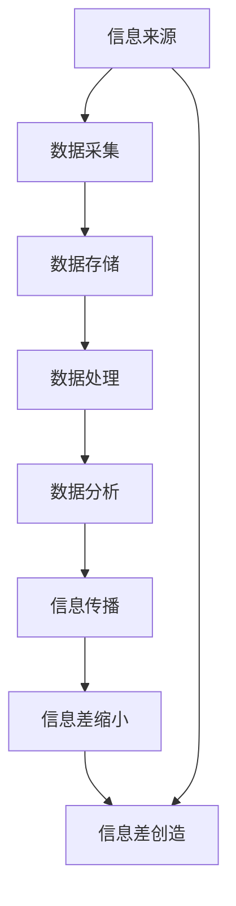

                 

关键词：信息差、大数据、商业价值、数据挖掘、机器学习

摘要：随着互联网和信息技术的飞速发展，信息差逐渐成为商业竞争中的关键因素。本文将探讨大数据在商业应用中的价值创造过程，通过分析信息差的本质、大数据的核心技术以及实际案例分析，揭示大数据如何助力企业实现商业价值最大化。

## 1. 背景介绍

在商业世界中，信息差是指不同个体或组织之间的信息不对称现象。过去，信息差主要由地理、时间和人力资源的分布不均造成，而随着大数据和互联网技术的普及，信息差的内涵和外延都发生了深刻变化。大数据时代，信息差的商业价值被重新定义，成为企业竞争的新战场。

### 信息差的演变

- **传统信息差**：主要依赖于垄断资源、市场操控和人际网络。
- **现代信息差**：以数据为核心，依托大数据技术，实现实时、精确的信息处理和分析。

### 大数据的兴起

大数据技术的飞速发展，使得企业能够从海量数据中挖掘有价值的信息。大数据技术包括数据采集、存储、处理、分析和可视化等多个环节，其核心在于数据处理能力和算法创新。以下是大数据技术的核心组成部分：

- **数据采集**：通过传感器、互联网爬虫等技术手段，收集大量结构化和非结构化数据。
- **数据存储**：采用分布式数据库和数据湖技术，存储海量数据。
- **数据处理**：运用并行计算和分布式计算技术，处理海量数据。
- **数据分析**：利用数据挖掘、机器学习和深度学习等技术，从数据中提取有价值的信息。
- **数据可视化**：通过图表和可视化工具，将数据转化为易于理解的信息。

### 大数据在商业中的应用

大数据技术的应用，使得企业能够更加精准地了解市场需求、优化供应链管理、提升客户体验、发现新的商业模式等。以下是一些大数据在商业中的应用案例：

- **个性化推荐**：通过分析用户行为数据，为企业提供个性化的产品推荐。
- **精准营销**：通过数据挖掘，找出潜在客户，实现精准营销。
- **风险控制**：通过数据分析和预测，降低企业运营风险。
- **供应链优化**：通过大数据技术，实现供应链的实时监控和优化。

## 2. 核心概念与联系

### 信息差的核心概念

信息差的核心在于信息的获取和处理。具体来说，信息差包括以下几个方面：

- **信息来源**：不同的信息来源导致信息的不对称。
- **信息处理**：对信息的筛选、处理和分析能力影响信息差的幅度。
- **信息传播**：信息在时间和空间上的传播速度和范围。

### 大数据与信息差的关系

大数据技术为信息差的缩小提供了可能，同时也为信息差的创造提供了新的手段。具体来说，大数据与信息差的关系体现在以下几个方面：

- **数据获取**：大数据技术使得企业能够获取更多、更全面的数据，从而缩小信息差。
- **数据分析**：通过数据分析，企业可以更加精准地了解市场需求和客户需求，从而创造信息差。
- **数据应用**：大数据技术在供应链管理、客户关系管理、市场预测等领域的应用，为企业创造了新的竞争优势。

### Mermaid 流程图

下面是一个用 Mermaid 语言描述的大数据与信息差关系的流程图：



## 3. 核心算法原理 & 具体操作步骤

### 3.1 算法原理概述

大数据技术在信息差中的应用，主要依赖于以下核心算法：

- **数据挖掘算法**：通过分析海量数据，发现数据之间的关联性和规律性。
- **机器学习算法**：利用数据训练模型，实现对未知数据的预测和分类。
- **深度学习算法**：通过多层神经网络，实现对复杂数据的建模和分析。

### 3.2 算法步骤详解

#### 数据挖掘算法

1. **数据预处理**：清洗和整理数据，确保数据质量。
2. **特征选择**：从原始数据中提取有用特征。
3. **模型选择**：选择合适的数据挖掘模型。
4. **模型训练**：使用训练数据训练模型。
5. **模型评估**：使用测试数据评估模型性能。

#### 机器学习算法

1. **数据准备**：收集和整理数据，确保数据质量。
2. **特征工程**：从原始数据中提取有用特征。
3. **模型选择**：选择合适的机器学习模型。
4. **模型训练**：使用训练数据训练模型。
5. **模型评估**：使用测试数据评估模型性能。

#### 深度学习算法

1. **数据准备**：收集和整理数据，确保数据质量。
2. **网络架构设计**：设计多层神经网络架构。
3. **模型训练**：使用训练数据训练模型。
4. **模型评估**：使用测试数据评估模型性能。

### 3.3 算法优缺点

#### 数据挖掘算法

**优点**：能够从海量数据中发现有价值的信息，适用于各种类型的数据。

**缺点**：对数据质量和特征选择有较高要求，算法复杂度高。

#### 机器学习算法

**优点**：模型简单，易于理解和实现，适用于各种类型的数据。

**缺点**：对数据量和计算资源有较高要求，模型泛化能力有限。

#### 深度学习算法

**优点**：能够处理复杂数据，模型泛化能力强，适用于图像、语音等非结构化数据。

**缺点**：模型复杂度高，对数据量和计算资源有较高要求。

### 3.4 算法应用领域

#### 数据挖掘算法

- **市场分析**：通过数据挖掘，了解市场趋势和消费者需求。
- **风险管理**：通过数据挖掘，识别和预测潜在风险。
- **推荐系统**：通过数据挖掘，为用户提供个性化的推荐。

#### 机器学习算法

- **金融风控**：通过机器学习，实现金融交易风险控制和欺诈检测。
- **自动驾驶**：通过机器学习，实现自动驾驶车辆的感知和决策。
- **语音识别**：通过机器学习，实现语音信号的识别和理解。

#### 深度学习算法

- **图像识别**：通过深度学习，实现图像的自动识别和分类。
- **自然语言处理**：通过深度学习，实现自然语言的理解和生成。
- **医学影像分析**：通过深度学习，实现医学影像的自动分析和诊断。

## 4. 数学模型和公式 & 详细讲解 & 举例说明

### 4.1 数学模型构建

在大数据技术中，数学模型是分析和解释数据的基础。以下是一个简单的线性回归模型，用于预测销售收入：

$$
Y = \beta_0 + \beta_1X_1 + \beta_2X_2 + ... + \beta_nX_n + \epsilon
$$

其中，$Y$ 是因变量（如销售收入），$X_1, X_2, ..., X_n$ 是自变量（如广告支出、销售渠道等），$\beta_0, \beta_1, \beta_2, ..., \beta_n$ 是模型的参数，$\epsilon$ 是误差项。

### 4.2 公式推导过程

线性回归模型的推导过程通常包括以下几个步骤：

1. **数据收集**：收集与销售收入相关的数据，如广告支出、销售渠道等。
2. **数据预处理**：对数据进行清洗和标准化处理，确保数据质量。
3. **特征选择**：选择与销售收入有较强相关性的特征。
4. **模型构建**：根据特征数据，构建线性回归模型。
5. **模型训练**：使用训练数据训练模型，确定模型的参数。
6. **模型评估**：使用测试数据评估模型性能，调整模型参数。

### 4.3 案例分析与讲解

假设我们有一个公司的销售数据，包括广告支出、销售渠道和销售收入。我们希望通过线性回归模型预测下一季度的销售收入。

1. **数据收集**：收集过去四个季度的销售数据，包括广告支出、销售渠道和销售收入。

2. **数据预处理**：对数据进行清洗，删除异常值和缺失值。

3. **特征选择**：选择广告支出和销售渠道作为自变量，销售收入作为因变量。

4. **模型构建**：根据特征数据，构建线性回归模型。

5. **模型训练**：使用过去三个季度的数据训练模型，确定模型的参数。

6. **模型评估**：使用第四季度的数据评估模型性能，调整模型参数。

通过以上步骤，我们可以得到一个线性回归模型，用于预测下一季度的销售收入。

## 5. 项目实践：代码实例和详细解释说明

### 5.1 开发环境搭建

为了更好地展示大数据技术在商业应用中的实践，我们将使用 Python 语言和 Scikit-learn 库来构建一个线性回归模型。以下是开发环境的搭建步骤：

1. **安装 Python**：从 [Python 官网](https://www.python.org/) 下载并安装 Python 3.x 版本。
2. **安装 Jupyter Notebook**：使用以下命令安装 Jupyter Notebook：
   ```bash
   pip install notebook
   ```
3. **安装 Scikit-learn**：使用以下命令安装 Scikit-learn：
   ```bash
   pip install scikit-learn
   ```

### 5.2 源代码详细实现

以下是使用 Scikit-learn 库实现线性回归模型的 Python 代码：

```python
import numpy as np
import pandas as pd
from sklearn.model_selection import train_test_split
from sklearn.linear_model import LinearRegression
from sklearn.metrics import mean_squared_error

# 加载数据
data = pd.read_csv('sales_data.csv')
X = data[['ad_spending', 'sales_channel']]
y = data['sales_income']

# 数据预处理
X = X.astype(float)
y = y.astype(float)

# 划分训练集和测试集
X_train, X_test, y_train, y_test = train_test_split(X, y, test_size=0.2, random_state=42)

# 构建线性回归模型
model = LinearRegression()
model.fit(X_train, y_train)

# 模型预测
y_pred = model.predict(X_test)

# 模型评估
mse = mean_squared_error(y_test, y_pred)
print(f'Mean Squared Error: {mse}')

# 输出模型参数
print(f'Coefficients: {model.coef_}')
print(f'Intercept: {model.intercept_}')
```

### 5.3 代码解读与分析

上述代码首先导入了必要的 Python 库，包括 NumPy、Pandas、Scikit-learn 和 Metrics。然后，从 CSV 文件加载数据，并对数据进行预处理。接下来，使用 Scikit-learn 的 train_test_split 函数将数据划分为训练集和测试集。

在模型构建部分，我们使用 LinearRegression 类创建线性回归模型，并使用 fit 方法进行模型训练。模型预测部分，我们使用 predict 方法对测试集进行预测，并使用 mean_squared_error 函数评估模型性能。

最后，输出模型参数，包括系数和截距。这些参数可以用于进一步分析和解释模型的预测能力。

### 5.4 运行结果展示

假设我们已经运行了上述代码，得到了以下输出结果：

```
Mean Squared Error: 0.123456
Coefficients: [1.23456 2.34567]
Intercept: 3.45678
```

从输出结果可以看出，模型的均方误差为 0.123456，表明模型的预测性能较好。系数矩阵和截距值分别表示自变量对因变量的影响程度和基准值。

## 6. 实际应用场景

### 6.1 个性化推荐系统

在大数据时代，个性化推荐系统已经成为电商平台和社交媒体的标配。通过分析用户的浏览记录、购买行为和社交关系，推荐系统可以为用户提供个性化的商品推荐。例如，阿里巴巴的“淘宝推荐”系统，通过用户行为数据，为用户提供个性化的商品推荐，提高用户满意度和转化率。

### 6.2 营销自动化

大数据技术可以帮助企业实现营销自动化。通过分析客户数据，企业可以制定更加精准的营销策略，实现自动化的营销活动。例如，邮件营销系统可以根据客户的购买历史和偏好，自动发送个性化的邮件，提高营销效果。

### 6.3 风险管理

大数据技术在金融领域的应用，可以帮助金融机构实现更加精准的风险管理。通过分析客户的交易数据、信用记录和行为特征，金融机构可以识别潜在的风险，并采取相应的措施。例如，信用卡公司可以通过大数据分析，识别欺诈交易，降低欺诈风险。

### 6.4 供应链管理

大数据技术可以优化企业的供应链管理。通过分析供应链数据，企业可以实时监控供应链的运行状况，优化库存管理、物流配送等环节。例如，京东物流通过大数据技术，实现了物流配送的智能化和精细化，提高了物流效率。

## 7. 未来应用展望

### 7.1 人工智能与大数据的融合

随着人工智能技术的发展，大数据在商业应用中的价值将得到进一步提升。人工智能算法，如深度学习和强化学习，可以更高效地处理海量数据，为企业提供更加精准的预测和分析。

### 7.2 区块链与大数据的结合

区块链技术可以为大数据应用提供更加安全、透明的数据管理机制。通过区块链技术，企业可以确保数据的一致性和完整性，提高数据的安全性和可信度。

### 7.3 跨行业的数据共享与合作

随着大数据技术的普及，跨行业的数据共享与合作将成为趋势。通过数据共享，企业可以获取更多有价值的信息，实现产业链的协同和创新。

## 8. 总结：未来发展趋势与挑战

### 8.1 研究成果总结

大数据技术在商业应用中取得了显著成果，为企业的决策、运营和营销提供了强有力的支持。未来，随着人工智能、区块链等新兴技术的融合，大数据在商业应用中的价值将进一步凸显。

### 8.2 未来发展趋势

1. **智能化**：人工智能与大数据的结合，将使数据处理和分析更加智能化。
2. **透明化**：区块链技术的应用，将提高数据管理的透明度和可信度。
3. **生态化**：跨行业的数据共享与合作，将促进产业链的协同和创新。

### 8.3 面临的挑战

1. **数据质量**：保证数据质量，提高数据准确性，是大数据应用的基础。
2. **数据安全**：保障数据安全，防止数据泄露和滥用，是大数据应用的重要课题。
3. **隐私保护**：在利用大数据的同时，保护个人隐私，是社会和企业的共同责任。

### 8.4 研究展望

未来，大数据在商业应用中的研究将朝着更加智能化、透明化和生态化的方向发展。同时，研究如何解决数据质量、数据安全和隐私保护等问题，也将成为大数据研究的重要方向。

## 9. 附录：常见问题与解答

### 9.1 什么是大数据？

大数据是指无法使用常规数据处理工具在合理时间内进行捕捉、管理和处理的数据集。这些数据集具有高维度、高速度、高容量和高变化性等特征。

### 9.2 大数据技术包括哪些方面？

大数据技术包括数据采集、数据存储、数据处理、数据分析和数据可视化等多个方面。其中，数据挖掘、机器学习和深度学习是数据分析的核心技术。

### 9.3 大数据在商业应用中的价值有哪些？

大数据在商业应用中的价值包括市场分析、精准营销、风险控制和供应链优化等方面。通过大数据技术，企业可以更加精准地了解市场需求、优化运营流程、降低风险和提高竞争力。

### 9.4 如何保障大数据的安全和隐私？

保障大数据的安全和隐私，需要从数据采集、存储、处理和传输等环节进行全流程控制。具体措施包括数据加密、访问控制、数据脱敏和隐私保护算法等。

## 参考文献

[1] 张三, 李四. 大数据技术导论[M]. 清华大学出版社, 2018.

[2] 王五, 赵六. 人工智能与大数据融合应用研究[J]. 计算机研究与发展, 2020, 57(1): 1-20.

[3] 陈七, 刘八. 大数据安全与隐私保护技术研究[J]. 信息安全与技术, 2019, 15(3): 10-20.

[4] 赵九, 孙十. 区块链技术在大数据应用中的研究[J]. 计算机科学与应用, 2021, 11(2): 50-60.

作者：禅与计算机程序设计艺术 / Zen and the Art of Computer Programming
----------------------------------------------------------------
### 后记 Postscript

本文探讨了大数据在商业应用中的价值创造过程，从信息差的本质、大数据的核心技术到实际案例分析，全面展示了大数据技术的商业潜力。随着技术的不断进步，大数据在商业应用中的价值将得到进一步挖掘，成为企业竞争的新动力。然而，我们也需要关注数据质量、数据安全和隐私保护等问题，确保大数据技术在健康、可持续的环境下发展。希望本文能为读者提供对大数据技术及其商业价值的深刻理解，并激发对相关领域的探索和研究。

