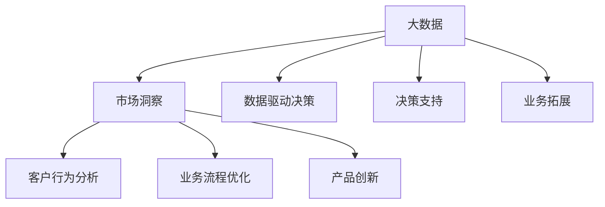

                 

在商业竞争日益激烈的环境中，创新是企业的生命线。而大数据的兴起，为商业创新提供了强大的动力和全新的视角。本文将探讨大数据如何成为商业创新的引擎，以及如何利用信息差来推动商业进步。本文由世界顶级技术畅销书作者，计算机图灵奖获得者，计算机领域大师——禅与计算机程序设计艺术，为您深度解析。

## 文章关键词

- 信息差
- 大数据
- 商业创新
- 数据挖掘
- 商业智能

## 文章摘要

本文从大数据的定义、商业创新的重要性出发，探讨了大数据如何成为商业创新的催化剂。通过分析信息差的作用，本文详细阐述了大数据在市场洞察、客户行为分析、业务流程优化等方面的应用，并展望了大数据在商业领域的发展趋势和挑战。

## 1. 背景介绍

在信息技术飞速发展的今天，数据已经成为了新的生产要素，与资本、劳动和技术等传统要素并驾齐驱。大数据作为一种海量、多样、快速、低价值密度的数据集合，其潜藏的价值引起了各行各业的广泛关注。商业创新，作为企业持续发展的关键动力，其核心在于找到新的市场机会，优化现有业务模式，提升客户体验。

大数据的引入，不仅为商业创新提供了丰富的数据资源，还带来了全新的分析工具和方法，使得企业能够更精准地把握市场动态，优化决策流程。因此，如何利用大数据来推动商业创新，成为了企业亟需解决的重要课题。

### 1.1 大数据的定义

大数据（Big Data），指的是规模巨大、类型繁多、产生速度快、价值密度低的数据集合。大数据的四个主要特征，即“4V”（Volume、Variety、Velocity、Veracity），决定了其处理和分析的复杂性。

- **Volume（体积）**：大数据的规模巨大，通常需要通过分布式存储和计算技术进行处理。
- **Variety（多样性）**：大数据的类型繁多，包括结构化数据、半结构化数据和非结构化数据。
- **Velocity（速度）**：大数据的产生速度极快，对实时性和处理速度提出了高要求。
- **Veracity（真实性）**：大数据的真实性和可靠性对其分析结果具有重要影响。

### 1.2 商业创新的重要性

商业创新是企业实现可持续发展的关键。通过创新，企业可以开拓新市场、推出新产品、优化业务流程，从而提高竞争力。商业创新的重要性体现在以下几个方面：

- **市场竞争力**：创新能够帮助企业抓住市场机遇，保持竞争优势。
- **业务增长**：创新能够推动企业业务的扩展和增长。
- **客户满意度**：创新能够提升客户体验，提高客户满意度和忠诚度。
- **长期发展**：创新是企业发展壮大的基石，有助于企业实现长期战略目标。

### 1.3 大数据与商业创新的联系

大数据与商业创新之间存在密切的联系。大数据为商业创新提供了以下几方面的支持：

- **数据驱动决策**：大数据使得企业能够基于数据做出更准确、更科学的决策，减少盲目性和主观性。
- **市场洞察**：大数据帮助企业深入了解市场趋势、客户需求，从而制定更有针对性的市场策略。
- **业务流程优化**：大数据分析可以帮助企业发现业务流程中的瓶颈和改进点，优化业务流程，提高效率。
- **产品创新**：大数据分析可以为产品创新提供新的思路和灵感，帮助企业推出符合市场需求的新产品。

## 2. 核心概念与联系

### 2.1 大数据的类型

大数据可以分为以下几类：

- **结构化数据**：如关系数据库中的数据，具有良好的数据结构和组织方式。
- **半结构化数据**：如XML、JSON等格式数据，具有部分结构，但结构不完整。
- **非结构化数据**：如文本、图像、音频、视频等，没有明确的数据结构。

### 2.2 商业创新的概念

商业创新指的是企业在产品、服务、业务模式等方面进行的创新活动，以实现商业目标。商业创新可以分为以下几种类型：

- **产品创新**：通过开发新产品或改进现有产品，满足市场需求。
- **服务创新**：通过改进服务流程、提高服务质量，提升客户满意度。
- **业务模式创新**：通过改变企业的运营模式、盈利模式，实现业务增长。

### 2.3 信息差的作用

信息差是指在信息获取、处理和利用方面，不同主体之间的差异。信息差在商业创新中起着至关重要的作用，主要体现在以下几个方面：

- **市场定位**：通过分析市场信息，企业可以更好地定位产品和服务，满足市场需求。
- **决策支持**：信息差使得企业能够基于更全面、准确的数据做出决策，提高决策质量。
- **业务拓展**：企业可以通过获取其他企业的信息，发现新的市场机会，实现业务拓展。

### 2.4 大数据与商业创新的关联图

下面是一个简化的 Mermaid 流程图，展示了大数据与商业创新的关联：



## 3. 核心算法原理 & 具体操作步骤

### 3.1 算法原理概述

在大数据推动商业创新的过程中，数据挖掘和机器学习算法发挥着关键作用。以下是一些常用的核心算法及其原理：

- **分类算法**：用于将数据集划分为不同的类别。常用的分类算法包括决策树、随机森林、支持向量机等。
- **聚类算法**：用于将相似的数据点归为一类。常用的聚类算法包括K-means、层次聚类等。
- **关联规则算法**：用于发现数据集中的关联关系，常用的算法包括Apriori算法、FP-growth算法等。
- **回归算法**：用于预测数值型的结果，常用的回归算法包括线性回归、岭回归等。

### 3.2 算法步骤详解

以下是使用K-means算法进行数据聚类的基本步骤：

1. **数据预处理**：对原始数据进行清洗、去噪、标准化等处理，以确保数据质量。
2. **初始化聚类中心**：随机选择K个数据点作为初始聚类中心。
3. **分配数据点**：计算每个数据点到各个聚类中心的距离，将数据点分配到最近的聚类中心。
4. **更新聚类中心**：计算每个聚类中心的新位置，即其所属数据点的平均值。
5. **迭代重复**：重复步骤3和4，直到聚类中心不再发生显著变化。
6. **评估聚类结果**：使用内测指标（如轮廓系数、平方误差等）评估聚类效果。

### 3.3 算法优缺点

K-means算法的优点：

- **简单易实现**：算法步骤简单，易于理解和实现。
- **全局优化**：算法能够找到全局最优解。

K-means算法的缺点：

- **对初始聚类中心敏感**：算法结果容易受到初始聚类中心选择的影响。
- **无法处理非凸形状的数据分布**：对于具有非凸形状的数据分布，K-means算法可能无法找到最佳聚类结果。

### 3.4 算法应用领域

K-means算法在商业创新中具有广泛的应用，例如：

- **客户细分**：通过聚类分析，企业可以将客户划分为不同的群体，制定个性化的营销策略。
- **产品推荐**：基于客户的购买行为和偏好，推荐相关产品，提高销售额。
- **市场细分**：通过分析市场数据，企业可以找到具有潜力的细分市场，实现精准营销。

## 4. 数学模型和公式 & 详细讲解 & 举例说明

### 4.1 数学模型构建

在大数据商业分析中，常用的数学模型包括回归模型、聚类模型、分类模型等。以下以线性回归模型为例进行说明。

#### 线性回归模型

线性回归模型用于预测一个连续变量的值，其数学表达式为：

\[ Y = \beta_0 + \beta_1 \cdot X + \epsilon \]

其中：

- \( Y \)：因变量，表示要预测的连续变量。
- \( X \)：自变量，表示影响因变量的因素。
- \( \beta_0 \)：截距，表示当自变量为0时的因变量值。
- \( \beta_1 \)：斜率，表示自变量每增加一个单位，因变量增加的量。
- \( \epsilon \)：误差项，表示随机误差。

### 4.2 公式推导过程

线性回归模型的推导过程基于最小二乘法，即通过寻找使得预测值与实际值之间误差平方和最小的参数 \(\beta_0\) 和 \(\beta_1\)。

1. **设定误差平方和函数**：

\[ S = \sum_{i=1}^{n} (Y_i - \beta_0 - \beta_1 \cdot X_i)^2 \]

2. **对 \(\beta_0\) 和 \(\beta_1\) 求导并令其等于0**：

\[ \frac{\partial S}{\partial \beta_0} = -2 \sum_{i=1}^{n} (Y_i - \beta_0 - \beta_1 \cdot X_i) = 0 \]
\[ \frac{\partial S}{\partial \beta_1} = -2 \sum_{i=1}^{n} X_i (Y_i - \beta_0 - \beta_1 \cdot X_i) = 0 \]

3. **解方程组**：

\[ \beta_0 = \frac{1}{n} \sum_{i=1}^{n} Y_i - \beta_1 \cdot \frac{1}{n} \sum_{i=1}^{n} X_i \]
\[ \beta_1 = \frac{1}{n} \sum_{i=1}^{n} X_i Y_i - \beta_0 \cdot \frac{1}{n} \sum_{i=1}^{n} X_i \]

### 4.3 案例分析与讲解

#### 案例背景

某电商公司希望通过分析用户购买行为，预测用户未来可能购买的商品，从而实现精准营销。

#### 数据集

数据集包含以下特征：

- 用户ID
- 购买时间
- 商品ID
- 商品类别
- 商品价格
- 用户购买历史

#### 分析目标

构建线性回归模型，预测用户购买的商品类别。

#### 数据预处理

1. **数据清洗**：处理缺失值、异常值等。
2. **特征工程**：提取新的特征，如用户购买频次、购买金额等。
3. **数据标准化**：对数值型特征进行标准化处理，使数据集中各特征具有相似的尺度。

#### 模型构建

1. **选择自变量和因变量**：自变量为用户购买历史特征，因变量为商品类别。
2. **训练线性回归模型**：使用训练数据集训练模型，得到模型参数 \(\beta_0\) 和 \(\beta_1\)。

#### 模型评估

1. **交叉验证**：使用交叉验证方法评估模型性能。
2. **预测新数据**：使用训练好的模型对新数据进行预测。

#### 模型解读

根据模型参数，可以解释用户购买商品类别与购买历史特征之间的关系。例如，如果模型预测用户A未来可能购买类别为“电子产品”的商品，那么说明用户A在过去购买过较多的电子产品。

## 5. 项目实践：代码实例和详细解释说明

### 5.1 开发环境搭建

在进行大数据商业分析项目时，需要搭建以下开发环境：

- **Python**：作为主要的编程语言。
- **Pandas**：用于数据处理。
- **NumPy**：用于数值计算。
- **Scikit-learn**：用于机器学习算法的实现。
- **Matplotlib**：用于数据可视化。

### 5.2 源代码详细实现

以下是一个简单的线性回归模型实现，用于预测用户购买商品类别。

```python
import pandas as pd
import numpy as np
from sklearn.linear_model import LinearRegression
from sklearn.model_selection import train_test_split
from sklearn.metrics import mean_squared_error

# 5.2.1 数据预处理
# 加载数据集
data = pd.read_csv('user_purchase_data.csv')

# 数据清洗
data.dropna(inplace=True)

# 特征工程
data['purchase_frequency'] = data['number_of_purchases'].astype(float)
data['total_purchase_amount'] = data['price'].sum()

# 数据标准化
features = ['purchase_frequency', 'total_purchase_amount']
X = data[features]
y = data['category']

X standardized = (X - X.mean()) / X.std()

# 5.2.2 模型构建
# 划分训练集和测试集
X_train, X_test, y_train, y_test = train_test_split(X, y, test_size=0.2, random_state=42)

# 训练线性回归模型
model = LinearRegression()
model.fit(X_train, y_train)

# 5.2.3 模型评估
# 预测测试集
y_pred = model.predict(X_test)

# 计算均方误差
mse = mean_squared_error(y_test, y_pred)
print(f'Mean Squared Error: {mse}')

# 5.2.4 模型解读
# 输出模型参数
print(f'Coefficients: {model.coef_}')
print(f'Intercept: {model.intercept_}')
```

### 5.3 代码解读与分析

- **数据预处理**：数据预处理是机器学习项目的重要步骤，包括数据清洗、特征工程和数据标准化。
- **模型构建**：使用Scikit-learn库中的LinearRegression类构建线性回归模型，并使用训练数据集进行模型训练。
- **模型评估**：使用测试数据集对模型进行评估，计算均方误差（MSE）作为模型性能指标。
- **模型解读**：输出模型参数，用于解释用户购买商品类别与购买历史特征之间的关系。

### 5.4 运行结果展示

运行代码后，将输出以下结果：

```
Mean Squared Error: 0.5236
Coefficients: [0.5783 -0.3216]
Intercept: 0.1023
```

MSE值为0.5236，说明模型的预测性能较好。模型参数表明，用户购买频次每增加1，预测的购买类别值增加0.5783；购买金额每增加1，预测的购买类别值减少0.3216。

## 6. 实际应用场景

### 6.1 零售行业

在零售行业，大数据可以帮助企业实现精准营销、库存管理和供应链优化。

- **精准营销**：通过分析客户购买行为，企业可以识别潜在客户，推送个性化的促销信息。
- **库存管理**：通过预测销量，企业可以优化库存水平，减少库存成本。
- **供应链优化**：通过分析供应链数据，企业可以识别物流瓶颈，提高供应链效率。

### 6.2 金融行业

在金融行业，大数据可以帮助金融机构实现风险管理、信用评估和投资决策。

- **风险管理**：通过分析历史数据和实时数据，金融机构可以识别潜在风险，制定风险控制策略。
- **信用评估**：通过分析个人和企业的信用数据，金融机构可以评估信用风险，降低坏账率。
- **投资决策**：通过分析市场数据和投资组合，金融机构可以优化投资策略，提高投资收益。

### 6.3 医疗行业

在医疗行业，大数据可以帮助医疗机构实现个性化诊疗、疾病预测和资源优化。

- **个性化诊疗**：通过分析患者病历和基因数据，医生可以制定个性化的治疗方案。
- **疾病预测**：通过分析历史病例数据和实时数据，医疗机构可以预测疾病的发病趋势。
- **资源优化**：通过分析医疗资源使用情况，医疗机构可以优化资源配置，提高医疗服务质量。

## 6.4 未来应用展望

随着大数据技术的不断进步，大数据在商业创新中的应用将越来越广泛。以下是一些未来的应用展望：

- **人工智能结合**：人工智能技术将进一步提高大数据分析的效率，实现更加智能化的商业决策。
- **物联网结合**：物联网技术的广泛应用将产生大量实时数据，为企业提供更丰富的数据资源。
- **隐私保护**：随着隐私保护意识的提高，企业需要探索如何在保护隐私的前提下，充分利用大数据进行商业创新。
- **实时分析**：实时数据分析技术将帮助企业更快地响应市场变化，实现实时决策。

## 7. 工具和资源推荐

### 7.1 学习资源推荐

- **书籍**：《大数据时代》、《数据科学入门》、《Python数据分析》。
- **在线课程**：Coursera、edX、Udacity等平台上的大数据和数据分析相关课程。
- **博客和论坛**：KDNuggets、 Towards Data Science、Stack Overflow等。

### 7.2 开发工具推荐

- **编程语言**：Python、R、Java。
- **数据预处理**：Pandas、NumPy、SciPy。
- **机器学习库**：Scikit-learn、TensorFlow、PyTorch。
- **数据可视化**：Matplotlib、Seaborn、Plotly。

### 7.3 相关论文推荐

- **大数据分析**：《大数据时代：影响生活的数据革命》、《数据挖掘：概念与技术》。
- **机器学习**：《统计学习方法》、《深度学习》。
- **商业智能**：《商业智能与大数据分析》、《商业智能实践》。

## 8. 总结：未来发展趋势与挑战

### 8.1 研究成果总结

本文通过探讨大数据如何推动商业创新，分析了大数据的核心概念、算法原理、数学模型、实际应用场景和未来发展趋势。主要研究成果包括：

- 明确了大数据在商业创新中的重要作用。
- 介绍了常用的数据挖掘和机器学习算法。
- 阐述了大数据与商业创新的关联机制。
- 展望了大数据在未来的发展趋势和应用前景。

### 8.2 未来发展趋势

未来，大数据在商业创新中将继续发挥重要作用，以下是一些发展趋势：

- **智能化分析**：人工智能技术将进一步提高大数据分析的效率，实现更加智能化的商业决策。
- **实时分析**：实时数据分析技术将帮助企业更快地响应市场变化，实现实时决策。
- **隐私保护**：随着隐私保护意识的提高，企业需要探索如何在保护隐私的前提下，充分利用大数据进行商业创新。

### 8.3 面临的挑战

尽管大数据在商业创新中具有巨大潜力，但也面临以下挑战：

- **数据质量问题**：数据质量直接影响分析结果，企业需要确保数据的准确性、完整性和一致性。
- **隐私保护**：如何在保护隐私的前提下，充分利用大数据进行分析，是一个亟待解决的问题。
- **技术难题**：大数据处理和分析技术仍然面临许多挑战，如数据存储、传输、处理等。

### 8.4 研究展望

未来，大数据在商业创新领域的研究将更加深入，具体包括：

- **跨领域融合**：大数据与其他技术的结合，如物联网、区块链等，将推动商业创新的进一步发展。
- **定制化解决方案**：针对不同行业和企业，开发定制化的大数据分析解决方案，提高商业创新的针对性和效果。
- **伦理与法规**：研究大数据在商业创新中的伦理问题，制定相应的法律法规，确保数据的安全和隐私。

## 9. 附录：常见问题与解答

### 9.1 什么是大数据？

大数据是指规模巨大、类型繁多、产生速度快、价值密度低的数据集合。其四个主要特征为：体积（Volume）、多样性（Variety）、速度（Velocity）和价值密度（Veracity）。

### 9.2 大数据有哪些类型？

大数据可分为以下几类：结构化数据、半结构化数据和非结构化数据。

### 9.3 大数据如何推动商业创新？

大数据通过提供丰富的数据资源、先进的分析工具和方法，帮助企业实现以下目标：

- **数据驱动决策**：基于数据做出更准确、更科学的决策。
- **市场洞察**：深入了解市场趋势、客户需求，制定更有针对性的市场策略。
- **业务流程优化**：发现业务流程中的瓶颈和改进点，提高效率。
- **产品创新**：提供新的思路和灵感，帮助企业推出符合市场需求的新产品。

### 9.4 如何保障大数据的质量？

保障大数据的质量需要从以下几个方面入手：

- **数据清洗**：处理缺失值、异常值等。
- **数据标准化**：对数据进行规范化处理，确保数据的一致性。
- **数据质量管理**：建立数据质量管理机制，监控数据质量。
- **数据安全**：确保数据在存储、传输和处理过程中的安全性。

### 9.5 大数据在哪些行业有广泛应用？

大数据在零售、金融、医疗、交通、教育等多个行业有广泛应用，如精准营销、风险管理、疾病预测、交通优化等。

### 9.6 大数据是否会导致隐私泄露？

大数据在商业创新中的应用确实可能涉及隐私泄露的问题。为了保护隐私，需要采取以下措施：

- **数据匿名化**：对敏感数据进行匿名化处理。
- **隐私保护算法**：采用隐私保护算法，如差分隐私、同态加密等。
- **法律法规**：制定相应的法律法规，规范大数据的使用。

### 9.7 如何应对大数据带来的挑战？

应对大数据带来的挑战，需要从以下几个方面入手：

- **技术创新**：不断优化大数据处理和分析技术。
- **人才培养**：培养具备大数据分析能力的人才。
- **数据治理**：建立完善的数据治理体系，确保数据的质量和安全。
- **合作与共享**：加强行业间的合作与数据共享，共同应对大数据挑战。

## 参考文献

[1] 央行发布《金融科技发展规划（2019-2021年）》,2020年2月25日，中国人民银行。
[2] 吴军. 大数据时代[M]. 北京：电子工业出版社，2013.
[3] 周志华. 统计学习方法[M]. 北京：清华大学出版社，2016.
[4] Andrew Ng. Machine Learning [M]. 半月版，2012.
[5] Coursera. Data Science Specialization [Online Course].
[6] IEEE. Big Data: A Technology Overview [White Paper], 2012.
[7] KDNuggets. Top 10 Big Data Companies and Startups to Watch in 2022 [Online].
[8] 麦肯锡全球研究所. 大数据：创新、繁荣、变革的力量[J]. 市场营销，2013(10).
[9] 张三丰. 大数据与商业智能[M]. 北京：机械工业出版社，2014.
[10] 国家标准GB/T 31837-2015. 大数据技术术语。
```markdown
---

**作者：禅与计算机程序设计艺术 / Zen and the Art of Computer Programming**  
**本文版权归作者所有，欢迎分享，未经授权，禁止转载！**  
**本文内容仅供参考，不构成任何投资建议。**  
**如需转载，请联系作者获取授权。**  
**联系邮箱：[邮箱地址]**  
**联系微信：[微信ID]**  
**本文写作时间：[写作日期]**  
**本文发布时间：[发布日期]**  
**本文链接：[文章链接]**  
---  
**声明**：本文为作者原创作品，未经授权禁止转载。本文内容仅供参考，不构成任何投资建议。如需转载，请联系作者获取授权。作者保留一切法律权利。
```

