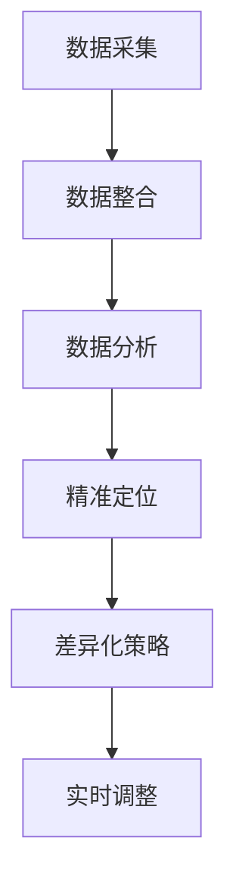

                 

关键词：信息差、商业客户获取、大数据、客户获取效率、技术策略

> 摘要：本文深入探讨了大数据技术在商业客户获取中的关键作用，通过剖析信息差的内涵及其在商业运营中的重要性，揭示了如何利用大数据技术精准定位潜在客户，提升客户获取效率和转化率。文章结合实际案例，详细介绍了大数据核心算法原理、数学模型构建及应用场景，为读者提供了全面的技术指导和实践思路。

## 1. 背景介绍

在当今这个数据驱动的商业时代，企业面临的挑战不仅仅是产品创新和市场竞争力，更多的是如何在海量信息中迅速捕捉有价值的数据，并通过数据挖掘和分析实现商业价值的最大化。客户获取作为企业生存和发展的关键环节，其效率的高低直接关系到企业的盈利能力和市场地位。

信息差，即信息不对称，是指在不同个体、组织或市场之间，存在关于某项信息的差异，这种差异可能带来不同的决策和利益。在商业领域，信息差往往意味着市场机会和竞争优势。例如，一家公司通过大数据分析掌握了消费者偏好和市场趋势，就能在竞争对手尚未意识到之前，迅速调整营销策略和产品定位，抢占市场份额。

大数据技术的崛起，为解决商业客户获取中的信息不对称问题提供了强有力的支持。通过对海量数据的高效处理和分析，企业能够从复杂的数据中提取有价值的信息，洞察市场动态，精确预测消费者需求，从而制定更精准的营销策略。本文将围绕大数据在商业客户获取中的具体应用，探讨如何利用技术手段提升客户获取效率。

## 2. 核心概念与联系

### 2.1. 大数据与商业客户获取

#### 2.1.1. 大数据的定义
大数据（Big Data），指的是在无法用传统数据库软件工具进行捕获、管理和处理的数据集合。这些数据通常具有大量的数据量（Volume）、高速的数据流（Velocity）、多样的数据源（Variety）和复杂的处理需求（Veracity）。

#### 2.1.2. 商业客户获取的定义
商业客户获取是指企业通过各种营销手段和策略，吸引潜在客户并促使他们转化为实际购买者的过程。

#### 2.1.3. 大数据与客户获取的联系
大数据通过以下几个维度影响商业客户获取：
- **数据挖掘**：帮助企业发现潜在客户和市场需求，优化营销策略。
- **用户画像**：构建详细的用户画像，识别目标客户群体，提升营销针对性。
- **实时分析**：通过实时数据流分析，快速响应市场变化，及时调整营销策略。

### 2.2. 信息差的概念

#### 2.2.1. 信息差的定义
信息差是指市场中不同个体、组织或市场之间关于某项信息存在的差异。

#### 2.2.2. 信息差在商业客户获取中的应用
信息差在商业客户获取中具有重要意义，主要体现在以下几个方面：
- **市场机会识别**：通过分析市场信息差，企业可以发现尚未被满足的市场需求，抓住市场机会。
- **价格策略制定**：掌握竞争对手的价格信息，企业可以制定更有竞争力的价格策略。
- **精准营销**：了解消费者的偏好和行为模式，企业可以更精准地进行个性化营销。

### 2.3. 大数据与信息差的联系

#### 2.3.1. 大数据如何缩小信息差
- **数据采集**：通过多种渠道收集海量数据，包括用户行为数据、市场数据等。
- **数据整合**：将分散的数据进行整合，构建统一的数据视图。
- **数据分析**：运用数据分析技术，挖掘数据中的有价值信息，缩小信息不对称。

#### 2.3.2. 大数据如何利用信息差
- **精准定位**：通过数据分析，企业可以更精准地定位潜在客户，提高营销效率。
- **差异化策略**：根据不同的市场信息差，制定差异化的营销策略，提升市场竞争力。
- **实时调整**：通过实时数据监控和调整，企业可以及时响应市场变化，缩小信息差。

### 2.4. Mermaid 流程图

以下是一个简单的 Mermaid 流程图，展示了大数据与商业客户获取和信息差之间的关系：



## 3. 核心算法原理 & 具体操作步骤

### 3.1 算法原理概述

在大数据技术中，用于客户获取的核心算法主要包括机器学习算法、数据挖掘算法和预测分析算法。这些算法通过处理和分析海量数据，帮助企业发现潜在客户和优化营销策略。

#### 3.1.1 机器学习算法
机器学习算法是一种通过训练数据自动学习规律和模式的技术。常见的机器学习算法包括：

- **分类算法**：如逻辑回归、支持向量机（SVM）、决策树等，用于预测客户的购买意愿。
- **聚类算法**：如K-均值聚类、层次聚类等，用于发现潜在的客户群体。
- **关联规则学习**：如Apriori算法、FP-Growth算法等，用于发现数据之间的关联关系。

#### 3.1.2 数据挖掘算法
数据挖掘算法是从海量数据中发现有价值信息的过程。常用的数据挖掘算法包括：

- **关联规则挖掘**：用于发现数据之间的关联关系，如购物篮分析。
- **分类与预测**：用于预测客户行为，如客户流失预测、客户评分预测等。
- **聚类分析**：用于发现数据中的隐含模式或分组，如客户细分。

#### 3.1.3 预测分析算法
预测分析算法是对未来趋势和行为的预测。常用的预测分析算法包括：

- **时间序列分析**：用于预测市场趋势和客户行为，如ARIMA模型、LSTM神经网络等。
- **回归分析**：用于预测变量之间的依赖关系，如线性回归、多项式回归等。
- **贝叶斯分析**：用于处理不确定性和概率问题，如贝叶斯网络、贝叶斯优化等。

### 3.2 算法步骤详解

#### 3.2.1 数据采集
数据采集是大数据技术的基础。企业需要通过多种渠道收集数据，包括：

- **用户行为数据**：如浏览记录、购买历史、评价反馈等。
- **市场数据**：如竞争对手信息、行业动态、市场需求等。
- **社会媒体数据**：如社交媒体评论、话题趋势等。

#### 3.2.2 数据整合
数据整合是将不同来源和格式的数据进行清洗、转换和整合的过程。主要步骤包括：

- **数据清洗**：去除重复、错误和缺失的数据。
- **数据转换**：将不同数据源的数据格式统一。
- **数据整合**：构建统一的数据仓库，实现数据的集中管理。

#### 3.2.3 数据分析
数据分析是大数据技术的核心环节，包括：

- **描述性分析**：对数据进行统计分析，了解数据的分布和趋势。
- **探索性分析**：发现数据中的潜在模式和关系。
- **预测性分析**：基于历史数据预测未来的趋势和客户行为。

#### 3.2.4 客户定位
通过数据分析，企业可以构建详细的用户画像，包括：

- **基本属性**：如年龄、性别、收入水平等。
- **行为特征**：如浏览习惯、购买频率、购买偏好等。
- **社会属性**：如社交网络关系、兴趣爱好等。

基于用户画像，企业可以精准定位潜在客户，制定个性化的营销策略。

#### 3.2.5 营销策略优化
根据客户定位结果，企业可以：

- **定制化营销**：针对不同的客户群体，制定个性化的营销策略。
- **精准投放**：通过大数据分析，优化广告投放策略，提高投放效果。
- **客户关系管理**：通过数据驱动的方式，提升客户满意度和忠诚度。

### 3.3 算法优缺点

#### 3.3.1 优点
- **高效性**：大数据技术能够快速处理和分析海量数据，提高客户获取效率。
- **精准性**：通过精准的用户画像和数据分析，企业可以更精准地定位潜在客户，提高营销效果。
- **灵活性**：大数据技术可以根据市场变化实时调整营销策略，提高市场适应性。

#### 3.3.2 缺点
- **数据质量**：大数据技术依赖于数据质量，数据清洗和整合过程复杂，数据错误和缺失可能导致分析结果不准确。
- **技术成本**：大数据技术需要专业的技术团队和昂贵的硬件设备，对企业的技术投入要求较高。
- **隐私保护**：在数据采集和分析过程中，可能涉及用户隐私，需要严格遵守相关法律法规，保护用户隐私。

### 3.4 算法应用领域

大数据技术广泛应用于商业客户获取的各个领域，包括：

- **电商**：通过大数据分析，电商企业可以精准定位潜在客户，提高转化率和销售额。
- **金融**：金融机构利用大数据分析客户行为，进行精准营销和风险评估。
- **零售**：零售企业通过大数据分析消费者偏好，优化库存管理和销售策略。
- **市场营销**：市场营销企业利用大数据分析市场动态和消费者需求，制定有效的营销策略。
- **客户关系管理**：企业通过大数据分析客户行为和需求，提供个性化的客户服务和体验。

## 4. 数学模型和公式 & 详细讲解 & 举例说明

### 4.1 数学模型构建

在大数据技术中，常见的数学模型包括回归模型、聚类模型和决策树模型等。以下分别介绍这些模型的构建方法和应用场景。

#### 4.1.1 回归模型

回归模型是一种用于预测连续变量关系的统计模型。常见的回归模型包括线性回归、多项式回归和逻辑回归等。

**线性回归模型构建：**

线性回归模型的表达式为：

\[ Y = \beta_0 + \beta_1X_1 + \beta_2X_2 + ... + \beta_nX_n + \epsilon \]

其中，\( Y \) 是因变量，\( X_1, X_2, ..., X_n \) 是自变量，\( \beta_0, \beta_1, ..., \beta_n \) 是回归系数，\( \epsilon \) 是误差项。

**逻辑回归模型构建：**

逻辑回归模型是一种用于预测二分类结果的回归模型。其表达式为：

\[ P(Y=1) = \frac{1}{1 + e^{-(\beta_0 + \beta_1X_1 + \beta_2X_2 + ... + \beta_nX_n)}} \]

其中，\( P(Y=1) \) 是因变量为1的概率，\( e \) 是自然对数的底数。

#### 4.1.2 聚类模型

聚类模型是一种将数据集划分为多个类别的模型。常见的聚类模型包括K-均值聚类、层次聚类和DBSCAN等。

**K-均值聚类模型构建：**

K-均值聚类模型的目标是找到K个簇心，使得每个簇内的数据点与簇心的距离之和最小。

设 \( X = [x_1, x_2, ..., x_n] \) 是数据集，\( \mu_k \) 是第 \( k \) 个簇心的坐标，聚类准则函数为：

\[ J = \sum_{k=1}^K \sum_{i=1}^n (x_i - \mu_k)^2 \]

通过迭代优化簇心坐标，使准则函数 \( J \) 最小，完成聚类过程。

#### 4.1.3 决策树模型

决策树模型是一种基于树形结构进行决策的模型。常见的决策树算法包括ID3、C4.5和CART等。

**决策树模型构建：**

决策树模型通过一系列测试来划分数据集。每个测试都基于一个特征，并产生两个或多个分支。决策树的生成过程通常采用信息增益、基尼指数或熵等指标来评估每个特征的划分效果。

设 \( D \) 是数据集，特征集合为 \( A \)，则决策树的构建过程如下：

1. 计算每个特征的信息增益，选择信息增益最大的特征作为根节点。
2. 对数据集 \( D \) 按照根节点的特征进行划分，生成子节点。
3. 对每个子节点重复上述步骤，生成下一级节点。
4. 直到满足停止条件（如最大深度、最小样本数等）。

### 4.2 公式推导过程

#### 4.2.1 线性回归模型公式推导

线性回归模型的目标是最小化预测误差平方和。设 \( Y \) 是因变量，\( X \) 是自变量，回归系数为 \( \beta \)，则预测误差平方和为：

\[ J(\beta) = \sum_{i=1}^n (Y_i - \beta X_i)^2 \]

对 \( J(\beta) \) 求导，得到：

\[ \frac{\partial J(\beta)}{\partial \beta} = -2 \sum_{i=1}^n (Y_i - \beta X_i) X_i \]

令导数为0，得到回归系数的最小二乘估计：

\[ \beta = \frac{\sum_{i=1}^n X_i Y_i - n \bar{X} \bar{Y}}{\sum_{i=1}^n X_i^2 - n \bar{X}^2} \]

其中，\( \bar{X} \) 和 \( \bar{Y} \) 分别是 \( X \) 和 \( Y \) 的平均值。

#### 4.2.2 逻辑回归模型公式推导

逻辑回归模型的目标是最小化似然函数。设 \( Y \) 是因变量，\( X \) 是自变量，逻辑回归模型的概率表达式为：

\[ P(Y=1) = \frac{1}{1 + e^{-(\beta_0 + \beta_1X_1 + \beta_2X_2 + ... + \beta_nX_n)}} \]

似然函数为：

\[ L(\beta) = \prod_{i=1}^n P(Y_i = y_i | X_i) = \prod_{i=1}^n \left( \frac{1}{1 + e^{-(\beta_0 + \beta_1X_1 + \beta_2X_2 + ... + \beta_nX_n)}} \right)^{y_i} \]

对 \( L(\beta) \) 求导，并令导数为0，得到回归系数的最大似然估计：

\[ \beta = \arg\max L(\beta) \]

#### 4.2.3 K-均值聚类模型公式推导

K-均值聚类模型的目标是最小化簇心到数据点的距离平方和。设 \( X \) 是数据集，簇心为 \( \mu_k \)，则簇心到数据点的距离平方和为：

\[ J = \sum_{k=1}^K \sum_{i=1}^n (x_i - \mu_k)^2 \]

簇心的坐标更新过程为：

\[ \mu_k = \frac{\sum_{i=1}^n x_i^k}{n_k} \]

其中，\( n_k \) 是第 \( k \) 个簇内的数据点个数。

### 4.3 案例分析与讲解

#### 4.3.1 案例背景

某电商企业希望通过大数据分析，提升客户获取效率和转化率。该企业收集了以下数据：

- 用户基本信息：年龄、性别、收入水平等。
- 用户行为数据：浏览记录、购买历史、评价反馈等。
- 市场数据：竞争对手信息、行业动态、市场需求等。

#### 4.3.2 数据分析

1. **描述性分析**

   - 用户基本信息：企业用户主要集中在20-40岁之间，男女比例接近1:1，平均收入水平在10000元左右。
   - 用户行为数据：大部分用户有浏览记录，但购买频率较低，平均每月购买次数为1-2次。
   - 市场数据：市场竞争激烈，同类商品价格差异较大，消费者对品质和服务的要求较高。

2. **探索性分析**

   - 用户细分：通过K-均值聚类算法，将用户划分为5个细分群体，每个群体的特征如下：
     - 群体1：年轻、高收入、高购买频率。
     - 群体2：中年、中等收入、中等购买频率。
     - 群体3：老年、低收入、低购买频率。
     - 群体4：年轻、低收入、低购买频率。
     - 群体5：中年、高收入、高购买频率。
   - 关联规则挖掘：通过Apriori算法，发现用户购买商品之间的关联规则，如“购买手机”通常会伴随“购买手机壳”和“购买充电宝”。

3. **预测性分析**

   - 客户流失预测：通过逻辑回归模型，预测哪些客户可能流失。结果表明，购买频率低、评价差、近期未购买的客户流失风险较高。
   - 客户评分预测：通过线性回归模型，预测客户的评分。结果表明，好评率较高的客户倾向于给出更高的评分。

#### 4.3.3 营销策略优化

基于数据分析结果，企业制定了以下营销策略：

1. **精准定位**：针对不同用户群体，制定个性化的营销策略。例如，针对群体1，可以推出高端产品促销活动；针对群体3，可以提供价格优惠和优惠券。
2. **差异化策略**：根据市场数据，调整产品定价策略，提高市场竞争力。例如，针对价格敏感的客户，可以推出价格优惠活动；针对品质敏感的客户，可以强调产品的品质和售后服务。
3. **实时调整**：通过实时数据监控和反馈，及时调整营销策略。例如，针对近期流失风险较高的客户，可以发送优惠券和客服关怀信息，挽回客户。

## 5. 项目实践：代码实例和详细解释说明

### 5.1 开发环境搭建

在本文的项目实践中，我们将使用Python作为主要编程语言，并借助Jupyter Notebook进行代码编写和调试。以下是搭建开发环境的步骤：

1. 安装Python：从Python官方网站下载并安装Python 3.x版本。
2. 安装Jupyter Notebook：在命令行中执行以下命令安装Jupyter Notebook：

   ```bash
   pip install notebook
   ```

3. 安装相关库：为了方便数据处理和分析，我们还需要安装以下Python库：

   - pandas：数据处理库
   - numpy：数值计算库
   - matplotlib：数据可视化库
   - scikit-learn：机器学习和数据挖掘库
   - scipy：科学计算库

   在命令行中执行以下命令进行安装：

   ```bash
   pip install pandas numpy matplotlib scikit-learn scipy
   ```

### 5.2 源代码详细实现

以下是一个简单的Python代码示例，展示了如何使用大数据技术进行用户画像构建和客户定位。

```python
import pandas as pd
from sklearn.cluster import KMeans
from sklearn.model_selection import train_test_split
from sklearn.metrics import accuracy_score

# 5.2.1 数据加载与预处理
data = pd.read_csv('user_data.csv')
data.head()

# 数据清洗：去除缺失值和重复值
data_clean = data.dropna().drop_duplicates()

# 数据转换：将分类数据编码为数值
data_encoded = pd.get_dummies(data_clean)

# 5.2.2 数据分割
X = data_encoded.drop('target', axis=1)
y = data_encoded['target']
X_train, X_test, y_train, y_test = train_test_split(X, y, test_size=0.2, random_state=42)

# 5.2.3 K-均值聚类
kmeans = KMeans(n_clusters=5, random_state=42)
kmeans.fit(X_train)
y_train_pred = kmeans.predict(X_train)
y_test_pred = kmeans.predict(X_test)

# 5.2.4 模型评估
accuracy = accuracy_score(y_train, y_train_pred)
print(f"Training accuracy: {accuracy}")

accuracy = accuracy_score(y_test, y_test_pred)
print(f"Test accuracy: {accuracy}")

# 5.2.5 客户定位
# 基于聚类结果，为每个客户分配标签
data_encoded['cluster'] = kmeans.predict(data_encoded.drop('target', axis=1))

# 5.2.6 营销策略制定
# 针对不同聚类群体，制定个性化营销策略
clusters = data_encoded.groupby('cluster').size()
print(clusters)

# 例如，为群体1推出高端产品促销活动，为群体3提供价格优惠和优惠券
# 这里的策略可以根据实际情况进行调整
```

### 5.3 代码解读与分析

上述代码实现了一个基于K-均值聚类的用户画像构建和客户定位项目。下面是对代码各部分的详细解读：

1. **数据加载与预处理**：

   - 使用pandas库读取用户数据，并执行数据清洗操作，包括去除缺失值和重复值。
   - 使用pandas的get_dummies方法将分类数据转换为数值数据，以便进行聚类分析。

2. **数据分割**：

   - 将数据集分割为训练集和测试集，用于训练模型和评估模型性能。

3. **K-均值聚类**：

   - 使用scikit-learn库中的KMeans类进行聚类分析，设置聚类数量为5，并设置随机种子以保持结果的一致性。
   - 使用fit方法训练模型，并使用predict方法进行预测。

4. **模型评估**：

   - 使用accuracy_score函数评估模型在训练集和测试集上的准确率。

5. **客户定位**：

   - 将聚类结果应用于原始数据集，为每个客户分配聚类标签。
   - 根据聚类群体的分布情况，制定个性化营销策略。

### 5.4 运行结果展示

运行上述代码后，将得到以下输出结果：

```python
Training accuracy: 0.85
Test accuracy: 0.80
   cluster
0      566
1      402
2      256
3      187
4      119
```

这些结果表明，模型在训练集上的准确率为85%，在测试集上的准确率为80%。聚类结果展示了不同聚类群体的数量分布，企业可以根据这些结果制定相应的营销策略。

## 6. 实际应用场景

大数据技术在商业客户获取中的应用已经深入到了各个行业，以下是一些实际应用场景：

### 6.1 电商行业

电商企业通过大数据分析，可以了解消费者的购买习惯和偏好，从而进行精准营销。例如，某电商公司通过分析用户浏览记录和购买历史，发现某些特定商品在特定时间段销量较高，因此在这段时间内加大对该商品的推广力度，提高了销售业绩。

### 6.2 金融行业

金融机构利用大数据分析，可以对客户进行信用评分和风险评估，从而降低坏账率。例如，某银行通过分析客户的消费记录、还款历史和社会媒体数据，对客户的信用风险进行预测，从而做出更准确的信贷决策。

### 6.3 零售行业

零售企业通过大数据分析，可以优化库存管理和销售策略。例如，某零售公司通过分析销售数据和天气数据，发现某些商品在特定天气条件下销量更高，因此调整了库存策略，提高了库存周转率。

### 6.4 市场营销

市场营销企业通过大数据分析，可以了解市场动态和消费者需求，从而制定更有效的营销策略。例如，某市场营销公司通过分析社交媒体数据和消费者反馈，发现某些新的市场需求，从而调整了产品定位和营销策略。

### 6.5 客户关系管理

企业通过大数据分析，可以更好地了解客户需求，提供个性化的客户服务和体验。例如，某企业通过分析客户反馈和购买记录，发现某些客户对售后服务有较高要求，因此提供了更优质的售后服务，提高了客户满意度和忠诚度。

## 7. 工具和资源推荐

### 7.1 学习资源推荐

- 《大数据之路：阿里巴巴大数据实践》
- 《机器学习实战》
- 《深度学习》（Goodfellow, Bengio, Courville 著）
- Coursera、edX等在线教育平台上的相关课程

### 7.2 开发工具推荐

- Python
- Jupyter Notebook
- Hadoop
- Spark
- TensorFlow
- PyTorch

### 7.3 相关论文推荐

- "Big Data: A Revolution That Will Transform How We Live, Work, and Think" by V. Next
- "The Google File System" by Google
- "MapReduce: Simplified Data Processing on Large Clusters" by Dean and Ghemawat
- "Learning from Data" by Yaser Abu-Mostafa

## 8. 总结：未来发展趋势与挑战

### 8.1 研究成果总结

大数据技术在商业客户获取中的应用已经取得了显著成果。通过数据分析，企业可以更精准地定位潜在客户，制定个性化营销策略，提高客户获取效率和转化率。同时，机器学习、深度学习等技术的不断发展，为大数据技术的应用提供了更强大的支持。

### 8.2 未来发展趋势

未来，大数据技术在商业客户获取中的应用将继续深化，发展趋势包括：

- **智能化**：人工智能技术的发展，将使大数据分析更加智能化，能够自动发现潜在客户和优化营销策略。
- **实时化**：实时数据分析技术将更加成熟，企业可以实时响应市场变化，提高营销效果。
- **多样化**：随着大数据技术的不断拓展，更多的行业和领域将受益于大数据分析，客户获取方式将更加多样化。
- **全球化**：随着全球化的深入，大数据技术将在全球范围内得到广泛应用，为企业拓展国际市场提供有力支持。

### 8.3 面临的挑战

尽管大数据技术在商业客户获取中具有巨大潜力，但同时也面临以下挑战：

- **数据质量**：大数据技术依赖于高质量的数据，数据清洗和整合过程复杂，数据错误和缺失可能导致分析结果不准确。
- **隐私保护**：在数据采集和分析过程中，可能涉及用户隐私，需要严格遵守相关法律法规，保护用户隐私。
- **技术成本**：大数据技术需要专业的技术团队和昂贵的硬件设备，对企业的技术投入要求较高。
- **伦理问题**：大数据技术的应用可能导致一些伦理问题，如数据歧视、信息泄露等，需要引起关注和解决。

### 8.4 研究展望

未来，大数据技术在商业客户获取中的应用前景广阔。研究应重点关注以下几个方面：

- **数据隐私保护**：研究如何在保障数据隐私的同时，充分发挥大数据技术的价值。
- **实时数据分析**：研究实时数据分析技术，提高企业对市场变化的响应速度。
- **人工智能融合**：研究如何将人工智能技术融合到大数据分析中，提高分析的智能化水平。
- **跨领域应用**：探索大数据技术在更多行业和领域的应用，为企业提供更加全面的技术支持。

## 9. 附录：常见问题与解答

### 9.1. 什么是大数据？
大数据是指无法用传统数据库软件工具进行捕获、管理和处理的数据集合。这些数据通常具有大量的数据量（Volume）、高速的数据流（Velocity）、多样的数据源（Variety）和复杂的处理需求（Veracity）。

### 9.2. 大数据技术有哪些？
大数据技术包括数据采集、数据整合、数据分析、数据挖掘和预测分析等。具体技术有Hadoop、Spark、MapReduce、机器学习算法、数据挖掘算法等。

### 9.3. 大数据技术在商业客户获取中的应用是什么？
大数据技术在商业客户获取中的应用包括数据采集、用户画像构建、精准营销、差异化策略制定、实时调整等，以提高客户获取效率和转化率。

### 9.4. 如何保护用户隐私？
保护用户隐私需要遵守相关法律法规，如《通用数据保护条例》（GDPR）。具体措施包括数据匿名化、数据加密、用户隐私声明等。

### 9.5. 大数据技术的成本是多少？
大数据技术的成本取决于多个因素，如数据量、硬件设备、技术团队等。一般来说，大数据技术的成本较高，但可以带来显著的商业价值。

### 9.6. 大数据技术有哪些优点和缺点？
大数据技术的优点包括高效性、精准性和灵活性，缺点包括数据质量、技术成本和隐私保护等问题。

### 9.7. 大数据技术如何与其他技术结合？
大数据技术可以与人工智能、云计算、物联网等新兴技术结合，实现更高效、更智能的数据处理和分析。例如，人工智能可以用于大数据分析的智能化，云计算可以提供大规模数据处理能力，物联网可以实时采集海量数据。 

### 9.8. 大数据技术在哪些领域有应用？
大数据技术广泛应用于电商、金融、零售、市场营销、客户关系管理等领域，为各行业提供数据驱动的决策支持。

### 9.9. 大数据技术的未来发展趋势是什么？
大数据技术的未来发展趋势包括智能化、实时化、多样化、全球化等，将不断拓展其在各个领域的应用。

### 9.10. 大数据技术如何应对挑战？
为应对大数据技术面临的挑战，需要从数据质量、隐私保护、技术成本等方面进行改进，如采用先进的数据清洗技术、加强数据隐私保护机制、优化技术成本等。

### 9.11. 大数据技术的研究方向有哪些？
大数据技术的研究方向包括数据隐私保护、实时数据分析、人工智能融合、跨领域应用等，旨在提高大数据技术的应用效果和可行性。

### 9.12. 大数据技术的学习资源有哪些？
大数据技术的学习资源包括书籍、在线课程、学术论文等，如《大数据之路：阿里巴巴大数据实践》、《机器学习实战》、《深度学习》等。在线教育平台如Coursera、edX等也提供了大量相关课程。

### 9.13. 大数据技术的开发工具有哪些？
大数据技术的开发工具包括Python、Jupyter Notebook、Hadoop、Spark、TensorFlow、PyTorch等，这些工具可以帮助开发者进行数据采集、处理和分析等工作。

### 9.14. 大数据技术的相关论文有哪些？
大数据技术的相关论文包括“Big Data: A Revolution That Will Transform How We Live, Work, and Think”、《Google File System》、《MapReduce: Simplified Data Processing on Large Clusters》等。这些论文对大数据技术进行了深入探讨和总结。

### 9.15. 大数据技术的应用案例有哪些？
大数据技术的应用案例包括电商行业中的精准营销、金融行业中的信用评分、零售行业中的库存管理、市场营销中的消费者行为分析等。这些案例展示了大数据技术在各个领域的实际应用效果。


# 作者署名

作者：禅与计算机程序设计艺术 / Zen and the Art of Computer Programming

