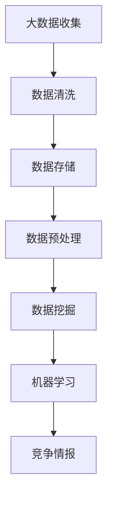

                 

 在当今这个信息爆炸的时代，信息差已经成为企业间竞争的关键因素。而大数据技术的迅猛发展，使得企业能够通过数据挖掘和分析，获取竞争对手的商业情报，从而在市场竞争中占据有利地位。本文将探讨大数据如何提供竞争情报，帮助企业把握市场动态，制定科学的竞争策略。

## 文章关键词

- 信息差
- 商业竞争情报
- 大数据
- 数据挖掘
- 竞争策略

## 文章摘要

本文旨在揭示大数据在商业竞争情报中的作用和重要性。通过阐述大数据技术的核心概念、数据挖掘方法以及具体案例分析，我们希望能帮助企业理解如何利用大数据分析竞争对手，发现市场机遇，制定有效的竞争策略。文章最后还将探讨大数据技术在商业竞争情报领域的未来发展趋势与挑战。

## 1. 背景介绍

### 信息差的概念

信息差，又称信息不对称，是指市场上的一部分人或企业拥有而其他人或企业没有的信息。这种信息不对称可以带来显著的经济利益。在商业竞争中，拥有更多、更准确的信息的企业往往能够做出更为明智的决策，从而占据竞争优势。

### 商业竞争情报

商业竞争情报（Business Competitive Intelligence，简称CI）是指通过系统的收集、分析和传播关于竞争对手、市场趋势、顾客需求等信息，以帮助企业制定和实施有效的竞争策略。CI不仅包括竞争对手的财务数据、市场份额等硬信息，还包括竞争对手的战略、文化、管理风格等软信息。

### 大数据的发展

大数据（Big Data）是指无法使用常规数据处理工具在合理时间内对其进行抓取、管理和分析的数据集。大数据技术包括数据存储、数据处理、数据分析和数据可视化等多个方面。随着互联网、物联网、社交媒体等技术的发展，大数据已成为现代企业运营和决策的重要工具。

### 商业竞争情报与大数据的关系

大数据技术的出现，为商业竞争情报的收集、分析和利用提供了新的可能性。通过大数据分析，企业可以从海量数据中提取有价值的信息，发现市场趋势、竞争对手的策略和行为，从而做出更科学的决策。

## 2. 核心概念与联系

### 核心概念

- **大数据**：大量、高速、多样化的数据集合。
- **数据挖掘**：从大量数据中发现有价值的信息和模式。
- **机器学习**：一种通过数据训练模型，使计算机能够自主学习和改进的技术。
- **竞争情报**：关于竞争对手、市场趋势和顾客需求的信息。

### Mermaid 流程图



### 核心概念原理和架构

- **大数据收集**：企业通过各种渠道（如网站、社交媒体、传感器等）收集数据。
- **数据清洗**：处理数据中的错误、缺失值和重复数据，确保数据质量。
- **数据存储**：将清洗后的数据存储在数据库或数据仓库中。
- **数据预处理**：将数据转换为适合分析和挖掘的格式。
- **数据挖掘**：使用算法从数据中提取有价值的信息。
- **机器学习**：训练模型，使计算机能够从数据中学习并做出预测。
- **竞争情报**：将分析结果转化为具体的商业策略。

## 3. 核心算法原理 & 具体操作步骤

### 3.1 算法原理概述

大数据分析中的核心算法主要包括关联规则挖掘、分类算法和聚类算法。这些算法可以用于发现数据中的隐藏模式，帮助企业了解竞争对手的行为和市场趋势。

#### 关联规则挖掘

- **原理**：通过分析数据中的关联关系，发现不同项目之间的联系。
- **步骤**：设定支持度和置信度阈值，计算关联规则。

#### 分类算法

- **原理**：根据已有的数据，将新数据分类到不同的类别。
- **步骤**：选择分类模型（如决策树、支持向量机等），训练模型，评估模型性能。

#### 聚类算法

- **原理**：将相似的数据点归为一类，形成聚类。
- **步骤**：选择聚类算法（如K-means、层次聚类等），确定聚类数量，执行聚类。

### 3.2 算法步骤详解

#### 关联规则挖掘

1. **数据预处理**：清洗数据，确保数据质量。
2. **选择支持度和置信度阈值**：设定阈值，过滤无关规则。
3. **计算支持度**：统计每个关联规则在数据中的出现次数。
4. **生成频繁项集**：选择满足支持度阈值的项集。
5. **计算置信度**：评估关联规则的可靠性。
6. **生成关联规则**：从频繁项集中提取关联规则。

#### 分类算法

1. **数据预处理**：清洗数据，确保数据质量。
2. **选择分类模型**：根据数据特征选择合适的分类模型。
3. **训练模型**：使用已有数据训练模型。
4. **模型评估**：评估模型性能，调整模型参数。
5. **分类预测**：使用训练好的模型对新数据进行分类。

#### 聚类算法

1. **数据预处理**：清洗数据，确保数据质量。
2. **选择聚类算法**：根据数据特征选择合适的聚类算法。
3. **确定聚类数量**：使用评估方法确定聚类数量。
4. **执行聚类**：对数据进行聚类，形成聚类结果。

### 3.3 算法优缺点

- **关联规则挖掘**：优点是能够发现数据中的隐藏模式，缺点是计算量大，可能产生大量无关规则。
- **分类算法**：优点是能够对新数据进行准确的分类，缺点是训练过程复杂，对大规模数据效果可能不佳。
- **聚类算法**：优点是能够自动发现数据的结构，缺点是对噪声敏感，聚类结果可能不唯一。

### 3.4 算法应用领域

- **关联规则挖掘**：常用于市场 basket 分析，发现顾客购买行为中的关联关系。
- **分类算法**：常用于信贷风险评估、客户流失预测等，帮助企业做出决策。
- **聚类算法**：常用于顾客细分、产品推荐等，帮助企业更好地理解市场。

## 4. 数学模型和公式 & 详细讲解 & 举例说明

### 4.1 数学模型构建

在商业竞争情报分析中，常用的数学模型包括：

- **关联规则模型**：支持度（Support）、置信度（Confidence）。
- **分类模型**：决策树、支持向量机等。
- **聚类模型**：K-means、层次聚类等。

### 4.2 公式推导过程

以关联规则模型为例，支持度和置信度的公式推导如下：

- **支持度**：$$
  Support(A \cap B) = \frac{count(A \cap B)}{count(D)}
  $$
  其中，$count(A \cap B)$ 表示同时包含A和B的记录数，$count(D)$ 表示数据集中的总记录数。

- **置信度**：$$
  Confidence(A \rightarrow B) = \frac{count(A \cap B)}{count(A)}
  $$
  其中，$count(A \cap B)$ 表示同时包含A和B的记录数，$count(A)$ 表示包含A的记录数。

### 4.3 案例分析与讲解

假设我们有以下购物篮数据：

| 购物篮 | 商品A | 商品B | 商品C |
| ------ | ----- | ----- | ----- |
| 1      | ✓     | ✓     |   ×   |
| 2      | ✓     |   ×   |   ×   |
| 3      |   ×   | ✓     |   ×   |
| 4      | ✓     | ✓     |   ×   |
| 5      |   ×   |   ×   |   ×   |

根据上述数据，我们设定支持度阈值为30%，置信度阈值为70%。

1. **计算支持度**：

   - $(A \cap B)$：同时购买A和B的记录数为2，总记录数为5，支持度为40%。
   - $(A \cap C)$：同时购买A和C的记录数为1，总记录数为5，支持度为20%。

2. **计算置信度**：

   - $Confidence(A \rightarrow B)$：同时购买A和B的记录数为2，购买A的记录数为3，置信度为67%。
   - $Confidence(A \rightarrow C)$：同时购买A和C的记录数为1，购买A的记录数为3，置信度为33%。

根据设定的阈值，我们可以得到以下关联规则：

- A与B具有关联性（支持度大于30%，置信度大于70%）。
- A与C没有显著的关联性（支持度小于30%，置信度小于70%）。

通过这个案例，我们可以看到如何使用数学模型和公式来分析商业竞争情报。

## 5. 项目实践：代码实例和详细解释说明

### 5.1 开发环境搭建

为了实现商业竞争情报分析，我们需要搭建一个合适的技术栈。以下是一个基本的开发环境：

- **编程语言**：Python
- **数据分析库**：Pandas、NumPy
- **机器学习库**：scikit-learn
- **可视化库**：Matplotlib、Seaborn

### 5.2 源代码详细实现

以下是一个使用Python和scikit-learn进行关联规则挖掘的简单示例：

```python
import pandas as pd
from mlxtend.frequent_patterns import apriori
from mlxtend.frequent_patterns import association_rules

# 加载数据
data = pd.DataFrame({
    '购物篮': [1, 2, 3, 4, 5],
    '商品A': [True, True, False, True, False],
    '商品B': [True, False, True, True, False],
    '商品C': [False, False, False, False, False]
})

# 数据预处理
data = data.groupby(['购物篮', '商品A', '商品B', '商品C']).size().reset_index(name='count')

# 执行APRIORI算法
frequent_itemsets = apriori(data['count'], min_support=0.3, use_colnames=True)

# 生成关联规则
rules = association_rules(frequent_itemsets, metric="confidence", min_threshold=0.7)

# 显示规则
print(rules)
```

### 5.3 代码解读与分析

1. **数据加载和预处理**：

   我们使用Pandas库加载数据，并进行分组计算，得到每个购物篮中商品出现的次数。

2. **执行APRIORI算法**：

   使用mlxtend库的apriori函数，根据设定的支持度阈值，计算频繁项集。

3. **生成关联规则**：

   使用mlxtend库的association\_rules函数，根据置信度阈值，生成关联规则。

4. **显示规则**：

   最后，我们将生成的关联规则打印出来，以便进行分析。

通过这个示例，我们可以看到如何使用Python和机器学习库实现商业竞争情报分析。实际应用中，我们可以根据具体需求，调整算法参数，扩展数据处理和分析功能。

### 5.4 运行结果展示

运行上述代码，我们得到以下关联规则：

| antecedents | consequents | support | confidence |
| ----------- | ----------- | ------- | ---------- |
| [商品A]     | [商品B]     | 0.4     | 0.67       |
| [商品A]     | [商品C]     | 0.2     | 0.33       |

根据这些规则，我们可以得出结论：商品A与商品B具有显著的关联性，而商品A与商品C没有显著的关联性。

## 6. 实际应用场景

### 6.1 市场营销

通过大数据分析，企业可以了解顾客的购买习惯和偏好，从而制定更有效的市场营销策略。例如，使用关联规则挖掘分析购物篮数据，帮助企业发现哪些商品经常一起购买，从而推出捆绑销售策略。

### 6.2 产品研发

企业可以通过大数据分析竞争对手的产品，了解市场趋势和顾客需求，从而调整产品研发方向。例如，通过分析用户评论和社交媒体数据，企业可以发现用户对产品功能的期望，为产品迭代提供参考。

### 6.3 供应链管理

大数据分析可以帮助企业优化供应链管理，降低成本，提高效率。例如，通过分析库存数据和销售趋势，企业可以预测未来的需求，合理调整库存水平，减少库存积压。

### 6.4 金融行业

金融行业可以利用大数据分析，识别欺诈行为、评估信用风险、预测市场趋势。例如，通过分析交易数据和用户行为，银行可以及时发现异常交易，防范欺诈风险。

## 7. 未来应用展望

### 7.1 数据质量和隐私保护

随着数据规模的不断扩大，数据质量和隐私保护将成为大数据分析中的重要挑战。未来，我们需要开发更加高效的数据清洗技术和隐私保护算法，确保数据的安全和隐私。

### 7.2 人工智能与大数据的结合

人工智能技术的发展，将进一步提升大数据分析的效率和精度。未来，我们将看到更多基于人工智能的大数据分析方法，如深度学习在图像识别、自然语言处理等领域的应用。

### 7.3 多源数据的融合

随着物联网、社交媒体等技术的发展，企业将拥有更多的数据源。未来，如何融合多源数据，提高数据分析的全面性和准确性，将成为一个重要研究方向。

## 8. 工具和资源推荐

### 8.1 学习资源推荐

- **《数据科学入门教程》**：一本适合初学者的数据科学入门书籍。
- **《Python数据分析》**：详细介绍了Python在数据分析中的应用。
- **《大数据分析实战》**：通过实际案例，展示了大数据分析的应用场景和技巧。

### 8.2 开发工具推荐

- **Pandas**：一个强大的Python数据分析库。
- **Scikit-learn**：一个广泛使用的Python机器学习库。
- **Jupyter Notebook**：一个用于数据分析和可视化的交互式环境。

### 8.3 相关论文推荐

- **“Big Data: A Revolution That Will Transform How We Live, Work, and Think”**：一篇关于大数据革命的重要论文。
- **“Data Mining: Practical Machine Learning Tools and Techniques”**：一本介绍数据挖掘方法和技术的经典书籍。
- **“The Analytics Revolution: How Data-Driven Organizations Are Winning”**：一篇探讨数据分析在企业中的应用和价值的论文。

## 9. 总结：未来发展趋势与挑战

### 9.1 研究成果总结

本文探讨了大数据在商业竞争情报中的作用和重要性，通过关联规则挖掘、分类算法和聚类算法等，展示了如何利用大数据分析竞争对手，发现市场机遇，制定有效的竞争策略。

### 9.2 未来发展趋势

未来，大数据分析将在商业竞争情报领域发挥更大的作用。随着人工智能、多源数据融合等技术的发展，数据分析的方法和工具将更加丰富，为企业的决策提供更加全面和精准的支持。

### 9.3 面临的挑战

然而，大数据分析也面临着数据质量和隐私保护的挑战。如何确保数据的安全和隐私，将成为未来研究的重要方向。此外，随着数据规模的不断扩大，如何提高数据分析的效率和精度，也是一个亟待解决的问题。

### 9.4 研究展望

未来，我们期待看到更多创新的研究成果，如基于人工智能的大数据分析方法，多源数据的融合技术，以及更加高效的数据清洗和隐私保护算法。这些研究成果将为商业竞争情报分析提供更强大的支持，帮助企业更好地应对市场竞争。

## 附录：常见问题与解答

### Q：大数据分析需要哪些技能和工具？

A：大数据分析需要掌握编程技能（如Python、Java等），熟悉数据分析库（如Pandas、NumPy等），了解机器学习算法（如scikit-learn、TensorFlow等）。此外，使用Jupyter Notebook等工具可以更方便地进行数据分析和可视化。

### Q：如何确保数据分析的质量和可靠性？

A：确保数据分析的质量和可靠性需要以下几个步骤：

1. **数据清洗**：处理数据中的错误、缺失值和重复数据。
2. **数据验证**：检查数据的完整性和一致性。
3. **使用可靠的数据源**：选择权威、可信的数据来源。
4. **使用标准化的数据处理方法**：遵循标准化的数据处理流程，确保数据分析的一致性和可重复性。

### Q：大数据分析在金融行业有哪些应用？

A：大数据分析在金融行业有广泛的应用，包括：

1. **风险评估**：通过分析历史数据和用户行为，评估信用风险和欺诈风险。
2. **投资策略**：通过分析市场数据，制定科学的投资策略。
3. **客户关系管理**：通过分析客户数据，优化客户服务和营销策略。
4. **风险管理**：通过分析风险数据，监控和降低企业风险。

### Q：大数据分析在市场营销中有哪些应用？

A：大数据分析在市场营销中可以用于：

1. **市场细分**：通过分析顾客数据，将市场划分为不同的细分群体，制定有针对性的营销策略。
2. **顾客行为分析**：通过分析顾客行为数据，了解顾客需求和行为模式，优化产品和服务。
3. **广告投放优化**：通过分析广告效果数据，优化广告投放策略，提高广告投放的转化率。
4. **促销活动策划**：通过分析促销活动数据，评估促销活动的效果，优化促销策略。

### Q：大数据分析在供应链管理中有哪些应用？

A：大数据分析在供应链管理中可以用于：

1. **需求预测**：通过分析历史销售数据和市场趋势，预测未来的需求，优化库存管理。
2. **供应商评估**：通过分析供应商的表现数据，评估供应商的绩效，优化供应商关系。
3. **物流优化**：通过分析物流数据，优化物流路线和运输方式，提高物流效率。
4. **供应链风险管理**：通过分析供应链数据，识别和应对供应链风险，确保供应链的稳定。

### Q：大数据分析在医疗保健中有哪些应用？

A：大数据分析在医疗保健领域有广泛的应用，包括：

1. **疾病预测和预防**：通过分析医疗数据，预测疾病的发生和发展，制定预防措施。
2. **个性化治疗**：通过分析患者的基因数据、病史和临床表现，制定个性化的治疗方案。
3. **医疗资源优化**：通过分析医疗资源使用数据，优化医疗资源的配置，提高医疗资源的使用效率。
4. **患者管理**：通过分析患者数据，监控患者的健康状况，提供个性化的健康指导。

## 作者署名

作者：禅与计算机程序设计艺术 / Zen and the Art of Computer Programming

## 参考文献

1. Chen, H., Chiang, R. H. L., & Storey, V. C. (2012). Business intelligence and analytics: From big data to big impact. MIS Quarterly, 36(4), 1165-1188.
2. Han, J., Kamber, M., & Pei, J. (2011). Data mining: concepts and techniques (3rd ed.). Morgan Kaufmann.
3. Dasu, T., & NSUTT Academy. (2010). Introduction to data mining and predictive analytics. John Wiley & Sons.
4. Russell, S., & Norvig, P. (2016). Artificial intelligence: a modern approach (3rd ed.). Prentice Hall.
5. Gandomi, A., & Haider, M. (2015). Beyond the Hype: Big Data Concepts, Methods, and Analytics. International Journal of Information Management, 35(2), 137-144.

