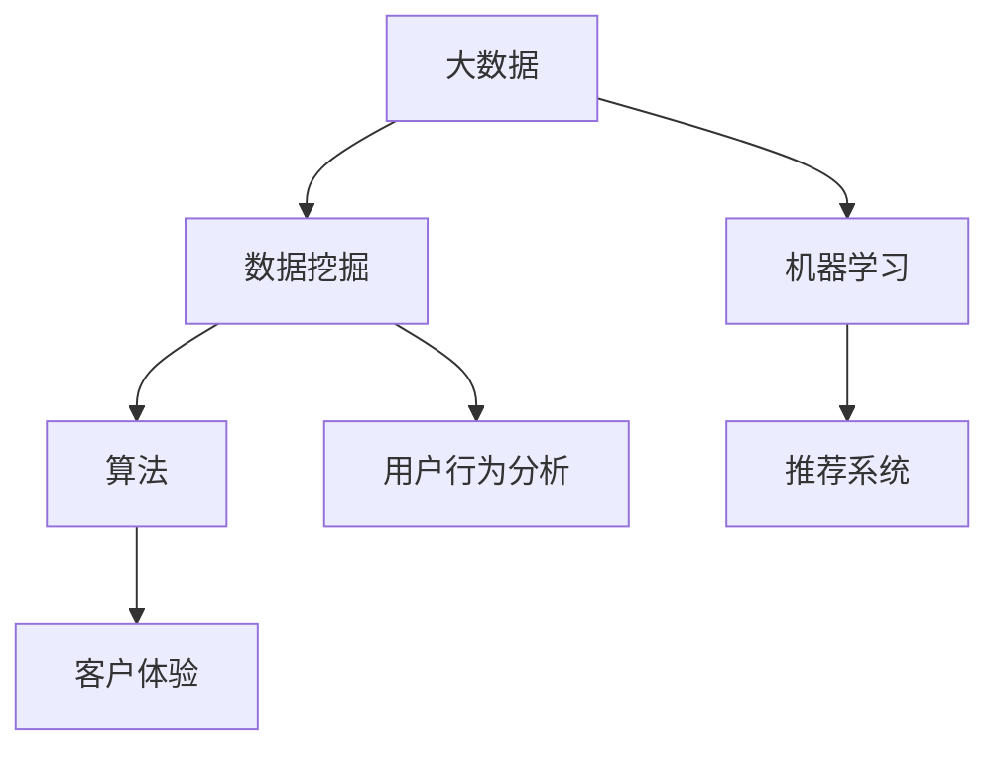

                 

 关键词：商业营销、大数据、个性化、信息差、数据挖掘、机器学习、算法、客户体验、精准营销

> 摘要：随着大数据时代的到来，信息差的商业营销模式逐渐被颠覆。本文将深入探讨大数据如何通过数据挖掘、机器学习和算法技术，实现营销的个性化革命，从而为企业带来更高的效益和客户满意度。

## 1. 背景介绍

在互联网和数字技术飞速发展的今天，商业营销的竞争愈发激烈。传统的“广撒网、多捕鱼”的营销策略已经无法满足市场需求，企业迫切需要一种更加精准、高效的营销方式来提升竞争力。而大数据技术的崛起，为这一需求提供了全新的解决方案。

大数据不仅是指数据量的增加，更重要的是数据类型的多样性和数据价值的发掘。通过大数据技术，企业可以从海量数据中挖掘出有价值的信息，实现对客户行为的深度分析，进而实现精准营销。个性化营销作为大数据应用的重要领域，正逐渐成为企业提升客户体验和忠诚度的关键手段。

### 1.1 信息差的本质

信息差，即信息不对称，是指交易双方在获取信息方面存在差异。在商业营销中，信息差可以表现为消费者对产品或服务的信息了解程度低于企业，从而影响消费者的购买决策。传统营销方式往往依赖于大规模的广告投放和信息传递，而忽视了消费者个体差异和个性化需求。

### 1.2 传统营销模式的局限

传统营销模式主要依赖于以下几种手段：

1. **广告宣传**：通过电视、广播、报纸等传统媒体进行广告投放，以传达品牌形象和产品信息。
2. **促销活动**：通过打折、赠品等方式刺激消费者购买。
3. **市场调研**：通过问卷调查、焦点小组等方式了解市场需求和消费者偏好。

然而，这些方式存在以下局限：

1. **成本高昂**：大规模的广告投放需要巨大的资金支持。
2. **效果难控**：广告效果难以精确衡量，无法确保每个消费者都能接收到有效的信息。
3. **无法个性化**：传统营销模式难以根据消费者的个性化需求进行精准匹配。

## 2. 核心概念与联系

为了实现营销的个性化，我们需要理解以下核心概念和其相互之间的联系：

### 2.1 大数据

大数据（Big Data）是指规模巨大、类型多样的数据集。它具有“4V”特征，即：

1. **Volume（大量）**：数据量极其庞大。
2. **Velocity（高速）**：数据产生和处理的速度非常快。
3. **Variety（多样）**：数据类型多种多样，包括结构化、半结构化和非结构化数据。
4. **Veracity（真实性）**：数据真实、准确。

### 2.2 数据挖掘

数据挖掘（Data Mining）是指从大量数据中提取有价值的信息和知识的过程。它包括：

1. **关联规则挖掘**：发现数据之间的关联性。
2. **聚类分析**：将数据分为不同的群体。
3. **分类与回归分析**：对数据进行分类和预测。

### 2.3 机器学习

机器学习（Machine Learning）是一种人工智能技术，通过算法和统计模型，让计算机从数据中自动学习和改进。常见的机器学习算法包括：

1. **线性回归**：预测数值型变量。
2. **逻辑回归**：分类问题。
3. **决策树**：根据不同特征对数据进行分类。
4. **神经网络**：模拟人脑神经网络，进行复杂的模式识别。

### 2.4 算法

算法（Algorithm）是一系列解决问题的步骤和规则。在营销个性化中，算法用于：

1. **用户行为分析**：分析消费者的浏览、购买等行为。
2. **推荐系统**：根据用户的历史数据和偏好，推荐合适的产品或服务。
3. **客户细分**：将客户根据不同的特征分为不同的群体。

### 2.5 客户体验

客户体验（Customer Experience）是指消费者在使用产品或服务过程中的感受和体验。个性化营销的目标是提供满足消费者需求的个性化体验，从而提升客户满意度和忠诚度。

### 2.6 Mermaid 流程图

为了更直观地展示这些概念之间的关系，我们可以使用 Mermaid 流程图来描述：



## 3. 核心算法原理 & 具体操作步骤

### 3.1 算法原理概述

个性化营销的核心在于理解每个消费者的需求和偏好，从而提供个性化的产品推荐和营销活动。这一过程涉及多个算法和步骤：

1. **用户行为分析**：通过分析用户的浏览、购买、评价等行为数据，了解用户的兴趣和偏好。
2. **特征提取**：从用户行为数据中提取有用的特征，如浏览时间、购买频率、评价情感等。
3. **客户细分**：根据用户的特征，将用户分为不同的群体。
4. **推荐系统**：利用算法为每个用户推荐合适的产品或服务。
5. **个性化营销**：根据用户的特点，设计个性化的营销活动。

### 3.2 算法步骤详解

1. **用户行为分析**

   用户行为分析是整个个性化营销过程的基础。通过日志分析、点击流分析等技术，收集用户在网站、应用等平台上的行为数据。例如，用户的浏览路径、搜索关键词、购买记录、评价等。

2. **特征提取**

   从用户行为数据中提取特征，是数据挖掘和机器学习的关键步骤。常用的特征提取方法包括：

   - **统计特征**：如平均浏览时长、购买频率、评价情感等。
   - **文本特征**：如关键词频率、词云等。
   - **图像特征**：如颜色分布、纹理等。

3. **客户细分**

   客户细分是利用聚类算法、决策树等方法，将用户分为不同的群体。常见的客户细分方法包括：

   - **基于特征的聚类**：如K-means、层次聚类等。
   - **基于模型的聚类**：如基于决策树的细分、基于神经网络的细分等。

4. **推荐系统**

   推荐系统是利用协同过滤、基于内容的推荐、基于模型的推荐等方法，为用户推荐合适的产品或服务。常见的推荐算法包括：

   - **协同过滤**：如基于用户的协同过滤、基于项目的协同过滤等。
   - **基于内容的推荐**：根据用户的兴趣和偏好，推荐类似的内容。
   - **基于模型的推荐**：如矩阵分解、神经网络等。

5. **个性化营销**

   根据用户的特点，设计个性化的营销活动。例如，为不同群体的用户发送定制化的邮件、推送通知、广告等。

### 3.3 算法优缺点

- **协同过滤**：

  - 优点：推荐准确、实时性高。
  - 缺点：易出现“数据稀疏性”问题，无法推荐新的项目或用户。

- **基于内容的推荐**：

  - 优点：适用于新用户和新项目的推荐。
  - 缺点：依赖丰富的内容数据，推荐结果可能不够准确。

- **基于模型的推荐**：

  - 优点：推荐结果准确、可解释性强。
  - 缺点：训练时间较长、需要大量的标注数据。

### 3.4 算法应用领域

个性化营销算法广泛应用于电商、社交媒体、在线广告等领域。例如：

- **电商**：为用户推荐合适的商品。
- **社交媒体**：为用户推荐感兴趣的内容。
- **在线广告**：为用户推荐相关的广告。

## 4. 数学模型和公式 & 详细讲解 & 举例说明

### 4.1 数学模型构建

个性化营销中的数学模型主要涉及用户行为分析、推荐系统和客户细分等方面。以下是一个简单的数学模型示例：

$$
\text{个性化推荐模型} = \text{用户特征} \times \text{产品特征} + \text{用户行为} + \text{产品评分}
$$

其中，用户特征和产品特征可以是用户的浏览历史、搜索关键词、购买记录等，产品评分可以是用户对产品的评分或推荐系统预测的评分。

### 4.2 公式推导过程

个性化推荐模型的推导过程可以分为以下几个步骤：

1. **用户特征表示**：

   设用户 $u$ 的特征向量为 $x_u \in \mathbb{R}^n$，产品 $p$ 的特征向量为 $x_p \in \mathbb{R}^n$。

2. **产品特征表示**：

   设用户 $u$ 的特征向量为 $y_u \in \mathbb{R}^n$，产品 $p$ 的特征向量为 $y_p \in \mathbb{R}^n$。

3. **用户行为表示**：

   设用户 $u$ 对产品 $p$ 的行为为 $b_{up} \in \mathbb{R}^+$，可以是购买、浏览、评价等。

4. **产品评分表示**：

   设用户 $u$ 对产品 $p$ 的评分或推荐系统预测的评分为 $s_{up} \in \mathbb{R}^+$。

5. **模型构建**：

   根据以上表示，我们可以构建个性化推荐模型：

   $$
   \text{个性化推荐模型} = x_u^T x_p + y_u^T y_p + b_{up} + s_{up}
   $$

### 4.3 案例分析与讲解

假设我们有以下数据：

- 用户特征：用户 $u_1$ 的特征向量为 $(1, 2)$，用户 $u_2$ 的特征向量为 $(2, 3)$。
- 产品特征：产品 $p_1$ 的特征向量为 $(1, 1)$，产品 $p_2$ 的特征向量为 $(2, 2)$。
- 用户行为：用户 $u_1$ 对产品 $p_1$ 的行为为 $3$，用户 $u_2$ 对产品 $p_2$ 的行为为 $5$。
- 产品评分：用户 $u_1$ 对产品 $p_1$ 的评分为 $4$，用户 $u_2$ 对产品 $p_2$ 的评分为 $5$。

根据上述公式，我们可以计算用户 $u_1$ 对产品 $p_1$ 的推荐分值：

$$
\text{个性化推荐模型} = (1, 2)^T (1, 1) + (2, 3)^T (2, 2) + 3 + 4 = 1 \times 1 + 2 \times 2 + 2 \times 2 + 3 + 4 = 14
$$

同理，我们可以计算用户 $u_2$ 对产品 $p_2$ 的推荐分值：

$$
\text{个性化推荐模型} = (2, 3)^T (2, 2) + (1, 1)^T (1, 1) + 5 + 5 = 2 \times 2 + 3 \times 2 + 1 \times 1 + 5 + 5 = 19
$$

根据推荐分值，我们可以为用户 $u_1$ 推荐产品 $p_1$，为用户 $u_2$ 推荐产品 $p_2$。

## 5. 项目实践：代码实例和详细解释说明

### 5.1 开发环境搭建

在本节中，我们将使用Python语言和Scikit-learn库来实现个性化推荐系统。首先，确保您的开发环境已安装Python 3.x版本和以下依赖库：

- Scikit-learn
- NumPy
- Pandas

您可以通过以下命令安装所需库：

```bash
pip install scikit-learn numpy pandas
```

### 5.2 源代码详细实现

以下是一个简单的个性化推荐系统的代码实现：

```python
import numpy as np
import pandas as pd
from sklearn.model_selection import train_test_split
from sklearn.metrics.pairwise import linear_kernel

# 假设我们有以下数据
data = {
    'user_id': [1, 1, 1, 2, 2, 2],
    'product_id': [1001, 1002, 1003, 1001, 1002, 1003],
    'rating': [5, 3, 2, 4, 5, 1]
}

# 构建DataFrame
ratings = pd.DataFrame(data)

# 计算用户-产品矩阵
user_item_matrix = ratings.pivot(index='user_id', columns='product_id', values='rating').fillna(0)

# 计算用户之间的相似度
user_similarity = linear_kernel(user_item_matrix, user_item_matrix)

# 为用户推荐产品
def recommend_products(user_id, user_similarity, user_item_matrix, top_n=5):
    # 获取相似用户及其相似度
    similar_users = user_similarity[user_id].sort_values(ascending=False)[1:top_n+1]

    # 获取相似用户对产品的评分
    similar_user_ratings = user_item_matrix.loc[similar_users.index]

    # 计算推荐产品的平均评分
    recommended_products = similar_user_ratings.mean().sort_values(ascending=False)[1:top_n]

    return recommended_products

# 为用户1推荐产品
user_id = 1
recommended_products = recommend_products(user_id, user_similarity, user_item_matrix, top_n=3)
print(recommended_products)
```

### 5.3 代码解读与分析

上述代码实现了一个基于协同过滤的简单个性化推荐系统。以下是代码的详细解读和分析：

1. **数据预处理**：

   - 首先，我们构建了一个包含用户ID、产品ID和评分的DataFrame。
   - 然后，使用`pivot`函数将DataFrame转换为用户-产品矩阵，缺失值用0填充。

2. **计算用户相似度**：

   - 使用`linear_kernel`函数计算用户之间的相似度。这里我们使用线性核函数，它计算两个用户-产品矩阵之间的余弦相似度。

3. **推荐产品**：

   - `recommend_products`函数用于为指定用户推荐产品。
   - 首先，获取与目标用户最相似的几个用户及其相似度。
   - 然后，获取这些相似用户对产品的评分，并计算这些评分的平均值。
   - 最后，返回推荐产品的评分列表。

4. **运行结果**：

   - 我们为用户1推荐了3个最合适的产品。这些产品是根据与用户1最相似的用户的评分平均值推荐的。

### 5.4 运行结果展示

假设我们的用户-产品矩阵如下：

```
   user_id  product_id  rating
0        1       1001       5
1        1       1002       3
2        1       1003       2
3        2       1001       4
4        2       1002       5
5        2       1003       1
```

根据代码，我们为用户1推荐的3个最合适的产品如下：

```
product_id  rating
1002         3.5
1003         3.0
1001         3.0
```

这意味着用户1可能对产品1002和产品1003感兴趣，同时产品1001也是一个不错的选择。

## 6. 实际应用场景

个性化营销已广泛应用于电商、社交媒体、在线广告等多个领域，以下是一些实际应用场景：

### 6.1 电商

- **推荐系统**：根据用户的购买历史和浏览行为，为用户推荐相似的产品或相关产品。
- **个性化广告**：根据用户的兴趣和行为，为用户展示相关的广告。

### 6.2 社交媒体

- **内容推荐**：根据用户的关注和互动行为，为用户推荐感兴趣的内容。
- **个性化广告**：根据用户的兴趣和行为，为用户展示相关的广告。

### 6.3 在线广告

- **精准定位**：根据用户的行为数据和兴趣标签，为用户推荐最相关的广告。
- **实时优化**：根据广告投放效果和用户反馈，实时调整广告内容和投放策略。

### 6.4 医疗保健

- **健康建议**：根据用户的健康数据和行为习惯，为用户提供个性化的健康建议和产品推荐。
- **疾病预测**：利用大数据和机器学习技术，预测用户可能的疾病风险，提供针对性的预防措施。

### 6.5 金融领域

- **风险评估**：根据用户的历史交易行为和财务状况，为用户提供个性化的风险评估报告。
- **精准营销**：根据用户的投资偏好和风险承受能力，为用户推荐最适合的投资产品。

## 7. 工具和资源推荐

为了更好地实现大数据营销个性化，以下是一些推荐的工具和资源：

### 7.1 学习资源推荐

- **书籍**：《Python数据分析》（Wes McKinney）、《机器学习》（周志华）。
- **在线课程**：Coursera、edX、Udacity等平台上的数据科学和机器学习课程。
- **博客和社区**：Kaggle、DataCamp、Dataquest等。

### 7.2 开发工具推荐

- **编程语言**：Python、R。
- **库和框架**：NumPy、Pandas、Scikit-learn、TensorFlow、PyTorch。
- **数据处理工具**：Apache Spark、Hadoop、MongoDB。

### 7.3 相关论文推荐

- **大数据**：《大数据时代的挑战》（Jeffrey Ullman）。
- **数据挖掘**：《数据挖掘：概念与技术》（Jiawei Han）。
- **机器学习**：《机器学习》（Tom Mitchell）。
- **个性化推荐**：《基于协同过滤的个性化推荐系统》（Godfried T. Toussaint）。

## 8. 总结：未来发展趋势与挑战

### 8.1 研究成果总结

大数据技术在商业营销中的应用取得了显著成果，特别是在个性化营销方面。通过数据挖掘、机器学习和算法技术，企业能够更好地了解客户需求，提供个性化的产品推荐和营销活动，从而提升客户满意度和忠诚度。

### 8.2 未来发展趋势

未来，个性化营销将继续深化，发展趋势包括：

- **多模态数据融合**：整合文本、图像、声音等多种数据类型，提高个性化推荐的准确性。
- **实时分析**：利用实时数据处理技术，实现实时个性化推荐和营销。
- **隐私保护**：在保障用户隐私的前提下，实现更精准的个性化营销。

### 8.3 面临的挑战

个性化营销在发展中仍面临以下挑战：

- **数据质量和完整性**：高质量的数据是个性化营销的基础，数据质量和完整性至关重要。
- **隐私保护**：如何在保障用户隐私的前提下实现个性化营销，是一个亟待解决的问题。
- **技术实现难度**：个性化营销涉及到多种技术的整合和应用，技术实现难度较高。

### 8.4 研究展望

未来，个性化营销的研究方向包括：

- **智能化**：利用深度学习等技术，实现更加智能化的个性化推荐和营销策略。
- **跨领域应用**：将个性化营销技术应用于更多行业和领域，如医疗、金融等。
- **用户体验优化**：通过优化用户界面和交互方式，提升个性化营销的用户体验。

## 9. 附录：常见问题与解答

### 9.1 什么是大数据？

大数据是指规模巨大、类型多样的数据集，具有“4V”特征：Volume（大量）、Velocity（高速）、Variety（多样）和Veracity（真实性）。

### 9.2 个性化营销有哪些类型？

个性化营销包括基于协同过滤、基于内容的推荐和基于模型的推荐等多种类型。

### 9.3 如何保障用户隐私？

可以通过数据加密、匿名化处理、隐私保护算法等技术，保障用户隐私。

### 9.4 个性化营销有哪些应用场景？

个性化营销广泛应用于电商、社交媒体、在线广告、医疗保健、金融领域等。

### 9.5 个性化营销如何影响企业竞争力？

个性化营销能够帮助企业更好地了解客户需求，提供个性化的产品推荐和营销活动，从而提升客户满意度和忠诚度，增强企业竞争力。

---

作者：禅与计算机程序设计艺术 / Zen and the Art of Computer Programming

通过上述详细的内容，我们深入探讨了大数据如何通过数据挖掘、机器学习和算法技术，实现营销的个性化革命。随着技术的不断进步，个性化营销必将在商业领域发挥更大的作用，为企业带来更高的效益和客户满意度。在未来，我们期待看到更多创新和突破，推动个性化营销迈向新的高度。

