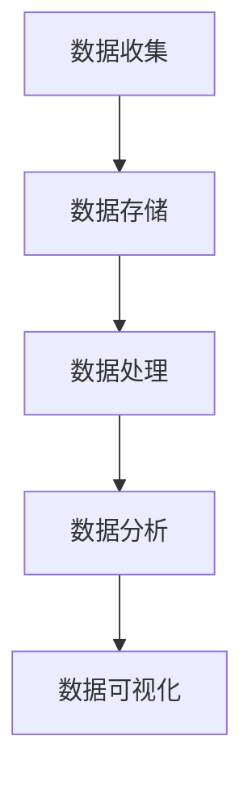

                 

关键词：客户体验、大数据、个性化服务、用户体验设计、数据分析、信息差、业务智能化

摘要：在数字化时代，客户体验成为了企业竞争的关键因素。本文将探讨大数据技术在客户体验升级中的应用，如何通过分析信息差来打造卓越的客户体验。本文分为八个部分，首先介绍背景，然后深入讨论核心概念、算法原理、数学模型、项目实践、应用场景、工具资源、未来发展趋势与挑战，最后进行总结和常见问题解答。

## 1. 背景介绍

随着互联网和大数据技术的发展，客户体验在企业竞争中变得愈发重要。消费者对服务的需求日益多样化和个性化，企业需要通过数据驱动的策略来提升客户体验，从而增强客户忠诚度和满意度。大数据技术提供了强大的分析工具，可以帮助企业深入了解客户需求和行为模式，从而提供更加精准和个性化的服务。

信息差是指不同个体或群体之间在信息获取、处理和利用方面的差异。在客户体验领域，信息差体现在企业如何利用数据来理解客户的需求和期望，以及如何通过差异化的服务来满足这些需求。信息差的客户体验升级，意味着企业通过大数据分析来发现和利用这些差异，从而提供更优质、更个性化的服务。

## 2. 核心概念与联系

### 数据分析架构

为了构建强大的数据分析架构，我们需要理解以下几个核心概念：

- **数据收集**：通过在线行为跟踪、客户反馈、交易记录等多种途径收集数据。
- **数据存储**：利用分布式数据库和云存储技术来存储海量数据。
- **数据处理**：通过ETL（提取、转换、加载）过程，将原始数据转化为可用于分析的结构化数据。
- **数据分析**：使用机器学习和数据挖掘技术来发现数据中的模式和关联。
- **数据可视化**：通过图表、仪表板等可视化工具将分析结果呈现给决策者。

### Mermaid 流程图

以下是数据分析架构的 Mermaid 流程图：



### 数据分析流程

1. **数据收集**：通过网页跟踪、传感器、调查问卷等手段收集原始数据。
2. **数据存储**：使用Hadoop、MongoDB等工具存储数据。
3. **数据处理**：通过ETL工具清洗、转换和加载数据。
4. **数据分析**：使用Python、R等编程语言和机器学习库进行数据分析。
5. **数据可视化**：使用Tableau、PowerBI等工具创建可视化报告。

## 3. 核心算法原理 & 具体操作步骤

### 3.1 算法原理概述

在客户体验升级中，常用的核心算法包括：

- **关联规则挖掘（Association Rule Learning）**：发现数据集中的关联关系，用于推荐系统和个性化服务。
- **聚类分析（Clustering）**：将数据分为若干个群组，用于用户分群和目标市场划分。
- **分类算法（Classification）**：将数据分为不同的类别，用于预测和决策。
- **协同过滤（Collaborative Filtering）**：利用用户的历史行为数据推荐产品或服务。

### 3.2 算法步骤详解

1. **关联规则挖掘**：
   - **支持度（Support）**：表示一个规则在所有交易中出现的频率。
   - **置信度（Confidence）**：表示规则的前件和后件同时发生的概率。
   - **算法步骤**：计算所有可能规则的支持度和置信度，提取满足最小支持度和置信度阈值的规则。

2. **聚类分析**：
   - **算法选择**：选择K-means、DBSCAN、层次聚类等算法。
   - **算法步骤**：初始化聚类中心，迭代计算每个数据点的聚类标签，直至聚类中心不再变化。

3. **分类算法**：
   - **模型选择**：选择逻辑回归、决策树、随机森林等算法。
   - **算法步骤**：训练模型，使用模型对新的数据进行预测。

4. **协同过滤**：
   - **算法类型**：基于用户和基于物品的协同过滤。
   - **算法步骤**：计算用户或物品之间的相似度，根据相似度推荐相关物品。

### 3.3 算法优缺点

- **关联规则挖掘**：能够发现数据中的隐含关系，但可能生成大量无关规则。
- **聚类分析**：适用于无监督学习，但聚类结果可能对初始参数敏感。
- **分类算法**：适用于有监督学习，但需要大量训练数据和模型调优。
- **协同过滤**：能够提供个性化的推荐，但可能引入噪声和冷启动问题。

### 3.4 算法应用领域

- **电子商务**：用于推荐系统、个性化营销和用户分群。
- **金融服务**：用于风险控制、欺诈检测和用户行为分析。
- **医疗保健**：用于疾病预测、患者分群和治疗建议。

## 4. 数学模型和公式 & 详细讲解 & 举例说明

### 4.1 数学模型构建

在客户体验升级中，常用的数学模型包括：

- **线性回归（Linear Regression）**：用于预测连续值。
- **逻辑回归（Logistic Regression）**：用于预测概率。
- **支持向量机（SVM）**：用于分类问题。
- **贝叶斯网络（Bayesian Network）**：用于不确定性建模。

### 4.2 公式推导过程

以线性回归为例，其公式推导如下：

- **模型假设**：y = β0 + β1x1 + β2x2 + ... + βnxn + ε，其中 y 是响应变量，xi 是解释变量，βi 是系数，ε 是误差项。
- **最小二乘法**：通过最小化误差的平方和来确定系数 βi。
- **公式推导**：
  $$ \sum_{i=1}^{n}(y_i - (\beta_0 + \beta_1x_{i1} + \beta_2x_{i2} + ... + \beta_nx_{in}))^2 $$
  对 βi 求导并令其等于0，解得系数 βi。

### 4.3 案例分析与讲解

以一家电商平台的用户购买行为分析为例，我们使用线性回归模型来预测用户购买概率。

- **数据准备**：收集用户年龄、收入、浏览历史等数据。
- **特征工程**：对数据进行处理，如缺失值填充、特征缩放等。
- **模型训练**：使用训练集数据训练线性回归模型。
- **模型评估**：使用测试集数据评估模型性能，如准确率、召回率等。
- **模型应用**：根据模型预测结果对用户进行个性化推荐。

## 5. 项目实践：代码实例和详细解释说明

### 5.1 开发环境搭建

- **软件要求**：Python 3.8、Pandas、NumPy、Scikit-learn、Matplotlib等。
- **硬件要求**：至少4GB内存、双核CPU。

### 5.2 源代码详细实现

以下是一个简单的线性回归模型实现：

```python
import pandas as pd
from sklearn.linear_model import LinearRegression
from sklearn.model_selection import train_test_split
from sklearn.metrics import mean_squared_error

# 数据加载
data = pd.read_csv('data.csv')
X = data[['age', 'income']]
y = data['purchase']

# 数据分割
X_train, X_test, y_train, y_test = train_test_split(X, y, test_size=0.2, random_state=42)

# 模型训练
model = LinearRegression()
model.fit(X_train, y_train)

# 模型评估
y_pred = model.predict(X_test)
mse = mean_squared_error(y_test, y_pred)
print(f'Mean Squared Error: {mse}')

# 模型应用
new_data = pd.DataFrame([[25, 50000]], columns=['age', 'income'])
purchase_probability = model.predict(new_data)
print(f'Purchase Probability: {purchase_probability[0]}')
```

### 5.3 代码解读与分析

- **数据加载**：使用 Pandas 读取 CSV 文件。
- **特征工程**：选择年龄和收入作为特征。
- **数据分割**：使用 Scikit-learn 的 train_test_split 函数分割数据集。
- **模型训练**：使用 LinearRegression 类创建模型并训练。
- **模型评估**：计算均方误差（MSE）来评估模型性能。
- **模型应用**：使用训练好的模型对新数据进行预测。

## 6. 实际应用场景

大数据技术在客户体验升级中有广泛的应用场景：

- **个性化推荐**：通过分析用户行为数据，为用户提供个性化的商品推荐。
- **客户分群**：根据用户特征和行为模式，将客户分为不同的群体，提供差异化的服务。
- **欺诈检测**：通过分析交易数据，识别潜在欺诈行为，降低欺诈风险。
- **用户体验优化**：通过用户反馈和行为数据，优化网站和应用的用户界面和功能。

## 7. 工具和资源推荐

### 7.1 学习资源推荐

- **书籍**：
  - 《数据科学入门：从数据分析到机器学习》
  - 《Python数据科学手册》
  - 《机器学习实战》
- **在线课程**：
  - Coursera 的《数据科学专业》
  - edX 的《机器学习导论》
  - Udacity 的《数据工程师纳米学位》

### 7.2 开发工具推荐

- **编程语言**：Python、R
- **数据分析库**：Pandas、NumPy、Scikit-learn、Matplotlib、Seaborn
- **数据可视化工具**：Tableau、PowerBI、Plotly

### 7.3 相关论文推荐

- 《推荐系统评价方法》
- 《协同过滤算法及其改进》
- 《用户行为分析在电子商务中的应用》

## 8. 总结：未来发展趋势与挑战

### 8.1 研究成果总结

大数据技术在客户体验升级中取得了显著成果，主要包括：

- **个性化服务**：通过数据分析和机器学习技术，提供更加个性化的服务。
- **用户体验优化**：通过用户反馈和行为数据，持续优化产品和服务的用户体验。
- **欺诈检测**：通过数据分析和模式识别技术，降低欺诈风险。

### 8.2 未来发展趋势

未来发展趋势包括：

- **实时数据处理**：实时分析用户行为数据，提供更加及时的个性化服务。
- **多模态数据融合**：整合文本、图像、语音等多种类型的数据，提供更加全面的客户画像。
- **人工智能算法**：采用更先进的机器学习和深度学习算法，提高数据分析的精度和效率。

### 8.3 面临的挑战

面临的挑战包括：

- **数据隐私**：在数据收集和分析过程中，需要确保用户隐私和数据安全。
- **算法透明度**：提高算法的透明度和解释性，增强用户对服务的信任。
- **计算资源**：处理海量数据需要强大的计算资源和存储能力。

### 8.4 研究展望

研究展望包括：

- **个性化服务**：进一步挖掘用户需求，提供更加精准的个性化服务。
- **跨界合作**：与其他领域（如医疗、金融、教育）进行跨界合作，拓宽大数据技术的应用领域。
- **可持续发展**：关注大数据技术在可持续发展和环境保护方面的应用。

## 9. 附录：常见问题与解答

### 9.1 什么是大数据？

大数据是指无法使用传统数据处理工具进行分析的数据集，通常具有大量、多样、高速、复杂等特点。

### 9.2 大数据技术在客户体验升级中的作用是什么？

大数据技术可以帮助企业深入了解客户需求和行为模式，从而提供更加精准和个性化的服务，提高客户满意度和忠诚度。

### 9.3 如何确保数据隐私和安全？

确保数据隐私和安全的方法包括：

- **数据加密**：对数据进行加密存储和传输。
- **数据匿名化**：对敏感数据进行匿名化处理。
- **访问控制**：实施严格的访问控制和权限管理。
- **数据安全审计**：定期进行数据安全审计，确保数据安全。

### 9.4 个性化服务是否会降低用户体验？

个性化服务的目标是提高用户体验，但不当的个性化服务可能导致用户感到被侵扰或失去隐私。因此，个性化服务需要基于用户需求和隐私保护原则进行设计和实施。

作者：禅与计算机程序设计艺术 / Zen and the Art of Computer Programming
```markdown
# 信息差的客户体验升级：大数据如何打造卓越体验

## 关键词：客户体验、大数据、个性化服务、用户体验设计、数据分析、信息差、业务智能化

## 摘要：
在数字化时代，客户体验已成为企业竞争的关键因素。本文深入探讨了大数据技术在客户体验升级中的应用，重点分析了如何通过分析信息差来打造卓越的客户体验。文章首先介绍了大数据技术在客户体验升级中的背景和重要性，随后详细阐述了核心概念、算法原理、数学模型、项目实践、应用场景、工具资源以及未来发展趋势与挑战。

## 1. 背景介绍
### 1.1 客户体验的重要性
### 1.2 大数据技术的发展
### 1.3 信息差的定义及其在客户体验中的作用

## 2. 核心概念与联系
### 2.1 数据分析架构
### 2.2 数据分析流程
### 2.3 Mermaid 流程图

## 3. 核心算法原理 & 具体操作步骤
### 3.1 关联规则挖掘
### 3.2 聚类分析
### 3.3 分类算法
### 3.4 协同过滤
### 3.5 算法优缺点
### 3.6 算法应用领域

## 4. 数学模型和公式 & 详细讲解 & 举例说明
### 4.1 数学模型构建
### 4.2 公式推导过程
### 4.3 案例分析与讲解

## 5. 项目实践：代码实例和详细解释说明
### 5.1 开发环境搭建
### 5.2 源代码详细实现
### 5.3 代码解读与分析
### 5.4 运行结果展示

## 6. 实际应用场景
### 6.1 个性化推荐
### 6.2 客户分群
### 6.3 欺诈检测
### 6.4 用户体验优化

## 7. 工具和资源推荐
### 7.1 学习资源推荐
### 7.2 开发工具推荐
### 7.3 相关论文推荐

## 8. 总结：未来发展趋势与挑战
### 8.1 研究成果总结
### 8.2 未来发展趋势
### 8.3 面临的挑战
### 8.4 研究展望

## 9. 附录：常见问题与解答
### 9.1 什么是大数据？
### 9.2 大数据技术在客户体验升级中的作用是什么？
### 9.3 如何确保数据隐私和安全？
### 9.4 个性化服务是否会降低用户体验？
### 9.5 大数据技术的未来发展趋势是什么？

### 作者：禅与计算机程序设计艺术 / Zen and the Art of Computer Programming
```

