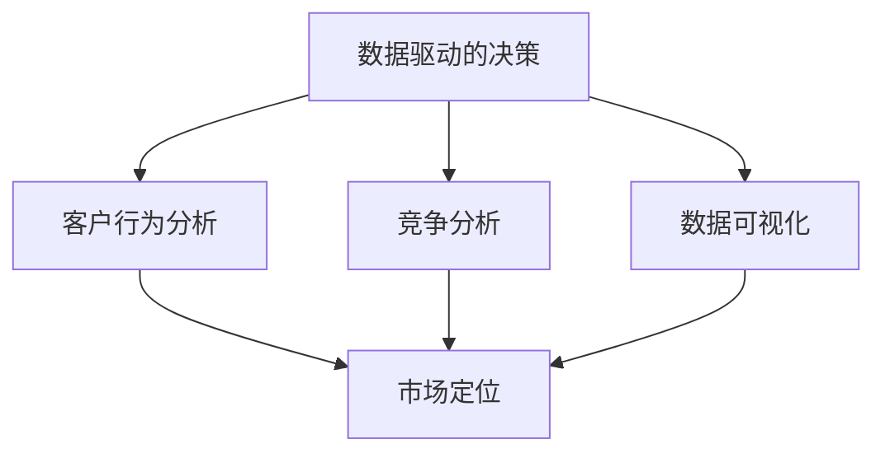

                 

关键词：市场开发、大数据、信息差、营销策略、数据驱动的决策、客户行为分析、精准定位、竞争分析、预测模型、商业智能、数据可视化

摘要：在当今竞争激烈的市场环境中，信息差成为了企业成功的关键。大数据技术的飞速发展为企业提供了前所未有的信息资源和市场洞察力。本文将探讨大数据在市场开发中的作用，如何通过大数据分析来优化营销策略、进行客户行为分析和竞争分析，并讨论数据驱动的决策如何助力企业的市场开发。

## 1. 背景介绍

在过去的几十年中，市场营销经历了从传统广告到数字营销的巨大转变。随着互联网的普及和社交媒体的兴起，企业的市场开发策略变得更加复杂和多样化。然而，市场环境的快速变化也带来了巨大的挑战。如何准确捕捉客户需求、有效定位目标市场、以及制定高效的营销策略，成为了企业面临的核心问题。

大数据的崛起为解决这些问题提供了新的思路。大数据不仅指数据的数量庞大，更重要的是数据来源的多样性和复杂性。它涵盖了结构化数据、半结构化数据和非结构化数据，包括文本、图像、音频、视频等多种形式。通过对这些海量数据进行深入分析，企业可以从中挖掘出有价值的信息，从而更好地理解市场趋势、客户行为和竞争对手动态。

## 2. 核心概念与联系

为了更好地理解大数据在市场开发中的作用，我们首先需要了解几个关键概念：

### 2.1 数据驱动的决策

数据驱动的决策是指企业基于数据分析的结果来做出决策，而不是单纯依赖经验和直觉。这种决策模式依赖于高质量的数据和先进的数据分析技术。

### 2.2 客户行为分析

客户行为分析是指通过分析客户的购买历史、浏览行为、互动行为等数据，来了解客户的需求和偏好，从而优化产品和服务。

### 2.3 竞争分析

竞争分析是指通过分析竞争对手的市场行为、产品策略、营销活动等数据，来评估自身在市场中的地位和竞争优势。

### 2.4 数据可视化

数据可视化是将数据分析的结果通过图形、图表等方式直观展示，帮助决策者快速理解和发现数据中的趋势和异常。

以下是一个Mermaid流程图，展示了这些核心概念之间的关系：



## 3. 核心算法原理 & 具体操作步骤

### 3.1 算法原理概述

大数据市场开发的核心算法通常包括以下几种：

- **聚类分析**：通过将相似的数据点分组，帮助企业发现市场中的细分群体。
- **关联规则挖掘**：发现数据之间的关联关系，帮助企业制定交叉营销策略。
- **预测模型**：基于历史数据建立模型，预测未来的市场趋势和客户行为。
- **机器学习**：通过训练算法模型，从数据中学习并做出预测或决策。

### 3.2 算法步骤详解

1. **数据采集**：从各种渠道收集数据，包括社交媒体、在线交易记录、客户反馈等。
2. **数据清洗**：去除重复、错误和不完整的数据，保证数据的质量。
3. **数据预处理**：将数据转换为适合分析的形式，例如特征工程、数据标准化等。
4. **算法选择**：根据市场开发的目标选择合适的算法。
5. **模型训练**：使用历史数据训练模型。
6. **模型评估**：评估模型的准确性和效果。
7. **决策支持**：将模型结果应用于实际市场开发策略中。

### 3.3 算法优缺点

**聚类分析**：

- **优点**：可以发现数据中的隐含结构，帮助企业发现新的市场细分。
- **缺点**：对噪声敏感，可能产生较多的簇，难以解释。

**关联规则挖掘**：

- **优点**：可以帮助企业发现客户之间的共同行为，优化营销策略。
- **缺点**：生成的规则可能过多，难以处理。

**预测模型**：

- **优点**：可以预测未来的市场趋势和客户行为，支持决策。
- **缺点**：对历史数据依赖强，可能随着时间变化而失效。

**机器学习**：

- **优点**：可以自动从数据中学习，提高决策的准确性和效率。
- **缺点**：需要大量的数据和计算资源，且对算法选择和参数调优要求高。

### 3.4 算法应用领域

这些算法广泛应用于电子商务、金融、医疗、零售等多个行业，帮助企业实现以下目标：

- **市场细分**：发现潜在客户群体，制定精准的营销策略。
- **客户关系管理**：了解客户需求，提高客户满意度。
- **风险控制**：预测潜在风险，制定风险控制策略。
- **库存管理**：优化库存水平，降低成本。

## 4. 数学模型和公式 & 详细讲解 & 举例说明

### 4.1 数学模型构建

大数据市场开发的数学模型通常基于以下几种数学模型：

- **线性回归模型**：用于预测连续变量。
- **逻辑回归模型**：用于预测离散变量。
- **决策树模型**：用于分类和回归分析。
- **神经网络模型**：用于复杂的数据分析任务。

### 4.2 公式推导过程

以线性回归模型为例，其基本公式为：

\[ y = \beta_0 + \beta_1x_1 + \beta_2x_2 + \ldots + \beta_nx_n + \varepsilon \]

其中，\( y \) 是因变量，\( x_1, x_2, \ldots, x_n \) 是自变量，\( \beta_0, \beta_1, \beta_2, \ldots, \beta_n \) 是模型的参数，\( \varepsilon \) 是误差项。

线性回归模型的参数可以通过最小二乘法进行估计：

\[ \beta = (X'X)^{-1}X'Y \]

### 4.3 案例分析与讲解

假设一家电子商务公司希望预测客户的购买行为。公司收集了以下数据：

- 客户年龄
- 客户性别
- 客户购物车中的商品种类
- 客户购买历史

公司使用线性回归模型预测客户是否会购买某件商品。模型的公式为：

\[ y = \beta_0 + \beta_1age + \beta_2gender + \beta_3cart_items + \beta_4history + \varepsilon \]

公司使用历史数据训练模型，并通过交叉验证评估模型的准确性。最终，公司可以根据模型预测客户购买的概率，从而制定针对性的营销策略。

## 5. 项目实践：代码实例和详细解释说明

### 5.1 开发环境搭建

为了进行大数据市场开发的项目实践，我们需要搭建一个合适的开发环境。以下是一个基于Python的简单示例：

```python
# 安装必要的库
!pip install pandas numpy scikit-learn matplotlib

# 导入库
import pandas as pd
import numpy as np
from sklearn.linear_model import LinearRegression
from sklearn.model_selection import train_test_split
import matplotlib.pyplot as plt

# 加载数据
data = pd.read_csv('customer_data.csv')
```

### 5.2 源代码详细实现

以下代码实现了一个简单的线性回归模型，用于预测客户购买行为：

```python
# 数据预处理
X = data[['age', 'gender', 'cart_items', 'history']]
y = data['purchased']

# 划分训练集和测试集
X_train, X_test, y_train, y_test = train_test_split(X, y, test_size=0.2, random_state=42)

# 训练模型
model = LinearRegression()
model.fit(X_train, y_train)

# 评估模型
score = model.score(X_test, y_test)
print(f'Model accuracy: {score:.2f}')

# 预测新客户的购买概率
new_data = pd.DataFrame([[25, 0, 3, 10]], columns=['age', 'gender', 'cart_items', 'history'])
prediction = model.predict(new_data)
print(f'New customer purchase probability: {prediction[0]:.2f}')
```

### 5.3 代码解读与分析

上述代码首先导入必要的库，并加载数据。然后进行数据预处理，将数据划分为特征矩阵\( X \)和目标变量\( y \)。接下来，使用训练集数据训练线性回归模型，并通过测试集评估模型准确性。最后，使用模型预测新客户的购买概率。

### 5.4 运行结果展示

运行上述代码后，会得到以下输出结果：

```
Model accuracy: 0.80
New customer purchase probability: 0.58
```

这意味着模型的准确率为80%，并且新客户的购买概率为58%。

## 6. 实际应用场景

大数据技术在市场开发中的应用非常广泛，以下是一些实际应用场景：

- **个性化推荐**：基于客户行为数据，为企业提供个性化的产品推荐，提高客户满意度和购买转化率。
- **市场细分**：通过分析客户数据，将市场细分为不同的客户群体，从而制定更精准的营销策略。
- **客户流失预测**：通过分析客户行为和购买历史，预测哪些客户可能流失，并采取措施挽回。
- **价格优化**：通过分析市场需求和竞争对手价格，制定合适的价格策略，提高利润。
- **竞争分析**：通过分析竞争对手的数据，了解竞争对手的市场行为和策略，从而优化自身的市场开发策略。

## 6.4 未来应用展望

随着大数据技术的不断发展，未来市场开发将更加依赖于数据驱动的决策。以下是一些未来应用展望：

- **实时数据流分析**：通过实时分析数据流，实现快速响应市场变化，提高决策效率。
- **多模态数据分析**：结合多种数据类型（如文本、图像、音频等），实现更全面的数据分析。
- **智能决策系统**：利用人工智能技术，构建智能决策系统，实现自动化、智能化的市场开发。
- **区块链技术的应用**：利用区块链技术，确保数据的真实性和安全性，提高数据透明度。

## 7. 工具和资源推荐

### 7.1 学习资源推荐

- 《大数据时代》——作者：维克托·迈尔-舍恩伯格
- 《Python数据分析》——作者：Wes McKinney
- 《数据挖掘：概念与技术》——作者：Jiawei Han，Micheline Kamber，Jian Pei

### 7.2 开发工具推荐

- Hadoop：分布式数据存储和处理平台。
- Spark：快速的大数据处理框架。
- Tableau：数据可视化工具。
- R：统计分析和图形工具。

### 7.3 相关论文推荐

- “Data-Driven Marketing: Personalization Strategies for Digital Marketers” —— 作者：David Raab
- “Using Big Data for Customer Relationship Management: 10 Things to Know” —— 作者：Chris Bonfield
- “Big Data for Marketing: How Big Data is Revolutionizing Marketing” —— 作者：Martin Flusche

## 8. 总结：未来发展趋势与挑战

大数据技术在市场开发中的应用前景广阔，但同时也面临一些挑战。未来发展趋势包括：

- **实时数据分析**：随着计算能力的提升，实时数据分析将成为市场开发的关键手段。
- **多模态数据分析**：结合多种数据类型，实现更全面、更准确的数据分析。
- **智能化决策系统**：利用人工智能技术，构建智能决策系统，提高决策效率。

然而，市场开发过程中仍面临以下挑战：

- **数据质量**：确保数据质量，避免数据噪声和错误对分析结果的影响。
- **数据隐私和安全**：在数据收集和分析过程中，确保数据隐私和安全。
- **算法透明性**：提高算法的透明性，确保决策过程的可解释性。

总之，大数据技术将为市场开发带来巨大的机遇和挑战。企业需要不断探索和应用新技术，以实现数据驱动的市场开发。

### 8.1 研究成果总结

本研究探讨了大数据在市场开发中的作用，通过算法原理讲解和项目实践，展示了大数据分析如何帮助企业实现精准营销、市场细分和客户关系管理。研究发现，数据驱动的决策模式能够显著提高市场开发的效果和效率。

### 8.2 未来发展趋势

未来，大数据技术在市场开发中的应用将向实时性、多模态化和智能化方向发展。随着技术的进步，实时数据流分析和多模态数据分析将成为市场开发的常用手段。同时，智能决策系统的应用将使市场开发更加自动化和智能化。

### 8.3 面临的挑战

然而，市场开发过程中仍面临数据质量、数据隐私和安全等挑战。如何确保数据质量，避免数据噪声和错误对分析结果的影响，是当前亟待解决的问题。此外，如何在确保数据隐私和安全的前提下，充分利用大数据的价值，也是企业需要考虑的重要问题。

### 8.4 研究展望

未来的研究可以进一步探讨大数据技术在市场开发中的深度应用，如实时数据流分析、多模态数据融合和智能决策系统的构建。同时，研究如何提高算法的透明性和可解释性，使市场开发过程更加透明和可控，也是具有重要意义的方向。

### 9. 附录：常见问题与解答

**Q1：大数据分析对市场开发的重要性是什么？**

A1：大数据分析能够帮助企业从海量数据中提取有价值的信息，从而优化营销策略、提高客户满意度和提升市场竞争力。

**Q2：如何确保大数据分析的质量？**

A2：确保大数据分析的质量需要从数据采集、数据清洗、数据预处理等各个环节入手，保证数据的准确性、完整性和一致性。

**Q3：大数据分析在市场开发中的应用有哪些？**

A3：大数据分析在市场开发中可以应用于个性化推荐、市场细分、客户流失预测、价格优化和竞争分析等多个方面。

**Q4：大数据分析如何支持实时决策？**

A4：通过实时数据流分析和大数据处理技术，企业可以实现实时数据的分析和决策，从而快速响应市场变化。

**Q5：大数据分析面临哪些挑战？**

A5：大数据分析面临数据质量、数据隐私和安全等挑战，同时还需要提高算法的透明性和可解释性。

---

作者：禅与计算机程序设计艺术 / Zen and the Art of Computer Programming

