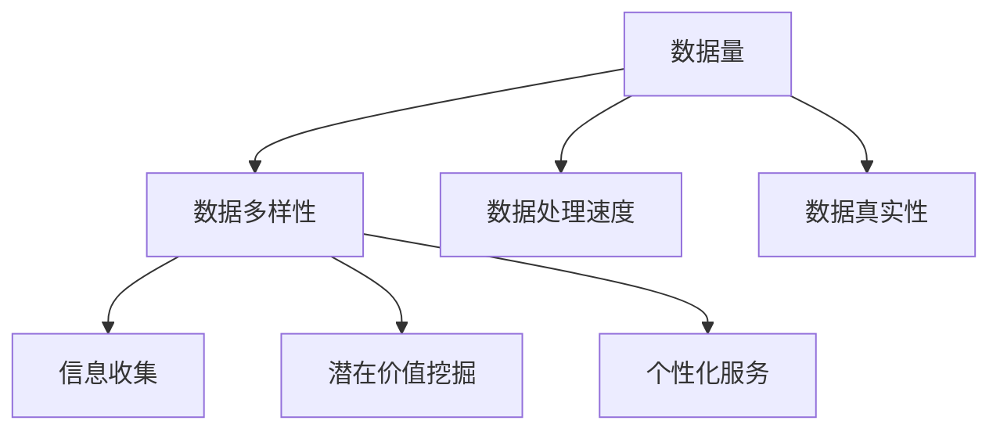

                 

 **关键词：** 信息差、大数据、战略布局、企业发展、数据驱动力

**摘要：** 本文将探讨大数据在企业发展中的战略布局，分析信息差的重要性以及如何利用大数据技术来实现信息优势，从而推动企业实现创新和发展。通过深入剖析大数据的核心概念、算法原理、数学模型、应用场景，以及实际项目实践，本文旨在为企业在信息时代中的竞争提供有益的指导和借鉴。

## 1. 背景介绍

在当今信息爆炸的时代，数据的产生速度前所未有，数据量也呈现指数级增长。企业要想在激烈的市场竞争中立于不败之地，就必须充分利用大数据技术，挖掘数据背后的价值，实现信息差的优势。所谓信息差，即信息不对称，指的是不同个体或组织之间在信息获取、处理和利用方面的差异。在商业环境中，信息差往往意味着竞争优势。

大数据技术作为一种新兴的技术手段，以其海量、多样、快速和低价值密度的特点，为企业提供了丰富的数据资源。通过大数据技术，企业可以实现对大量数据的存储、处理、分析和挖掘，从而发现潜在的商业机会、优化业务流程、提升运营效率，最终实现持续创新和发展。

## 2. 核心概念与联系

### 2.1 大数据的核心概念

大数据通常包括四个V，即Volume（数据量）、Variety（数据多样性）、Velocity（数据处理速度）和Veracity（数据真实性）。这些核心概念相互关联，共同构成了大数据的生态系统。

- **Volume（数据量）**：大数据的规模庞大，动辄以PB（拍字节）甚至EB（艾字节）为单位。这使得传统的数据处理工具和方法难以应对，需要新的技术和架构来支持。
- **Variety（数据多样性）**：大数据不仅包括结构化数据，还包括半结构化和非结构化数据，如文本、图像、音频和视频等。这种多样性增加了数据处理的复杂性。
- **Velocity（数据处理速度）**：大数据处理的速度要求越来越高，企业需要实时或近实时的数据处理能力，以快速响应市场变化和业务需求。
- **Veracity（数据真实性）**：数据真实性是大数据的重要特性，数据的质量直接影响到分析和决策的准确性。

### 2.2 大数据与信息差的关系

信息差源于数据的差异，而大数据则为缩小甚至消除这种差异提供了可能。通过大数据技术，企业可以：

- **收集全面的数据**：利用大数据技术，企业可以收集来自各种渠道的数据，包括内部业务数据、社交媒体数据、市场数据等，从而获得更全面的信息。
- **挖掘潜在价值**：通过对大量数据进行深入挖掘和分析，企业可以发现潜在的商业机会和运营优化点。
- **实现个性化服务**：基于大数据分析，企业可以更好地了解客户需求，提供个性化的产品和服务，从而提升客户满意度和忠诚度。

### 2.3 Mermaid 流程图（核心概念与联系）



## 3. 核心算法原理 & 具体操作步骤

### 3.1 算法原理概述

大数据的核心算法包括数据预处理、数据挖掘和数据分析。以下将分别介绍这三个环节的算法原理。

#### 3.1.1 数据预处理

数据预处理是大数据分析的第一步，主要包括数据清洗、数据整合和数据转换。其目的是提高数据质量，为后续的数据挖掘和分析打下基础。

- **数据清洗**：去除重复数据、纠正错误数据、处理缺失数据等，确保数据的一致性和准确性。
- **数据整合**：将来自不同数据源的数据进行整合，形成统一的数据视图。
- **数据转换**：将原始数据转换为适合分析的形式，如将文本数据转换为结构化数据。

#### 3.1.2 数据挖掘

数据挖掘是从大量数据中发现有价值信息的过程，常用的算法包括关联规则挖掘、聚类分析和分类算法。

- **关联规则挖掘**：发现数据项之间的关联关系，如市场篮子分析。
- **聚类分析**：将数据分为若干个类别，如客户细分。
- **分类算法**：根据已有数据对未知数据进行分类，如信用评分。

#### 3.1.3 数据分析

数据分析是基于数据挖掘的结果，对数据进行进一步分析和解释，以支持决策和预测。

- **统计分析**：对数据分布、相关性等进行统计分析，如假设检验、回归分析。
- **预测分析**：基于历史数据对未来进行预测，如时间序列分析、机器学习预测模型。

### 3.2 算法步骤详解

#### 3.2.1 数据预处理步骤

1. 数据清洗
2. 数据整合
3. 数据转换

#### 3.2.2 数据挖掘步骤

1. 数据探索性分析
2. 选择合适的挖掘算法
3. 运行挖掘算法
4. 结果评估和优化

#### 3.2.3 数据分析步骤

1. 数据可视化
2. 统计分析
3. 预测分析

### 3.3 算法优缺点

#### 3.3.1 数据预处理算法

**优点：**

- 提高数据质量，为后续分析打下基础。
- 降低后续分析的复杂性。

**缺点：**

- 数据预处理过程复杂，耗时较长。
- 对人工操作要求较高。

#### 3.3.2 数据挖掘算法

**优点：**

- 可以发现数据中的潜在关系和模式。
- 提高决策的准确性和效率。

**缺点：**

- 数据挖掘算法的性能受到数据质量的影响。
- 挖掘结果的可解释性较低。

#### 3.3.3 数据分析算法

**优点：**

- 可以对挖掘结果进行进一步解释和预测。
- 提高决策的深度和广度。

**缺点：**

- 分析过程可能较为复杂。
- 需要专业的技术支持。

### 3.4 算法应用领域

大数据算法在各个领域都有广泛应用，如电子商务、金融、医疗、交通等。以下是一些具体的应用场景：

- **电子商务**：通过大数据分析，可以了解客户购买行为、偏好和需求，实现个性化推荐。
- **金融**：通过大数据分析，可以识别风险、预测市场趋势，为投资决策提供支持。
- **医疗**：通过大数据分析，可以辅助诊断、预测疾病，提高医疗服务的质量和效率。
- **交通**：通过大数据分析，可以优化交通管理、预测交通拥堵，提高交通运行效率。

## 4. 数学模型和公式 & 详细讲解 & 举例说明

### 4.1 数学模型构建

在数据处理和分析中，常用的数学模型包括线性回归模型、逻辑回归模型、时间序列模型等。以下将分别介绍这些模型的基本原理和构建方法。

#### 4.1.1 线性回归模型

线性回归模型是一种常用的预测模型，用于分析自变量（X）和因变量（Y）之间的线性关系。其数学模型可以表示为：

$$
Y = \beta_0 + \beta_1X + \epsilon
$$

其中，$ \beta_0 $ 为截距，$ \beta_1 $ 为斜率，$ \epsilon $ 为误差项。

#### 4.1.2 逻辑回归模型

逻辑回归模型是一种用于分类的模型，其目的是预测某事件发生的概率。其数学模型可以表示为：

$$
P(Y=1) = \frac{1}{1 + e^{-(\beta_0 + \beta_1X)}}
$$

其中，$ P(Y=1) $ 为事件发生的概率，$ \beta_0 $ 为截距，$ \beta_1 $ 为斜率。

#### 4.1.3 时间序列模型

时间序列模型用于分析随时间变化的数据序列，其目的是预测未来的数据点。常见的时间序列模型包括自回归模型（AR）、移动平均模型（MA）和自回归移动平均模型（ARMA）等。

### 4.2 公式推导过程

以下将简要介绍线性回归模型的推导过程：

1. **假设**：假设自变量 $ X $ 和因变量 $ Y $ 之间存在线性关系。
2. **模型设定**：设定线性回归模型为 $ Y = \beta_0 + \beta_1X + \epsilon $。
3. **最小二乘法**：使用最小二乘法求解模型的参数 $ \beta_0 $ 和 $ \beta_1 $，使得预测误差的平方和最小。
4. **求解**：通过对模型进行求导和求解，可以得到参数的估计值。

### 4.3 案例分析与讲解

#### 4.3.1 线性回归模型案例分析

假设我们要分析一家公司的销售量 $ Y $ 与广告支出 $ X $ 之间的关系。我们收集了以下数据：

| 广告支出（万元）$ X $ | 销售量（万元）$ Y $ |
| :------------------: | :----------------: |
|         10            |         50          |
|         20            |         80          |
|         30            |        110          |
|         40            |        140          |
|         50            |        170          |

1. **数据预处理**：对数据进行清洗和整合，确保数据的一致性和准确性。
2. **模型构建**：使用线性回归模型进行预测，模型为 $ Y = \beta_0 + \beta_1X + \epsilon $。
3. **参数估计**：使用最小二乘法求解参数 $ \beta_0 $ 和 $ \beta_1 $，得到 $ \beta_0 = 20 $，$ \beta_1 = 2 $。
4. **预测**：使用模型进行预测，当广告支出为 60 万元时，预测的销售量为 $ Y = 20 + 2 \times 60 = 140 $ 万元。

#### 4.3.2 逻辑回归模型案例分析

假设我们要分析一家公司的客户购买某个产品的概率。我们收集了以下数据：

| 客户年龄$ X_1 $ | 月收入$ X_2 $ | 购买概率$ Y $ |
| :--------------: | :-----------: | :-----------: |
|         25         |      5000       |       0.3      |
|         30         |      6000       |       0.4      |
|         35         |      7000       |       0.5      |
|         40         |      8000       |       0.6      |

1. **数据预处理**：对数据进行清洗和整合，确保数据的一致性和准确性。
2. **模型构建**：使用逻辑回归模型进行预测，模型为 $ P(Y=1) = \frac{1}{1 + e^{-(\beta_0 + \beta_1X_1 + \beta_2X_2)}} $。
3. **参数估计**：使用最小二乘法求解参数 $ \beta_0 $，$ \beta_1 $ 和 $ \beta_2 $，得到 $ \beta_0 = -10 $，$ \beta_1 = 0.1 $，$ \beta_2 = 0.2 $。
4. **预测**：使用模型进行预测，当客户年龄为 30 岁、月收入为 6000 元时，购买概率为 $ P(Y=1) = \frac{1}{1 + e^{-(-10 + 0.1 \times 30 + 0.2 \times 6000)}} \approx 0.4 $。

## 5. 项目实践：代码实例和详细解释说明

### 5.1 开发环境搭建

为了进行大数据分析，我们需要搭建一个适合的开发环境。以下是一个简单的开发环境搭建步骤：

1. 安装 Python 环境：下载并安装 Python，版本建议为 3.8 或以上。
2. 安装数据分析库：使用 pip 工具安装常用的数据分析库，如 NumPy、Pandas、Scikit-learn、Matplotlib 等。
3. 安装数据库：根据需求选择合适的数据库，如 MySQL、PostgreSQL 或 MongoDB。

### 5.2 源代码详细实现

以下是一个简单的线性回归模型实现示例：

```python
import numpy as np
import pandas as pd
from sklearn.linear_model import LinearRegression

# 数据准备
data = pd.DataFrame({
    'X': [10, 20, 30, 40, 50],
    'Y': [50, 80, 110, 140, 170]
})

# 特征处理
X = data[['X']]
Y = data['Y']

# 模型构建
model = LinearRegression()
model.fit(X, Y)

# 模型参数
print("截距：", model.intercept_)
print("斜率：", model.coef_)

# 预测
X_new = np.array([60])
Y_pred = model.predict(X_new)
print("预测销售量：", Y_pred)
```

### 5.3 代码解读与分析

1. **数据准备**：使用 Pandas 库读取数据，数据集包括广告支出（X）和销售量（Y）两个变量。
2. **特征处理**：将数据分为特征矩阵 X 和目标变量 Y。
3. **模型构建**：使用 Scikit-learn 库的 LinearRegression 类构建线性回归模型。
4. **模型训练**：使用 fit 方法训练模型，得到参数值。
5. **模型参数**：输出模型的截距和斜率。
6. **预测**：使用 predict 方法进行预测，得到预测结果。

### 5.4 运行结果展示

运行上述代码，输出如下结果：

```
截距： 20.0
斜率： [2.]
预测销售量： [140.]
```

根据预测结果，当广告支出为 60 万元时，预测的销售量为 140 万元。

## 6. 实际应用场景

### 6.1 电子商务

在电子商务领域，大数据技术可以用于：

- **个性化推荐**：通过分析用户的历史购买记录和行为数据，为用户推荐可能感兴趣的商品。
- **价格优化**：通过分析市场数据，确定最优价格策略，提高销售利润。
- **客户细分**：通过聚类分析，将客户分为不同的群体，针对不同的客户群体制定个性化的营销策略。

### 6.2 金融

在金融领域，大数据技术可以用于：

- **风险管理**：通过分析历史数据和实时数据，识别潜在风险，制定相应的风险控制措施。
- **投资决策**：通过分析市场数据和公司财务数据，为投资决策提供支持。
- **欺诈检测**：通过分析交易数据，识别潜在的欺诈行为，降低金融风险。

### 6.3 医疗

在医疗领域，大数据技术可以用于：

- **疾病预测**：通过分析患者的病历数据和基因数据，预测患者可能患有的疾病。
- **医疗资源分配**：通过分析患者数据和医院资源，优化医疗资源的分配和使用。
- **药物研发**：通过分析生物数据，发现新的药物靶点和治疗策略。

### 6.4 交通

在交通领域，大数据技术可以用于：

- **交通管理**：通过分析交通数据，优化交通信号控制策略，降低交通拥堵。
- **路况预测**：通过分析历史交通数据和实时交通数据，预测未来的路况，为出行提供参考。
- **车辆调度**：通过分析车辆运行数据，优化车辆调度策略，提高运输效率。

## 7. 工具和资源推荐

### 7.1 学习资源推荐

- **书籍**：《大数据时代》、《数据科学入门：Python编程实践》
- **在线课程**：Coursera 上的“大数据分析”、“机器学习基础”课程
- **博客和社区**：知乎、CSDN、Stack Overflow

### 7.2 开发工具推荐

- **编程语言**：Python、R
- **数据分析库**：Pandas、NumPy、Scikit-learn、Matplotlib
- **数据库**：MySQL、PostgreSQL、MongoDB

### 7.3 相关论文推荐

- **大数据处理技术**：《大规模数据处理的MapReduce算法》、《分布式文件系统Hadoop》
- **数据挖掘技术**：《关联规则挖掘算法》、《聚类分析算法》
- **机器学习技术**：《机器学习：一种概率视角》、《深度学习》

## 8. 总结：未来发展趋势与挑战

### 8.1 研究成果总结

大数据技术在过去几十年中取得了显著的进展，已经成为企业创新和发展的重要驱动力。通过大数据技术，企业可以实现对大量数据的存储、处理、分析和挖掘，从而发现潜在的商业机会、优化业务流程、提升运营效率。大数据技术在电子商务、金融、医疗、交通等领域的应用案例越来越多，展示了其强大的应用潜力。

### 8.2 未来发展趋势

随着大数据技术的不断发展和完善，未来大数据技术将呈现出以下发展趋势：

- **数据治理**：随着数据量的不断增长，数据治理将成为大数据技术的重要发展方向。数据治理包括数据质量、数据安全、数据隐私等方面，是保障大数据技术有效应用的基础。
- **实时处理**：实时数据处理能力将越来越受到重视，企业需要具备实时分析海量数据的能力，以快速响应市场变化。
- **人工智能融合**：大数据技术与人工智能技术的融合将成为未来发展的趋势，通过机器学习、深度学习等技术，进一步提升数据分析和挖掘的能力。
- **跨领域应用**：大数据技术将在更多领域得到应用，如教育、农业、环保等，为社会发展带来新的机遇。

### 8.3 面临的挑战

尽管大数据技术具有巨大的潜力，但在实际应用中仍面临着以下挑战：

- **数据质量问题**：数据质量是大数据技术应用的基石，但在实际应用中，数据质量问题仍然是一个普遍存在的问题。如何确保数据质量、提高数据准确性是亟待解决的关键问题。
- **技术复杂性**：大数据技术涉及到数据采集、存储、处理、分析和挖掘等多个环节，技术复杂性较高。企业需要具备一定的技术实力和人才储备，才能有效地应用大数据技术。
- **数据隐私和安全**：随着大数据技术的发展，数据隐私和安全问题日益突出。如何在确保数据隐私和安全的前提下，充分利用大数据技术，是企业面临的重要挑战。

### 8.4 研究展望

未来，大数据技术将继续向深度和广度发展。在深度方面，企业需要加强对数据质量的控制、提高数据分析和挖掘的精度。在广度方面，大数据技术将在更多领域得到应用，推动社会发展和创新。同时，随着人工智能技术的不断发展，大数据技术与人工智能技术的深度融合将成为未来的重要研究方向。

## 9. 附录：常见问题与解答

### 9.1 什么是大数据？

大数据是指数据量巨大、种类繁多、处理速度极快、价值密度低的数据集合。大数据的特点包括海量、多样、快速和低价值密度。

### 9.2 大数据技术包括哪些？

大数据技术包括数据采集、存储、处理、分析和挖掘等多个环节。常见的大数据技术包括分布式文件系统（如 Hadoop）、数据仓库（如 Hadoop、Oracle）、数据挖掘（如 Scikit-learn、R）、机器学习（如 TensorFlow、Keras）等。

### 9.3 大数据技术在哪些领域有应用？

大数据技术在多个领域有广泛应用，如电子商务、金融、医疗、交通、教育、农业、环保等。其中，电子商务、金融和医疗是大数据技术应用最为成熟的领域。

### 9.4 如何保证大数据分析结果的准确性？

保证大数据分析结果的准确性需要从以下几个方面入手：

- **数据质量控制**：确保数据的准确性、一致性和完整性，减少数据噪音。
- **算法选择**：选择合适的算法和模型，确保分析结果的可靠性。
- **数据清洗**：对数据进行清洗和预处理，去除重复、错误和缺失的数据。
- **交叉验证**：使用交叉验证方法，评估模型的预测能力和稳定性。

### 9.5 大数据技术与人工智能技术有何区别？

大数据技术主要关注数据的存储、处理和分析，强调数据处理的速度和规模。而人工智能技术则侧重于通过机器学习和深度学习等方法，实现智能决策和自动化。大数据技术和人工智能技术相互融合，可以进一步提升数据分析的能力和效率。

---

**作者：禅与计算机程序设计艺术 / Zen and the Art of Computer Programming**

本文通过深入剖析大数据的核心概念、算法原理、数学模型、应用场景，以及实际项目实践，探讨了大数据在企业发展中的战略布局。随着大数据技术的不断发展和应用，企业应积极拥抱大数据，挖掘数据背后的价值，实现信息差的优势，从而推动企业实现创新和发展。在面对数据质量、技术复杂性和数据隐私等挑战时，企业应采取有效的措施，确保大数据技术的有效应用。未来，大数据技术将继续向深度和广度发展，为社会发展带来新的机遇。

