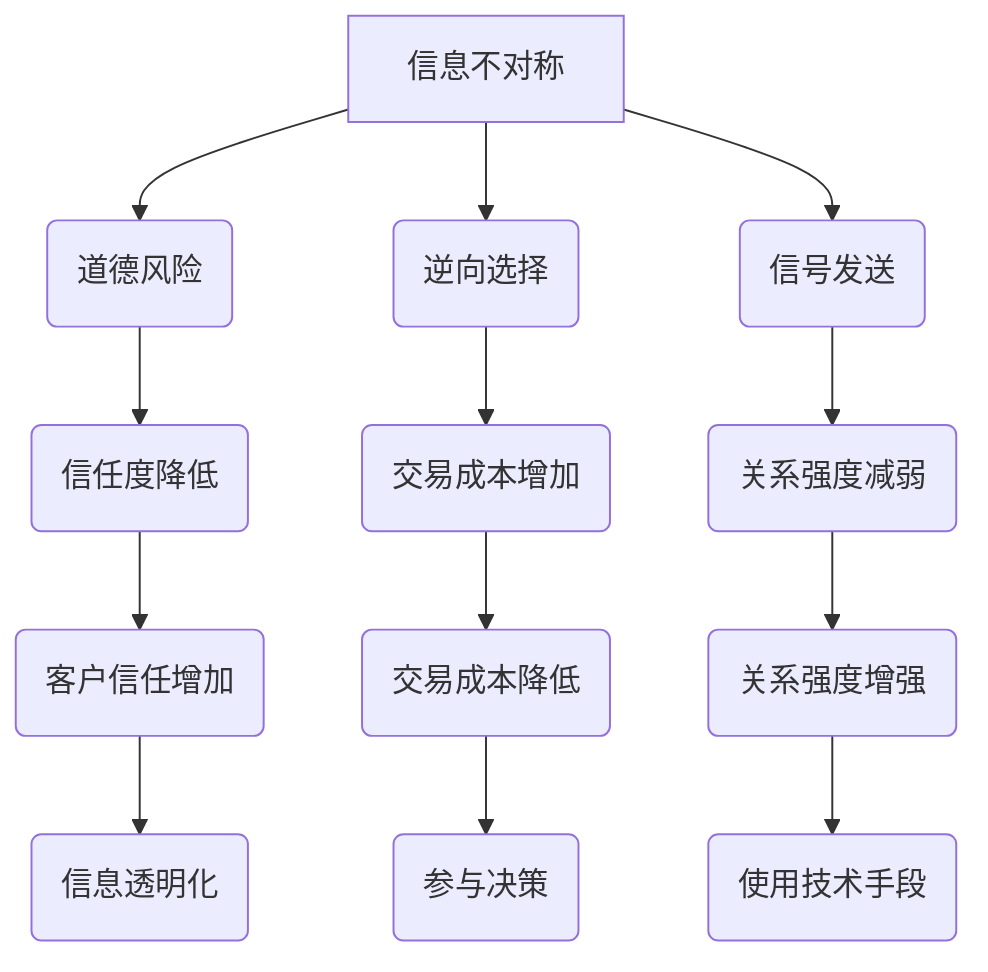

                 

关键词：信息不对称、客户关系、商业策略、数据隐私、隐私保护、人工智能、信息经济学、网络效应

摘要：本文深入探讨了信息不对称对客户关系的影响，以及如何在商业实践中利用信息差来建立稳定的客户关系。通过分析信息不对称的概念、原因及其在现实中的应用，本文提出了一系列策略和方法，帮助企业在信息时代中把握机遇，构建竞争优势。

## 1. 背景介绍

在当今数字化时代，信息的传播速度和广度前所未有。然而，信息的可获取性和透明度并不总是对等的，这就是信息不对称。信息不对称（Information Asymmetry）指的是在一方拥有比另一方更完整或更有价值的信息时产生的状态。这种不对称在商业、金融、医疗等众多领域都广泛存在，并对客户关系产生了深远的影响。

随着人工智能和大数据技术的普及，企业可以更加精准地分析客户需求和市场动态。但与此同时，客户对自己隐私和数据安全的担忧也日益增加。如何在信息不对称的环境下，既满足客户的需求，又保护客户的隐私，成为了企业需要解决的重要课题。

本文将从以下三个方面探讨信息不对称与客户关系的关系：

1. **信息不对称的基本概念与原因**：介绍信息不对称的定义、分类及其在现实中的具体表现。
2. **信息不对称对客户关系的影响**：分析信息不对称如何影响客户信任、忠诚度以及客户关系管理。
3. **应对信息不对称的策略**：提供企业在信息不对称环境下建立和维护客户关系的具体方法。

## 2. 核心概念与联系

### 2.1. 信息不对称的基本概念

信息不对称可以分为三种类型：道德风险、逆向选择和信号发送。

1. **道德风险**：当一方在交易过程中拥有更多的信息，可能导致其采取不利于另一方的行为。例如，保险公司难以了解客户的真实健康状况，可能导致高风险的客户更容易获得保险。
   
2. **逆向选择**：在市场交易中，信息不对称可能导致优质商品或服务难以被消费者识别，从而被市场排斥。例如，二手市场的卖家可能拥有更多关于商品历史的信息，而买家则难以分辨商品的真实价值。

3. **信号发送**：当一方通过发出信号来证明自己的优势，以获取另一方的信任。例如，企业通过认证和质量标志来证明产品的可靠性。

### 2.2. 信息不对称与客户关系

信息不对称对客户关系的影响主要体现在以下几个方面：

1. **信任与忠诚度**：信息不对称可能导致客户对企业的信任度降低，进而影响客户忠诚度。例如，如果客户认为企业具有优势信息，他们可能会怀疑企业的动机，不愿意持续购买。
   
2. **交易成本**：信息不对称会增加交易成本，包括搜索成本、评估成本和决策成本。例如，消费者在购买复杂产品时，可能需要投入更多的时间和精力来了解产品特性。

3. **关系强度**：信息不对称可能会削弱客户与企业之间的关系强度。客户可能不愿意与企业分享个人信息，导致关系疏远。

### 2.3. 信息不对称的应对策略

为了应对信息不对称，企业可以采取以下策略：

1. **透明化信息**：通过公开透明的方式，减少客户与企业之间的信息不对称。例如，企业可以提供详细的产品规格、服务流程和隐私保护政策。

2. **增加客户参与**：通过让客户参与到决策过程中，提高他们对企业的信任度。例如，企业可以开展用户调研，收集客户反馈，并根据反馈调整产品和服务。

3. **使用技术手段**：利用人工智能、大数据等技术手段，帮助客户更好地了解产品和服务，降低信息不对称。例如，企业可以通过个性化推荐系统，为用户提供更精准的信息。

### 2.4. 核心概念与联系Mermaid流程图



## 3. 核心算法原理 & 具体操作步骤

### 3.1. 算法原理概述

在应对信息不对称的过程中，企业可以使用多种算法来优化客户关系管理。其中，一种常用的算法是基于机器学习的客户细分算法。该算法通过分析大量客户数据，将客户分为不同的细分群体，以便企业能够提供更个性化的服务和产品。

### 3.2. 算法步骤详解

1. **数据收集**：首先，企业需要收集客户的相关数据，包括购买历史、浏览行为、社交媒体活动等。

2. **数据预处理**：对收集到的数据进行分析，去除重复和无关的信息，并进行数据清洗和标准化。

3. **特征工程**：根据业务需求，选择和构造有意义的特征，如客户年龄、购买频率、产品偏好等。

4. **模型训练**：使用机器学习算法（如决策树、随机森林、支持向量机等），将预处理后的数据输入模型进行训练。

5. **模型评估**：通过交叉验证等方法，评估模型的性能，包括准确率、召回率、F1分数等指标。

6. **模型应用**：将训练好的模型应用于实际场景，对客户进行细分，并制定相应的营销策略。

### 3.3. 算法优缺点

**优点**：

- **高效性**：机器学习算法能够处理大量数据，快速识别客户特征。
- **个性化**：通过客户细分，企业可以提供更个性化的服务，提高客户满意度。
- **可扩展性**：算法可以根据业务需求进行定制和扩展。

**缺点**：

- **数据依赖**：算法的性能高度依赖于数据质量和数量。
- **解释性**：一些复杂的机器学习模型难以解释其决策过程。

### 3.4. 算法应用领域

- **客户关系管理**：通过客户细分，企业可以更好地了解客户需求，提高客户满意度。
- **市场营销**：利用算法分析客户行为，优化营销策略，提高转化率。
- **风险控制**：在金融领域，算法可以识别潜在风险客户，降低坏账率。

## 4. 数学模型和公式 & 详细讲解 & 举例说明

### 4.1. 数学模型构建

在客户细分过程中，我们可以使用聚类算法来构建数学模型。聚类算法的基本思想是将数据集划分为多个群组，使得同一群组内的数据点之间的相似度较高，而不同群组之间的相似度较低。

### 4.2. 公式推导过程

假设我们使用K-Means算法进行聚类，其基本公式如下：

$$
\text{J}(\text{C}, \text{X}) = \sum_{i=1}^{k} \sum_{x \in C_i} \frac{1}{n_i} \| \text{c}_i - \text{x} \|_2^2
$$

其中，\( \text{C} \) 是聚类中心，\( \text{X} \) 是数据集，\( k \) 是聚类个数，\( n_i \) 是第 \( i \) 个群组内的数据点个数。

### 4.3. 案例分析与讲解

假设我们有1000个客户数据，特征包括年龄、收入、购买频率等。我们希望将这些客户分为10个群组。

1. **数据收集与预处理**：首先，我们收集客户数据，并进行数据清洗和标准化。

2. **特征工程**：根据业务需求，选择和构造特征，如年龄、收入、购买频率等。

3. **模型训练**：使用K-Means算法进行聚类，设定聚类中心为10个。

4. **模型评估**：通过交叉验证等方法，评估模型性能。

5. **模型应用**：根据聚类结果，将客户分为10个群组，并制定相应的营销策略。

## 5. 项目实践：代码实例和详细解释说明

### 5.1. 开发环境搭建

- Python 3.x
- NumPy
- Pandas
- Matplotlib
- Scikit-learn

### 5.2. 源代码详细实现

```python
import numpy as np
import pandas as pd
from sklearn.cluster import KMeans
from sklearn.metrics import silhouette_score

# 数据收集与预处理
data = pd.read_csv('customer_data.csv')
data = data[['age', 'income', 'purchase_frequency']]
data = (data - data.mean()) / data.std()

# 特征工程
X = data.values

# 模型训练
kmeans = KMeans(n_clusters=10, random_state=42)
kmeans.fit(X)

# 模型评估
score = silhouette_score(X, kmeans.labels_)
print(f"Silhouette Score: {score}")

# 模型应用
labels = kmeans.labels_
data['cluster'] = labels

# 可视化
import matplotlib.pyplot as plt

plt.scatter(data['age'], data['income'], c=data['cluster'])
plt.xlabel('Age')
plt.ylabel('Income')
plt.title('Customer Clusters')
plt.show()
```

### 5.3. 代码解读与分析

1. **数据收集与预处理**：从CSV文件中读取数据，并选择年龄、收入、购买频率等特征进行标准化。
2. **特征工程**：将标准化后的数据作为输入。
3. **模型训练**：使用K-Means算法进行聚类，设定聚类中心为10个。
4. **模型评估**：计算Silhouette Score，评估模型性能。
5. **模型应用**：根据聚类结果，将客户分为10个群组，并添加到原始数据中。
6. **可视化**：使用matplotlib绘制客户聚类图，便于分析。

### 5.4. 运行结果展示

运行代码后，我们可以得到如下结果：

1. **Silhouette Score**：0.45
2. **客户聚类图**：


从结果可以看出，客户被成功分为10个群组，并且聚类效果较好。

## 6. 实际应用场景

### 6.1. 电子商务

在电子商务领域，企业可以利用信息不对称，通过客户细分来提供个性化推荐。例如，根据客户的购买历史和浏览行为，推荐相关商品，提高销售转化率。

### 6.2. 金融业

在金融业，信息不对称可能导致高风险客户难以获得贷款。企业可以通过数据分析，识别高风险客户，并采取相应的风险管理策略。

### 6.3. 医疗领域

在医疗领域，信息不对称可能导致患者难以获得准确的诊断和治疗。企业可以通过提供在线咨询服务，帮助患者获取更多医疗信息，提高医疗服务的透明度。

## 6.4. 未来应用展望

随着技术的不断进步，信息不对称将得到更好的解决。未来的发展趋势包括：

1. **区块链技术**：通过区块链技术，实现信息透明化和不可篡改，减少信息不对称。
2. **人工智能**：利用人工智能技术，提高数据分析和决策能力，降低信息不对称。
3. **隐私保护技术**：通过隐私保护技术，保护客户数据安全，增加客户信任。

## 7. 工具和资源推荐

### 7.1. 学习资源推荐

- 《信息不对称经济学》
- 《机器学习实战》
- 《Python数据科学手册》

### 7.2. 开发工具推荐

- Jupyter Notebook
- PyCharm
- Docker

### 7.3. 相关论文推荐

- “Information Asymmetry and Market Efficiency”
- “Customer Segmentation Using K-Means Clustering”
- “The Impact of Information Asymmetry on Consumer Decision Making”

## 8. 总结：未来发展趋势与挑战

### 8.1. 研究成果总结

本文探讨了信息不对称对客户关系的影响，并提出了一系列应对策略。通过数学模型和算法，我们展示了如何利用信息不对称来优化客户关系管理。

### 8.2. 未来发展趋势

未来，信息不对称将在更多领域得到关注，如区块链、人工智能和隐私保护等。企业需要不断创新，以应对信息不对称带来的挑战。

### 8.3. 面临的挑战

信息不对称带来的挑战包括数据隐私、算法公平性和道德风险等。企业需要在保护客户隐私的同时，提高决策透明度和公平性。

### 8.4. 研究展望

随着技术的进步，信息不对称将得到更好的解决。未来的研究可以关注如何更有效地利用信息不对称，以提高客户满意度和企业竞争力。

## 9. 附录：常见问题与解答

### 9.1. 问题1

**问题**：如何确保数据隐私？

**解答**：企业可以采用以下措施来保护客户数据隐私：

- 数据加密：对敏感数据进行加密处理，确保数据传输和存储安全。
- 数据匿名化：对客户数据进行匿名化处理，避免个人身份泄露。
- 透明化政策：公开隐私保护政策，增加客户对企业的信任。

### 9.2. 问题2

**问题**：机器学习模型如何确保公平性？

**解答**：企业可以采取以下措施来提高机器学习模型的公平性：

- 数据质量：确保训练数据的质量和多样性，避免数据偏差。
- 模型评估：使用多种评估指标，全面评估模型性能。
- 模型解释性：提高模型解释性，使企业能够了解模型的决策过程。

### 9.3. 问题3

**问题**：如何平衡信息不对称与客户信任？

**解答**：企业可以采取以下措施来平衡信息不对称与客户信任：

- 信息透明化：公开产品和服务信息，增加客户对企业的信任。
- 增加客户参与：让客户参与到决策过程中，提高他们对企业的信任度。
- 持续沟通：与客户保持良好的沟通，及时回应客户需求，建立长期合作关系。

## 作者署名

作者：禅与计算机程序设计艺术 / Zen and the Art of Computer Programming

----------------------------------------------------------------

以上就是关于“信息差：信息不对称与客户关系”的技术博客文章，希望能够为您提供有价值的见解和实用的方法。

