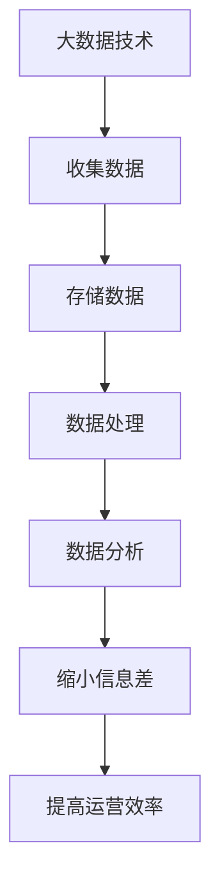

                 

关键词：信息差、大数据、运营效率、数据分析、商业决策、人工智能

摘要：随着大数据技术的迅猛发展，信息差在商业运营中逐渐成为提升效率的关键因素。本文将深入探讨大数据如何通过信息差，帮助企业实现精准运营，优化决策流程，并最终提升整体运营效率。

## 1. 背景介绍

在当今的商业环境中，数据已成为企业最宝贵的资产。大数据技术的进步，使得企业能够收集、存储、处理和分析海量数据，从而挖掘出隐藏在数据中的价值。信息差，即不同主体之间拥有的信息差异，在商业运营中起到了至关重要的作用。通过信息差，企业可以更好地了解市场、客户需求，优化业务流程，提高运营效率。

### 大数据的定义和重要性

大数据（Big Data）是指无法使用传统数据处理工具进行捕捉、管理和处理的数据集合。这些数据通常具有4V特点：Volume（大量）、Velocity（高速）、Variety（多样性）和 Veracity（真实性）。

- **Volume（大量）**：大数据涉及的规模巨大，远远超出了普通计算机系统的处理能力。
- **Velocity（高速）**：数据生成和处理的速度非常快，要求实时分析。
- **Variety（多样性）**：数据类型丰富，包括结构化数据、半结构化数据和非结构化数据。
- **Veracity（真实性）**：数据的真实性和准确性对分析结果至关重要。

大数据的重要性体现在多个方面：

- **商业洞察**：通过分析大数据，企业可以更深入地了解市场趋势、客户需求和竞争对手动态，从而做出更明智的决策。
- **运营优化**：大数据分析可以帮助企业识别运营中的瓶颈和问题，优化业务流程，降低成本。
- **风险控制**：大数据分析可以帮助企业预测潜在风险，提前采取措施，减少损失。
- **个性化服务**：通过分析大数据，企业可以提供更个性化的产品和服务，提升客户满意度。

### 信息差的商业价值

信息差在商业运营中具有显著的价值。具体来说，信息差可以带来以下几方面的优势：

- **竞争优势**：拥有更准确和及时的信息，企业可以在市场竞争中占据优势地位。
- **决策优势**：通过分析信息差，企业可以做出更明智的商业决策，提高成功率。
- **成本控制**：了解市场的信息差可以帮助企业优化采购、生产和销售等环节，降低成本。
- **风险规避**：通过分析信息差，企业可以识别潜在风险，采取预防措施，规避风险。

## 2. 核心概念与联系

### 大数据与运营效率的关系

大数据与运营效率之间存在紧密的联系。通过大数据技术，企业可以实时获取和分析各种运营数据，从而对业务流程进行优化，提高运营效率。

### 信息差的定义和类型

信息差是指不同主体之间拥有的信息差异。根据信息差的来源和用途，可以分为以下几种类型：

- **市场信息差**：企业对不同市场环境的了解程度不同，导致市场信息差。
- **客户信息差**：企业对客户需求的了解程度不同，导致客户信息差。
- **运营信息差**：企业在内部运营过程中产生的信息差异。
- **供应链信息差**：企业在供应链管理过程中产生的信息差异。

### 大数据与信息差的关系

大数据与信息差之间存在紧密的联系。通过大数据技术，企业可以收集、存储、处理和分析海量数据，从而缩小不同主体之间的信息差异，提高运营效率。

### Mermaid 流程图

以下是一个简化的 Mermaid 流程图，展示了大数据与信息差之间的关系：



## 3. 核心算法原理 & 具体操作步骤

### 3.1 算法原理概述

大数据处理的核心算法包括数据采集、数据存储、数据清洗、数据分析等。以下是这些算法的基本原理：

- **数据采集**：通过传感器、网站抓取、日志等方式收集数据。
- **数据存储**：使用数据库、数据仓库、NoSQL 等技术存储数据。
- **数据清洗**：使用 ETL（提取、转换、加载）等技术清洗数据，确保数据质量。
- **数据分析**：使用统计、机器学习等技术对数据进行处理和分析。

### 3.2 算法步骤详解

1. **数据采集**：

   - 使用传感器、网站抓取、日志等方式收集数据。
   - 对采集到的数据进行初步筛选和清洗，去除重复和错误数据。

2. **数据存储**：

   - 根据数据类型和需求，选择合适的存储技术，如 MySQL、Hadoop、NoSQL 等。
   - 对数据进行分区、分片等优化操作，提高数据存储和查询效率。

3. **数据清洗**：

   - 使用 ETL 工具对数据进行清洗和转换，确保数据质量。
   - 检查数据的一致性、完整性和准确性。

4. **数据分析**：

   - 使用 SQL、Python、R 等工具对数据进行处理和分析。
   - 应用统计、机器学习等技术，提取数据中的价值信息。

### 3.3 算法优缺点

- **优点**：

  - 提高数据收集和处理效率。
  - 实现对海量数据的实时分析和预测。
  - 提高决策的准确性和效率。

- **缺点**：

  - 数据存储和处理成本较高。
  - 对数据质量和算法要求较高。
  - 需要专业的技术团队支持。

### 3.4 算法应用领域

大数据算法广泛应用于金融、医疗、电商、物联网等领域，以下是一些具体的应用案例：

- **金融领域**：使用大数据分析预测股票价格、风险评估、客户需求分析等。
- **医疗领域**：使用大数据分析进行疾病预测、治疗方案优化、医疗资源分配等。
- **电商领域**：使用大数据分析进行用户行为分析、个性化推荐、广告投放优化等。
- **物联网领域**：使用大数据分析进行设备监控、故障预测、能源管理等。

## 4. 数学模型和公式 & 详细讲解 & 举例说明

### 4.1 数学模型构建

大数据分析中的数学模型主要包括统计模型和机器学习模型。以下是两个常见的数学模型：

1. **线性回归模型**：

   线性回归模型用于预测一个变量（因变量）与多个变量（自变量）之间的关系。其数学公式如下：

   $$Y = \beta_0 + \beta_1X_1 + \beta_2X_2 + ... + \beta_nX_n + \epsilon$$

   其中，$Y$ 为因变量，$X_1, X_2, ..., X_n$ 为自变量，$\beta_0, \beta_1, ..., \beta_n$ 为模型的参数，$\epsilon$ 为误差项。

2. **决策树模型**：

   决策树模型是一种基于特征分割的机器学习模型，用于分类和回归任务。其数学公式如下：

   $$f(X) = \sum_{i=1}^{n} \beta_i g_i(X)$$

   其中，$X$ 为输入特征向量，$g_i(X)$ 为第 $i$ 个特征分割函数，$\beta_i$ 为相应的权重。

### 4.2 公式推导过程

1. **线性回归模型**：

   线性回归模型的参数可以通过最小二乘法（Least Squares）进行估计。具体推导过程如下：

   $$\min_{\beta_0, \beta_1, ..., \beta_n} \sum_{i=1}^{m} (Y_i - \beta_0 - \beta_1X_{i1} - \beta_2X_{i2} - ... - \beta_nX_{in})^2$$

   对参数求偏导，并令偏导数等于 0，可以得到参数的估计值。

2. **决策树模型**：

   决策树模型的构建过程可以通过信息增益（Information Gain）或基尼不纯度（Gini Impurity）进行。具体推导过程如下：

   - 信息增益：

     $$IG(D, A) = H(D) - H(D|A)$$

     其中，$H(D)$ 为原始数据的熵，$H(D|A)$ 为根据特征 $A$ 分割后的子数据的熵。

   - 基尼不纯度：

     $$Gini(D) = 1 - \sum_{i=1}^{n} \frac{f_i}{N}$$

     其中，$f_i$ 为子数据的频率，$N$ 为总数据量。

### 4.3 案例分析与讲解

以电商领域的用户行为分析为例，说明大数据分析在商业决策中的应用。

1. **数据收集**：

   收集电商平台的用户浏览、购买、评论等行为数据。

2. **数据清洗**：

   清洗数据，去除重复和错误数据，确保数据质量。

3. **数据建模**：

   使用线性回归模型预测用户购买概率。以用户浏览商品种类和购买历史为自变量，预测用户购买概率为因变量。

   $$Y = \beta_0 + \beta_1X_1 + \beta_2X_2 + \epsilon$$

   其中，$X_1$ 为用户浏览商品种类数量，$X_2$ 为用户购买历史数量，$Y$ 为用户购买概率。

4. **模型评估**：

   使用交叉验证等方法评估模型性能，调整模型参数。

5. **应用场景**：

   根据模型预测结果，针对不同购买概率的用户群体，制定个性化的营销策略，提高转化率。

## 5. 项目实践：代码实例和详细解释说明

### 5.1 开发环境搭建

搭建大数据分析项目的开发环境，需要安装以下工具和库：

- Hadoop：分布式数据存储和处理框架
- Hive：基于 Hadoop 的数据仓库工具
- Spark：高性能分布式计算框架
- Python：数据分析编程语言

### 5.2 源代码详细实现

以下是一个简单的 Python 代码实例，用于分析电商平台用户行为数据：

```python
import pandas as pd
from sklearn.linear_model import LinearRegression

# 读取用户行为数据
data = pd.read_csv("user_behavior.csv")

# 数据预处理
X = data[["browse_items", "purchase_history"]]
y = data["purchase_probability"]

# 建立线性回归模型
model = LinearRegression()
model.fit(X, y)

# 模型评估
score = model.score(X, y)
print("模型评分：", score)

# 预测用户购买概率
predicted_probabilities = model.predict(X)

# 输出预测结果
predictions = pd.DataFrame({"user_id": data["user_id"], "predicted_probability": predicted_probabilities})
predictions.to_csv("predictions.csv", index=False)
```

### 5.3 代码解读与分析

1. 导入必要的库和模块：

   - `pandas`：数据处理库
   - `sklearn.linear_model.LinearRegression`：线性回归模型

2. 读取用户行为数据，并进行预处理：

   - 读取 CSV 文件，将数据划分为自变量和因变量。

3. 建立线性回归模型，并训练模型：

   - 使用 `LinearRegression` 类建立模型，并使用 `fit` 方法训练模型。

4. 模型评估：

   - 使用 `score` 方法评估模型评分，评价模型性能。

5. 预测用户购买概率：

   - 使用 `predict` 方法预测用户购买概率，并将结果保存到 CSV 文件。

### 5.4 运行结果展示

运行上述代码后，会生成一个包含预测结果的 CSV 文件。用户可以根据预测结果，针对不同购买概率的用户群体，制定个性化的营销策略。

## 6. 实际应用场景

### 6.1 金融领域

在金融领域，大数据分析可以帮助银行和保险公司识别高风险客户、预测市场趋势、优化投资组合等。例如，通过对客户交易数据的分析，银行可以识别出可能存在欺诈行为的客户，并采取相应的防范措施。同时，通过对市场数据的分析，投资者可以更好地把握市场趋势，优化投资策略。

### 6.2 医疗领域

在医疗领域，大数据分析可以帮助医疗机构进行疾病预测、治疗方案优化、医疗资源分配等。例如，通过对患者病史和基因数据的分析，医生可以预测患者患某种疾病的风险，并制定个性化的治疗方案。此外，通过对医疗资源的分析，医院可以更好地分配医疗资源，提高医疗服务效率。

### 6.3 电商领域

在电商领域，大数据分析可以帮助企业进行用户行为分析、个性化推荐、广告投放优化等。例如，通过对用户浏览和购买数据的分析，企业可以更好地了解用户需求，提供个性化的产品推荐。同时，通过对广告数据的分析，企业可以优化广告投放策略，提高广告效果。

### 6.4 物联网领域

在物联网领域，大数据分析可以帮助企业进行设备监控、故障预测、能源管理等。例如，通过对设备运行数据的分析，企业可以预测设备故障，提前进行维护。此外，通过对能源数据的分析，企业可以优化能源使用，提高能源利用效率。

## 7. 工具和资源推荐

### 7.1 学习资源推荐

- 《大数据技术基础》
- 《机器学习实战》
- 《Python数据分析》
- 《深度学习》

### 7.2 开发工具推荐

- Hadoop
- Spark
- Hive
- Python

### 7.3 相关论文推荐

- "Deep Learning for Text Classification"
- "Hadoop: The Definitive Guide"
- "Data-Driven Business: The Data Guide to Better Decision-Making"
- "Deep Learning for Image Recognition"

## 8. 总结：未来发展趋势与挑战

### 8.1 研究成果总结

随着大数据技术的不断发展，信息差在商业运营中的应用越来越广泛。通过大数据分析，企业可以更好地了解市场、客户需求和竞争对手动态，从而提高运营效率。未来，大数据与人工智能、物联网等技术的融合将进一步提升信息差的应用价值。

### 8.2 未来发展趋势

- **实时数据分析**：随着大数据技术的进步，实时数据分析将成为企业运营的重要手段。
- **智能化决策支持**：大数据与人工智能技术的结合，将为企业提供更加智能化的决策支持。
- **个性化服务**：基于大数据分析，企业可以提供更加个性化的产品和服务。
- **跨领域应用**：大数据将在更多领域得到应用，如医疗、金融、物联网等。

### 8.3 面临的挑战

- **数据隐私和安全**：随着大数据应用的普及，数据隐私和安全问题日益突出。
- **数据质量和可靠性**：数据质量和可靠性对大数据分析结果至关重要。
- **算法透明性和公平性**：大数据算法的透明性和公平性备受关注，需要加强监管。
- **技术人才培养**：大数据分析需要专业的技术人才，人才培养和储备是关键。

### 8.4 研究展望

未来，大数据与人工智能、物联网等技术的融合将带来更多的应用场景和商业机会。通过不断创新和优化，大数据分析将为企业提供更加精准、智能的运营支持，助力企业实现持续增长。

## 9. 附录：常见问题与解答

### 9.1 什么是大数据？

大数据是指无法使用传统数据处理工具进行捕捉、存储、管理和处理的数据集合，具有大量、高速、多样性和真实性的特点。

### 9.2 大数据和人工智能有什么区别？

大数据侧重于数据的收集、存储、处理和分析，而人工智能侧重于通过算法和模型，从数据中提取知识、发现规律，实现智能决策和自动化。

### 9.3 大数据技术在商业运营中如何应用？

大数据技术在商业运营中的应用非常广泛，包括市场分析、客户分析、运营优化、风险控制等，帮助企业提高运营效率、降低成本、提升竞争力。

### 9.4 大数据如何提升运营效率？

大数据通过信息差，帮助企业更好地了解市场、客户需求和竞争对手动态，从而优化业务流程、提高决策质量，最终提升整体运营效率。

### 9.5 大数据分析的核心算法有哪些？

大数据分析的核心算法包括线性回归、决策树、神经网络、聚类等，用于数据建模、预测和分析。

### 9.6 如何保障大数据分析的质量和可靠性？

保障大数据分析的质量和可靠性，需要确保数据质量、算法模型的选择和调优、结果的可解释性等。

## 作者署名

作者：禅与计算机程序设计艺术 / Zen and the Art of Computer Programming
----------------------------------------------------------------

现在我们已经完成了文章的撰写，接下来我们将按照markdown格式将文章的内容整理输出。请稍等片刻。

