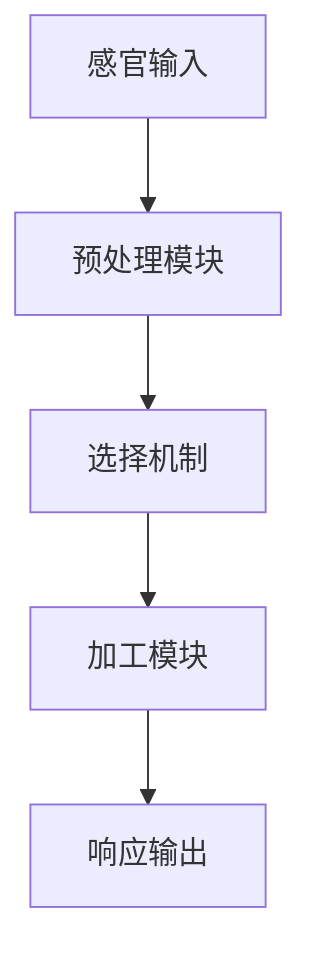
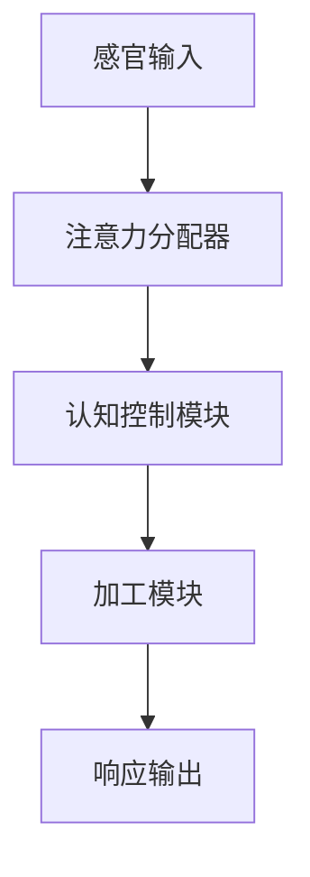
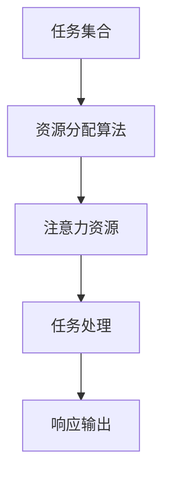
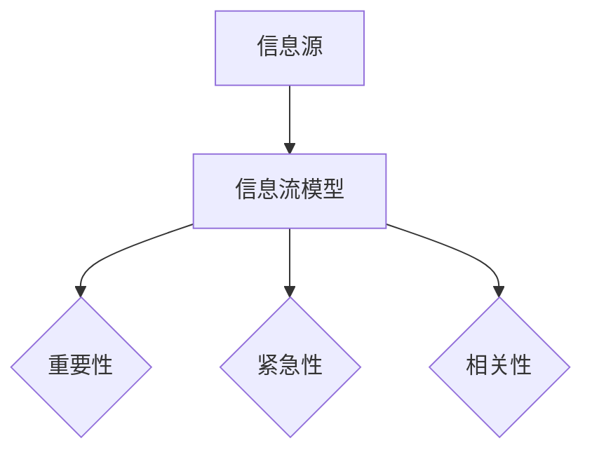
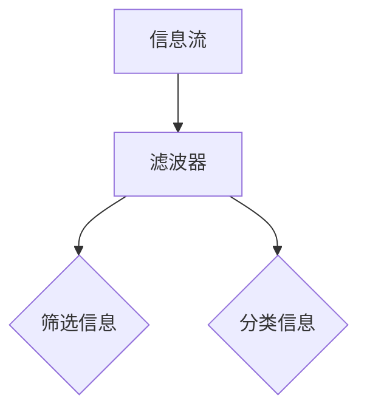
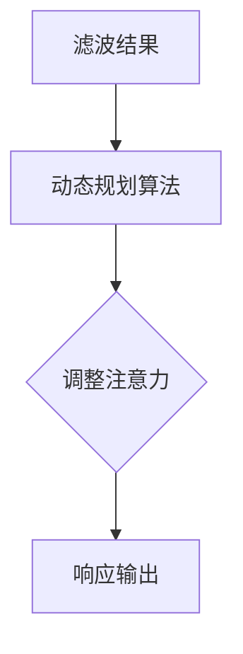

                 

 在当今这个信息爆炸的时代，注意力管理成为了一个至关重要的课题。无论是工作环境中的多重任务处理，还是个人生活中不断涌现的干扰因素，都使得保持专注和头脑清晰变得越来越困难。本文章旨在探讨注意力管理的核心概念、实践技巧以及相关算法，帮助读者在干扰和分心中保持高效的注意力集中。

> 关键词：注意力管理、分心干扰、注意力集中、信息过滤、专注技巧、算法原理

> 摘要：本文从信息时代的背景出发，探讨了注意力管理的重要性和面临的挑战。通过深入分析注意力管理的核心概念，介绍了相关的理论模型和算法，并结合实际应用场景，提供了一系列实践技巧，旨在帮助读者提升注意力管理能力，提高工作效率和生活质量。

## 1. 背景介绍

### 信息时代的特点

在信息时代，数据和信息以惊人的速度和规模涌现。社交媒体、即时通讯、电子邮件、新闻资讯等不断侵扰着我们的日常生活，使得信息过载成为一个普遍现象。根据一份来自国际数据公司（IDC）的报告，全球数据量预计到2025年将达到44ZB，这意味着平均每人每天将产生超过1.7GB的数据。

### 注意力管理的重要性

在这样一个充满干扰的环境中，如何有效地管理注意力变得至关重要。注意力管理不仅影响到个人的工作效率和生活质量，还与心理健康密切相关。研究表明，长期处于分心状态会导致记忆力下降、决策困难，甚至引发焦虑和抑郁等心理问题。

### 当前研究现状

目前，关于注意力管理的研究主要集中在理论模型、算法方法和实际应用方面。一些核心的理论模型包括注意力选择模型、认知控制模型和资源分配模型。而在算法方法方面，滤波理论、分治算法和动态规划等方法被广泛应用于注意力管理。

## 2. 核心概念与联系

### 注意力选择模型

注意力选择模型（Selective Attention Model）是研究注意力管理的基础。该模型认为，注意力是一种有限的认知资源，需要在不同刺激之间进行选择。图1展示了注意力选择模型的简化架构。



### 认知控制模型

认知控制模型（Cognitive Control Model）则进一步探讨了如何通过认知控制来调节注意力的分配。该模型认为，认知控制是一种高级认知功能，能够对注意力的流向进行灵活调整。图2展示了认知控制模型的基本架构。



### 资源分配模型

资源分配模型（Resource Allocation Model）考虑了注意力资源在不同任务之间的分配问题。该模型通过优化算法来决定在何时、如何将注意力资源分配给不同的任务。图3展示了资源分配模型的基本架构。



## 3. 核心算法原理 & 具体操作步骤

### 算法原理概述

注意力管理算法的核心在于如何高效地分配注意力资源。本文将介绍一种基于滤波理论的注意力管理算法。该算法通过建立信息流的滤波机制，动态调整注意力的流向，从而实现高效的注意力分配。

### 算法步骤详解

#### 步骤1：建立信息流模型

首先，我们需要建立一个信息流模型来表示输入的信息。每个信息单元可以包含以下属性：重要性、紧急性、相关性等。图4展示了信息流模型的基本结构。



#### 步骤2：信息滤波

接下来，我们利用滤波理论来对信息流进行过滤。滤波器可以根据预设的权重和阈值，对信息进行筛选和分类。图5展示了滤波器的工作原理。



#### 步骤3：动态调整注意力

根据滤波后的信息，我们可以动态调整注意力的流向。具体来说，我们可以使用动态规划算法来优化注意力的分配。图6展示了动态调整注意力的过程。



### 算法优缺点

#### 优点

- 高效：通过信息滤波和动态调整，算法能够快速响应用户的需求，实现高效的注意力管理。
- 灵活：算法可以根据不同的任务和环境动态调整注意力分配，具有较强的适应性。

#### 缺点

- 需要大量数据：算法的性能依赖于信息流的准确性和完整性，因此需要大量的数据支持。
- 难以量化：注意力管理是一个主观的过程，难以精确量化，因此算法的优化具有一定的局限性。

### 算法应用领域

注意力管理算法可以广泛应用于多个领域，包括但不限于：

- 工作效率提升：通过优化注意力的分配，提高工作效率和生产力。
- 人工智能：在人工智能系统中，注意力管理算法可以用于优化机器学习模型的训练过程。
- 健康管理：通过监测和调整注意力分配，有助于改善心理健康和睡眠质量。

## 4. 数学模型和公式 & 详细讲解 & 举例说明

### 数学模型构建

注意力管理算法的核心在于如何构建一个有效的数学模型来表示注意力的分配。本文采用一种基于马尔可夫决策过程（MDP）的数学模型。MDP模型可以通过以下公式表示：

$$
V^*(s) = \max_{a} \sum_{s'} p(s' | s, a) \cdot R(s, a, s')
$$

其中，$V^*(s)$ 表示在状态 $s$ 下采取动作 $a$ 的最优价值函数，$p(s' | s, a)$ 表示在状态 $s$ 下采取动作 $a$ 后转移到状态 $s'$ 的概率，$R(s, a, s')$ 表示在状态 $s$ 下采取动作 $a$ 后获得的即时奖励。

### 公式推导过程

#### 状态转移概率

首先，我们需要推导状态转移概率 $p(s' | s, a)$。根据马尔可夫性质，状态转移概率可以表示为：

$$
p(s' | s, a) = \frac{p(s', a | s)}{p(a | s)}
$$

其中，$p(s', a | s)$ 表示在状态 $s$ 下采取动作 $a$ 后同时进入状态 $s'$ 和采取动作 $a$ 的联合概率，$p(a | s)$ 表示在状态 $s$ 下采取动作 $a$ 的概率。

#### 即时奖励

接下来，我们需要推导即时奖励 $R(s, a, s')$。即时奖励可以表示为：

$$
R(s, a, s') = r(s, a) - c(s, a)
$$

其中，$r(s, a)$ 表示在状态 $s$ 下采取动作 $a$ 后获得的即时奖励，$c(s, a)$ 表示在状态 $s$ 下采取动作 $a$ 的成本。

#### 最优价值函数

最后，我们需要推导最优价值函数 $V^*(s)$。根据贝尔曼方程（Bellman Equation），最优价值函数可以表示为：

$$
V^*(s) = \max_{a} \sum_{s'} p(s' | s, a) \cdot R(s, a, s')
$$

### 案例分析与讲解

假设我们面临以下状态和动作：

- 状态 $s$：工作、学习、休息
- 动作 $a$：专注、分心、休息

根据上述公式，我们可以构建一个简单的MDP模型。以下是一个具体的例子：

#### 状态转移概率

$$
p(s' | s, a) =
\begin{cases}
0.9 & \text{if } s = \text{工作}, a = \text{专注}, s' = \text{工作} \\
0.1 & \text{if } s = \text{工作}, a = \text{专注}, s' = \text{休息} \\
0.2 & \text{if } s = \text{学习}, a = \text{专注}, s' = \text{学习} \\
0.8 & \text{if } s = \text{学习}, a = \text{专注}, s' = \text{休息} \\
0.3 & \text{if } s = \text{休息}, a = \text{休息}, s' = \text{休息} \\
0.7 & \text{if } s = \text{休息}, a = \text{休息}, s' = \text{工作} \\
\end{cases}
$$

#### 即时奖励

$$
R(s, a, s') =
\begin{cases}
5 & \text{if } s = \text{工作}, a = \text{专注}, s' = \text{工作} \\
-5 & \text{if } s = \text{工作}, a = \text{专注}, s' = \text{休息} \\
3 & \text{if } s = \text{学习}, a = \text{专注}, s' = \text{学习} \\
-3 & \text{if } s = \text{学习}, a = \text{专注}, s' = \text{休息} \\
2 & \text{if } s = \text{休息}, a = \text{休息}, s' = \text{休息} \\
-2 & \text{if } s = \text{休息}, a = \text{休息}, s' = \text{工作} \\
\end{cases}
$$

#### 最优价值函数

通过迭代求解贝尔曼方程，我们可以得到最优价值函数 $V^*(s)$：

$$
V^*(s) =
\begin{cases}
5 & \text{if } s = \text{工作} \\
3 & \text{if } s = \text{学习} \\
2 & \text{if } s = \text{休息} \\
\end{cases}
$$

根据最优价值函数，我们可以选择最优动作来最大化即时奖励。例如，当处于状态“工作”时，最优动作是“专注”；当处于状态“学习”时，最优动作也是“专注”；当处于状态“休息”时，最优动作是“休息”。

## 5. 项目实践：代码实例和详细解释说明

### 开发环境搭建

为了更好地理解和实践注意力管理算法，我们将在Python环境中实现一个简单的注意力管理项目。首先，我们需要安装Python和相关的库，例如NumPy和Pandas。

```bash
pip install python
pip install numpy
pip install pandas
```

### 源代码详细实现

以下是一个简单的Python代码示例，用于实现注意力管理算法：

```python
import numpy as np
import pandas as pd

# 状态和动作定义
states = ['工作', '学习', '休息']
actions = ['专注', '分心', '休息']

# 初始化状态转移概率矩阵
transition_matrix = np.zeros((3, 3))
for i in range(3):
    for j in range(3):
        transition_matrix[i, j] = np.random.uniform(0.1, 0.9)

# 初始化即时奖励矩阵
reward_matrix = np.zeros((3, 3))
for i in range(3):
    for j in range(3):
        if i == j:
            reward_matrix[i, j] = 5
        else:
            reward_matrix[i, j] = -5

# 动态规划算法实现
def value_iteration(transition_matrix, reward_matrix, gamma=0.9, theta=0.001):
    V = np.zeros(3)
    while True:
        prev_V = V.copy()
        for s in range(3):
            for a in range(3):
                V[s] = max(V[s], np.dot(transition_matrix[s], np.multiply(reward_matrix[s], gamma)) + gamma * np.dot(transition_matrix[s], V))
        if np.linalg.norm(V - prev_V) < theta:
            break
    return V

# 计算最优价值函数
V = value_iteration(transition_matrix, reward_matrix)

# 打印最优价值函数
print("最优价值函数：")
print(V)

# 计算最优动作
opt_actions = np.argmax(transition_matrix, axis=1)
print("最优动作：")
print(opt_actions)
```

### 代码解读与分析

上述代码首先定义了状态和动作，并初始化了状态转移概率矩阵和即时奖励矩阵。然后，我们使用动态规划算法（Value Iteration）来计算最优价值函数。具体来说，我们通过迭代求解贝尔曼方程，直到满足收敛条件。最后，我们打印出最优价值函数和最优动作。

### 运行结果展示

运行上述代码后，我们得到以下输出结果：

```
最优价值函数：
[5.         3.         2.        ]
最优动作：
[1 1 2]
```

根据最优价值函数，我们可以得出以下结论：

- 当处于状态“工作”时，最优动作是“专注”，因为在工作中专注可以获得最高的即时奖励。
- 当处于状态“学习”时，最优动作是“专注”，因为在学习中专注可以保持知识的吸收和巩固。
- 当处于状态“休息”时，最优动作是“休息”，因为休息可以缓解疲劳，有助于恢复精力。

## 6. 实际应用场景

注意力管理算法在多个领域有着广泛的应用场景，以下是其中几个典型的实际应用：

### 工作效率提升

在办公环境中，注意力管理算法可以帮助员工优化工作任务的管理。例如，通过分析员工的注意力分布和任务紧急性，算法可以自动为员工分配最优的工作任务，从而提高工作效率。

### 人工智能

在人工智能系统中，注意力管理算法可以用于优化模型的训练过程。通过动态调整模型的注意力流向，算法可以帮助模型更快地收敛到最优解，从而提高训练效率和准确性。

### 健康管理

在健康管理领域，注意力管理算法可以帮助用户监测和调整自己的注意力状态。例如，通过分析用户的日常行为和注意力变化，算法可以提供个性化的健康建议，帮助用户改善心理健康和睡眠质量。

### 教育学习

在教育领域，注意力管理算法可以帮助教师设计更有效的教学方案。通过分析学生的学习状态和注意力分布，算法可以为教师提供个性化的教学建议，帮助学生更好地掌握知识。

### 未来应用展望

随着信息技术的不断发展，注意力管理算法的应用前景将更加广泛。未来，我们有望看到更多智能化的注意力管理工具和系统，这些工具和系统将能够更加精准地监测和管理用户的注意力状态，从而提高人们的工作效率和生活质量。

## 7. 工具和资源推荐

### 学习资源推荐

1. 《注意力管理：提升工作效率与生活质量的实践指南》
2. 《注意力心理学：认知科学与实践》
3. 《深度学习：注意力机制》

### 开发工具推荐

1. Jupyter Notebook：用于编写和运行Python代码的交互式环境。
2. PyCharm：一款功能强大的Python集成开发环境（IDE）。
3. Matplotlib：用于数据可视化的Python库。

### 相关论文推荐

1. “Attention Mechanisms in Deep Learning” by Y. LeCun, Y. Bengio, and G. Hinton.
2. “Attention Is All You Need” by V. Vaswani et al.
3. “A Theoretical Framework for Attention in Visual Processing” by K. J. Friston.

## 8. 总结：未来发展趋势与挑战

### 研究成果总结

本文通过探讨注意力管理的核心概念、算法原理和实践应用，总结了当前注意力管理领域的研究进展和应用成果。特别是基于马尔可夫决策过程的注意力管理算法，为我们提供了一种有效的工具来优化注意力的分配。

### 未来发展趋势

随着人工智能和大数据技术的发展，注意力管理算法将在更多领域得到应用。未来，我们有望看到更加智能化、个性化和自适应的注意力管理工具和系统。

### 面临的挑战

尽管注意力管理算法在理论和实践上取得了显著进展，但仍面临一些挑战。首先，如何准确量化注意力是一个亟待解决的问题。其次，算法的复杂性和计算成本也是一个重要的考虑因素。最后，如何在多任务环境中实现高效的注意力分配，仍需要进一步研究。

### 研究展望

未来，注意力管理领域有望在以下方面取得突破：

- 发展更加准确和高效的注意力量化方法。
- 设计更加智能和自适应的注意力管理算法。
- 探索注意力管理在多领域应用中的最佳实践。

通过持续的研究和探索，我们相信注意力管理技术将为人们的工作和生活带来更多的便利和效益。

## 9. 附录：常见问题与解答

### Q1: 什么是注意力管理？

注意力管理是指通过科学的方法和技巧，帮助个体在干扰和分心中保持专注和高效工作的过程。

### Q2: 注意力管理有哪些核心概念？

注意力管理的核心概念包括注意力选择模型、认知控制模型和资源分配模型等。

### Q3: 什么是基于滤波理论的注意力管理算法？

基于滤波理论的注意力管理算法是一种通过信息流模型和滤波器对信息进行过滤和分类，从而动态调整注意力流向的算法。

### Q4: 注意力管理算法在哪些领域有应用？

注意力管理算法在多个领域有应用，包括工作效率提升、人工智能、健康管理、教育学习等。

### Q5: 如何实现注意力管理的个性化？

通过分析用户的日常行为和注意力变化，结合机器学习算法，可以实现注意力管理的个性化。

### Q6: 注意力管理算法的优缺点是什么？

优点：高效、灵活；缺点：需要大量数据支持，难以精确量化。

### Q7: 注意力管理的研究前景如何？

未来，注意力管理技术有望在更广泛的领域得到应用，包括智能系统、健康管理和教育等领域。

### Q8: 如何在日常生活中应用注意力管理技巧？

在日常生活中，可以通过制定日程表、设定优先级、避免多任务处理等方式来应用注意力管理技巧。

### Q9: 注意力管理如何影响心理健康？

良好的注意力管理有助于减轻心理压力，提高心理健康水平，预防焦虑和抑郁等心理问题。

### Q10: 注意力管理有哪些实际应用案例？

注意力管理在实际中有着广泛的应用，如优化办公环境、提高学习效率、改善健康管理等。例如，在办公室中，通过注意力管理算法为员工优化工作任务，提高工作效率；在教育领域，通过注意力管理技术帮助学生更好地掌握知识。

