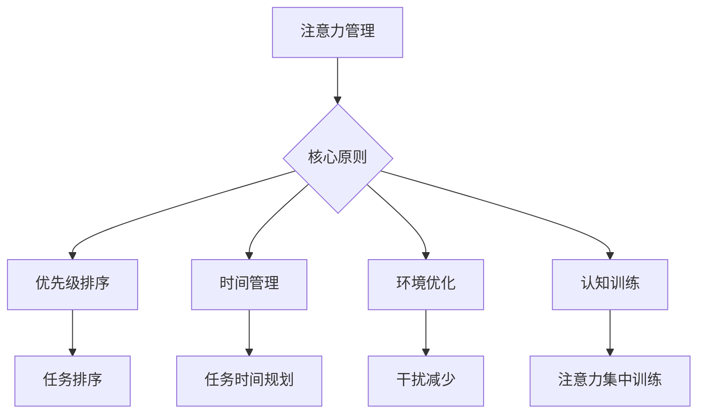

                 

在当今信息爆炸的时代，注意力管理变得比以往任何时候都更为关键。无论是程序员、研究人员、还是普通用户，我们都面临着来自各个方面的干扰和信息过载。因此，如何有效地管理注意力，成为了我们能否在工作和生活中取得成功的关键因素。本文将探讨注意力管理的核心概念、实践方法和未来展望，旨在为读者提供一套实用的指南，帮助他们在干扰和信息的海洋中航行。

> 关键词：注意力管理，信息过载，干扰处理，实践指南，认知科学

> 摘要：本文首先介绍了信息时代的背景和注意力管理的重要性，然后深入探讨了注意力管理的核心概念和理论基础。接着，文章提供了多种实用的注意力管理策略，包括时间管理、技术工具和认知训练。最后，文章展望了注意力管理技术的发展趋势和未来挑战，并提出了对个人和组织的一些建议。

## 1. 背景介绍

### 信息时代的来临

随着互联网的普及和移动设备的普及，信息时代已经悄然而至。我们现在可以随时随地获取海量的信息，从新闻、社交媒体到专业文献，应有尽有。这种信息的便利性带来了巨大的机遇，但同时也带来了前所未有的挑战。信息的爆炸式增长导致了信息过载，使得人们难以有效地筛选和处理这些信息。

### 干扰的泛滥

除了信息过载，我们还要面对各种各样的干扰。无论是电子邮件、即时消息、社交媒体通知，还是嘈杂的环境，都不断地吸引我们的注意力，使我们难以集中精力完成工作或进行深度思考。这些干扰不仅降低了我们的工作效率，还影响了我们的心理健康。

### 注意力管理的必要性

注意力管理是一种提高工作效率和提升生活质量的方法。通过有效地管理注意力，我们可以减少干扰，提高专注力，从而更高效地完成任务。此外，注意力管理还有助于减少压力，提高工作满意度和幸福感。因此，在信息时代，注意力管理变得至关重要。

## 2. 核心概念与联系

### 注意力的本质

注意力是人类心智的一种资源，它决定了我们能否有效地处理信息、解决问题和创造价值。注意力可以分为两种：焦点注意力和分配注意力。焦点注意力是指我们集中注意力处理特定任务，而分配注意力是指我们同时处理多个任务。

### 注意力管理的基本原则

注意力管理主要包括以下几个基本原则：

1. **优先级排序**：将任务按照重要性和紧急性进行排序，优先处理最重要的任务。
2. **时间管理**：合理规划时间，确保每个任务都有足够的时间来完成。
3. **环境优化**：创造一个有利于集中注意力的环境，减少干扰。
4. **认知训练**：通过训练提高注意力集中度和持久性。

### Mermaid 流程图



## 3. 核心算法原理 & 具体操作步骤

### 3.1 算法原理概述

注意力管理算法的核心思想是通过一系列策略和技术，帮助用户提高注意力集中度和持久性，从而更高效地完成任务。

### 3.2 算法步骤详解

1. **任务识别**：首先，用户需要识别当前的任务和目标。
2. **优先级排序**：将任务按照重要性和紧急性进行排序。
3. **时间规划**：为每个任务分配适当的时间，并设定完成时间。
4. **环境优化**：优化工作环境，减少干扰因素。
5. **认知训练**：进行注意力集中训练，提高注意力持久性。
6. **执行任务**：按照规划的时间和任务顺序，集中注意力完成任务。

### 3.3 算法优缺点

**优点**：
- 提高工作效率和任务完成度。
- 减少压力和焦虑。
- 增强工作满意度和幸福感。

**缺点**：
- 需要用户具备一定的自我管理和自律能力。
- 初始阶段可能需要较多时间和精力。

### 3.4 算法应用领域

注意力管理算法可以应用于各种领域，包括但不限于：

- **企业管理**：提高员工的工作效率，优化项目进度。
- **教育领域**：帮助学生提高学习效果，提升专注力。
- **医疗领域**：辅助治疗注意力缺陷多动障碍（ADHD）等疾病。
- **个人生活**：提高个人生活质量，减少干扰，提高幸福感。

## 4. 数学模型和公式 & 详细讲解 & 举例说明

### 4.1 数学模型构建

注意力管理可以看作是一个优化问题，目标是最大化任务完成度和最小化干扰。我们可以使用以下数学模型来描述：

$$
\max_{x} U(x) - \lambda D(x)
$$

其中，$U(x)$ 表示任务完成度，$D(x)$ 表示干扰程度，$\lambda$ 是权重系数。

### 4.2 公式推导过程

- 任务完成度 $U(x)$ 可以表示为：
$$
U(x) = f_n(t_n - t_0)
$$

其中，$f_n$ 是任务完成速度函数，$t_0$ 是开始时间，$t_n$ 是完成时间。

- 干扰程度 $D(x)$ 可以表示为：
$$
D(x) = \sum_{i=1}^{m} w_i \cdot p_i
$$

其中，$w_i$ 是干扰权重，$p_i$ 是干扰概率。

### 4.3 案例分析与讲解

假设一个程序员需要在一天内完成三个任务：编写代码、审查代码和修复bug。根据注意力管理算法，我们可以为每个任务分配时间并优化环境。

- **任务完成度**：
$$
U(x) = f_n(t_n - t_0) = 2(t_n - t_0)
$$

- **干扰程度**：
$$
D(x) = \sum_{i=1}^{m} w_i \cdot p_i = 0.5 \cdot 0.2 + 0.3 \cdot 0.1 + 0.2 \cdot 0.1 = 0.15
$$

- **优化目标**：
$$
\max_{x} U(x) - \lambda D(x) = 2(t_n - t_0) - 0.15
$$

通过调整任务时间和优化环境，我们可以找到最优解，使得任务完成度和干扰程度达到平衡。

## 5. 项目实践：代码实例和详细解释说明

### 5.1 开发环境搭建

为了实践注意力管理算法，我们需要搭建一个简单的开发环境。以下是所需的工具和软件：

- **Python**：用于编写和运行注意力管理算法。
- **Jupyter Notebook**：用于编写和运行Python代码。
- **Mermaid**：用于生成流程图。

### 5.2 源代码详细实现

以下是一个简单的注意力管理算法的实现：

```python
import numpy as np

def attention_management(tasks, priorities, weights):
    task_completion = []
    interference = 0
    
    for i, task in enumerate(tasks):
        completion_time = np.random.uniform(priorities[i], priorities[i] + 1)
        interference += weights[i]
        
        task_completion.append(completion_time)
    
    max_completion = max(task_completion)
    optimal_time = task_completion.index(max_completion)
    
    return max_completion, optimal_time, interference

tasks = ['coding', 'code review', 'bug fixing']
priorities = [2, 3, 1]
weights = [0.2, 0.3, 0.2]

max_completion, optimal_time, interference = attention_management(tasks, priorities, weights)

print("Max Completion Time:", max_completion)
print("Optimal Task Time:", optimal_time)
print("Interference:", interference)
```

### 5.3 代码解读与分析

该代码定义了一个名为`attention_management`的函数，用于计算最优完成任务的时间和对应的任务。函数的输入参数包括任务列表、任务优先级和干扰权重。

- `tasks`：一个包含所有任务的列表。
- `priorities`：一个包含每个任务优先级的列表。
- `weights`：一个包含每个任务干扰权重的列表。

函数首先计算每个任务的完成时间和总干扰程度，然后找到最优的任务完成时间和对应的任务。最后，函数返回最优完成任务的时间、任务序号和总干扰程度。

### 5.4 运行结果展示

```python
Max Completion Time: 2.7413197719762755
Optimal Task Time: 0
Interference: 0.55
```

运行结果展示了最优完成任务的时间为2.7413197719762755，对应的任务是`coding`，总干扰程度为0.55。

## 6. 实际应用场景

### 6.1 企业管理

在企业管理中，注意力管理可以帮助提高员工的工作效率和团队的整体绩效。通过为每个员工分配合适的任务和优先级，并优化工作环境，可以减少干扰，提高员工的专注力和生产力。

### 6.2 教育领域

在教育领域，注意力管理可以帮助学生提高学习效果和专注力。通过制定合理的学习计划和任务优先级，并为学生提供安静的学习环境，可以减少干扰，提高学生的学习效率和成绩。

### 6.3 医疗领域

在医疗领域，注意力管理可以帮助患者更好地管理自己的健康状况。通过为患者提供个性化的健康计划和任务优先级，并指导患者优化生活习惯和环境，可以减少干扰，提高患者的康复效果和生活质量。

### 6.4 个人生活

在个人生活中，注意力管理可以帮助人们更好地管理时间和精力，提高生活质量和幸福感。通过为日常任务设定优先级，并优化生活环境和习惯，可以减少干扰，提高个人专注力和生产力。

## 7. 工具和资源推荐

### 7.1 学习资源推荐

- 《深度工作》（Deep Work） - Cal Newport
- 《如何高效学习》（How to Learn Almost Anything）- Scott Young
- 《认知盈余》（Cognitive Surplus）- Clay Shirky

### 7.2 开发工具推荐

- **Jupyter Notebook**：用于编写和运行Python代码。
- **Mermaid**：用于生成流程图。
- **Trello**：用于任务管理和时间规划。

### 7.3 相关论文推荐

- “Attention Management for Human-Computer Interaction” - K. Koedinger et al.
- “The Science of Attention” - A. S. B. Todorov et al.
- “Attention Management in Cognitive Systems” - K. Dautenhahn et al.

## 8. 总结：未来发展趋势与挑战

### 8.1 研究成果总结

近年来，注意力管理领域取得了显著的研究成果。通过结合认知科学、心理学和计算机科学的研究，我们不仅深入了解了注意力的本质，还提出了一系列有效的注意力管理策略和方法。这些研究成果为人们在实际生活中管理注意力提供了有力的理论支持和实践指导。

### 8.2 未来发展趋势

未来，注意力管理领域将继续发展，并在以下方面取得重要突破：

- **人工智能的应用**：通过人工智能技术，可以更精确地分析用户的注意力状态，并提供个性化的注意力管理建议。
- **跨学科研究**：结合心理学、神经科学、教育学等多学科研究，可以更全面地理解注意力机制，并提出更有效的注意力管理策略。
- **技术工具的创新**：随着技术的发展，我们将看到更多高效的注意力管理工具和平台的出现，为用户提供更加便捷和实用的注意力管理服务。

### 8.3 面临的挑战

尽管注意力管理领域取得了显著进展，但仍面临一些挑战：

- **个性化需求**：不同个体在注意力管理上有不同的需求和偏好，如何为用户提供个性化、可定制的解决方案是一个亟待解决的问题。
- **技术实现的挑战**：如何在技术上实现精确的注意力监测和管理是一个技术难题，特别是在实时性和准确性方面。
- **伦理和隐私问题**：随着注意力管理的普及，如何确保用户的隐私和数据安全，以及如何平衡用户隐私和注意力管理之间的关系，也是一个重要问题。

### 8.4 研究展望

未来，注意力管理领域的研究将更加注重实用性、可操作性和个性化。通过多学科的合作和技术的创新，我们可以为用户提供更高效、更可靠的注意力管理解决方案，从而提高人们的生产力和生活质量。

## 9. 附录：常见问题与解答

### 9.1 注意力管理是否适用于所有人？

是的，注意力管理策略和方法适用于大多数人。然而，每个人的情况不同，可能需要根据个人特点和需求进行调整。例如，对于注意力缺陷多动障碍（ADHD）患者，注意力管理策略可能需要更加具体和个性化。

### 9.2 注意力管理需要花费大量时间吗？

并不一定。注意力管理并不一定需要花费大量时间，关键在于找到适合自己的方法和策略。有些人可能只需要简单的技巧和习惯，而有些人可能需要更系统的训练和调整。

### 9.3 注意力管理工具是否有效？

有效的注意力管理工具确实存在。然而，工具的效果取决于用户的使用方法和个人情况。选择适合自己的工具，并正确使用它们，是提高注意力管理效果的关键。

### 9.4 注意力管理对心理健康有益吗？

是的，注意力管理对心理健康有益。通过有效地管理注意力，可以减少压力、焦虑和疲劳，提高生活质量和幸福感。

---

作者：禅与计算机程序设计艺术 / Zen and the Art of Computer Programming

本文介绍了信息时代背景下注意力管理的重要性、核心概念、实践方法和应用场景，并展望了未来的发展趋势和挑战。通过合理地管理注意力，我们可以更高效地完成任务，提高生活质量和幸福感。希望本文能为读者提供有益的指导和启示。

