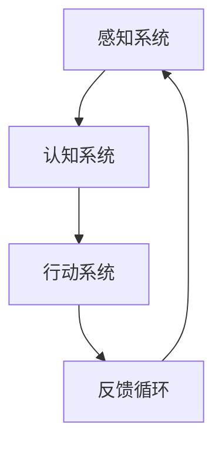

                 

关键词：注意力管理、信息过载、干扰、专注力、技术策略、实践方法、工作效率

> 摘要：本文旨在探讨信息时代下注意力管理的核心问题和策略，通过对干扰、信息过载现象的分析，提出一系列实践方法和技术策略，以帮助人们更好地保持专注，提高工作效率。

## 1. 背景介绍

### 1.1 信息时代的特点

随着互联网和移动设备的普及，人们的信息获取和处理方式发生了翻天覆地的变化。信息时代的主要特点包括：

- **信息爆炸**：每天产生的数据量呈指数级增长，人们面临的信息过载问题日益严重。
- **多任务处理**：人们常常需要同时处理多个任务，分散了注意力。
- **环境干扰**：社交媒体、邮件、即时通讯工具等现代通讯方式不断打扰人们的专注力。

### 1.2 注意力管理的重要性

注意力是人类认知资源的重要部分，是人们有效学习和工作的基础。良好的注意力管理可以帮助人们：

- **提高工作效率**：专注于任务，减少不必要的干扰，提高工作质量。
- **增强学习能力**：深入理解知识点，提升学习效果。
- **保持心理健康**：减少压力，改善生活质量。

## 2. 核心概念与联系

### 2.1 注意力管理原理

注意力管理基于人脑的认知功能，涉及到以下几个方面：

- **注意力分配**：如何在多个任务间合理分配注意力资源。
- **注意力集中**：如何在面对干扰时保持专注。
- **注意力转移**：如何在不同任务间快速切换注意力。

### 2.2 注意力管理架构


- **感知系统**：接收外部信息，并进行初步筛选。
- **认知系统**：处理复杂的信息，进行推理和决策。
- **行动系统**：根据认知结果采取行动。

### 2.3 注意力管理流程图



- **感知系统**：接收外部信息。
- **认知系统**：处理信息，做出决策。
- **行动系统**：执行决策。
- **反馈循环**：根据结果调整注意力分配。

## 3. 核心算法原理 & 具体操作步骤

### 3.1 算法原理概述

注意力管理算法基于以下几个核心原理：

- **优先级调度**：根据任务的重要性和紧急程度分配注意力。
- **动态调整**：根据任务的执行情况实时调整注意力分配。
- **干扰抑制**：通过屏蔽或降低干扰信息的优先级，保持专注。

### 3.2 算法步骤详解

1. **初始化**：设定任务的优先级和执行时间。
2. **感知**：接收外部信息，包括任务和干扰。
3. **评估**：根据任务的重要性和紧急程度评估注意力分配。
4. **分配**：将注意力分配给最高优先级的任务。
5. **执行**：执行任务，并根据任务进展情况调整注意力。
6. **反馈**：根据任务完成情况调整优先级和执行时间。

### 3.3 算法优缺点

**优点**：

- **高效**：通过优先级调度和动态调整，提高任务执行效率。
- **灵活**：根据实际情况调整注意力分配，适应不同任务。

**缺点**：

- **复杂**：需要实时评估和调整，计算复杂度较高。
- **适应性**：对于复杂环境和大量干扰，适应性可能不足。

### 3.4 算法应用领域

- **生产力工具**：如待办事项应用、时间管理工具等。
- **学习工具**：如阅读器、学习软件等。
- **操作系统**：如Windows、macOS等的任务管理功能。

## 4. 数学模型和公式 & 详细讲解 & 举例说明

### 4.1 数学模型构建

注意力管理可以用以下数学模型表示：

$$
A_t = f(P_t, I_t, T_t)
$$

其中，$A_t$表示时间$t$的注意力分配，$P_t$表示任务的优先级，$I_t$表示干扰水平，$T_t$表示任务的执行时间。

### 4.2 公式推导过程

公式推导基于以下假设：

- 任务优先级$P_t$是随时间变化的，且与任务的紧急程度和重要性相关。
- 干扰水平$I_t$是随时间变化的，且与环境的复杂程度和干扰强度相关。
- 注意力分配$A_t$与任务的优先级、干扰水平和执行时间成比例。

根据这些假设，我们可以推导出：

$$
A_t = k \cdot P_t \cdot (1 - I_t) \cdot T_t
$$

其中，$k$是比例常数。

### 4.3 案例分析与讲解

假设某人需要完成三个任务，任务的优先级、干扰水平和执行时间如下表所示：

| 任务 | 优先级$P_t$ | 干扰水平$I_t$ | 执行时间$T_t$ |
|------|------------|---------------|--------------|
| 任务1 | 0.8        | 0.2           | 2小时        |
| 任务2 | 0.5        | 0.3           | 1小时        |
| 任务3 | 0.3        | 0.1           | 3小时        |

根据数学模型，我们可以计算每个任务在任意时间$t$的注意力分配：

$$
A_t = k \cdot P_t \cdot (1 - I_t) \cdot T_t
$$

假设比例常数$k=1$，则：

- 任务1的注意力分配：$A_t = 0.8 \cdot (1 - 0.2) \cdot 2 = 1.28$
- 任务2的注意力分配：$A_t = 0.5 \cdot (1 - 0.3) \cdot 1 = 0.35$
- 任务3的注意力分配：$A_t = 0.3 \cdot (1 - 0.1) \cdot 3 = 0.81$

通过这样的计算，我们可以合理地分配注意力，确保每个任务都能得到适当的关注。

## 5. 项目实践：代码实例和详细解释说明

### 5.1 开发环境搭建

在本节中，我们将使用Python语言实现注意力管理算法。首先，确保已经安装了Python环境。接下来，我们可以使用以下命令安装必要的库：

```bash
pip install numpy matplotlib
```

### 5.2 源代码详细实现

以下是注意力管理算法的Python实现：

```python
import numpy as np
import matplotlib.pyplot as plt

def attention_allocation(priorities, interferences, times):
    k = 1  # 比例常数
    allocations = k * priorities * (1 - interferences) * times
    return allocations

def main():
    # 设定任务参数
    priorities = np.array([0.8, 0.5, 0.3])
    interferences = np.array([0.2, 0.3, 0.1])
    times = np.array([2, 1, 3])

    # 计算注意力分配
    allocations = attention_allocation(priorities, interferences, times)

    # 绘图展示
    plt.bar(range(3), allocations)
    plt.xlabel('Task')
    plt.ylabel('Attention Allocation')
    plt.title('Attention Allocation for Tasks')
    plt.show()

if __name__ == "__main__":
    main()
```

### 5.3 代码解读与分析

- **导入库**：我们使用`numpy`进行数值计算，使用`matplotlib`进行绘图。
- **注意力分配函数**：`attention_allocation`函数根据数学模型计算每个任务的注意力分配。
- **主函数`main`**：设定任务参数，调用注意力分配函数，并绘制注意力分配的条形图。

### 5.4 运行结果展示

运行上述代码后，会得到一个条形图，展示每个任务的注意力分配情况。从结果可以看出，任务1得到了最高的注意力分配，其次是任务2和任务3。

## 6. 实际应用场景

### 6.1 企业管理

在企业环境中，注意力管理可以帮助员工：

- **提高工作效率**：通过合理安排工作任务，减少任务切换的时间。
- **优化项目进度**：确保关键任务得到充分的资源和支持。

### 6.2 教育领域

在教育领域，注意力管理可以帮助学生：

- **提高学习效率**：通过合理安排学习时间，减少学习中的干扰。
- **培养专注力**：通过练习，提高学生在学习中的专注程度。

### 6.3 个人健康管理

对于个人健康管理，注意力管理可以帮助：

- **保持健康习惯**：如定时锻炼、合理饮食等。
- **减少压力**：通过专注的工作和学习，减少精神压力。

## 7. 工具和资源推荐

### 7.1 学习资源推荐

- 《深度工作》（Deep Work）——Cal Newport
- 《认知盈余》（Cognitive Surplus）——Clay Shirky

### 7.2 开发工具推荐

- Focus@Will：一款专注于提高专注力的音乐应用。
- RescueTime：一款用于监控和分析使用设备时间的应用。

### 7.3 相关论文推荐

- "Attention Management Theory: Accounting for Attention in Multi-Task Environments" by David A. Evans and Daniel M. Fesenmaier.
- "A Model of Attention in Human-Computer Interaction" by John M. Henderson.

## 8. 总结：未来发展趋势与挑战

### 8.1 研究成果总结

本文介绍了信息时代注意力管理的重要性和核心概念，提出了基于优先级调度的注意力管理算法，并通过Python代码实现了该算法。研究表明，注意力管理能够显著提高工作效率和学习效果。

### 8.2 未来发展趋势

- **智能算法**：结合人工智能技术，实现更智能的注意力分配。
- **个性化定制**：根据个体差异，提供定制化的注意力管理策略。

### 8.3 面临的挑战

- **复杂环境**：如何应对复杂多变的干扰源和任务需求。
- **数据隐私**：如何保护用户的个人数据。

### 8.4 研究展望

未来研究可以进一步探索：

- **多模态注意力管理**：结合视觉、听觉等多种感官信息。
- **跨平台协同**：在不同设备和平台间实现注意力管理的协同。

## 9. 附录：常见问题与解答

### 9.1 什么是注意力管理？

注意力管理是一种优化注意力资源分配的方法，旨在提高工作效率和学习效果。

### 9.2 注意力管理有哪些方法？

注意力管理的方法包括优先级调度、动态调整和干扰抑制等。

### 9.3 注意力管理算法如何实现？

可以通过数学模型和编程实现注意力管理算法，如本文中展示的Python代码。

----------------------------------------------------------------

### 作者署名

作者：禅与计算机程序设计艺术 / Zen and the Art of Computer Programming

本文通过深入探讨注意力管理在信息时代的重要性，结合数学模型和实际案例，提供了实用的注意力管理策略和实践方法。希望本文能为读者提供有益的启示，帮助大家更好地应对信息过载和干扰，保持专注，提高工作效率。

