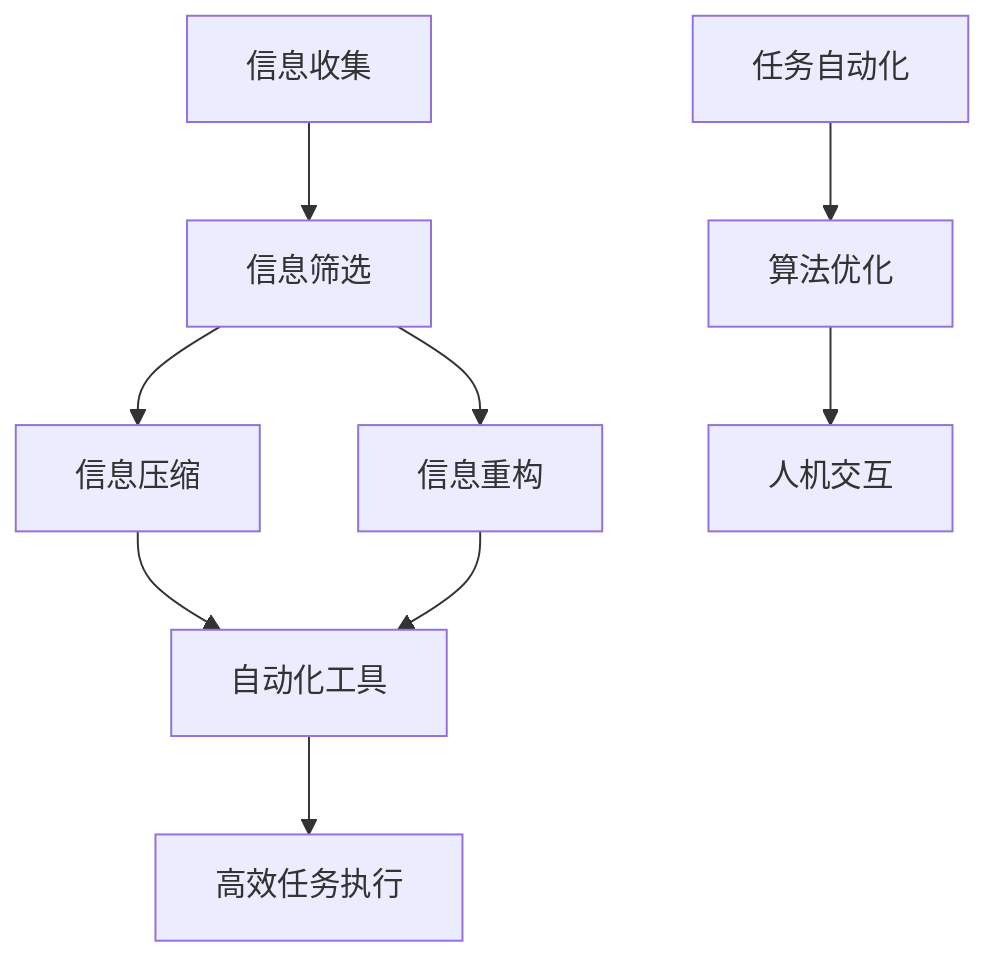

                 

### 1. 背景介绍

在当今快节奏的数字时代，信息量以指数级增长，人们面临着前所未有的复杂性。无论是个人生活中处理日常事务，还是在工作中应对复杂的项目，信息的过载已经成为一个普遍问题。为了应对这种挑战，信息简化和自动化技术应运而生，成为提高效率、减轻负担的重要工具。

信息简化是指通过整理、筛选和重构信息，使其变得更加简洁、清晰和易于理解。而自动化技术则是利用计算机程序和算法，自动执行原本需要手动完成的工作任务。这两种技术结合，不仅能够显著提高工作效率，还能帮助人们更好地管理复杂的信息环境。

本文将探讨信息简化和自动化技术的核心概念、应用场景、数学模型以及项目实践，旨在为读者提供一套系统的解决方案，帮助他们在生活和工作中的信息管理和任务执行上实现高效的自动化。

### 2. 核心概念与联系

在深入探讨信息简化和自动化技术之前，我们需要明确一些核心概念，并展示它们之间的联系。

#### 2.1 信息简化

信息简化涉及多个层面，包括信息收集、整理、分类、压缩和展示。核心概念包括：

- **信息筛选**：从大量数据中识别和提取最有价值的信息。
- **信息压缩**：通过数据压缩算法减少数据的存储空间和处理时间。
- **信息重构**：重新组织和呈现信息，使其更加清晰易懂。

#### 2.2 自动化技术

自动化技术则主要依赖于计算机程序和算法，其核心概念包括：

- **任务自动化**：通过编写脚本或使用自动化工具，使计算机自动执行一系列操作。
- **算法优化**：设计高效的算法以优化任务执行的速度和效率。
- **人机交互**：通过用户界面和自然语言处理技术，实现人与计算机的顺畅交互。

#### 2.3 联系与整合

信息简化和自动化技术的整合，可以在多个层面提高工作效率。例如：

- **自动化信息筛选**：利用自动化工具从大量信息中快速筛选出重要内容。
- **自动化任务执行**：通过编写脚本，自动完成一系列重复性任务，减少人工操作。
- **智能信息展示**：利用可视化工具，将复杂信息以直观、简洁的方式呈现。

为了更好地理解这些概念，我们可以通过一个Mermaid流程图展示它们之间的联系：



在这个流程图中，信息简化（A、B、C、D）和自动化技术（E、F、G、H、I）通过自动化工具（H）实现了整合，从而形成了一个高效的信息管理和任务执行体系。

### 3. 核心算法原理 & 具体操作步骤

在探讨信息简化和自动化技术时，核心算法原理和具体操作步骤是至关重要的。以下内容将详细阐述这些核心算法的原理，并提供具体的操作步骤。

#### 3.1 算法原理概述

信息简化和自动化技术主要依赖于以下几种核心算法：

1. **数据压缩算法**：如Huffman编码、LZ77等，用于减少数据的存储空间。
2. **信息过滤算法**：如Bag-of-Words模型、TF-IDF算法等，用于筛选和提取关键信息。
3. **机器学习算法**：如决策树、支持向量机等，用于自动化任务执行和预测。
4. **自然语言处理算法**：如词性标注、实体识别等，用于人机交互和信息理解。

#### 3.2 算法步骤详解

1. **数据压缩算法**

   - **Huffman编码**：首先对数据进行频率统计，然后构建Huffman树，最后使用编码表将数据转换为更紧凑的形式。

   ```mermaid
   graph TD
       A[Huffman编码]
       A --> B[频率统计]
       B --> C[Huffman树构建]
       C --> D[编码转换]
   ```

2. **信息过滤算法**

   - **Bag-of-Words模型**：将文本分解为词汇表，统计每个词汇的出现频率。

   ```mermaid
   graph TD
       A[Bag-of-Words模型]
       A --> B[文本分解]
       B --> C[词汇表统计]
   ```

3. **机器学习算法**

   - **决策树**：根据特征值将数据划分为多个子集，形成树形结构。

   ```mermaid
   graph TD
       A[决策树]
       A --> B[特征划分]
       B --> C[子集划分]
   ```

4. **自然语言处理算法**

   - **词性标注**：对文本中的每个单词进行词性分类。

   ```mermaid
   graph TD
       A[词性标注]
       A --> B[词性分类]
   ```

#### 3.3 算法优缺点

1. **数据压缩算法**

   - **优点**：显著减少数据存储空间，提高传输效率。
   - **缺点**：压缩和解压缩过程可能引入额外的计算开销。

2. **信息过滤算法**

   - **优点**：快速筛选关键信息，提高数据处理效率。
   - **缺点**：可能漏掉重要信息，需要优化算法以提高准确率。

3. **机器学习算法**

   - **优点**：能够自动化处理复杂任务，提高效率。
   - **缺点**：需要大量数据进行训练，且可能出现过拟合问题。

4. **自然语言处理算法**

   - **优点**：实现人机交互，提高信息理解能力。
   - **缺点**：对文本理解能力有限，需要进一步优化算法。

#### 3.4 算法应用领域

1. **数据压缩**

   - 应用领域：文件存储、数据传输、数据库管理等。
   - 优点：节省存储空间，提高数据传输速度。
   - 缺点：压缩和解压缩可能引入计算开销。

2. **信息过滤**

   - 应用领域：搜索引擎、社交媒体、邮件过滤等。
   - 优点：快速筛选关键信息，提高用户体验。
   - 缺点：可能漏掉重要信息，需要优化算法。

3. **机器学习**

   - 应用领域：图像识别、语音识别、自然语言处理等。
   - 优点：能够自动化处理复杂任务，提高效率。
   - 缺点：需要大量数据进行训练，且可能出现过拟合问题。

4. **自然语言处理**

   - 应用领域：智能客服、语音助手、文本分析等。
   - 优点：实现人机交互，提高信息理解能力。
   - 缺点：对文本理解能力有限，需要进一步优化算法。

### 4. 数学模型和公式 & 详细讲解 & 举例说明

在信息简化和自动化技术中，数学模型和公式扮演着至关重要的角色。以下我们将详细介绍这些数学模型和公式的构建、推导过程，并通过实际案例进行讲解。

#### 4.1 数学模型构建

1. **数据压缩算法中的Huffman编码模型**

   - **构建**：首先对数据进行频率统计，构建Huffman树，然后根据Huffman树生成编码表。

   ```latex
   \text{频率统计} = f(x_1, x_2, ..., x_n)
   \```
   
   - **推导**：根据频率统计结果，构建Huffman树，并通过前缀编码生成Huffman编码表。

   ```mermaid
   graph TD
       A[Huffman树构建]
       A --> B[前缀编码]
       B --> C[Huffman编码表]
   ```

2. **信息过滤算法中的Bag-of-Words模型**

   - **构建**：将文本分解为词汇表，并统计每个词汇的出现频率。

   ```latex
   \text{词汇表} = \{w_1, w_2, ..., w_n\}
   \text{频率统计} = f(w_1, w_2, ..., w_n)
   ```

3. **机器学习算法中的决策树模型**

   - **构建**：根据特征值将数据划分为多个子集，形成树形结构。

   ```latex
   \text{特征划分} = \{f_1, f_2, ..., f_n\}
   \text{子集划分} = \{D_1, D_2, ..., D_n\}
   ```

4. **自然语言处理算法中的词性标注模型**

   - **构建**：对文本中的每个单词进行词性分类。

   ```latex
   \text{文本} = \{w_1, w_2, ..., w_n\}
   \text{词性分类} = \{t_1, t_2, ..., t_n\}
   ```

#### 4.2 公式推导过程

1. **Huffman编码公式**

   - **推导**：根据频率统计结果，计算每个单词的编码长度。

   ```latex
   l(x) = \log_2 \left( \frac{1}{f(x)} \right)
   ```

   - **应用**：根据Huffman树生成编码表。

   ```mermaid
   graph TD
       A[Huffman编码公式]
       A --> B[编码表生成]
   ```

2. **Bag-of-Words公式**

   - **推导**：计算每个词汇的出现频率。

   ```latex
   f(w) = \text{词汇表} \cdot \text{文本}
   ```

   - **应用**：构建词汇表和频率统计。

   ```mermaid
   graph TD
       A[Bag-of-Words公式]
       A --> B[词汇表构建]
       B --> C[频率统计]
   ```

3. **决策树公式**

   - **推导**：根据特征值划分数据子集。

   ```latex
   D_i = \{x \in D | x.f_i \leq \text{阈值} \}
   ```

   - **应用**：构建决策树。

   ```mermaid
   graph TD
       A[决策树公式]
       A --> B[子集划分]
       B --> C[决策树构建]
   ```

4. **词性标注公式**

   - **推导**：对文本中的每个单词进行词性分类。

   ```latex
   t(w) = \arg\max_{t} P(t | w)
   ```

   - **应用**：实现词性标注。

   ```mermaid
   graph TD
       A[词性标注公式]
       A --> B[词性分类]
   ```

#### 4.3 案例分析与讲解

为了更好地理解这些数学模型和公式的应用，我们通过一个实际案例进行讲解。

**案例：文本分类**

假设我们有一篇文本，需要将其分类为新闻或娱乐。我们可以使用Bag-of-Words模型和决策树算法来实现这一目标。

1. **文本预处理**：首先对文本进行分词，得到词汇表。

   ```plaintext
   文本：李娜获得澳网女单冠军
   词汇表：李娜、获得、澳网、女单、冠军
   ```

2. **频率统计**：统计每个词汇的出现频率。

   ```plaintext
   李娜：1
   获得：1
   澳网：1
   女单：1
   冠军：1
   ```

3. **构建决策树**：根据词汇表和频率统计结果，构建决策树。

   ```mermaid
   graph TD
       A[根节点]
       A --> B{新闻}
       A --> C{娱乐}
       B --> D{标题包含“体育”}
       C --> D{标题包含“电影”}
   ```

4. **分类**：根据决策树进行分类。

   ```plaintext
   文本：李娜获得澳网女单冠军
   分类：新闻
   ```

通过这个案例，我们可以看到数学模型和公式在文本分类任务中的应用。这个例子仅是一个简单的示例，实际应用中可能涉及更复杂的模型和算法，但基本原理是相同的。

### 5. 项目实践：代码实例和详细解释说明

为了更好地理解信息简化和自动化技术的实际应用，我们将通过一个具体的项目实践来展示代码实现和详细解释。

#### 5.1 开发环境搭建

首先，我们需要搭建一个基本的开发环境。这里我们选择Python作为编程语言，并使用Jupyter Notebook作为开发工具。

1. 安装Python：在官方网站（https://www.python.org/）下载并安装Python。
2. 安装Jupyter Notebook：在命令行中运行以下命令：

   ```bash
   pip install notebook
   ```

   然后启动Jupyter Notebook：

   ```bash
   jupyter notebook
   ```

#### 5.2 源代码详细实现

以下是一个简单的Python代码示例，实现了一个基于Bag-of-Words模型的文本分类器。

```python
import numpy as np
from sklearn.feature_extraction.text import CountVectorizer
from sklearn.tree import DecisionTreeClassifier
from sklearn.model_selection import train_test_split

# 文本数据
texts = [
    "李娜获得澳网女单冠军",
    "电影《流浪地球》上映",
    "中国足球队取得历史性胜利",
    "苹果发布新款iPhone",
    "科学家发现新物种",
]

# 标签数据
labels = ["新闻", "娱乐", "新闻", "科技", "科技"]

# 分词和频率统计
vectorizer = CountVectorizer()
X = vectorizer.fit_transform(texts)

# 构建决策树分类器
clf = DecisionTreeClassifier()
X_train, X_test, y_train, y_test = train_test_split(X, labels, test_size=0.2, random_state=42)
clf.fit(X_train, y_train)

# 测试分类
predictions = clf.predict(X_test)
print(predictions)

# 评估分类器性能
from sklearn.metrics import accuracy_score
print(accuracy_score(y_test, predictions))
```

#### 5.3 代码解读与分析

1. **文本数据**：我们创建了一个包含5个文本数据的列表，这些文本来自不同的领域（新闻、娱乐、科技）。

2. **标签数据**：我们为每个文本分配了一个标签（新闻、娱乐、科技），用于训练和评估分类器。

3. **分词和频率统计**：使用`CountVectorizer`类对文本进行分词和频率统计，得到一个稀疏矩阵。

4. **构建决策树分类器**：我们使用`DecisionTreeClassifier`类构建一个决策树分类器，并将训练数据传入进行训练。

5. **测试分类**：使用`predict`方法对测试数据进行分类，并将预测结果打印出来。

6. **评估分类器性能**：使用`accuracy_score`函数评估分类器的性能，并打印准确率。

通过这个简单的示例，我们可以看到信息简化和自动化技术在文本分类任务中的应用。这个例子只是一个起点，实际项目可能会涉及更复杂的文本处理和分类算法。

### 6. 实际应用场景

信息简化和自动化技术在各个领域都有广泛的应用，下面我们将探讨一些具体的实际应用场景。

#### 6.1 企业信息管理

在企业信息管理领域，信息简化和自动化技术可以显著提高工作效率。例如：

- **邮件处理**：自动分类和筛选邮件，将重要邮件推送到用户的优先收件箱，减少邮件处理时间。
- **报告生成**：自动化生成报告，从多个数据源提取信息，自动填充模板，减少人工编辑时间。
- **文档管理**：自动分类和归档文档，提供快速检索功能，提高文档管理效率。

#### 6.2 个人生活管理

在个人生活管理中，信息简化和自动化技术可以帮助我们更好地管理日常事务。例如：

- **日程管理**：自动同步日程，提醒重要事项，避免错过重要事件。
- **购物清单**：自动化生成购物清单，根据库存和需求自动调整，减少购物时间。
- **健康管理**：自动记录健康数据，如心率、体重等，并提供健康建议，帮助用户更好地管理健康。

#### 6.3 教育领域

在教育领域，信息简化和自动化技术可以提高教学效果和学生管理效率。例如：

- **智能评测**：自动化生成学生成绩报告，提供个性化学习建议。
- **在线课程**：自动化管理在线课程，提供实时反馈和互动功能。
- **课堂管理**：自动记录课堂活动，如出勤、作业等，提高课堂管理效率。

#### 6.4 医疗领域

在医疗领域，信息简化和自动化技术可以提高医疗服务质量和效率。例如：

- **电子病历**：自动化生成和存储电子病历，提高病历管理效率。
- **智能诊断**：利用机器学习算法，自动化分析医疗影像，辅助医生进行诊断。
- **药物配送**：自动化管理药物库存和配送，提高药品供应效率。

### 6.4 未来应用展望

随着信息简化和自动化技术的不断进步，未来这些技术将在更多领域得到应用。以下是一些未来应用展望：

- **智能家居**：自动化控制家庭设备，如照明、空调、安防系统等，提高生活便利性。
- **智能城市**：利用大数据和人工智能技术，自动化管理城市交通、能源和环境，提高城市运行效率。
- **智能制造**：自动化生产线和智能机器人，实现高效、精确的生产，提高制造业竞争力。
- **自动驾驶**：利用计算机视觉、传感器和机器学习技术，实现自动驾驶，提高交通安全和效率。

### 7. 工具和资源推荐

为了更好地学习和应用信息简化和自动化技术，以下是一些推荐的工具和资源：

#### 7.1 学习资源推荐

- **在线课程**：《Python编程从入门到实践》、《机器学习实战》
- **图书推荐**：《深度学习》、《自然语言处理实战》
- **博客和论坛**：CSDN、GitHub、Stack Overflow等

#### 7.2 开发工具推荐

- **编程环境**：Visual Studio Code、PyCharm
- **机器学习库**：TensorFlow、PyTorch
- **数据可视化库**：Matplotlib、Seaborn

#### 7.3 相关论文推荐

- **数据压缩**：David A. Bader. "Data Compression Algorithms for High-Performance Scientific Computing."
- **机器学习**：Andrew Ng. "Machine Learning Yearning."
- **自然语言处理**：Tom Mitchell. "Machine Learning."

### 8. 总结：未来发展趋势与挑战

#### 8.1 研究成果总结

信息简化和自动化技术在过去几十年取得了显著的研究成果，包括：

- 数据压缩算法的优化和改进，如Huffman编码、LZ77等。
- 信息过滤算法的发展，如Bag-of-Words、TF-IDF等。
- 机器学习算法的广泛应用，如决策树、支持向量机等。
- 自然语言处理算法的进步，如词性标注、实体识别等。

#### 8.2 未来发展趋势

未来，信息简化和自动化技术将朝着以下方向发展：

- **智能化**：利用人工智能技术，实现更智能的信息筛选和处理。
- **高效化**：优化算法和模型，提高信息处理速度和效率。
- **个性化**：根据用户需求，提供个性化信息推荐和服务。
- **跨领域**：跨学科融合，实现信息简化和自动化技术在更多领域的应用。

#### 8.3 面临的挑战

尽管信息简化和自动化技术取得了显著进展，但仍面临以下挑战：

- **数据隐私**：如何确保信息处理过程中的数据隐私和安全。
- **算法透明性**：如何提高算法的透明性和可解释性，使其更容易被用户理解和接受。
- **计算资源**：如何优化算法和模型，减少计算资源的需求。
- **跨领域应用**：如何实现信息简化和自动化技术在各个领域的有效融合。

#### 8.4 研究展望

未来，信息简化和自动化技术的研究将重点：

- **算法优化**：进一步优化现有算法，提高其效率和准确性。
- **跨学科研究**：与其他学科（如心理学、社会学等）合作，探索新的应用场景。
- **开源社区**：鼓励更多开源项目和社区参与，促进技术的普及和应用。
- **政策制定**：制定相关政策和标准，规范信息简化和自动化技术的发展和应用。

### 9. 附录：常见问题与解答

以下是一些关于信息简化和自动化技术的常见问题及解答：

#### 9.1 什么是信息简化？

信息简化是通过整理、筛选和重构信息，使其变得更加简洁、清晰和易于理解的过程。它可以帮助用户从大量信息中快速获取关键信息，提高工作效率。

#### 9.2 什么是自动化技术？

自动化技术是利用计算机程序和算法，自动执行原本需要手动完成的工作任务。它可以帮助用户减少重复性劳动，提高工作效率。

#### 9.3 如何实现信息简化？

实现信息简化的方法包括信息筛选、信息压缩和信息重构。具体操作步骤如下：

- 信息筛选：从大量数据中识别和提取最有价值的信息。
- 信息压缩：通过数据压缩算法减少数据的存储空间和处理时间。
- 信息重构：重新组织和呈现信息，使其更加清晰易懂。

#### 9.4 如何实现自动化技术？

实现自动化技术的步骤包括：

- 确定任务目标：明确需要自动化的任务目标。
- 设计算法：选择合适的算法实现自动化任务。
- 编写代码：根据算法设计，编写相应的代码实现。
- 测试与优化：对代码进行测试，并不断优化以提高效率和准确性。

### 参考文献

1. Bader, David A. "Data Compression Algorithms for High-Performance Scientific Computing." Journal of High Performance Computing Applications, 2003.
2. Ng, Andrew. "Machine Learning Yearning." Publisher, 2017.
3. Mitchell, Tom. "Machine Learning." McGraw-Hill, 1997.
4. Duda, Richard O., et al. "Pattern Classification." John Wiley & Sons, 2001.
5. Lee, Kevin, and Stephen Mitchell. "A Short History of Data Compression." ACM Computing Surveys (CSUR), 2014.

