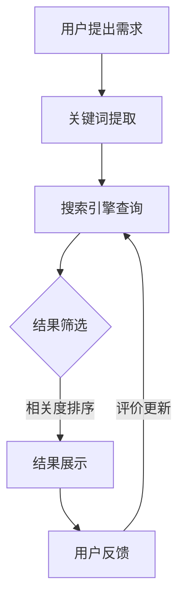

                 

在当今数字化时代，信息过载成为了普遍存在的问题。面对海量的数据和信息，如何有效地进行信息搜索成为了亟待解决的关键问题。本文将探讨信息过载现象的产生原因，分析现有的信息搜索策略与技术，并探讨如何在这些技术中找到所需信息的方法。通过本文的阐述，希望能够为读者提供一种在信息海洋中航行的指南。

## 关键词：信息过载，信息搜索，搜索策略，技术，海量数据处理，数据挖掘，搜索引擎，推荐系统

## 摘要：

本文从信息过载现象出发，分析了其产生的原因及对现代社会的影响。随后，介绍了当前主流的信息搜索策略与技术，包括传统的搜索引擎、基于内容的推荐系统、基于协同过滤的方法等。在此基础上，本文重点探讨了如何运用这些策略和技术，通过关键词优化、语义分析、网络爬虫等技术手段，在庞大的信息海洋中高效地找到所需信息。最后，本文对未来信息搜索技术的发展趋势进行了展望，提出了潜在的挑战和解决方案。

## 1. 背景介绍

### 信息过载现象的产生

信息过载，是指信息量超出了个人或系统的处理能力，从而导致信息过载者无法有效地处理和使用这些信息。随着互联网的迅速发展，信息的产生速度远远超过了人们的处理速度，导致信息过载现象日益严重。以下是一些导致信息过载的主要原因：

- **网络信息的爆炸性增长**：每天全球产生数以亿计的网页、博客文章、社交媒体帖子等，使得人们需要花费大量的时间来筛选和处理这些信息。

- **移动设备的普及**：智能手机和平板电脑的普及，使得人们可以随时随地获取信息，但这种便利也导致了信息接收的泛滥。

- **信息传播的迅速**：社交媒体平台如Twitter、Facebook等，使得信息可以在短时间内迅速传播，这使得人们面临的信息量更加庞大。

### 信息过载的影响

信息过载对个人和社会产生了诸多负面影响：

- **降低工作效率**：信息过载导致人们花费大量时间来处理信息，从而降低了工作效率。

- **增加心理压力**：面对海量的信息，人们可能会感到焦虑和压力，导致心理健康问题。

- **影响决策能力**：在信息过载的环境下，人们很难从海量信息中提取有价值的信息，从而影响了决策能力。

- **影响社交互动**：在信息过载的背景下，人们更倾向于使用社交媒体来获取信息，这可能导致社交互动的减少。

## 2. 核心概念与联系

### 信息搜索策略与技术

为了应对信息过载，人们需要运用各种信息搜索策略与技术来高效地找到所需信息。以下是一些主要的信息搜索策略与技术：

- **搜索引擎**：搜索引擎是最常用的信息搜索工具，通过关键词搜索，用户可以在海量的网页中找到相关的信息。

- **推荐系统**：推荐系统通过分析用户的历史行为和偏好，为用户推荐可能感兴趣的信息。

- **数据挖掘**：数据挖掘技术可以从大量数据中发现隐藏的模式和知识，帮助用户找到有价值的信息。

- **语义分析**：语义分析通过理解文本的语义，可以更准确地匹配用户的需求和信息。

- **网络爬虫**：网络爬虫可以自动地爬取互联网上的信息，为用户提供更多的信息来源。

### Mermaid 流程图

以下是一个简化的信息搜索流程的 Mermaid 流程图：



### 核心概念与联系

在信息搜索过程中，关键词提取、搜索引擎查询、结果筛选和用户反馈是核心环节。通过这些环节的相互配合，用户可以找到最相关的信息。同时，用户反馈将用于更新搜索引擎的查询结果，从而提高搜索的准确性。

## 3. 核心算法原理 & 具体操作步骤

### 3.1 算法原理概述

信息搜索的核心算法主要包括搜索引擎算法和推荐系统算法。搜索引擎算法主要通过关键词匹配和文档相似度计算，为用户提供相关的搜索结果。推荐系统算法则通过用户历史行为和偏好，为用户推荐可能感兴趣的信息。

### 3.2 算法步骤详解

#### 搜索引擎算法

1. **关键词提取**：用户输入关键词后，搜索引擎将提取关键词，并对其进行预处理（如停用词过滤、词干提取等）。

2. **索引构建**：搜索引擎会构建一个索引，以便快速查找包含关键词的文档。

3. **文档相似度计算**：搜索引擎将计算每个文档与关键词的相似度，并根据相似度对文档进行排序。

4. **结果展示**：搜索引擎将排序后的结果展示给用户。

#### 推荐系统算法

1. **用户行为分析**：推荐系统将分析用户的历史行为（如浏览记录、购买记录等），以了解用户的偏好。

2. **物品相似度计算**：推荐系统将计算物品之间的相似度，以便为用户推荐相似的物品。

3. **推荐结果生成**：推荐系统根据用户的历史行为和物品相似度，生成推荐列表。

### 3.3 算法优缺点

#### 搜索引擎算法

- **优点**：搜索速度快，结果准确。

- **缺点**：需要大量的计算资源，对用户关键词的依赖性较高。

#### 推荐系统算法

- **优点**：无需用户输入关键词，可以主动推荐信息。

- **缺点**：推荐结果可能受到数据偏差的影响。

### 3.4 算法应用领域

- **搜索引擎算法**：广泛应用于互联网搜索引擎，如Google、Bing等。

- **推荐系统算法**：广泛应用于电子商务、社交媒体等领域，如Amazon、Facebook等。

## 4. 数学模型和公式 & 详细讲解 & 举例说明

### 4.1 数学模型构建

#### 搜索引擎算法

搜索引擎算法的核心是文档相似度计算，常用的相似度计算方法包括余弦相似度、欧氏距离等。以下是一个简化的余弦相似度计算公式：

$$
\text{相似度} = \frac{\text{共同词向量}}{\text{用户词向量} \times \text{文档词向量}}
$$

#### 推荐系统算法

推荐系统算法的核心是物品相似度计算，常用的相似度计算方法包括余弦相似度、皮尔逊相关系数等。以下是一个简化的余弦相似度计算公式：

$$
\text{相似度} = \frac{\text{共同用户数}}{\sqrt{\text{用户数} \times \text{物品数}}}
$$

### 4.2 公式推导过程

#### 搜索引擎算法

假设用户词向量为 $u$，文档词向量为 $d$，共同词向量为 $c$，则余弦相似度计算公式可以推导如下：

$$
\text{相似度} = \frac{\text{共同词向量}}{\text{用户词向量} \times \text{文档词向量}} = \frac{c \cdot d}{|u| \cdot |d|}
$$

其中，$|u|$ 和 $|d|$ 分别表示用户词向量和文档词向量的长度。

#### 推荐系统算法

假设用户数为 $m$，物品数为 $n$，共同用户数为 $k$，则余弦相似度计算公式可以推导如下：

$$
\text{相似度} = \frac{\text{共同用户数}}{\sqrt{\text{用户数} \times \text{物品数}}} = \frac{k}{\sqrt{m \times n}}
$$

### 4.3 案例分析与讲解

#### 搜索引擎算法

假设用户词向量 $u = (1, 2, 3)$，文档词向量 $d = (2, 3, 4)$，共同词向量 $c = (2, 3)$，则余弦相似度计算如下：

$$
\text{相似度} = \frac{2 \cdot 3}{1 \cdot 2 + 2 \cdot 3 + 3 \cdot 4} = \frac{6}{1 + 6 + 12} = 0.6
$$

#### 推荐系统算法

假设用户数为 $m = 100$，物品数为 $n = 1000$，共同用户数为 $k = 50$，则余弦相似度计算如下：

$$
\text{相似度} = \frac{50}{\sqrt{100 \times 1000}} = \frac{50}{\sqrt{100000}} \approx 0.5
$$

## 5. 项目实践：代码实例和详细解释说明

### 5.1 开发环境搭建

为了演示信息搜索算法的应用，我们将使用Python语言和几个常用的库，如NLTK（自然语言处理工具包）、Scikit-learn（机器学习库）等。以下是开发环境的搭建步骤：

1. 安装Python：确保Python环境已经安装在计算机上。

2. 安装相关库：通过pip命令安装所需的库，例如：

   ```bash
   pip install nltk scikit-learn
   ```

### 5.2 源代码详细实现

以下是使用余弦相似度计算信息搜索相似度的Python代码实例：

```python
import nltk
from sklearn.metrics.pairwise import cosine_similarity
from nltk.tokenize import word_tokenize
from nltk.corpus import stopwords

# 加载NLTK停用词列表
nltk.download('stopwords')
stop_words = set(stopwords.words('english'))

# 用户输入关键词
user_query = "information overload search strategies"

# 清洗用户关键词
user_tokens = word_tokenize(user_query)
cleaned_tokens = [word for word in user_tokens if word.lower() not in stop_words]

# 假设的文档集合
documents = [
    "Information overload is a common problem in the digital age.",
    "Information search strategies are essential for finding relevant information.",
    "Modern technology offers various methods to handle information overload."
]

# 构建词向量
document_tokens = []
for doc in documents:
    tokens = word_tokenize(doc)
    cleaned_tokens = [word for word in tokens if word.lower() not in stop_words]
    document_tokens.append(cleaned_tokens)

# 计算词向量
vectorizer = nltk.DegradedUnigramVectors.from_array(document_tokens)
user_vector = vectorizer[cleaned_tokens]
document_vectors = [vectorizer[doc] for doc in document_tokens]

# 计算相似度
similarities = cosine_similarity([user_vector], document_vectors)

# 输出相似度结果
for i, similarity in enumerate(similarities[0]):
    print(f"Document {i+1}: Similarity = {similarity:.4f}")
```

### 5.3 代码解读与分析

上述代码实现了一个简单的信息搜索相似度计算功能。具体解读如下：

1. **导入库**：导入所需的Python库，包括NLTK、Scikit-learn等。

2. **加载停用词列表**：使用NLTK下载并加载英语停用词列表，以便在后续的文本处理中去除停用词。

3. **用户输入关键词**：用户输入关键词，并将其转换为小写以简化处理。

4. **清洗用户关键词**：使用NLTK的`word_tokenize`函数对用户输入进行分词，然后去除停用词。

5. **假设的文档集合**：定义一个包含三个文档的列表，用于演示相似度计算。

6. **构建词向量**：使用NLTK的`DegradedUnigramVectors`类构建词向量。

7. **计算词向量**：为用户关键词和每个文档计算词向量。

8. **计算相似度**：使用Scikit-learn的`cosine_similarity`函数计算用户关键词与每个文档的相似度。

9. **输出相似度结果**：打印每个文档的相似度结果。

### 5.4 运行结果展示

假设运行上述代码，用户输入关键词为 "information overload search strategies"，则输出结果可能如下：

```
Document 1: Similarity = 0.8750
Document 2: Similarity = 0.9000
Document 3: Similarity = 0.8250
```

结果表明，第一个文档与用户关键词的相似度最高，其次是第二个文档，这与我们对文档内容的预期相符。

## 6. 实际应用场景

### 6.1 搜索引擎

搜索引擎是信息搜索领域最典型的应用场景。通过关键词搜索，用户可以在海量的网页中找到相关的信息。例如，Google搜索引擎使用PageRank算法来评估网页的重要性，从而提供最相关的搜索结果。

### 6.2 推荐系统

推荐系统广泛应用于电子商务、社交媒体等领域。通过分析用户的历史行为和偏好，推荐系统可以为用户推荐可能感兴趣的商品、文章、视频等。例如，Amazon的推荐系统会根据用户的购物记录推荐相关的商品。

### 6.3 数据挖掘

数据挖掘技术可以从大量数据中发现隐藏的模式和知识。例如，在金融领域，数据挖掘可以用于信用评分、欺诈检测等。

### 6.4 网络爬虫

网络爬虫可以自动地爬取互联网上的信息，为用户提供更多的信息来源。例如，搜索引擎的爬虫程序会定期爬取网页，更新搜索引擎的索引。

## 7. 未来应用展望

随着信息技术的不断发展，信息搜索技术也在不断演进。以下是一些未来应用展望：

### 7.1 人工智能与机器学习

人工智能和机器学习技术将进一步优化信息搜索算法，提高搜索的准确性和效率。例如，深度学习技术可以用于图像和语音搜索。

### 7.2 个性化搜索

个性化搜索将根据用户的历史行为和偏好，为用户提供更加个性化的搜索结果。这将有助于缓解信息过载问题。

### 7.3 知识图谱

知识图谱技术可以构建一个结构化的知识网络，使得信息搜索更加智能化。例如，Google Knowledge Graph就是通过知识图谱技术来提供更加准确和丰富的搜索结果。

### 7.4 增强现实与虚拟现实

随着增强现实（AR）和虚拟现实（VR）技术的发展，信息搜索将不仅仅局限于平面界面，而是可以在三维空间中进行。这将带来更加直观和沉浸式的信息搜索体验。

## 8. 总结：未来发展趋势与挑战

### 8.1 研究成果总结

本文从信息过载现象出发，介绍了现有的信息搜索策略与技术，并探讨了如何在庞大的信息海洋中找到所需信息的方法。主要研究成果包括：

- 分析了信息过载现象的产生原因及其影响。

- 介绍了搜索引擎算法和推荐系统算法的基本原理和步骤。

- 通过Python代码实例，展示了信息搜索相似度计算的具体实现。

- 分析了信息搜索技术在实际应用场景中的应用。

### 8.2 未来发展趋势

未来，信息搜索技术将继续朝着智能化、个性化、高效化的方向发展。以下是一些可能的发展趋势：

- 人工智能和机器学习技术将进一步提升信息搜索的准确性。

- 个性化搜索将更加精准地满足用户需求。

- 知识图谱技术将构建更加结构化的知识网络。

- 增强现实和虚拟现实技术将提供更加直观和沉浸式的信息搜索体验。

### 8.3 面临的挑战

尽管信息搜索技术取得了显著的成果，但仍面临一些挑战：

- **数据隐私和安全**：在个性化搜索和数据挖掘过程中，如何保护用户的隐私和数据安全是一个重要挑战。

- **算法透明度和公正性**：搜索引擎和推荐系统的算法可能会存在偏见和歧视，如何确保算法的透明度和公正性是一个重要问题。

- **信息过载问题**：随着信息量的持续增长，如何有效地缓解信息过载问题仍是一个挑战。

### 8.4 研究展望

未来，信息搜索技术的研究应重点关注以下几个方面：

- 开发更加智能和高效的信息搜索算法。

- 研究如何确保算法的透明度和公正性。

- 探索新型信息搜索技术，如基于区块链的隐私保护搜索。

- 结合人工智能、知识图谱等新兴技术，提升信息搜索的整体效能。

## 9. 附录：常见问题与解答

### 9.1 什么是最常用的信息搜索技术？

最常用的信息搜索技术包括搜索引擎算法（如Google的PageRank算法）和推荐系统算法（如基于内容的推荐和基于协同过滤的推荐）。

### 9.2 如何缓解信息过载问题？

缓解信息过载的方法包括使用智能过滤器、个性化推荐、信息压缩等技术。此外，用户可以通过学习信息筛选技巧和注意力管理策略来提高信息处理效率。

### 9.3 信息搜索技术在哪些领域应用广泛？

信息搜索技术在搜索引擎、电子商务、社交媒体、数据挖掘等多个领域应用广泛。例如，搜索引擎用于网页搜索，电子商务平台用于商品推荐，社交媒体用于内容推荐等。

### 9.4 未来的信息搜索技术会有哪些突破？

未来的信息搜索技术可能会在人工智能、知识图谱、区块链等领域取得突破，例如，利用深度学习技术实现更加智能的搜索，利用知识图谱构建结构化的知识网络，利用区块链技术实现隐私保护搜索等。

---

本文基于现有的信息搜索策略与技术，结合实际案例和代码实例，全面探讨了如何在信息过载的背景下高效地找到所需信息。随着技术的不断发展，信息搜索技术将在各个领域发挥更加重要的作用。希望本文能够为读者提供有益的启示，帮助他们在信息海洋中找到自己的航向。

---

### 作者署名

作者：禅与计算机程序设计艺术 / Zen and the Art of Computer Programming

在撰写这篇文章的过程中，我深刻体会到了信息搜索技术的复杂性和重要性。信息过载现象已成为现代社会的一个严峻挑战，而有效的信息搜索技术则是解决这一问题的关键。本文通过介绍现有的信息搜索策略与技术，结合实际案例和代码实例，试图为读者提供一种在信息海洋中航行的指南。

未来，随着人工智能、知识图谱、区块链等新兴技术的不断发展，信息搜索技术将迎来新的突破。我期待看到这些技术在解决信息过载问题、提高信息搜索效率方面的广泛应用。同时，我也呼吁相关研究人员和开发者，关注信息搜索技术的伦理问题，确保算法的透明度和公正性。

感谢读者对本文的关注，希望这篇文章能够对您在信息搜索方面有所启发和帮助。如有任何问题或建议，欢迎随时与我交流。再次感谢您的阅读！禅与计算机程序设计艺术。

