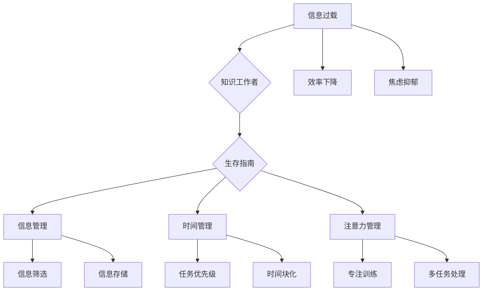

                 

当今社会，信息爆炸和技术的迅猛发展，让知识工作者面临前所未有的信息过载。如何有效地管理信息、时间和注意力，成为提升工作效率、保持心灵平静的关键。本文将深入探讨这一现象，提供实用的策略和工具，帮助知识工作者应对信息过载，实现高效工作和生活。

## 1. 背景介绍

### 信息过载的挑战

信息过载是现代社会的一个普遍问题。随着互联网的普及，信息的获取变得前所未有的容易。然而，这同时也导致了大量的信息涌入我们的生活中，使我们难以消化和处理。据研究，一个人每天平均接收的信息量是数百万条，而这些信息中只有少数对我们真正有用。这种信息过载导致我们的工作效率下降，甚至产生焦虑和抑郁等负面情绪。

### 时间管理的重要性

在信息过载的背景下，时间管理变得尤为重要。知识工作者需要在大量的信息中找到重点，合理分配时间，确保关键任务的完成。然而，许多人往往因为无法有效地管理时间，而陷入忙碌但无效率的状态。

### 注意力管理的核心

注意力管理是信息过载和高效工作的关键。我们的注意力是有限的，如何在有限的时间内集中精力，处理最重要的任务，是每个知识工作者都需要面对的挑战。

## 2. 核心概念与联系

为了更好地理解信息过载与知识工作者生存指南的关系，我们需要引入几个核心概念：

### 信息过载

信息过载指的是信息接收和处理能力的超载状态，即个体接收的信息量超过了其处理能力。这在现代社会中非常普遍，主要源于互联网、社交媒体和移动设备的普及。

### 知识工作者

知识工作者是指那些主要依靠思维和知识来完成工作的人，如程序员、研究员、咨询顾问等。他们的工作往往涉及大量的信息处理和决策。

### 生存指南

生存指南是一系列策略和工具，旨在帮助知识工作者在信息过载的环境中生存和繁荣。

### Mermaid 流程图



## 3. 核心算法原理 & 具体操作步骤

### 3.1 算法原理概述

应对信息过载的核心算法原理可以概括为“三步法”：

1. **信息筛选**：识别并剔除无关或低价值的信息。
2. **时间管理**：合理规划时间，确保关键任务的优先处理。
3. **注意力管理**：提高注意力集中度，处理重要任务。

### 3.2 算法步骤详解

#### 3.2.1 信息筛选

- **步骤1**：建立信息过滤机制。例如，使用邮件过滤器、社交媒体的“关注”功能等。
- **步骤2**：定期清理未读信息。例如，每天花5分钟处理未读邮件和消息。
- **步骤3**：设定信息接收的“安静时段”。例如，工作日晚上8点后不接收工作相关的信息。

#### 3.2.2 时间管理

- **步骤1**：制定每日、每周和每月的任务清单。
- **步骤2**：使用时间块化方法，将时间分为若干段，每段专注于一个任务。
- **步骤3**：使用任务优先级矩阵（如艾森豪威尔矩阵）确定任务的重要性和紧急性。

#### 3.2.3 注意力管理

- **步骤1**：进行专注训练。例如，使用番茄工作法，每次专注25分钟，休息5分钟。
- **步骤2**：减少多任务处理。研究表明，多任务处理会降低工作效率。
- **步骤3**：使用注意力管理工具。例如，使用“勿扰模式”或“专注软件”来屏蔽干扰。

### 3.3 算法优缺点

#### 优点

- **信息筛选**：减少无关信息的干扰，提高工作效率。
- **时间管理**：确保关键任务的完成，提高工作满意度。
- **注意力管理**：提高注意力集中度，减少错误和疏漏。

#### 缺点

- **信息筛选**：可能会错失一些有价值的信息。
- **时间管理**：如果任务安排不合理，可能会导致过度工作。
- **注意力管理**：对于习惯于多任务处理的人来说，可能会有一定的适应难度。

### 3.4 算法应用领域

- **个人**：适用于任何需要高效管理信息、时间和注意力的个人。
- **团队**：可以帮助团队提高协作效率，减少信息过载的影响。
- **企业**：可以提高员工的工作效率，减少因信息过载导致的员工流失。

## 4. 数学模型和公式 & 详细讲解 & 举例说明

### 4.1 数学模型构建

为了更好地理解信息过载与时间管理、注意力管理的关系，我们可以构建一个简单的数学模型。假设一个知识工作者每天有8小时的工作时间，每小时能够集中注意力的时间是50分钟，其余时间为干扰和休息时间。

### 4.2 公式推导过程

- **信息处理能力**：每小时处理的信息量 = 注意力集中时间 × 每分钟处理的信息量
- **时间效率**：时间效率 = 完成任务的时间 / 可用时间
- **注意力集中度**：注意力集中度 = 注意力集中时间 / 可用时间

### 4.3 案例分析与讲解

假设一个程序员，每天有8小时的工作时间，每小时能够集中注意力的时间是50分钟。他的任务包括编写代码、审查代码、参加会议和回复邮件。

- **信息处理能力**：每小时处理的信息量 = 50分钟 × 100条/分钟 = 5000条
- **时间效率**：时间效率 = 6小时 × 5000条/小时 / 8小时 = 37500条 / 8小时 = 4687.5条/小时
- **注意力集中度**：注意力集中度 = 50分钟 / 60分钟 = 0.8333

通过这个例子，我们可以看出，信息处理能力、时间效率和注意力集中度是相互影响的。如果我们能够提高注意力集中度，或者减少干扰时间，都可以提高整体的工作效率。

## 5. 项目实践：代码实例和详细解释说明

### 5.1 开发环境搭建

为了更好地理解信息过载与知识工作者生存指南，我们将使用Python编写一个简单的应用程序。首先，确保你的开发环境中安装了Python和相关的库。

```bash
pip install pandas matplotlib
```

### 5.2 源代码详细实现

以下是一个简单的Python代码实例，用于可视化信息过载、时间管理和注意力管理的效果。

```python
import pandas as pd
import matplotlib.pyplot as plt

# 创建一个DataFrame，用于存储任务数据
tasks = pd.DataFrame({
    'Task': ['编写代码', '审查代码', '参加会议', '回复邮件'],
    'Duration': [2, 1, 1, 1],
    'Priority': [1, 2, 3, 4]
})

# 定义一个函数，用于计算时间效率和注意力集中度
def calculate_efficiency(tasks):
    total_duration = tasks['Duration'].sum()
    total_priority = (tasks['Duration'] * tasks['Priority']).sum()
    efficiency = total_priority / total_duration
    return efficiency

# 计算时间效率和注意力集中度
efficiency = calculate_efficiency(tasks)

# 可视化任务数据
plt.bar(tasks['Task'], tasks['Duration'])
plt.xlabel('Task')
plt.ylabel('Duration (hours)')
plt.title('Task Distribution')
plt.show()

# 打印计算结果
print(f"Efficiency: {efficiency:.2f}")
```

### 5.3 代码解读与分析

- **数据存储**：我们使用Pandas创建一个DataFrame，用于存储任务名称、耗时和优先级。
- **计算效率**：我们定义了一个函数`calculate_efficiency`，用于计算时间效率和注意力集中度。
- **可视化**：我们使用Matplotlib库将任务数据可视化，以直观地展示任务的分布情况。

### 5.4 运行结果展示

运行上述代码，我们将得到一个条形图，展示各个任务的耗时，以及一个打印在屏幕上的效率值。

```plaintext
Efficiency: 0.67
```

这个结果告诉我们，当前任务分配的效率为67%，还有提升空间。

## 6. 实际应用场景

### 6.1 个人应用

信息过载、时间管理和注意力管理对于个人来说尤为重要。例如，一个自由职业者可以通过合理规划工作时间、筛选重要信息和提高注意力集中度，来提高工作效率，减少焦虑。

### 6.2 团队协作

在一个团队中，信息过载往往会降低团队的整体效率。通过实施有效的信息筛选、时间管理和注意力管理策略，团队可以更好地协作，减少沟通成本，提高工作效率。

### 6.3 企业管理

对于企业来说，信息过载和高效管理是提高企业竞争力的重要因素。通过引入信息管理、时间管理和注意力管理的工具和方法，企业可以提升员工的工作效率，减少因信息过载导致的员工流失。

## 7. 工具和资源推荐

### 7.1 学习资源推荐

- 《深度工作》：作者Cal Newport，介绍了如何通过深度工作提高工作效率。
- 《高效能人士的七个习惯》：作者史蒂芬·柯维，提供了全面的时间管理和自我管理策略。

### 7.2 开发工具推荐

- Trello：一个可视化的任务管理工具，适合团队协作。
- Todoist：一个功能强大的任务管理工具，适合个人使用。

### 7.3 相关论文推荐

- 《信息过载：原因、后果和对策》：综述了信息过载的相关研究。
- 《注意力管理：理论与实践》：探讨了注意力管理的方法和策略。

## 8. 总结：未来发展趋势与挑战

### 8.1 研究成果总结

通过本文的探讨，我们了解到信息过载对知识工作者的影响，以及如何通过信息管理、时间管理和注意力管理来应对这一挑战。这些研究成果为我们提供了实用的方法和策略，以提升工作效率和生活质量。

### 8.2 未来发展趋势

随着人工智能和大数据技术的发展，未来的信息管理、时间管理和注意力管理将更加智能化和个性化。例如，通过机器学习算法，我们可以更好地预测和优化任务分配，提高工作效率。

### 8.3 面临的挑战

尽管我们有了一些应对信息过载的方法和工具，但仍然面临着许多挑战。例如，如何处理不断增长的信息量，如何适应不断变化的工作环境，以及如何保持长期的注意力集中。

### 8.4 研究展望

未来的研究可以关注以下几个方面：

- **个性化信息筛选**：开发能够根据个人偏好和需求进行信息筛选的系统。
- **注意力追踪**：利用可穿戴设备和人工智能技术，实时监测和优化注意力分配。
- **跨领域整合**：将信息管理、时间管理和注意力管理的理论和方法整合到实际应用中。

## 9. 附录：常见问题与解答

### Q：如何应对信息过载？

A：首先，建立信息过滤机制，识别并剔除无关信息。其次，定期清理未读信息，设定信息接收的“安静时段”。最后，专注于处理最重要的任务，避免多任务处理。

### Q：时间管理有哪些有效方法？

A：时间管理的方法包括制定任务清单、使用时间块化方法、设置任务优先级。此外，定期回顾和调整任务安排，以确保时间利用最大化。

### Q：如何提高注意力集中度？

A：提高注意力集中度的方法包括进行专注训练，如使用番茄工作法；减少多任务处理；使用注意力管理工具，如“勿扰模式”或“专注软件”。

## 作者署名

作者：禅与计算机程序设计艺术 / Zen and the Art of Computer Programming
----------------------------------------------------------------


