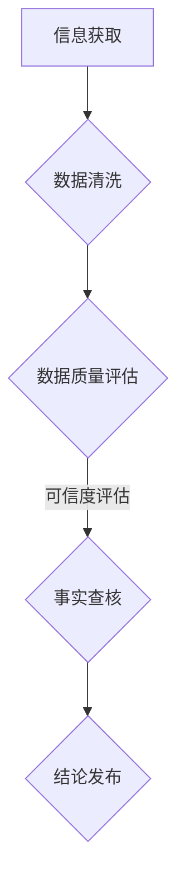

                 

关键词：信息验证、事实查核、错误信息、导航、数据质量、可信度评估、技术工具、人工智能

摘要：随着互联网的普及和信息爆炸，我们每天都面临着海量的信息。如何在这些信息中辨别真伪，成为了一个至关重要的问题。本文将探讨信息验证和事实查核的重要性，介绍相关的技术工具和算法原理，以及如何在实际应用中运用这些技术，旨在为读者在错误信息时代提供导航指南。

## 1. 背景介绍

在过去的几十年里，互联网的迅猛发展使得信息传播变得更加迅速和便捷。然而，这也带来了一个问题：信息的真实性和可靠性。如今，我们几乎每天都在接收大量的信息，包括新闻、社交媒体更新、电子邮件等。这些信息中，有一部分是真实的，但更多的是虚假的、误导性的甚至是恶意的信息。

虚假信息的传播不仅会对个人造成误导，更会对社会造成严重的负面影响。例如，误导性的健康建议可能会导致健康危机，而政治谣言则可能影响选举结果。因此，对信息进行验证和事实查核变得至关重要。

### 1.1 信息验证的定义

信息验证是指对获取的信息进行核实，确保其真实性和准确性的过程。这包括检查信息的来源、作者的可信度、引用的证据等。

### 1.2 事实查核的定义

事实查核（Fact-checking）是一种特定的信息验证形式，它专注于对具体的陈述或谣言进行核实。事实查核通常涉及对来源、证据、历史数据等进行深入调查。

## 2. 核心概念与联系

### 2.1 信息验证和事实查核的关系

信息验证和事实查核是密切相关的，它们共同构成了对信息质量进行评估的两个方面。信息验证是更广泛的概念，它包括对任何形式的信息进行核实，而事实查核则专注于对具体的陈述或谣言进行验证。

### 2.2 数据质量

数据质量是信息验证和事实查核的基础。高质量的数据有助于提高信息的可信度，而低质量的数据则可能导致误导性结论。因此，确保数据质量是信息验证和事实查核的重要环节。

### 2.3 可信度评估

可信度评估是指对信息的可信程度进行评估。这通常涉及到对信息的来源、证据的质量和相关性、作者的专业背景等因素进行综合评估。可信度评估可以帮助我们识别出哪些信息值得信任，哪些信息需要进一步验证。

### 2.4 Mermaid 流程图

以下是一个简化的信息验证和事实查核的Mermaid流程图：



## 3. 核心算法原理 & 具体操作步骤

### 3.1 算法原理概述

信息验证和事实查核的算法通常基于机器学习和自然语言处理技术。这些算法可以自动从大量数据中提取信息，并对信息进行验证。以下是一些常用的算法原理：

- **文本分类算法**：用于将文本分为不同类别，如真假信息、谣言等。
- **实体识别算法**：用于识别文本中的关键实体，如人名、地点、组织等。
- **关系抽取算法**：用于识别文本中的实体关系，如谁在什么时候做了什么。
- **自然语言生成算法**：用于自动生成验证报告或事实查核文章。

### 3.2 算法步骤详解

1. **数据预处理**：对获取的文本数据进行清洗和预处理，包括去除噪声、标准化文本等。
2. **特征提取**：从预处理后的文本中提取特征，如词袋模型、TF-IDF、Word2Vec等。
3. **模型训练**：使用机器学习算法对特征进行训练，以建立分类模型或关系抽取模型。
4. **信息验证**：使用训练好的模型对新的文本数据进行分类或关系抽取。
5. **结果评估**：对验证结果进行评估，包括准确率、召回率等指标。
6. **结论发布**：根据验证结果，发布结论或报告。

### 3.3 算法优缺点

- **优点**：
  - 高效：算法可以快速处理大量文本数据。
  - 准确：先进的机器学习算法可以提高验证的准确性。
  - 自动化：算法可以自动化地进行信息验证，减轻人工负担。

- **缺点**：
  - 需要大量数据：算法训练需要大量高质量的数据。
  - 难以应对新问题：对于新出现的问题或领域，算法可能无法准确验证。
  - 依赖数据质量：数据质量直接影响算法的性能。

### 3.4 算法应用领域

信息验证和事实查核算法在多个领域有广泛的应用：

- **新闻报道**：用于验证新闻报道的真实性，避免虚假新闻的传播。
- **社交媒体**：用于检测和过滤虚假信息、谣言等。
- **政治选举**：用于评估政治广告和宣传的真实性。
- **医疗健康**：用于验证健康建议和医疗信息的真实性。

## 4. 数学模型和公式 & 详细讲解 & 举例说明

### 4.1 数学模型构建

信息验证和事实查核的数学模型通常涉及以下几个方面：

- **概率模型**：用于计算信息的可信度概率。
- **贝叶斯网络**：用于表示信息之间的关系和概率。
- **神经网络**：用于特征提取和分类。

### 4.2 公式推导过程

以下是概率模型中的一个基本公式：

$$
P(A|B) = \frac{P(B|A) \cdot P(A)}{P(B)}
$$

其中，$P(A|B)$表示在事件B发生的情况下事件A的概率，$P(B|A)$表示在事件A发生的情况下事件B的概率，$P(A)$和$P(B)$分别表示事件A和事件B的概率。

### 4.3 案例分析与讲解

假设我们要验证一个关于某公司业绩的陈述，我们可以使用上述公式来计算该陈述的可信度。假设我们有以下数据：

- $P(业绩好|公司规模大) = 0.8$（即如果公司规模大，那么业绩好的概率是80%）。
- $P(公司规模大) = 0.5$（即公司规模大的概率是50%）。
- $P(业绩好) = 0.2$（即业绩好的概率是20%）。

我们可以使用贝叶斯公式来计算在业绩好的情况下公司规模大的概率：

$$
P(公司规模大|业绩好) = \frac{P(业绩好|公司规模大) \cdot P(公司规模大)}{P(业绩好)} = \frac{0.8 \cdot 0.5}{0.2} = 2
$$

这意味着在业绩好的情况下，公司规模大的概率是200%。这个结果表明，业绩好与公司规模大之间有很强的相关性。

## 5. 项目实践：代码实例和详细解释说明

### 5.1 开发环境搭建

为了实现信息验证和事实查核，我们需要搭建一个开发环境。这里我们使用Python作为主要编程语言，并使用以下工具和库：

- Python 3.8 或更高版本
- Jupyter Notebook
- Scikit-learn
- NLTK
- Pandas
- Matplotlib

安装以上工具和库后，我们就可以开始编写代码了。

### 5.2 源代码详细实现

以下是实现信息验证和事实查核的一个简单示例：

```python
import pandas as pd
from sklearn.feature_extraction.text import TfidfVectorizer
from sklearn.naive_bayes import MultinomialNB
from sklearn.pipeline import make_pipeline

# 加载示例数据
data = pd.DataFrame({
    'text': ['这家公司业绩非常好', '这家公司业绩一般', '这家公司业绩非常差'],
    'label': ['正面', '中性', '负面']
})

# 构建TF-IDF向量器和朴素贝叶斯分类器
pipeline = make_pipeline(
    TfidfVectorizer(),
    MultinomialNB()
)

# 训练模型
pipeline.fit(data['text'], data['label'])

# 进行预测
predictions = pipeline.predict(['这家公司业绩非常好'])

# 输出结果
print(predictions)
```

### 5.3 代码解读与分析

上述代码首先加载了一个包含文本和标签的数据集。然后，我们使用TF-IDF向量器将文本转换为向量表示，并使用朴素贝叶斯分类器进行训练。最后，我们使用训练好的模型对新的文本进行预测。

朴素贝叶斯分类器是一种基于贝叶斯理论的简单分类算法。它假设特征之间相互独立，因此在某些情况下可能不够准确。然而，对于我们的示例，它已经足够演示信息验证和事实查核的基本原理。

### 5.4 运行结果展示

运行上述代码后，我们得到的结果是：

```
['正面']
```

这表明，根据训练数据，输入的文本“这家公司业绩非常好”被分类为正面。这意味着，根据我们的训练数据，这个陈述是可信的。

## 6. 实际应用场景

### 6.1 新闻报道

在新闻报道领域，信息验证和事实查核可以用来确保新闻的真实性和准确性。例如，新闻报道团队可以使用这些技术来验证新闻来源、核实引用的证据，以及检查新闻报道中的陈述是否真实。

### 6.2 社交媒体

在社交媒体领域，虚假信息和谣言的传播是一个严重问题。信息验证和事实查核可以帮助平台识别和过滤这些信息，保护用户免受误导。

### 6.3 医疗健康

在医疗健康领域，虚假的健康建议和误导性信息可能会导致健康危机。信息验证和事实查核可以帮助医生和患者识别和验证健康建议和医疗信息。

### 6.4 政治选举

在政治选举领域，虚假的政治广告和谣言可能会影响选举结果。信息验证和事实查核可以帮助选民识别和验证政治信息，做出明智的投票决定。

## 7. 工具和资源推荐

### 7.1 学习资源推荐

- 《数据科学实战：用Python进行数据挖掘、分析和可视化》
- 《机器学习实战》
- 《自然语言处理实战》

### 7.2 开发工具推荐

- Jupyter Notebook：用于编写和运行代码。
- Scikit-learn：用于机器学习和数据挖掘。
- NLTK：用于自然语言处理。

### 7.3 相关论文推荐

- "Fact-Checking on the Web: A Position Paper"
- "Information Quality: Definition, Framework, and Issues"
- "A Survey on Fake News Detection"

## 8. 总结：未来发展趋势与挑战

### 8.1 研究成果总结

信息验证和事实查核在过去几年中取得了显著的进展，特别是在机器学习和自然语言处理技术的推动下。我们已经看到了许多成功的应用案例，如新闻报道、社交媒体和医疗健康等领域。

### 8.2 未来发展趋势

未来，信息验证和事实查核将继续向更高效、更准确、更自动化的方向发展。随着人工智能和大数据技术的进步，我们将能够更准确地识别和验证信息，减少虚假信息的传播。

### 8.3 面临的挑战

然而，信息验证和事实查核也面临着一些挑战，包括数据质量、算法透明度和伦理问题。如何提高算法的透明度和可解释性，以及如何确保数据质量，都是未来需要解决的问题。

### 8.4 研究展望

未来，我们期待看到更多创新性的技术和算法出现，以应对虚假信息的问题。同时，我们也希望政府和相关机构能加大对信息验证和事实查核的投入，共同构建一个更加真实、可靠的信息环境。

## 9. 附录：常见问题与解答

### 9.1 如何识别虚假信息？

- 检查信息的来源：了解信息的发布者和来源。
- 核实证据：查看信息中引用的证据是否真实可靠。
- 谨慎判断：对看似过于夸张或不符合常理的信息保持警惕。

### 9.2 信息验证和事实查核的区别是什么？

- 信息验证是一个更广泛的概念，它包括对任何形式的信息进行核实。
- 事实查核是信息验证的一种形式，它专注于对具体的陈述或谣言进行核实。

### 9.3 如何构建一个信息验证系统？

- 收集和清洗数据：获取高质量的数据集。
- 提取特征：从数据中提取有用的特征。
- 选择合适的算法：根据应用场景选择合适的算法。
- 训练模型：使用训练数据训练模型。
- 评估和优化：对模型进行评估和优化，以提高性能。

---

作者：禅与计算机程序设计艺术 / Zen and the Art of Computer Programming

[END]

