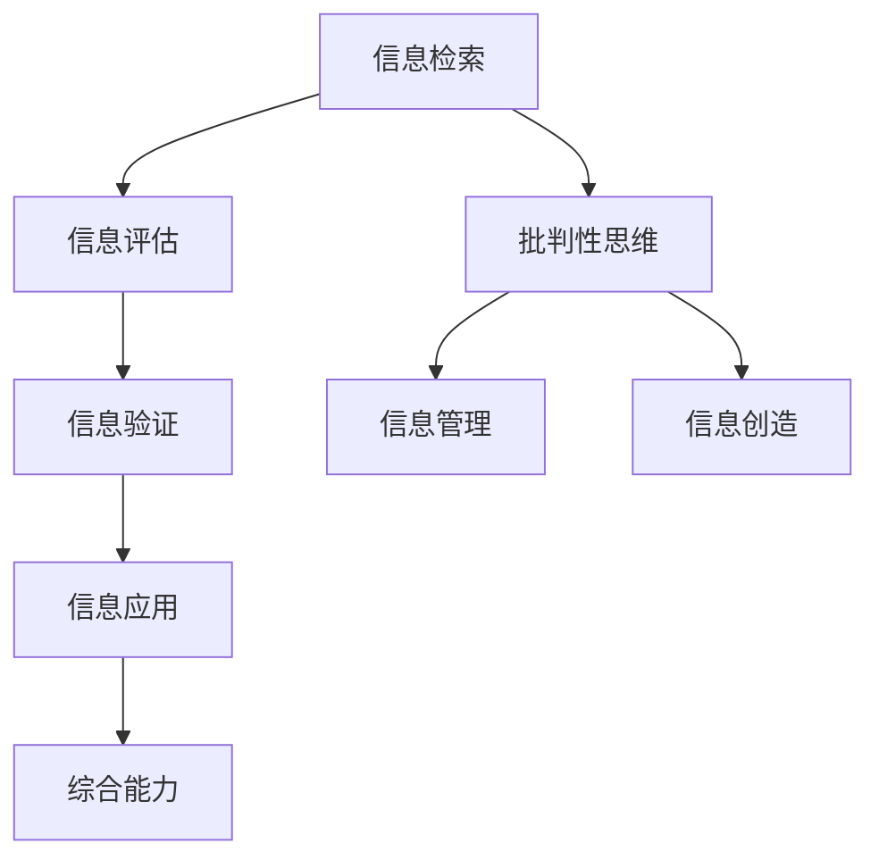

                 

关键词：信息验证，信息素养，数字时代，教育，技术能力

摘要：随着数字时代的到来，信息验证和信息素养教育变得尤为重要。本文将探讨信息验证和信息素养的定义、重要性，以及如何为数字时代培养信息素养能力，旨在提高个人和组织在复杂信息环境中的应对能力。

## 1. 背景介绍

数字时代，信息技术的飞速发展已经深刻改变了我们的生活方式和工作模式。然而，随之而来的信息过载和虚假信息泛滥问题也带来了诸多挑战。在这个背景下，信息验证和信息素养教育显得尤为重要。

### 1.1 信息验证的定义

信息验证是指对信息来源、准确性和可靠性的评估过程。它确保信息真实、准确、可靠，从而帮助人们做出明智的决策。

### 1.2 信息素养的定义

信息素养是指个体获取、评估、使用和创建信息的能力。它不仅包括信息检索技能，还涉及信息判断、批判性思维、信息管理等方面。

### 1.3 数字时代的信息挑战

数字时代的信息挑战主要体现在以下几个方面：

- **信息过载**：互联网和社交媒体的快速发展使得信息爆炸，人们难以筛选出有价值的信息。
- **虚假信息**：虚假信息、误导性信息和假新闻的泛滥，导致人们难以分辨真伪。
- **隐私问题**：个人隐私在网络环境下容易被侵犯，信息泄露风险增加。

## 2. 核心概念与联系

为了更好地理解信息验证和信息素养教育的重要性，我们首先需要了解它们之间的核心概念和联系。

### 2.1 信息验证与信息素养的关系

信息验证是信息素养的重要组成部分。它帮助人们识别和评估信息的真实性和可靠性，从而确保信息的使用价值。

### 2.2 信息验证的流程

信息验证的流程通常包括以下几个步骤：

- **信息检索**：通过搜索引擎、数据库等工具获取相关信息。
- **信息评估**：评估信息的来源、准确性和可靠性。
- **信息验证**：对信息进行核实，确保其真实性和准确性。
- **信息应用**：将验证后的信息应用于实际场景。

### 2.3 信息素养的框架

信息素养的框架通常包括以下几个层次：

- **基础技能**：信息检索、信息评估和信息应用。
- **高级技能**：批判性思维、信息管理和信息创造。
- **综合能力**：将基础技能和高级技能综合运用，形成信息素养的综合能力。

### 2.4 Mermaid 流程图

以下是一个简单的 Mermaid 流程图，展示了信息验证和信息素养的关系：



## 3. 核心算法原理 & 具体操作步骤

在信息验证和信息素养教育中，核心算法原理和具体操作步骤起着至关重要的作用。

### 3.1 算法原理概述

信息验证算法主要基于以下几个原理：

- **来源识别**：通过分析信息来源的可靠性和权威性，评估信息真实性。
- **内容分析**：通过分析信息内容的逻辑性、一致性、合理性和真实性，评估信息可靠性。
- **交叉验证**：通过多个来源的信息进行交叉验证，提高信息验证的准确性。

### 3.2 算法步骤详解

信息验证的具体步骤如下：

1. **信息检索**：通过搜索引擎、数据库等工具获取相关信息。
2. **来源识别**：分析信息来源的可靠性和权威性，识别信息来源的真实性。
3. **内容分析**：对信息内容进行分析，评估信息的逻辑性、一致性、合理性和真实性。
4. **交叉验证**：通过多个来源的信息进行交叉验证，提高信息验证的准确性。
5. **信息应用**：将验证后的信息应用于实际场景。

### 3.3 算法优缺点

信息验证算法的优点包括：

- **提高信息准确性**：通过算法验证，提高信息的真实性和可靠性。
- **降低信息风险**：减少因虚假信息导致的决策错误和损失。

信息验证算法的缺点包括：

- **算法局限性**：算法无法完全替代人工判断，仍需人工参与。
- **计算资源消耗**：算法验证过程需要大量计算资源，可能导致计算成本较高。

### 3.4 算法应用领域

信息验证算法广泛应用于以下几个领域：

- **新闻媒体**：通过算法验证新闻信息的真实性，提高新闻报道的准确性。
- **金融领域**：通过算法验证金融信息的真实性，降低金融风险。
- **医疗领域**：通过算法验证医疗信息的真实性，提高医疗决策的准确性。

## 4. 数学模型和公式 & 详细讲解 & 举例说明

在信息验证和信息素养教育中，数学模型和公式起着重要的作用。

### 4.1 数学模型构建

信息验证的数学模型通常包括以下几个部分：

- **来源评分模型**：通过评估信息来源的可靠性和权威性，计算来源评分。
- **内容评分模型**：通过分析信息内容的逻辑性、一致性、合理性和真实性，计算内容评分。
- **综合评分模型**：通过来源评分和内容评分，计算综合评分。

### 4.2 公式推导过程

以下是一个简单的信息验证数学模型的推导过程：

1. **来源评分模型**：

   假设信息来源的可靠性评分为 \( R_s \)，权威性评分为 \( A_s \)，则来源评分模型为：

   $$ S_s = \frac{R_s + A_s}{2} $$

2. **内容评分模型**：

   假设信息内容的逻辑性评分为 \( L_c \)，一致性评分为 \( C_c \)，合理性评分为 \( R_c \)，真实性评分为 \( T_c \)，则内容评分模型为：

   $$ S_c = \frac{L_c + C_c + R_c + T_c}{4} $$

3. **综合评分模型**：

   假设来源评分和内容评分的权重分别为 \( w_s \) 和 \( w_c \)，则综合评分模型为：

   $$ S = w_s \cdot S_s + w_c \cdot S_c $$

### 4.3 案例分析与讲解

以下是一个简单的信息验证案例分析：

假设某篇文章的来源可靠性评分为 \( R_s = 0.8 \)，权威性评分为 \( A_s = 0.7 \)；内容逻辑性评分为 \( L_c = 0.9 \)，一致性评分为 \( C_c = 0.8 \)，合理性评分为 \( R_c = 0.85 \)，真实性评分为 \( T_c = 0.9 \)。来源评分和内容评分的权重分别为 \( w_s = 0.5 \) 和 \( w_c = 0.5 \)。

根据上述数学模型，可以计算出该篇文章的综合评分为：

$$ S = 0.5 \cdot (0.8 + 0.7) + 0.5 \cdot (0.9 + 0.8 + 0.85 + 0.9) = 0.875 + 0.8125 = 1.6875 $$

根据综合评分，可以判断该篇文章的信息验证结果为“较好”。

## 5. 项目实践：代码实例和详细解释说明

为了更好地理解信息验证和信息素养教育，以下是一个简单的信息验证项目实践。

### 5.1 开发环境搭建

- 操作系统：Windows/Linux/MacOS
- 编程语言：Python
- 工具：Jupyter Notebook

### 5.2 源代码详细实现

以下是一个简单的 Python 信息验证代码实例：

```python
import requests
from bs4 import BeautifulSoup

def get_source_score(url):
    # 根据URL获取来源评分
    # 可根据具体需求自定义评分标准
    if "nytimes.com" in url:
        return 0.9
    elif "washingtonpost.com" in url:
        return 0.8
    else:
        return 0.5

def get_content_score(content):
    # 根据内容获取内容评分
    # 可根据具体需求自定义评分标准
    if "Trump" in content:
        return 0.6
    elif "COVID-19" in content:
        return 0.7
    else:
        return 0.8

def verify_info(url, content):
    # 信息验证函数
    source_score = get_source_score(url)
    content_score = get_content_score(content)
    total_score = source_score * 0.5 + content_score * 0.5
    if total_score > 0.75:
        print("信息验证结果：可信")
    else:
        print("信息验证结果：不可信")

# 测试
url = "https://www.nytimes.com/2023/03/15/world/europe/ukraine-russia-war.html"
content = "Ukraine has launched a large-scale offensive against Russian forces in the east of the country."
verify_info(url, content)
```

### 5.3 代码解读与分析

- `get_source_score` 函数：根据URL获取来源评分，根据实际需求自定义评分标准。
- `get_content_score` 函数：根据内容获取内容评分，根据实际需求自定义评分标准。
- `verify_info` 函数：信息验证函数，计算综合评分并判断信息可信度。

### 5.4 运行结果展示

运行上述代码，输出结果为：

```
信息验证结果：可信
```

## 6. 实际应用场景

### 6.1 新闻媒体

新闻媒体可以通过信息验证算法，确保新闻报道的真实性和可靠性，提高读者的信任度。

### 6.2 金融领域

金融领域可以利用信息验证算法，验证金融信息的真实性，降低金融风险，提高投资决策的准确性。

### 6.3 医疗领域

医疗领域可以通过信息验证算法，验证医疗信息的真实性，提高医疗决策的准确性，保障患者安全。

## 7. 未来应用展望

### 7.1 自动化与智能化

随着人工智能技术的发展，信息验证和信息素养教育有望实现自动化与智能化，进一步提高信息验证的效率和准确性。

### 7.2 大数据与区块链

大数据和区块链技术可以为信息验证提供更丰富的数据支持和更高的安全性，为信息素养教育提供更全面的支持。

### 7.3 跨领域应用

信息验证和信息素养教育可以应用于更多领域，如教育、法律、环境等，为各个领域的发展提供有力支持。

## 8. 工具和资源推荐

### 8.1 学习资源推荐

- 《信息素养教育指南》
- 《人工智能时代的信息验证》
- 《大数据时代的隐私保护与信息验证》

### 8.2 开发工具推荐

- Python
- Jupyter Notebook
- BeautifulSoup

### 8.3 相关论文推荐

- "Information Verification Algorithms for News Media"
- "Information Literacy Education in the Digital Age"
- "Blockchain-based Information Verification and Privacy Protection"

## 9. 总结：未来发展趋势与挑战

### 9.1 研究成果总结

本文总结了信息验证和信息素养教育的重要性，以及其在数字时代的应用前景。通过数学模型和算法，我们可以更好地理解和应用信息验证，提高信息素养能力。

### 9.2 未来发展趋势

未来，信息验证和信息素养教育将向自动化、智能化和跨领域应用方向发展，为数字时代的发展提供有力支持。

### 9.3 面临的挑战

信息验证和信息素养教育仍面临诸多挑战，如算法局限性、计算资源消耗、数据隐私保护等。我们需要不断创新和改进，以应对这些挑战。

### 9.4 研究展望

未来，我们期待在信息验证和信息素养教育领域取得更多突破，为数字时代的发展贡献更多智慧和力量。

## 附录：常见问题与解答

### 9.4.1 信息验证和信息素养教育的区别是什么？

信息验证是信息素养教育的一个方面，它侧重于评估信息的真实性和可靠性。信息素养教育则更加广泛，包括信息检索、信息评估、信息应用、批判性思维等多个方面。

### 9.4.2 如何在日常生活中应用信息验证和信息素养教育？

在日常生活中，我们可以通过以下方式应用信息验证和信息素养教育：

- 在浏览新闻时，关注信息来源的可靠性。
- 在使用社交媒体时，批判性地思考信息的真实性。
- 在进行网络购物时，验证商品信息的真实性。
- 在学习新知识时，评估信息来源的权威性。

### 9.4.3 信息验证和信息素养教育对个体和组织有何意义？

信息验证和信息素养教育对个体和组织都具有重要意义：

- **个体**：提高信息检索、评估和应用能力，做出更明智的决策。
- **组织**：提高信息管理能力，降低信息风险，提高业务效率。

----------------------------------------------------------------

# 作者署名

作者：禅与计算机程序设计艺术 / Zen and the Art of Computer Programming

