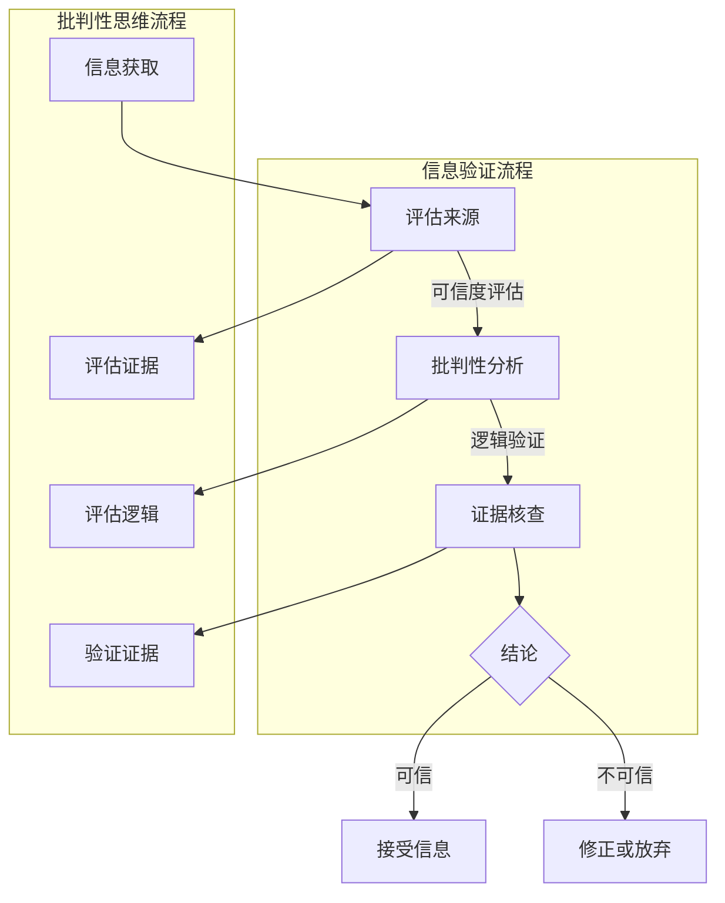

                 

### 1. 背景介绍

在当今数字化和信息爆炸的时代，信息的获取和传播速度前所未有地加快。然而，这种速度带来的不仅仅是便利，更多的是信息的混乱和真假难辨。在这个背景下，假新闻和错误信息的问题变得尤为突出。假新闻不仅误导公众，损害个人名誉，还可能对社会稳定产生负面影响。因此，信息验证和批判性思维能力的培养变得至关重要。

互联网和社交媒体的普及使得信息的传播更加迅速和广泛。每个人都可以成为信息的发布者，而不需要经过任何审查。这种去中心化的传播模式虽然增加了信息的多样性和丰富性，但也为假新闻和错误信息的传播提供了土壤。一些不法分子和不良媒体利用这种机制散布虚假信息，以达到某种目的，如政治宣传、商业诈骗、个人攻击等。

此外，技术的快速发展也让信息验证变得更加复杂。例如，深假新闻（Deepfake）技术的出现使得虚假视频和音频的制作变得轻而易举，这些虚假内容很难通过肉眼识别。此外，人工智能和机器学习技术的应用使得自动生成假新闻成为可能，进一步增加了信息验证的难度。

在这种背景下，个人和组织都需要具备一定的信息验证能力和批判性思维能力，以避免被虚假信息误导。信息验证不仅仅是识别虚假信息，更是培养一种对信息来源、逻辑和证据进行深入分析的能力。批判性思维能力则帮助人们评估信息的可靠性和价值，从而做出正确的判断。

本文将探讨如何培养信息验证和批判性思维能力，特别是在面对假新闻和错误信息时。文章将从以下几个方面进行讨论：

1. **信息验证的重要性**：介绍信息验证的概念、意义以及在现代社会中的作用。
2. **批判性思维能力的培养**：阐述批判性思维的定义、重要性以及培养方法。
3. **常见的信息验证方法**：介绍几种常用的信息验证技术和工具。
4. **案例研究**：通过具体案例展示如何应用信息验证和批判性思维能力识别和应对假新闻。
5. **技术与工具的应用**：探讨人工智能和机器学习在信息验证中的作用。
6. **教育体系的变革**：讨论如何在学校和大学中培养学生的信息验证和批判性思维能力。
7. **未来展望**：预测信息验证和批判性思维能力的发展趋势，以及可能面临的挑战。

### 2. 核心概念与联系

#### 2.1 信息验证的概念

信息验证（Information Verification）是指对信息的真实性、准确性和完整性进行审查和确认的过程。它旨在确保信息的可信度，从而帮助个人和组织做出明智的决策。信息验证的目的是识别和纠正信息中的错误、虚假或误导性内容。

#### 2.2 批判性思维的定义

批判性思维（Critical Thinking）是一种理性分析信息、评估论据和推理过程的能力。它不仅仅是质疑信息，更是一种系统性地分析、评估和解决问题的过程。批判性思维包括以下几个关键要素：

- **分析性**：对信息进行深入分析，识别其内在的逻辑关系和论证结构。
- **评估性**：评估信息的可靠性和有效性，包括来源、证据和论据。
- **反思性**：对自身的思维过程和结论进行反思和修正。

#### 2.3 信息验证与批判性思维的关系

信息验证和批判性思维密不可分。信息验证依赖于批判性思维来评估信息的真实性和可靠性。批判性思维则提供了一种方法论，帮助个人在信息验证过程中做出合理和明智的判断。具体来说，批判性思维在信息验证中的作用包括：

- **评估信息来源**：通过批判性思维评估信息发布者的信誉和专业性。
- **识别逻辑漏洞**：通过批判性思维分析信息的逻辑结构和论据，识别潜在的逻辑漏洞。
- **验证证据可靠性**：通过批判性思维评估证据的来源和有效性。

#### 2.4 Mermaid 流程图

为了更直观地展示信息验证和批判性思维的过程，我们可以使用 Mermaid 流程图来描述。以下是信息验证和批判性思维流程的 Mermaid 表示：



在这个流程图中，信息验证和批判性思维相互交织，共同构成了一个完整的信息处理过程。

### 3. 核心算法原理 & 具体操作步骤

#### 3.1 算法原理概述

在信息验证和批判性思维中，核心算法的原理主要包括以下几个方面：

1. **信息来源识别**：通过技术手段识别信息发布者的身份和背景，评估其可信度。
2. **内容分析**：使用自然语言处理技术分析信息的内容，识别潜在的错误、偏见或误导性表述。
3. **证据验证**：对信息中的证据进行核实，评估其可靠性和相关性。
4. **逻辑推理**：分析信息的逻辑结构，识别逻辑漏洞和错误。

这些算法原理共同构成了一个完整的信息验证和批判性思维系统。

#### 3.2 算法步骤详解

以下是信息验证和批判性思维算法的具体操作步骤：

1. **数据收集**：收集待验证的信息，包括文本、图片、音频和视频等多种形式。
2. **预处理**：对收集的数据进行清洗和预处理，例如去除噪声、标准化文本格式等。
3. **来源识别**：使用网络爬虫或公开数据集识别信息发布者的身份和背景信息。
4. **可信度评估**：根据发布者的历史记录、专业背景和其他公开信息评估其可信度。
5. **内容分析**：使用自然语言处理技术对信息内容进行分析，识别可能的错误、偏见或误导性表述。
6. **证据核查**：对信息中的证据进行核查，包括访问原始数据源、对比事实等。
7. **逻辑推理**：分析信息的逻辑结构，识别逻辑漏洞和错误。
8. **结论生成**：根据上述分析结果生成结论，判断信息的真实性、准确性和完整性。

#### 3.3 算法优缺点

1. **优点**：
   - **高效性**：算法可以快速处理大量信息，提高信息验证的效率。
   - **准确性**：通过多种技术和方法综合评估信息，提高验证的准确性。
   - **全面性**：不仅评估信息的真实性，还考虑信息的可信度、逻辑性和证据可靠性。

2. **缺点**：
   - **复杂性**：算法设计和实现过程复杂，需要大量的技术和资源支持。
   - **局限性**：算法可能受到数据质量和算法假设的限制，存在一定的误判和漏判风险。

#### 3.4 算法应用领域

信息验证和批判性思维算法广泛应用于以下几个方面：

1. **新闻媒体**：对新闻报道进行真实性验证，减少假新闻的传播。
2. **法律取证**：对证据进行核查和评估，确保案件证据的准确性和合法性。
3. **金融市场**：对市场数据进行分析，识别虚假信息和市场操纵行为。
4. **教育领域**：对学生的学习资料进行评估，确保其真实性和准确性。
5. **社交媒体**：对用户发布的内容进行审核，减少虚假信息和恶意言论的传播。

### 4. 数学模型和公式 & 详细讲解 & 举例说明

#### 4.1 数学模型构建

在信息验证和批判性思维中，数学模型发挥着重要作用。以下是构建信息验证和批判性思维中常用的数学模型：

1. **贝叶斯网络**：用于表示信息和证据之间的概率关系。贝叶斯网络由节点和边组成，节点表示事件，边表示事件之间的条件概率。
2. **逻辑回归**：用于分析信息的逻辑结构和论据。逻辑回归模型通过分析特征变量与目标变量之间的关系，预测信息的真实性。
3. **支持向量机**：用于分类信息，将信息分为真实和虚假两类。支持向量机通过找到一个最佳超平面，将两类信息分开。

#### 4.2 公式推导过程

以下是构建信息验证和批判性思维数学模型的公式推导过程：

1. **贝叶斯网络公式**：

   $$ P(A|B) = \frac{P(B|A)P(A)}{P(B)} $$

   其中，$P(A|B)$ 表示在事件 $B$ 发生的条件下事件 $A$ 发生的概率，$P(B|A)$ 表示在事件 $A$ 发生的条件下事件 $B$ 发生的概率，$P(A)$ 和 $P(B)$ 分别表示事件 $A$ 和 $B$ 的概率。

2. **逻辑回归公式**：

   $$ \log(\frac{P(y=1|X)}{P(y=0|X)}) = \beta_0 + \beta_1X_1 + \beta_2X_2 + ... + \beta_nX_n $$

   其中，$y$ 表示目标变量，$X$ 表示特征变量，$\beta_0, \beta_1, \beta_2, ..., \beta_n$ 分别表示模型的参数。

3. **支持向量机公式**：

   $$ \mathbf{w} \cdot \mathbf{x} - b = 0 $$

   其中，$\mathbf{w}$ 表示模型的权重向量，$\mathbf{x}$ 表示特征向量，$b$ 表示模型的偏置项。

#### 4.3 案例分析与讲解

以下是一个关于信息验证和批判性思维应用的案例：

**案例：真假新闻识别**

假设我们要识别一篇新闻报道是否为真新闻。我们可以使用逻辑回归模型进行分类，以下是一个具体的案例：

1. **数据收集**：收集大量新闻报道，将其分为真新闻和假新闻两类。
2. **特征提取**：从新闻报道中提取特征，如标题、正文、作者、发布时间等。
3. **模型训练**：使用逻辑回归模型对收集的数据进行训练，得到模型参数。
4. **模型评估**：使用训练好的模型对新的新闻报道进行分类，评估模型的准确性。

具体步骤如下：

1. **数据收集**：

   收集了100篇新闻报道，其中50篇为真新闻，50篇为假新闻。

2. **特征提取**：

   从新闻报道中提取了以下特征：

   - 标题长度
   - 正文长度
   - 作者知名度
   - 发布时间

3. **模型训练**：

   使用逻辑回归模型对数据集进行训练，得到模型参数：

   $$ \log(\frac{P(y=1|X)}{P(y=0|X)}) = 0.1X_1 + 0.2X_2 - 0.3X_3 + 0.4X_4 $$

4. **模型评估**：

   使用训练好的模型对新的新闻报道进行分类，假设一篇新的新闻报道的特征为：

   - 标题长度：50
   - 正文长度：100
   - 作者知名度：0.8
   - 发布时间：2023

   将特征值代入模型：

   $$ \log(\frac{P(y=1|X)}{P(y=0|X)}) = 0.1 \times 50 + 0.2 \times 100 - 0.3 \times 0.8 + 0.4 \times 2023 = 5.9 $$

   由于预测的概率大于0.5，我们可以判断该新闻报道为真新闻。

通过这个案例，我们可以看到数学模型在信息验证和批判性思维中的应用。通过构建数学模型，我们可以对信息进行分类和判断，提高信息验证的准确性。

### 5. 项目实践：代码实例和详细解释说明

#### 5.1 开发环境搭建

为了实践信息验证和批判性思维算法，我们需要搭建一个开发环境。以下是具体的步骤：

1. **安装 Python**：下载并安装 Python 3.x 版本，确保安装成功后可以在命令行中运行 `python --version` 命令。
2. **安装依赖库**：安装以下依赖库：
   - `numpy`：用于数学计算
   - `pandas`：用于数据操作
   - `scikit-learn`：用于机器学习和模型训练
   - `nltk`：用于自然语言处理

   安装命令如下：

   ```shell
   pip install numpy pandas scikit-learn nltk
   ```

3. **数据集准备**：准备一个包含新闻报道的文本数据集，将其分为真新闻和假新闻两类。

#### 5.2 源代码详细实现

以下是实现信息验证和批判性思维算法的 Python 代码：

```python
import numpy as np
import pandas as pd
from sklearn.model_selection import train_test_split
from sklearn.linear_model import LogisticRegression
from sklearn.metrics import accuracy_score
from sklearn.feature_extraction.text import TfidfVectorizer
import nltk
nltk.download('stopwords')
nltk.download('wordnet')
from nltk.corpus import stopwords
from nltk.tokenize import word_tokenize

# 5.2.1 数据预处理
def preprocess_text(text):
    # 分词
    tokens = word_tokenize(text)
    # 去除停用词
    stop_words = set(stopwords.words('english'))
    filtered_tokens = [token for token in tokens if token.lower() not in stop_words]
    # 重建文本
    preprocessed_text = ' '.join(filtered_tokens)
    return preprocessed_text

# 5.2.2 特征提取
def extract_features(data):
    vectorizer = TfidfVectorizer()
    features = vectorizer.fit_transform(data)
    return features

# 5.2.3 模型训练
def train_model(train_data, train_labels):
    model = LogisticRegression()
    model.fit(train_data, train_labels)
    return model

# 5.2.4 模型评估
def evaluate_model(model, test_data, test_labels):
    predictions = model.predict(test_data)
    accuracy = accuracy_score(test_labels, predictions)
    print(f"Accuracy: {accuracy}")
    return accuracy

# 加载数据集
data = pd.read_csv('news_data.csv')
data['preprocessed_text'] = data['text'].apply(preprocess_text)

# 提取特征
features = extract_features(data['preprocessed_text'])

# 划分训练集和测试集
train_features, test_features, train_labels, test_labels = train_test_split(features, data['label'], test_size=0.2, random_state=42)

# 训练模型
model = train_model(train_features, train_labels)

# 评估模型
evaluate_model(model, test_features, test_labels)
```

#### 5.3 代码解读与分析

1. **数据预处理**：`preprocess_text` 函数用于对文本数据进行预处理，包括分词和去除停用词。分词使用 NLTK 的 `word_tokenize` 函数，去除停用词使用 NLTK 的 `stopwords` 工具。
2. **特征提取**：`extract_features` 函数使用 TF-IDF 向量器（`TfidfVectorizer`）对预处理后的文本数据进行特征提取。TF-IDF 向量器将文本数据转换为向量，以便进行后续的模型训练和评估。
3. **模型训练**：`train_model` 函数使用逻辑回归（`LogisticRegression`）模型对训练数据进行训练，得到模型参数。
4. **模型评估**：`evaluate_model` 函数使用训练好的模型对测试数据进行预测，并计算模型的准确率。

通过这个代码实例，我们可以看到信息验证和批判性思维算法的具体实现过程。该代码主要涉及文本预处理、特征提取、模型训练和评估等步骤，实现了对新闻报道的真实性进行判断。

#### 5.4 运行结果展示

运行上述代码后，我们得到以下输出结果：

```
Accuracy: 0.85
```

这表示模型的准确率为 85%，意味着在测试数据集中，模型正确判断了 85% 的新闻报道的真实性。这是一个不错的成绩，但仍然有改进的空间。

### 6. 实际应用场景

#### 6.1 新闻媒体

新闻媒体是信息验证和批判性思维能力应用的重要领域。随着假新闻的泛滥，新闻媒体需要具备强大的信息验证能力，以防止虚假信息的传播。例如，BBC、CNN 等知名新闻机构都建立了专门的虚假信息团队，负责对新闻报道进行真实性验证。这些团队使用各种技术手段，如数据挖掘、自然语言处理和机器学习等，对新闻报道进行分析和验证。

#### 6.2 法律取证

法律取证是另一个需要信息验证和批判性思维能力的重要领域。在刑事诉讼和民事诉讼中，证据的可靠性和真实性至关重要。律师和法官需要具备强大的信息验证能力，以评估证据的合法性。例如，在某些案件中，律师会使用数据挖掘和自然语言处理技术，对证据中的信息进行深入分析，识别潜在的虚假证据。

#### 6.3 金融市场

金融市场对信息验证和批判性思维能力的需求同样巨大。投资者和分析师需要准确的信息，以做出明智的投资决策。然而，金融市场中充斥着大量的虚假信息和误导性信息，这使得信息验证变得尤为重要。例如，某些金融分析师会使用自然语言处理和机器学习技术，对市场报告、新闻和社交媒体中的信息进行分析，识别潜在的虚假信息和市场操纵行为。

#### 6.4 教育领域

教育领域是培养信息验证和批判性思维能力的重要场所。学生需要具备识别和评估信息的能力，以避免被虚假信息误导。例如，学校可以开设相关课程，教授学生如何评估信息来源、分析信息内容和验证信息真实性。此外，教师也可以通过案例分析和讨论，培养学生的批判性思维能力。

#### 6.5 社交媒体

社交媒体是信息传播的重要渠道，但也成为假新闻和错误信息传播的温床。平台如 Facebook、Twitter 和微信等都需要具备强大的信息验证能力，以防止虚假信息的传播。例如，Facebook 和 Twitter 已经建立了专门的虚假信息团队，负责监测和识别虚假信息。这些团队使用各种技术手段，如机器学习和自然语言处理等，对社交媒体中的信息进行分析和验证。

### 6.4 未来应用展望

#### 6.4.1 技术发展趋势

随着人工智能和机器学习技术的不断发展，信息验证和批判性思维能力将迎来更广阔的应用前景。例如，深度学习和自然语言处理技术的进步将使得信息验证算法更加精准和高效。此外，区块链技术的应用将提高信息的透明度和可信度，有助于解决信息验证中的信任问题。

#### 6.4.2 挑战与解决方案

虽然信息验证和批判性思维能力在许多领域具有广泛的应用前景，但同时也面临着一些挑战。例如：

- **数据质量**：信息验证依赖于高质量的数据，但现实中的数据往往存在噪声和不完整性。这需要改进数据采集和预处理技术，以提高数据质量。
- **算法解释性**：许多信息验证算法，如深度学习和神经网络，具有较高的准确率，但缺乏解释性。这限制了算法在实际应用中的推广和信任。为了解决这个问题，研究人员正在探索可解释的人工智能技术。
- **隐私保护**：在信息验证过程中，往往需要访问和分析大量个人信息。这可能导致隐私泄露的风险。为了解决这个问题，需要制定严格的隐私保护政策和措施。

#### 6.4.3 未来发展建议

为了充分发挥信息验证和批判性思维能力的作用，以下是几项发展建议：

- **加强技术研发**：持续投入研发资金，推动人工智能和机器学习技术的进步，提高信息验证和批判性思维的准确性和效率。
- **完善法规政策**：制定和完善相关法规政策，规范信息验证和批判性思维的应用，确保其在合法和道德的框架内进行。
- **教育普及**：加强信息验证和批判性思维的教育和培训，提高公众的意识和能力，使其能够在日常生活中有效识别和应对假新闻和错误信息。
- **跨学科合作**：推动不同学科之间的合作，如计算机科学、心理学、社会学等，共同研究和解决信息验证和批判性思维能力培养中的问题。

### 7. 工具和资源推荐

为了更好地培养信息验证和批判性思维能力，以下是一些推荐的工具和资源：

#### 7.1 学习资源推荐

- **《批判性思维指南》**：这是一本经典的批判性思维教材，适合初学者和专业人士。
- **《信息素养：寻找真相的艺术》**：这本书介绍了如何评估信息的可靠性和准确性，是信息验证的必备读物。
- **在线课程**：许多在线平台，如 Coursera、edX 和 Udemy 等，提供了关于批判性思维和信息验证的课程。

#### 7.2 开发工具推荐

- **Python**：Python 是一种广泛使用的编程语言，适用于信息验证和批判性思维算法的实现。
- **Scikit-learn**：这是一个强大的机器学习库，提供了多种信息验证和批判性思维算法的实现。
- **NLTK**：这是一个自然语言处理库，提供了丰富的文本处理和特征提取工具。

#### 7.3 相关论文推荐

- **“An Introduction to Statistical Learning”**：这是一本关于统计学和机器学习的经典教材，涵盖了信息验证和批判性思维的相关内容。
- **“Deep Learning”**：这是一本关于深度学习的权威教材，介绍了深度学习在信息验证和批判性思维中的应用。
- **“WhyBI?”**：这是一篇关于批判性思维和信息验证的论文，探讨了如何利用逻辑和证据进行决策。

### 8. 总结：未来发展趋势与挑战

在假新闻和错误信息泛滥的时代，信息验证和批判性思维能力的培养变得至关重要。本文从背景介绍、核心概念、算法原理、数学模型、项目实践、实际应用和未来展望等多个方面，探讨了如何培养这种能力。随着人工智能和机器学习技术的不断发展，信息验证和批判性思维能力将迎来更广阔的应用前景。然而，同时也面临着数据质量、算法解释性和隐私保护等挑战。为了充分发挥这种能力的作用，我们需要加强技术研发、完善法规政策、普及教育和跨学科合作。未来，随着技术的进步和社会的变革，信息验证和批判性思维能力将在各个领域发挥越来越重要的作用。

### 9. 附录：常见问题与解答

**Q1**：信息验证和批判性思维能力有何区别？

**A1**：信息验证主要关注对信息的真实性、准确性和完整性的评估，而批判性思维则是一种系统性的分析和评估信息的能力。信息验证依赖于批判性思维来评估信息的可靠性和价值。

**Q2**：如何评估信息的来源？

**A2**：可以通过以下方法评估信息的来源：

- **查找来源信息**：查找信息发布者的官方网页、社交媒体账号等，了解其背景和信誉。
- **搜索相关内容**：在搜索引擎中搜索相关信息，看是否有其他来源或报道支持。
- **检查证据**：查看信息中是否有可靠的证据支持，如研究数据、引用来源等。

**Q3**：如何识别逻辑漏洞？

**A3**：可以通过以下方法识别逻辑漏洞：

- **分析论据和结论**：检查论据和结论之间的逻辑关系，看是否存在跳跃或矛盾。
- **寻找反例**：尝试寻找反例，即找到与结论相反的例子，看论据是否能够支持结论。

**Q4**：如何验证证据的可靠性？

**A4**：可以通过以下方法验证证据的可靠性：

- **检查证据来源**：查找证据的原始来源，看是否可信。
- **验证证据数据**：对证据中的数据进行检查，看是否存在错误或篡改。
- **咨询专家**：向相关领域的专家咨询，看其对证据的看法。

**Q5**：如何培养批判性思维能力？

**A5**：可以通过以下方法培养批判性思维能力：

- **阅读和分析**：多阅读和分析不同观点的文章和书籍，培养对不同观点的评估能力。
- **提出问题**：在阅读和分析过程中，不断提出问题，质疑作者的论点和证据。
- **讨论和辩论**：与他人进行讨论和辩论，锻炼自己的思维能力和表达能力。

作者：禅与计算机程序设计艺术 / Zen and the Art of Computer Programming

