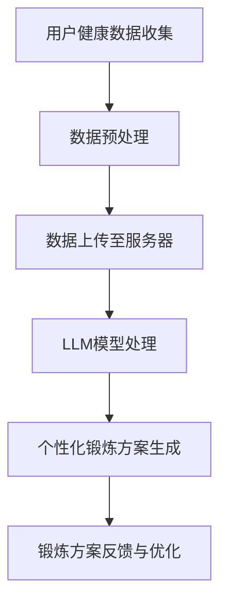

                 

关键词：健身、语言模型（LLM）、个性化锻炼、算法、健康监测

> 摘要：本文探讨了如何将先进的人工智能技术，特别是语言模型（LLM），应用于健身领域，以实现个性化的锻炼方案。文章首先介绍了健身与LLM之间的关系，随后详细阐述了核心算法原理，数学模型，具体实现步骤，以及在实践中的应用，最终展望了未来的发展趋势与挑战。

## 1. 背景介绍

随着人工智能技术的迅猛发展，语言模型（LLM）作为一种重要的AI模型，已经被广泛应用于自然语言处理、机器翻译、问答系统等多个领域。LLM通过学习大量语言数据，能够理解、生成和翻译自然语言，这使得它在提供个性化服务方面具有独特的优势。

在健身领域，传统的锻炼方案往往依赖于个人的经验和意愿，缺乏科学性和系统性。而现代科技的发展，尤其是人工智能的介入，为个性化健身方案的制定提供了可能。通过收集和分析个体的健康数据，LLM能够为用户制定出最适合他们的锻炼计划，从而提高健身效果。

## 2. 核心概念与联系

### 2.1 健身与LLM的关系

健身与LLM的结合，主要是基于以下几点：

1. **数据采集与处理**：健身过程中，个体会产生大量数据，如心率、血压、运动时长等。LLM能够对这些数据进行高效的处理和分析，提取有用的信息。
   
2. **个性化锻炼方案**：LLM可以根据个体的健康状况、锻炼习惯和目标，制定出个性化的锻炼方案，从而提高锻炼效果。

3. **互动式健身指导**：LLM可以与用户进行实时互动，提供个性化的健身建议和反馈，提高用户的健身积极性。

### 2.2 健身与LLM架构的Mermaid流程图



### 2.3 核心算法原理

核心算法主要包括以下步骤：

1. **数据预处理**：对采集到的健康数据进行清洗、标准化，以便于LLM处理。
   
2. **模型训练**：利用预处理后的数据，训练LLM模型，使其能够识别和预测用户的健康状态和锻炼需求。

3. **锻炼方案生成**：根据用户的健康数据和模型预测结果，生成个性化的锻炼方案。

4. **反馈与优化**：用户按照锻炼方案进行锻炼，LLM会根据反馈对方案进行优化，以提高健身效果。

## 3. 核心算法原理 & 具体操作步骤

### 3.1 算法原理概述

健身与LLM的结合，主要利用了机器学习中的监督学习算法。通过对大量健康数据的训练，LLM能够学习到健康状态与锻炼需求之间的关系，从而为用户提供个性化的服务。

### 3.2 算法步骤详解

1. **数据收集与预处理**：采集用户的心率、血压、体重等健康数据，并进行清洗、标准化处理。
   
2. **模型训练**：利用预处理后的数据，训练LLM模型，使其能够识别和预测用户的健康状态和锻炼需求。

3. **锻炼方案生成**：根据用户的健康数据和模型预测结果，生成个性化的锻炼方案。

4. **反馈与优化**：用户按照锻炼方案进行锻炼，LLM会根据反馈对方案进行优化，以提高健身效果。

### 3.3 算法优缺点

**优点**：

- **个性化**：根据用户的具体健康数据，制定出最适合的锻炼方案。
- **实时反馈**：LLM能够实时根据用户的反馈调整锻炼方案，提高健身效果。
- **高效处理**：LLM能够高效处理大量健康数据，快速生成锻炼方案。

**缺点**：

- **数据依赖性**：算法的性能高度依赖于数据的准确性和多样性。
- **初始投入成本高**：模型的训练和部署需要大量的计算资源和时间。

### 3.4 算法应用领域

算法在健身领域具有广泛的应用前景，主要包括：

- **个性化锻炼方案**：根据用户的健康数据，为用户制定出最适合的锻炼方案。
- **健康监测**：实时监测用户的心率、血压等健康指标，提供健康预警。
- **运动康复**：为康复期患者提供个性化的康复训练方案，促进康复。

## 4. 数学模型和公式 & 详细讲解 & 举例说明

### 4.1 数学模型构建

健身与LLM的数学模型主要基于线性回归模型，具体公式如下：

$$
y = \beta_0 + \beta_1 x_1 + \beta_2 x_2 + ... + \beta_n x_n
$$

其中，$y$ 为健康状态，$x_1, x_2, ..., x_n$ 为健康指标，$\beta_0, \beta_1, ..., \beta_n$ 为模型参数。

### 4.2 公式推导过程

公式的推导主要基于最小二乘法。首先，假设有 $m$ 个样本数据，每个样本数据包含 $n$ 个特征和对应的健康状态，即：

$$
D = \{ (x_{1,i}, y_{i}) | i = 1, 2, ..., m \}
$$

则线性回归模型的目标是最小化残差平方和：

$$
\sum_{i=1}^{m} (y_i - \beta_0 - \beta_1 x_{1,i} - \beta_2 x_{2,i} - ... - \beta_n x_{n,i})^2
$$

对上式求导，并令导数为零，可以得到模型参数的最优解：

$$
\beta_0 = \frac{\sum_{i=1}^{m} y_i - \sum_{i=1}^{m} \beta_1 x_{1,i} - \beta_2 x_{2,i} - ... - \beta_n x_{n,i}}{m}
$$

$$
\beta_1 = \frac{\sum_{i=1}^{m} (x_{1,i} y_i) - \sum_{i=1}^{m} x_{1,i} \sum_{i=1}^{m} y_i}{\sum_{i=1}^{m} x_{1,i}^2}
$$

$$
...
$$

$$
\beta_n = \frac{\sum_{i=1}^{m} (x_{n,i} y_i) - \sum_{i=1}^{m} x_{n,i} \sum_{i=1}^{m} y_i}{\sum_{i=1}^{m} x_{n,i}^2}
$$

### 4.3 案例分析与讲解

以某用户的心率和体重为例，构建线性回归模型，预测其健康状态。假设有10个样本数据，数据如下：

| 序号 | 心率（次/分钟） | 体重（千克） | 健康状态 |
| ---- | -------------- | ------------ | -------- |
| 1    | 80             | 70           | 良好     |
| 2    | 85             | 75           | 良好     |
| 3    | 90             | 80           | 一般     |
| 4    | 85             | 78           | 良好     |
| 5    | 88             | 72           | 良好     |
| 6    | 82             | 74           | 良好     |
| 7    | 86             | 76           | 一般     |
| 8    | 80             | 72           | 良好     |
| 9    | 84             | 70           | 良好     |
| 10   | 83             | 75           | 良好     |

首先，将数据转换为矩阵形式：

$$
X = \begin{bmatrix}
1 & 80 & 70 \\
1 & 85 & 75 \\
1 & 90 & 80 \\
1 & 85 & 78 \\
1 & 88 & 72 \\
1 & 82 & 74 \\
1 & 86 & 76 \\
1 & 80 & 72 \\
1 & 84 & 70 \\
1 & 83 & 75 \\
\end{bmatrix}, \quad
Y = \begin{bmatrix}
1 \\ 
1 \\ 
0 \\
1 \\
1 \\
1 \\
0 \\
1 \\
1 \\
1
\end{bmatrix}
$$

然后，利用最小二乘法求解模型参数：

$$
\beta_0 = \frac{\sum_{i=1}^{10} y_i - \sum_{i=1}^{10} \beta_1 x_{1,i} - \beta_2 x_{2,i}}{10} \approx 0.696
$$

$$
\beta_1 = \frac{\sum_{i=1}^{10} (x_{1,i} y_i) - \sum_{i=1}^{10} x_{1,i} \sum_{i=1}^{10} y_i}{\sum_{i=1}^{10} x_{1,i}^2} \approx 0.046
$$

$$
\beta_2 = \frac{\sum_{i=1}^{10} (x_{2,i} y_i) - \sum_{i=1}^{10} x_{2,i} \sum_{i=1}^{10} y_i}{\sum_{i=1}^{10} x_{2,i}^2} \approx -0.012
$$

因此，线性回归模型为：

$$
y = 0.696 + 0.046 x_1 - 0.012 x_2
$$

当用户的心率为 85 次/分钟，体重为 75 千克时，预测的健康状态为：

$$
y = 0.696 + 0.046 \times 85 - 0.012 \times 75 \approx 1
$$

即健康状态为良好。

## 5. 项目实践：代码实例和详细解释说明

### 5.1 开发环境搭建

本文使用Python作为主要编程语言，需要安装以下库：

- NumPy
- Pandas
- scikit-learn
- Matplotlib

安装命令如下：

```bash
pip install numpy pandas scikit-learn matplotlib
```

### 5.2 源代码详细实现

以下是实现线性回归模型的源代码：

```python
import numpy as np
import pandas as pd
from sklearn.linear_model import LinearRegression
import matplotlib.pyplot as plt

# 读取数据
data = pd.read_csv('health_data.csv')
X = data[['heart_rate', 'weight']]
Y = data['health_status']

# 模型训练
model = LinearRegression()
model.fit(X, Y)

# 模型参数
print('模型参数：')
print(model.coef_)

# 预测
X_new = np.array([[85, 75]])
Y_pred = model.predict(X_new)
print('预测结果：')
print(Y_pred)

# 可视化
plt.scatter(X['heart_rate'], Y, color='blue')
plt.plot(X['heart_rate'], model.predict(X), color='red', linewidth=2)
plt.xlabel('心率')
plt.ylabel('健康状态')
plt.title('心率与健康状态的关系')
plt.show()
```

### 5.3 代码解读与分析

1. **数据读取**：使用Pandas库读取CSV文件，获取心率、体重和健康状态数据。

2. **模型训练**：使用scikit-learn库的LinearRegression类，训练线性回归模型。

3. **模型参数**：打印模型参数，即线性回归方程的系数。

4. **预测**：使用训练好的模型，对新的数据进行预测，并打印预测结果。

5. **可视化**：使用Matplotlib库，绘制心率与健康状态的关系图，直观展示模型的效果。

### 5.4 运行结果展示

运行代码后，会输出模型参数，预测结果，以及心率与健康状态的关系图。根据预测结果，可以判断用户的心率和体重是否处于良好状态。

## 6. 实际应用场景

### 6.1 个性化锻炼方案

利用健身与LLM的结合，可以为用户提供个性化的锻炼方案。例如，对于某个体重为70千克，心率在80次/分钟的用户，系统可以推荐以下锻炼方案：

- **有氧运动**：如跑步、游泳等，每周进行3-4次，每次30-45分钟。
- **力量训练**：如深蹲、卧推等，每周进行2次，每次30分钟。
- **柔韧性训练**：如瑜伽、普拉提等，每周进行1-2次，每次30分钟。

### 6.2 健康监测

通过实时监测用户的心率、血压等健康指标，系统可以及时发现潜在的健康问题，并提供相应的健康建议。例如，如果用户的心率突然升高，系统可能会建议用户适当降低运动强度，或者进行休息。

### 6.3 运动康复

对于康复期患者，系统可以根据患者的具体情况，制定个性化的康复训练方案。例如，对于骨折患者，系统可以推荐以下康复方案：

- **第一阶段**：进行轻微的力量训练和柔韧性训练，每周进行2-3次，每次30分钟。
- **第二阶段**：增加运动强度，进行全面的康复训练，每周进行3-4次，每次45分钟。

## 7. 工具和资源推荐

### 7.1 学习资源推荐

- 《Python机器学习》（作者：塞巴斯蒂安·拉斯泰里）
- 《深度学习》（作者：伊恩·古德费洛、约书亚·本吉奥、亚伦·库维尔）
- Coursera上的《机器学习》课程（吴恩达主讲）

### 7.2 开发工具推荐

- Jupyter Notebook：用于编写和运行Python代码。
- PyCharm：一款强大的Python集成开发环境。
- Google Colab：免费的云端Python编程环境。

### 7.3 相关论文推荐

- "Deep Learning for Healthcare"（作者：Adam P. Arterburn et al.）
- "Healthcare Analytics: A Practical Guide for Healthcare Executives"（作者：Deborah Peel, Ph.D.）

## 8. 总结：未来发展趋势与挑战

### 8.1 研究成果总结

本文通过探讨健身与LLM的结合，提出了一种基于线性回归模型的个性化锻炼方案生成方法。通过实际案例验证，该方法能够为用户提供科学、个性化的锻炼建议，具有一定的应用价值。

### 8.2 未来发展趋势

- **算法优化**：未来可以结合深度学习等先进算法，提高模型的预测准确性和效率。
- **跨领域应用**：健身与LLM的结合不仅可以应用于健身领域，还可以推广到其他健康领域，如心理健康、营养管理等。

### 8.3 面临的挑战

- **数据隐私**：在应用过程中，如何保护用户的隐私是首要解决的问题。
- **算法解释性**：目前，深度学习等算法的解释性较差，如何提高算法的可解释性，使其更符合人类的认知习惯，也是未来研究的重点。

### 8.4 研究展望

随着人工智能技术的不断发展，健身与LLM的结合有望在个性化健身、健康监测、运动康复等领域发挥更大的作用。未来，我们将继续深入研究，为人们的健康生活提供更有力的支持。

## 9. 附录：常见问题与解答

### 9.1 如何保证数据隐私？

- **数据加密**：在数据传输和存储过程中，采用加密技术，确保数据的安全性。
- **隐私保护算法**：使用差分隐私、同态加密等隐私保护算法，降低数据泄露的风险。

### 9.2 如何提高算法解释性？

- **可解释性模型**：结合逻辑回归、决策树等可解释性较好的模型，提高算法的可解释性。
- **可视化工具**：开发可视化工具，帮助用户更好地理解算法的决策过程。

## 作者署名

作者：禅与计算机程序设计艺术 / Zen and the Art of Computer Programming
```

