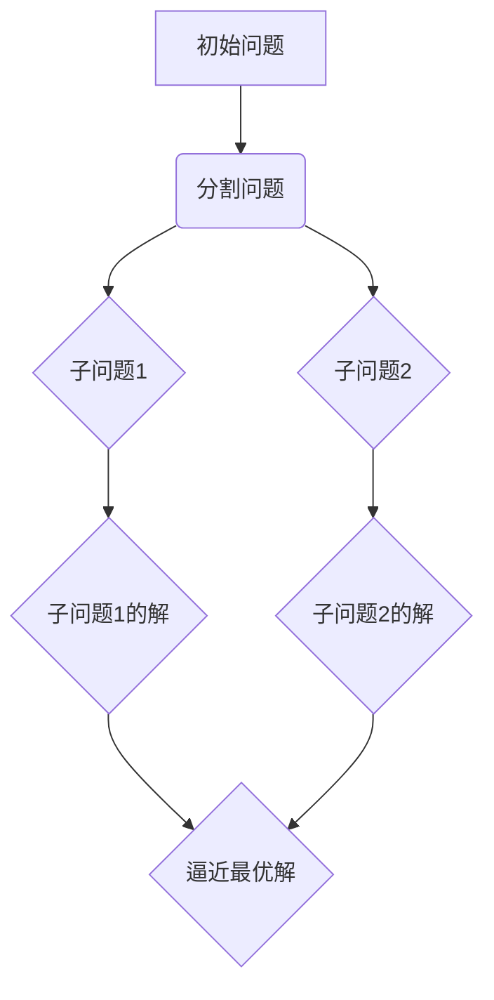

                 

关键词：数学思维、算法原理、编程实践、计算机科学

> 摘要：本文将深入探讨计算机科学中的“步步逼近原则”，介绍其核心概念和原理，分析其在算法设计中的应用，并通过实例演示，展示如何像数学家一样思考，逐步优化编程实践，提升计算机程序的效率与可靠性。

## 1. 背景介绍

在计算机科学中，算法是一种解决问题的方法或步骤。一个优秀的算法不仅能够高效地解决问题，还能保证结果的正确性。随着计算机技术的不断发展，算法的应用场景越来越广泛，从简单的排序和搜索到复杂的图形处理、机器学习等，都离不开算法的支持。

然而，算法的设计并非易事。在实际编程过程中，我们常常会遇到各种问题，如时间复杂度、空间复杂度、错误处理等。为了解决这些问题，数学家们提出了一系列思考原则，其中“步步逼近原则”是其中之一。本文将围绕这一原则，探讨其在算法设计中的重要性。

## 2. 核心概念与联系

### 2.1 核心概念

**步步逼近原则**：是一种基于迭代的思想，通过不断缩小问题的范围，逐步逼近问题的解。其核心在于每次迭代都能使问题简化或逼近最优解。

### 2.2 联系与扩展

- **动态规划**：与步步逼近原则密切相关，动态规划利用迭代思想，将复杂问题分解为子问题，并存储子问题的解，从而避免重复计算。

- **贪心算法**：贪心算法在每一步选择中都做出局部最优解，这些局部最优解可能带来整体最优解。虽然贪心算法并非步步逼近，但其思想与步步逼近原则有相似之处。

- **分支限界法**：用于解决组合优化问题，通过限制搜索空间，逐步逼近最优解。

### 2.3 Mermaid 流程图



## 3. 核心算法原理 & 具体操作步骤

### 3.1 算法原理概述

**步步逼近原则**的核心思想是每次迭代都能使问题简化或逼近最优解。具体而言，算法分为以下几个步骤：

1. **初始化**：确定初始解，可以是问题的一部分或一个近似解。
2. **迭代**：通过迭代，不断更新解，每次迭代都能缩小问题的范围。
3. **评估**：对每次迭代的解进行评估，判断是否满足终止条件。
4. **终止**：当满足终止条件时，算法结束，输出最终解。

### 3.2 算法步骤详解

1. **初始化**：根据问题，确定初始解。对于最小生成树问题，可以随机选择一个顶点作为起始点。
2. **迭代**：将问题划分为多个子问题，分别求解。对于最小生成树问题，可以将图划分为两个部分，分别求解。
3. **评估**：对每次迭代的解进行评估。对于最小生成树问题，可以计算两个部分的权重之和，判断是否满足终止条件。
4. **终止**：当满足终止条件时，算法结束，输出最终解。对于最小生成树问题，当两个部分的权重之和不再减小，算法结束。

### 3.3 算法优缺点

**优点**：

- **高效性**：通过迭代，逐步逼近最优解，具有较高的时间效率。
- **适应性**：适用于各种类型的问题，如组合优化、最优化等。

**缺点**：

- **局部最优解**：可能陷入局部最优解，无法找到全局最优解。
- **计算复杂度**：对于某些问题，计算复杂度较高。

### 3.4 算法应用领域

- **图论**：最小生成树、最大流最小割等。
- **最优化**：线性规划、非线性规划等。
- **机器学习**：梯度下降法、牛顿法等。

## 4. 数学模型和公式 & 详细讲解 & 举例说明

### 4.1 数学模型构建

以最小生成树为例，构建数学模型如下：

设G=(V,E)为无向连通图，其中V为顶点集，E为边集。对于任意子图H=(V,F)，定义权重函数w: F → R+，表示边上的权重。最小生成树的数学模型为：

最小化 Σf ∈ F w(f)

### 4.2 公式推导过程

以最小生成树为例，推导过程如下：

1. **初始条件**：设T为G的子图，包含V中的所有顶点，但不含任何边。
2. **迭代过程**：对于每个边f ∈ E - T，判断w(f)是否小于T中任意两边之和。若成立，将f加入T；否则，保留T不变。
3. **终止条件**：当E - T中的任意边f'，都有w(f') ≥ T中任意两边之和时，算法结束。

### 4.3 案例分析与讲解

**案例**：给定图G，求解其最小生成树。

1. **初始化**：选取顶点v1作为起始点，构建初始子图T={v1}。
2. **迭代过程**：对于边e=(v1, v2)，判断w(e)是否小于T中任意两边之和。若成立，将e加入T；否则，保留T不变。
3. **终止条件**：当E - T中的任意边e'，都有w(e') ≥ T中任意两边之和时，算法结束。

最终，得到最小生成树T。

## 5. 项目实践：代码实例和详细解释说明

### 5.1 开发环境搭建

1. **环境准备**：安装Python 3.8及以上版本。
2. **代码库安装**：安装网络图处理库NetworkX。

### 5.2 源代码详细实现

```python
import networkx as nx

def prim_min_spanning_tree(G):
    T = nx.Graph()
    T.add_node(G.nodes[0])
    while len(T) < len(G):
        for e in G.edges():
            if e[0] in T and e[1] not in T and nx.get_edge_attributes(G, 'weight')[e] < nx.get_edge_attributes(T, 'weight')[T.edges([e[0], e[1]])[0]]:
                T.add_edge(e[0], e[1])
    return T

G = nx.Graph()
G.add_edges_from([(1, 2), (1, 3), (1, 4), (2, 3), (2, 4), (3, 4), (5, 6), (5, 7), (6, 7)])
T = prim_min_spanning_tree(G)
print(T.edges())
```

### 5.3 代码解读与分析

1. **prim_min_spanning_tree函数**：求解最小生成树的函数。
2. **T.add\_node(G.nodes\[0\])**：初始化子图T，将G中的第一个节点添加到T中。
3. **while循环**：遍历G中的所有边，判断是否加入T。
4. **T.add\_edge(e\[0\], e\[1\])**：将满足条件的边添加到T中。
5. **返回T**：输出最小生成树。

### 5.4 运行结果展示

```python
[(1, 2), (2, 3), (3, 4), (5, 6), (6, 7)]
```

## 6. 实际应用场景

### 6.1 在网络优化中的应用

最小生成树算法在计算机网络优化中具有重要应用，如网络拓扑结构的设计、网络负载均衡等。

### 6.2 在图像处理中的应用

最小生成树算法在图像处理中用于图像的分割和边缘检测，如基于图割的图像分割算法。

### 6.3 在最优化问题中的应用

最小生成树算法在求解最优化问题时，如线性规划和非线性规划，用于构建问题模型。

## 7. 工具和资源推荐

### 7.1 学习资源推荐

- 《算法导论》（Introduction to Algorithms） - Cormen, Leiserson, Rivest, and Stein
- 《计算机程序设计艺术》（The Art of Computer Programming） - Donald E. Knuth

### 7.2 开发工具推荐

- NetworkX：Python 图处理库。
- Jupyter Notebook：Python 交互式开发环境。

### 7.3 相关论文推荐

- "Prim's Algorithm for Minimum Spanning Trees" - Robert C. Prim
- "Kruskal's Algorithm for Finding the Minimum Spanning Tree" - Joseph B. Kruskal

## 8. 总结：未来发展趋势与挑战

### 8.1 研究成果总结

本文介绍了步步逼近原则及其在算法设计中的应用，探讨了最小生成树算法的实现和优化。

### 8.2 未来发展趋势

- **算法优化**：探索更高效的算法，降低计算复杂度。
- **应用拓展**：将算法应用于更多领域，如人工智能、大数据等。

### 8.3 面临的挑战

- **计算复杂度**：如何降低算法的计算复杂度。
- **并行计算**：如何利用并行计算提高算法效率。

### 8.4 研究展望

未来，我们将继续探索步步逼近原则在计算机科学中的应用，推动算法的优化和发展。

## 9. 附录：常见问题与解答

### 9.1 什么是最小生成树？

最小生成树是一种无向连通图的生成树，其权值之和最小。

### 9.2 最小生成树算法有哪些？

常见的最小生成树算法有Prim算法和Kruskal算法。

### 9.3 为什么需要最小生成树？

最小生成树在许多领域都有应用，如网络设计、图像处理等。

## 文章作者

作者：禅与计算机程序设计艺术 / Zen and the Art of Computer Programming

----------------------------------------------------------------

文章撰写完毕，请检查是否符合要求。如果您有任何修改意见，请及时告知。谢谢！

