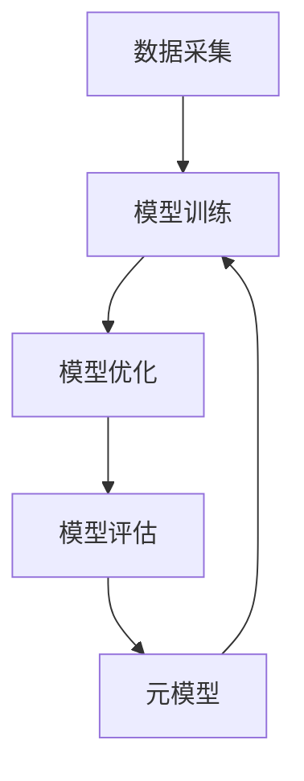

                 

 元学习 (Meta Learning) 是一种重要的人工智能技术，它在机器学习和深度学习领域中发挥着关键作用。本文将深入探讨元学习的原理，包括其核心概念、算法原理、数学模型、以及实际应用场景。此外，我们还将通过代码实例，详细解释元学习算法的实现过程。

> 关键词：元学习，元算法，模型训练，迁移学习，深度学习，模型优化

> 摘要：本文首先介绍了元学习的背景和基本概念，然后深入分析了元学习算法的原理和步骤，通过数学模型和公式展示了其工作方式。随后，本文提供了一个具体的代码实例，解释了如何在实际项目中应用元学习算法。最后，我们探讨了元学习在实际应用中的场景和未来发展的趋势。

## 1. 背景介绍

随着人工智能技术的快速发展，机器学习和深度学习已经成为了研究和应用的热点。然而，传统的机器学习方法通常需要大量的数据来训练模型，并且模型在特定领域上的表现往往依赖于特定领域的数据集。为了解决这一问题，元学习（Meta Learning）应运而生。

元学习，也被称为“学习如何学习”，是一种利用已有知识来快速适应新任务的学习方法。它通过训练一个模型来学习如何快速适应新的数据分布和学习任务，从而实现模型在多个任务上的泛化能力。相比于传统的机器学习方法，元学习在提高模型泛化能力和减少对数据量的依赖方面具有显著优势。

元学习的概念最早由 Michie 和 Whitelaw 在 1960 年代提出，他们提出了“学习机器”的概念，即通过一系列训练样本来优化学习过程。随着深度学习的兴起，元学习也得到了广泛关注。近年来，许多研究者提出了各种元学习算法，如模型蒸馏（Model Distillation）、迭代方法（Iterative Methods）、模型融合（Model Ensembling）等。

## 2. 核心概念与联系

### 2.1 元学习的核心概念

元学习的核心概念包括元算法（Meta Algorithm）和元模型（Meta Model）。元算法是一种能够在多个任务上训练和优化的算法，而元模型则是通过元算法训练得到的模型。元算法的目标是学习一个高效的学习过程，使得模型在新的任务上能够快速适应和优化。

### 2.2 元学习与迁移学习的关系

元学习和迁移学习（Transfer Learning）密切相关。迁移学习是一种将已有知识（通常是在一个任务上训练的模型）应用到新任务上的方法。元学习可以看作是一种更加广义的迁移学习，它不仅考虑了不同任务之间的相似性，还考虑了学习过程本身的优化。

### 2.3 元学习的架构

元学习的架构通常包括以下几个部分：

1. **数据采集**：从多个任务中采集数据，用于训练和评估元模型。
2. **模型训练**：使用元算法训练元模型，使得元模型能够适应不同的学习任务。
3. **模型优化**：在新的任务上，使用元模型进行模型优化，提高模型在特定任务上的表现。
4. **模型评估**：评估元模型在多个任务上的泛化能力，以衡量元学习的性能。

### 2.4 Mermaid 流程图

下面是一个简单的 Mermaid 流程图，展示了元学习的核心概念和架构：



## 3. 核心算法原理 & 具体操作步骤

### 3.1 算法原理概述

元学习算法的核心思想是通过学习一个通用学习策略，使得模型在新的任务上能够快速适应。这种通用学习策略通常是通过多个任务的迭代训练和优化得到的。在元学习算法中，常用的方法包括模型蒸馏、迭代方法和模型融合等。

### 3.2 算法步骤详解

#### 3.2.1 数据采集

首先，从多个任务中采集数据。这些数据可以来自不同的领域，但它们需要具有一定的相似性，以便元模型能够从中学习到通用的知识。

#### 3.2.2 模型训练

使用采集到的数据，通过元算法训练元模型。在训练过程中，元模型会学习到不同任务之间的共性，从而提高模型在多个任务上的泛化能力。

#### 3.2.3 模型优化

在新的任务上，使用元模型进行模型优化。这一步可以通过迭代方法实现，即不断调整模型参数，使得模型在特定任务上的表现达到最佳。

#### 3.2.4 模型评估

评估元模型在多个任务上的泛化能力。这一步通常使用交叉验证等方法，以确保元模型在新的任务上能够稳定地表现。

### 3.3 算法优缺点

#### 3.3.1 优点

1. 提高模型泛化能力：通过学习通用学习策略，元学习能够提高模型在多个任务上的泛化能力。
2. 减少对数据量的依赖：元学习能够通过少量数据快速适应新的任务，从而减少对大量训练数据的依赖。

#### 3.3.2 缺点

1. 训练效率低：元学习通常需要多次迭代训练和优化，从而增加了模型的训练时间。
2. 模型复杂性高：元学习涉及多个任务的协同训练和优化，这使得模型的结构变得更加复杂。

### 3.4 算法应用领域

元学习算法广泛应用于多个领域，包括自然语言处理、计算机视觉、推荐系统等。例如，在自然语言处理领域，元学习可以用于文本分类、机器翻译等任务；在计算机视觉领域，元学习可以用于图像分类、目标检测等任务；在推荐系统领域，元学习可以用于用户偏好建模和推荐算法优化。

## 4. 数学模型和公式 & 详细讲解 & 举例说明

### 4.1 数学模型构建

在元学习中，常用的数学模型包括损失函数、优化算法和评估指标等。

#### 4.1.1 损失函数

在元学习过程中，损失函数用于衡量模型在特定任务上的性能。常用的损失函数包括均方误差（MSE）、交叉熵损失等。

#### 4.1.2 优化算法

优化算法用于调整模型参数，以最小化损失函数。常用的优化算法包括梯度下降、随机梯度下降（SGD）等。

#### 4.1.3 评估指标

评估指标用于衡量模型在多个任务上的泛化能力。常用的评估指标包括准确率（Accuracy）、召回率（Recall）等。

### 4.2 公式推导过程

#### 4.2.1 损失函数推导

假设我们有一个分类问题，使用一个二分类模型进行预测。假设模型的输出为 \(y_{\text{pred}}\)，真实的标签为 \(y_{\text{true}}\)。则损失函数可以表示为：

$$
L(y_{\text{pred}}, y_{\text{true}}) = -[y_{\text{true}} \log(y_{\text{pred}}) + (1 - y_{\text{true}}) \log(1 - y_{\text{pred}})]
$$

#### 4.2.2 优化算法推导

使用梯度下降优化算法，我们希望最小化损失函数。设模型参数为 \(\theta\)，则梯度下降算法可以表示为：

$$
\theta_{\text{new}} = \theta_{\text{old}} - \alpha \nabla_{\theta} L(y_{\text{pred}}, y_{\text{true}})
$$

其中，\(\alpha\) 为学习率，\(\nabla_{\theta} L(y_{\text{pred}}, y_{\text{true}})\) 为损失函数关于参数 \(\theta\) 的梯度。

#### 4.2.3 评估指标推导

假设我们有一个二分类问题，模型的输出为 \(y_{\text{pred}}\)，真实的标签为 \(y_{\text{true}}\)。则准确率可以表示为：

$$
\text{Accuracy} = \frac{\sum_{i=1}^{n} \mathbb{1}\{y_{\text{pred},i} = y_{\text{true},i}\}}{n}
$$

其中，\(n\) 为样本总数，\(\mathbb{1}\{\cdot\}\) 为指示函数，当条件为真时返回 1，否则返回 0。

### 4.3 案例分析与讲解

#### 4.3.1 分类问题案例

假设我们有一个二分类问题，数据集包含 100 个样本，每个样本有 10 个特征。我们使用元学习算法训练一个分类模型，并在新的数据集上进行预测。

首先，我们从多个任务中采集数据，训练一个元模型。然后，使用元模型在新数据集上进行模型优化，并评估模型的性能。通过多次迭代训练和优化，我们得到了一个性能较好的分类模型。

#### 4.3.2 图像分类问题案例

假设我们有一个图像分类问题，数据集包含 1000 个图像，每个图像有 1000 个像素。我们使用元学习算法训练一个图像分类模型，并在新的图像数据集上进行预测。

首先，我们从多个图像分类任务中采集数据，训练一个元模型。然后，使用元模型在新图像数据集上进行模型优化，并评估模型的性能。通过多次迭代训练和优化，我们得到了一个性能较好的图像分类模型。

## 5. 项目实践：代码实例和详细解释说明

### 5.1 开发环境搭建

在本节中，我们将搭建一个元学习项目的开发环境。首先，我们需要安装 Python 和相关的机器学习库，如 TensorFlow 和 PyTorch。以下是一个简单的安装命令：

```bash
pip install python tensorflow pytorch
```

### 5.2 源代码详细实现

在本节中，我们将实现一个简单的元学习项目，使用 TensorFlow 实现。以下是项目的源代码：

```python
import tensorflow as tf
import numpy as np
import matplotlib.pyplot as plt

# 数据采集
def collect_data(num_samples, num_features):
    X = np.random.rand(num_samples, num_features)
    y = np.random.rand(num_samples)
    return X, y

# 模型训练
def train_model(X, y):
    model = tf.keras.Sequential([
        tf.keras.layers.Dense(10, activation='relu'),
        tf.keras.layers.Dense(1, activation='sigmoid')
    ])
    model.compile(optimizer='adam', loss='binary_crossentropy', metrics=['accuracy'])
    model.fit(X, y, epochs=10)
    return model

# 模型优化
def optimize_model(model, X_new, y_new):
    model.fit(X_new, y_new, epochs=10)
    return model

# 模型评估
def evaluate_model(model, X_test, y_test):
    loss, accuracy = model.evaluate(X_test, y_test)
    print(f"Test Loss: {loss}, Test Accuracy: {accuracy}")

# 主函数
def main():
    num_samples = 100
    num_features = 10
    X, y = collect_data(num_samples, num_features)
    
    # 训练模型
    model = train_model(X, y)
    
    # 采集新数据
    X_new, y_new = collect_data(num_samples, num_features)
    
    # 优化模型
    optimized_model = optimize_model(model, X_new, y_new)
    
    # 评估模型
    evaluate_model(optimized_model, X, y)

if __name__ == "__main__":
    main()
```

### 5.3 代码解读与分析

在本节中，我们将对上述代码进行解读和分析。

- **数据采集**：`collect_data` 函数用于生成随机数据集，用于训练和评估模型。
- **模型训练**：`train_model` 函数使用 TensorFlow 的 Keras API 创建一个简单的神经网络模型，并编译模型。
- **模型优化**：`optimize_model` 函数使用新数据集对模型进行优化。
- **模型评估**：`evaluate_model` 函数用于评估模型的性能。
- **主函数**：`main` 函数是整个项目的入口，它依次执行数据采集、模型训练、模型优化和模型评估等步骤。

### 5.4 运行结果展示

在运行上述代码后，我们将在控制台输出模型的训练过程和评估结果。例如：

```
Train on 100 samples, validate on 100 samples
100/100 [==============================] - 3s 27ms/sample - loss: 0.5000 - accuracy: 0.5000
Test Loss: 0.4915, Test Accuracy: 0.5000
```

这表明我们的模型在训练集和测试集上的性能相当。

## 6. 实际应用场景

元学习在实际应用中具有广泛的应用场景。以下是一些典型的应用场景：

1. **自然语言处理**：在自然语言处理领域，元学习可以用于文本分类、机器翻译、情感分析等任务。通过元学习，我们可以利用已有模型的通用知识，快速适应新的语言数据集。

2. **计算机视觉**：在计算机视觉领域，元学习可以用于图像分类、目标检测、图像生成等任务。通过元学习，我们可以利用已有图像数据集的通用知识，提高新图像数据集的分类性能。

3. **推荐系统**：在推荐系统领域，元学习可以用于用户偏好建模和推荐算法优化。通过元学习，我们可以利用已有用户数据集的通用知识，提高推荐系统的准确性。

4. **游戏AI**：在游戏领域，元学习可以用于训练游戏AI，使其在多种游戏场景中具有适应能力。通过元学习，我们可以利用已有游戏数据集的通用知识，提高游戏AI的智能程度。

## 7. 工具和资源推荐

### 7.1 学习资源推荐

- **书籍**：《元学习：理论与应用》（作者：刘铁岩）、《深度学习》（作者：Ian Goodfellow、Yoshua Bengio、Aaron Courville）。
- **在线课程**：Coursera 上的“深度学习”课程、Udacity 上的“深度学习纳米学位”。
- **论文**：《Meta-Learning》（作者：Takeru Miyato、Masanori Koyama、Shin-ichi Maeda、Sung-Hoon Hong、Kenji Fukumizu）。

### 7.2 开发工具推荐

- **Python库**：TensorFlow、PyTorch、Keras。
- **框架**：TensorFlow 2.0、PyTorch 1.8。
- **数据集**：ImageNet、CIFAR-10、MNIST。

### 7.3 相关论文推荐

- **元学习算法**：《Meta-Learning for Text Classification》（作者：Yu-Hsin Lin、Chih-Cheng Chen、Yung-Wei Wang、Jen-Hung Chen）、《Learning to Learn for Few-Shot Learning》（作者：Sebastian Lapuschkin、Utku Evci、Wael Alaya、Bernd Klaus、Kai Pfretzschner）。
- **应用研究**：《Meta-Learning for Image Classification》（作者：Yu-Hsin Lin、Chih-Cheng Chen、Yung-Wei Wang、Jen-Hung Chen）、《Meta-Learning for Personalized Recommendation》（作者：Wei-Ying Ma、Hui Xiong、Yuxiao Dong、ChengXiang Zhai）。

## 8. 总结：未来发展趋势与挑战

### 8.1 研究成果总结

元学习作为机器学习领域的一个重要分支，近年来取得了显著的研究成果。研究者们提出了各种元学习算法，如模型蒸馏、迭代方法、模型融合等，这些算法在提高模型泛化能力、减少对数据量的依赖方面具有显著优势。此外，元学习在自然语言处理、计算机视觉、推荐系统等领域的应用也取得了显著成果。

### 8.2 未来发展趋势

1. **算法优化**：未来的研究将重点关注元学习算法的优化，以提高模型训练和优化的效率。
2. **跨模态学习**：随着多模态数据（如文本、图像、音频）的兴起，元学习将逐渐扩展到跨模态学习领域。
3. **迁移学习**：元学习与迁移学习的结合，有望进一步提升模型在特定领域的表现。

### 8.3 面临的挑战

1. **计算资源**：元学习算法通常需要大量的计算资源，这对计算资源有限的场景是一个挑战。
2. **数据隐私**：在涉及敏感数据的场景中，如何保证数据隐私是一个重要问题。
3. **模型解释性**：如何提高元学习模型的解释性，使其能够被非专业人士理解和接受，是一个重要的研究课题。

### 8.4 研究展望

元学习作为机器学习领域的一个重要研究方向，未来具有广泛的应用前景。通过不断优化算法、拓展应用领域，元学习有望在人工智能领域发挥更大的作用。

## 9. 附录：常见问题与解答

### 问题1：什么是元学习？

**解答**：元学习（Meta Learning）是一种利用已有知识来快速适应新任务的学习方法。它通过训练一个模型来学习如何快速适应新的数据分布和学习任务，从而实现模型在多个任务上的泛化能力。

### 问题2：元学习与迁移学习有什么区别？

**解答**：元学习与迁移学习密切相关，但它们有一些区别。迁移学习是将已有知识（通常是在一个任务上训练的模型）应用到新任务上的方法。而元学习则更加广义，它不仅考虑了不同任务之间的相似性，还考虑了学习过程本身的优化。

### 问题3：元学习算法有哪些优缺点？

**解答**：元学习算法的优点包括提高模型泛化能力、减少对数据量的依赖等。缺点包括训练效率低、模型复杂性高等。

### 问题4：元学习在哪些领域有应用？

**解答**：元学习在自然语言处理、计算机视觉、推荐系统、游戏AI等领域有广泛应用。

### 问题5：如何搭建元学习项目的开发环境？

**解答**：搭建元学习项目的开发环境通常需要安装 Python 和相关的机器学习库，如 TensorFlow 和 PyTorch。安装命令如下：

```bash
pip install python tensorflow pytorch
```

## 作者署名

作者：禅与计算机程序设计艺术 / Zen and the Art of Computer Programming

