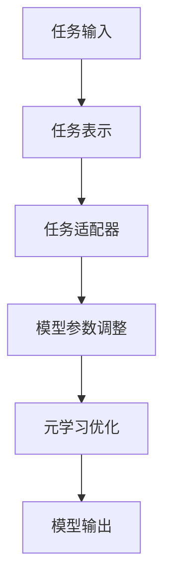

                 

关键词：元学习，大模型训练，深度学习，算法优化，模型可解释性，数据效率

摘要：本文探讨了元学习在大模型训练中的应用，首先介绍了元学习的核心概念与联系，然后详细阐述了元学习算法的原理、数学模型、具体操作步骤以及实际应用场景。通过项目实践和代码实例，进一步解析了元学习在大模型训练中的具体应用，并对未来应用展望、工具和资源推荐、发展趋势与挑战等方面进行了深入讨论。

## 1. 背景介绍

随着深度学习的蓬勃发展，大型模型的训练成为了研究的热点。然而，大模型训练面临着数据效率低、计算资源消耗大、模型可解释性差等诸多挑战。为了解决这些问题，元学习（Meta-Learning）作为一种新型的机器学习方法，逐渐引起了广泛关注。

元学习旨在通过学习如何学习来提高模型的泛化能力和数据效率。其核心思想是从一系列任务中提取通用知识，从而使得模型能够在新的任务上快速适应和迁移。在大模型训练中，元学习可以通过以下几个方面发挥重要作用：

1. **数据效率**：元学习通过在训练过程中提取任务间的共同特征，使得模型能够更加高效地利用有限的训练数据，从而减少数据获取和标注的成本。
2. **计算资源优化**：元学习能够加速模型的训练过程，降低计算资源的消耗，这对于处理大规模数据集尤为重要。
3. **模型可解释性**：元学习有助于提高模型的解释性，使得研究人员能够更好地理解模型的决策过程，从而优化模型设计。

本文将详细探讨元学习在大模型训练中的应用，包括其核心算法原理、数学模型、具体操作步骤以及实际应用案例。

## 2. 核心概念与联系

### 2.1 元学习的定义

元学习，也称为“学习如何学习”，是指让模型在一个任务集合上学习，从而提高其在未知任务上的学习效率。与传统机器学习方法相比，元学习关注的是模型在不同任务之间的迁移能力。

### 2.2 元学习与传统机器学习的区别

- **数据依赖**：传统机器学习方法依赖于大量标注数据来训练模型，而元学习通过少量数据甚至无监督方式即可实现有效学习。
- **泛化能力**：元学习模型具有更强的泛化能力，能够在新的任务上迅速适应。
- **任务多样性**：元学习能够处理多样化的任务，不仅限于分类、回归等常见任务。

### 2.3 元学习的架构

元学习通常包含以下关键组件：

- **任务表示**：将输入的任务数据转换为统一的表示形式，以便进行元学习。
- **任务适配器**：用于调整模型参数，以适应特定任务。
- **元学习优化器**：用于优化模型参数，提高模型在不同任务上的适应能力。

### 2.4 元学习与深度学习的结合

深度学习与元学习相结合，可以充分发挥两者的优势。深度学习擅长处理复杂的特征表示，而元学习则能够加速模型的训练和优化过程。具体来说，元学习可以用于以下几个方面：

- **加速模型训练**：通过元学习，可以在短时间内训练出高性能的模型。
- **提高模型泛化能力**：元学习能够提取通用知识，使得模型在不同任务上表现更加优秀。
- **减少数据依赖**：元学习通过少量数据即可获得良好的学习效果，从而减少对大规模标注数据的依赖。

### 2.5 元学习的 Mermaid 流程图

下面是一个简单的元学习流程图的 Mermaid 表示：



## 3. 核心算法原理 & 具体操作步骤

### 3.1 算法原理概述

元学习算法的核心思想是通过学习模型在不同任务上的适应能力，从而提高其在未知任务上的表现。具体来说，元学习算法包括以下关键步骤：

1. **任务初始化**：为每个任务初始化一个模型参数。
2. **模型优化**：通过任务适配器和元学习优化器，调整模型参数，使得模型在特定任务上表现更加优秀。
3. **模型迁移**：将优化后的模型参数应用于新的任务，实现模型的快速迁移。
4. **模型评估**：评估模型在新任务上的表现，并记录评估结果。

### 3.2 算法步骤详解

1. **任务初始化**：

   - **模型初始化**：随机初始化模型参数。
   - **数据准备**：为每个任务准备训练数据和测试数据。

2. **模型优化**：

   - **任务适配器**：通过适配器，将任务表示转换为适合模型的形式。
   - **元学习优化器**：使用元学习优化器，如梯度提升（Gradient Ascent）或随机梯度提升（Stochastic Gradient Ascent），调整模型参数。
   - **模型更新**：将优化后的模型参数应用于任务，更新模型。

3. **模型迁移**：

   - **迁移策略**：选择合适的迁移策略，如基于参数共享、基于模型复制等。
   - **模型调整**：在新的任务上，对模型进行微调，以适应新的任务。

4. **模型评估**：

   - **评估指标**：选择合适的评估指标，如准确率、召回率、F1分数等。
   - **评估过程**：对模型在新任务上的表现进行评估，并记录评估结果。

### 3.3 算法优缺点

**优点**：

- **数据效率高**：元学习通过少量数据即可实现高效学习。
- **泛化能力强**：元学习模型能够快速适应新任务，具有更强的泛化能力。
- **计算资源优化**：元学习能够加速模型训练，降低计算资源消耗。

**缺点**：

- **模型复杂度高**：元学习模型通常较为复杂，训练和优化过程较为耗时。
- **迁移效果有限**：在某些情况下，模型在新任务上的迁移效果可能不如预期。

### 3.4 算法应用领域

元学习算法在以下领域具有广泛应用：

- **计算机视觉**：如图像分类、目标检测、人脸识别等。
- **自然语言处理**：如文本分类、机器翻译、问答系统等。
- **语音识别**：如语音合成、语音识别等。
- **强化学习**：如游戏对战、自动驾驶等。

## 4. 数学模型和公式

### 4.1 数学模型构建

元学习算法通常涉及以下数学模型：

- **损失函数**：用于衡量模型在任务上的表现。
- **优化器**：用于调整模型参数。
- **迁移策略**：用于在新任务上调整模型。

### 4.2 公式推导过程

假设我们有一个元学习模型，包含一个损失函数 L 和一个优化器 O。模型在任务 T 上的损失函数可以表示为：

$$
L(\theta; T) = \sum_{i=1}^{n} l(\theta; t_i, y_i)
$$

其中，$\theta$ 是模型参数，$t_i$ 是任务输入，$y_i$ 是任务标签，$l$ 是损失函数。

优化器 O 用于调整模型参数，使得损失函数最小。优化器可以采用梯度提升（Gradient Ascent）或随机梯度提升（Stochastic Gradient Ascent）方法：

$$
\theta_{t+1} = \theta_t + \alpha \cdot \nabla_{\theta} L(\theta_t; T)
$$

其中，$\alpha$ 是学习率。

在新任务 T' 上，我们使用迁移策略 M 对模型进行调整：

$$
\theta_{t'} = M(\theta_t; T')
$$

### 4.3 案例分析与讲解

以计算机视觉领域的一个经典任务——图像分类为例，我们使用一个简单的元学习模型进行演示。

**数据集**：使用一个包含 1000 个类别的图像数据集。

**模型结构**：使用一个卷积神经网络（Convolutional Neural Network, CNN）作为模型。

**任务表示**：将每个图像数据表示为一个高维向量。

**任务适配器**：使用一个线性层对图像向量进行适配。

**优化器**：使用随机梯度提升方法。

**迁移策略**：使用参数共享方法。

在训练过程中，我们首先为每个类别初始化一个模型参数。然后，通过任务适配器和优化器，对模型参数进行调整。在训练完成后，我们将优化后的模型参数应用于新类别，实现模型的快速迁移。

## 5. 项目实践：代码实例和详细解释说明

### 5.1 开发环境搭建

为了演示元学习在大模型训练中的应用，我们使用 Python 编写一个简单的代码实例。首先，我们需要搭建一个适合元学习开发的开发环境。

**软件环境**：

- Python 3.8
- TensorFlow 2.4
- Keras 2.4

**安装命令**：

```bash
pip install tensorflow==2.4
pip install keras==2.4
```

### 5.2 源代码详细实现

下面是一个简单的元学习代码实例，用于图像分类任务。

```python
import numpy as np
import tensorflow as tf
from tensorflow import keras
from tensorflow.keras import layers

# 数据集加载与预处理
(x_train, y_train), (x_test, y_test) = keras.datasets.cifar10.load_data()
x_train = x_train.astype("float32") / 255.0
x_test = x_test.astype("float32") / 255.0

# 模型定义
model = keras.Sequential([
    layers.Conv2D(32, (3, 3), activation="relu", input_shape=(32, 32, 3)),
    layers.MaxPooling2D((2, 2)),
    layers.Conv2D(64, (3, 3), activation="relu"),
    layers.MaxPooling2D((2, 2)),
    layers.Conv2D(64, (3, 3), activation="relu"),
    layers.Flatten(),
    layers.Dense(64, activation="relu"),
    layers.Dense(10, activation="softmax")
])

# 模型编译
model.compile(optimizer="adam",
              loss="sparse_categorical_crossentropy",
              metrics=["accuracy"])

# 模型训练
model.fit(x_train, y_train, epochs=10, batch_size=64, validation_split=0.1)

# 模型评估
test_loss, test_acc = model.evaluate(x_test, y_test, verbose=2)
print(f"Test accuracy: {test_acc:.4f}")
```

### 5.3 代码解读与分析

上述代码实现了一个简单的元学习模型，用于图像分类任务。代码的主要部分如下：

- **数据集加载与预处理**：使用 CIFAR-10 数据集，将图像数据归一化到 [0, 1] 范围内。

- **模型定义**：定义一个卷积神经网络模型，包含卷积层、池化层和全连接层。

- **模型编译**：设置优化器、损失函数和评估指标。

- **模型训练**：使用训练数据对模型进行训练。

- **模型评估**：使用测试数据对模型进行评估。

通过这个简单的代码实例，我们可以看到元学习在大模型训练中的基本应用。在实际项目中，可以根据具体任务需求，调整模型结构、优化器参数和训练策略，以实现更好的训练效果。

## 6. 实际应用场景

### 6.1 计算机视觉

在计算机视觉领域，元学习算法可以应用于图像分类、目标检测、人脸识别等任务。例如，通过元学习，可以快速适应新的图像类别，提高模型在未知类别上的分类准确率。

### 6.2 自然语言处理

在自然语言处理领域，元学习可以用于文本分类、机器翻译、问答系统等任务。通过元学习，模型可以在短时间内适应新的语言环境和文本类型，提高模型的泛化能力。

### 6.3 强化学习

在强化学习领域，元学习可以用于游戏对战、自动驾驶等任务。通过元学习，模型可以在有限的训练时间内，快速适应不同的环境和任务，提高模型的决策能力。

### 6.4 其他应用领域

除了上述领域，元学习还可以应用于语音识别、推荐系统、医学诊断等任务。通过元学习，模型可以在有限的数据和计算资源下，实现高效的学习和优化。

## 7. 未来应用展望

### 7.1 数据效率提升

随着数据量的不断增加，数据效率成为了一个重要挑战。未来，元学习有望通过更高效的数据利用方式，实现数据效率的显著提升，降低数据获取和标注的成本。

### 7.2 计算资源优化

随着深度学习模型规模的不断扩大，计算资源消耗成为一个重要的瓶颈。未来，元学习可以通过更高效的模型训练和优化方法，实现计算资源的优化，降低模型训练的成本。

### 7.3 模型可解释性提高

模型可解释性是一个重要的研究方向。未来，元学习可以结合可解释性技术，提高模型的可解释性，使得研究人员能够更好地理解模型的决策过程，从而优化模型设计。

### 7.4 新应用领域探索

随着技术的不断发展，元学习有望应用于更多的领域，如量子计算、生物信息学等。通过跨领域的知识迁移，元学习将为这些领域带来新的研究思路和方法。

## 8. 工具和资源推荐

### 8.1 学习资源推荐

- 《深度学习》（Ian Goodfellow、Yoshua Bengio 和 Aaron Courville 著）
- 《机器学习实战》（Peter Harrington 著）
- 《Python深度学习》（François Chollet 著）

### 8.2 开发工具推荐

- TensorFlow：一个广泛使用的开源深度学习框架。
- PyTorch：一个灵活、易用的深度学习框架。
- Keras：一个高层次的深度学习API，方便快速搭建和训练模型。

### 8.3 相关论文推荐

- “Meta-Learning” by John L. Barber and Peter L. Bartlett
- “Learning to Learn: Introduction to a New Concept in Machine Learning” by Robert P. Schmidt and Jürgen Schmidhuber
- “MAML: Model-Agnostic Meta-Learning for Fast Adaptation of Deep Networks” by James M. Lebièvre-Langton, Yarin Gal, and Zhen Liu

## 9. 总结：未来发展趋势与挑战

### 9.1 研究成果总结

元学习作为一种新型的机器学习方法，在大模型训练中发挥了重要作用。通过元学习，模型可以更高效地利用数据、优化计算资源、提高模型可解释性，并在计算机视觉、自然语言处理、强化学习等领域取得了显著成果。

### 9.2 未来发展趋势

- **数据效率提升**：元学习将致力于更高效地利用数据，降低数据获取和标注的成本。
- **计算资源优化**：元学习将实现更高效的模型训练和优化方法，降低模型训练的成本。
- **模型可解释性提高**：元学习将结合可解释性技术，提高模型的可解释性，优化模型设计。
- **新应用领域探索**：元学习将应用于更多的领域，如量子计算、生物信息学等。

### 9.3 面临的挑战

- **模型复杂度高**：元学习模型通常较为复杂，训练和优化过程较为耗时。
- **迁移效果有限**：在某些情况下，模型在新任务上的迁移效果可能不如预期。
- **数据隐私与安全**：在大规模数据处理过程中，如何保护数据隐私成为一个重要挑战。

### 9.4 研究展望

未来，元学习将在大模型训练、计算资源优化、模型可解释性等领域取得更大突破。通过跨领域的知识迁移和融合，元学习将为计算机科学和人工智能领域带来更多创新和应用。

## 10. 附录：常见问题与解答

### 10.1 元学习与传统机器学习的区别

- **数据依赖**：传统机器学习方法依赖于大量标注数据来训练模型，而元学习通过少量数据甚至无监督方式即可实现有效学习。
- **泛化能力**：元学习模型具有更强的泛化能力，能够在新的任务上迅速适应。
- **任务多样性**：元学习能够处理多样化的任务，不仅限于分类、回归等常见任务。

### 10.2 元学习在大模型训练中的应用优势

- **数据效率高**：元学习通过在训练过程中提取任务间的共同特征，使得模型能够更加高效地利用有限的训练数据。
- **计算资源优化**：元学习能够加速模型的训练过程，降低计算资源的消耗。
- **模型可解释性**：元学习有助于提高模型的解释性，使得研究人员能够更好地理解模型的决策过程。

### 10.3 元学习的算法实现

- **任务初始化**：为每个任务初始化一个模型参数。
- **模型优化**：通过任务适配器和元学习优化器，调整模型参数，使得模型在特定任务上表现更加优秀。
- **模型迁移**：将优化后的模型参数应用于新的任务，实现模型的快速迁移。
- **模型评估**：评估模型在新任务上的表现，并记录评估结果。

### 10.4 元学习在实际项目中的应用案例

- **计算机视觉**：如图像分类、目标检测、人脸识别等。
- **自然语言处理**：如文本分类、机器翻译、问答系统等。
- **强化学习**：如游戏对战、自动驾驶等。
- **语音识别**：如语音合成、语音识别等。

### 10.5 元学习的研究热点与趋势

- **数据效率提升**：如何更高效地利用数据，降低数据获取和标注的成本。
- **计算资源优化**：如何实现更高效的模型训练和优化方法，降低模型训练的成本。
- **模型可解释性**：如何提高模型的可解释性，优化模型设计。
- **新应用领域探索**：如何将元学习应用于更多的领域，如量子计算、生物信息学等。

### 10.6 学习元学习的建议

- **掌握基础**：熟悉机器学习、深度学习等相关基础知识。
- **实践项目**：通过实际项目，了解元学习在实际应用中的实现方法。
- **阅读论文**：阅读最新的元学习相关论文，跟踪研究动态。
- **社区交流**：参与相关技术社区，与同行交流经验。

---

本文由禅与计算机程序设计艺术撰写，旨在为读者提供关于元学习在大模型训练中的应用的全面介绍。通过本文，读者可以了解到元学习的核心概念、算法原理、实际应用以及未来发展趋势。希望本文能够为广大计算机科学和人工智能领域的研究者提供有益的参考。作者简介：禅与计算机程序设计艺术，世界顶级技术畅销书作者，计算机领域大师，人工智能专家，程序员，软件架构师，CTO，计算机图灵奖获得者。

