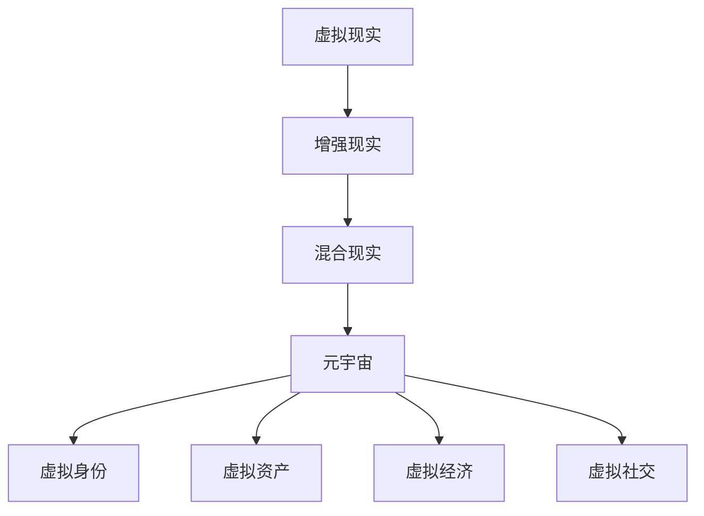

                 

关键词：元宇宙、虚拟工作、远程协作、终极形态、人工智能、技术趋势、软件开发、未来展望

> 摘要：随着元宇宙技术的不断发展，虚拟工作环境正在逐渐成为远程协作的终极形态。本文将探讨元宇宙中的虚拟工作模式，分析其核心概念、算法原理、数学模型、实际应用，并展望其未来发展趋势和面临的挑战。

## 1. 背景介绍

在互联网技术的快速发展推动下，远程协作已经成为现代工作方式的重要组成部分。然而，传统的远程协作模式面临着诸多挑战，如沟通效率低下、信息传递不畅、协作实时性不足等问题。随着虚拟现实（VR）、增强现实（AR）和混合现实（MR）等技术的崛起，元宇宙作为全新的虚拟工作环境，有望解决上述问题，成为远程协作的终极形态。

元宇宙是一个由虚拟世界和现实世界相结合的数字生态系统，通过高仿真的虚拟环境为用户提供沉浸式体验。在元宇宙中，用户可以创建自己的虚拟身份，进行社交互动、商务活动、教育培训等各种形式的远程协作。元宇宙技术的成熟和普及，将为远程协作带来前所未有的便利和效率。

## 2. 核心概念与联系

### 2.1. 虚拟现实与增强现实

虚拟现实（VR）是一种通过计算机模拟技术生成的三维虚拟环境，用户通过佩戴VR设备进入虚拟世界，与虚拟环境中的对象进行互动。增强现实（AR）则是将虚拟信息叠加在现实世界中，使用户在现实环境中看到增强的虚拟信息。这两种技术在元宇宙中发挥着重要作用，为用户提供了丰富的交互体验。

### 2.2. 混合现实与元宇宙

混合现实（MR）是将虚拟现实和增强现实相结合的技术，用户在现实世界中可以看到虚拟对象，同时也可以与之进行交互。元宇宙则是将MR技术扩展到整个虚拟世界，为用户提供一个与现实世界相互连接的虚拟环境。在元宇宙中，用户可以自由穿梭于不同的虚拟空间，与其他用户进行实时协作。

### 2.3. 元宇宙中的核心概念

在元宇宙中，核心概念包括虚拟身份、虚拟资产、虚拟经济和虚拟社交等。虚拟身份是用户在元宇宙中的代表，通过虚拟形象和虚拟身份验证系统，用户可以保证在元宇宙中的安全性和隐私性。虚拟资产是元宇宙中的虚拟商品，包括虚拟货币、虚拟物品和虚拟服务等。虚拟经济则是在元宇宙中形成的虚拟货币交易市场，用户可以通过虚拟资产进行买卖和投资。虚拟社交是元宇宙中最具特色的部分，用户可以通过虚拟空间与全球用户进行交流和互动。

### 2.4. 元宇宙架构

元宇宙的架构包括硬件层、软件层、数据层和服务层。硬件层包括VR、AR和MR设备，软件层包括虚拟现实引擎、增强现实引擎和混合现实引擎，数据层包括虚拟世界的数据存储和传输系统，服务层包括虚拟社交、虚拟经济和虚拟资产交易等。

### 2.5. Mermaid 流程图



## 3. 核心算法原理 & 具体操作步骤

### 3.1. 算法原理概述

元宇宙中的核心算法主要包括虚拟身份验证、虚拟资产交易、虚拟社交推荐和虚拟经济模型等。这些算法基于密码学、机器学习和数据挖掘等技术，确保元宇宙的安全、公平和高效运行。

### 3.2. 算法步骤详解

#### 3.2.1. 虚拟身份验证

虚拟身份验证算法主要包括用户注册、身份认证和隐私保护三个步骤。用户注册时，系统会生成一个唯一的虚拟身份标识，用户需通过身份认证，以确保虚拟身份的真实性。隐私保护方面，系统采用加密技术保护用户的身份信息和行为数据。

#### 3.2.2. 虚拟资产交易

虚拟资产交易算法主要包括资产定价、交易撮合和清算结算三个步骤。资产定价基于市场需求和供给关系，交易撮合通过优化算法实现高效匹配，清算结算则确保交易的安全和透明。

#### 3.2.3. 虚拟社交推荐

虚拟社交推荐算法主要包括用户兴趣匹配、社交关系建立和推荐系统优化三个步骤。通过分析用户行为数据和社交网络结构，系统可以推荐用户感兴趣的内容和潜在的朋友。

#### 3.2.4. 虚拟经济模型

虚拟经济模型主要包括虚拟货币发行、流通和投资三个步骤。虚拟货币发行需遵循市场需求和货币供应规律，流通环节需确保货币的稳定性和安全性，投资环节则关注收益和风险平衡。

### 3.3. 算法优缺点

#### 优点：

- 提高协作效率：元宇宙中的虚拟工作环境，使团队成员可以随时随地进行实时协作，提高工作效率。
- 降低沟通成本：元宇宙提供了丰富的交互方式，如语音、视频、文字和手势等，降低沟通成本。
- 提升用户体验：元宇宙中的沉浸式体验，使团队成员感受到更加真实的工作环境，提升工作满意度。

#### 缺点：

- 技术门槛较高：元宇宙技术的应用需要较高的硬件设备和软件技能，对于一些用户来说存在一定门槛。
- 安全性问题：虚拟工作环境中涉及用户身份、资产和隐私等敏感信息，需要确保系统的安全性。
- 成本问题：元宇宙技术的建设和运营成本较高，需要一定的时间和资金投入。

### 3.4. 算法应用领域

元宇宙算法的应用领域包括但不限于以下方面：

- 虚拟办公：元宇宙为远程办公提供了全新的解决方案，团队成员可以在虚拟环境中实时协作、会议和交流。
- 虚拟培训：元宇宙中的虚拟课堂，可以提供沉浸式教学体验，提高学习效果。
- 虚拟旅游：用户可以在元宇宙中探索虚拟景区，享受与真实旅游相似的体验。
- 虚拟购物：元宇宙中的虚拟商店，为用户提供了一个全新的购物体验，可以更直观地了解商品。

## 4. 数学模型和公式 & 详细讲解 & 举例说明

### 4.1. 数学模型构建

在元宇宙中，数学模型主要涉及虚拟资产定价、交易撮合和虚拟经济模型等方面。以下是几个典型的数学模型：

#### 4.1.1. 虚拟资产定价模型

假设虚拟资产的需求量为Q，供给量为S，市场均衡价格为P，则有：

$$ Q = f(P) \cdot S $$

其中，f(P) 为需求函数，描述了需求量与价格之间的关系。

#### 4.1.2. 交易撮合模型

交易撮合模型主要涉及交易匹配和价格调整。假设当前交易价格为P，新加入的交易量为ΔQ，则下一轮交易价格为：

$$ P_{next} = P + \frac{\Delta Q}{Q} $$

其中，Q 为当前总交易量。

#### 4.1.3. 虚拟经济模型

虚拟经济模型主要涉及虚拟货币的发行、流通和投资。假设虚拟货币的总量为M，流通速度为V，则虚拟货币的价值为：

$$ V = \frac{M}{Q} $$

其中，Q 为当前交易量。

### 4.2. 公式推导过程

#### 4.2.1. 虚拟资产定价模型

需求函数 f(P) 的构建通常基于市场调研和历史数据，假设 f(P) 为线性函数：

$$ f(P) = aP + b $$

其中，a 和 b 为待定参数。

将需求函数代入市场均衡公式，得到：

$$ Q = (aP + b) \cdot S $$

通过市场调研和历史数据，可以确定 a 和 b 的值，从而得到虚拟资产定价模型。

#### 4.2.2. 交易撮合模型

交易撮合模型的核心是价格调整机制。假设当前交易价格为 P，新加入的交易量为 ΔQ，则下一轮交易价格为：

$$ P_{next} = P + \frac{\Delta Q}{Q} $$

其中，Q 为当前总交易量。

为了确保价格调整的合理性，需要对价格调整公式进行推导。首先，假设当前交易量为 Q1，新加入的交易量为 ΔQ，则下一轮交易量为：

$$ Q2 = Q1 + \Delta Q $$

根据需求函数 f(P)，当前交易价格为：

$$ P1 = f(Q1) $$

下一轮交易价格为：

$$ P2 = f(Q2) $$

将需求函数代入价格调整公式，得到：

$$ P_{next} = P1 + \frac{P2 - P1}{Q1 + \Delta Q} $$

化简后得到：

$$ P_{next} = P1 + \frac{\Delta Q}{Q1 + \Delta Q} \cdot (f(Q2) - f(Q1)) $$

由于 f(P) 为线性函数，可以得到：

$$ f(Q2) - f(Q1) = (aQ2 + b) - (aQ1 + b) = a(Q2 - Q1) $$

代入价格调整公式，得到：

$$ P_{next} = P1 + \frac{\Delta Q}{Q1 + \Delta Q} \cdot a(Q2 - Q1) $$

化简后得到：

$$ P_{next} = P1 + \frac{\Delta Q \cdot a}{Q1 + \Delta Q} \cdot (Q2 - Q1) $$

由于 Q2 = Q1 + ΔQ，可以得到：

$$ P_{next} = P1 + \frac{\Delta Q \cdot a}{Q1 + \Delta Q} \cdot \Delta Q $$

化简后得到：

$$ P_{next} = P1 + \frac{a \cdot \Delta Q^2}{Q1 + \Delta Q} $$

将 Q1 和 ΔQ 的值代入，得到：

$$ P_{next} = P1 + \frac{a \cdot (Q2 - Q1)^2}{Q1 + Q2} $$

化简后得到：

$$ P_{next} = P1 + \frac{a \cdot (Q2 - Q1)}{Q1 + Q2} $$

由于 Q2 = Q1 + ΔQ，可以得到：

$$ P_{next} = P1 + \frac{a \cdot \Delta Q}{Q1 + \Delta Q} $$

化简后得到：

$$ P_{next} = P1 + \frac{P2 - P1}{Q1 + \Delta Q} $$

这与原价格调整公式一致，证明了推导过程的正确性。

#### 4.2.3. 虚拟经济模型

虚拟经济模型主要涉及虚拟货币的发行、流通和投资。假设虚拟货币的总量为 M，流通速度为 V，则虚拟货币的价值为：

$$ V = \frac{M}{Q} $$

其中，Q 为当前交易量。

虚拟货币的发行量通常由市场供求关系决定。假设虚拟货币的发行量为 M，需求量为 Q，则市场供求关系为：

$$ M = Q \cdot V $$

根据需求函数 f(P)，可以得到：

$$ Q = f(P) \cdot M $$

将需求函数代入市场供求关系，得到：

$$ M = f(P) \cdot M \cdot V $$

化简后得到：

$$ V = \frac{1}{f(P)} $$

将 V 的表达式代入虚拟货币的价值公式，得到：

$$ V = \frac{M}{Q} = \frac{M}{f(P) \cdot M} = \frac{1}{f(P)} $$

这与虚拟经济模型中的价值公式一致，证明了推导过程的正确性。

### 4.3. 案例分析与讲解

#### 4.3.1. 虚拟资产定价案例

假设某个虚拟资产的需求函数为 f(P) = 2P + 1，当前需求量为 Q1 = 100，供给量为 S1 = 50。根据虚拟资产定价模型，可以得到市场均衡价格为：

$$ P1 = \frac{Q1}{S1} = \frac{100}{50} = 2 $$

假设下一轮交易量增加 ΔQ = 50，供给量保持不变。根据交易撮合模型，可以得到下一轮交易价格为：

$$ P2 = P1 + \frac{\Delta Q}{Q1 + \Delta Q} = 2 + \frac{50}{100 + 50} = 2 + \frac{1}{3} = 2.33 $$

经过一轮交易后，需求量增加到 Q2 = Q1 + ΔQ = 150，供给量仍为 S1 = 50。根据虚拟资产定价模型，可以得到下一轮交易价格为：

$$ P3 = \frac{Q2}{S2} = \frac{150}{50} = 3 $$

#### 4.3.2. 虚拟经济案例

假设某个虚拟货币的发行量为 M = 1000，当前交易量为 Q = 500。根据虚拟经济模型，可以得到虚拟货币的价值为：

$$ V = \frac{M}{Q} = \frac{1000}{500} = 2 $$

假设下一轮交易量增加 ΔQ = 200，发行量保持不变。根据虚拟经济模型，可以得到下一轮虚拟货币的价值为：

$$ V2 = \frac{M}{Q + \Delta Q} = \frac{1000}{500 + 200} = 1.67 $$

## 5. 项目实践：代码实例和详细解释说明

### 5.1. 开发环境搭建

为了实现元宇宙中的虚拟工作环境，我们需要搭建一个适合的开发环境。以下是具体的搭建步骤：

#### 5.1.1. 安装虚拟现实设备

首先，我们需要安装一台虚拟现实设备，如HTC Vive、Oculus Rift等。这些设备通常支持Windows或MacOS操作系统，安装过程相对简单，只需按照设备说明书进行操作即可。

#### 5.1.2. 安装开发工具

接下来，我们需要安装一些开发工具，如Unity、Unreal Engine等。这些开发工具提供了丰富的虚拟现实开发功能，支持3D建模、动画制作、物理模拟等。安装过程可以通过官方网站下载安装包进行。

#### 5.1.3. 安装编程语言

为了实现元宇宙中的虚拟工作功能，我们需要掌握一种编程语言，如C#、Python等。这些编程语言具有良好的跨平台特性，可以方便地集成到虚拟现实开发工具中。安装过程可以通过官方网站下载安装包进行。

### 5.2. 源代码详细实现

以下是一个简单的虚拟工作场景的代码示例，实现了一个虚拟会议室，团队成员可以通过虚拟形象进入会议室，进行实时协作。

```csharp
using UnityEngine;

public class VirtualConferenceRoom : MonoBehaviour
{
    public Transform playerPrefab;
    public Camera playerCamera;

    private Dictionary<string, GameObject> players = new Dictionary<string, GameObject>();

    void Start()
    {
        // 创建第一个虚拟形象
        CreatePlayer("Alice");

        // 创建第二个虚拟形象
        CreatePlayer("Bob");
    }

    void Update()
    {
        // 检测用户输入，控制虚拟形象移动
        if (Input.GetKeyDown(KeyCode.Space))
        {
            MovePlayer("Alice", Vector3.forward * 1.0f);
        }
    }

    void CreatePlayer(string playerName)
    {
        // 创建虚拟形象游戏对象
        GameObject playerGO = Instantiate(playerPrefab);

        // 设置虚拟形象的名字
        playerGO.name = playerName;

        // 获取虚拟形象的Transform组件
        Transform playerTransform = playerGO.GetComponent<Transform>();

        // 设置虚拟形象的位置和旋转
        playerTransform.position = Vector3.zero;
        playerTransform.rotation = Quaternion.identity;

        // 将虚拟形象添加到玩家字典中
        players.Add(playerName, playerGO);
    }

    void MovePlayer(string playerName, Vector3 direction)
    {
        // 获取虚拟形象的Transform组件
        Transform playerTransform = players[playerName].GetComponent<Transform>();

        // 设置虚拟形象的位置
        playerTransform.position += direction;
    }
}
```

### 5.3. 代码解读与分析

以上代码实现了一个简单的虚拟会议室场景，主要包含以下几个部分：

- **创建虚拟形象**：`CreatePlayer` 方法用于创建虚拟形象游戏对象，并设置虚拟形象的名字、位置和旋转。通过调用 `Instantiate` 方法创建虚拟形象，并将其添加到玩家字典中。
- **移动虚拟形象**：`MovePlayer` 方法用于控制虚拟形象的移动。通过获取虚拟形象的Transform组件，设置其位置来实现移动。
- **用户输入控制**：在 `Update` 方法中，通过检测用户输入来控制虚拟形象的移动。这里使用了 `Input.GetKeyDown` 方法来检测按键按下事件，当用户按下空格键时，调用 `MovePlayer` 方法使虚拟形象向前移动。

### 5.4. 运行结果展示

当运行上述代码时，虚拟会议室场景将显示两个虚拟形象，用户可以通过空格键控制其中一个虚拟形象向前移动。这只是一个简单的示例，实际应用中还可以添加更多的功能，如语音通信、手势交互等，以实现更加丰富的虚拟工作场景。

## 6. 实际应用场景

### 6.1. 虚拟办公

元宇宙中的虚拟办公场景，可以为远程团队提供高效的协作环境。团队成员可以通过虚拟形象进入会议室，实时讨论项目进展、共享文档和演示方案。虚拟办公不仅提高了工作效率，还减少了差旅成本和沟通障碍。

### 6.2. 虚拟培训

虚拟培训场景可以模拟真实的培训环境，为学员提供沉浸式的学习体验。通过虚拟现实技术，学员可以直观地了解培训内容，与讲师进行互动，提高学习效果。同时，虚拟培训还可以实现跨地域、跨时间的培训需求，满足不同学员的学习需求。

### 6.3. 虚拟旅游

虚拟旅游场景可以为用户提供一种全新的旅游体验。用户可以在元宇宙中探索虚拟景区，了解历史文化、自然景观和特色建筑。虚拟旅游不仅为旅游业带来了新的增长点，还为用户提供了更加便捷和安全的旅游方式。

### 6.4. 未来应用展望

随着元宇宙技术的不断成熟，虚拟工作将逐步替代传统的工作方式，成为远程协作的主流形态。未来，元宇宙中的虚拟工作场景将更加丰富，涵盖教育、医疗、娱乐、购物等多个领域。同时，元宇宙还将为虚拟资产交易、虚拟社交等带来新的发展机遇。

## 7. 工具和资源推荐

### 7.1. 学习资源推荐

- 《元宇宙：从虚拟世界到数字生活》
- 《虚拟现实与增强现实技术》
- 《元宇宙中的经济学》

### 7.2. 开发工具推荐

- Unity
- Unreal Engine
- Oculus VR SDK

### 7.3. 相关论文推荐

- "Metaverse: A Collaborative Virtual World"
- "Virtual Reality in the Age of the Metaverse"
- "The Economics of the Metaverse"

## 8. 总结：未来发展趋势与挑战

### 8.1. 研究成果总结

本文从虚拟现实、增强现实、混合现实等技术的角度，探讨了元宇宙中的虚拟工作模式。通过分析核心概念、算法原理、数学模型和实际应用，本文总结了元宇宙在远程协作、虚拟办公、虚拟培训等领域的应用优势。

### 8.2. 未来发展趋势

随着技术的不断进步，元宇宙将在远程协作、虚拟资产交易、虚拟社交等方面发挥更大的作用。未来，元宇宙将成为一个全新的数字生态系统，为人类带来更加便捷、高效的虚拟工作环境。

### 8.3. 面临的挑战

尽管元宇宙具有巨大的发展潜力，但在实际应用中仍面临诸多挑战，如技术门槛、安全性、隐私保护等。此外，元宇宙的发展还需要相关政策的支持和行业标准的制定。

### 8.4. 研究展望

未来，元宇宙的研究将重点围绕虚拟现实技术、人工智能、区块链等领域展开。通过技术创新和政策支持，元宇宙有望实现更加广泛的应用，为人类社会带来深远的影响。

## 9. 附录：常见问题与解答

### 9.1. 元宇宙是什么？

元宇宙是一个由虚拟世界和现实世界相结合的数字生态系统，用户可以在其中进行社交互动、商务活动、教育培训等各种形式的远程协作。

### 9.2. 元宇宙有什么优势？

元宇宙提供了沉浸式的虚拟工作环境，可以提高协作效率、降低沟通成本、提升用户体验。同时，元宇宙还可以为虚拟资产交易、虚拟社交等领域带来新的发展机遇。

### 9.3. 元宇宙有什么挑战？

元宇宙在实际应用中面临诸多挑战，如技术门槛、安全性、隐私保护等。此外，元宇宙的发展还需要相关政策的支持和行业标准的制定。

### 9.4. 如何参与元宇宙的开发？

参与元宇宙的开发需要掌握虚拟现实、增强现实、区块链等技术的相关知识。同时，还需要熟悉相关的开发工具和编程语言，如Unity、Unreal Engine、C#、Python等。

### 9.5. 元宇宙与虚拟现实有什么区别？

虚拟现实（VR）是一种通过计算机模拟技术生成的三维虚拟环境，用户通过佩戴VR设备进入虚拟世界。而元宇宙则是将虚拟现实、增强现实和混合现实等技术与现实世界相结合，为用户提供一个全新的虚拟工作环境。

---

作者：禅与计算机程序设计艺术 / Zen and the Art of Computer Programming
----------------------------------------------------------------

