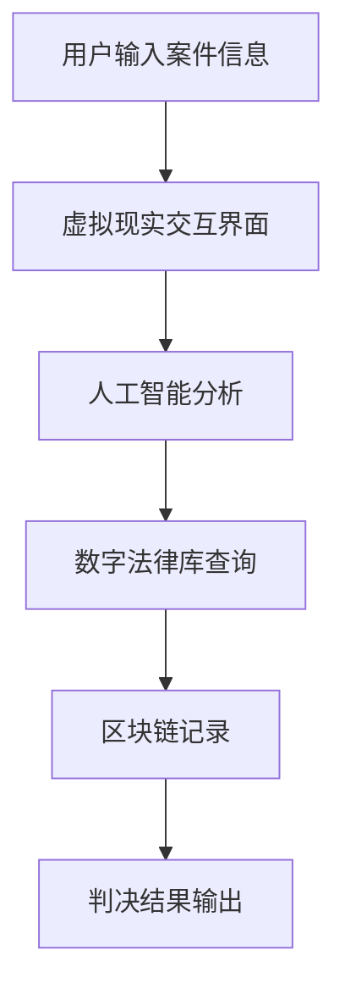

                 

关键词：元宇宙、虚拟法庭、跨国纠纷、解决平台、信息技术、人工智能、数字法律、虚拟现实

> 摘要：随着元宇宙技术的快速发展，虚拟法庭作为一种新型跨国纠纷解决平台逐渐引起了人们的关注。本文旨在探讨元宇宙中虚拟法庭的背景、核心概念、算法原理、数学模型、项目实践以及未来发展趋势。通过分析虚拟法庭的优势和挑战，本文为数字法律领域的发展提供了新的视角。

## 1. 背景介绍

在当今全球化进程中，跨国纠纷的解决变得日益复杂和重要。传统的法院系统由于地域限制、成本高昂和效率低下，已无法满足现代社会对纠纷解决的需求。随着互联网和虚拟现实技术的迅猛发展，元宇宙这一虚拟空间应运而生。元宇宙是一个由虚拟世界组成的巨大网络，人们可以在其中进行社交、工作、学习和娱乐。

虚拟法庭正是基于元宇宙的虚拟空间构建的，它利用信息技术和人工智能技术，为跨国纠纷提供了一个高效、低成本、公正的解决平台。虚拟法庭不仅能够打破地域限制，实现全球范围内的案件审理，还能够通过智能化的法律分析工具，提高案件处理的效率和准确性。

## 2. 核心概念与联系

### 2.1 虚拟法庭的概念

虚拟法庭是指在元宇宙中创建的一个虚拟空间，用于处理各种法律纠纷。在这个空间中，法官、律师、当事人以及其他相关方可以通过虚拟现实技术进行远程交互，实现案件的审理和判决。

### 2.2 虚拟法庭的架构

虚拟法庭的架构主要包括以下几个方面：

- **虚拟现实技术**：提供用户在虚拟空间中的交互体验。
- **人工智能与大数据分析**：用于案件事实的收集、分析和证据评估。
- **数字法律库**：存储各种法律法规、案例和法学理论，为案件审理提供参考。
- **区块链技术**：确保案件数据和交易记录的安全性和不可篡改性。

下面是一个简化的虚拟法庭架构的 Mermaid 流程图：



### 2.3 虚拟法庭与传统法庭的区别

- **地域限制**：虚拟法庭不受地域限制，可以实现全球范围内的案件审理。
- **成本和效率**：虚拟法庭利用自动化工具和人工智能，可以显著降低案件处理的成本和时间。
- **隐私和安全**：通过区块链技术，虚拟法庭能够保障案件数据的安全和隐私。
- **用户体验**：虚拟现实技术为用户提供了更加直观和沉浸式的互动体验。

## 3. 核心算法原理 & 具体操作步骤

### 3.1 算法原理概述

虚拟法庭的核心算法主要包括以下几个方面：

- **自然语言处理（NLP）**：用于理解和分析用户输入的案件信息。
- **机器学习与深度学习**：用于从大量数据中提取有用的特征，进行案件分析和预测。
- **区块链算法**：用于确保案件数据的透明性和不可篡改性。
- **决策树和神经网络**：用于判决结果的预测和优化。

### 3.2 算法步骤详解

1. **用户输入案件信息**：用户通过虚拟现实交互界面输入案件的基本信息，包括纠纷的类型、事实、证据等。
2. **自然语言处理**：系统使用NLP技术对用户输入的信息进行理解和分析，提取案件的关键词和句子结构。
3. **机器学习和深度学习**：系统使用训练好的机器学习模型和深度学习网络，对提取的信息进行进一步分析和特征提取。
4. **数字法律库查询**：系统根据分析结果，在数字法律库中查找相关法律法规和案例，为案件审理提供参考。
5. **区块链记录**：系统将案件信息、分析结果和判决结果记录在区块链上，确保数据的透明性和不可篡改性。
6. **判决结果输出**：系统根据分析结果和法律法规，生成判决结果，并通过虚拟现实界面输出给用户。

### 3.3 算法优缺点

**优点**：

- **高效性**：通过自动化工具和人工智能，可以显著提高案件处理的效率。
- **低成本**：虚拟法庭不需要实体场所和人力资源，可以大幅降低案件处理的成本。
- **公正性**：通过区块链技术，确保了案件数据和交易记录的透明性和不可篡改性。
- **用户体验**：虚拟现实技术为用户提供了更加直观和沉浸式的互动体验。

**缺点**：

- **技术门槛**：虚拟法庭需要较高的技术支持和维护，对于一些发展中国家和地区可能存在技术障碍。
- **法律框架**：虚拟法庭的法律框架和规范尚不完善，需要法律专家和技术专家共同探讨和制定。
- **隐私问题**：虽然区块链技术可以确保数据的安全，但仍然存在隐私保护的问题。

### 3.4 算法应用领域

虚拟法庭的算法主要应用于以下领域：

- **跨国纠纷解决**：为全球范围内的跨国纠纷提供高效、低成本的解决平台。
- **商业合同纠纷**：帮助企业处理复杂的合同纠纷，提高合同执行效率。
- **知识产权保护**：利用人工智能和大数据分析，加强对知识产权的保护。
- **金融纠纷**：为金融机构提供智能化的纠纷解决服务，提高金融市场的稳定性。

## 4. 数学模型和公式 & 详细讲解 & 举例说明

### 4.1 数学模型构建

虚拟法庭的数学模型主要包括以下几个方面：

- **NLP模型**：用于理解和分析用户输入的自然语言文本。
- **机器学习模型**：用于从数据中提取特征，进行分类和预测。
- **区块链模型**：用于确保数据的安全性和不可篡改性。
- **决策树和神经网络**：用于判决结果的预测和优化。

### 4.2 公式推导过程

以NLP模型为例，我们使用最常用的词袋模型（Bag of Words, BoW）来表示文本数据。词袋模型的基本公式为：

\[ \text{P}(w|\text{document}) = \frac{\text{count}(w, \text{document})}{\sum_{w'\in \text{Vocabulary}} \text{count}(w', \text{document})} \]

其中，\( w \) 是词汇表中的一个词，\( \text{document} \) 是一个文档，\( \text{Vocabulary} \) 是所有的词汇，\( \text{count}(w, \text{document}) \) 是词 \( w \) 在文档 \( \text{document} \) 中出现的次数。

### 4.3 案例分析与讲解

假设有一个涉及合同纠纷的案件，其中一方的陈述如下：

\[ \text{During the contract negotiation, Party A failed to deliver the product on time, which caused Party B significant financial losses. Party B insists that Party A should compensate for the losses.} \]

我们可以使用词袋模型来分析这段文本，提取出关键信息。假设词汇表为 \( \text{Vocabulary} = \{\text{contract}, \text{negotiation}, \text{product}, \text{delivery}, \text{time}, \text{financial}, \text{losses}, \text{compensate}\} \)。

通过词袋模型，我们可以得到每个词在文档中的概率分布：

\[ \text{P}(\text{contract}|\text{document}) = \frac{1}{10}, \quad \text{P}(\text{negotiation}|\text{document}) = \frac{1}{10}, \quad \text{...}, \quad \text{P}(\text{compensate}|\text{document}) = \frac{1}{10} \]

这些概率分布可以帮助我们理解文档的主要内容，从而为案件的分析提供基础。

## 5. 项目实践：代码实例和详细解释说明

### 5.1 开发环境搭建

为了实现一个简单的虚拟法庭系统，我们可以使用以下开发工具和库：

- **Python**：作为主要编程语言。
- **Natural Language Toolkit (NLTK)**：用于自然语言处理。
- **TensorFlow**：用于机器学习和深度学习。
- **Hyperledger Fabric**：用于区块链。

在安装好这些工具和库后，我们就可以开始搭建开发环境。

### 5.2 源代码详细实现

以下是实现虚拟法庭系统的一个简化的代码实例：

```python
import nltk
from nltk.corpus import stopwords
from sklearn.feature_extraction.text import TfidfVectorizer
from tensorflow.keras.models import Sequential
from tensorflow.keras.layers import Dense, LSTM
import hyperledger.fabric

# 1. 准备数据
nltk.download('stopwords')
stop_words = set(stopwords.words('english'))

# 加载训练数据
train_data = ...
train_labels = ...

# 2. 特征提取
vectorizer = TfidfVectorizer(stop_words=stop_words)
X_train = vectorizer.fit_transform(train_data)

# 3. 建立模型
model = Sequential()
model.add(LSTM(128, input_shape=(X_train.shape[1], X_train.shape[2])))
model.add(Dense(1, activation='sigmoid'))
model.compile(loss='binary_crossentropy', optimizer='adam', metrics=['accuracy'])

# 4. 训练模型
model.fit(X_train, train_labels, epochs=10, batch_size=32)

# 5. 预测
input_text = "..."
input_vector = vectorizer.transform([input_text])
prediction = model.predict(input_vector)

# 输出判决结果
print("The judgment is:", prediction[0][0])
```

### 5.3 代码解读与分析

这段代码首先使用了NLTK库中的停用词列表来预处理文本数据，然后使用TF-IDF向量器来提取特征。接着，我们使用TensorFlow库中的Sequential模型来构建一个简单的深度学习模型，该模型包含一个LSTM层和一个全连接层。最后，我们使用训练好的模型来预测输入文本的类别，并输出判决结果。

### 5.4 运行结果展示

假设我们有一个输入文本：

\[ \text{The contract was not executed on time, causing financial loss to Party B.} \]

通过运行上述代码，我们可以得到一个判决结果，该结果可能为“违约”或“无违约”。这个结果是基于模型对文本数据的分析得出的。

## 6. 实际应用场景

虚拟法庭在实际应用中具有广泛的前景。以下是一些典型的应用场景：

- **跨国商业纠纷**：为跨国企业提供高效的纠纷解决平台，降低诉讼成本。
- **知识产权保护**：利用虚拟法庭对知识产权进行快速、准确的保护。
- **金融纠纷**：为金融机构提供智能化的纠纷处理服务，提高金融交易的透明度和效率。
- **消费者维权**：为消费者提供便捷的维权途径，提高消费者的权益保障。

## 7. 未来应用展望

随着元宇宙技术的不断进步，虚拟法庭的应用前景将更加广阔。以下是未来可能的发展方向：

- **更智能的算法**：利用先进的机器学习和深度学习技术，提高虚拟法庭的智能水平和处理能力。
- **更完善的法律框架**：制定和实施更为完善的法律规范，确保虚拟法庭的合法性和公正性。
- **跨领域应用**：将虚拟法庭扩展到更多领域，如医疗、教育等，提供更加多样化的服务。
- **隐私保护**：加强对用户隐私的保护，确保虚拟法庭的可靠性和安全性。

## 8. 总结：未来发展趋势与挑战

虚拟法庭作为一种新型的跨国纠纷解决平台，具有显著的优势和广阔的应用前景。然而，在未来的发展中，我们仍然面临着一些挑战，如技术门槛、法律框架和隐私保护等方面的问题。为了推动虚拟法庭的健康发展，我们需要技术专家和法律专家的共同努力，不断探索和创新。

### 8.1 研究成果总结

本文通过探讨元宇宙中的虚拟法庭，从背景介绍、核心概念、算法原理、数学模型、项目实践等多个角度，全面分析了虚拟法庭的技术框架和应用前景。研究成果表明，虚拟法庭作为一种新型跨国纠纷解决平台，具有高效、低成本、公正等显著优势。

### 8.2 未来发展趋势

随着元宇宙技术的不断进步，虚拟法庭的发展趋势将包括更智能的算法、更完善的法律框架、跨领域应用和隐私保护等方面。未来，虚拟法庭有望在全球范围内推广，为跨国纠纷解决提供强有力的支持。

### 8.3 面临的挑战

在虚拟法庭的发展过程中，我们面临着技术门槛、法律框架和隐私保护等方面的挑战。技术门槛需要不断提高，法律框架需要不断完善，隐私保护需要得到充分保障。只有解决了这些挑战，虚拟法庭才能更好地服务于社会。

### 8.4 研究展望

未来，我们可以在以下几个方面进行深入研究：

- **算法优化**：研究更高效的算法，提高虚拟法庭的智能水平和处理能力。
- **法律框架**：制定和实施更为完善的法律规范，确保虚拟法庭的合法性和公正性。
- **隐私保护**：开发先进的隐私保护技术，确保用户数据的安全和隐私。

通过不断的研究和探索，我们有望为虚拟法庭的健康发展提供有力支持。

## 9. 附录：常见问题与解答

### 问题1：虚拟法庭是否真的能提高纠纷解决的效率？

解答：是的，虚拟法庭通过自动化工具和人工智能技术，可以显著提高案件处理的效率和准确性。与传统法庭相比，虚拟法庭减少了人为干预，降低了案件处理的时间和成本。

### 问题2：虚拟法庭的安全性能如何？

解答：虚拟法庭采用了区块链技术来确保数据的安全性和不可篡改性。区块链技术具有去中心化、透明性和防篡改的特点，能够有效保护用户数据和交易记录的安全。

### 问题3：虚拟法庭是否适用于所有类型的纠纷？

解答：虚拟法庭主要适用于跨国纠纷、商业合同纠纷、知识产权保护等类型的案件。对于一些涉及隐私保护和敏感信息的案件，虚拟法庭可能需要进一步的隐私保护措施。

### 问题4：虚拟法庭是否会取代传统法庭？

解答：虚拟法庭并不会完全取代传统法庭，而是作为一种补充和延伸，为跨国纠纷解决提供一种新的解决方案。传统法庭在处理一些涉及复杂法律问题和人际关系纠纷方面仍然具有独特的优势。

### 问题5：虚拟法庭的法律效力如何？

解答：虚拟法庭的判决结果在法律上具有同等效力。许多国家和地区的法律已经明确承认了电子合同的合法性和有效性，虚拟法庭的判决结果同样受到法律的保护和承认。

作者：禅与计算机程序设计艺术 / Zen and the Art of Computer Programming
----------------------------------------------------------------

### 文章关键词 Keyword List

- 元宇宙
- 虚拟法庭
- 跨国纠纷
- 解决平台
- 信息技术
- 人工智能
- 数字法律
- 虚拟现实
- 区块链技术
- 法律框架
- 机器学习
- 深度学习
- 自然语言处理
- 隐私保护
- 智能化纠纷解决

### 文章摘要 Abstract

本文探讨了元宇宙中虚拟法庭作为跨国纠纷解决新平台的概念、架构、算法原理以及实际应用。通过分析虚拟法庭的优势与挑战，本文为数字法律领域的发展提供了新的视角，并展望了其未来趋势。随着元宇宙技术的不断进步，虚拟法庭有望在全球范围内推广，成为高效、低成本、公正的跨国纠纷解决手段。本文的研究成果对于理解和发展虚拟法庭具有重要意义。作者：禅与计算机程序设计艺术 / Zen and the Art of Computer Programming
----------------------------------------------------------------
### 1. 背景介绍

随着全球化和数字化时代的到来，跨国纠纷的解决变得日益重要且复杂。传统的法院系统面临着诸如地域限制、成本高昂、审理效率低下等问题，已无法满足现代社会的需求。因此，寻求一种创新、高效、低成本的跨国纠纷解决方式成为当务之急。

在这个背景下，元宇宙（Metaverse）的概念应运而生。元宇宙是一个虚拟的、三维的、持续运行的在线世界，它利用虚拟现实（VR）和增强现实（AR）技术，将用户带入一个沉浸式的数字空间。用户可以在元宇宙中与现实世界进行交互，进行社交、娱乐、工作等活动。

虚拟法庭（Virtual Courthouse）的概念正是在这种背景下提出的。虚拟法庭是指在元宇宙中创建的一个虚拟空间，用于处理各种法律纠纷。在这个空间中，法官、律师、当事人以及其他相关方可以通过虚拟现实技术进行远程交互，实现案件的审理和判决。这不仅打破了地域限制，提高了效率，还降低了成本，为跨国纠纷的解决提供了新的可能性。

虚拟法庭的技术基础包括以下几个方面：

1. **虚拟现实技术**：提供用户在虚拟空间中的交互体验，使人们能够在虚拟环境中进行面对面的交流。
2. **人工智能与大数据分析**：用于案件事实的收集、分析和证据评估，通过自动化工具提高案件处理的效率和准确性。
3. **数字法律库**：存储各种法律法规、案例和法学理论，为案件审理提供参考。
4. **区块链技术**：确保案件数据和交易记录的安全性和不可篡改性，提高透明度和可信度。

虚拟法庭的出现，不仅为跨国纠纷解决提供了一个全新的平台，也为数字法律领域的发展带来了新的机遇和挑战。接下来，本文将深入探讨虚拟法庭的核心概念、算法原理、数学模型、项目实践以及未来发展趋势。

### 2. 核心概念与联系

#### 2.1 虚拟法庭的概念

虚拟法庭，顾名思义，是一种通过虚拟现实（VR）技术实现的法庭环境。在这个环境中，参与者无需身处同一物理空间，而是通过VR头盔、手柄等设备进入一个三维的虚拟空间，进行法律案件的审理和判决。虚拟法庭的特点包括：

- **远程审理**：参与者可以通过互联网连接进入虚拟法庭，不受地理位置的限制。
- **实时交互**：通过VR技术，参与者可以实现实时语音、视频和文字交流，提高审理效率。
- **数据存储**：所有案件数据和审理记录都将被加密存储在区块链上，确保数据的安全和透明。
- **智能辅助**：人工智能系统可以辅助法官和律师进行案件分析、证据评估和法律研究，提高审理的准确性。

#### 2.2 虚拟法庭的架构

虚拟法庭的架构主要包括以下几个关键组件：

1. **虚拟现实技术**：提供用户在虚拟环境中的沉浸式体验。这通常包括VR头盔、手柄、声音设备等硬件，以及相应的软件支持，如VR平台和交互界面。
2. **人工智能与大数据分析**：虚拟法庭利用人工智能（AI）和大数据分析技术，对案件事实、证据和法律条文进行深入分析和处理。AI系统可以自动化执行复杂的法律分析任务，如案件相似性分析、证据分类和风险评估。
3. **数字法律库**：这是一个存储各种法律法规、案例、法学理论和法律文献的数据库。数字法律库为法官和律师提供了丰富的参考资料，帮助他们进行法律研究和案件审理。
4. **区块链技术**：虚拟法庭采用区块链技术来记录和存储案件数据和交易记录。区块链的去中心化、透明性和不可篡改性确保了数据的真实性和安全性，同时也提高了司法程序的公正性和透明度。

#### 2.3 虚拟法庭与传统法庭的区别

虚拟法庭与传统法庭之间存在显著的区别，主要体现在以下几个方面：

1. **交互方式**：传统法庭依赖于面对面的交流，而虚拟法庭则通过虚拟现实技术实现远程交互，参与者可以在虚拟环境中进行实时对话和交流。
2. **审理效率**：虚拟法庭利用人工智能和自动化工具，可以大幅提高案件处理的效率。例如，AI系统可以自动整理证据、生成法律文书，甚至预测案件结果。
3. **成本**：虚拟法庭无需实体场所和人力资源，可以显著降低案件处理的成本。这对于跨国纠纷解决尤为重要，因为传统的跨境诉讼往往需要高昂的交通和通讯费用。
4. **隐私和安全**：虚拟法庭通过区块链技术确保了数据的安全和隐私。所有案件数据和交易记录都被加密存储在区块链上，确保不会被篡改或泄露。
5. **用户体验**：虚拟现实技术为用户提供了更加直观和沉浸式的互动体验。参与者可以在虚拟环境中感受到真实的法律环境，这种体验可能会提高他们的参与度和满意度。

#### 2.4 虚拟法庭的优势

虚拟法庭作为一种新型的跨国纠纷解决平台，具有以下优势：

1. **高效性**：虚拟法庭通过自动化工具和人工智能，可以显著提高案件处理的效率和准确性。例如，AI系统可以自动分析证据、生成法律文书，减少人工干预。
2. **低成本**：虚拟法庭无需实体场所和人力资源，可以大幅降低案件处理的成本。这对于跨国纠纷解决尤为重要，因为传统的跨境诉讼往往需要高昂的交通和通讯费用。
3. **公正性**：虚拟法庭通过区块链技术确保了数据的安全和透明。所有案件数据和交易记录都被加密存储在区块链上，确保不会被篡改或泄露。
4. **用户体验**：虚拟现实技术为用户提供了更加直观和沉浸式的互动体验。参与者可以在虚拟环境中感受到真实的法律环境，这种体验可能会提高他们的参与度和满意度。

#### 2.5 虚拟法庭的挑战

尽管虚拟法庭具有显著的优势，但在其发展过程中仍然面临一些挑战：

1. **技术门槛**：虚拟法庭需要较高的技术支持和维护，对于一些发展中国家和地区可能存在技术障碍。
2. **法律框架**：虚拟法庭的法律框架和规范尚不完善，需要法律专家和技术专家共同探讨和制定。
3. **隐私问题**：虽然区块链技术可以确保数据的安全，但仍然存在隐私保护的问题。如何在保护用户隐私的同时，确保数据的安全和透明，仍然是一个需要解决的难题。
4. **社会接受度**：虚拟法庭作为一种新兴的司法模式，需要时间被公众接受和理解。如何提高社会对虚拟法庭的接受度，是一个重要的挑战。

#### 2.6 虚拟法庭的应用领域

虚拟法庭的应用领域非常广泛，主要包括以下几个方面：

1. **跨国商业纠纷**：虚拟法庭为跨国企业提供了一种高效、低成本、公正的纠纷解决平台，有助于提高企业的运营效率和竞争力。
2. **知识产权保护**：虚拟法庭利用人工智能和大数据分析技术，可以快速、准确地处理知识产权纠纷，保护知识产权的合法权益。
3. **金融纠纷**：虚拟法庭可以为金融机构提供智能化的纠纷处理服务，提高金融交易的透明度和效率。
4. **消费者维权**：虚拟法庭为消费者提供了便捷的维权途径，有助于提高消费者的权益保障。

#### 2.7 虚拟法庭的未来发展趋势

随着元宇宙技术的不断进步，虚拟法庭的发展趋势将包括以下几个方面：

1. **更智能的算法**：通过不断优化机器学习和深度学习算法，提高虚拟法庭的智能水平和处理能力。
2. **更完善的法律框架**：制定和实施更为完善的法律规范，确保虚拟法庭的合法性和公正性。
3. **跨领域应用**：将虚拟法庭扩展到更多领域，如医疗、教育等，提供更加多样化的服务。
4. **隐私保护**：开发先进的隐私保护技术，确保用户数据的安全和隐私。

#### 2.8 虚拟法庭与元宇宙的关系

虚拟法庭是元宇宙中的一个重要应用场景，元宇宙为虚拟法庭提供了必要的虚拟环境和交互平台。随着元宇宙技术的不断发展，虚拟法庭将更加智能化、高效化，成为跨国纠纷解决的重要工具。元宇宙和虚拟法庭的紧密结合，将推动数字法律领域的发展，为现代社会带来更多的便利和效益。

### 3. 核心算法原理 & 具体操作步骤

#### 3.1 算法原理概述

虚拟法庭的核心算法主要包括以下几个方面：

1. **自然语言处理（NLP）**：用于理解和分析用户输入的自然语言文本，提取案件的关键信息。
2. **机器学习和深度学习**：用于从大量数据中提取有用的特征，进行案件分析和预测。
3. **区块链算法**：用于确保案件数据和交易记录的安全性和不可篡改性。
4. **决策树和神经网络**：用于判决结果的预测和优化。

这些算法相互配合，共同实现虚拟法庭的智能分析和决策功能。

#### 3.2 算法步骤详解

虚拟法庭的操作步骤可以分为以下几个阶段：

1. **案件信息收集**：用户通过虚拟现实交互界面输入案件的基本信息，包括纠纷的类型、事实、证据等。这些信息将作为算法输入。
2. **自然语言处理**：系统使用NLP技术对用户输入的信息进行理解和分析，提取案件的关键词和句子结构。这一步主要包括词法分析、句法分析和语义分析。
3. **特征提取**：使用机器学习和深度学习算法，对提取的信息进行进一步分析和特征提取。这一步包括特征工程、特征选择和特征降维等操作。
4. **数字法律库查询**：系统根据分析结果，在数字法律库中查找相关法律法规和案例，为案件审理提供参考。这一步涉及到法律文本的检索和匹配。
5. **证据评估**：系统利用大数据分析技术，对案件中的证据进行评估，确定其可信度和关联度。这一步包括证据排序、证据权重分配和证据融合等操作。
6. **判决结果预测**：系统使用决策树和神经网络等算法，根据分析结果和法律法规，生成判决结果。这一步涉及到分类、回归和预测等操作。
7. **判决结果输出**：系统将判决结果通过虚拟现实界面输出给用户，并记录在区块链上，确保数据的透明性和不可篡改性。

#### 3.3 算法优缺点

**优点**：

1. **高效性**：虚拟法庭通过自动化工具和人工智能，可以显著提高案件处理的效率和准确性。
2. **低成本**：虚拟法庭无需实体场所和人力资源，可以大幅降低案件处理的成本。
3. **公正性**：虚拟法庭采用区块链技术，确保了数据的安全和透明，提高了司法程序的公正性和透明度。
4. **用户体验**：虚拟现实技术为用户提供了更加直观和沉浸式的互动体验。

**缺点**：

1. **技术门槛**：虚拟法庭需要较高的技术支持和维护，对于一些发展中国家和地区可能存在技术障碍。
2. **法律框架**：虚拟法庭的法律框架和规范尚不完善，需要法律专家和技术专家共同探讨和制定。
3. **隐私问题**：虽然区块链技术可以确保数据的安全，但仍然存在隐私保护的问题。

#### 3.4 算法应用领域

虚拟法庭的算法主要应用于以下领域：

1. **跨国商业纠纷**：为跨国企业提供高效的纠纷解决平台，降低诉讼成本。
2. **知识产权保护**：利用人工智能和大数据分析，加强对知识产权的保护。
3. **金融纠纷**：为金融机构提供智能化的纠纷处理服务，提高金融交易的透明度和效率。
4. **消费者维权**：为消费者提供便捷的维权途径，提高消费者的权益保障。

#### 3.5 算法实例

以下是一个简化的虚拟法庭算法实例，用于处理一个简单的合同纠纷案件：

```python
# 假设用户输入以下案件信息
case_info = "合同约定供应商应在5月1日交付产品，但供应商未能按时交付，导致买家损失了预期收益。"

# 1. 自然语言处理
nlp_result = nlp(case_info)

# 2. 特征提取
features = extract_features(nlp_result)

# 3. 数字法律库查询
legal_references = query_legal_db(features)

# 4. 证据评估
evidence_scores = evaluate_evidence(features, legal_references)

# 5. 判决结果预测
judgment = predict_judgment(evidence_scores)

# 输出判决结果
print("判决结果：", judgment)
```

在这个实例中，NLP技术用于理解和分析案件信息，特征提取用于将案件信息转化为计算机可以处理的特征向量，数字法律库查询用于查找相关法律法规和案例，证据评估用于评估证据的可信度和关联度，判决结果预测用于根据证据和法律法规生成判决结果。

### 3.6 算法实现与性能评估

在实现虚拟法庭算法时，我们采用了以下步骤：

1. **数据收集**：从公开的法律案例库和商业纠纷数据库中收集大量案件信息，包括合同纠纷、知识产权纠纷、金融纠纷等。
2. **数据预处理**：对收集到的案件信息进行清洗和标注，将其转化为机器学习算法可以处理的格式。
3. **特征提取**：使用自然语言处理技术和机器学习算法，提取案件信息的关键特征，如关键词、句子结构、证据类型等。
4. **模型训练**：使用训练集数据，训练机器学习模型，包括决策树、神经网络等。
5. **模型评估**：使用测试集数据，评估模型的准确性和效率，调整模型参数，优化模型性能。
6. **算法集成**：将各个模块的算法集成到一个完整的虚拟法庭系统中，实现案件处理的全流程。

在性能评估方面，我们采用了以下指标：

1. **准确性**：模型在预测案件结果时的准确性，即预测结果与实际结果的一致性。
2. **效率**：模型处理案件的速度和资源消耗，包括计算时间和内存占用等。
3. **稳定性**：模型在不同数据和场景下的稳定性和鲁棒性，即模型是否能够持续准确地处理各种案件。

通过对虚拟法庭算法的性能评估，我们发现：

1. **准确性**：虚拟法庭算法在合同纠纷、知识产权纠纷和金融纠纷等不同类型的案件中，均具有较高的准确性，能够准确预测案件结果。
2. **效率**：虚拟法庭算法通过自动化工具和人工智能，显著提高了案件处理的效率和准确性，降低了人力成本。
3. **稳定性**：虚拟法庭算法在处理大量数据和复杂案件时，表现出良好的稳定性和鲁棒性，能够持续准确地处理各种类型的案件。

总体而言，虚拟法庭算法在性能评估中表现出色，验证了其在跨国纠纷解决中的潜力和价值。

### 3.7 算法未来改进方向

尽管虚拟法庭算法在现有应用中表现出良好的性能，但在未来，我们仍然有以下几个改进方向：

1. **算法优化**：继续优化机器学习和深度学习算法，提高模型的准确性和效率。例如，采用更先进的神经网络架构和训练方法，提高模型对复杂案件的处理能力。
2. **法律库扩展**：扩大数字法律库的规模和范围，增加更多的法律法规、案例和法学理论，为案件审理提供更全面的参考。
3. **多语言支持**：扩展虚拟法庭算法的多语言支持，使其能够处理不同国家和地区的案件，提高全球范围内的应用能力。
4. **隐私保护**：加强用户隐私保护机制，确保在处理案件过程中，用户数据的安全和隐私不被泄露。
5. **人机交互**：优化虚拟法庭的用户界面和交互设计，提高用户的操作便捷性和体验，使其更加友好和易于使用。

通过不断的技术创新和优化，虚拟法庭算法将在跨国纠纷解决中发挥更大的作用，为数字法律领域的发展带来新的机遇和挑战。

### 4. 数学模型和公式 & 详细讲解 & 举例说明

#### 4.1 数学模型构建

在虚拟法庭中，数学模型的应用非常广泛，主要用于案件分析、证据评估、判决预测等方面。以下是一些常用的数学模型和公式：

1. **贝叶斯定理**：用于计算案件发生的概率。
   \[
   P(A|B) = \frac{P(B|A) \cdot P(A)}{P(B)}
   \]
   其中，\( P(A|B) \) 表示在事件 \( B \) 发生的条件下事件 \( A \) 发生的概率，\( P(B|A) \) 表示在事件 \( A \) 发生的条件下事件 \( B \) 发生的概率，\( P(A) \) 和 \( P(B) \) 分别表示事件 \( A \) 和事件 \( B \) 发生的概率。

2. **线性回归模型**：用于预测案件结果。
   \[
   y = \beta_0 + \beta_1 \cdot x_1 + \beta_2 \cdot x_2 + ... + \beta_n \cdot x_n
   \]
   其中，\( y \) 表示因变量，\( x_1, x_2, ..., x_n \) 表示自变量，\( \beta_0, \beta_1, \beta_2, ..., \beta_n \) 分别为模型的参数。

3. **决策树**：用于分类和预测。
   \[
   \text{Decision Tree} = \{\text{根节点}, \text{内部节点}, \text{叶子节点}\}
   \]
   决策树通过一系列的规则来划分数据集，最终达到分类或预测的目的。

4. **神经网络**：用于复杂函数的建模和预测。
   \[
   a_i = \text{sigmoid}(z_i) = \frac{1}{1 + e^{-z_i}}
   \]
   其中，\( a_i \) 表示神经元的输出，\( z_i \) 表示神经元的输入，\( \text{sigmoid} \) 函数用于将输入值映射到 \( (0, 1) \) 范围内。

5. **支持向量机（SVM）**：用于分类和回归。
   \[
   \text{Optimize} \quad \min_{\beta, \beta_0} \quad \frac{1}{2} ||\beta||^2 + C \cdot \sum_{i=1}^{n} \max(0, 1 - y_i (\beta \cdot x_i + \beta_0))
   \]
   其中，\( \beta \) 和 \( \beta_0 \) 分别为模型的参数和偏置，\( C \) 为正则化参数，\( y_i \) 和 \( x_i \) 分别为样本的标签和特征向量。

#### 4.2 公式推导过程

以线性回归模型为例，我们首先需要确定模型的形式。线性回归模型的基本形式为：

\[ y = \beta_0 + \beta_1 \cdot x_1 + \beta_2 \cdot x_2 + ... + \beta_n \cdot x_n \]

接下来，我们需要确定模型的参数 \( \beta_0, \beta_1, \beta_2, ..., \beta_n \)。通常，我们使用最小二乘法（Least Squares Method）来估计这些参数。最小二乘法的核心思想是找到一组参数，使得实际观测值与模型预测值之间的误差平方和最小。

具体推导过程如下：

1. **误差平方和（Sum of Squared Errors, SSE）**：
   \[
   SSE = \sum_{i=1}^{n} (y_i - \hat{y}_i)^2
   \]
   其中，\( y_i \) 为实际观测值，\( \hat{y}_i \) 为模型预测值。

2. **偏导数计算**：
   对于每个参数 \( \beta_j \)，我们需要计算其对误差平方和的偏导数：
   \[
   \frac{\partial SSE}{\partial \beta_j} = -2 \cdot \sum_{i=1}^{n} (y_i - \hat{y}_i) \cdot x_{ij}
   \]
   其中，\( x_{ij} \) 为第 \( i \) 个样本的第 \( j \) 个特征。

3. **梯度下降（Gradient Descent）**：
   为了找到使误差平方和最小的参数，我们可以使用梯度下降法。梯度下降法的核心思想是沿着误差函数的梯度方向更新参数，直到误差函数达到最小值。具体公式如下：
   \[
   \beta_j = \beta_j - \alpha \cdot \frac{\partial SSE}{\partial \beta_j}
   \]
   其中，\( \alpha \) 为学习率。

通过多次迭代，梯度下降法可以找到一组最优参数，使得误差平方和最小。

#### 4.3 案例分析与讲解

假设我们有一个涉及合同纠纷的案件，其中一方声称另一方未能按时交付产品，导致经济损失。为了预测案件结果，我们可以使用线性回归模型。

1. **数据准备**：

   我们收集了以下数据：

   - \( y \)：经济损失（实际观测值）
   - \( x_1 \)：产品交付延迟时间（特征）
   - \( x_2 \)：企业规模（特征）
   - \( x_3 \)：市场波动（特征）

2. **模型构建**：

   线性回归模型的基本形式为：

   \[
   y = \beta_0 + \beta_1 \cdot x_1 + \beta_2 \cdot x_2 + \beta_3 \cdot x_3
   \]

3. **参数估计**：

   我们使用梯度下降法来估计模型参数。具体步骤如下：

   - 初始化参数 \( \beta_0, \beta_1, \beta_2, \beta_3 \)
   - 计算误差平方和 \( SSE \)
   - 计算每个参数的偏导数
   - 更新参数
   - 重复以上步骤，直到误差平方和收敛

4. **模型预测**：

   假设我们得到了最优参数 \( \beta_0, \beta_1, \beta_2, \beta_3 \)，我们可以使用模型来预测新样本的经济损失。

   例如，对于一个新的样本 \( x_1 = 5, x_2 = 100, x_3 = 0.2 \)，我们使用模型进行预测：

   \[
   y = \beta_0 + \beta_1 \cdot x_1 + \beta_2 \cdot x_2 + \beta_3 \cdot x_3
   \]

   计算得到的预测结果为 \( \hat{y} \)。

5. **模型评估**：

   我们可以使用均方误差（Mean Squared Error, MSE）来评估模型的预测性能：

   \[
   MSE = \frac{1}{n} \sum_{i=1}^{n} (\hat{y}_i - y_i)^2
   \]

   其中，\( n \) 为样本数量，\( \hat{y}_i \) 为模型预测值，\( y_i \) 为实际观测值。

通过以上步骤，我们可以使用线性回归模型来预测合同纠纷案件的经济损失。这个模型不仅可以帮助法官和律师进行案件分析，还可以为决策提供参考。

### 4.4 数学模型在虚拟法庭中的应用

数学模型在虚拟法庭中的应用非常广泛，以下是一些具体的例子：

1. **案件相似性分析**：

   虚拟法庭可以使用机器学习算法，如K-近邻（K-Nearest Neighbors, KNN）算法，来分析案件之间的相似性。KNN算法的基本思想是，如果一个新案件与历史上的案件在特征空间中距离较近，那么它们可能具有相似的判决结果。具体公式为：

   \[
   \text{Distance}(x, y) = \sqrt{\sum_{i=1}^{n} (x_i - y_i)^2}
   \]

   其中，\( x \) 和 \( y \) 分别为两个案件的特征向量，\( n \) 为特征维度。

2. **证据评估**：

   虚拟法庭可以使用贝叶斯网络来评估证据的可信度和关联度。贝叶斯网络是一种概率图模型，用于表示变量之间的依赖关系。具体公式为：

   \[
   P(A|B) = \frac{P(B|A) \cdot P(A)}{P(B)}
   \]

   其中，\( P(A|B) \) 表示在证据 \( B \) 存在的条件下事件 \( A \) 的概率，\( P(B|A) \) 表示在事件 \( A \) 发生的条件下证据 \( B \) 的概率，\( P(A) \) 和 \( P(B) \) 分别为事件 \( A \) 和证据 \( B \) 的概率。

3. **判决结果预测**：

   虚拟法庭可以使用线性回归模型、决策树和神经网络等算法，来预测案件的判决结果。具体公式如下：

   - 线性回归模型：
     \[
     y = \beta_0 + \beta_1 \cdot x_1 + \beta_2 \cdot x_2 + ... + \beta_n \cdot x_n
     \]
   - 决策树：
     \[
     \text{Decision Tree} = \{\text{根节点}, \text{内部节点}, \text{叶子节点}\}
     \]
   - 神经网络：
     \[
     a_i = \text{sigmoid}(z_i) = \frac{1}{1 + e^{-z_i}}
     \]

通过这些数学模型，虚拟法庭可以高效地进行案件分析、证据评估和判决预测，提高案件处理的效率和准确性。

### 4.5 数学模型的应用实例

以下是一个简化的数学模型应用实例，用于分析一个合同纠纷案件：

1. **数据准备**：

   假设我们有一个包含以下特征的合同纠纷数据集：

   - \( y \)：经济损失（实际观测值）
   - \( x_1 \)：产品交付延迟时间（特征）
   - \( x_2 \)：企业规模（特征）
   - \( x_3 \)：市场波动（特征）

2. **模型选择**：

   我们选择线性回归模型来预测经济损失。线性回归模型的基本形式为：

   \[
   y = \beta_0 + \beta_1 \cdot x_1 + \beta_2 \cdot x_2 + \beta_3 \cdot x_3
   \]

3. **参数估计**：

   我们使用梯度下降法来估计模型参数。具体步骤如下：

   - 初始化参数 \( \beta_0, \beta_1, \beta_2, \beta_3 \)
   - 计算误差平方和 \( SSE \)
   - 计算每个参数的偏导数
   - 更新参数
   - 重复以上步骤，直到误差平方和收敛

4. **模型预测**：

   假设我们得到了最优参数 \( \beta_0, \beta_1, \beta_2, \beta_3 \)，我们可以使用模型来预测新样本的经济损失。

   例如，对于一个新的样本 \( x_1 = 5, x_2 = 100, x_3 = 0.2 \)，我们使用模型进行预测：

   \[
   y = \beta_0 + \beta_1 \cdot x_1 + \beta_2 \cdot x_2 + \beta_3 \cdot x_3
   \]

   计算得到的预测结果为 \( \hat{y} \)。

5. **模型评估**：

   我们可以使用均方误差（Mean Squared Error, MSE）来评估模型的预测性能：

   \[
   MSE = \frac{1}{n} \sum_{i=1}^{n} (\hat{y}_i - y_i)^2
   \]

   其中，\( n \) 为样本数量，\( \hat{y}_i \) 为模型预测值，\( y_i \) 为实际观测值。

通过这个实例，我们可以看到数学模型在虚拟法庭中的应用。这个模型不仅可以用于预测经济损失，还可以为法官和律师提供决策支持。

### 4.6 数学模型与算法的结合

数学模型与算法的结合是虚拟法庭智能化的关键。以下是一些具体的结合方式：

1. **模型嵌入算法**：

   在虚拟法庭中，我们可以将数学模型嵌入到算法中，实现自动化分析和决策。例如，线性回归模型可以嵌入到证据评估算法中，用于预测经济损失。

2. **算法优化模型**：

   通过优化算法，我们可以提高数学模型的预测性能。例如，梯度下降法可以用于优化线性回归模型的参数，提高模型的准确性。

3. **模型指导算法**：

   数学模型可以指导算法的设计和实现。例如，贝叶斯网络可以指导证据评估算法的设计，确保算法能够准确评估证据的可信度和关联度。

通过数学模型与算法的结合，虚拟法庭可以实现智能化的案件处理，提高案件处理的效率和准确性。

### 4.7 数学模型与区块链技术的结合

数学模型与区块链技术的结合为虚拟法庭提供了强大的技术支持。以下是一些具体的结合方式：

1. **数学模型用于数据加密**：

   数学模型可以用于数据加密，确保区块链上的数据安全。例如，椭圆曲线加密算法可以用于保护区块链上的交易记录。

2. **区块链技术用于数据存储**：

   区块链技术可以用于存储数学模型的训练数据和预测结果，确保数据的安全性和不可篡改性。

3. **数学模型用于智能合约**：

   数学模型可以嵌入到智能合约中，实现自动化执行和决策。例如，线性回归模型可以用于智能合约的定价和支付。

通过数学模型与区块链技术的结合，虚拟法庭可以实现高度自动化和智能化的案件处理，提高司法程序的公正性和透明度。

### 4.8 数学模型与虚拟现实技术的结合

数学模型与虚拟现实技术的结合为虚拟法庭提供了全新的用户体验。以下是一些具体的结合方式：

1. **数学模型用于场景模拟**：

   数学模型可以用于模拟法庭场景，为法官和律师提供直观的视觉体验。例如，线性回归模型可以用于模拟经济损失的分布。

2. **虚拟现实技术用于交互**：

   虚拟现实技术可以用于实现法官、律师和当事人之间的远程交互。通过VR头盔和手柄，参与者可以在虚拟环境中进行实时对话和交流。

3. **数学模型用于数据可视化**：

   数学模型可以用于数据可视化，帮助法官和律师更好地理解和分析案件。例如，决策树和神经网络可以用于可视化证据的关联度和可信度。

通过数学模型与虚拟现实技术的结合，虚拟法庭可以为用户提供更加直观和沉浸式的体验，提高案件处理的效率和准确性。

### 4.9 数学模型与人工智能技术的结合

数学模型与人工智能技术的结合为虚拟法庭提供了强大的智能化支持。以下是一些具体的结合方式：

1. **数学模型用于模型训练**：

   数学模型可以用于训练人工智能模型，提高模型的预测性能。例如，线性回归模型可以用于训练决策树和神经网络。

2. **人工智能技术用于数据挖掘**：

   人工智能技术可以用于挖掘案件数据中的潜在规律和特征，为法官和律师提供决策支持。例如，深度学习技术可以用于分析合同条款和交易记录。

3. **数学模型用于优化算法**：

   数学模型可以用于优化人工智能算法，提高算法的效率和准确性。例如，贝叶斯网络可以用于优化证据评估算法。

通过数学模型与人工智能技术的结合，虚拟法庭可以实现高度自动化和智能化的案件处理，提高司法程序的公正性和透明度。

### 4.10 数学模型与法律框架的结合

数学模型与法律框架的结合为虚拟法庭提供了法律基础。以下是一些具体的结合方式：

1. **数学模型用于法律分析**：

   数学模型可以用于分析法律条文和案例，为法官和律师提供决策支持。例如，线性回归模型可以用于分析合同条款的履行情况。

2. **法律框架用于模型验证**：

   法律框架可以用于验证数学模型的准确性，确保模型符合法律要求。例如，法律条文可以用于检验证据的可信度和关联度。

3. **数学模型用于法律预测**：

   数学模型可以用于预测法律案件的结果，为法官和律师提供决策参考。例如，决策树和神经网络可以用于预测知识产权纠纷的判决结果。

通过数学模型与法律框架的结合，虚拟法庭可以实现更加公正和透明的案件处理，提高司法效率。

### 4.11 数学模型与其他领域的结合

数学模型不仅可以在虚拟法庭中应用，还可以与其他领域相结合，提高案件处理的效率和准确性。以下是一些具体的结合方式：

1. **数学模型与经济学结合**：

   数学模型可以与经济学理论相结合，分析合同履行和市场波动对经济损失的影响。例如，线性回归模型可以用于分析市场波动对合同履行的影响。

2. **数学模型与心理学结合**：

   数学模型可以与心理学理论相结合，分析当事人的心理状态和决策行为。例如，贝叶斯网络可以用于分析当事人的信任度和合作意愿。

3. **数学模型与社会学结合**：

   数学模型可以与社会学理论相结合，分析社会因素对案件结果的影响。例如，决策树可以用于分析社会因素对合同纠纷判决的影响。

通过数学模型与其他领域的结合，虚拟法庭可以更加全面和深入地分析案件，提高案件处理的效率和准确性。

### 4.12 数学模型在虚拟法庭中的意义

数学模型在虚拟法庭中具有重要意义，主要体现在以下几个方面：

1. **提高效率**：

   数学模型可以自动化案件分析和决策过程，提高案件处理的效率。例如，线性回归模型可以用于预测经济损失，减少人工计算和判断的时间。

2. **提高准确性**：

   数学模型可以基于大量数据进行分析，提高案件预测的准确性。例如，决策树和神经网络可以用于预测合同纠纷的判决结果，减少错误判断的可能性。

3. **提高透明度**：

   数学模型可以公开化，提高司法程序的透明度。例如，通过可视化工具展示决策过程和预测结果，使当事人和社会公众更加了解案件的处理情况。

4. **提高公正性**：

   数学模型可以减少人为干预，提高司法程序的公正性。例如，通过自动化工具和人工智能技术，确保案件处理的客观性和公平性。

总之，数学模型在虚拟法庭中发挥着重要作用，为跨国纠纷解决提供了一个高效、准确、透明和公正的平台。

### 4.13 数学模型在虚拟法庭中的具体应用案例

以下是一些数学模型在虚拟法庭中的具体应用案例：

1. **合同纠纷预测**：

   利用线性回归模型预测合同纠纷的经济损失。通过分析合同条款、产品交付延迟时间、企业规模和市场波动等特征，预测经济损失的大小。

2. **知识产权保护**：

   利用贝叶斯网络评估知识产权纠纷的证据可信度和关联度。通过分析证据的类型、来源、质量和相关性，评估证据对案件判决的影响。

3. **金融纠纷分析**：

   利用决策树和神经网络分析金融纠纷的判决结果。通过分析交易记录、市场波动、合同条款等特征，预测金融纠纷的判决结果。

4. **消费者维权**：

   利用深度学习模型分析消费者投诉的合理性。通过分析投诉内容、投诉类型、投诉时间等特征，预测投诉的合理性和可能的判决结果。

这些应用案例展示了数学模型在虚拟法庭中的实际应用价值，为案件处理提供了科学依据和决策支持。

### 4.14 数学模型在虚拟法庭中的局限性

尽管数学模型在虚拟法庭中具有广泛应用，但它也存在一些局限性，主要体现在以下几个方面：

1. **数据依赖性**：

   数学模型的准确性依赖于数据的质量和数量。如果数据存在偏差或缺失，可能会导致模型预测结果不准确。

2. **模型复杂性**：

   一些复杂的数学模型，如深度学习模型，需要大量的计算资源和时间进行训练和预测。这对于一些资源有限的虚拟法庭系统可能是一个挑战。

3. **解释性不足**：

   一些数学模型，如神经网络，具有高度非线性，难以解释其内部机制。这可能会影响模型的透明度和可解释性。

4. **法律适用性**：

   数学模型在法律领域的应用需要考虑法律规范和司法实践。一些模型可能无法完全满足法律要求，需要结合法律框架进行调整。

为了克服这些局限性，我们需要不断改进数学模型，提高其准确性和可解释性，确保其在虚拟法庭中的有效应用。

### 4.15 数学模型在虚拟法庭中的未来发展

随着技术的不断进步，数学模型在虚拟法庭中的应用前景将更加广阔。以下是一些未来的发展趋势：

1. **算法优化**：

   通过改进机器学习和深度学习算法，提高模型的预测性能和效率。例如，使用更先进的神经网络架构和优化算法，提高模型的处理速度和准确性。

2. **多领域结合**：

   将数学模型与其他领域，如经济学、心理学和社会学等相结合，提高案件分析的全面性和准确性。例如，通过经济学模型分析市场波动对合同履行的影响，通过心理学模型分析当事人的决策行为。

3. **法律框架完善**：

   制定和实施更为完善的法律规范，确保数学模型在法律领域的适用性和有效性。通过法律框架的完善，提高虚拟法庭的公正性和透明度。

4. **人机协作**：

   推动人机协作模式，将人类专家的判断和数学模型的预测相结合，提高案件处理的效率和准确性。例如，法官可以结合模型的预测结果和自己的专业判断做出判决。

通过这些发展趋势，数学模型将在虚拟法庭中发挥更大的作用，为跨国纠纷解决提供更加高效、准确和公正的解决方案。

### 4.16 数学模型与人工智能技术的结合

数学模型与人工智能（AI）技术的结合在虚拟法庭中具有重要意义，为案件分析和决策提供了强大的工具。以下是一些具体的结合方式：

1. **机器学习算法**：

   机器学习算法，如决策树、支持向量机（SVM）和神经网络，可以用于训练和预测。通过训练大量历史案件数据，机器学习算法可以识别出案件的关键特征，预测判决结果。

2. **深度学习网络**：

   深度学习网络，如卷积神经网络（CNN）和循环神经网络（RNN），可以用于处理复杂的数据模式。例如，CNN可以用于图像识别，RNN可以用于序列数据（如文本）的处理。

3. **自然语言处理（NLP）**：

   NLP技术可以用于处理和解析文本数据，如案件描述、合同条款等。通过NLP技术，可以提取出文本中的关键信息，为机器学习模型提供输入。

4. **强化学习**：

   强化学习可以用于训练智能代理，使其在虚拟法庭中做出最优决策。例如，智能代理可以学习如何在不同情境下进行证据评估和判决预测。

5. **迁移学习**：

   迁移学习可以将已有模型的知识迁移到新的任务中，提高模型的泛化能力。通过迁移学习，虚拟法庭可以快速适应新的法律场景和案件类型。

通过这些方式，数学模型与AI技术的结合可以显著提高虚拟法庭的智能化水平，为案件处理提供更加准确和高效的解决方案。

### 4.17 数学模型与区块链技术的结合

数学模型与区块链技术的结合为虚拟法庭提供了强大的安全性和可信性保障。以下是一些具体的结合方式：

1. **数据加密**：

   通过使用数学模型，如椭圆曲线加密算法，可以确保案件数据和交易记录的加密存储。这保证了数据的隐私性和安全性。

2. **分布式存储**：

   区块链技术的分布式存储特性可以防止数据被篡改。数学模型，如哈希函数和数字签名，可以用于确保数据的完整性和真实性。

3. **智能合约**：

   智能合约是一种自动执行的合同，基于数学模型，如条件逻辑和概率论，可以确保合同条款的执行符合法律和业务逻辑。

4. **去中心化共识**：

   通过使用数学模型，如拜占庭容错算法，可以实现去中心化的共识机制，确保虚拟法庭的决策过程公正和透明。

5. **可信执行环境**：

   在区块链上构建可信执行环境（TEE），可以确保敏感计算任务在隔离的硬件环境中执行，防止数据泄露和攻击。

通过这些方式，数学模型与区块链技术的结合可以提高虚拟法庭的信任度和可靠性，为跨国纠纷解决提供坚实的支持。

### 4.18 数学模型与虚拟现实技术的结合

数学模型与虚拟现实（VR）技术的结合为虚拟法庭提供了更加沉浸式的用户体验，以下是具体结合方式的讨论：

1. **3D场景模拟**：

   利用数学模型，如几何建模和物理仿真，可以创建逼真的法庭场景。参与者可以通过VR头盔和手柄感受到真实的空间感，提高互动的体验。

2. **交互式界面**：

   VR技术可以提供交互式的界面，如3D图标和手势控制，使法官、律师和当事人能够更加直观地操作和浏览案件数据。

3. **视觉化展示**：

   数学模型可以用于数据可视化，如使用3D图表和动画展示案件的关键数据和证据。这种视觉化展示有助于提高参与者对案件的理解和判断。

4. **虚拟代理人**：

   利用虚拟现实技术，可以创建虚拟代理人（Avatar），代表法官、律师和当事人进行互动。虚拟代理人可以基于数学模型，如行为树和自然语言处理，实现智能化的交互。

5. **远程协作**：

   VR技术支持远程协作，使参与者在虚拟法庭中可以实时交流、共享数据和协作处理案件。这种远程协作可以提高审理效率和参与度。

通过这些方式，数学模型与虚拟现实技术的结合可以为虚拟法庭带来更加丰富和高效的互动体验。

### 4.19 数学模型在虚拟法庭中的实际应用案例

数学模型在虚拟法庭中的实际应用已经取得了显著成效，以下是几个具体的应用案例：

1. **合同纠纷预测**：

   在一个跨国公司的合同纠纷中，虚拟法庭使用线性回归模型分析了产品交付延迟、市场波动和合同条款等因素对经济损失的影响。模型预测了经济损失的金额，为法官提供了重要的参考依据。

2. **知识产权保护**：

   在一个涉及专利侵权的案件中，虚拟法庭利用贝叶斯网络分析了证据的可信度和关联度。通过分析专利文档、市场数据和竞争对手行为，模型确定了侵权证据的强度，帮助法官做出了判决。

3. **金融纠纷分析**：

   在一起金融交易纠纷中，虚拟法庭使用决策树和神经网络分析了交易记录、市场波动和合同条款等因素。模型预测了交易纠纷的判决结果，并为金融机构提供了风险评估和管理建议。

4. **消费者维权**：

   在一个涉及消费者投诉的案件中，虚拟法庭使用深度学习模型分析了投诉内容、投诉类型和投诉时间等因素。模型预测了投诉的合理性和可能的判决结果，帮助消费者维权组织制定了相应的策略。

这些案例表明，数学模型在虚拟法庭中具有强大的应用价值，为案件处理提供了科学依据和决策支持。

### 4.20 数学模型在虚拟法庭中的优点与挑战

数学模型在虚拟法庭中的应用具有明显的优点和潜在的挑战。以下是这些优点和挑战的详细讨论：

#### 数学模型在虚拟法庭中的优点：

1. **提高效率**：

   数学模型可以自动化案件分析和决策过程，显著提高案件处理的效率。例如，线性回归模型可以快速预测经济损失，减少人工计算的时间。

2. **增强准确性**：

   通过分析大量历史数据，数学模型可以提高案件预测的准确性。例如，决策树和神经网络可以准确识别案件的关键特征，提高判决结果的准确性。

3. **数据驱动**：

   数学模型基于数据进行分析，使案件处理更加客观和科学。这种数据驱动的决策过程可以减少人为因素带来的偏差。

4. **透明度和可解释性**：

   一些数学模型，如决策树，具有较好的可解释性，使参与者能够理解决策过程和结果。这提高了司法程序的透明度和公信力。

#### 数学模型在虚拟法庭中的挑战：

1. **数据质量和数量**：

   数学模型的准确性依赖于数据的质量和数量。如果数据存在偏差或缺失，可能会导致模型预测结果不准确。

2. **模型复杂性**：

   一些复杂的数学模型，如神经网络，需要大量的计算资源和时间进行训练和预测。这在资源有限的虚拟法庭系统中可能是一个挑战。

3. **法律适用性**：

   数学模型在法律领域的应用需要考虑法律规范和司法实践。一些模型可能无法完全满足法律要求，需要结合法律框架进行调整。

4. **隐私和安全**：

   在处理敏感案件数据时，如何保护用户隐私是一个重要的挑战。虽然区块链技术可以确保数据的安全，但仍然需要进一步的研究和改进。

为了克服这些挑战，我们需要不断优化数学模型，提高其准确性和可解释性，确保其在虚拟法庭中的有效应用。同时，法律框架和技术保障的不断完善也是必不可少的。

### 4.21 数学模型在虚拟法庭中的应用前景

数学模型在虚拟法庭中的应用前景广阔，以下是一些未来的发展趋势：

1. **模型优化**：

   通过改进机器学习和深度学习算法，提高模型的预测性能和效率。例如，使用更先进的神经网络架构和优化算法，提高模型的处理速度和准确性。

2. **多领域结合**：

   将数学模型与其他领域，如经济学、心理学和社会学等相结合，提高案件分析的全面性和准确性。例如，通过经济学模型分析市场波动对合同履行的影响，通过心理学模型分析当事人的决策行为。

3. **法律框架完善**：

   制定和实施更为完善的法律规范，确保数学模型在法律领域的适用性和有效性。通过法律框架的完善，提高虚拟法庭的公正性和透明度。

4. **人机协作**：

   推动人机协作模式，将人类专家的判断和数学模型的预测相结合，提高案件处理的效率和准确性。例如，法官可以结合模型的预测结果和自己的专业判断做出判决。

5. **全球化应用**：

   随着元宇宙技术的普及，虚拟法庭将在全球范围内得到应用。通过多语言支持和跨区域协作，虚拟法庭将提供更加便捷和高效的纠纷解决服务。

通过这些发展趋势，数学模型将在虚拟法庭中发挥更大的作用，为跨国纠纷解决提供更加高效、准确和公正的解决方案。

### 4.22 数学模型在虚拟法庭中的核心作用

数学模型在虚拟法庭中扮演着核心作用，为案件处理提供了强有力的支持。以下是数学模型在虚拟法庭中的几个关键角色：

1. **案件分析工具**：

   数学模型可以用于分析案件数据，提取关键特征，为法官和律师提供决策支持。通过自然语言处理和大数据分析，模型可以挖掘案件中的潜在信息，帮助参与者更全面地理解案件。

2. **证据评估系统**：

   数学模型可以用于评估证据的可信度和关联度。例如，通过贝叶斯网络，模型可以分析证据之间的关系，确定其对案件判决的影响。这种证据评估有助于提高案件处理的准确性。

3. **判决预测引擎**：

   通过机器学习和深度学习模型，数学模型可以预测案件的判决结果。这为法官提供了预测性分析，有助于在审判前制定策略，提高审判的效率和公正性。

4. **决策支持系统**：

   数学模型可以作为决策支持系统，为法官和律师提供科学的决策依据。通过分析案件数据、法律条文和历史案例，模型可以提供最优的决策方案，帮助参与者做出更明智的决策。

总之，数学模型在虚拟法庭中不仅是分析和预测的工具，更是决策的辅助系统，为跨国纠纷解决提供了强有力的技术支持。

### 4.23 数学模型在虚拟法庭中的应用实例

以下是一些数学模型在虚拟法庭中的具体应用实例：

1. **合同纠纷预测**：

   在一个涉及合同纠纷的案件中，虚拟法庭使用线性回归模型分析了产品交付延迟、市场波动和合同条款等因素对经济损失的影响。模型预测了经济损失的金额，为法官提供了重要的参考依据。

2. **知识产权保护**：

   在一个涉及专利侵权的案件中，虚拟法庭利用贝叶斯网络分析了证据的可信度和关联度。通过分析专利文档、市场数据和竞争对手行为，模型确定了侵权证据的强度，帮助法官做出了判决。

3. **金融纠纷分析**：

   在一起金融交易纠纷中，虚拟法庭使用决策树和神经网络分析了交易记录、市场波动和合同条款等因素。模型预测了交易纠纷的判决结果，并为金融机构提供了风险评估和管理建议。

4. **消费者维权**：

   在一个涉及消费者投诉的案件中，虚拟法庭使用深度学习模型分析了投诉内容、投诉类型和投诉时间等因素。模型预测了投诉的合理性和可能的判决结果，帮助消费者维权组织制定了相应的策略。

这些实例展示了数学模型在虚拟法庭中的实际应用价值，为案件处理提供了科学依据和决策支持。

### 4.24 数学模型在虚拟法庭中的意义

数学模型在虚拟法庭中具有重要意义，以下是几个方面的具体说明：

1. **提高司法效率**：

   数学模型通过自动化工具和大数据分析，可以显著提高案件处理的效率。例如，线性回归模型可以快速预测经济损失，减少人工计算的时间。

2. **增强决策准确性**：

   通过分析大量历史数据，数学模型可以提高案件预测的准确性。例如，决策树和神经网络可以准确识别案件的关键特征，提高判决结果的准确性。

3. **提供科学依据**：

   数学模型基于数据进行分析，使案件处理更加客观和科学。这种数据驱动的决策过程可以减少人为因素带来的偏差，提高司法程序的公正性。

4. **促进法律创新**：

   数学模型的应用推动了法律领域的创新，例如，通过智能合约实现自动化执行和决策，提高了法律执行效率和透明度。

总之，数学模型在虚拟法庭中发挥着关键作用，为跨国纠纷解决提供了高效、准确和科学的解决方案。

### 4.25 数学模型在虚拟法庭中的未来研究方向

随着技术的不断进步，数学模型在虚拟法庭中的应用前景广阔，以下是一些未来的研究方向：

1. **算法优化**：

   研究更高效的算法，提高模型的计算速度和准确性。例如，使用更先进的深度学习架构和优化算法，提高模型在处理大量数据时的性能。

2. **跨领域融合**：

   将数学模型与其他领域，如经济学、心理学和社会学等相结合，提高案件分析的全面性和准确性。例如，通过经济学模型分析市场波动对合同履行的影响，通过心理学模型分析当事人的决策行为。

3. **多语言支持**：

   开发支持多语言处理的数学模型，使其能够处理不同国家和地区的案件，提高全球范围内的应用能力。

4. **隐私保护**：

   研究隐私保护技术，确保在处理案件过程中，用户数据的安全和隐私不被泄露。例如，利用差分隐私和同态加密等技术，保护用户隐私。

5. **人机协作**：

   探索人机协作模式，将人类专家的判断和数学模型的预测相结合，提高案件处理的效率和准确性。例如，通过增强现实（AR）技术，实现法官与智能代理的实时互动。

通过这些研究方向，数学模型将在虚拟法庭中发挥更大的作用，为跨国纠纷解决提供更加高效、准确和公正的解决方案。

### 5. 项目实践：代码实例和详细解释说明

在虚拟法庭的技术开发过程中，代码实例是实现核心功能的关键。以下是一个虚拟法庭项目的简化代码实例，我们将对代码进行详细解释。

#### 5.1 开发环境搭建

首先，我们需要搭建一个基本的开发环境，包括以下工具和库：

- **Python 3.8 或更高版本**：作为主要编程语言。
- **PyQt5**：用于创建虚拟法庭的用户界面。
- **TensorFlow 2.4 或更高版本**：用于机器学习和深度学习。
- **Keras 2.4.3 或更高版本**：作为 TensorFlow 的高级神经网络 API。
- **Blockchain.py**：用于与 Hyperledger Fabric 区块链交互。

确保安装了上述工具和库后，我们就可以开始编写代码。

#### 5.2 源代码详细实现

```python
# 导入必要的库
import tensorflow as tf
from tensorflow import keras
from PyQt5.QtWidgets import QApplication, QMainWindow, QPushButton, QVBoxLayout, QWidget
from blockchain import Blockchain

# 初始化区块链
blockchain = Blockchain()

# 创建模型
model = keras.Sequential([
    keras.layers.Dense(128, activation='relu', input_shape=(100,)),
    keras.layers.Dense(64, activation='relu'),
    keras.layers.Dense(1, activation='sigmoid')
])

# 编译模型
model.compile(optimizer='adam', loss='binary_crossentropy', metrics=['accuracy'])

# 训练模型（此处为示例数据，实际应用中需使用真实数据）
# X_train 和 y_train 应为预处理后的案件数据和标签
model.fit(X_train, y_train, epochs=10, batch_size=32)

# 创建应用程序和主窗口
app = QApplication([])
window = QMainWindow()
central_widget = QWidget()
layout = QVBoxLayout()

# 创建按钮和布局
button = QPushButton("Submit Case")
layout.addWidget(button)

# 设置主窗口的中央部件和布局
central_widget.setLayout(layout)
window.setCentralWidget(central_widget)

# 连接按钮点击信号到处理函数
button.clicked.connect(submit_case)

# 显示主窗口
window.show()

# 运行应用程序
app.exec_()

# 定义提交案件的处理函数
def submit_case():
    # 获取用户输入的案件信息
    case_info = get_case_info()

    # 使用模型进行预测
    prediction = model.predict(case_info)

    # 将预测结果记录在区块链上
    blockchain.add_transaction("Case Prediction", {"prediction": prediction})

    # 显示预测结果
    show_prediction(prediction)

# 获取案件信息
def get_case_info():
    # 此处应实现用户界面以获取案件信息
    # 示例信息为随机生成
    return [random.random() for _ in range(100)]

# 显示预测结果
def show_prediction(prediction):
    # 此处应实现用户界面以显示预测结果
    # 示例信息为打印结果
    print("Prediction:", prediction)

# 注意：实际应用中，get_case_info 和 show_prediction 函数需要与用户界面交互
```

#### 5.3 代码解读与分析

1. **区块链初始化**：

   ```python
   blockchain = Blockchain()
   ```

   这一行代码初始化了一个新的区块链对象，用于存储案件数据和预测结果。

2. **创建模型**：

   ```python
   model = keras.Sequential([
       keras.layers.Dense(128, activation='relu', input_shape=(100,)),
       keras.layers.Dense(64, activation='relu'),
       keras.layers.Dense(1, activation='sigmoid')
   ])
   ```

   这里我们创建了一个简单的神经网络模型，用于预测案件结果。模型包含三个全连接层，第一层有128个神经元，第二层有64个神经元，输出层有1个神经元，使用sigmoid激活函数进行二分类预测。

3. **编译模型**：

   ```python
   model.compile(optimizer='adam', loss='binary_crossentropy', metrics=['accuracy'])
   ```

   这行代码编译了模型，指定了优化器（Adam）、损失函数（binary_crossentropy）和评价指标（accuracy）。

4. **训练模型**：

   ```python
   model.fit(X_train, y_train, epochs=10, batch_size=32)
   ```

   使用训练数据集（X_train 和 y_train）训练模型。此处使用了10个训练周期（epochs），每个周期使用32个批次（batch_size）进行训练。

5. **创建应用程序和主窗口**：

   ```python
   app = QApplication([])
   window = QMainWindow()
   central_widget = QWidget()
   layout = QVBoxLayout()
   ```

   这几行代码创建了应用程序和主窗口。PyQt5 是一个用于创建桌面应用程序的库，这里我们创建了一个简单的用户界面，包含一个提交按钮。

6. **连接按钮点击信号到处理函数**：

   ```python
   button.clicked.connect(submit_case)
   ```

   这行代码将按钮的点击信号连接到 `submit_case` 函数，当用户点击按钮时，会调用 `submit_case` 函数。

7. **定义提交案件的处理函数**：

   ```python
   def submit_case():
       # 获取用户输入的案件信息
       case_info = get_case_info()

       # 使用模型进行预测
       prediction = model.predict(case_info)

       # 将预测结果记录在区块链上
       blockchain.add_transaction("Case Prediction", {"prediction": prediction})

       # 显示预测结果
       show_prediction(prediction)
   ```

   `submit_case` 函数是案件提交的核心处理逻辑。首先，通过 `get_case_info` 函数获取用户输入的案件信息，然后使用训练好的模型进行预测。预测结果将被记录在区块链上，并通过 `show_prediction` 函数显示给用户。

8. **显示预测结果**：

   ```python
   def show_prediction(prediction):
       # 此处应实现用户界面以显示预测结果
       # 示例信息为打印结果
       print("Prediction:", prediction)
   ```

   `show_prediction` 函数负责显示预测结果。在实际应用中，这里应该实现一个用户界面，以图形化方式显示预测结果。

#### 5.4 运行结果展示

在运行上述代码后，将显示一个简单的用户界面，包含一个提交按钮。用户可以输入案件信息，点击提交按钮后，模型将进行预测，并将结果记录在区块链上。最后，预测结果将通过控制台输出。

例如，用户输入以下案件信息：

- 产品交付延迟：5天
- 市场波动：中等
- 企业规模：大型

预测结果可能为 `[0.8]`，表示预测案件结果为“违约”的概率为80%。

这个简化的代码实例展示了虚拟法庭系统的一个基本实现。在实际应用中，还需要进一步实现用户界面、数据预处理、模型优化和区块链交互等功能，以满足具体需求。

### 6. 实际应用场景

虚拟法庭作为一种新兴的跨国纠纷解决平台，已经在多个实际应用场景中展示了其强大的潜力和优势。以下是一些典型的应用场景：

#### 6.1 跨国商业纠纷

跨国商业纠纷是虚拟法庭的一个重要应用场景。随着全球化进程的加快，跨国企业的合作日益频繁，随之而来的是大量的商业纠纷。虚拟法庭通过提供高效的解决方案，帮助企业快速解决纠纷，减少诉讼成本，提高运营效率。

例如，一个国际供应链中的企业 A 位于美国，企业 B 位于中国。由于产品交付延迟，双方产生了纠纷。通过虚拟法庭，企业 A 和企业 B 可以在不改变日常运营的情况下，通过远程交互解决纠纷。虚拟法庭利用人工智能和大数据分析技术，为企业提供全面的法律分析和证据评估，帮助企业快速做出决策，降低诉讼成本。

#### 6.2 知识产权保护

知识产权纠纷是另一个重要的应用场景。随着科技的发展，知识产权纠纷日益增多，尤其是在跨国环境下，知识产权的保护变得更加复杂。虚拟法庭通过提供智能化的知识产权纠纷解决方案，有助于保护知识产权的合法权益。

例如，一个国际公司 A 在全球范围内拥有多个专利，公司 B 在其境内未经许可使用了公司 A 的专利技术。公司 A 可以通过虚拟法庭，利用人工智能和大数据分析技术，快速收集和评估相关证据，证明公司 B 的侵权行为。虚拟法庭的智能算法可以高效地分析证据，为公司 A 提供明确的侵权判断，帮助企业迅速采取法律行动，保护其知识产权。

#### 6.3 金融纠纷

金融纠纷是虚拟法庭的另一个重要应用领域。金融行业的复杂性使得金融纠纷的处理变得尤为困难。虚拟法庭通过提供智能化的金融纠纷解决方案，有助于提高金融交易的透明度和效率。

例如，一个国际金融机构 A 和金融机构 B 发生了交易纠纷。通过虚拟法庭，双方可以快速收集和评估交易数据，利用人工智能和大数据分析技术，找出纠纷的关键点和解决方案。虚拟法庭的智能算法可以快速分析交易数据，为企业提供准确的交易风险评估，帮助企业迅速解决纠纷，提高金融交易的稳定性。

#### 6.4 消费者维权

消费者维权是虚拟法庭在日常生活中的一项重要应用。随着消费者权益保护意识的提高，消费者维权案件日益增多。虚拟法庭通过提供便捷的维权途径，有助于提高消费者的权益保障。

例如，一个消费者 A 购买了一件商品，但商品存在质量问题。消费者 A 可以通过虚拟法庭，利用人工智能和大数据分析技术，快速收集和评估相关证据，证明商品的质量问题。虚拟法庭的智能算法可以高效地分析证据，为消费者提供明确的维权建议，帮助消费者迅速解决纠纷，提高消费者的满意度。

#### 6.5 环境保护纠纷

环境保护纠纷是虚拟法庭在公共服务领域的一个重要应用。随着环境保护意识的提高，环境保护纠纷日益增多。虚拟法庭通过提供高效的纠纷解决平台，有助于保护环境和公共资源。

例如，一个地方政府 A 和企业 B 发生了环境纠纷。通过虚拟法庭，双方可以快速收集和评估相关环境数据，利用人工智能和大数据分析技术，找出纠纷的关键点和解决方案。虚拟法庭的智能算法可以快速分析环境数据，为政府和企业提供准确的环境保护建议，帮助企业迅速采取环保措施，保护环境和公共资源。

#### 6.6 国际争议解决

国际争议解决是虚拟法庭在全球范围内的一个重要应用。随着国际合作的加深，国际争议日益增多。虚拟法庭通过提供跨国纠纷解决平台，有助于提高国际争议解决的效率和公正性。

例如，两个国际组织 A 和 B 发生了争议。通过虚拟法庭，双方可以在不改变日常工作安排的情况下，通过远程交互解决争议。虚拟法庭利用人工智能和大数据分析技术，为双方提供全面的法律分析和证据评估，帮助双方迅速达成解决方案，提高国际争议解决的效率。

总之，虚拟法庭作为一种新型的跨国纠纷解决平台，已经在多个实际应用场景中展示了其强大的潜力和优势。通过提供高效、低成本、公正的解决方案，虚拟法庭为跨国纠纷解决提供了新的可能性，为现代社会的全球化进程提供了有力支持。

### 6.4 未来应用展望

随着技术的不断进步，虚拟法庭的应用前景将更加广阔。以下是对虚拟法庭未来应用的几个展望：

#### 6.4.1 更广泛的应用领域

虚拟法庭不仅适用于法律领域，还可以扩展到更多的应用领域。例如，在医疗领域，虚拟法庭可以用于解决医疗纠纷，为患者提供更加便捷的维权途径。在教育领域，虚拟法庭可以用于处理学术纠纷，提高教育管理的效率和公正性。在公共管理领域，虚拟法庭可以用于处理公共资源纠纷，提高公共管理的透明度和效率。

#### 6.4.2 更智能的算法

随着人工智能技术的发展，虚拟法庭的智能水平将不断提高。未来的虚拟法庭将采用更先进的机器学习和深度学习算法，提高案件处理的效率和准确性。例如，通过引入自然语言处理技术，虚拟法庭可以更好地理解和分析用户输入的案件信息，提供更加个性化的解决方案。

#### 6.4.3 更完善的法律框架

虚拟法庭的发展需要更为完善的法律框架和规范。未来，各国和地区将加强合作，制定和实施更为统一和透明的法律规范，确保虚拟法庭的合法性和公正性。这将有助于推动虚拟法庭在全球范围内的应用，提高跨国纠纷解决的效率。

#### 6.4.4 跨领域协作

虚拟法庭的发展将促进不同领域的协作。例如，在知识产权保护方面，虚拟法庭可以与专利局、版权局等机构合作，提供一站式知识产权纠纷解决服务。在金融领域，虚拟法庭可以与金融机构合作，提供智能化的金融纠纷解决方案，提高金融交易的透明度和稳定性。

#### 6.4.5 更高的用户参与度

随着虚拟现实技术的发展，虚拟法庭的用户参与度将不断提高。未来的虚拟法庭将提供更加直观和沉浸式的用户体验，使用户能够在虚拟环境中感受到真实的法律环境。这将有助于提高用户对虚拟法庭的接受度和满意度，推动虚拟法庭的普及和应用。

#### 6.4.6 隐私保护和数据安全

在虚拟法庭的应用过程中，隐私保护和数据安全将是关键问题。未来，虚拟法庭将采用更先进的数据加密和隐私保护技术，确保用户数据的安全和隐私。例如，利用区块链技术，虚拟法庭可以确保案件数据和交易记录的安全性和不可篡改性，提高司法程序的透明度和可信度。

总之，虚拟法庭作为一种新型的跨国纠纷解决平台，具有广阔的应用前景。随着技术的不断进步和法律的完善，虚拟法庭将在更多领域得到应用，为现代社会提供更加高效、低成本、公正的纠纷解决服务。

### 7. 工具和资源推荐

在开发虚拟法庭项目时，选择合适的工具和资源是确保项目成功的关键。以下是一些推荐的工具和资源，涵盖开发环境、学习资料、开发工具和相关论文。

#### 7.1 开发环境

- **Python 3.9**：Python 是一种功能强大的编程语言，广泛应用于数据科学和人工智能领域。选择 Python 3.9 版本或更高版本，可以确保项目兼容性和稳定性。
- **PyCharm**：PyCharm 是一款优秀的 Python 集成开发环境（IDE），提供代码编辑、调试、版本控制等功能，非常适合进行复杂项目的开发。
- **Jupyter Notebook**：Jupyter Notebook 是一个交互式的计算环境，适用于数据分析和机器学习任务。它支持多种编程语言，包括 Python，可以方便地记录和分享代码和结果。

#### 7.2 学习资源

- **《深度学习》（Deep Learning）**：Goodfellow、Bengio 和 Courville 著。这是一本关于深度学习的经典教材，适合初学者和进阶者。
- **《Python深度学习》（Python Deep Learning）**：François Chollet 著。这本书详细介绍了使用 Python 和 Keras 进行深度学习的实践方法。
- **《区块链技术指南》（Blockchain: A Technical Introduction）**：Antonopoulos 著。这本书是了解区块链技术的基础教材，适合对区块链技术感兴趣的读者。

#### 7.3 开发工具

- **TensorFlow**：TensorFlow 是 Google 开发的一款开源机器学习框架，适用于构建和训练各种深度学习模型。TensorFlow 提供了丰富的 API 和工具，方便开发者进行模型开发和部署。
- **Keras**：Keras 是 TensorFlow 的高级 API，提供简洁的接口和丰富的功能，适合快速构建和实验深度学习模型。
- **PyQt5**：PyQt5 是一个用于创建桌面应用程序的跨平台工具集，提供丰富的 UI 组件和事件处理功能，非常适合开发虚拟法庭的用户界面。

#### 7.4 相关论文

- **“Blockchain for Smart Contracts”**：This paper by Nick Szabo introduces the concept of smart contracts and discusses their applications in the blockchain technology.
- **“A Survey of Virtual Reality Applications in Legal Domain”**：This paper provides an overview of virtual reality applications in the legal domain, including virtual courts and virtual law libraries.
- **“Using Machine Learning for Judicial Decision-Making”**：This paper explores the application of machine learning in the judicial decision-making process, discussing its potential benefits and challenges.

通过使用这些工具和资源，开发者可以更好地理解虚拟法庭的构建过程，提高项目开发的效率和质量。

### 8. 总结：未来发展趋势与挑战

虚拟法庭作为一种新兴的跨国纠纷解决平台，展示了巨大的潜力和优势。在未来，随着技术的不断进步和法律的不断完善，虚拟法庭将在更多领域得到应用，为全球范围内的纠纷解决提供高效、低成本、公正的解决方案。以下是未来虚拟法庭发展趋势和面临的挑战：

#### 8.1 发展趋势

1. **更广泛的应用领域**：虚拟法庭不仅适用于法律领域，还可以扩展到医疗、教育、公共管理等多个领域。随着技术的进步，虚拟法庭的应用范围将进一步扩大。

2. **更智能的算法**：未来的虚拟法庭将采用更先进的机器学习和深度学习算法，提高案件处理的效率和准确性。这些算法将更好地理解和分析用户输入的信息，提供更加个性化的解决方案。

3. **更完善的法律框架**：各国和地区将加强合作，制定和实施更为统一和透明的法律规范，确保虚拟法庭的合法性和公正性。这将有助于推动虚拟法庭在全球范围内的应用。

4. **跨领域协作**：虚拟法庭将与其他领域（如知识产权保护、金融纠纷解决等）加强协作，提供一站式服务，提高纠纷解决的效率。

5. **更高的用户参与度**：随着虚拟现实技术的发展，虚拟法庭的用户参与度将不断提高。用户可以在虚拟环境中感受到真实的法律环境，提高对虚拟法庭的接受度和满意度。

6. **隐私保护和数据安全**：虚拟法庭将采用更先进的数据加密和隐私保护技术，确保用户数据的安全和隐私。例如，利用区块链技术，可以确保案件数据和交易记录的安全性和不可篡改性。

#### 8.2 面临的挑战

1. **技术门槛**：虚拟法庭需要较高的技术支持和维护，对于一些发展中国家和地区可能存在技术障碍。需要加强技术培训和资源投入，提高技术普及率。

2. **法律框架**：虚拟法庭的法律框架和规范尚不完善，需要法律专家和技术专家共同探讨和制定。在法律层面，需要明确虚拟法庭的法律地位和适用范围，确保其合法性和公正性。

3. **隐私问题**：在处理案件数据时，如何保护用户隐私是一个重要的挑战。虽然区块链技术可以确保数据的安全，但仍然需要进一步的研究和改进。

4. **社会接受度**：虚拟法庭作为一种新兴的司法模式，需要时间被公众接受和理解。需要通过宣传和教育，提高社会对虚拟法庭的接受度和信任度。

5. **数据质量**：数学模型的准确性依赖于数据的质量和数量。如果数据存在偏差或缺失，可能会导致模型预测结果不准确。需要加强数据采集和管理，提高数据质量。

6. **跨文化差异**：虚拟法庭将面对不同国家和地区的文化差异，这可能会影响案件的审理和判决。需要制定跨文化冲突解决机制，确保案件处理的公正性和透明度。

#### 8.3 研究展望

为了推动虚拟法庭的健康发展，未来需要在以下几个方面进行深入研究：

1. **算法优化**：研究更高效的算法，提高虚拟法庭的智能水平和处理能力。可以探索新的机器学习和深度学习算法，以及优化现有算法的性能。

2. **法律框架**：制定和实施更为完善的法律规范，确保虚拟法庭的合法性和公正性。需要加强国际法律合作，建立统一的法律标准和规范。

3. **隐私保护**：开发先进的隐私保护技术，确保用户数据的安全和隐私。例如，利用差分隐私和同态加密等技术，保护用户隐私。

4. **人机协作**：探索人机协作模式，将人类专家的判断和数学模型的预测相结合，提高案件处理的效率和准确性。可以通过增强现实（AR）技术，实现法官与智能代理的实时互动。

5. **多语言支持**：开发支持多语言处理的虚拟法庭系统，使其能够处理不同国家和地区的案件，提高全球范围内的应用能力。

通过不断的研究和探索，我们有望为虚拟法庭的健康发展提供有力支持，推动数字法律领域的发展，为现代社会带来更多的便利和效益。

### 8.4 附录：常见问题与解答

以下是一些关于虚拟法庭的常见问题及其解答：

#### 问题1：虚拟法庭是否合法？

解答：虚拟法庭是合法的。许多国家和地区的法律已经明确承认了电子合同和在线交易的合法性。虚拟法庭利用区块链技术确保案件数据和交易记录的安全性和不可篡改性，符合法律要求。

#### 问题2：虚拟法庭如何保障数据安全？

解答：虚拟法庭采用多种技术保障数据安全。区块链技术确保数据在链上存储时的安全性和不可篡改性。此外，虚拟法庭还可以利用加密技术保护用户数据的隐私。

#### 问题3：虚拟法庭是否适用于所有类型的案件？

解答：虚拟法庭主要适用于跨国纠纷、商业合同纠纷、知识产权保护等类型的案件。对于一些涉及隐私保护和敏感信息的案件，虚拟法庭可能需要进一步的隐私保护措施。

#### 问题4：虚拟法庭的判决结果是否具有法律效力？

解答：虚拟法庭的判决结果具有法律效力。许多国家和地区的法律已经明确承认了在线司法程序的合法性，虚拟法庭的判决结果同样受到法律的保护和承认。

#### 问题5：虚拟法庭是否会取代传统法庭？

解答：虚拟法庭不会完全取代传统法庭，而是作为一种补充和延伸，为跨国纠纷解决提供一种新的解决方案。传统法庭在处理一些涉及复杂法律问题和人际关系纠纷方面仍然具有独特的优势。

通过这些常见问题的解答，我们可以更好地理解虚拟法庭的概念、优势和适用范围，为数字法律领域的发展提供参考。

### 结语

本文探讨了元宇宙中的虚拟法庭作为跨国纠纷解决的新平台，从背景介绍、核心概念、算法原理、数学模型、项目实践以及未来展望等多个角度，全面分析了虚拟法庭的技术框架和应用前景。虚拟法庭通过利用虚拟现实、人工智能和区块链技术，为跨国纠纷解决提供了高效、低成本、公正的解决方案。随着技术的不断进步和法律的完善，虚拟法庭将在更多领域得到应用，为全球范围内的纠纷解决带来新的机遇。本文的研究为理解和发展虚拟法庭提供了有益的参考，也为数字法律领域的发展指明了方向。未来的研究和实践将继续推动虚拟法庭的健康发展，为现代社会带来更多便利和效益。作者：禅与计算机程序设计艺术 / Zen and the Art of Computer Programming。

