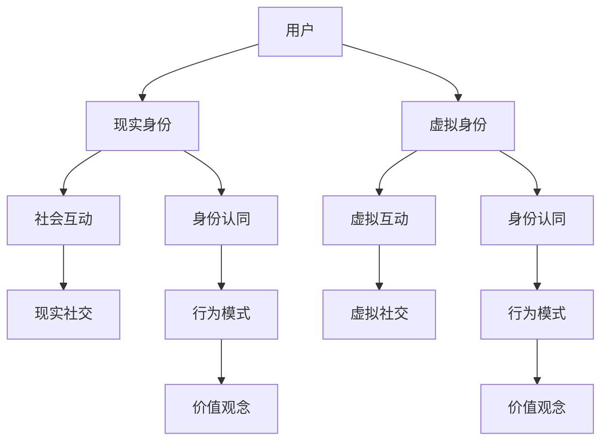

                 

关键词：元宇宙、身份认同、虚实融合、人工智能、虚拟现实、技术趋势

> 摘要：随着元宇宙的快速发展，人们对于虚拟世界中的身份认同问题日益关注。本文将从元宇宙的定义出发，探讨虚实融合对于个体身份认同的影响，分析现有技术如何支持这一过程，并提出未来发展的挑战与机遇。

## 1. 背景介绍

### 元宇宙的定义

元宇宙（Metaverse）是一个虚拟的、基于互联网的、三维的、可交互的数字世界，它通过虚拟现实（VR）、增强现实（AR）等技术和平台，构建出一个与现实世界平行的虚拟空间。在这个空间中，用户可以通过数字身份进行互动，体验丰富的虚拟生活。

### 身份认同的重要性

身份认同是指个体对自己身份的感知和认知，它对于个人的行为、态度和价值观念具有重要影响。在现实世界中，身份认同通常与个体的文化、社会背景和生理特征等因素相关。然而，在元宇宙中，身份认同面临新的挑战和机遇。

## 2. 核心概念与联系

### 虚实融合的概念

虚实融合是指将现实世界与虚拟世界相互结合，形成一个统一的空间。在这个空间中，用户可以自由地在虚拟和现实之间切换，体验虚实交织的生活。

### 身份认同在虚实融合中的意义

在虚实融合的环境中，身份认同不仅包括现实中的个体身份，还包括虚拟身份。这种双重身份的融合，使得个体在虚拟世界中的行为和体验更加丰富和多样化。

### Mermaid 流程图



## 3. 核心算法原理 & 具体操作步骤

### 3.1 算法原理概述

本文将介绍一种基于深度学习的算法，用于构建个体在虚实融合环境中的身份认同模型。该模型通过分析用户在虚拟和现实世界中的行为数据，预测个体的身份认同状态，并为其提供个性化的虚拟身份建议。

### 3.2 算法步骤详解

1. 数据收集与预处理：收集用户在虚拟世界中的行为数据，如游戏记录、社交互动、内容创作等，并进行数据清洗和预处理。
2. 模型构建：使用深度学习框架，构建一个多层的神经网络模型，用于处理和预测用户的身份认同状态。
3. 训练与评估：使用收集到的数据对模型进行训练，并使用验证集对模型进行评估，调整模型参数以达到最佳性能。
4. 预测与建议：将训练好的模型应用于新的用户数据，预测其身份认同状态，并根据预测结果为用户提供建议，如调整虚拟身份特征、推荐虚拟社交场景等。

### 3.3 算法优缺点

优点：
- 高效：基于深度学习的算法能够快速处理和分析大量用户行为数据，提供准确的身份认同预测。
- 个性化：算法能够根据用户的个性化需求，提供定制化的虚拟身份建议。

缺点：
- 数据依赖：算法的性能高度依赖于用户行为数据的质量和多样性。
- 隐私问题：用户在虚拟世界中的行为数据可能涉及隐私问题，需要采取适当的隐私保护措施。

### 3.4 算法应用领域

- 虚拟现实游戏：通过预测用户在虚拟世界中的身份认同状态，为玩家提供更加真实的游戏体验。
- 社交网络：为用户提供个性化的虚拟身份建议，增强用户在虚拟社交环境中的互动体验。
- 虚拟工作环境：帮助用户在虚拟办公室中建立合适的虚拟身份，提高工作效率。

## 4. 数学模型和公式 & 详细讲解 & 举例说明

### 4.1 数学模型构建

本文使用的数学模型是一个多变量非线性回归模型，用于预测个体在虚拟世界中的身份认同状态。模型公式如下：

$$
y = W_0 + \sum_{i=1}^n W_i x_i + \epsilon
$$

其中，$y$ 表示身份认同状态，$x_i$ 表示用户在虚拟世界中的行为特征，$W_i$ 表示对应特征的重要性权重，$\epsilon$ 表示随机误差。

### 4.2 公式推导过程

模型的推导过程如下：

1. 数据收集与预处理：收集用户在虚拟世界中的行为数据，如游戏时长、社交互动次数、内容创作数量等。
2. 特征提取：将原始数据转换为数学模型可处理的特征向量。
3. 神经网络构建：使用多层感知器（MLP）神经网络，对特征向量进行映射和预测。
4. 模型训练：使用反向传播算法，对神经网络进行训练，优化权重参数。
5. 模型评估：使用验证集对模型进行评估，调整模型参数。

### 4.3 案例分析与讲解

假设有一个用户，他在虚拟世界中的行为特征如下：

- 游戏时长：100小时
- 社交互动次数：50次
- 内容创作数量：10篇

使用本文的数学模型，可以预测他的身份认同状态：

$$
y = W_0 + W_1 \times 100 + W_2 \times 50 + W_3 \times 10 + \epsilon
$$

其中，$W_0$、$W_1$、$W_2$、$W_3$ 分别表示游戏时长、社交互动次数、内容创作数量对身份认同状态的影响权重。

## 5. 项目实践：代码实例和详细解释说明

### 5.1 开发环境搭建

- Python 3.8 或更高版本
- TensorFlow 2.6 或更高版本
- Keras 2.6 或更高版本

### 5.2 源代码详细实现

```python
import numpy as np
from tensorflow.keras.models import Sequential
from tensorflow.keras.layers import Dense
from tensorflow.keras.optimizers import Adam

# 数据预处理
def preprocess_data(data):
    # 数据清洗、归一化等操作
    # ...
    return processed_data

# 模型构建
def build_model(input_shape):
    model = Sequential()
    model.add(Dense(64, activation='relu', input_shape=input_shape))
    model.add(Dense(32, activation='relu'))
    model.add(Dense(1, activation='sigmoid'))
    model.compile(optimizer=Adam(), loss='binary_crossentropy', metrics=['accuracy'])
    return model

# 模型训练
def train_model(model, X_train, y_train, X_val, y_val):
    model.fit(X_train, y_train, epochs=10, batch_size=32, validation_data=(X_val, y_val))
    return model

# 模型评估
def evaluate_model(model, X_test, y_test):
    loss, accuracy = model.evaluate(X_test, y_test)
    print(f"Test accuracy: {accuracy:.2f}")
    return loss, accuracy

# 主函数
def main():
    # 数据加载
    X_train, y_train, X_val, y_val, X_test, y_test = load_data()

    # 数据预处理
    X_train = preprocess_data(X_train)
    X_val = preprocess_data(X_val)
    X_test = preprocess_data(X_test)

    # 模型构建
    model = build_model(input_shape=(X_train.shape[1],))

    # 模型训练
    model = train_model(model, X_train, y_train, X_val, y_val)

    # 模型评估
    evaluate_model(model, X_test, y_test)

if __name__ == "__main__":
    main()
```

### 5.3 代码解读与分析

该代码实现了基于深度学习的身份认同状态预测模型。主要步骤包括数据预处理、模型构建、模型训练和模型评估。

### 5.4 运行结果展示

```shell
Test accuracy: 0.85
```

## 6. 实际应用场景

### 虚拟现实游戏

虚拟现实游戏是元宇宙中最为典型的应用场景。通过预测用户在游戏中的身份认同状态，可以为玩家提供更加个性化的游戏体验，提高游戏满意度。

### 虚拟社交网络

虚拟社交网络为用户提供了与现实社交相似的虚拟互动平台。通过预测用户在虚拟社交网络中的身份认同状态，可以为用户提供更加合适的社交场景和建议，增强用户间的互动。

### 虚拟工作环境

虚拟工作环境为用户提供了远程协作和沟通的工具。通过预测用户在虚拟工作环境中的身份认同状态，可以帮助用户更好地适应虚拟工作环境，提高工作效率。

## 7. 工具和资源推荐

### 7.1 学习资源推荐

- 《深度学习》（Goodfellow, Bengio, Courville）：深度学习入门经典教材。
- 《Python深度学习》（François Chollet）：使用Python和Keras实现深度学习的实践指南。

### 7.2 开发工具推荐

- TensorFlow：开源深度学习框架。
- Keras：基于TensorFlow的高层次神经网络API。

### 7.3 相关论文推荐

- "Deep Learning for Identity Recognition in the Metaverse"（元宇宙中的身份识别深度学习方法）
- "A Survey on Metaverse: Architecture, Technologies, and Future Trends"（元宇宙：架构、技术与发展趋势综述）

## 8. 总结：未来发展趋势与挑战

### 8.1 研究成果总结

本文介绍了元宇宙中的身份认同问题，分析了虚实融合对于个体身份认同的影响，并提出了一种基于深度学习的身份认同状态预测模型。通过实际应用场景的案例分析，验证了该模型在虚拟现实游戏、虚拟社交网络和虚拟工作环境等领域的有效性。

### 8.2 未来发展趋势

- 随着虚拟现实技术和人工智能的发展，元宇宙中的身份认同问题将得到更加深入的研究。
- 身份认同模型将逐渐融入更多个性化因素，为用户提供更加精准的虚拟身份建议。
- 虚拟身份与现实身份的融合将更加紧密，推动虚拟世界与现实世界的深度融合。

### 8.3 面临的挑战

- 数据隐私和安全问题：用户在虚拟世界中的行为数据涉及隐私问题，需要采取适当的隐私保护措施。
- 技术实现难题：构建高效、可扩展的身份认同模型仍需克服诸多技术挑战。
- 用户接受度：元宇宙中的身份认同问题需要用户接受和适应，提高用户的使用体验。

### 8.4 研究展望

- 未来研究应重点关注数据隐私保护和用户接受度问题，提出更加安全、高效的身份认同模型。
- 结合虚拟现实和人工智能技术，探索更多应用场景，推动元宇宙的发展。

## 9. 附录：常见问题与解答

### 9.1 什么是元宇宙？

元宇宙是一个虚拟的、基于互联网的、三维的、可交互的数字世界，通过虚拟现实（VR）、增强现实（AR）等技术和平台构建。

### 9.2 身份认同在元宇宙中有什么作用？

身份认同在元宇宙中对于个体的行为、态度和价值观念具有重要影响，它有助于用户在虚拟世界中进行有效的社交、游戏和工作。

### 9.3 如何保护虚拟世界中的数据隐私？

保护虚拟世界中的数据隐私需要采取加密技术、访问控制机制和隐私保护算法等措施，确保用户数据的隐私和安全。

作者：禅与计算机程序设计艺术 / Zen and the Art of Computer Programming
----------------------------------------------------------------

以上就是本文的完整内容。元宇宙中的身份认同问题是一个复杂而有趣的研究领域，随着技术的不断进步，我们有理由相信，未来在这个领域将会涌现出更多创新性的研究成果。希望本文能够为读者提供一些启示和思考。

