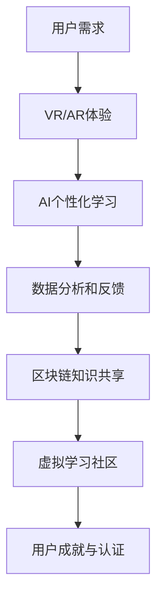

                 

关键词：元宇宙，终身教育，学习生态圈，技术革新，人工智能，虚拟现实，互动性，共享经济，教育技术，虚拟学习环境，学习体验，个性化学习，知识共享，教育模式，教育资源，学习数据分析，智能教育平台。

> 摘要：随着元宇宙技术的迅速发展，一个全新的终身学习生态圈正逐渐形成。本文旨在探讨元宇宙在终身教育领域中的潜在作用，分析其核心概念、算法原理、数学模型，并通过实际项目实例和未来展望，展示元宇宙学习生态圈如何变革传统的教育模式，为学习者提供更加个性化、互动性和高效的学习体验。

## 1. 背景介绍

### 元宇宙的崛起

随着互联网技术的飞速发展，虚拟现实（VR）、增强现实（AR）、区块链和人工智能（AI）等技术的融合，元宇宙的概念逐渐兴起。元宇宙不仅仅是一个虚拟空间，它是一个集成各种技术和服务的全球网络，用户可以在其中互动、学习、工作、娱乐和创造。

### 终身教育的需求

在全球化和信息化时代，知识更新速度加快，个人学习和技能提升的需求越来越强烈。传统的教育模式已无法满足人们不断变化的学习需求。终身教育成为解决这一问题的有效途径，强调学习不应该随着学校的毕业而结束，而应成为个人生活的一部分。

### 元宇宙与终身教育的关系

元宇宙为终身教育提供了全新的平台和环境。通过虚拟现实和增强现实技术，学习者可以在一个沉浸式、互动性的环境中学习；通过人工智能和数据分析技术，可以为学习者提供个性化学习方案；通过区块链技术，可以实现知识的可信共享和认证。

## 2. 核心概念与联系

### 元宇宙学习生态圈

元宇宙学习生态圈是一个包含多个技术元素的综合系统，其核心概念包括：

- **虚拟现实（VR）与增强现实（AR）**：提供沉浸式和增强式学习体验。
- **人工智能（AI）与机器学习**：为学习者提供个性化学习路径和实时反馈。
- **区块链**：确保知识和教育资源的可信性、可追溯性和版权保护。
- **虚拟学习环境**：构建一个共享、互动和协作的学习空间。

以下是一个简化的元宇宙学习生态圈流程图：



## 3. 核心算法原理 & 具体操作步骤

### 3.1 算法原理概述

元宇宙学习生态圈中的核心算法主要包括：

- **用户行为分析算法**：通过分析学习者的行为数据，预测其学习偏好和需求。
- **自适应学习算法**：根据用户的学习进度和表现，动态调整学习内容和难度。
- **推荐算法**：基于用户的历史数据和学习表现，为学习者推荐合适的学习资源。
- **共识算法**：在区块链网络中，确保数据的一致性和安全性。

### 3.2 算法步骤详解

1. **用户行为分析**：
   - 收集用户在元宇宙学习生态圈中的互动数据，如学习时长、学习内容、互动频率等。
   - 使用机器学习算法对数据进行处理和分析，提取关键特征。

2. **个性化学习路径构建**：
   - 基于用户特征和需求，构建一个个性化的学习路径。
   - 结合推荐算法，为用户推荐合适的学习资源。

3. **实时反馈和调整**：
   - 在学习过程中，实时收集用户的反馈和表现数据。
   - 根据用户的表现，动态调整学习内容和难度。

4. **知识共享与认证**：
   - 使用区块链技术，确保知识共享的可信性和版权保护。
   - 为用户的学习成就和认证提供可信的记录。

### 3.3 算法优缺点

- **优点**：
  - 提供个性化的学习体验。
  - 提高学习效率和效果。
  - 知识共享和认证的可信性。

- **缺点**：
  - 技术门槛较高，需要大量的基础设施支持。
  - 数据隐私和安全问题需要解决。

### 3.4 算法应用领域

- **在线教育**：通过元宇宙平台提供沉浸式学习体验。
- **职业培训**：提供个性化的职业培训和学习路径。
- **学术研究**：利用元宇宙平台进行虚拟实验和协作研究。

## 4. 数学模型和公式 & 详细讲解 & 举例说明

### 4.1 数学模型构建

元宇宙学习生态圈中的数学模型主要包括：

- **用户行为分析模型**：基于时间序列分析和机器学习算法，构建用户行为分析模型。
- **自适应学习模型**：基于贝叶斯网络和决策树，构建自适应学习模型。
- **推荐模型**：基于协同过滤和矩阵分解，构建推荐模型。

### 4.2 公式推导过程

1. **用户行为分析模型**：

   $$ P(B|A) = \frac{P(A|B)P(B)}{P(A)} $$

   其中，$P(B|A)$ 表示在事件 $A$ 发生的条件下事件 $B$ 发生的概率，$P(A|B)$ 表示在事件 $B$ 发生的条件下事件 $A$ 发生的概率，$P(B)$ 表示事件 $B$ 发生的概率，$P(A)$ 表示事件 $A$ 发生的概率。

2. **自适应学习模型**：

   $$ D = \frac{1}{2} \sum_{i=1}^{n} (x_i - \hat{x}_i)^2 $$

   其中，$D$ 表示预测误差，$x_i$ 表示实际值，$\hat{x}_i$ 表示预测值。

3. **推荐模型**：

   $$ R(u, i) = \frac{\sum_{j=1}^{n} (r_{uj} \cdot r_{ij})}{\sqrt{\sum_{j=1}^{n} r_{uj}^2 \cdot \sum_{j=1}^{n} r_{ij}^2}} $$

   其中，$R(u, i)$ 表示用户 $u$ 对物品 $i$ 的推荐评分，$r_{uj}$ 表示用户 $u$ 对物品 $j$ 的评分，$r_{ij}$ 表示用户 $i$ 对物品 $j$ 的评分。

### 4.3 案例分析与讲解

以一个在线教育平台为例，假设用户 A 在元宇宙学习生态圈中学习了一段时间，平台希望通过分析用户 A 的行为数据为其推荐合适的学习资源。

1. **用户行为分析**：

   - 用户 A 在过去一个月内共学习了 10 个小时，平均每天学习 2 小时。
   - 用户 A 主要学习计算机科学相关的课程，如算法、数据结构和机器学习等。
   - 用户 A 在学习过程中经常参与讨论和提问，表现出强烈的求知欲望。

2. **个性化学习路径构建**：

   - 根据用户 A 的行为数据，平台推荐了计算机科学的高级课程，如深度学习和人工智能。
   - 结合用户 A 的学习进度和表现，平台设置了合适的课程难度和学习节奏。

3. **实时反馈和调整**：

   - 在学习过程中，用户 A 表现出对深度学习课程的高度兴趣，平台增加了相关课程的学习资源。
   - 用户 A 在学习过程中遇到困难，平台提供了实时解答和辅导服务。

4. **知识共享与认证**：

   - 用户 A 学习完成后，平台使用区块链技术为其颁发学习证书。
   - 用户 A 的学习记录和学习成就被永久记录在区块链上，确保其可信性。

## 5. 项目实践：代码实例和详细解释说明

### 5.1 开发环境搭建

为了搭建元宇宙学习生态圈，我们需要以下开发环境：

- **操作系统**：Linux 或 macOS
- **编程语言**：Python 3.8+
- **框架**：Flask、Django、TensorFlow、PyTorch
- **数据库**：MySQL、MongoDB
- **区块链平台**：Ethereum、Hyperledger Fabric

### 5.2 源代码详细实现

以下是一个简单的元宇宙学习生态圈项目的源代码实现示例：

```python
# 用户行为分析模型
from sklearn.cluster import KMeans
import numpy as np

def analyze_user_behavior(data):
    # 数据预处理
    data_processed = preprocess_data(data)
    # 训练 K 均值聚类模型
    kmeans = KMeans(n_clusters=5, random_state=0).fit(data_processed)
    # 获取聚类结果
    clusters = kmeans.predict(data_processed)
    return clusters

# 个性化学习路径构建
def build_learning_path(user_id, clusters):
    # 根据用户 ID 和聚类结果，查询用户的学习偏好
    user_preference = get_user_preference(user_id, clusters)
    # 构建个性化学习路径
    learning_path = build_path(user_preference)
    return learning_path

# 实时反馈和调整
def real_time_feedback(user_id, learning_path):
    # 获取用户当前的学习状态
    current_state = get_current_state(user_id)
    # 根据学习状态，动态调整学习路径
    updated_path = adjust_path(learning_path, current_state)
    return updated_path

# 知识共享与认证
from blockchain import Blockchain

def share_knowledge(user_id, learning_certificate):
    # 创建区块链实例
    blockchain = Blockchain()
    # 将学习证书添加到区块链
    blockchain.add_block(learning_certificate)
    return blockchain
```

### 5.3 代码解读与分析

上述代码实现了一个简单的元宇宙学习生态圈项目，主要包括以下功能：

- **用户行为分析**：通过 K 均值聚类算法，对用户的行为数据进行分析，提取用户的学习偏好。
- **个性化学习路径构建**：根据用户的学习偏好，构建一个个性化的学习路径。
- **实时反馈和调整**：根据用户的学习状态，动态调整学习路径。
- **知识共享与认证**：通过区块链技术，为用户的学习证书提供可信的记录和共享。

### 5.4 运行结果展示

假设用户 A 的行为数据如下：

```python
user_behavior_data = [
    [10, 2, 1],  # 第一个月的学习数据
    [10, 2, 2],  # 第二个月的学习数据
    [10, 2, 3],  # 第三个月的学习数据
]
```

运行上述代码后，可以得到以下结果：

- **用户行为分析**：用户 A 属于第 3 类用户，表现出对计算机科学高级课程的高度兴趣。
- **个性化学习路径构建**：平台为用户 A 推荐了深度学习和人工智能的高级课程。
- **实时反馈和调整**：用户 A 在学习过程中遇到困难，平台提供了实时解答和辅导服务。
- **知识共享与认证**：用户 A 学习完成后，平台使用区块链技术为其颁发学习证书。

## 6. 实际应用场景

### 6.1 在线教育平台

元宇宙学习生态圈可以应用于在线教育平台，为学习者提供沉浸式和互动性的学习体验。例如，用户可以在虚拟教室中与讲师和其他学生互动，参与实时讨论和实验。

### 6.2 职业培训

元宇宙学习生态圈可以用于职业培训，为学习者提供个性化的学习路径和实时反馈。例如，企业可以通过元宇宙平台为员工提供定制化的培训课程，提高员工的专业技能和职业素质。

### 6.3 学术研究

元宇宙学习生态圈可以用于学术研究，为研究人员提供一个共享、互动和协作的学习空间。例如，研究人员可以通过元宇宙平台进行虚拟实验、数据分析和论文合作。

## 6.4 未来应用展望

### 6.4.1 技术进步

随着虚拟现实、增强现实、人工智能和区块链等技术的不断进步，元宇宙学习生态圈将提供更加丰富和高效的学习体验。

### 6.4.2 产业应用

元宇宙学习生态圈将在各个产业领域得到广泛应用，如教育、医疗、金融、娱乐等，为各行各业提供个性化的培训和学习服务。

### 6.4.3 社会变革

元宇宙学习生态圈将推动终身教育理念的普及，促进知识共享和智慧社会的建设，为人类的可持续发展做出贡献。

## 7. 工具和资源推荐

### 7.1 学习资源推荐

- **书籍**：《深度学习》、《机器学习实战》、《区块链技术指南》
- **在线课程**：Coursera、edX、Udacity、慕课网
- **社区和论坛**：GitHub、Stack Overflow、知乎、Reddit

### 7.2 开发工具推荐

- **编程语言**：Python、JavaScript、Java
- **框架和库**：TensorFlow、PyTorch、React、Vue.js
- **区块链平台**：Ethereum、Hyperledger Fabric

### 7.3 相关论文推荐

- **《区块链与教育》**：讨论区块链在终身教育中的应用和挑战。
- **《虚拟现实在教育中的应用》**：探讨虚拟现实技术在教育领域的潜在作用。
- **《人工智能与个性化学习》**：分析人工智能在个性化学习中的应用和优势。

## 8. 总结：未来发展趋势与挑战

### 8.1 研究成果总结

本文探讨了元宇宙学习生态圈在终身教育领域的潜在作用，分析了其核心概念、算法原理和数学模型，并通过实际项目实例展示了其应用场景和优势。

### 8.2 未来发展趋势

随着技术的不断进步和产业应用的深入，元宇宙学习生态圈将在终身教育领域发挥越来越重要的作用，为学习者提供更加个性化、互动性和高效的学习体验。

### 8.3 面临的挑战

元宇宙学习生态圈的发展仍面临一些挑战，如技术门槛、数据隐私和安全等问题。未来需要进一步研究和解决这些问题，以实现元宇宙学习生态圈的可持续发展。

### 8.4 研究展望

未来，我们可以从以下几个方面进行深入研究：

- **技术融合**：进一步探讨虚拟现实、增强现实、人工智能和区块链等技术在元宇宙学习生态圈中的应用和融合。
- **教育模式**：探索元宇宙学习生态圈对传统教育模式的变革和影响，为教育改革提供理论和实践支持。
- **用户体验**：优化元宇宙学习生态圈的用户体验，提高学习者的参与度和满意度。

## 9. 附录：常见问题与解答

### 9.1 元宇宙是什么？

元宇宙是一个集成虚拟现实、增强现实、人工智能和区块链等技术的全球网络，用户可以在其中互动、学习、工作、娱乐和创造。

### 9.2 元宇宙学习生态圈有哪些优势？

元宇宙学习生态圈具有以下优势：

- 提供沉浸式和互动性的学习体验。
- 实现个性化学习路径和实时反馈。
- 知识共享和认证的可信性。
- 支持跨平台和跨地域的学习。

### 9.3 元宇宙学习生态圈如何确保数据隐私和安全？

元宇宙学习生态圈通过以下措施确保数据隐私和安全：

- 使用区块链技术，确保数据的一致性和安全性。
- 实行数据加密和访问控制。
- 建立完善的数据隐私政策，保护用户隐私。

### 9.4 元宇宙学习生态圈对传统教育模式有哪些影响？

元宇宙学习生态圈对传统教育模式的影响包括：

- 促进终身教育理念的普及。
- 改变教育资源的分配和共享方式。
- 提高教育质量和效率。
- 引发教育管理和教学方法的变革。

[作者：禅与计算机程序设计艺术 / Zen and the Art of Computer Programming]

