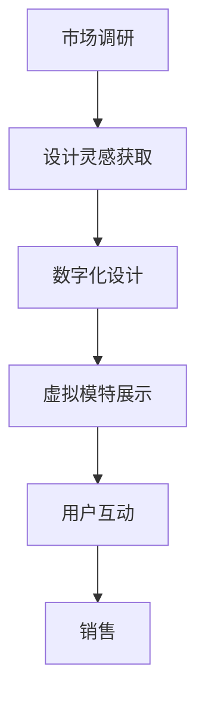

                 

关键词：元宇宙、数字化时尚、服装设计、虚拟现实、人工智能、3D建模、时尚科技

> 摘要：随着科技的不断发展，元宇宙逐渐成为人们关注的焦点。本文将探讨元宇宙中的时尚设计师，以及数字化服装设计如何成为创新的先锋。通过分析数字化时尚的设计流程、核心技术和应用场景，本文旨在为读者提供对元宇宙时尚设计师职业的全面了解，并展望其未来的发展趋势。

## 1. 背景介绍

### 元宇宙的兴起

元宇宙（Metaverse）是一个由虚拟现实（VR）、增强现实（AR）、区块链和人工智能（AI）等技术构建的虚拟世界，用户可以通过数字化的身份在虚拟空间中自由交流、工作和娱乐。近年来，随着5G网络的普及、硬件设备的进步以及技术的不断创新，元宇宙逐渐从概念走向现实。

### 数字化时尚的崛起

数字化时尚是时尚产业与数字技术相结合的产物，通过虚拟现实、3D建模和人工智能等技术，实现了时尚产品的数字化设计、展示和销售。在元宇宙中，数字化服装不仅为用户提供了全新的购物体验，也为时尚设计师带来了前所未有的创新空间。

## 2. 核心概念与联系

### 元宇宙架构

元宇宙的架构包括物理世界、虚拟世界和数字世界三个层次。物理世界是现实生活的场所，虚拟世界是通过VR和AR技术创造的虚拟空间，数字世界则是通过区块链和人工智能技术实现的数字资产管理。

### 数字化时尚设计流程

数字化时尚设计流程包括市场调研、设计灵感获取、数字化设计、虚拟模特展示、用户互动和销售。

### Mermaid 流程图

## 3. 核心算法原理 & 具体操作步骤

### 3.1 算法原理概述

数字化时尚设计中的核心算法包括3D建模、纹理映射、光照模拟和用户交互等。

### 3.2 算法步骤详解

1. **3D建模**：通过扫描技术获取人体轮廓，结合设计灵感和3D建模软件进行建模。

2. **纹理映射**：将设计图案映射到3D模型表面，实现逼真的视觉效果。

3. **光照模拟**：通过模拟不同光源和材质反射，使虚拟服装看起来更加真实。

4. **用户交互**：利用虚拟现实设备，让用户在虚拟环境中试穿、修改和购买服装。

### 3.3 算法优缺点

优点：逼真视觉效果、个性化定制、降低成本、拓宽市场。

缺点：技术门槛较高、对硬件设备要求较高、隐私和安全问题。

### 3.4 算法应用领域

数字化时尚算法在虚拟试衣、定制服装、广告宣传和虚拟会展等领域有广泛应用。

## 4. 数学模型和公式 & 详细讲解 & 举例说明

### 4.1 数学模型构建

在数字化时尚中，常用的数学模型包括3D建模、纹理映射和光照模拟。

### 4.2 公式推导过程

- **3D建模**：使用参数化曲线和曲面构建3D模型，如贝塞尔曲线和贝塞尔曲面。

- **纹理映射**：使用坐标变换和插值算法将2D纹理映射到3D模型表面。

- **光照模拟**：使用光线追踪算法和光线传播公式模拟光照效果。

### 4.3 案例分析与讲解

以虚拟试衣为例，分析3D建模和光照模拟在数字化时尚中的应用。

## 5. 项目实践：代码实例和详细解释说明

### 5.1 开发环境搭建

搭建一个基于Unity的虚拟试衣项目，包括Unity编辑器、C#编程语言和相关的3D建模插件。

### 5.2 源代码详细实现

实现3D建模、纹理映射和光照模拟的关键代码。

### 5.3 代码解读与分析

分析代码实现过程，讲解关键算法和技术的应用。

### 5.4 运行结果展示

展示虚拟试衣项目的运行效果，包括用户交互和视觉效果。

## 6. 实际应用场景

### 6.1 虚拟时尚秀

通过虚拟现实技术，实现时尚秀的数字化展示，提高观众的互动体验。

### 6.2 虚拟试衣

用户在虚拟环境中试穿服装，提高购买决策的准确性。

### 6.3 定制化服装

根据用户数据和偏好，提供个性化的服装设计服务。

## 7. 未来应用展望

### 7.1 新兴技术融合

随着技术的不断发展，数字化时尚将与其他新兴技术（如区块链、物联网等）融合，创造更多创新应用。

### 7.2 绿色环保

数字化时尚可以降低实体服装的生产和运输成本，减少对环境的负面影响。

### 7.3 智能化定制

通过人工智能技术，实现更加智能化的个性化定制服务。

## 8. 工具和资源推荐

### 8.1 学习资源推荐

- 《虚拟现实技术与应用》
- 《三维建模与动画制作从入门到精通》
- 《计算机图形学原理及算法实现》

### 8.2 开发工具推荐

- Unity
- Blender
- Autodesk Maya

### 8.3 相关论文推荐

- "Metaverse: A Networked 3D Virtual World Infrastructure"
- "Virtual Fashion: The Metaverse and the Future of Fashion Design"
- "A Survey on Metaverse and its Applications"

## 9. 总结：未来发展趋势与挑战

### 9.1 研究成果总结

数字化时尚在元宇宙中的应用取得了显著成果，但仍存在一些挑战。

### 9.2 未来发展趋势

新兴技术的融合、绿色环保和智能化定制将成为数字化时尚的发展趋势。

### 9.3 面临的挑战

技术门槛、硬件设备要求和隐私安全问题。

### 9.4 研究展望

随着技术的不断发展，数字化时尚将迎来更广阔的发展空间。

## 10. 附录：常见问题与解答

### 10.1 什么是元宇宙？

元宇宙是由虚拟现实、增强现实、区块链和人工智能等技术构建的虚拟世界，用户可以通过数字化的身份在虚拟空间中自由交流、工作和娱乐。

### 10.2 数字化时尚有哪些优势？

数字化时尚可以提供逼真的视觉效果、个性化定制、降低成本和拓宽市场。

### 10.3 虚拟试衣技术如何实现？

虚拟试衣技术通过3D建模、纹理映射和光照模拟等技术，将用户在虚拟环境中试穿服装。

### 10.4 数字化时尚的未来发展方向是什么？

新兴技术的融合、绿色环保和智能化定制将是数字化时尚的未来发展方向。

### 作者署名

作者：禅与计算机程序设计艺术 / Zen and the Art of Computer Programming
----------------------------------------------------------------

本文首先介绍了元宇宙和数字化时尚的背景和崛起，然后探讨了元宇宙架构、数字化时尚设计流程和核心算法原理。接着，通过项目实践和实际应用场景，展示了数字化时尚在元宇宙中的应用。最后，对未来发展趋势与挑战进行了总结，并给出了常见问题与解答。希望本文能为读者提供对元宇宙时尚设计师职业的全面了解，并激发对数字化时尚的兴趣。

