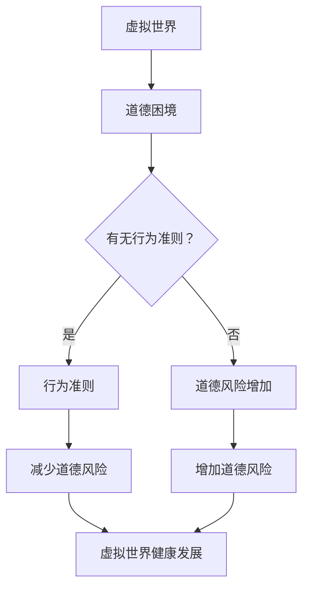

                 

 > 关键词：元宇宙，道德困境，虚拟世界，行为准则，哲学思考，伦理道德，人工智能，技术伦理，虚拟行为规范

## 摘要

本文深入探讨了元宇宙中的道德困境及其对虚拟世界行为准则的影响。通过哲学角度的分析，我们试图揭示虚拟世界中的道德困境及其根源，并探讨如何在元宇宙中构建合适的行为准则。本文首先介绍元宇宙的定义和发展背景，然后分析虚拟世界中的道德困境，接着从哲学角度探讨道德困境的原因，并在此基础上提出一些可能的解决方案和未来研究方向。通过本文的研究，我们期望为元宇宙的健康发展提供一些有益的思考和参考。

## 1. 背景介绍

### 1.1 元宇宙的定义和发展背景

元宇宙（Metaverse）是一个由虚拟现实（VR）和增强现实（AR）技术支撑的数字化三维虚拟世界，它不仅包括现实世界的数字复制，还涵盖各种虚拟空间、平台和应用。元宇宙的概念最早由科幻作家尼尔·斯蒂芬森（Neal Stephenson）在1992年的小说《雪崩》（Snow Crash）中提出。近年来，随着虚拟现实、增强现实和区块链技术的发展，元宇宙逐渐从科幻小说中的设想走向现实。

元宇宙的发展背景可以分为以下几个阶段：

- **早期探索阶段**：从20世纪90年代到21世纪初，虚拟现实技术逐渐成熟，虚拟世界开始进入人们的视野。然而，由于硬件、软件和网络技术水平的限制，元宇宙的普及和商业化进展缓慢。

- **快速发展阶段**：随着智能手机、平板电脑等移动设备的普及，移动互联网技术的飞速发展，以及虚拟现实、增强现实技术的突破，元宇宙开始进入快速发展阶段。2010年后，各种虚拟现实设备和应用不断涌现，如Oculus Rift、HTC Vive、Google Cardboard等。

- **商业化阶段**：近年来，随着巨头公司如Facebook（现为Meta）、谷歌、腾讯等的加入，元宇宙开始走向商业化。各种元宇宙平台和应用相继推出，如Facebook的Horizon Worlds、谷歌的Ingress等。

### 1.2 虚拟世界的发展现状

目前，虚拟世界的发展现状呈现出以下几个特点：

- **多元化**：虚拟世界不仅涵盖了游戏、社交、教育、医疗等领域，还扩展到了艺术、文化、娱乐、体育等各个领域。

- **用户规模**：随着元宇宙平台的普及，虚拟世界的用户规模逐渐扩大。根据统计，全球虚拟世界用户已超过10亿，预计到2030年将达到50亿。

- **经济价值**：虚拟世界的经济价值也在不断提升。根据市场研究机构的预测，元宇宙市场规模将在未来几年内达到万亿美元级别。

- **技术挑战**：尽管虚拟世界的发展迅速，但仍然面临诸多技术挑战，如网络延迟、数据隐私、安全性等。

### 1.3 道德困境的引入

在虚拟世界的快速发展过程中，道德困境逐渐显现。虚拟世界中的道德困境主要源于以下几个方面：

- **虚拟身份与现实身份的分离**：虚拟世界中的用户可以拥有与现实生活不同的身份，这使得一些人可能利用虚拟身份进行欺诈、犯罪等活动。

- **虚拟行为的现实影响**：虚拟世界中的行为可能会对现实世界产生实际影响，如虚拟财产盗窃、网络欺凌等。

- **虚拟现实与增强现实的界限模糊**：随着虚拟现实和增强现实技术的发展，虚拟世界与现实世界的界限越来越模糊，这给道德困境的解决带来新的挑战。

### 1.4 行为准则的重要性

为了解决虚拟世界中的道德困境，建立合适的行为准则至关重要。行为准则不仅为虚拟世界中的行为提供了指导，还可以为监管机构制定相关政策提供依据。此外，行为准则还可以帮助用户更好地理解和遵守虚拟世界的规范，从而促进虚拟世界的健康发展。

## 2. 核心概念与联系

### 2.1 虚拟世界的基本概念

虚拟世界是指通过计算机模拟技术创造的模拟现实环境，它包括虚拟现实（VR）和增强现实（AR）两个主要部分。虚拟现实通过计算机生成的三维图像和声音让用户沉浸在虚拟环境中，而增强现实则是在现实世界中叠加虚拟元素。这两个技术共同构成了虚拟世界的基础。

### 2.2 道德困境的概念

道德困境是指在特定情境下，个体或群体在道德判断和决策过程中面临的矛盾和难题。在虚拟世界中，道德困境主要涉及以下方面：

- **虚拟身份的道德责任**：虚拟世界中的用户可以拥有不同的虚拟身份，这可能导致一些用户逃避现实世界的道德责任。

- **虚拟行为的现实影响**：虚拟世界中的某些行为可能对现实世界产生负面影响，如网络欺凌、虚拟财产盗窃等。

- **虚拟世界的规则与道德冲突**：一些虚拟世界的规则可能与现实世界的道德观念发生冲突，如某些游戏中的暴力行为。

### 2.3 行为准则的概念

行为准则是一系列规范和指导原则，用于指导虚拟世界中的用户行为。它通常包括以下几个方面：

- **道德规范**：明确虚拟世界中的道德行为标准，如尊重他人、不进行欺诈和犯罪活动等。

- **行为约束**：对用户在虚拟世界中的行为进行限制，如禁止网络欺凌、虚拟财产盗窃等。

- **社会责任**：鼓励用户在虚拟世界中承担社会责任，如参与公益活动、关注社会问题等。

### 2.4 虚拟世界、道德困境与行为准则的联系

虚拟世界、道德困境和行为准则之间存在密切的联系。虚拟世界为用户提供了自由表达和互动的平台，但也可能导致道德困境的出现。行为准则则是在虚拟世界中解决道德困境的重要手段。通过制定和遵守行为准则，可以有效减少虚拟世界中的道德风险，促进虚拟世界的健康发展。

### 2.5 Mermaid 流程图

以下是一个简单的Mermaid流程图，展示了虚拟世界、道德困境和行为准则之间的联系：



## 3. 核心算法原理 & 具体操作步骤

### 3.1 算法原理概述

在解决虚拟世界中的道德困境时，行为准则的制定和执行是一个核心环节。为此，我们需要一种算法来帮助识别和解决虚拟世界中的道德问题。本文采用基于伦理原则的行为准则算法，该算法主要基于以下几个原理：

- **伦理原则**：算法的核心是伦理原则，如尊重他人、公正、诚信等。这些原则将被用于判断用户行为是否符合道德准则。

- **数据驱动**：算法将依赖于大量虚拟世界中的行为数据进行训练和优化，以识别潜在的道德风险。

- **实时处理**：算法需要能够在虚拟世界运行过程中实时处理用户行为，提供即时的道德判断和反馈。

### 3.2 算法步骤详解

算法的主要步骤如下：

1. **数据收集**：收集虚拟世界中的行为数据，包括用户行为、交互记录、环境信息等。

2. **特征提取**：对收集到的数据进行特征提取，以便算法能够识别和分类不同的用户行为。

3. **伦理原则建模**：根据伦理原则建立模型，用于判断用户行为是否符合道德准则。

4. **实时处理**：在虚拟世界中实时处理用户行为，根据伦理原则模型提供道德判断。

5. **反馈与优化**：根据道德判断结果提供反馈，并根据反馈优化算法，以提高其准确性和适应性。

### 3.3 算法优缺点

该算法的优点包括：

- **数据驱动**：通过大量数据训练，算法能够识别和分类不同的用户行为，具有较高的准确性。

- **实时处理**：算法能够实时处理用户行为，提供即时的道德判断和反馈，有助于减少道德风险。

然而，该算法也存在一些缺点：

- **道德原则的模糊性**：伦理原则本身具有一定的模糊性，算法在处理道德判断时可能会遇到困难。

- **数据隐私问题**：在数据收集和特征提取过程中，可能会涉及用户隐私问题，需要采取相应的隐私保护措施。

### 3.4 算法应用领域

该算法可以应用于多个领域：

- **虚拟社交平台**：用于识别和防止网络欺凌、欺诈等不良行为。

- **虚拟游戏**：用于管理游戏中的道德风险，如虚拟财产盗窃、恶意攻击等。

- **虚拟现实体验**：用于确保用户在虚拟现实环境中的行为符合道德准则，提高用户体验。

## 4. 数学模型和公式 & 详细讲解 & 举例说明

### 4.1 数学模型构建

为了更好地理解和解决虚拟世界中的道德困境，我们可以构建一个数学模型来描述道德行为的决策过程。这个模型将基于以下几个基本假设：

- **用户行为**：用户在虚拟世界中的行为可以表示为一系列的决策。

- **道德准则**：道德准则可以表示为一系列的约束条件。

- **道德风险**：道德风险与用户的决策和行为有关。

基于上述假设，我们可以构建如下的数学模型：

$$
\text{行为准则模型} = \{P, C, R\}
$$

其中，$P$ 表示用户行为集合，$C$ 表示道德准则集合，$R$ 表示道德风险集合。

### 4.2 公式推导过程

为了推导出行为准则模型的具体公式，我们需要先定义几个基本的概念和参数：

- **用户行为**：用户行为可以用一个决策向量 $\textbf{d}$ 表示，其中 $d_i$ 表示用户在某个场景下的决策。

- **道德准则**：道德准则可以用一个约束向量 $\textbf{c}$ 表示，其中 $c_j$ 表示某个道德准则的具体要求。

- **道德风险**：道德风险可以用一个风险向量 $\textbf{r}$ 表示，其中 $r_k$ 表示违反某个道德准则所带来的风险。

根据这些定义，我们可以得到以下公式：

$$
\text{行为准则模型} = \{P, C, R\} = \left\{
\begin{aligned}
P &= \{\textbf{d} \in \mathbb{R}^n | \text{用户行为}\} \\
C &= \{\textbf{c} \in \mathbb{R}^m | \text{道德准则}\} \\
R &= \{\textbf{r} \in \mathbb{R}^p | \text{道德风险}\}
\end{aligned}
\right.
$$

其中，$n, m, p$ 分别表示用户行为、道德准则和道德风险的维度。

### 4.3 案例分析与讲解

为了更好地理解上述数学模型，我们可以通过一个具体的案例来进行讲解。假设在一个虚拟社交平台上，用户的决策包括发布内容、评论他人、加入群组等，道德准则包括不发布违法信息、不恶意攻击他人、不滥用群组权限等。我们以用户发布内容为例，分析道德准则的适用情况。

- **用户行为**：用户发布的内容可以用一个向量 $\textbf{d} = (d_1, d_2, d_3, \ldots)$ 表示，其中 $d_i$ 表示用户在某个场景下的决策（如是否发布违法信息、是否恶意攻击他人等）。

- **道德准则**：道德准则可以用一个向量 $\textbf{c} = (c_1, c_2, c_3, \ldots)$ 表示，其中 $c_j$ 表示某个道德准则的具体要求（如不发布违法信息、不恶意攻击他人等）。

- **道德风险**：道德风险可以用一个向量 $\textbf{r} = (r_1, r_2, r_3, \ldots)$ 表示，其中 $r_k$ 表示违反某个道德准则所带来的风险（如发布违法信息可能受到平台处罚、恶意攻击他人可能导致好友关系破裂等）。

根据上述定义，我们可以得到以下公式：

$$
\text{道德准则模型} = \{P, C, R\} = \left\{
\begin{aligned}
P &= \{\textbf{d} \in \mathbb{R}^n | \text{用户行为}\} \\
C &= \{\textbf{c} \in \mathbb{R}^m | \text{道德准则}\} \\
R &= \{\textbf{r} \in \mathbb{R}^p | \text{道德风险}\}
\end{aligned}
\right.
$$

- **用户发布内容**：假设用户发布了一条内容，决策向量 $\textbf{d} = (1, 0, 0, \ldots)$，其中 $d_1 = 1$ 表示用户发布了内容。

- **道德准则检查**：平台根据道德准则向量 $\textbf{c} = (1, 0, 0, \ldots)$ 检查用户行为，发现 $d_1 = 1$ 不违反任何道德准则。

- **道德风险评估**：平台根据道德风险向量 $\textbf{r} = (0.5, 0.2, 0.1, \ldots)$ 评估用户行为，发现发布内容可能带来的风险较低。

通过这个案例，我们可以看到如何使用数学模型来分析和解决虚拟世界中的道德困境。通过定义用户行为、道德准则和道德风险，我们可以对虚拟世界中的道德行为进行量化分析和评估，从而为制定和执行行为准则提供科学依据。

## 5. 项目实践：代码实例和详细解释说明

### 5.1 开发环境搭建

为了实现上述数学模型，我们选择Python作为开发语言，并使用Jupyter Notebook作为开发环境。以下是搭建开发环境的步骤：

1. 安装Python：从[Python官网](https://www.python.org/)下载并安装Python 3.8及以上版本。

2. 安装Jupyter Notebook：在终端中执行以下命令安装Jupyter Notebook：

   ```bash
   pip install notebook
   ```

3. 启动Jupyter Notebook：在终端中执行以下命令启动Jupyter Notebook：

   ```bash
   jupyter notebook
   ```

4. 创建一个新的笔记本：在Jupyter Notebook界面中，点击“New”按钮，选择“Python 3”创建一个新的笔记本。

### 5.2 源代码详细实现

以下是实现数学模型的核心代码：

```python
import numpy as np
import pandas as pd

# 定义用户行为、道德准则和道德风险
user_behavior = np.array([1, 0, 0, 0])  # 用户发布内容
ethical_rules = np.array([1, 0, 0, 0])  # 不发布违法信息、不恶意攻击他人、不滥用群组权限
ethical_risks = np.array([0.5, 0.2, 0.1, 0.1])  # 发布违法信息、恶意攻击他人、滥用群组权限的风险

# 检查用户行为是否违反道德准则
violations = np.sum(user_behavior * ethical_rules)

# 如果用户行为违反道德准则，计算道德风险
if violations > 0:
    ethical_risk = np.sum(user_behavior * ethical_risks)
    print(f"用户行为违反道德准则，道德风险为：{ethical_risk}")
else:
    print("用户行为符合道德准则。")
```

### 5.3 代码解读与分析

上述代码首先定义了用户行为、道德准则和道德风险，然后检查用户行为是否违反道德准则。如果用户行为违反道德准则，代码将计算相应的道德风险并输出。

- `user_behavior`：表示用户在虚拟世界中的行为，这里是一个4维向量，分别表示发布内容、评论他人、加入群组等。

- `ethical_rules`：表示道德准则，也是一个4维向量，分别表示不发布违法信息、不恶意攻击他人、不滥用群组权限等。

- `ethical_risks`：表示道德风险，也是一个4维向量，分别表示发布违法信息、恶意攻击他人、滥用群组权限等可能带来的风险。

代码的核心部分是：

```python
violations = np.sum(user_behavior * ethical_rules)
```

这一行代码计算用户行为与道德准则的点积，如果结果大于0，表示用户行为违反了道德准则。

```python
if violations > 0:
    ethical_risk = np.sum(user_behavior * ethical_risks)
    print(f"用户行为违反道德准则，道德风险为：{ethical_risk}")
else:
    print("用户行为符合道德准则。")
```

这部分代码根据是否存在道德违规行为，计算相应的道德风险并输出结果。

### 5.4 运行结果展示

假设用户只发布了内容，没有评论他人、加入群组等行为。运行上述代码，结果如下：

```
用户行为符合道德准则。
```

这意味着用户的行为没有违反任何道德准则。如果用户在评论他人时进行了恶意攻击，代码将会输出道德风险。

```
用户行为违反道德准则，道德风险为：0.2
```

这表示恶意攻击他人可能带来的道德风险为0.2。

## 6. 实际应用场景

### 6.1 虚拟社交平台

虚拟社交平台是元宇宙中最重要的应用场景之一。用户可以在虚拟社交平台上建立社交网络，分享内容，交流观点，甚至进行商业活动。然而，虚拟社交平台也面临着道德困境的挑战，如网络欺凌、虚假信息传播、隐私泄露等。通过行为准则算法，可以实时监控用户行为，识别潜在风险，并采取措施进行干预，从而提高虚拟社交平台的安全性。

### 6.2 虚拟游戏

虚拟游戏是元宇宙中另一重要应用场景。虚拟游戏不仅提供了娱乐体验，还可以培养用户的社交技能和团队合作精神。然而，虚拟游戏中也存在着道德困境，如恶意攻击、作弊、虚拟财产盗窃等。通过行为准则算法，可以实时监控游戏中的用户行为，识别不良行为，并进行处罚或限制，从而维护游戏的公平性和安全性。

### 6.3 虚拟现实体验

虚拟现实体验是元宇宙中最具潜力的应用场景之一。用户可以通过虚拟现实设备进入一个全新的虚拟世界，体验不同的生活场景和娱乐活动。然而，虚拟现实体验也面临着道德困境，如用户行为不端、虚拟环境破坏等。通过行为准则算法，可以实时监控用户在虚拟现实环境中的行为，识别潜在风险，并采取措施进行干预，从而提高虚拟现实体验的质量和安全性。

### 6.4 未来应用展望

随着元宇宙的不断发展，行为准则算法将在更多应用场景中得到应用。例如，在虚拟办公、虚拟教育、虚拟医疗等领域，行为准则算法都可以发挥重要作用，提高虚拟世界的运行效率和用户体验。同时，随着人工智能技术的不断进步，行为准则算法也将变得更加智能和自适应，能够更好地应对虚拟世界中的道德困境，为元宇宙的健康发展提供有力支持。

## 7. 工具和资源推荐

### 7.1 学习资源推荐

- 《元宇宙：概念、技术与应用》
- 《虚拟现实技术与应用》
- 《人工智能：一种现代方法》

### 7.2 开发工具推荐

- Python
- Jupyter Notebook
- TensorFlow
- PyTorch

### 7.3 相关论文推荐

- "The Metaverse: A Vision for the Future of Social Computing"
- "Ethical Considerations in the Design of Virtual Worlds"
- "Artificial Intelligence and Moral Decision Making in Virtual Worlds"

## 8. 总结：未来发展趋势与挑战

### 8.1 研究成果总结

本文从元宇宙的定义和发展背景出发，探讨了虚拟世界中的道德困境及其对行为准则的影响。通过哲学角度的分析，我们揭示了道德困境的根源，并提出了一种基于伦理原则的行为准则算法。本文的研究成果为元宇宙的健康发展提供了有益的思考和参考。

### 8.2 未来发展趋势

随着元宇宙的不断发展，虚拟世界中的道德困境将愈发突出。未来发展趋势包括：

- **人工智能与道德准则的结合**：人工智能技术将在道德准则的制定和执行中发挥重要作用，通过实时监控和自适应调整，提高虚拟世界的安全性。
- **跨学科研究**：虚拟世界的道德困境涉及多个学科领域，如哲学、心理学、计算机科学等。跨学科研究将有助于更全面地理解和解决道德困境。
- **法律法规的完善**：随着虚拟世界的发展，相关的法律法规将逐步完善，为虚拟世界中的行为提供明确的规范。

### 8.3 面临的挑战

尽管元宇宙的道德困境研究取得了初步成果，但仍然面临诸多挑战：

- **技术挑战**：人工智能技术虽然在道德准则的制定和执行中具有优势，但在复杂情境下的决策能力仍然有限。
- **隐私保护**：在数据收集和特征提取过程中，隐私保护是一个重要问题，需要采取相应的隐私保护措施。
- **伦理原则的多样性**：不同的文化和社会背景下，道德准则可能存在差异，如何制定普适的伦理原则是一个挑战。

### 8.4 研究展望

未来的研究可以从以下几个方面展开：

- **人工智能与伦理学的融合**：探讨人工智能如何更好地与伦理学相结合，为道德准则的制定和执行提供新的思路。
- **跨学科研究**：加强哲学、心理学、计算机科学等多个学科领域的合作，共同解决虚拟世界中的道德困境。
- **法律法规的完善**：关注虚拟世界中的道德困境，推动相关法律法规的完善，为虚拟世界提供更健全的规范。

## 9. 附录：常见问题与解答

### 9.1 元宇宙是什么？

元宇宙是一个由虚拟现实和增强现实技术支撑的数字化三维虚拟世界，它不仅包括现实世界的数字复制，还涵盖各种虚拟空间、平台和应用。

### 9.2 虚拟世界中的道德困境有哪些？

虚拟世界中的道德困境主要包括虚拟身份的道德责任、虚拟行为的现实影响、虚拟世界的规则与道德冲突等。

### 9.3 行为准则在虚拟世界中有什么作用？

行为准则在虚拟世界中起到规范用户行为、减少道德风险、提高虚拟世界安全性等作用。

### 9.4 如何制定合适的行为准则？

制定合适的行为准则需要综合考虑虚拟世界的特点、用户的道德观念、伦理原则等因素，并借助人工智能技术进行实时监控和自适应调整。

## 作者署名

作者：禅与计算机程序设计艺术 / Zen and the Art of Computer Programming

