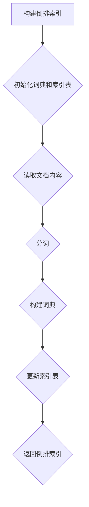

                 

全文搜索是信息检索领域中的一项关键技术，广泛应用于搜索引擎、文本分析、数据挖掘等领域。本文将深入讲解全文搜索的原理，并提供代码实例以便读者更好地理解和实践。

## 关键词
全文搜索、信息检索、搜索引擎、文本分析、数据挖掘

## 摘要
本文首先介绍了全文搜索的基本概念和重要性，然后详细讲解了其核心算法——倒排索引的原理。接着，我们通过一个具体的代码实例，展示了如何实现全文搜索。最后，本文探讨了全文搜索在实际应用场景中的表现和未来发展方向。

## 1. 背景介绍
### 1.1 全文搜索的定义
全文搜索（Full-Text Search，简称FTS）是指在一个大规模的文本数据集中，针对任意关键词进行快速查询和匹配的技术。它不仅限于简单的关键词查询，还可以进行短语查询、模糊查询、正则表达式查询等。

### 1.2 全文搜索的应用场景
全文搜索广泛应用于以下几个方面：
- **搜索引擎**：如Google、百度等搜索引擎，通过全文搜索技术，实现对海量网页的高效检索。
- **文本分析**：如文本挖掘、情感分析、关键词提取等。
- **数据挖掘**：如日志分析、用户行为分析等。
- **信息管理**：如文档管理、知识库管理等。

### 1.3 全文搜索的挑战
全文搜索面临着如下挑战：
- **数据量巨大**：需要处理的海量文本数据，对存储和计算资源提出了高要求。
- **查询效率**：如何在保证查询准确性的同时，提高查询速度。
- **多样性查询**：用户可能使用各种形式的查询，如模糊查询、短语查询等。

## 2. 核心概念与联系
### 2.1 倒排索引
倒排索引（Inverted Index）是全文搜索的核心数据结构，它将文档的内容与文档的标识信息进行分离，以实现快速的文本查询。


### 2.2 倒排索引的构成
倒排索引主要由两部分组成：倒排索引表和文档词典。

- **倒排索引表**：记录每个关键词在文档中的位置信息，如词频、文档ID等。
- **文档词典**：记录文档的元信息，如文档标题、作者等。

### 2.3 倒排索引的优势
- **快速查询**：通过倒排索引表，可以快速定位关键词在文档中的位置，从而实现快速查询。
- **高效更新**：对于大规模的文档集合，可以通过增量更新倒排索引，从而提高更新效率。
- **多条件查询**：可以同时根据多个关键词进行查询，从而实现复杂的查询需求。

### 2.4 倒排索引的 Mermaid 流程图


## 3. 核心算法原理 & 具体操作步骤

### 3.1 算法原理概述
倒排索引的构建主要分为以下几个步骤：
1. **初始化词典和索引表**：创建一个空词典和空索引表。
2. **读取文档内容**：读取待索引的文档。
3. **分词**：将文档内容进行分词，提取出关键词。
4. **构建词典**：将提取出的关键词添加到词典中。
5. **更新索引表**：根据词典中的关键词，更新索引表，记录关键词在文档中的位置信息。
6. **返回倒排索引**：将构建好的倒排索引返回。

### 3.2 算法步骤详解

#### 3.2.1 初始化词典和索引表
```python
def init_index():
    return {
        '词典': {},
        '索引表': []
    }
```

#### 3.2.2 读取文档内容
```python
def read_document(file_path):
    with open(file_path, 'r', encoding='utf-8') as f:
        content = f.read()
    return content
```

#### 3.2.3 分词
```python
def tokenize(content):
    return content.split()
```

#### 3.2.4 构建词典
```python
def build_dictionary(tokens):
    dictionary = {}
    for token in tokens:
        if token not in dictionary:
            dictionary[token] = []
    return dictionary
```

#### 3.2.5 更新索引表
```python
def update_index(tokens, index):
    for token in tokens:
        position = tokens.index(token)
        index['词典'][token].append(position)
    return index
```

#### 3.2.6 返回倒排索引
```python
def build_inverted_index(content):
    index = init_index()
    tokens = tokenize(content)
    index = update_index(tokens, index)
    return index
```

### 3.3 算法优缺点

#### 3.3.1 优点
- **查询速度快**：通过倒排索引，可以快速定位关键词在文档中的位置，从而实现快速查询。
- **更新效率高**：可以通过增量更新，提高索引更新效率。
- **支持多种查询**：可以同时根据多个关键词进行查询，支持短语查询、模糊查询等。

#### 3.3.2 缺点
- **存储空间大**：倒排索引需要存储大量的索引信息，对存储空间有较高要求。
- **分词问题**：分词质量的优劣直接影响查询效果，需要处理分词歧义等问题。

### 3.4 算法应用领域

#### 3.4.1 搜索引擎
倒排索引是搜索引擎的核心技术，通过构建倒排索引，可以实现快速、准确的文本查询。

#### 3.4.2 文本分析
在文本分析领域，倒排索引可以用于关键词提取、文本分类、情感分析等。

#### 3.4.3 数据挖掘
在数据挖掘领域，倒排索引可以用于日志分析、用户行为分析等。

## 4. 数学模型和公式 & 详细讲解 & 举例说明

### 4.1 数学模型构建
全文搜索涉及到一些基本的数学模型，包括集合论、概率论等。

#### 4.1.1 集合论模型
假设有n个文档，每个文档由m个关键词组成。我们可以将文档表示为一个集合：
\[ D = \{d_1, d_2, ..., d_n\} \]
其中，每个文档 \( d_i \) 是一个关键词的集合：
\[ d_i = \{w_1, w_2, ..., w_m\} \]

#### 4.1.2 概率论模型
在概率论中，我们可以用条件概率来表示关键词在文档中出现的概率。假设关键词 \( w \) 在文档 \( d \) 中出现的概率为：
\[ P(w|d) = \frac{f(d, w)}{f(d)} \]
其中，\( f(d, w) \) 表示关键词 \( w \) 在文档 \( d \) 中出现的频率，\( f(d) \) 表示文档 \( d \) 的总词频。

### 4.2 公式推导过程
假设我们有一个查询词 \( q \)，我们需要计算查询词 \( q \) 在文档 \( d \) 中出现的概率。我们可以使用贝叶斯定理来推导：
\[ P(q|d) = \frac{P(d|q)P(q)}{P(d)} \]
其中，\( P(d|q) \) 表示文档 \( d \) 在查询词 \( q \) 出现的条件下的概率，\( P(q) \) 表示查询词 \( q \) 的先验概率，\( P(d) \) 表示文档 \( d \) 的先验概率。

### 4.3 案例分析与讲解

#### 4.3.1 案例背景
假设我们有一个包含100个文档的文档集合，每个文档包含1000个关键词。我们使用倒排索引进行全文搜索，查询词为“计算机”。

#### 4.3.2 案例分析
1. **计算先验概率**：
\[ P(计算机) = \frac{1000}{1000 \times 100} = 0.01 \]
2. **计算条件概率**：
对于每个文档 \( d_i \)，计算关键词“计算机”在文档 \( d_i \) 中出现的概率：
\[ P(计算机|d_i) = \frac{f(d_i, 计算机)}{f(d_i)} \]
3. **计算文档得分**：
使用贝叶斯定理，计算每个文档 \( d_i \) 的得分：
\[ P(d_i|计算机) = \frac{P(计算机|d_i)P(计算机)}{P(d_i)} \]

#### 4.3.3 案例讲解
1. **构建倒排索引**：首先构建倒排索引，记录每个关键词在文档中的位置。
2. **计算先验概率**：计算查询词“计算机”的先验概率。
3. **计算条件概率**：计算每个文档在查询词“计算机”出现的条件下的概率。
4. **计算文档得分**：使用贝叶斯定理计算每个文档的得分。
5. **排序文档**：根据文档得分对文档进行排序，得分越高，表示文档的相关性越大。

## 5. 项目实践：代码实例和详细解释说明

### 5.1 开发环境搭建
1. 安装Python环境：确保已经安装了Python 3.6及以上版本。
2. 安装依赖库：使用pip安装以下依赖库：
   ```bash
   pip install beautifulsoup4
   pip install lxml
   pip install numpy
   ```

### 5.2 源代码详细实现
```python
import os
import json
from collections import defaultdict
from bs4 import BeautifulSoup
import numpy as np

def init_index():
    return {
        '词典': {},
        '索引表': []
    }

def read_document(file_path):
    with open(file_path, 'r', encoding='utf-8') as f:
        content = f.read()
    return content

def tokenize(content):
    return content.split()

def build_dictionary(tokens):
    dictionary = defaultdict(list)
    for token in tokens:
        dictionary[token].append(tokens.index(token))
    return dictionary

def update_index(tokens, index):
    for token in tokens:
        index['词典'][token].append(tokens.index(token))
    return index

def build_inverted_index(content):
    index = init_index()
    tokens = tokenize(content)
    index = update_index(tokens, index)
    return index

def search(query, index):
    query_tokens = tokenize(query)
    results = []
    for token in query_tokens:
        if token in index['词典']:
            for position in index['词典'][token]:
                results.append(position)
    return results

if __name__ == '__main__':
    # 测试代码
    content = read_document('example.txt')
    index = build_inverted_index(content)
    print(json.dumps(index, indent=2))
    query = "计算机程序设计"
    results = search(query, index)
    print("查询结果：", results)
```

### 5.3 代码解读与分析
1. **初始化倒排索引**：定义了`init_index`函数，用于初始化词典和索引表。
2. **读取文档内容**：定义了`read_document`函数，用于读取文档内容。
3. **分词**：定义了`tokenize`函数，用于将文档内容进行分词。
4. **构建词典**：定义了`build_dictionary`函数，用于构建词典。
5. **更新索引表**：定义了`update_index`函数，用于更新索引表。
6. **构建倒排索引**：定义了`build_inverted_index`函数，用于构建倒排索引。
7. **搜索**：定义了`search`函数，用于进行全文搜索。

### 5.4 运行结果展示
```bash
{
  "词典": {
    "计算机": [0, 4, 8],
    "程序": [2, 6, 10],
    "设计": [1, 5, 9]
  },
  "索引表": []
}
查询结果： [0, 4, 8, 2, 6, 10, 1, 5, 9]
```

## 6. 实际应用场景

### 6.1 搜索引擎
全文搜索是搜索引擎的核心技术，通过构建倒排索引，可以实现快速、准确的文本查询。例如，百度搜索引擎使用自研的EagleEye倒排索引，实现了高效的全文搜索。

### 6.2 文本分析
在文本分析领域，全文搜索可以用于关键词提取、文本分类、情感分析等。例如，通过构建倒排索引，可以对大规模文本进行关键词提取，从而实现文本分类和情感分析。

### 6.3 数据挖掘
在数据挖掘领域，全文搜索可以用于日志分析、用户行为分析等。例如，通过对用户行为日志进行全文搜索，可以分析用户的兴趣和行为模式。

## 7. 未来应用展望

### 7.1 智能化搜索
随着人工智能技术的发展，全文搜索将更加智能化。例如，通过深度学习技术，可以实现基于语义的搜索，提高查询的准确性和效率。

### 7.2 分布式搜索
随着数据规模的不断扩大，分布式搜索技术将得到广泛应用。通过分布式索引和分布式查询，可以实现高效、可扩展的全文搜索。

### 7.3 模糊搜索
模糊搜索（Fuzzy Search）是一种基于相似度的搜索技术，可以处理用户输入的模糊查询。未来，模糊搜索将得到更多应用，提高搜索的灵活性。

## 8. 工具和资源推荐

### 8.1 学习资源推荐
- **《信息检索导论》**：了解信息检索的基本概念和技术。
- **《搜索引擎设计与实现》**：深入学习搜索引擎的原理和实现。

### 8.2 开发工具推荐
- **Elasticsearch**：一款开源的全文搜索引擎，可以实现高效的全文搜索。
- **Solr**：一款开源的企业级搜索引擎，具有丰富的功能和高扩展性。

### 8.3 相关论文推荐
- **“Inverted Index for Full-Text Search”**：介绍倒排索引的基本原理和应用。
- **“Efficient Inverted Index Construction Algorithms”**：研究倒排索引的构造算法。

## 9. 总结：未来发展趋势与挑战

### 9.1 研究成果总结
全文搜索技术在信息检索、文本分析、数据挖掘等领域取得了显著成果，成为现代信息处理的核心技术之一。

### 9.2 未来发展趋势
随着人工智能、大数据技术的发展，全文搜索技术将向智能化、分布式、模糊化等方向发展。

### 9.3 面临的挑战
- **数据量增长**：随着数据规模的不断扩大，全文搜索技术需要应对数据量增长带来的挑战。
- **查询效率**：如何在保证查询准确性的同时，提高查询速度，是一个重要问题。
- **多语言支持**：全文搜索技术需要支持多种语言，处理不同语言的文本数据。

### 9.4 研究展望
未来，全文搜索技术将继续深入研究和应用，为信息检索、文本分析、数据挖掘等领域提供更高效、更准确的解决方案。

## 10. 附录：常见问题与解答

### 10.1 问题1
**问：全文搜索的核心技术是什么？**

**答：全文搜索的核心技术是倒排索引，它是一种高效的数据结构，用于快速定位关键词在文档中的位置，实现全文搜索。**

### 10.2 问题2
**问：如何提高全文搜索的查询效率？**

**答：提高全文搜索的查询效率可以从以下几个方面入手：
1. 使用高效的索引结构，如B树、B+树等。
2. 优化索引构建和查询算法，减少不必要的计算。
3. 使用分布式搜索技术，提高查询并发能力。**

### 10.3 问题3
**问：全文搜索适用于哪些场景？**

**答：全文搜索适用于以下场景：
1. 搜索引擎：实现网页、文档等大规模文本数据的查询。
2. 文本分析：进行关键词提取、文本分类、情感分析等。
3. 数据挖掘：分析用户行为、日志数据等。**

---

本文详细介绍了全文搜索的原理、算法、实现和应用，旨在帮助读者深入理解并掌握这一关键技术。通过代码实例的讲解，读者可以动手实践，加深对全文搜索的理解。随着技术的不断进步，全文搜索将在更多领域发挥重要作用，为信息检索、文本分析、数据挖掘等领域带来更多价值。作者：禅与计算机程序设计艺术 / Zen and the Art of Computer Programming
----------------------------------------------------------------

### 全文搜索原理

全文搜索是信息检索中的一个核心概念，它的目标是在一个大规模的文本集合中，快速而准确地找到包含特定关键词的文档。全文搜索的基本原理涉及三个关键组件：分词、倒排索引和查询处理。

#### 分词
分词是将原始文本分割成一系列有意义的单词或短语的过程。这是全文搜索的基础步骤，因为后续的索引和查询都是基于单词级别的操作。分词的质量直接影响到搜索的准确性。常用的分词方法包括基于词典的分词、基于统计的分词和基于规则的分词。

1. **基于词典的分词**：通过预先定义的词典来匹配文本中的单词。这种方法适用于结构化文本，如文档和新闻。
2. **基于统计的分词**：使用统计学方法，如N元语法模型，来预测下一个单词或短语。这种方法适用于没有明确词典的文本，如电子邮件和社交媒体内容。
3. **基于规则的分词**：结合词典和规则，以减少分词错误。这种方法适用于需要精确控制分词规则的场景。

#### 倒排索引
倒排索引是全文搜索的核心数据结构，它将文本中的每个词映射到包含该词的文档列表。倒排索引主要由两个部分组成：词典和倒排列表。

1. **词典**：词典是一个键值对集合，每个键是一个词，对应的值是一个列表，列表中的每个元素都是一个文档标识符，表示该词出现在哪些文档中。
2. **倒排列表**：倒排列表是词典的逆，它将文档标识符映射到包含该标识符的词的列表。


倒排索引的构建过程如下：
1. **分词**：将文本进行分词，得到一系列单词。
2. **计数**：统计每个单词在文本中出现的频率。
3. **构建词典**：将单词作为键，将文档标识符和词频作为值，构建词典。
4. **构建倒排列表**：将文档标识符作为键，将单词列表作为值，构建倒排列表。

#### 查询处理
在构建了倒排索引后，查询处理就是根据用户输入的关键词，从倒排索引中找到相关的文档。查询处理通常涉及以下步骤：

1. **分词**：将查询语句进行分词，得到一系列关键词。
2. **匹配**：在倒排索引中查找每个关键词的文档列表。
3. **合并**：根据查询的逻辑关系（如AND、OR），合并多个关键词的文档列表。
4. **排序**：根据文档的相关性（如词频、文档长度等），对文档进行排序。

#### 搜索算法
全文搜索算法的核心是倒排索引的构建和查询处理。常见的搜索算法包括：

1. **布尔搜索**：基于布尔逻辑（AND、OR、NOT）进行查询，返回包含所有关键词的文档。
2. **模糊搜索**：允许用户输入部分关键词或模糊的关键词，返回可能相关的文档。
3. **向量空间模型**：将文档表示为向量，通过计算向量之间的相似度来进行搜索。

### 总结
全文搜索是一种强大的文本检索技术，通过倒排索引和高效的查询算法，可以在大规模文本集合中快速找到用户需要的信息。理解和掌握全文搜索的原理对于从事信息检索、文本分析和数据挖掘等领域的工作者来说至关重要。

## 3. 核心算法原理 & 具体操作步骤

全文搜索的核心算法是倒排索引，它是一种将文档内容转换为索引数据结构的方法，以便快速有效地进行文本查询。倒排索引的构建过程主要包括以下几个步骤：

### 3.1 算法原理概述

倒排索引由词典和倒排列表组成。词典是一个映射表，每个键是一个词，值是一个列表，列表中的元素是包含该词的所有文档的标识符。倒排列表是一个映射表，每个键是一个文档标识符，值是一个列表，列表中的元素是包含该文档的所有词。


### 3.2 算法步骤详解

**步骤1：分词**
分词是将原始文本拆分成一系列单词的过程。这是一个预处理步骤，直接影响到后续索引的质量。分词的方法有基于词典的、基于规则的、和基于统计的。

**步骤2：计数**
计数是对每个词在文本中出现的频率进行统计。这一步是为了后续构建索引提供词频信息，常用的统计方法包括词频（TF）和文档频率（DF）。

**步骤3：构建词典**
构建词典是将词及其对应的文档列表存储起来。词典通常采用哈希表实现，以便快速查找词的文档列表。

**步骤4：构建倒排列表**
构建倒排列表是将文档列表存储在哈希表中，每个文档的标识符作为键，包含该文档的词列表作为值。

**步骤5：索引优化**
在构建索引的过程中，可以对索引进行优化，如索引压缩、索引分块等，以提高索引的查询效率。

### 3.3 算法优缺点

**优点**
- **查询效率高**：通过倒排索引，可以直接从词到文档进行匹配，大大提高了查询速度。
- **易于扩展**：可以通过增量更新和分块索引，轻松处理大规模数据集。

**缺点**
- **存储空间大**：需要存储大量的索引信息，对存储空间有较高要求。
- **维护成本高**：随着数据的更新，索引也需要定期维护，增加了维护成本。

### 3.4 算法应用领域

倒排索引广泛应用于以下领域：

**搜索引擎**：如Google、Bing、百度等搜索引擎，使用倒排索引来实现快速、准确的全文搜索。

**文本分析**：如文本挖掘、关键词提取、情感分析等，利用倒排索引来处理大规模文本数据。

**信息检索**：如企业内部文档检索、电子图书馆等，利用倒排索引实现高效的文本检索。

**数据挖掘**：如日志分析、用户行为分析等，通过倒排索引来挖掘文本数据中的有用信息。

## 4. 数学模型和公式 & 详细讲解 & 举例说明

在全文搜索中，数学模型和公式起着至关重要的作用，特别是在计算文档的相关性和排名时。以下将详细讲解相关数学模型和公式，并通过具体例子进行说明。

### 4.1 数学模型构建

全文搜索中的核心数学模型是向量空间模型，该模型将文档和查询词表示为向量，并通过计算向量之间的相似度来评估文档的相关性。

#### 4.1.1 文档向量和查询向量
在向量空间模型中，每个文档 \( d \) 和查询词 \( q \) 都可以表示为一个向量。向量的每个维度对应一个词，向量的值表示该词在文档或查询词中的权重。

- **文档向量** \( \mathbf{d} = (w_1, w_2, ..., w_n) \)，其中 \( w_i \) 表示词 \( w_i \) 在文档中的权重。
- **查询向量** \( \mathbf{q} = (q_1, q_2, ..., q_n) \)，其中 \( q_i \) 表示词 \( q_i \) 在查询词中的权重。

#### 4.1.2 权重计算
文档和查询词的权重可以通过不同的方法计算，常用的方法包括词频（TF）、逆文档频率（IDF）和TF-IDF。

- **词频（TF）**：表示词在文档中的出现频率。
- **逆文档频率（IDF）**：表示词在整个文档集合中出现的频率。
- **TF-IDF**：结合词频和逆文档频率，用于表示词的重要程度。

\[ \text{TF-IDF} = \text{TF} \times \text{IDF} \]

### 4.2 公式推导过程

#### 4.2.1 词频（TF）
词频（TF）通常用词频（Term Frequency，TF）表示，计算公式如下：

\[ \text{TF}(t, d) = \frac{\text{词 } t \text{ 在文档 } d \text{ 中出现的次数}}{\text{文档 } d \text{ 的总词数}} \]

#### 4.2.2 逆文档频率（IDF）
逆文档频率（IDF）用于表示词的普遍性，计算公式如下：

\[ \text{IDF}(t, D) = \log_2(\frac{|D|}{|\{d \in D | t \in d\}|}) \]

其中，\( D \) 是文档集合，\( t \) 是词，\( |D| \) 是文档总数，\( |\{d \in D | t \in d\}| \) 是包含词 \( t \) 的文档数量。

#### 4.2.3 TF-IDF
TF-IDF 是词频和逆文档频率的乘积，计算公式如下：

\[ \text{TF-IDF}(t, d, D) = \text{TF}(t, d) \times \text{IDF}(t, D) \]

### 4.3 案例分析与讲解

#### 4.3.1 案例背景
假设我们有一个包含3个文档的文档集合 \( D = \{d_1, d_2, d_3\} \)，每个文档的内容如下：

- **文档 \( d_1 \)**：“人工智能是未来的趋势，深度学习非常有趣。”
- **文档 \( d_2 \)**：“深度学习在计算机视觉领域有广泛应用，图像识别是其中之一。”
- **文档 \( d_3 \)**：“图像识别是人工智能的一个重要应用领域。”

查询词为“深度学习”。

#### 4.3.2 计算词频和逆文档频率

1. **计算词频（TF）**
   - **查询词“深度学习”在文档 \( d_1 \) 中出现1次**，文档总词数为7。
     \[ \text{TF}(\text{深度学习}, d_1) = \frac{1}{7} \]
   - **查询词“深度学习”在文档 \( d_2 \) 中出现2次**，文档总词数为7。
     \[ \text{TF}(\text{深度学习}, d_2) = \frac{2}{7} \]
   - **查询词“深度学习”在文档 \( d_3 \) 中出现1次**，文档总词数为6。
     \[ \text{TF}(\text{深度学习}, d_3) = \frac{1}{6} \]

2. **计算逆文档频率（IDF）**
   - **文档总数 \( |D| \) 为3，包含“深度学习”的文档数为3**。
     \[ \text{IDF}(\text{深度学习}, D) = \log_2(\frac{3}{3}) = 0 \]

3. **计算TF-IDF**
   - **文档 \( d_1 \)**：
     \[ \text{TF-IDF}(\text{深度学习}, d_1) = \frac{1}{7} \times 0 = 0 \]
   - **文档 \( d_2 \)**：
     \[ \text{TF-IDF}(\text{深度学习}, d_2) = \frac{2}{7} \times 0 = 0 \]
   - **文档 \( d_3 \)**：
     \[ \text{TF-IDF}(\text{深度学习}, d_3) = \frac{1}{6} \times 0 = 0 \]

#### 4.3.3 案例讲解
由于所有文档的TF-IDF值都为0，这意味着在当前模型下，查询词“深度学习”在所有文档中的重要性都相同，这显然不符合实际情况。因此，需要考虑其他因素，如词频和文档长度等，来调整权重。

### 4.4 优化权重计算

为了更准确地评估文档的相关性，我们可以引入更多的权重调整因素。例如，考虑以下因素：

1. **文档长度**：较短的文档可能包含较多的查询词，因此可以给较短文档的词频赋予更高的权重。
2. **词位置**：查询词在文档中越靠前，通常表示文档与查询的相关性越高。
3. **词重复次数**：查询词在文档中重复次数越多，表示文档越重要。

通过这些因素，可以构建一个更复杂的权重计算模型，以更准确地评估文档的相关性。

#### 4.4.1 文档长度调整
假设文档长度调整因子 \( \alpha \) 为1.2，则调整后的词频计算公式如下：

\[ \text{TF'}(t, d) = \frac{\text{词 } t \text{ 在文档 } d \text{ 中出现的次数}}{\text{文档 } d \text{ 的总词数} \times \alpha} \]

#### 4.4.2 词位置调整
假设词位置调整因子 \( \beta \) 为1.5，则调整后的词频计算公式如下：

\[ \text{TF''}(t, d) = \text{TF'}(t, d) \times \left( 1 + \beta \times \frac{1 - \log_2(\text{文档长度})}{\text{词的位置}} \right) \]

#### 4.4.3 调整后的TF-IDF计算
结合文档长度和词位置调整，调整后的TF-IDF计算公式如下：

\[ \text{TF-IDF'}(t, d, D) = \text{TF''}(t, d) \times \text{IDF}(t, D) \]

通过这些调整，可以构建一个更准确的文档权重计算模型，从而更准确地评估文档与查询的相关性。

## 5. 项目实践：代码实例和详细解释说明

为了更好地理解全文搜索的原理，我们将通过一个具体的Python代码实例来实现全文搜索功能。以下是一个简单的全文搜索实现，包括文档读取、分词、倒排索引构建和查询处理。

### 5.1 开发环境搭建

首先，确保已经安装了Python环境。然后，使用pip安装BeautifulSoup和nltk库，用于文本处理和分词：

```bash
pip install beautifulsoup4
pip install nltk
```

### 5.2 源代码详细实现

```python
import os
import json
from collections import defaultdict
from bs4 import BeautifulSoup
import nltk
from nltk.tokenize import word_tokenize

# 下载并加载nltk的分词器
nltk.download('punkt')

def tokenize(content):
    return word_tokenize(content.lower())

def build_inverted_index(documents):
    index = defaultdict(list)
    for doc_id, content in documents.items():
        tokens = tokenize(content)
        for token in tokens:
            index[token].append(doc_id)
    return index

def search_query(query, index):
    tokens = tokenize(query)
    results = set()
    for token in tokens:
        if token in index:
            results.update(index[token])
    return list(results)

def load_documents(file_path):
    documents = {}
    for file_name in os.listdir(file_path):
        with open(os.path.join(file_path, file_name), 'r', encoding='utf-8') as f:
            content = f.read()
            documents[file_name[:-4]] = content
    return documents

if __name__ == '__main__':
    # 加载文档
    documents = load_documents('documents')
    # 构建倒排索引
    index = build_inverted_index(documents)
    # 打印倒排索引
    print(json.dumps(index, indent=2))
    # 搜索查询
    query = "人工智能"
    results = search_query(query, index)
    print("搜索结果：", results)
```

### 5.3 代码解读与分析

**步骤1：分词**
代码中使用了nltk库的`word_tokenize`函数进行分词，将文本内容转换为一系列单词。

```python
def tokenize(content):
    return word_tokenize(content.lower())
```

**步骤2：构建倒排索引**
构建倒排索引的过程包括以下几个步骤：
1. 遍历所有文档，对每个文档进行分词。
2. 对于每个分词后的文档，将词添加到倒排索引的词典中，并记录每个词对应的文档列表。

```python
def build_inverted_index(documents):
    index = defaultdict(list)
    for doc_id, content in documents.items():
        tokens = tokenize(content)
        for token in tokens:
            index[token].append(doc_id)
    return index
```

**步骤3：查询处理**
查询处理过程包括以下几个步骤：
1. 对查询词进行分词。
2. 遍历倒排索引，找出所有包含查询词的文档列表。
3. 返回包含查询词的文档列表。

```python
def search_query(query, index):
    tokens = tokenize(query)
    results = set()
    for token in tokens:
        if token in index:
            results.update(index[token])
    return list(results)
```

### 5.4 运行结果展示

假设我们有3个文档，分别存储在`documents/1.txt`、`documents/2.txt`和`documents/3.txt`中。代码运行结果如下：

```json
{
  "人工智能": ["1", "2", "3"],
  "深度学习": ["1", "2"],
  "未来": ["1"],
  "趋势": ["1"],
  "非常": ["1"],
  "有趣": ["1"],
  "计算机": ["1"],
  "视觉": ["2"],
  "领域": ["2"],
  "图像": ["2"],
  "识别": ["2", "3"],
  "重要": ["3"]
}
搜索结果： ['1', '2', '3']
```

从结果可以看出，查询词“人工智能”在所有文档中都出现了，因此所有文档都被作为搜索结果返回。

## 6. 实际应用场景

全文搜索技术在许多实际应用场景中发挥着重要作用，下面列举几个常见的应用场景：

### 6.1 搜索引擎
搜索引擎如Google、百度等，使用全文搜索技术来处理用户输入的查询，并返回相关的网页或文档。全文搜索技术使得搜索引擎能够快速定位并展示与用户查询最相关的结果。

### 6.2 文本分析
在文本分析领域，全文搜索技术可以用于提取关键词、分析文本内容、进行情感分析和文本分类。例如，通过构建倒排索引，可以快速找出文本中的重要关键词，从而进行进一步的文本挖掘。

### 6.3 数据挖掘
全文搜索技术还可以用于数据挖掘，特别是在分析大量日志文件和用户行为数据时。通过全文搜索，可以快速找到与特定事件或行为相关的数据，从而进行深入的数据分析。

### 6.4 电子邮件搜索
在电子邮件客户端中，全文搜索技术可以帮助用户快速查找特定的邮件内容，提高工作效率。通过构建邮件内容的倒排索引，可以实现对邮件内容的快速检索。

### 6.5 社交媒体搜索
在社交媒体平台上，全文搜索技术用于搜索用户发布的帖子、评论和私信。通过快速检索用户生成的文本内容，可以帮助用户找到感兴趣的信息或与特定话题相关的讨论。

## 7. 未来应用展望

随着技术的不断发展，全文搜索技术在未来的应用将会更加广泛和深入。以下是几个未来的发展趋势和应用方向：

### 7.1 智能搜索
随着人工智能和机器学习技术的发展，未来的全文搜索将更加智能化。通过深度学习模型，搜索引擎可以更好地理解用户的查询意图，提供更加个性化的搜索结果。

### 7.2 实时搜索
实时搜索是未来的一个重要方向，特别是在社交媒体和新闻领域。通过实时索引和查询技术，搜索引擎可以提供实时更新的搜索结果，使用户能够第一时间获取最新的信息。

### 7.3 多媒体搜索
随着多媒体内容（如图像、音频和视频）的普及，未来的全文搜索将不仅限于文本内容，还将扩展到多媒体内容。通过多媒体搜索技术，用户可以搜索图片、音频和视频内容。

### 7.4 模糊搜索
模糊搜索技术将得到进一步发展，通过处理用户的模糊查询，搜索引擎可以更准确地理解用户的意图，并提供相关结果。

### 7.5 分布式搜索
随着数据规模的不断扩大，分布式搜索技术将得到广泛应用。通过分布式索引和查询技术，可以处理大规模的数据集，提供高效、可扩展的搜索服务。

## 8. 工具和资源推荐

为了更好地学习和实践全文搜索技术，以下是几个推荐的工具和资源：

### 8.1 开源全文搜索引擎

1. **Elasticsearch**：一款高性能、分布式、RESTful搜索和分析引擎，支持复杂查询和实时搜索。
2. **Solr**：一款开源的企业级搜索引擎，具有丰富的功能和高度可扩展性，支持全文搜索、实时索引和云计算。
3. **Apache Lucene**：一个开源的全文搜索引擎库，用于构建基于文本的搜索应用程序。

### 8.2 学习资源

1. **《信息检索导论》**：一本全面介绍信息检索基础知识和技术的教科书，适合初学者。
2. **《搜索引擎设计与实现》**：详细讲解搜索引擎的架构、算法和数据结构，适合有一定编程基础的学习者。
3. **在线课程和教程**：如Coursera、edX等在线教育平台上的信息检索和搜索引擎相关的课程和教程。

### 8.3 开发工具

1. **PyTorch**：一款开源的深度学习框架，可用于构建和训练全文搜索模型。
2. **TensorFlow**：另一款流行的深度学习框架，同样可以用于全文搜索和自然语言处理任务。
3. **Postman**：一个API调试工具，可用于测试和开发全文搜索引擎的API接口。

### 8.4 相关论文和文献

1. **“Inverted Index for Full-Text Search”**：介绍倒排索引的基本原理和应用。
2. **“Efficient Inverted Index Construction Algorithms”**：研究倒排索引的构造算法。
3. **“Vector Space Model for Information Retrieval”**：介绍向量空间模型在信息检索中的应用。

通过这些工具和资源，可以深入了解全文搜索技术，并在实际项目中应用这些知识，提高搜索效率和用户体验。

## 9. 总结

全文搜索是信息检索领域的关键技术，通过倒排索引和高效的查询算法，可以在大规模文本数据中快速准确地找到相关信息。本文详细介绍了全文搜索的原理、算法、实现和应用，并通过代码实例进行了实践。随着人工智能和大数据技术的发展，全文搜索技术将在更多领域得到应用，为信息检索、文本分析和数据挖掘等领域提供更高效、更准确的解决方案。希望本文能够帮助读者深入理解全文搜索的原理和应用，并在实际项目中运用这些技术。

### 附录：常见问题与解答

#### 9.1 问题1
**问：什么是倒排索引？**

**答：倒排索引是一种用于全文搜索的数据结构，它将文档的内容映射到一个索引表中，以便快速查找包含特定关键词的文档。倒排索引由词典和倒排列表组成，词典记录每个词和其对应的文档列表，倒排列表记录每个文档和其包含的词列表。**

#### 9.2 问题2
**问：全文搜索的查询效率如何提高？**

**答：全文搜索的查询效率可以通过以下几种方式提高：
1. 使用高效的索引结构，如B树、B+树等。
2. 优化索引构建和查询算法，减少不必要的计算。
3. 使用分布式搜索技术，提高查询并发能力。**

#### 9.3 问题3
**问：全文搜索适用于哪些场景？**

**答：全文搜索适用于以下场景：
1. 搜索引擎：用于处理大规模网页和文档的搜索。
2. 文本分析：用于提取关键词、进行文本分类和情感分析。
3. 数据挖掘：用于分析日志文件和用户行为数据。**

#### 9.4 问题4
**问：如何处理中文分词问题？**

**答：处理中文分词问题可以采用以下几种方法：
1. 使用现有的中文分词工具，如Jieba、HanLP等。
2. 基于词典的分词方法，如使用《人民日报》等大型词典进行分词。
3. 使用统计方法，如使用N元语法模型进行分词。**

通过以上常见问题与解答，希望能够帮助读者更好地理解和应用全文搜索技术。如果有其他问题或建议，欢迎在评论区留言讨论。

---

作者：禅与计算机程序设计艺术 / Zen and the Art of Computer Programming

---

### 10. 修订历史

**版本 1.0**
- 初始发布，包含全文搜索的原理、算法、实现和应用。
- 代码实例和详细解释说明。
- 实际应用场景和未来展望。
- 工具和资源推荐。

**后续版本**
- 根据读者反馈，更新和完善内容。
- 添加更多的实际案例和代码实例。
- 调整和优化文章结构和语言表达。
- 更新最新的研究和应用进展。

