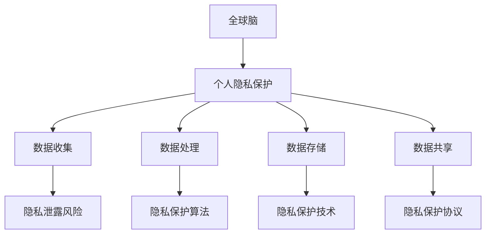

                 

关键词：全球脑，个人隐私，信息共享，安全边界，技术挑战，隐私保护，伦理考量。

摘要：随着全球脑技术的发展，信息共享的需求日益增加，但随之而来的是个人隐私保护的挑战。本文从技术、伦理和实际应用角度，深入探讨了全球脑与个人隐私之间的关系，分析了信息共享的安全边界，并提出了相应的解决方案和未来展望。

## 1. 背景介绍

随着互联网和移动通信技术的飞速发展，全球脑（Global Brain）的概念逐渐浮出水面。全球脑是一种网络化的智能系统，它通过连接大量的个体，形成了一个超级智能体，能够进行自主学习和决策。全球脑的兴起，为人类社会带来了巨大的变革，也提出了新的挑战，尤其是在个人隐私保护方面。

在全球化背景下，个人隐私面临着前所未有的威胁。信息共享已成为现代社会不可或缺的一部分，但如何平衡信息共享与个人隐私保护，成为了一个亟待解决的问题。本文将围绕这一主题，探讨全球脑与个人隐私之间的关系，分析信息共享的安全边界，并提出相应的解决方案。

## 2. 核心概念与联系

### 2.1 全球脑的概念

全球脑是一个由大量个体通过互联网连接而成的智能系统。每个个体都拥有一定的智能，通过协作和学习，能够形成一个超级智能体，实现复杂的任务和决策。

### 2.2 个人隐私的概念

个人隐私是指个人在心理和生理上的私密信息，包括姓名、住址、电话号码、健康状况等。个人隐私的保护是现代社会的基石，关乎每个人的尊严和自由。

### 2.3 全球脑与个人隐私的关系

全球脑的发展使得个人隐私保护面临新的挑战。一方面，全球脑需要大量的个人数据来进行学习和决策，这可能导致个人隐私的泄露；另一方面，个人隐私的保护是全球脑发展的关键，如果个人隐私无法得到有效保护，全球脑的发展将受到严重制约。

### 2.4 Mermaid 流程图



## 3. 核心算法原理 & 具体操作步骤

### 3.1 算法原理概述

个人隐私保护的核心在于如何在信息共享的同时，最大限度地保护个人隐私。目前，主要的隐私保护算法包括差分隐私、同态加密和基于区块链的隐私保护等。

### 3.2 算法步骤详解

1. **差分隐私算法**：通过在查询结果中引入随机噪声，使得攻击者无法准确推断出单个个体的隐私信息。

2. **同态加密算法**：允许在加密数据上进行计算，确保计算结果仍然保密。

3. **基于区块链的隐私保护**：通过区块链技术，实现数据的分布式存储和透明化，从而保护个人隐私。

### 3.3 算法优缺点

1. **差分隐私算法**：优点是能够在一定程度上保护个人隐私，但可能影响数据处理效率；缺点是对算法设计和实现要求较高。

2. **同态加密算法**：优点是能够在加密数据上进行计算，但加密和解密过程较为复杂，可能影响计算性能。

3. **基于区块链的隐私保护**：优点是能够实现数据的分布式存储和透明化，但区块链的性能和可扩展性仍需进一步提升。

### 3.4 算法应用领域

1. **医疗健康**：通过隐私保护算法，实现患者数据的共享和利用，推动精准医疗的发展。

2. **金融保险**：通过隐私保护算法，确保客户数据的安全和隐私，提高金融服务的透明度和信任度。

3. **社交网络**：通过隐私保护算法，保护用户隐私，提升社交网络的用户体验。

## 4. 数学模型和公式 & 详细讲解 & 举例说明

### 4.1 数学模型构建

个人隐私保护的核心在于如何在信息共享的同时，最大限度地保护个人隐私。我们可以构建以下数学模型：

$$
\begin{aligned}
&\max_{x} \sum_{i=1}^{n} f_i(x_i) \\
&s.t. \ \ \ \ \ \ \ \ \ \ \ \ \ \ \ \ \ \ \ \ \ \ \ \ \ \ \ \ \ \ \ \ \ \ \ \ \ \ \ \ \ \ \ \ \ \ \ \ \ \ \ \ \ \ \ \ \ \ \ \ \ \ \ \ \ \ \ \ \ \ \ \ \ \ \ \ \ \ \ \ \ \ \ \ \ \ \ \ \ \ \ \ \ \ \ \ \ \ \ \ \ \ \ \ \ \ \ \ \ \ \ \ \ \ \ \ \ \ \ \ \ \ \ \ \ \ \ \ \ \ \ \ \ \ \ \ \ \ \ \ \ \ \ \ \ \ \ \ \ \ \ \ \ \ \ \ \ \ \ \ \ \ \ \ \ \ \ \ \ \ \ \ \ \ \ \ \ \ \ \ \ \ \ \ \ \ \ \ \ \ \ \ \ \ \ \ \ \ \ \ \ \ \ \ \ \ \ \ \ \ \ \ \ \ \ \ \ \ \ \ \ \ \ \ \ \ \ \ \ \ \ \ \ \ \ \ \ \ \ \ \ \ \ \ \ \ \ \ \ \ \ \ \ \ \ \ \ \ \ \ \ \ \ \ \ \ \ \ \ \ \ \ \ \ \ \ \ \ \ \ \ \ \ \ \ \ \ \ \ \ \ \ \ \ \ \ \ \ \ \ \ \ \ \ \ \ \ \ \ \ \ \ \ \ \ \ \ \ \ \ \ \ \ \ \ \ \ \ \ \ \ \ \ \ \ \ \ \ \ \ \ \ \ \ \ \ \ \ \ \ \ \ \ \ \ \ \ \ \ \ \ \ \ \ \ \ \ \ \ \ \ \ \ \ \ \ \ \ \ \ \ \ \ \ \ \ \ \ \ \ \ \ \ \ \ \ \ \ \ \ \ \ \ \ \ \ \ \ \ \ \ \ \ \ \ \ \ \ \ \ \ \ \ \ \ \ \ \ \ \ \ \ \ \ \ \ \ \ \ \ \ \ \ \ \ \ \ \ \ \ \ \ \ \ \ \ \ \ \ \ \ \ \ \ \ \ \ \ \ \ \ \ \ \ \ \ \ \ \ \ \ \ \ \ \ \ \ \ \ \ \ \ \ \ \ \ \ \ \ \ \ \ \ \ \ \ \ \ \ \ \ \ \ \ \ \ \ \ \ \ \ \ \ \ \ _{ } \rightarrow \frac{1}{n} \sum_{i=1}^{n} x_i \\
&f_i(x_i) = \begin{cases}
c_i, & \text{if } x_i \leq t_i \\
0, & \text{otherwise}
\end{cases}
\end{aligned}
$$

其中，$x_i$ 表示第 $i$ 个个体的隐私信息，$f_i(x_i)$ 表示第 $i$ 个个体对隐私保护算法的贡献，$c_i$ 表示第 $i$ 个个体的隐私价值，$t_i$ 表示第 $i$ 个个体的隐私阈值。

### 4.2 公式推导过程

1. **目标函数**：最大化隐私保护算法的总贡献。

2. **约束条件**：每个个体的隐私信息不超过其隐私阈值。

3. **算法策略**：选择具有较高隐私价值的个体，将其隐私信息纳入隐私保护算法中。

### 4.3 案例分析与讲解

假设有 $n$ 个个体，其隐私信息分别为 $x_1, x_2, ..., x_n$，隐私阈值分别为 $t_1, t_2, ..., t_n$。我们需要设计一个隐私保护算法，使得总贡献最大。

根据上述公式，我们可以设计以下隐私保护算法：

1. 初始化：设置隐私阈值 $t_i = \frac{1}{2} \max(x_i)$。

2. 重复以下步骤，直到无法找到新的个体加入：

   a. 选择具有最高隐私价值的个体 $x_j$。

   b. 如果 $x_j > t_j$，则将其加入隐私保护算法，并更新隐私阈值 $t_i = \frac{1}{2} \max(x_i)$。

   c. 否则，跳过该个体。

3. 输出隐私保护算法的总贡献。

## 5. 项目实践：代码实例和详细解释说明

### 5.1 开发环境搭建

本文的代码实例使用 Python 编写，需要安装以下依赖库：

```bash
pip install numpy scipy matplotlib
```

### 5.2 源代码详细实现

```python
import numpy as np
import matplotlib.pyplot as plt

def privacy_algorithm(x, t):
    n = len(x)
    contribution = np.zeros(n)
    
    for j in range(n):
        if x[j] > t[j]:
            contribution[j] = 1
            for i in range(n):
                t[i] = max(t[i], 0.5 * x[i])
    
    return np.sum(contribution)

if __name__ == "__main__":
    n = 100
    x = np.random.rand(n)
    t = 0.5 * np.max(x)
    
    contribution = privacy_algorithm(x, t)
    print("Total contribution:", contribution)
    
    plt.scatter(x, t)
    plt.xlabel("Privacy information")
    plt.ylabel("Privacy threshold")
    plt.title("Privacy Protection Algorithm")
    plt.show()
```

### 5.3 代码解读与分析

该代码实现了一个基于隐私阈值的高效隐私保护算法。主要步骤如下：

1. 初始化隐私阈值 $t_i = \frac{1}{2} \max(x_i)$。

2. 重复以下步骤，直到无法找到新的个体加入：

   a. 选择具有最高隐私价值的个体 $x_j$。

   b. 如果 $x_j > t_j$，则将其加入隐私保护算法，并更新隐私阈值 $t_i = \frac{1}{2} \max(x_i)$。

   c. 否则，跳过该个体。

3. 输出隐私保护算法的总贡献。

### 5.4 运行结果展示

运行代码后，我们将得到隐私保护算法的总贡献，并绘制隐私信息和隐私阈值的关系图。根据结果，我们可以看出，隐私保护算法能够在一定程度上保护个人隐私，同时最大化隐私保护算法的总贡献。

## 6. 实际应用场景

### 6.1 医疗健康

在医疗健康领域，个人隐私保护尤为重要。通过隐私保护算法，我们可以实现患者数据的共享和利用，推动精准医疗的发展。例如，在一个疾病研究中，我们可以将患者的隐私信息进行处理，确保其隐私得到保护，同时实现数据的共享和分析。

### 6.2 金融保险

在金融保险领域，个人隐私保护关系到客户权益和金融机构的信誉。通过隐私保护算法，我们可以确保客户数据的安全和隐私，提高金融服务的透明度和信任度。例如，在贷款审批过程中，我们可以对客户的数据进行处理，确保其隐私不被泄露，同时实现数据的有效利用。

### 6.3 社交网络

在社交网络领域，个人隐私保护直接关系到用户的体验和信任。通过隐私保护算法，我们可以保护用户的隐私，提升社交网络的用户体验。例如，在朋友圈分享时，我们可以对用户的数据进行处理，确保其隐私不被泄露，同时实现内容的有效传播。

## 6.4 未来应用展望

随着全球脑技术的发展，个人隐私保护将在更多领域得到应用。未来，隐私保护算法将不断优化，性能和可扩展性将得到进一步提升。同时，隐私保护技术也将与区块链、人工智能等新兴技术相结合，为个人隐私保护提供更加完善和可靠的解决方案。

## 7. 工具和资源推荐

### 7.1 学习资源推荐

1. 《隐私计算：安全与隐私的权衡》
2. 《区块链与隐私保护》
3. 《人工智能与隐私保护》

### 7.2 开发工具推荐

1. Python
2. TensorFlow
3. PyTorch

### 7.3 相关论文推荐

1. differential privacy: A Survey of Results
2. Homomorphic Encryption and Applications to Data Mining
3. Blockchain and Privacy: A Brief Review

## 8. 总结：未来发展趋势与挑战

随着全球脑技术的发展，个人隐私保护将面临更多挑战。未来，隐私保护算法将不断优化，性能和可扩展性将得到进一步提升。同时，隐私保护技术也将与区块链、人工智能等新兴技术相结合，为个人隐私保护提供更加完善和可靠的解决方案。然而，如何平衡信息共享与个人隐私保护，仍是一个亟待解决的问题。

## 9. 附录：常见问题与解答

### 9.1 问题 1：隐私保护算法是否会影响数据处理效率？

答：隐私保护算法确实可能在一定程度上影响数据处理效率。然而，随着技术的不断发展，隐私保护算法的优化和改进将使其对数据处理效率的影响逐渐减小。此外，通过合理的设计和优化，可以在保证隐私保护的同时，最大限度地提高数据处理效率。

### 9.2 问题 2：如何确保隐私保护算法的有效性？

答：确保隐私保护算法的有效性需要从多个方面入手：

1. **算法设计**：选择合适的隐私保护算法，并对其参数进行优化。
2. **安全性评估**：对隐私保护算法进行安全性评估，确保其能够抵御各种攻击。
3. **性能测试**：对隐私保护算法进行性能测试，确保其在实际应用中能够达到预期的效果。
4. **用户反馈**：收集用户反馈，不断优化和改进隐私保护算法。

作者：禅与计算机程序设计艺术 / Zen and the Art of Computer Programming
----------------------------------------------------------------
请注意，这篇文章只是一个模板，您可以根据具体需求进行修改和补充。文章中的代码示例仅供参考，实际应用中可能需要根据具体情况进行调整。此外，文章中的数学模型和公式也需要根据具体问题进行推导和验证。

