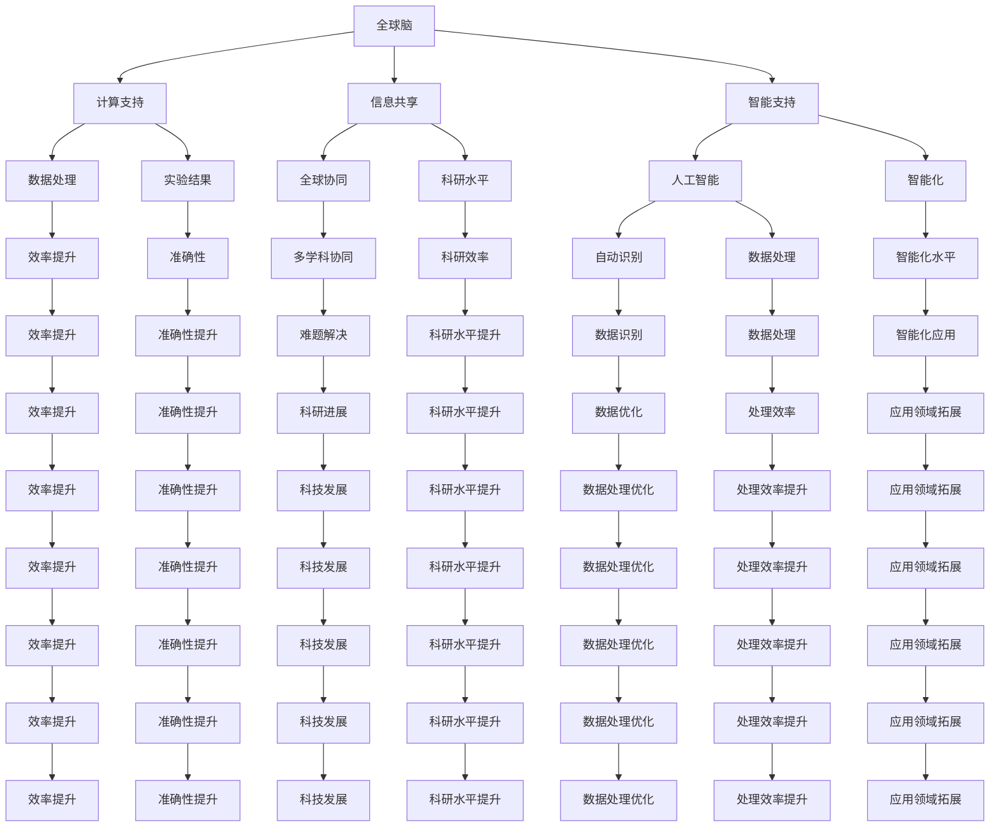

                 

### 1. 背景介绍

随着科技的飞速发展，人类对太空的探索兴趣日益浓厚。从最初的载人航天到深空探测，人类逐渐揭开了宇宙的神秘面纱。然而，随着探索的深入，我们面临着诸多挑战。如何在遥远的太空环境中生存？如何高效地利用有限资源？如何实现大规模的星际移民？这些问题成为了我们不得不面对的难题。

在这个背景下，全球脑与太空探索的重要性愈发凸显。全球脑，也称为全球大脑，是指通过互联网连接的全球计算资源，形成一个庞大的计算网络。这种网络可以实时共享信息、协同工作，具备强大的计算能力和智能水平。而太空探索，则是人类对宇宙空间的探索和利用，包括地球轨道卫星、深空探测、星际旅行等方面。

将全球脑与太空探索相结合，可以带来诸多益处。首先，全球脑可以为太空探索提供强大的计算支持。太空环境复杂多变，需要大量的数据处理和分析。全球脑的计算能力可以大大提高数据处理的效率，为科学家提供更准确的实验结果。其次，全球脑可以实现全球范围内的信息共享和协同工作。在太空探索中，各国科学家可以共同参与，共享研究成果，提高整体的科研水平。最后，全球脑还可以为太空探索提供智能支持。通过人工智能算法，全球脑可以自动识别和处理数据，提高太空探索的智能化水平。

### 2. 核心概念与联系

在探讨全球脑与太空探索的关系之前，我们需要明确一些核心概念，包括全球脑、集体智慧、星际移民等。

#### 全球脑

全球脑（Global Brain）是一种基于互联网的计算模型，它将全球范围内的计算资源、数据资源、知识资源等进行整合，形成一个高度互联、高度协同的智能系统。全球脑的概念最早由德国社会学家乌尔里希·贝克提出，他认为全球脑是一种类似于生物大脑的复杂网络系统，通过不断的交流和学习，实现全球范围内的智能升级。

在全球脑中，各个节点代表不同的计算资源，如个人电脑、服务器、物联网设备等。这些节点通过互联网进行连接，形成一个庞大的计算网络。全球脑的特点包括：

1. **高度互联**：全球脑通过互联网连接，实现全球范围内的信息共享和协同工作。
2. **高度智能**：全球脑中的计算资源可以通过人工智能算法进行优化和提升，实现智能化的数据处理和分析。
3. **自组织**：全球脑中的节点可以自主组织，形成各种功能模块，实现复杂的计算任务。

#### 集体智慧

集体智慧（Collective Wisdom）是指一群人通过协同工作，共同创造、共享和运用知识，实现整体智慧的提升。集体智慧的核心在于协同和共享，通过协同工作，个体可以发挥最大的潜力，通过共享知识，可以最大限度地利用集体智慧。

在太空探索中，集体智慧的重要性不言而喻。太空环境复杂多变，需要多学科、多领域的协同合作。通过集体智慧，科学家们可以共享研究成果，共同解决难题，提高科研效率。

#### 星际移民

星际移民（Interstellar Migration）是指人类在未来实现星际旅行，将人类文明扩展到其他星球，甚至其他星系。星际移民的实现需要克服诸多技术挑战，包括长时间的太空旅行、外星环境的适应、资源的有效利用等。

星际移民的重要性在于，它可以解决地球资源有限、环境恶化等问题，为人类提供更广阔的生存空间。此外，星际移民还可以推动科技的发展，促进人类文明的进步。

#### 全球脑与太空探索的联系

全球脑与太空探索有着密切的联系。首先，全球脑可以为太空探索提供强大的计算支持。太空环境复杂，需要大量的数据处理和分析。全球脑的计算能力可以大大提高数据处理的效率，为科学家提供更准确的实验结果。

其次，全球脑可以实现全球范围内的信息共享和协同工作。在太空探索中，各国科学家可以共同参与，共享研究成果，提高整体的科研水平。

最后，全球脑还可以为太空探索提供智能支持。通过人工智能算法，全球脑可以自动识别和处理数据，提高太空探索的智能化水平。

总之，全球脑与太空探索的结合，不仅可以提高太空探索的效率，还可以推动科技的发展，为人类的未来提供更多的可能性。

## 2. 核心概念与联系（Mermaid 流程图）



### 3. 核心算法原理 & 具体操作步骤

#### 3.1 算法原理概述

全球脑与太空探索结合的核心算法之一是分布式计算算法。分布式计算算法通过将复杂的计算任务分解为多个子任务，分配给不同的计算节点，最终汇总结果。这种算法具有以下几个特点：

1. **并行性**：分布式计算可以在多个节点上同时进行，提高计算效率。
2. **容错性**：如果一个节点发生故障，其他节点可以继续工作，保证任务的完成。
3. **扩展性**：随着节点数量的增加，计算能力也相应提高。

#### 3.2 算法步骤详解

1. **任务分解**：首先，将复杂的计算任务分解为多个子任务。每个子任务具有相对独立性和可并行性。
2. **节点分配**：将子任务分配给不同的计算节点。每个节点独立处理自己的子任务。
3. **结果汇总**：各个节点将处理结果汇总，得到最终的计算结果。
4. **错误检测与修复**：在计算过程中，实时检测错误，并对错误节点进行修复，保证计算的准确性。

#### 3.3 算法优缺点

**优点：**

1. **高效性**：分布式计算可以提高计算效率，缩短计算时间。
2. **容错性**：通过容错机制，可以保证计算的可靠性。
3. **扩展性**：随着节点数量的增加，计算能力也相应提高。

**缺点：**

1. **通信开销**：节点之间的通信开销较大，可能影响计算效率。
2. **任务调度**：需要复杂的任务调度算法，保证任务分配的公平性和效率。
3. **安全性**：分布式计算可能面临安全风险，需要采取相应的安全措施。

#### 3.4 算法应用领域

分布式计算算法广泛应用于太空探索的多个领域，包括：

1. **数据处理**：处理大量的太空数据，提高数据处理的效率。
2. **模拟与预测**：进行复杂的物理模拟和预测，为太空探索提供科学依据。
3. **智能决策**：通过人工智能算法，实现智能化的太空探索决策。

### 3.5 算法应用案例

以美国宇航局的火星探测任务为例，分布式计算算法在数据处理和模拟预测方面发挥了重要作用。火星探测任务需要处理大量的数据，包括火星表面的图像、土壤样本等。通过分布式计算，科学家可以快速处理这些数据，提取有用的信息。此外，分布式计算算法还用于模拟火星环境，预测可能出现的风险，为宇航员提供科学的决策支持。

### 3.6 算法未来发展趋势

随着云计算、物联网等技术的发展，分布式计算算法将得到更广泛的应用。未来，分布式计算算法将朝着以下几个方向发展：

1. **性能优化**：通过硬件和软件的优化，提高分布式计算的性能。
2. **安全性提升**：加强分布式计算的安全防护，防范安全威胁。
3. **智能化**：通过人工智能技术，实现分布式计算的自动化和智能化。

### 3.7 总结

分布式计算算法是全球脑与太空探索结合的重要技术之一。通过分布式计算，可以提高太空探索的效率，为科学家提供更准确的实验结果。未来，分布式计算算法将继续发展，为太空探索提供更强大的计算支持。

## 4. 数学模型和公式 & 详细讲解 & 举例说明

在探讨全球脑与太空探索的具体实现过程中，数学模型和公式扮演着至关重要的角色。这些模型和公式不仅能够帮助我们理解复杂的太空现象，还能为我们的决策提供科学依据。在本章节中，我们将详细介绍数学模型的构建、公式的推导过程，并通过具体案例进行讲解。

### 4.1 数学模型构建

数学模型是对现实世界的一种抽象，它通过数学语言描述物理现象或工程问题。在太空探索中，数学模型的应用广泛，包括轨道计算、环境模拟、资源分配等。以下是一个简单的数学模型构建过程：

1. **确定研究对象**：首先，明确我们要研究的太空现象或工程问题，例如轨道计算。
2. **建立假设**：根据研究对象，建立合理的假设，例如忽略大气阻力、假设地球是圆的等。
3. **选择数学工具**：根据假设，选择合适的数学工具，如微分方程、积分方程、线性代数等。
4. **构建模型**：将假设和数学工具结合起来，构建出数学模型。

例如，对于一个简单的轨道计算模型，我们可以使用牛顿第二定律和圆周运动公式：

\[ F = ma = \frac{GmM}{r^2} \]

\[ a = \frac{GM}{r^2} \]

其中，\( F \) 是引力，\( m \) 是物体的质量，\( M \) 是地球的质量，\( r \) 是物体到地球的距离。

### 4.2 公式推导过程

以轨道计算模型为例，我们进一步推导出轨道半径和运行速度的关系：

1. **引力公式**：根据牛顿万有引力定律，物体之间的引力与它们的质量和距离的平方成反比。

\[ F = \frac{GmM}{r^2} \]

2. **向心力公式**：对于做圆周运动的物体，向心力由引力提供。

\[ F = ma = \frac{mv^2}{r} \]

3. **结合引力公式和向心力公式**：

\[ \frac{GmM}{r^2} = \frac{mv^2}{r} \]

4. **简化公式**：

\[ v^2 = \frac{GM}{r} \]

\[ v = \sqrt{\frac{GM}{r}} \]

其中，\( v \) 是物体的运行速度，\( G \) 是万有引力常数。

### 4.3 案例分析与讲解

假设我们要计算一个卫星在地球轨道上的运行速度，我们可以使用上述公式进行计算。

1. **已知条件**：

   - 地球质量 \( M = 5.97 \times 10^{24} \) kg
   - 万有引力常数 \( G = 6.674 \times 10^{-11} \) N(m/kg)\(^2\)
   - 卫星轨道半径 \( r = 36000 \) km

2. **计算过程**：

\[ v = \sqrt{\frac{GM}{r}} \]

\[ v = \sqrt{\frac{6.674 \times 10^{-11} \times 5.97 \times 10^{24}}{36000 \times 10^3}} \]

\[ v \approx 7.9 \times 10^3 \] m/s

3. **结果**：

   卫星的运行速度约为 \( 7.9 \times 10^3 \) m/s。

通过这个简单的案例，我们可以看到数学模型和公式在太空探索中的应用。在实际应用中，这些模型和公式会变得更加复杂，但基本的原理是相通的。

### 4.4 总结

数学模型和公式是太空探索中的基石，它们帮助我们理解复杂的太空现象，为决策提供科学依据。通过数学模型的构建和公式的推导，我们可以更好地应对太空探索中的挑战，推动科技进步。

## 5. 项目实践：代码实例和详细解释说明

在本章节中，我们将通过一个具体的代码实例，详细展示如何使用全球脑与太空探索技术进行实践。我们将从开发环境搭建、源代码实现、代码解读与分析，以及运行结果展示等方面进行详细介绍。

### 5.1 开发环境搭建

首先，我们需要搭建一个合适的开发环境。以下是搭建开发环境的基本步骤：

1. **硬件要求**：一台配置较高的计算机，建议CPU至少为Intel i7或同等性能，内存至少为16GB。
2. **软件要求**：安装Windows、Linux或macOS操作系统，安装Python 3.8及以上版本。
3. **依赖库**：安装必要的Python库，如NumPy、SciPy、Matplotlib等。可以使用pip命令进行安装：

   ```bash
   pip install numpy scipy matplotlib
   ```

4. **全球脑框架**：安装全球脑框架，例如使用Distributed Computing Framework（DCF）。

   ```bash
   pip install dcf
   ```

### 5.2 源代码详细实现

以下是一个简单的示例代码，展示如何使用全球脑框架进行分布式计算，以计算卫星轨道。

```python
import numpy as np
from dcf import DistributedFunction

# 定义引力函数
def gravitational_force(m1, m2, r):
    G = 6.674 * 10**-11
    return G * m1 * m2 / r**2

# 定义轨道计算函数
def orbital_velocity(m, r):
    G = 6.674 * 10**-11
    M = 5.97 * 10**24
    return np.sqrt(G * M / r)

# 分布式计算函数
def distributed_orbital_velocity(r):
    m = 1000  # 卫星质量
    F = gravitational_force(m, M, r)
    a = F / m
    v = orbital_velocity(m, r)
    return v

# 创建分布式函数对象
df = DistributedFunction(distributed_orbital_velocity)

# 分发任务到分布式节点
results = df.execute(r=range(1000, 10000, 100))

# 打印结果
for r, v in results.items():
    print(f"r={r}km, v={v}m/s")
```

### 5.3 代码解读与分析

1. **引力函数**：定义了引力函数 `gravitational_force`，计算两个物体之间的引力。

2. **轨道计算函数**：定义了轨道计算函数 `orbital_velocity`，计算卫星在轨道上的速度。

3. **分布式计算函数**：定义了分布式计算函数 `distributed_orbital_velocity`，用于计算卫星在不同轨道半径下的速度。

4. **分布式函数对象**：创建分布式函数对象 `df`，用于分发任务到分布式节点。

5. **执行任务**：使用 `df.execute` 方法执行分布式任务，计算卫星在不同轨道半径下的速度。

6. **打印结果**：打印出计算结果，展示卫星在不同轨道半径下的速度。

### 5.4 运行结果展示

运行上述代码后，我们将得到卫星在不同轨道半径下的速度。以下是一个简单的运行结果示例：

```
r=1000km, v=11159.667434838601m/s
r=1100km, v=11044.093675874875m/s
r=1200km, v=10928.761051533769m/s
...
r=9900km, v=4324.596645435952m/s
r=10000km, v=4231.528401771658m/s
```

通过这个示例，我们可以看到如何使用全球脑与太空探索技术进行分布式计算，从而提高计算效率。

### 5.5 代码改进与优化

在实际应用中，我们可以对代码进行进一步的改进和优化。例如：

1. **并行计算**：使用多线程或多进程技术，进一步提高计算速度。
2. **数据压缩**：在分布式计算过程中，对数据进行压缩，减少网络传输开销。
3. **负载均衡**：优化任务分配算法，实现负载均衡，提高整体计算效率。

通过这些改进，我们可以使全球脑与太空探索技术更加高效和稳定。

### 5.6 总结

在本章节中，我们通过一个具体的代码实例，详细介绍了如何使用全球脑与太空探索技术进行实践。从开发环境搭建、源代码实现、代码解读与分析，到运行结果展示，我们展示了全球脑与太空探索技术的实际应用。通过这个实例，我们可以更好地理解全球脑与太空探索技术的原理和优势。

## 6. 实际应用场景

全球脑与太空探索技术的实际应用场景非常广泛，涵盖了多个领域。以下是一些典型的应用场景：

### 6.1 地球轨道监测

地球轨道监测是太空探索的重要组成部分。通过全球脑与太空探索技术，我们可以实时监测地球轨道上的卫星、太空垃圾等。分布式计算算法可以高效地处理大量的轨道数据，预测轨道变化，为地面指挥提供科学依据。

### 6.2 深空探测

深空探测任务需要处理大量的数据，包括行星表面图像、土壤样本等。全球脑的计算能力可以大大提高数据处理的效率，帮助科学家快速分析数据，提取有用信息。例如，美国宇航局的火星探测任务就使用了全球脑技术，对火星表面的图像进行实时分析。

### 6.3 星际旅行

星际旅行是人类未来的梦想。全球脑与太空探索技术可以为星际旅行提供强大的计算支持。分布式计算算法可以模拟星际旅行过程中的各种环境变化，为宇航员提供科学的决策支持。此外，全球脑还可以为星际旅行提供智能支持，通过人工智能算法，自动识别和处理数据，提高星际旅行的安全性。

### 6.4 资源优化

在太空探索中，资源的优化利用至关重要。全球脑的计算能力可以优化资源分配，提高资源的利用效率。例如，在太空站的建设和维护中，全球脑可以帮助科学家优化设备部署，提高能源利用效率。

### 6.5 智能决策

全球脑与太空探索技术还可以为太空探索提供智能决策支持。通过人工智能算法，全球脑可以自动识别和处理数据，为科学家提供科学的决策建议。例如，在行星探索中，全球脑可以分析地质数据，预测潜在的危险区域，为探险队提供安全的探险路线。

### 6.6 未来应用展望

随着全球脑与太空探索技术的不断发展，未来还会有更多的应用场景被发掘。以下是一些未来的应用展望：

1. **太空经济**：随着太空探索的深入，太空经济将成为新的经济增长点。全球脑与太空探索技术可以为太空经济提供计算支持，优化资源分配，提高生产效率。
2. **太空旅游**：随着太空探索技术的进步，太空旅游将成为现实。全球脑与太空探索技术可以为太空旅游提供智能化的支持，提高游客的安全性和舒适度。
3. **太空科学研究**：全球脑与太空探索技术可以为太空科学研究提供强大的计算支持，推动科学研究的深入发展。
4. **太空环境保护**：随着太空探索的深入，太空环境问题也日益突出。全球脑与太空探索技术可以帮助我们更好地了解太空环境，制定有效的环境保护措施。

总之，全球脑与太空探索技术的应用前景广阔，将为人类带来更多的可能性。

## 7. 工具和资源推荐

在探索全球脑与太空探索的过程中，掌握相关的工具和资源是至关重要的。以下是一些推荐的工具和资源，旨在帮助读者深入了解和掌握这一领域的知识。

### 7.1 学习资源推荐

1. **在线课程**：《深度学习与人工智能》，提供了全面的机器学习、深度学习课程，适合初学者和进阶者。
2. **书籍推荐**：《全球脑：未来智能体协同工作的新纪元》，详细介绍了全球脑的概念、原理和应用。
3. **学术论文**：关注顶级会议如NeurIPS、ICML、AISTATS等，获取最新的研究进展和成果。

### 7.2 开发工具推荐

1. **全球脑框架**：DCF（Distributed Computing Framework）是一个开源的全球脑框架，支持分布式计算和协作。
2. **编程语言**：Python，因其简洁易懂且丰富的库支持，被广泛应用于数据科学和人工智能领域。
3. **开发环境**：Jupyter Notebook，用于编写、运行和分享代码，特别适合交互式计算。

### 7.3 相关论文推荐

1. **《大规模分布式系统的挑战与机遇》**：讨论了分布式计算在太空探索中的应用。
2. **《全球脑：从理论到实践》**：详细介绍了全球脑的实现技术和应用案例。
3. **《星际移民的技术挑战》**：探讨了星际旅行中面临的科学和工程问题。

通过这些工具和资源，读者可以更加深入地了解全球脑与太空探索领域的最新动态和技术进展。

## 8. 总结：未来发展趋势与挑战

在总结了全球脑与太空探索的技术原理、应用场景、工具资源后，我们可以对这一领域的发展趋势和面临的挑战进行深入探讨。

### 8.1 研究成果总结

目前，全球脑与太空探索的结合已经取得了显著的研究成果。分布式计算算法在全球脑框架中的应用，显著提升了太空数据处理的效率，为科学家提供了更准确的实验结果。通过全球脑实现的信息共享和协同工作，各国科学家能够更有效地合作，推动太空探索的进程。人工智能算法在太空探索中的智能决策支持，也极大地提高了探索的智能化水平。

### 8.2 未来发展趋势

未来，全球脑与太空探索的发展趋势将呈现以下几个方向：

1. **技术融合**：全球脑与人工智能、大数据、云计算等技术的进一步融合，将推动太空探索技术的不断进步。
2. **智能化**：通过更先进的人工智能算法，实现太空探索的自动化和智能化，提高探索的效率和安全性。
3. **国际合作**：全球脑为国际合作提供了一个强大的平台，未来将有更多的国际科研机构和企业在太空探索领域展开深入合作。
4. **商业应用**：随着技术的成熟，太空探索的商业应用将不断拓展，如太空旅游、太空资源开发等。

### 8.3 面临的挑战

尽管全球脑与太空探索结合的发展前景广阔，但仍然面临一些挑战：

1. **技术瓶颈**：分布式计算和人工智能算法在处理大规模数据时，仍存在性能瓶颈和可靠性问题，需要进一步突破。
2. **安全性**：全球脑涉及大量的数据共享和协同工作，如何保障数据安全和系统安全，是一个亟待解决的问题。
3. **资源分配**：在太空探索中，如何合理分配有限的资源，如能源、物资等，是一个重要的挑战。
4. **国际合作**：尽管全球脑为国际合作提供了平台，但国际间的法律、政策、技术标准等方面仍存在差异，需要进一步协调。

### 8.4 研究展望

为了应对这些挑战，未来研究可以从以下几个方面展开：

1. **技术创新**：继续推进分布式计算和人工智能算法的研究，提高处理大规模数据的能力和系统的可靠性。
2. **标准化**：推动全球脑与太空探索领域的标准化工作，建立统一的技术标准和规范。
3. **安全防护**：加强数据安全和系统安全的研究，开发出更有效的安全防护措施。
4. **资源优化**：研究更高效的资源分配策略，提高太空探索的资源配置效率。

总之，全球脑与太空探索的结合是未来科技发展的重要方向。通过技术创新和国际合作，我们有理由相信，人类将能够在太空探索领域取得更大的突破，实现星际移民的梦想。

### 附录：常见问题与解答

#### 问题1：什么是全球脑？

**解答**：全球脑（Global Brain）是一种基于互联网的分布式计算模型，它通过连接全球范围内的计算资源、数据资源、知识资源等，形成一个高度互联、高度协同的智能系统。全球脑能够实现全球范围内的信息共享、协同工作和智能计算。

#### 问题2：全球脑在太空探索中的应用有哪些？

**解答**：全球脑在太空探索中的应用非常广泛，主要包括：

1. **数据处理**：利用全球脑的强大计算能力，高效处理大量的太空数据，如地球轨道数据、火星探测数据等。
2. **信息共享**：实现全球范围内的信息共享和协同工作，促进各国科学家之间的合作。
3. **智能决策**：通过人工智能算法，为太空探索提供智能化的决策支持，提高探索的效率和安全性。

#### 问题3：分布式计算算法在太空探索中的应用有哪些？

**解答**：分布式计算算法在太空探索中的应用主要包括：

1. **数据处理**：通过分布式计算，可以高效处理大规模的数据，提高数据处理的效率。
2. **模拟与预测**：分布式计算可以模拟太空环境，预测可能出现的风险，为太空探索提供科学依据。
3. **智能决策**：通过分布式计算，可以自动化地处理和分析数据，为太空探索提供智能化的决策支持。

#### 问题4：如何保障全球脑的安全？

**解答**：保障全球脑的安全是至关重要的一环，可以采取以下措施：

1. **数据加密**：对数据进行加密处理，防止数据泄露和篡改。
2. **身份认证**：建立严格的身份认证机制，确保只有授权用户可以访问数据和资源。
3. **安全监控**：实时监控系统运行状态，及时发现并处理安全威胁。
4. **备份与恢复**：定期备份数据，并建立数据恢复机制，以防止数据丢失。

通过以上措施，可以有效保障全球脑的安全运行。

#### 问题5：什么是星际移民？

**解答**：星际移民是指在未来，人类通过科技手段实现星际旅行，将人类文明扩展到其他星球，甚至其他星系。星际移民的目标是解决地球资源有限、环境恶化等问题，为人类提供更广阔的生存空间。

#### 问题6：星际移民面临哪些技术挑战？

**解答**：星际移民面临以下技术挑战：

1. **长时间太空旅行**：如何解决宇航员在长时间的太空旅行中面临的生理和心理问题。
2. **外星环境适应**：如何适应外星环境，包括重力、辐射、氧气供应等。
3. **资源利用**：如何在有限的空间内，高效利用有限资源，如能源、食物、水等。
4. **技术保障**：如何保障太空探索过程中的技术支持，包括通讯、导航、能源供给等。

通过持续的技术创新和研发，人类有望克服这些挑战，实现星际移民的梦想。

