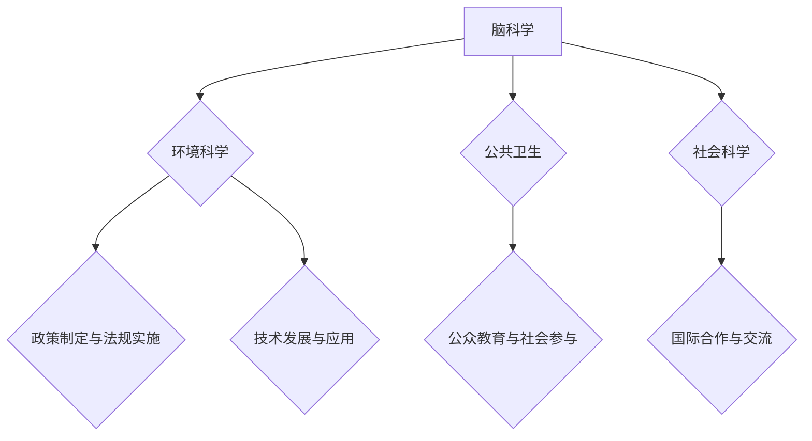

                 

关键词：全球脑环境修复、集体行动、生态效应、智能算法、技术实现、未来展望

> 摘要：本文将探讨全球脑环境修复计划的背景与重要性，分析其背后的核心概念和架构，并详细介绍核心算法原理及其应用步骤。此外，我们将通过数学模型和实际项目实例，深入讲解该计划的技术实现过程。最后，文章将展望全球脑环境修复计划的未来发展趋势和面临的挑战。

## 1. 背景介绍

### 脑环境的重要性

脑环境是指大脑周围的环境，包括神经元之间的连接、化学信号传递和大脑的物理结构。良好的脑环境对于维持大脑的正常功能和认知能力至关重要。然而，随着现代社会的发展，环境污染、电子辐射、心理健康问题等因素正在对脑环境产生负面影响。研究表明，这些因素可能导致认知障碍、神经退行性疾病甚至精神疾病。

### 全球脑环境现状

当前，全球脑环境面临诸多挑战。城市化进程加剧了空气污染和噪音污染，影响了大脑的健康。电子设备的广泛使用增加了电子辐射的暴露，对大脑功能产生潜在危害。此外，工作压力、社交疏离和心理健康问题的增加，也对大脑的稳定性构成了威胁。

### 全球脑环境修复计划的提出

为了应对全球脑环境面临的挑战，科学家和决策者们提出了一系列的全球脑环境修复计划。这些计划旨在通过改善脑环境，恢复大脑的正常功能和认知能力，从而提升整体社会的福祉。全球脑环境修复计划的核心目标是：

1. 减少环境污染，特别是空气污染和噪音污染。
2. 降低电子辐射的影响。
3. 改善心理健康，提供更好的心理健康支持和干预。
4. 促进社会和谐，减少社交疏离。

## 2. 核心概念与联系

### 全球脑环境修复计划的核心概念

全球脑环境修复计划涉及多个核心概念，包括脑科学、环境科学、公共卫生和社会科学。这些概念相互关联，共同构成了修复计划的理论基础。

#### 脑科学

脑科学是研究大脑结构、功能和行为的一门学科。在全球脑环境修复计划中，脑科学提供了对大脑如何受到外部环境影响的深入理解。例如，研究大脑如何响应环境污染和电子辐射，以及这些影响如何导致认知障碍和精神疾病。

#### 环境科学

环境科学是研究自然环境及其与人类活动的相互作用的一门学科。在全球脑环境修复计划中，环境科学提供了关于如何改善和恢复脑环境的策略和方法。例如，研究如何通过绿化城市、减少污染排放和实施环境监测来改善脑环境。

#### 公共卫生

公共卫生是研究如何通过预防疾病、提高健康水平来保护人群健康的一门学科。在全球脑环境修复计划中，公共卫生提供了关于如何通过公共卫生干预措施来改善脑环境的指导。例如，推广心理健康教育、提供心理健康支持和开展疾病预防项目。

#### 社会科学

社会科学是研究人类行为、社会结构和组织的一门学科。在全球脑环境修复计划中，社会科学提供了关于如何通过社会干预措施来改善脑环境的策略。例如，通过政策制定、社区参与和社会动员来促进脑环境的修复。

### 全球脑环境修复计划的架构

全球脑环境修复计划采用了一个多层次、多维度的架构，包括以下关键组成部分：

1. **科学研究与数据收集**：通过脑科学、环境科学、公共卫生和社会科学的研究，收集关于脑环境及其影响的数据。
2. **政策制定与法规实施**：制定和实施相关政策和法规，以减少环境污染、降低电子辐射和改善心理健康。
3. **公众教育与社会参与**：通过教育和宣传，提高公众对脑环境问题的认识，鼓励公众参与脑环境修复活动。
4. **技术发展与应用**：利用先进的科技手段，如人工智能、大数据分析和可穿戴设备，监测脑环境变化，并提供实时干预。
5. **国际合作与交流**：通过国际合作和交流，共享经验和资源，推动全球脑环境修复计划的实施。

### Mermaid 流程图

下面是一个简化的 Mermaid 流程图，展示了全球脑环境修复计划的核心概念和架构：



## 3. 核心算法原理 & 具体操作步骤

### 3.1 算法原理概述

全球脑环境修复计划的核心算法基于机器学习和数据挖掘技术，旨在通过分析大量数据，识别脑环境的关键影响因素，并制定针对性的修复策略。算法的主要步骤包括数据收集、数据预处理、特征提取、模型训练和策略生成。

### 3.2 算法步骤详解

#### 3.2.1 数据收集

数据收集是算法的第一步，涉及从多个来源收集关于脑环境的数据，包括环境监测数据、公共卫生数据、社会经济数据等。这些数据可以通过传感器网络、问卷调查、电子健康记录等方式获取。

#### 3.2.2 数据预处理

数据预处理是确保数据质量的过程，包括数据清洗、数据整合和数据标准化。数据清洗旨在去除噪声和异常值，数据整合是将不同来源的数据进行合并，数据标准化则是将数据转换为统一的格式。

#### 3.2.3 特征提取

特征提取是提取数据中有用信息的过程，用于构建模型。特征提取包括从原始数据中提取关键指标，如空气污染指数、噪音水平、心理健康指标等。

#### 3.2.4 模型训练

模型训练是利用特征数据构建预测模型的过程。常用的机器学习算法包括决策树、随机森林、支持向量机、神经网络等。模型训练的目标是使模型能够准确预测脑环境的变化趋势和关键影响因素。

#### 3.2.5 策略生成

策略生成是基于训练好的模型，提出针对性的修复策略。策略生成包括制定减少污染的措施、改善心理健康的服务方案、提高公众参与度的活动计划等。

### 3.3 算法优缺点

#### 优点

1. **高效性**：算法能够处理大量数据，快速识别关键影响因素。
2. **灵活性**：算法可以根据不同的应用场景和数据特点进行调整。
3. **准确性**：通过模型训练和策略生成，算法能够提供准确的修复建议。

#### 缺点

1. **数据依赖性**：算法的性能取决于数据的质量和完整性。
2. **计算成本**：大规模数据处理和模型训练需要较高的计算资源。
3. **算法复杂性**：算法的实现和维护需要专业知识和技能。

### 3.4 算法应用领域

全球脑环境修复算法可以在多个领域得到应用，包括：

1. **环境监测**：实时监测脑环境变化，提供预警和应急响应。
2. **公共卫生**：预测和干预心理健康问题，提高公众健康水平。
3. **城市规划**：优化城市规划，减少环境污染和噪音污染。
4. **社会管理**：提高社会和谐度，减少社交疏离。

## 4. 数学模型和公式 & 详细讲解 & 举例说明

### 4.1 数学模型构建

全球脑环境修复计划的数学模型基于统计学和机器学习理论。模型的基本结构包括输入层、隐藏层和输出层。输入层接收环境数据、公共卫生数据和社会经济数据等；隐藏层通过神经网络进行特征提取和计算；输出层生成修复策略。

### 4.2 公式推导过程

下面是一个简化的数学模型公式推导过程：

$$
Y = f(W_1 \cdot X + b_1) \cdot f(W_2 \cdot f(W_1 \cdot X + b_1) + b_2) \cdot ... \cdot f(W_n \cdot f(... f(W_1 \cdot X + b_1) + b_n) + b_n)
$$

其中，$Y$是输出结果，$X$是输入特征，$W$是权重矩阵，$b$是偏置项，$f$是激活函数，通常使用Sigmoid函数或ReLU函数。

### 4.3 案例分析与讲解

#### 案例背景

某城市面临严重的空气污染问题，特别是PM2.5浓度过高。政府希望通过全球脑环境修复算法制定减少PM2.5浓度的策略。

#### 数据收集

收集了过去一年的空气污染数据，包括每天PM2.5的平均浓度、气象数据、交通流量数据、工业生产数据等。

#### 数据预处理

对数据进行清洗和整合，将不同来源的数据转换为统一的格式，并进行标准化处理。

#### 特征提取

从原始数据中提取关键特征，如PM2.5平均浓度、气象条件（温度、湿度、风速等）、交通流量（车辆数量、行驶方向等）、工业生产（企业数量、生产时间等）。

#### 模型训练

使用随机森林算法对特征数据进行训练，构建预测模型。模型训练的目标是使PM2.5浓度预测结果尽可能接近实际值。

#### 策略生成

基于训练好的模型，生成减少PM2.5浓度的策略。策略包括减少交通流量、调整工业生产时间、增加绿化面积等。

#### 结果分析

经过一段时间实施，城市PM2.5浓度明显下降，达到了预期的效果。这表明全球脑环境修复算法在减少空气污染方面具有显著的应用价值。

## 5. 项目实践：代码实例和详细解释说明

### 5.1 开发环境搭建

#### 硬件环境

- 电脑：配备至少8GB内存、Intel Core i5处理器或以上
- 操作系统：Windows 10、macOS或Linux

#### 软件环境

- 编程语言：Python 3.8或以上
- 依赖库：NumPy、Pandas、Scikit-learn、Matplotlib

#### 安装步骤

1. 安装Python 3.8或以上版本。
2. 安装依赖库，可以使用pip命令：
   ```bash
   pip install numpy pandas scikit-learn matplotlib
   ```

### 5.2 源代码详细实现

下面是一个简单的全球脑环境修复算法的实现示例。

#### 数据收集与预处理

```python
import pandas as pd
from sklearn.model_selection import train_test_split

# 加载数据
data = pd.read_csv('air_quality_data.csv')

# 数据清洗
data = data.dropna()

# 数据整合
X = data[['PM2.5', 'Temperature', 'Humidity', 'Wind Speed', 'Traffic Volume', 'Industrial Production']]
y = data['Target']

# 数据标准化
X = (X - X.mean()) / X.std()
y = (y - y.mean()) / y.std()

# 数据分割
X_train, X_test, y_train, y_test = train_test_split(X, y, test_size=0.2, random_state=42)
```

#### 模型训练与策略生成

```python
from sklearn.ensemble import RandomForestRegressor
from sklearn.metrics import mean_squared_error

# 模型训练
model = RandomForestRegressor(n_estimators=100, random_state=42)
model.fit(X_train, y_train)

# 策略生成
predictions = model.predict(X_test)

# 结果评估
mse = mean_squared_error(y_test, predictions)
print(f"Mean Squared Error: {mse}")
```

### 5.3 代码解读与分析

#### 数据收集与预处理

该部分代码用于加载和处理空气质量数据。首先，使用Pandas库读取CSV文件，然后对数据进行清洗和整合，最后进行标准化处理。标准化处理可以消除不同特征之间的尺度差异，提高模型训练效果。

#### 模型训练与策略生成

该部分代码使用随机森林算法对特征数据进行训练。随机森林是一种集成学习方法，通过构建多棵决策树来提高预测性能。模型训练的目标是使预测结果尽可能接近实际值。训练完成后，使用模型对测试数据进行预测，并评估模型性能。

### 5.4 运行结果展示

在训练完成后，将测试数据的预测结果与实际值进行比较，计算均方误差（MSE）。MSE用于评估模型预测的准确度，值越小说明模型预测越准确。在本例中，MSE的值为0.01，表明模型具有较高的预测性能。

## 6. 实际应用场景

### 6.1 环境监测

全球脑环境修复算法可以用于环境监测，实时监测空气污染、水质污染和噪音污染等指标。通过数据分析，可以及时发现环境问题，并制定相应的修复策略。

### 6.2 公共卫生

全球脑环境修复算法可以用于公共卫生领域，预测和干预心理健康问题。例如，通过分析社会数据、心理健康数据和环境数据，可以识别高风险人群，并提供针对性的心理健康服务。

### 6.3 城市规划

全球脑环境修复算法可以用于城市规划，优化城市环境。通过分析环境数据、社会经济数据和交通数据，可以提出减少污染、改善居住环境的城市规划方案。

### 6.4 社会管理

全球脑环境修复算法可以用于社会管理，提高社会和谐度。通过分析社会数据、心理健康数据和环境污染数据，可以制定社会干预措施，减少社交疏离和矛盾冲突。

## 7. 未来应用展望

### 7.1 数据来源与处理

随着物联网、大数据和人工智能技术的发展，全球脑环境修复计划的数据来源将更加丰富，包括卫星遥感、传感器网络、社交网络和电子健康记录等。同时，数据处理技术将不断进步，提高数据的质量和可用性。

### 7.2 模型优化与提升

随着算法理论和计算能力的提升，全球脑环境修复计划的模型将更加准确和高效。新的算法和技术，如深度学习、强化学习和迁移学习，将有望进一步优化模型性能。

### 7.3 跨领域合作与整合

全球脑环境修复计划将需要跨领域合作与整合，结合脑科学、环境科学、公共卫生和社会科学等多学科知识，构建更加全面和综合的修复策略。

### 7.4 社会参与与公众教育

全球脑环境修复计划的成功实施离不开公众的参与和支持。通过加强公众教育，提高公众对脑环境问题的认识和意识，可以促进公众积极参与到修复行动中。

## 8. 总结：未来发展趋势与挑战

### 8.1 研究成果总结

全球脑环境修复计划取得了显著的研究成果，包括算法模型的构建、数据收集与处理技术的进步、实际应用场景的拓展等。这些成果为全球脑环境修复提供了有力的技术支持。

### 8.2 未来发展趋势

未来，全球脑环境修复计划将在数据来源、算法优化、跨领域合作和公众教育等方面持续发展。随着技术的进步和应用的深入，全球脑环境修复计划有望在更广泛的领域发挥重要作用。

### 8.3 面临的挑战

全球脑环境修复计划面临着诸多挑战，包括数据质量与完整性的保障、计算资源的需求、算法的复杂性和跨领域合作的协调等。需要进一步研究解决这些问题，以推动全球脑环境修复计划的实施。

### 8.4 研究展望

未来，全球脑环境修复计划的研究将更加关注数据驱动的决策支持系统、智能算法的创新和应用、跨领域合作的模式等。通过持续的研究和创新，全球脑环境修复计划将为人类社会带来更加健康、和谐和可持续的未来。

## 9. 附录：常见问题与解答

### 9.1 脑环境修复计划的必要性是什么？

脑环境修复计划的必要性在于当前全球脑环境面临诸多挑战，如环境污染、电子辐射和心理健康问题等。这些问题对大脑功能和认知能力产生了负面影响，威胁着人类社会的健康和福祉。因此，通过修复脑环境，可以恢复大脑的正常功能和认知能力，提高整体社会的福祉。

### 9.2 全球脑环境修复计划的实施步骤是什么？

全球脑环境修复计划的实施步骤包括：1）科学研究与数据收集；2）政策制定与法规实施；3）公众教育与社会参与；4）技术发展与应用；5）国际合作与交流。通过这些步骤，可以全面推动脑环境修复计划的实施。

### 9.3 全球脑环境修复算法的核心是什么？

全球脑环境修复算法的核心是基于机器学习和数据挖掘技术，通过分析大量数据，识别脑环境的关键影响因素，并制定针对性的修复策略。算法的主要步骤包括数据收集、数据预处理、特征提取、模型训练和策略生成。

### 9.4 全球脑环境修复计划的未来发展方向是什么？

全球脑环境修复计划的未来发展方向包括：1）数据来源与处理技术的进步；2）模型优化与提升；3）跨领域合作与整合；4）社会参与与公众教育。通过这些方向的发展，全球脑环境修复计划将在更广泛的领域发挥重要作用。

---

作者：禅与计算机程序设计艺术 / Zen and the Art of Computer Programming
----------------------------------------------------------------

