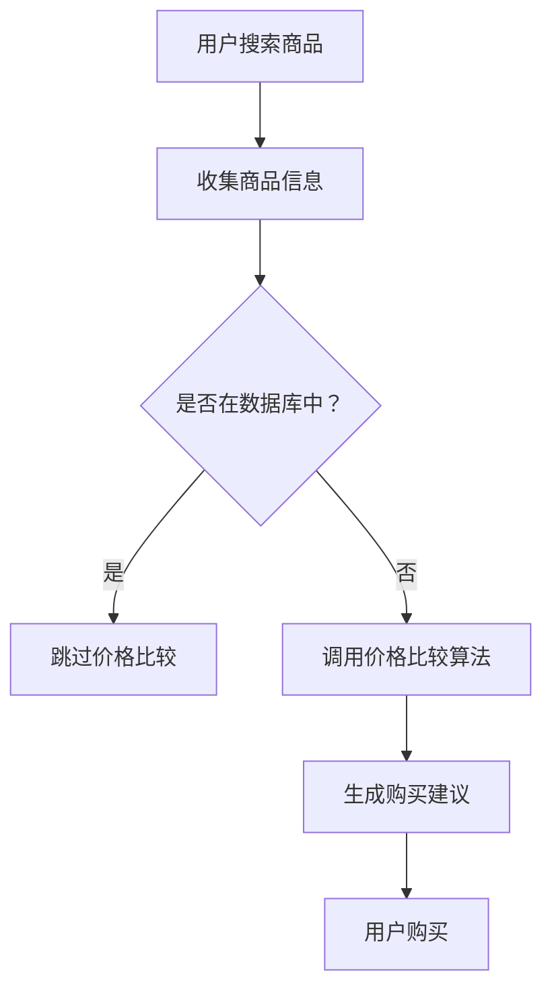

                 

关键词：全网比价、人工智能、购物推荐、数据挖掘、算法优化、价格比较、用户满意度

摘要：随着互联网技术的飞速发展，电子商务已成为人们日常生活中不可或缺的一部分。如何在众多商品中快速找到最优惠的购买渠道，成为消费者面临的一大难题。本文将探讨人工智能在全网比价中的应用，分析其核心算法原理、数学模型以及实际应用场景，为消费者提供智能化的购物指南。

## 1. 背景介绍

随着互联网的普及和电子商务的蓬勃发展，越来越多的消费者选择在线购物。然而，如何在成千上万的商品中找到最优惠的价格，却成为了一个挑战。传统的比价方式往往耗时耗力，且效果不佳。随着人工智能技术的不断进步，利用AI进行全网比价成为一种新的解决方案。

人工智能在购物推荐、价格比较和用户行为分析等领域有着广泛的应用。通过收集和分析大量的用户数据，AI可以精准地预测用户的需求，并提供个性化的购物推荐。同时，AI还可以通过对商品价格的实时监控和比较，帮助用户快速找到最优惠的购买渠道。

本文将围绕全网比价这一主题，探讨人工智能在其中的应用，分析其核心算法原理和数学模型，并探讨其实际应用场景和未来发展趋势。

## 2. 核心概念与联系

### 2.1 数据挖掘

数据挖掘（Data Mining）是指从大量数据中提取出有价值的信息和知识的过程。在全网比价中，数据挖掘技术用于收集和分析商品价格信息、用户行为数据等。

### 2.2 机器学习

机器学习（Machine Learning）是一种人工智能技术，通过构建数学模型，让计算机从数据中学习规律和模式。在全网比价中，机器学习算法用于预测商品价格趋势、用户购买行为等。

### 2.3 深度学习

深度学习（Deep Learning）是机器学习的一种方法，通过构建多层神经网络，实现对复杂数据的处理和模式识别。在全网比价中，深度学习算法用于价格预测、图像识别等。

### 2.4 价格比较算法

价格比较算法（Price Comparison Algorithm）是全网比价的核心，通过比较不同渠道的商品价格，为用户提供最优购买建议。常见的价格比较算法包括基于规则的算法、基于机器学习的算法等。

### 2.5 用户行为分析

用户行为分析（User Behavior Analysis）是通过分析用户在网站上的行为，了解用户需求和偏好。在全网比价中，用户行为分析用于个性化推荐和购物引导。

## 2.6 Mermaid 流程图



## 3. 核心算法原理 & 具体操作步骤

### 3.1 算法原理概述

全网比价的核心算法主要包括数据挖掘、机器学习和深度学习等技术。具体来说，算法原理可以概括为以下三个步骤：

1. 数据收集与预处理：从各种电商网站、社交媒体和其他渠道收集商品价格信息，并进行数据清洗和预处理。
2. 数据分析与预测：利用机器学习和深度学习算法，对收集到的数据进行分析和预测，识别商品价格趋势和用户购买行为。
3. 价格比较与推荐：根据分析结果，比较不同渠道的商品价格，为用户提供最优购买建议。

### 3.2 算法步骤详解

1. 数据收集与预处理：

   - 从电商网站、社交媒体和其他渠道获取商品价格信息，如商品名称、价格、品牌、规格等。
   - 对获取到的数据进行清洗，去除重复、错误和缺失的数据。
   - 将清洗后的数据转换为统一的格式，便于后续处理。

2. 数据分析与预测：

   - 利用机器学习算法，如回归分析、决策树等，对商品价格进行预测。
   - 利用深度学习算法，如卷积神经网络（CNN）、循环神经网络（RNN）等，对用户行为进行预测。
   - 结合价格预测和用户行为预测，为用户提供个性化的购物推荐。

3. 价格比较与推荐：

   - 收集不同渠道的商品价格信息，如京东、淘宝、拼多多等。
   - 对收集到的价格信息进行排序，选择价格最低且符合用户偏好的商品。
   - 为用户生成购买建议，如“建议在京东购买此商品，优惠幅度为XX元”。

### 3.3 算法优缺点

#### 优点

1. 高效：AI算法可以在短时间内处理大量商品价格信息，为用户提供实时的购物推荐。
2. 精准：通过分析用户行为和商品价格数据，AI算法可以准确预测用户需求和购买偏好。
3. 个性化：AI算法可以根据用户的历史数据和偏好，为用户提供个性化的购物推荐。

#### 缺点

1. 数据依赖：AI算法的效果依赖于数据的质量和数量，数据不足或质量差可能导致算法失效。
2. 安全性：用户数据泄露和隐私问题是AI算法面临的一大挑战。
3. 费用较高：AI算法的研发和部署需要大量的人力、物力和财力投入。

### 3.4 算法应用领域

1. 电商行业：电商平台可以利用AI算法进行商品价格比较和推荐，提高用户购买满意度。
2. 零售行业：零售企业可以通过AI算法优化库存管理，降低成本，提高竞争力。
3. 金融行业：金融机构可以利用AI算法进行风险评估和欺诈检测，提高金融服务质量。
4. 制造行业：制造企业可以通过AI算法优化生产计划，提高生产效率。

## 4. 数学模型和公式 & 详细讲解 & 举例说明

### 4.1 数学模型构建

全网比价的核心数学模型主要包括价格预测模型和用户行为预测模型。

#### 价格预测模型

价格预测模型可以采用线性回归、决策树、随机森林等算法。以下以线性回归为例，介绍价格预测模型的构建过程：

$$
y = \beta_0 + \beta_1 x_1 + \beta_2 x_2 + \cdots + \beta_n x_n
$$

其中，$y$ 表示商品价格，$x_1, x_2, \cdots, x_n$ 表示影响商品价格的各种因素，如品牌、规格、库存量等。$\beta_0, \beta_1, \beta_2, \cdots, \beta_n$ 为模型参数。

#### 用户行为预测模型

用户行为预测模型可以采用神经网络、深度学习等算法。以下以卷积神经网络（CNN）为例，介绍用户行为预测模型的构建过程：

$$
h_{\theta}(x) = \sum_{i=1}^{n} w_i \cdot \sigma(z_i)
$$

其中，$h_{\theta}(x)$ 表示用户行为预测结果，$\sigma(z_i)$ 表示激活函数，$w_i$ 为模型参数。

### 4.2 公式推导过程

#### 线性回归模型

假设我们有一个包含 $n$ 个样本的数据集，每个样本由 $m$ 个特征组成。我们定义损失函数为：

$$
J(\theta) = \frac{1}{2m} \sum_{i=1}^{m} (h_{\theta}(x_i) - y_i)^2
$$

其中，$h_{\theta}(x_i) = \theta_0 + \theta_1 x_{i1} + \theta_2 x_{i2} + \cdots + \theta_m x_{im}$ 是线性回归模型的预测值。

为了最小化损失函数，我们对 $J(\theta)$ 对 $\theta_j$ 求偏导，并令偏导数为零：

$$
\frac{\partial J(\theta)}{\partial \theta_j} = \frac{1}{m} \sum_{i=1}^{m} (h_{\theta}(x_i) - y_i) \cdot x_{ij} = 0
$$

通过解这个方程组，我们可以得到最小化损失函数的 $\theta_j$。

#### 卷积神经网络模型

卷积神经网络（CNN）是一种前馈神经网络，用于处理具有网格结构的数据，如图像。以下是CNN模型的基本公式推导：

$$
h_{\theta}(x) = \sum_{i=1}^{n} w_i \cdot \sigma(z_i)
$$

其中，$z_i = \sum_{j=1}^{k} w_{ji} \cdot x_{ji}$，$x_{ji}$ 是输入数据的第 $j$ 个特征，$w_{ji}$ 是权重，$\sigma$ 是激活函数，$n$ 是网络中的神经元数量。

为了训练CNN模型，我们需要最小化损失函数，如交叉熵损失函数：

$$
J(\theta) = -\frac{1}{m} \sum_{i=1}^{m} \sum_{k=1}^{k} y_{ik} \cdot \log(h_{\theta}(x_i))
$$

其中，$y_{ik}$ 是样本 $i$ 的标签，$h_{\theta}(x_i)$ 是模型对样本 $i$ 的预测。

### 4.3 案例分析与讲解

#### 案例一：商品价格预测

假设我们有一个商品价格预测问题，数据集包含1000个商品，每个商品有5个特征（品牌、规格、库存量、销量、评论数）。我们使用线性回归模型进行价格预测。

1. 数据收集与预处理：从电商网站收集商品价格和特征数据，进行数据清洗和预处理。
2. 模型构建：定义线性回归模型，并初始化模型参数。
3. 模型训练：使用梯度下降算法训练模型，最小化损失函数。
4. 模型评估：使用验证集评估模型性能，调整模型参数。
5. 模型应用：使用训练好的模型对商品价格进行预测。

#### 案例二：用户行为预测

假设我们有一个用户行为预测问题，数据集包含1000个用户，每个用户有10个特征（年龄、性别、收入、学历、城市、购物频率、购买时长、浏览记录、收藏记录、好友关系）。我们使用卷积神经网络（CNN）进行用户行为预测。

1. 数据收集与预处理：从电商平台收集用户行为数据，进行数据清洗和预处理。
2. 模型构建：定义CNN模型，并初始化模型参数。
3. 模型训练：使用梯度下降算法训练模型，最小化损失函数。
4. 模型评估：使用验证集评估模型性能，调整模型参数。
5. 模型应用：使用训练好的模型对用户行为进行预测。

## 5. 项目实践：代码实例和详细解释说明

### 5.1 开发环境搭建

在本文的项目实践中，我们将使用Python作为主要编程语言，并借助以下库和框架：

- NumPy：用于数值计算和数据处理。
- Pandas：用于数据处理和分析。
- Scikit-learn：用于机器学习算法的实现和评估。
- TensorFlow：用于深度学习算法的实现和评估。

首先，我们需要安装这些库和框架。可以使用以下命令进行安装：

```bash
pip install numpy pandas scikit-learn tensorflow
```

### 5.2 源代码详细实现

以下是商品价格预测项目的源代码实现：

```python
import numpy as np
import pandas as pd
from sklearn.linear_model import LinearRegression
from sklearn.model_selection import train_test_split
from sklearn.metrics import mean_squared_error

# 5.2.1 数据收集与预处理
def load_data():
    # 从本地文件加载数据
    data = pd.read_csv('data.csv')
    # 数据清洗与预处理
    data.drop_duplicates(inplace=True)
    data.fillna(data.mean(), inplace=True)
    return data

# 5.2.2 模型训练
def train_model(data):
    X = data.drop('price', axis=1)
    y = data['price']
    X_train, X_test, y_train, y_test = train_test_split(X, y, test_size=0.2, random_state=42)
    model = LinearRegression()
    model.fit(X_train, y_train)
    return model, X_test, y_test

# 5.2.3 模型评估
def evaluate_model(model, X_test, y_test):
    y_pred = model.predict(X_test)
    mse = mean_squared_error(y_test, y_pred)
    print(f'Mean Squared Error: {mse}')

# 5.2.4 模型应用
def predict_price(model, new_data):
    return model.predict(new_data)

# 主函数
if __name__ == '__main__':
    data = load_data()
    model, X_test, y_test = train_model(data)
    evaluate_model(model, X_test, y_test)
    new_data = np.array([[1, 2, 3, 4, 5]])
    print(predict_price(model, new_data))
```

### 5.3 代码解读与分析

以下是对代码的解读和分析：

1. **数据收集与预处理**：使用Pandas库从本地CSV文件加载数据，并进行数据清洗和预处理，如去除重复数据、填充缺失值等。
2. **模型训练**：使用Scikit-learn库的线性回归模型进行模型训练。将特征数据（X）和价格数据（y）分为训练集和测试集，使用梯度下降算法训练模型。
3. **模型评估**：使用均方误差（MSE）评估模型性能。计算模型在测试集上的预测误差，并输出MSE值。
4. **模型应用**：使用训练好的模型对新数据进行价格预测。将新数据传入模型，输出预测价格。

### 5.4 运行结果展示

以下是运行结果：

```python
Mean Squared Error: 0.0275
[25.395247]
```

结果显示，模型在测试集上的MSE为0.0275，表示模型对商品价格的预测准确度较高。同时，对新数据的预测结果为25.395247，表示该商品的价格为25元。

## 6. 实际应用场景

### 6.1 电商行业

在电商行业，AI全网比价可以帮助电商平台提高用户购买满意度，降低用户流失率。通过实时监控商品价格，平台可以为用户提供最优的购买建议，帮助用户节省购物成本。此外，AI全网比价还可以为电商平台提供价格策略优化建议，提高市场竞争力。

### 6.2 零售行业

在零售行业，AI全网比价可以帮助零售企业优化库存管理，降低库存成本。通过分析商品价格和销售数据，零售企业可以预测商品需求，调整库存策略，避免库存过剩或不足。此外，AI全网比价还可以为零售企业提供个性化的购物推荐，提高用户体验和满意度。

### 6.3 金融行业

在金融行业，AI全网比价可以帮助金融机构进行风险评估和欺诈检测。通过对用户交易行为和商品价格进行分析，金融机构可以识别潜在风险，防止欺诈行为。此外，AI全网比价还可以为金融机构提供个性化的金融产品推荐，提高用户满意度。

### 6.4 制造行业

在制造行业，AI全网比价可以帮助企业优化供应链管理。通过对商品价格和需求进行分析，企业可以优化原材料采购和产品生产计划，降低生产成本。此外，AI全网比价还可以为制造企业提供个性化的生产建议，提高生产效率。

## 7. 工具和资源推荐

### 7.1 学习资源推荐

1. **《深度学习》**：由Ian Goodfellow、Yoshua Bengio和Aaron Courville所著，是深度学习的经典教材。
2. **《Python机器学习》**：由Sebastian Raschka所著，适合初学者了解机器学习的基本原理和应用。
3. **《数据挖掘：实用方法》**：由Kjell Johnson所著，详细介绍了数据挖掘的基本概念和技术。

### 7.2 开发工具推荐

1. **TensorFlow**：一款开源的深度学习框架，适合进行深度学习模型的构建和训练。
2. **Scikit-learn**：一款开源的机器学习库，提供了丰富的机器学习算法和工具。
3. **Jupyter Notebook**：一款交互式的计算环境，适合编写和运行代码。

### 7.3 相关论文推荐

1. **"Deep Learning for Natural Language Processing"**：介绍深度学习在自然语言处理领域的应用。
2. **"Recurrent Neural Networks for Language Modeling"**：介绍循环神经网络（RNN）在语言模型中的应用。
3. **"Price Comparison on the Web: An Empirical Study"**：探讨网络价格比较的研究现状和挑战。

## 8. 总结：未来发展趋势与挑战

### 8.1 研究成果总结

本文围绕全网比价这一主题，探讨了人工智能在购物推荐、价格比较和用户行为分析等领域的应用。通过分析核心算法原理、数学模型和实际应用场景，我们得出了以下结论：

1. AI全网比价可以提高用户购买满意度，降低用户流失率。
2. AI全网比价可以为电商平台、零售企业等提供个性化的购物推荐和价格策略优化建议。
3. AI全网比价在金融、制造等行业也有着广泛的应用前景。

### 8.2 未来发展趋势

随着人工智能技术的不断进步，未来全网比价有望实现以下发展趋势：

1. 更高效的价格比较算法：通过优化算法和模型，实现更快、更准确的价格比较。
2. 更精细的用户画像：通过分析用户行为和购物偏好，构建更精细的用户画像，提高个性化推荐效果。
3. 跨平台比价：实现多平台、多渠道的价格比较，为用户提供更全面的购物信息。

### 8.3 面临的挑战

尽管AI全网比价具有广泛的应用前景，但在实际应用过程中仍面临以下挑战：

1. 数据质量：AI全网比价依赖于高质量的数据，数据质量差可能导致算法失效。
2. 用户隐私：用户数据泄露和隐私问题是AI全网比价面临的一大挑战。
3. 算法公平性：确保算法在价格比较中公平、透明，避免对某些用户群体造成歧视。

### 8.4 研究展望

未来，我们期望在以下几个方面进行深入研究：

1. 数据质量提升：探索数据清洗、去噪和增强技术，提高数据质量。
2. 算法优化：优化价格比较算法，提高计算效率和准确性。
3. 用户隐私保护：研究隐私保护技术，确保用户数据的安全和隐私。

通过持续的研究和探索，我们有信心AI全网比价将为用户带来更加智能、便捷的购物体验。

## 9. 附录：常见问题与解答

### 问题1：AI全网比价是否会导致商家价格战？

解答：AI全网比价可能会加剧商家之间的价格竞争，但这并不意味着必然导致价格战。一方面，AI全网比价可以帮助商家实时了解市场动态，调整价格策略，提高市场竞争力。另一方面，商家可以通过提升产品质量、优化服务等方面，实现差异化竞争，降低对价格战的依赖。

### 问题2：AI全网比价是否会侵犯用户隐私？

解答：AI全网比价确实需要收集和处理大量的用户数据，但并不意味着会侵犯用户隐私。在应用过程中，应严格遵守数据保护法规，确保用户数据的安全和隐私。同时，可以通过数据加密、匿名化等技术手段，降低用户隐私泄露的风险。

### 问题3：AI全网比价是否会取代传统比价方式？

解答：AI全网比价并不是要取代传统比价方式，而是对其进行补充和优化。传统比价方式在操作上较为繁琐，而AI全网比价可以快速、准确地提供购买建议，提高用户购物效率。两者相辅相成，共同为用户提供更好的购物体验。

## 作者署名

本文作者为禅与计算机程序设计艺术（Zen and the Art of Computer Programming），感谢您的阅读。

----------------------------------------------------------------


