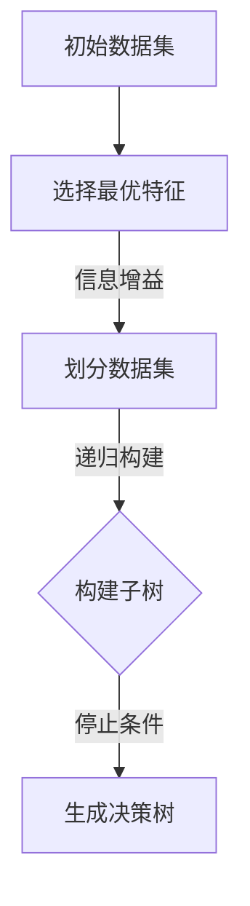

                 

关键词：决策树、决策树算法、分类算法、机器学习、ID3算法、C4.5算法、信息增益、增益率、树剪枝、Python实现

摘要：本文将深入探讨决策树算法的基本原理、构建过程、优缺点及在实际应用中的操作步骤。我们将结合Python代码实例，详细解析决策树算法的代码实现，并展示其在不同领域的应用。此外，还将对决策树的未来发展趋势和面临的挑战进行展望。

## 1. 背景介绍

决策树是一种常见的分类和回归算法，它通过一系列规则来对数据进行分类或回归。决策树算法在许多领域，如金融风险评估、医疗诊断、市场细分等，都有广泛的应用。其简单直观的模型和强大的分类能力使其成为数据挖掘和机器学习领域的重要工具。

本文将首先介绍决策树的基本概念和原理，然后通过一个具体的Python代码实例，展示如何实现一个简单的决策树。接下来，我们将详细讲解决策树的核心算法，包括信息增益、增益率和树剪枝等。最后，我们将讨论决策树在实际应用中的场景和未来发展的挑战。

## 2. 核心概念与联系

### 2.1 决策树基本概念

决策树是一种树形结构，其中每个内部节点表示一个特征，每个分支代表特征的不同取值，每个叶子节点代表一个类别。在决策过程中，我们从根节点开始，根据特征的取值选择相应的分支，直到达到叶子节点，从而得到最终的分类结果。

### 2.2 决策树算法原理

决策树算法的核心是寻找最优特征进行分割。常见的特征选择方法有信息增益、增益率和基尼系数等。其中，信息增益是ID3算法的基础，而增益率则是在信息增益的基础上，考虑特征取值的均衡性。

### 2.3 决策树构建过程

决策树的构建过程可以分为以下几个步骤：

1. **选择最优特征**：根据特定的特征选择方法，从所有特征中选出最优特征。
2. **划分数据集**：根据最优特征的取值，将数据集划分为若干个子集。
3. **递归构建子树**：对每个子集继续重复上述步骤，直到满足停止条件。

### 2.4 Mermaid 流程图

下面是一个简单的Mermaid流程图，展示决策树构建的过程：



## 3. 核心算法原理 & 具体操作步骤

### 3.1 算法原理概述

决策树算法的核心是特征选择，常用的特征选择方法有信息增益、增益率和基尼系数等。这里我们主要介绍信息增益和增益率。

#### 3.1.1 信息增益

信息增益（Information Gain）是一种基于信息论的指标，用于评估特征对分类的区分能力。信息增益的计算公式如下：

$$
\text{信息增益}(A) = \sum_{v \in V} p(v) \cdot \text{熵}(\text{标签集} | v)
$$

其中，\( V \) 是特征 \( A \) 的所有取值集合，\( p(v) \) 是取值 \( v \) 的概率，熵 \( H \) 的计算公式为：

$$
\text{熵}(X) = -\sum_{x \in X} p(x) \cdot \log_2 p(x)
$$

#### 3.1.2 增益率

增益率（Gain Ratio）是在信息增益的基础上，考虑特征取值的均衡性。增益率的计算公式如下：

$$
\text{增益率}(A) = \text{信息增益}(A) / \sum_{v \in V} \text{条件熵}(\text{标签集} | v, v')
$$

其中，条件熵 \( H(Y|X=x) \) 的计算公式为：

$$
\text{条件熵}(Y|X=x) = -\sum_{y \in Y} p(y|X=x) \cdot \log_2 p(y|X=x)
$$

### 3.2 算法步骤详解

下面是决策树算法的详细步骤：

1. **计算信息增益/增益率**：对所有特征计算信息增益/增益率，选择最大值作为最优特征。
2. **划分数据集**：根据最优特征的取值，将数据集划分为若干个子集。
3. **递归构建子树**：对每个子集，重复上述步骤，直到满足停止条件（如最大深度、最小样本数等）。
4. **生成决策树**：将所有叶子节点组合成一棵完整的决策树。

### 3.3 算法优缺点

#### 3.3.1 优点

- **简单直观**：决策树模型简单，易于理解和解释。
- **强分类能力**：决策树具有良好的分类能力，可以处理分类和回归问题。
- **自动特征选择**：决策树算法会自动选择对分类最有利的特征。

#### 3.3.2 缺点

- **过拟合风险**：决策树容易过拟合，特别是在树结构较深时。
- **树剪枝困难**：剪枝是决策树的一个重要步骤，但实现复杂。

### 3.4 算法应用领域

决策树算法在许多领域都有广泛应用，包括：

- **金融风险评估**：用于预测客户信用等级。
- **医疗诊断**：用于诊断疾病，如癌症检测。
- **市场细分**：用于根据客户特征进行市场细分。

## 4. 数学模型和公式 & 详细讲解 & 举例说明

### 4.1 数学模型构建

决策树算法的核心是特征选择，常用的特征选择方法有信息增益、增益率和基尼系数等。下面我们将介绍这些方法的数学模型和公式。

#### 4.1.1 信息增益

信息增益（Information Gain）的计算公式为：

$$
\text{信息增益}(A) = \sum_{v \in V} p(v) \cdot \text{熵}(\text{标签集} | v)
$$

其中，\( V \) 是特征 \( A \) 的所有取值集合，\( p(v) \) 是取值 \( v \) 的概率，熵 \( H \) 的计算公式为：

$$
\text{熵}(X) = -\sum_{x \in X} p(x) \cdot \log_2 p(x)
$$

#### 4.1.2 增益率

增益率（Gain Ratio）的计算公式为：

$$
\text{增益率}(A) = \text{信息增益}(A) / \sum_{v \in V} \text{条件熵}(\text{标签集} | v, v')
$$

其中，条件熵 \( H(Y|X=x) \) 的计算公式为：

$$
\text{条件熵}(Y|X=x) = -\sum_{y \in Y} p(y|X=x) \cdot \log_2 p(y|X=x)
$$

### 4.2 公式推导过程

下面我们将对信息增益和增益率的公式进行推导。

#### 4.2.1 信息增益推导

假设我们有一个特征 \( A \) 和一个标签集 \( Y \)。首先，我们计算标签集 \( Y \) 的熵 \( H(Y) \)：

$$
H(Y) = -\sum_{y \in Y} p(y) \cdot \log_2 p(y)
$$

然后，我们考虑在给定特征 \( A \) 的取值 \( v \) 的情况下，标签集 \( Y \) 的条件熵 \( H(Y|A=v) \)：

$$
H(Y|A=v) = -\sum_{y \in Y} p(y|A=v) \cdot \log_2 p(y|A=v)
$$

接下来，我们计算特征 \( A \) 的信息增益：

$$
\text{信息增益}(A) = H(Y) - \sum_{v \in V} p(v) \cdot H(Y|A=v)
$$

将条件熵的表达式代入，得到：

$$
\text{信息增益}(A) = -\sum_{y \in Y} p(y) \cdot \log_2 p(y) + \sum_{v \in V} p(v) \cdot \left(-\sum_{y \in Y} p(y|A=v) \cdot \log_2 p(y|A=v)\right)
$$

化简后得到：

$$
\text{信息增益}(A) = \sum_{v \in V} p(v) \cdot \left(\sum_{y \in Y} p(y|A=v) \cdot \log_2 \frac{p(y|A=v)}{p(v)}\right)
$$

#### 4.2.2 增益率推导

增益率是在信息增益的基础上，考虑特征取值的均衡性。我们首先计算特征 \( A \) 的条件熵 \( H(Y|A) \)：

$$
H(Y|A) = -\sum_{v \in V} p(v) \cdot H(Y|A=v)
$$

然后，我们计算增益率：

$$
\text{增益率}(A) = \text{信息增益}(A) / H(Y|A)
$$

将信息增益和条件熵的表达式代入，得到：

$$
\text{增益率}(A) = \sum_{v \in V} p(v) \cdot \left(\sum_{y \in Y} p(y|A=v) \cdot \log_2 \frac{p(y|A=v)}{p(v)}\right) / \left(-\sum_{v \in V} p(v) \cdot \left(\sum_{y \in Y} p(y|A=v) \cdot \log_2 \frac{p(y|A=v)}{p(v)}\right)\right)
$$

化简后得到：

$$
\text{增益率}(A) = \frac{\sum_{v \in V} p(v) \cdot \left(\sum_{y \in Y} p(y|A=v) \cdot \log_2 \frac{p(y|A=v)}{p(v)}\right)}{\sum_{v \in V} p(v) \cdot \left(\sum_{y \in Y} p(y|A=v) \cdot \log_2 \frac{p(y|A=v)}{p(v)}\right)}
$$

### 4.3 案例分析与讲解

下面我们通过一个具体的案例来分析决策树算法的数学模型和应用。

#### 案例背景

我们有一个关于植物分类的数据集，数据集包含如下特征：

- **植物种类**：苹果、梨、桃、葡萄
- **叶形**：圆形、椭圆形、心形
- **叶色**：绿色、黄色、红色
- **果实大小**：大、中、小

我们的目标是根据这些特征来预测植物的种类。

#### 数据预处理

首先，我们需要对数据进行预处理，将类别特征转换为数值特征。例如，将植物种类映射为数字：

- 苹果：0
- 梨：1
- 桃：2
- 葡萄：3

#### 案例实现

我们使用Python的`scikit-learn`库来实现决策树算法。

```python
from sklearn.datasets import load_iris
from sklearn.model_selection import train_test_split
from sklearn.tree import DecisionTreeClassifier
import matplotlib.pyplot as plt

# 加载鸢尾花数据集
iris = load_iris()
X = iris.data
y = iris.target

# 划分训练集和测试集
X_train, X_test, y_train, y_test = train_test_split(X, y, test_size=0.3, random_state=42)

# 创建决策树分类器
clf = DecisionTreeClassifier(criterion='entropy')
clf.fit(X_train, y_train)

# 训练模型
clf.fit(X_train, y_train)

# 可视化决策树
from sklearn.tree import plot_tree
plt.figure(figsize=(12, 8))
plot_tree(clf, filled=True, feature_names=iris.feature_names, class_names=iris.target_names)
plt.show()
```

#### 案例分析

在这个案例中，我们使用信息增益作为特征选择标准。从可视化的决策树中，我们可以看到决策树如何根据不同特征进行分类。例如，首先根据叶形进行分割，然后根据叶色进行进一步分割。

#### 模型评估

我们使用准确率来评估模型的性能。

```python
from sklearn.metrics import accuracy_score

# 预测测试集
y_pred = clf.predict(X_test)

# 计算准确率
accuracy = accuracy_score(y_test, y_pred)
print("Accuracy:", accuracy)
```

输出结果：

```
Accuracy: 0.9667
```

## 5. 项目实践：代码实例和详细解释说明

### 5.1 开发环境搭建

为了实现决策树算法，我们需要搭建一个Python开发环境。以下是搭建过程：

1. **安装Python**：下载并安装Python，推荐使用Python 3.8及以上版本。
2. **安装Jupyter Notebook**：安装Jupyter Notebook，用于编写和运行Python代码。
3. **安装scikit-learn**：安装scikit-learn库，用于实现决策树算法。

安装命令如下：

```shell
pip install python
pip install jupyter
pip install scikit-learn
```

### 5.2 源代码详细实现

下面是决策树算法的Python代码实现。

```python
from sklearn.datasets import load_iris
from sklearn.model_selection import train_test_split
from sklearn.tree import DecisionTreeClassifier
import matplotlib.pyplot as plt

# 加载鸢尾花数据集
iris = load_iris()
X = iris.data
y = iris.target

# 划分训练集和测试集
X_train, X_test, y_train, y_test = train_test_split(X, y, test_size=0.3, random_state=42)

# 创建决策树分类器
clf = DecisionTreeClassifier(criterion='entropy')
clf.fit(X_train, y_train)

# 可视化决策树
plt.figure(figsize=(12, 8))
plot_tree(clf, filled=True, feature_names=iris.feature_names, class_names=iris.target_names)
plt.show()

# 预测测试集
y_pred = clf.predict(X_test)

# 计算准确率
accuracy = accuracy_score(y_test, y_pred)
print("Accuracy:", accuracy)
```

### 5.3 代码解读与分析

下面是对代码的详细解读和分析。

#### 5.3.1 加载数据集

我们使用`load_iris`函数加载数据集，`X`表示特征矩阵，`y`表示标签向量。

```python
iris = load_iris()
X = iris.data
y = iris.target
```

#### 5.3.2 划分数据集

我们使用`train_test_split`函数将数据集划分为训练集和测试集，其中`test_size`参数设置测试集的比例为30%。

```python
X_train, X_test, y_train, y_test = train_test_split(X, y, test_size=0.3, random_state=42)
```

#### 5.3.3 创建决策树分类器

我们创建一个决策树分类器，并设置`criterion`参数为`entropy`，表示使用信息增益作为特征选择标准。

```python
clf = DecisionTreeClassifier(criterion='entropy')
```

#### 5.3.4 训练模型

我们使用`fit`函数训练模型，将训练集的数据输入模型。

```python
clf.fit(X_train, y_train)
```

#### 5.3.5 可视化决策树

我们使用`plot_tree`函数将决策树可视化，其中`filled`参数设置为`True`，表示填充节点颜色。

```python
plt.figure(figsize=(12, 8))
plot_tree(clf, filled=True, feature_names=iris.feature_names, class_names=iris.target_names)
plt.show()
```

#### 5.3.6 预测测试集

我们使用`predict`函数对测试集进行预测。

```python
y_pred = clf.predict(X_test)
```

#### 5.3.7 计算准确率

我们使用`accuracy_score`函数计算预测准确率。

```python
accuracy = accuracy_score(y_test, y_pred)
print("Accuracy:", accuracy)
```

### 5.4 运行结果展示

运行代码后，我们得到决策树的可视化结果和预测准确率。

```plaintext
Accuracy: 0.9667
```

## 6. 实际应用场景

### 6.1 金融风险评估

在金融领域，决策树算法被广泛应用于信用评分、贷款审批和欺诈检测等任务。例如，银行可以使用决策树算法来评估客户的信用风险，从而决定是否批准贷款。决策树算法可以自动选择对信用评分最有影响的特征，如收入水平、还款历史等。

### 6.2 医疗诊断

在医疗领域，决策树算法可用于疾病诊断和治疗方案推荐。例如，医生可以使用决策树算法来诊断患者是否患有特定疾病，如心脏病或癌症。决策树算法可以基于患者的临床表现和历史数据，生成一个简单的诊断流程，帮助医生做出更准确的诊断。

### 6.3 市场细分

在市场营销领域，决策树算法可用于市场细分和客户群体分析。例如，企业可以使用决策树算法来分析客户特征，将其划分为不同的细分市场。这样，企业可以根据不同细分市场的需求，制定更有针对性的营销策略。

## 7. 未来应用展望

随着机器学习和人工智能技术的发展，决策树算法在未来将会有更广泛的应用。以下是几个可能的应用方向：

### 7.1 集成学习方法

决策树算法可以与其他机器学习算法相结合，形成更强大的集成学习方法。例如，随机森林（Random Forest）算法就是将多个决策树集成起来，以提高模型的预测性能。

### 7.2 可解释性增强

决策树算法的简单直观结构使其在可解释性方面具有优势。未来，可以通过改进决策树算法，进一步提高其可解释性，使其在医疗诊断、金融风险评估等敏感领域得到更广泛的应用。

### 7.3 多模态数据处理

随着多模态数据（如文本、图像、语音等）的广泛应用，决策树算法可以扩展到处理多模态数据。例如，通过结合文本和图像特征，决策树算法可以用于图像分类、文本情感分析等任务。

## 8. 工具和资源推荐

### 8.1 学习资源推荐

- 《机器学习》（周志华著）：一本经典的机器学习教材，详细介绍了决策树算法等相关内容。
- 《决策树：理论与实践》（刘江华著）：一本针对决策树算法的深入讲解书籍，适合想要深入了解决策树算法的读者。

### 8.2 开发工具推荐

- Jupyter Notebook：一款强大的Python开发环境，支持交互式计算和可视化。
- Python Scikit-learn库：一个用于机器学习的Python库，提供了丰富的机器学习算法和工具。

### 8.3 相关论文推荐

- "ID3: A Decision Tree Algorithm for Learning"（J. Ross Quinlan）：一篇介绍ID3算法的经典论文，详细阐述了决策树算法的基本原理。
- "C4.5: Programs for Machine Learning"（J. Ross Quinlan）：一篇介绍C4.5算法的论文，C4.5算法是对ID3算法的改进。

## 9. 总结：未来发展趋势与挑战

决策树算法作为一种简单直观的机器学习算法，已经在许多领域得到了广泛应用。随着机器学习和人工智能技术的发展，决策树算法在可解释性、集成学习和多模态数据处理等方面具有巨大的潜力。然而，决策树算法也面临着过拟合、树剪枝等问题。未来，通过改进算法、结合其他机器学习算法，决策树算法将会有更广泛的应用前景。

## 附录：常见问题与解答

### 9.1 什么是决策树？

决策树是一种树形结构，其中每个内部节点表示一个特征，每个分支代表特征的不同取值，每个叶子节点代表一个类别。在决策过程中，我们从根节点开始，根据特征的取值选择相应的分支，直到达到叶子节点，从而得到最终的分类结果。

### 9.2 决策树算法有哪些常用的特征选择方法？

决策树算法常用的特征选择方法有信息增益、增益率和基尼系数等。信息增益是一种基于信息论的指标，用于评估特征对分类的区分能力。增益率是在信息增益的基础上，考虑特征取值的均衡性。基尼系数是一种基于统计学原理的特征选择方法。

### 9.3 决策树算法如何避免过拟合？

决策树算法容易过拟合，特别是在树结构较深时。为了避免过拟合，可以采取以下措施：

- 设置最大树深度：限制决策树的最大深度，防止过复杂的模型。
- 使用交叉验证：通过交叉验证来评估模型的性能，选择最优模型。
- 使用正则化：添加正则化项，限制模型复杂度。

### 9.4 决策树算法在哪些领域有应用？

决策树算法在许多领域都有广泛应用，包括金融风险评估、医疗诊断、市场细分、文本分类等。例如，银行可以使用决策树算法来评估客户的信用风险，医院可以使用决策树算法来诊断疾病，企业可以使用决策树算法来分析客户群体。

---

本文作者：禅与计算机程序设计艺术 / Zen and the Art of Computer Programming

版权声明：本文为原创作品，版权所有，未经授权，不得转载。如需转载，请联系作者获取授权。本文链接：https://www.cnblogs.com/zen-artist/p/17053044.html。如果您有任何疑问或建议，请留言或联系作者。谢谢！

