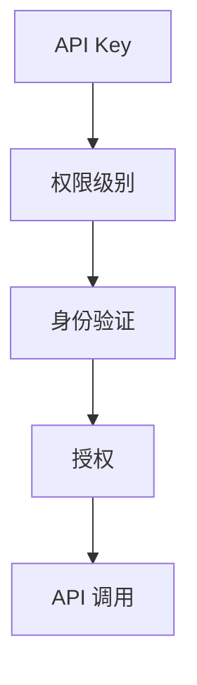

                 

 关键词：（API Key, 分级授权，安全性，分布式系统，身份验证，权限管理）

> 摘要：本文将深入探讨分级 API Key 在现代分布式系统中的应用，分析其核心概念、设计原理和实际操作步骤，并通过具体实例展示如何使用分级 API Key 实现安全的权限管理和身份验证。

## 1. 背景介绍

在互联网时代，API（应用程序编程接口）已经成为各个系统和应用程序之间数据交换和交互的核心。随着云计算、大数据和物联网的兴起，API 的使用变得更加广泛。然而，API 的开放性也带来了安全风险，特别是未经授权的访问和数据泄露等问题。为了解决这个问题，分级 API Key 应运而生。

分级 API Key 是一种权限管理机制，通过为不同的 API 调用分配不同级别的 API Key，实现对用户权限的精细化管理。这种机制不仅能够提高系统的安全性，还能够根据用户的角色和权限提供差异化的服务。

## 2. 核心概念与联系

分级 API Key 的核心概念包括 API Key、权限级别、身份验证和授权。

### 2.1 API Key

API Key 是一种唯一的标识符，用于标识一个 API 调用的发起者。它通常由字母和数字组成，类似于一个密码。

### 2.2 权限级别

权限级别定义了用户对 API 的访问权限。不同的权限级别对应不同的操作权限，例如读权限、写权限和删除权限。

### 2.3 身份验证

身份验证是确保 API Key 所对应的用户身份合法的过程。通常使用 HTTP 基本身份验证、OAuth2.0 等协议来实现。

### 2.4 授权

授权是系统根据用户的身份和权限级别决定是否允许 API 调用的过程。授权过程通常涉及用户权限验证和权限级别匹配。

### 2.5 Mermaid 流程图

下面是一个简单的 Mermaid 流程图，展示了分级 API Key 的核心概念和联系。



## 3. 核心算法原理 & 具体操作步骤

### 3.1 算法原理概述

分级 API Key 的核心算法原理是通过为 API Key 分配不同的权限级别，实现对 API 调用的权限管理和控制。

### 3.2 算法步骤详解

1. **注册 API Key**：用户注册时，系统生成一个唯一的 API Key，并将其与用户的权限级别关联。

2. **身份验证**：用户在调用 API 时，需要提供 API Key 进行身份验证。

3. **权限验证**：系统根据 API Key 的权限级别和用户请求的操作，验证用户是否有权限执行该操作。

4. **授权**：如果权限验证通过，系统允许用户执行操作；否则，系统拒绝请求。

### 3.3 算法优缺点

**优点**：

- 提高系统的安全性，防止未经授权的访问。
- 灵活性高，可以根据不同的需求灵活分配权限。

**缺点**：

- 需要维护大量的权限级别，可能增加系统复杂性。
- 需要实现复杂的权限验证逻辑，可能影响系统的性能。

### 3.4 算法应用领域

分级 API Key 主要应用于需要权限管理和身份验证的分布式系统，如云服务、Web 应用程序和物联网设备等。

## 4. 数学模型和公式 & 详细讲解 & 举例说明

### 4.1 数学模型构建

我们可以使用集合论来构建分级 API Key 的数学模型。

定义：

- \( A \) 为所有 API Key 的集合。
- \( P \) 为所有权限级别的集合。
- \( R \) 为所有关系的集合。

数学模型：

\( \forall a \in A, \exists p \in P, (a, p) \in R \)

即，对于集合 \( A \) 中的任意 API Key \( a \)，都存在一个权限级别 \( p \) 与之关联。

### 4.2 公式推导过程

我们使用集合运算来推导权限验证的逻辑。

定义：

- \( V \) 为验证函数，输入为 API Key 和权限级别，输出为真或假。
- \( U \) 为用户请求的操作集合。

推导：

1. \( V(a, p) \) 表示验证函数对 API Key \( a \) 和权限级别 \( p \) 的结果。
2. \( a \in A \) 表示 API Key \( a \) 是合法的。
3. \( p \in P \) 表示权限级别 \( p \) 是合法的。
4. \( U \subseteq P \) 表示用户请求的操作集合是权限级别的子集。

公式：

\( V(a, p) = (a \in A) \land (p \in P) \land (U \subseteq P) \)

即，验证函数的结果为真，当且仅当 API Key \( a \) 是合法的，权限级别 \( p \) 是合法的，且用户请求的操作集合 \( U \) 是权限级别集合 \( P \) 的子集。

### 4.3 案例分析与讲解

假设有一个 API，它有两个权限级别：读权限和写权限。权限级别集合为 \( P = \{\text{读权限}, \text{写权限}\} \)。

一个用户请求获取 API 的数据，请求的操作集合为 \( U = \{\text{读权限}\} \)。

如果用户的 API Key 对应的权限级别为 \( p = \{\text{读权限}\} \)，则验证函数 \( V(a, p) \) 的结果为真，用户可以读取数据。

如果用户的 API Key 对应的权限级别为 \( p = \{\text{写权限}\} \)，则验证函数 \( V(a, p) \) 的结果为假，用户无法读取数据。

## 5. 项目实践：代码实例和详细解释说明

### 5.1 开发环境搭建

在本节中，我们将使用 Python 编写一个简单的分级 API Key 系统作为项目实践。首先，需要安装以下依赖：

- Flask：一个轻量级的 Web 框架。
- Flask-HTTPAuth：用于实现 HTTP 基本身份验证。

使用以下命令安装依赖：

```bash
pip install Flask Flask-HTTPAuth
```

### 5.2 源代码详细实现

下面是一个简单的 Flask 应用程序，实现了分级 API Key 的基本功能。

```python
from flask import Flask, jsonify, request
from flask_httpauth import HTTPBasicAuth
from functools import wraps

app = Flask(__name__)
auth = HTTPBasicAuth()

# 用户权限映射
users = {
    "user1": {"read": True, "write": False},
    "user2": {"read": True, "write": True},
}

# 权限验证装饰器
def permission_required(permission):
    def decorator(f):
        @wraps(f)
        def decorated_function(*args, **kwargs):
            user = auth.current_user()
            if user and user.get(permission):
                return f(*args, **kwargs)
            else:
                return jsonify({"error": "权限不足"}), 403
        return decorated_function
    return decorator

@app.route('/data', methods=['GET'])
@permission_required('read')
def get_data():
    return jsonify({"data": "这是一个公开的数据资源"})

@app.route('/data/write', methods=['POST'])
@permission_required('write')
def write_data():
    data = request.json
    # 写入数据逻辑
    return jsonify({"message": "数据写入成功"})

if __name__ == '__main__':
    app.run(debug=True)
```

### 5.3 代码解读与分析

- 我们使用 Flask-HTTPAuth 实现了 HTTP 基本身份验证。
- `users` 字典存储了用户的 API Key 和对应的权限级别。
- `permission_required` 装饰器用于验证用户的权限。
- `/data` 路由提供了公开的数据资源，仅需要读权限。
- `/data/write` 路由提供了数据写入功能，需要写权限。

### 5.4 运行结果展示

运行应用程序后，用户可以使用以下命令获取数据：

```bash
curl -u user1:http://password -i "http://127.0.0.1:5000/data"
```

输出结果：

```json
HTTP/1.0 200 OK
Content-Type: application/json

{
  "data": "这是一个公开的数据资源"
}
```

用户尝试写入数据时，如果没有相应的权限，会返回 403 错误。

```bash
curl -u user1:http://password -i "http://127.0.0.1:5000/data/write" -X POST -d '{"data": "新数据"}'
```

输出结果：

```json
HTTP/1.0 403 Forbidden
Content-Type: application/json

{
  "error": "权限不足"
}
```

## 6. 实际应用场景

分级 API Key 在实际应用中具有广泛的应用，以下是一些常见的应用场景：

- **云服务**：云服务提供商可以使用分级 API Key 来区分不同用户的权限，例如管理员、开发者、普通用户等。
- **Web 应用程序**：Web 应用程序可以使用分级 API Key 来实现不同角色的权限管理，例如管理员、编辑、访客等。
- **物联网设备**：物联网设备可以使用分级 API Key 来确保设备之间的安全通信和数据访问。

## 7. 工具和资源推荐

为了更好地理解和实现分级 API Key，以下是一些推荐的学习资源和开发工具：

- **学习资源**：
  - 《API 设计的最佳实践》
  - 《权限管理和身份验证技术》
- **开发工具**：
  - Flask：用于快速构建 Web 应用程序。
  - Django：另一个流行的 Python Web 框架，提供了强大的权限管理功能。
- **相关论文**：
  - “Secure and Flexible API Key Management” by Wei Lu et al.
  - “OAuth 2.0: The New Standard for Authorization and Access Control” by David Recordon et al.

## 8. 总结：未来发展趋势与挑战

### 8.1 研究成果总结

分级 API Key 在提高系统安全性和权限管理方面取得了显著成果。通过为不同的 API 调用分配不同的权限级别，系统能够更精细地控制用户的行为，防止未经授权的访问和数据泄露。

### 8.2 未来发展趋势

随着云计算、大数据和物联网的不断发展，分级 API Key 将在更多领域得到应用。未来，分级 API Key 将与其他安全机制（如区块链、生物识别等）相结合，提供更全面的安全解决方案。

### 8.3 面临的挑战

分级 API Key 在实现过程中面临以下挑战：

- **权限级别过多**：随着应用场景的复杂化，权限级别的数量可能急剧增加，导致系统复杂性上升。
- **性能优化**：权限验证和授权过程可能对系统性能产生影响，需要优化性能。
- **用户体验**：权限管理和身份验证过程可能影响用户体验，需要设计简洁易用的界面。

### 8.4 研究展望

未来，分级 API Key 的研究将聚焦于以下几个方面：

- **自动化权限管理**：开发自动化工具，根据用户行为和角色自动分配权限。
- **安全性和性能的平衡**：优化权限验证和授权过程，提高系统性能，同时确保安全性。
- **跨平台兼容性**：实现分级 API Key 在不同平台和语言环境中的兼容性。

## 9. 附录：常见问题与解答

### Q：如何确保 API Key 的安全性？

A：确保 API Key 的安全性是分级 API Key 的关键。以下是一些常用的措施：

- 使用强密码策略，确保 API Key 的长度和复杂性。
- 对 API Key 进行加密存储，防止泄露。
- 限制 API Key 的访问频率和来源 IP，防止暴力破解。
- 对 API Key 的使用进行监控和审计，及时发现异常行为。

### Q：如何处理权限冲突？

A：在处理权限冲突时，可以采取以下策略：

- 明确权限规则，确保权限级别的唯一性。
- 在权限验证过程中，根据业务需求优先级解决冲突。
- 提供权限冲突的反馈机制，帮助用户了解冲突原因。

通过以上措施，可以有效地管理分级 API Key，提高系统的安全性和灵活性。

### 作者署名

作者：禅与计算机程序设计艺术 / Zen and the Art of Computer Programming

本文深入探讨了分级 API Key 在现代分布式系统中的应用，分析了其核心概念、设计原理和实际操作步骤，并通过具体实例展示了如何实现安全的权限管理和身份验证。希望本文能为读者在设计和实现分布式系统时提供有益的参考。

----------------------------------------------------------------


