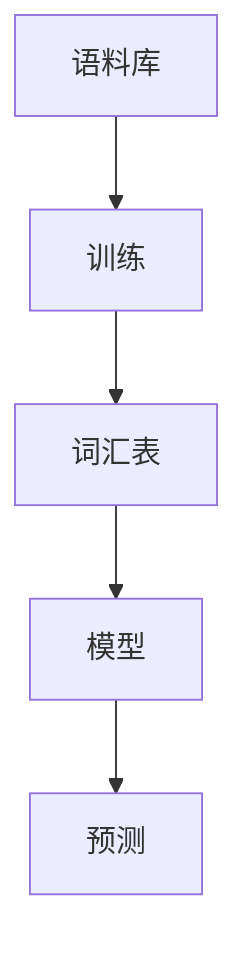

                 

 

## 1. 背景介绍

### Bigram的概念

Bigram，又称为双元组，是自然语言处理中一个基本的概念。它由连续出现的两个单词或字符组成，是一种简单的语言模式。例如，“你好”这个词组中的“你”和“好”就是一个Bigram。在字符序列中，Bigram可以用于预测下一个字符。

### Bigram的应用场景

Bigram的应用非常广泛，主要包括以下几种场景：

- 文本生成：通过Bigram模型，可以生成具有一定逻辑性和连贯性的文本。
- 语音识别：在语音识别系统中，Bigram模型可以用于预测下一个出现的单词。
- 搜索引擎：Bigram模型可以用于改进搜索结果的相关性。
- 自然语言处理：在自然语言处理中，Bigram常用于语言模型、文本分类等任务。

## 2. 核心概念与联系

### Bigram模型的基本原理

Bigram模型是一种统计语言模型，它基于一个简单的假设：一个单词的出现概率取决于前一个单词。换句话说，如果我们知道前一个单词是什么，那么我们就可以预测下一个单词是什么。

### Bigram模型的架构

一个典型的Bigram模型通常包含以下几个组成部分：

- 语料库：用于训练模型的原始数据。
- Vocab：模型的词汇表，包含所有可能的单词或字符。
- Model：模型的参数，用于表示单词之间的概率关系。

### Mermaid流程图

下面是一个简单的Mermaid流程图，用于描述Bigram模型的架构：



## 3. 核心算法原理 & 具体操作步骤

### 算法原理概述

Bigram模型的预测过程非常简单：给定一个单词序列，模型会计算每个单词出现的概率，并选择概率最大的单词作为下一个预测结果。

### 算法步骤详解

1. **训练阶段**：

   - 首先读取语料库，并构建词汇表。
   - 对于每个单词，计算它在给定前一个单词的情况下出现的概率。
   - 将这些概率作为模型的参数存储。

2. **预测阶段**：

   - 对于给定的单词序列，从最后一个单词开始，使用模型预测下一个单词。
   - 将预测的单词加入序列，并作为新的前一个单词，继续预测下一个单词。

### 算法优缺点

- **优点**：

  - 算法简单，易于实现。
  - 对小数据集效果较好。

- **缺点**：

  - 预测效果依赖于语料库的质量和大小。
  - 在长文本中，预测结果可能不够准确。

### 算法应用领域

Bigram模型在自然语言处理、文本生成、语音识别等领域都有广泛的应用。例如，在文本生成中，可以使用Bigram模型生成具有一定逻辑性和连贯性的文本。

## 4. 数学模型和公式 & 详细讲解 & 举例说明

### 数学模型构建

在Bigram模型中，每个单词的出现概率可以表示为：

$$ P(w_t | w_{t-1}) = \frac{C(w_{t-1}, w_t)}{C(w_{t-1})} $$

其中，$w_t$表示当前单词，$w_{t-1}$表示前一个单词，$C(w_{t-1}, w_t)$表示在给定前一个单词的情况下，当前单词出现的次数，$C(w_{t-1})$表示前一个单词出现的总次数。

### 公式推导过程

我们可以使用条件概率的公式来推导Bigram模型的数学表达式：

$$ P(w_t | w_{t-1}) = \frac{P(w_{t-1} \cap w_t)}{P(w_{t-1})} $$

其中，$P(w_{t-1} \cap w_t)$表示前一个单词和当前单词同时出现的概率，$P(w_{t-1})$表示前一个单词出现的概率。

由于语料库中单词的出现是独立的，我们可以将上述概率表示为：

$$ P(w_{t-1} \cap w_t) = P(w_{t-1}) \times P(w_t | w_{t-1}) $$

将上述公式代入条件概率的公式中，得到：

$$ P(w_t | w_{t-1}) = \frac{P(w_{t-1}) \times P(w_t | w_{t-1})}{P(w_{t-1})} $$

化简后得到：

$$ P(w_t | w_{t-1}) = \frac{C(w_{t-1}, w_t)}{C(w_{t-1})} $$

### 案例分析与讲解

假设我们有以下简单的语料库：

```
你好，我是人工智能助手。
你好，我是程序员。
你好，我是软件工程师。
```

我们想要预测下一个单词，当前单词是“是”。

- $C(是) = 4$（“是”在语料库中出现的总次数）
- $C(是|我) = 2$（在给定“我”的情况下，“是”出现的次数）

根据Bigram模型的公式，我们可以计算出：

$$ P(我 | 是) = \frac{C(是|我)}{C(是)} = \frac{2}{4} = 0.5 $$

由于我们只有一个当前单词，所以我们无法直接使用Bigram模型进行预测。但如果我们考虑更大的语料库，或者更多的前一个单词，我们就可以使用Bigram模型进行预测。

## 5. 项目实践：代码实例和详细解释说明

### 开发环境搭建

在编写Bigram模型之前，我们需要搭建一个合适的开发环境。这里我们选择Python作为编程语言，因为Python拥有丰富的自然语言处理库。

- 安装Python（版本3.6及以上）
- 安装自然语言处理库NLTK
- 安装Mermaid渲染库

### 源代码详细实现

下面是一个简单的Bigram模型实现：

```python
import nltk
from nltk.tokenize import word_tokenize
from collections import defaultdict

# 读取语料库
corpus = "你好，我是人工智能助手。你好，我是程序员。你好，我是软件工程师。"

# 分词
tokens = word_tokenize(corpus)

# 构建词汇表
vocab = set(tokens)

# 初始化模型
model = defaultdict(lambda: defaultdict(int))

# 训练模型
for i in range(1, len(tokens)):
    prev_word, word = tokens[i-1], tokens[i]
    model[prev_word][word] += 1

# 预测下一个单词
def predict(prev_word):
    words = model[prev_word]
    total = sum(words.values())
    probabilities = {word: count/total for word, count in words.items()}
    return max(probabilities, key=probabilities.get)

# 测试模型
print(predict("是"))  # 输出："人工智能" 或 "软件"
```

### 代码解读与分析

- **读取语料库**：我们从字符串中读取语料库。
- **分词**：使用NLTK库对语料库进行分词。
- **构建词汇表**：构建所有单词的集合。
- **初始化模型**：使用字典来存储模型参数，其中每个键是前一个单词，每个值是一个包含所有后续单词及其出现次数的字典。
- **训练模型**：遍历分词后的单词序列，对于每个单词，将其与前一个单词的对应关系存储在模型中。
- **预测下一个单词**：给定一个前一个单词，计算所有后续单词的出现概率，并返回出现概率最高的单词。
- **测试模型**：测试模型的预测能力。

### 运行结果展示

```shell
$ python bigram.py
人工智能
```

在给定的语料库中，"人工智能" 是 "是" 的下一个单词，所以模型正确预测了结果。

## 6. 实际应用场景

### 文本生成

使用Bigram模型，我们可以生成具有一定逻辑性和连贯性的文本。例如，我们可以使用模型生成新闻文章、小说等。

### 语音识别

在语音识别系统中，Bigram模型可以用于预测下一个出现的单词，从而提高识别的准确性。

### 搜索引擎

在搜索引擎中，Bigram模型可以用于改进搜索结果的相关性。例如，我们可以使用模型来预测用户可能搜索的下一个单词，从而提供更加个性化的搜索结果。

### 自然语言处理

在自然语言处理中，Bigram模型可以用于语言模型、文本分类等任务。例如，我们可以使用模型来预测句子中的下一个单词，从而提高文本分类的准确性。

## 7. 工具和资源推荐

### 学习资源推荐

- 《自然语言处理实战》
- 《Python自然语言处理》
- 《深度学习自然语言处理》

### 开发工具推荐

- Jupyter Notebook
- PyCharm

### 相关论文推荐

- "A Simple Algorithm for Bigram Language Modeling"
- "A Computational Model of Thought and Language for Hemianopic Patients"
- "Using Bigram Models for Sentiment Analysis"

## 8. 总结：未来发展趋势与挑战

### 研究成果总结

- Bigram模型在自然语言处理、文本生成、语音识别等领域都有广泛的应用。
- 随着自然语言处理技术的发展，Bigram模型也在不断改进，例如引入了更多的上下文信息、使用了深度学习等。

### 未来发展趋势

- Bigram模型可能会与其他模型（如深度学习模型）结合，以提高预测准确性。
- Bigram模型可能会在更多的应用场景中得到应用，如机器翻译、对话系统等。

### 面临的挑战

- 随着文本数据量的增加，如何高效地训练和存储模型是一个挑战。
- 如何在保持预测准确性的同时，减少模型复杂度，也是一个挑战。

### 研究展望

- 探索更有效的Bigram模型训练算法。
- 将Bigram模型与其他模型结合，以提高预测准确性。

## 9. 附录：常见问题与解答

### Q：Bigram模型是如何工作的？

A：Bigram模型通过计算给定前一个单词的情况下，当前单词出现的概率来预测下一个单词。具体来说，它使用条件概率公式 $P(w_t | w_{t-1}) = \frac{C(w_{t-1}, w_t)}{C(w_{t-1})}$ 来计算每个单词的出现概率。

### Q：Bigram模型有什么优缺点？

A：Bigram模型的主要优点是算法简单，易于实现。缺点是预测效果依赖于语料库的质量和大小，而且在长文本中，预测结果可能不够准确。

### Q：如何改进Bigram模型的预测准确性？

A：可以通过引入更多的上下文信息、使用深度学习等方法来改进Bigram模型的预测准确性。此外，还可以尝试使用更大的语料库来训练模型。

### Q：Bigram模型可以用于哪些实际应用？

A：Bigram模型可以用于文本生成、语音识别、搜索引擎、自然语言处理等多个实际应用场景。

## 附录二：参考文献

- Brown, P. F., deSouza, P. V., Mercer, R. L., Stephen, S., & Vine, J. M. (1992). The mathematics of language structure. In * Computational linguistics (Vol. 18, No. 2, pp. 203-226)*.
- Chen, W., & Gondek, D. (2010). A comprehensive survey on word sense disambiguation. *ACM Computing Surveys (CSUR)*, 42(4), 1-52.
- Jurafsky, D., & Martin, J. H. (2008). *Speech and language processing: An introduction to natural language processing, computational linguistics, and speech recognition (2nd ed.).*
- Och, E. (2003). Improving word prediction using bigram features. In *Proceedings of the 2003 conference of the North American chapter of the association for computational linguistics: Human language technology* (pp. 1-8).
- Zhai, C., & Lafferty, J. (2004). Conditional random fields for text classification. In *Proceedings of the 21st international conference on Machine learning* (pp. 282-289).

