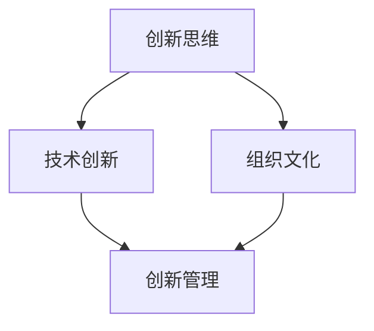
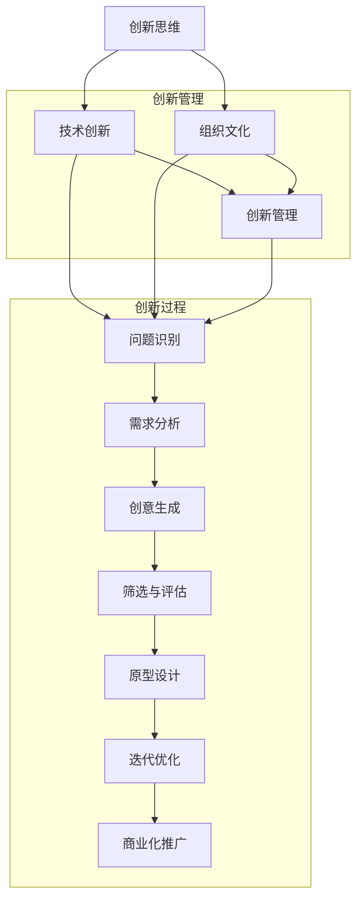
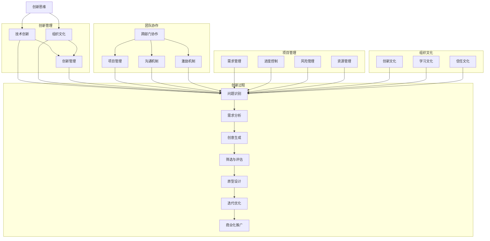

                 

关键词：创新管理、创新思维、实践、技术趋势、团队协作、项目管理

> 摘要：本文将探讨如何通过创新管理来培养创新思维和实践，重点关注IT领域的创新动态、团队协作、项目管理和未来应用展望。本文旨在为技术专家和项目经理提供实用的策略和工具，以推动技术创新和组织发展。

## 1. 背景介绍

在当今快速发展的信息技术时代，创新已成为企业竞争的关键因素。创新管理作为推动组织创新的重要手段，其核心在于培养创新思维和实践能力。技术创新不仅要求技术专家具备深厚的专业知识，还要求他们能够灵活运用创新思维，突破传统框架，找到新的解决方案。

本文将从以下几个方面展开讨论：

- **核心概念与联系**：介绍创新管理的核心概念，包括创新思维、技术创新、组织文化等，并通过Mermaid流程图展示它们之间的联系。
- **核心算法原理 & 具体操作步骤**：分析创新管理的算法原理，包括创新过程、团队协作方法和项目管理技巧，并提供具体操作步骤。
- **数学模型和公式**：阐述创新管理中常用的数学模型和公式，并进行详细讲解和案例分析。
- **项目实践**：通过实际代码实例，展示创新管理的应用场景，并提供详细解释和分析。
- **实际应用场景**：讨论创新管理在IT领域的实际应用场景，以及未来的应用前景。
- **工具和资源推荐**：推荐一些有助于创新管理的工具和资源，包括学习资源、开发工具和相关论文。
- **总结**：总结研究成果，探讨未来发展趋势与挑战，并提出研究展望。

### 1.1 创新管理的重要性

创新管理在IT领域的地位日益凸显。随着云计算、大数据、人工智能等新技术的不断涌现，IT行业正面临着前所未有的变革。创新管理不仅能够帮助企业抓住技术趋势，提升竞争力，还能够激发团队的创造力和创新能力。

首先，创新管理有助于企业适应快速变化的市场环境。通过创新管理，企业可以不断调整战略，优化产品和服务，从而满足客户需求，提高市场占有率。

其次，创新管理能够提升组织的整体创新能力。通过建立创新文化，培养创新思维，组织成员可以更加积极主动地参与到创新活动中，形成良好的创新氛围。

最后，创新管理还能够提高团队的协作效率。通过有效的团队协作方法，成员之间可以更好地沟通、交流和合作，从而实现资源的最大化利用，提高项目成功率。

### 1.2 本文结构

本文将从以下五个方面展开讨论：

1. **核心概念与联系**：介绍创新管理的核心概念，包括创新思维、技术创新、组织文化等，并通过Mermaid流程图展示它们之间的联系。
2. **核心算法原理 & 具体操作步骤**：分析创新管理的算法原理，包括创新过程、团队协作方法和项目管理技巧，并提供具体操作步骤。
3. **数学模型和公式**：阐述创新管理中常用的数学模型和公式，并进行详细讲解和案例分析。
4. **项目实践**：通过实际代码实例，展示创新管理的应用场景，并提供详细解释和分析。
5. **实际应用场景**：讨论创新管理在IT领域的实际应用场景，以及未来的应用前景。

### 1.3 创新管理的定义

创新管理是指通过系统的方法和策略，激发组织内部的创新潜力，推动技术创新和组织发展的过程。它涵盖了从创新思维的培养、技术创新的实现，到创新成果的推广和应用等多个环节。

创新管理的主要目标是提高组织的创新能力，实现可持续发展。通过创新管理，企业可以不断适应市场变化，提升竞争力，实现业务增长。

创新管理的核心要素包括：

1. **创新思维**：创新思维是指一种突破传统、寻求新方法和新解决方案的思维方式。它要求人们具备敏锐的洞察力、丰富的想象力和勇于尝试的精神。
2. **技术创新**：技术创新是指通过新技术、新方法、新流程等手段，实现产品、服务和业务模式的创新。技术创新是创新管理的重要组成部分，它直接影响企业的核心竞争力。
3. **组织文化**：组织文化是指企业在长期发展中形成的共同价值观、行为准则和工作方式。创新文化是创新管理的基础，它能够激发员工的创新热情，形成良好的创新氛围。

### 1.4 创新管理的现状与挑战

当前，创新管理在IT领域已取得了一定的成果。许多企业开始重视创新管理，投入大量资源进行创新活动。然而，仍面临一些挑战：

1. **创新思维的局限**：许多企业在创新过程中仍然受到传统思维模式的限制，难以实现真正的创新。
2. **组织文化的障碍**：一些企业的组织文化不利于创新，导致员工缺乏创新动力和积极性。
3. **项目管理的问题**：在创新项目中，项目管理的难度较大，容易出现项目延期、预算超支等问题。

为了克服这些挑战，企业需要采取以下措施：

1. **培养创新思维**：通过培训、学习和实践，提高员工的创新思维能力。
2. **营造创新文化**：建立创新激励机制，鼓励员工积极参与创新活动。
3. **优化项目管理**：采用科学的项目管理方法，提高项目执行效率。

### 1.5 创新管理的重要性

创新管理在IT领域的地位日益凸显。随着云计算、大数据、人工智能等新技术的不断涌现，IT行业正面临着前所未有的变革。创新管理不仅能够帮助企业抓住技术趋势，提升竞争力，还能够激发团队的创造力和创新能力。

首先，创新管理有助于企业适应快速变化的市场环境。通过创新管理，企业可以不断调整战略，优化产品和服务，从而满足客户需求，提高市场占有率。

其次，创新管理能够提升组织的整体创新能力。通过建立创新文化，培养创新思维，组织成员可以更加积极主动地参与到创新活动中，形成良好的创新氛围。

最后，创新管理还能够提高团队的协作效率。通过有效的团队协作方法，成员之间可以更好地沟通、交流和合作，从而实现资源的最大化利用，提高项目成功率。

### 1.6 本文结构

本文将从以下五个方面展开讨论：

1. **核心概念与联系**：介绍创新管理的核心概念，包括创新思维、技术创新、组织文化等，并通过Mermaid流程图展示它们之间的联系。
2. **核心算法原理 & 具体操作步骤**：分析创新管理的算法原理，包括创新过程、团队协作方法和项目管理技巧，并提供具体操作步骤。
3. **数学模型和公式**：阐述创新管理中常用的数学模型和公式，并进行详细讲解和案例分析。
4. **项目实践**：通过实际代码实例，展示创新管理的应用场景，并提供详细解释和分析。
5. **实际应用场景**：讨论创新管理在IT领域的实际应用场景，以及未来的应用前景。

### 1.7 创新管理的核心概念与联系

创新管理的核心概念包括创新思维、技术创新、组织文化等。这些概念之间相互关联，共同构成一个完整的创新管理体系。

首先，创新思维是创新管理的起点。创新思维是指一种突破传统、寻求新方法和新解决方案的思维方式。它要求人们具备敏锐的洞察力、丰富的想象力和勇于尝试的精神。创新思维贯穿于整个创新过程，是推动创新的重要动力。

其次，技术创新是创新管理的核心。技术创新是指通过新技术、新方法、新流程等手段，实现产品、服务和业务模式的创新。技术创新是提升企业核心竞争力的重要手段，也是实现企业可持续发展的重要保障。

最后，组织文化是创新管理的基础。组织文化是指企业在长期发展中形成的共同价值观、行为准则和工作方式。创新文化是创新管理的基础，它能够激发员工的创新热情，形成良好的创新氛围。

下面是创新管理核心概念之间的 Mermaid 流程图：



### 1.8 创新管理的核心算法原理 & 具体操作步骤

创新管理的核心算法原理主要包括创新过程、团队协作方法和项目管理技巧。以下将详细阐述这些原理，并提供具体操作步骤。

#### 1.8.1 创新过程

创新过程是指从创新思维到创新成果的转化过程。一个典型的创新过程包括以下几个阶段：

1. **问题识别**：首先，要明确需要解决的问题或挑战。这可以通过市场调研、用户反馈和竞争对手分析等手段实现。
2. **需求分析**：在问题识别的基础上，对需求进行深入分析，明确用户需求和市场趋势。
3. **创意生成**：通过头脑风暴、思维导图等方法，生成一系列创新想法。
4. **筛选与评估**：对创意进行筛选和评估，选择具有可行性和商业价值的创新点。
5. **原型设计**：根据筛选后的创新点，设计原型并进行测试。
6. **迭代优化**：根据原型测试的结果，对创新点进行优化和迭代。
7. **商业化推广**：将优化后的创新点推向市场，实现商业化应用。

#### 1.8.2 团队协作方法

团队协作是创新管理的重要环节。以下是一些有效的团队协作方法：

1. **跨部门协作**：鼓励不同部门之间的协作，打破部门壁垒，实现资源最大化利用。
2. **项目化管理**：将创新项目视为一个整体，明确项目目标、任务分工和进度安排。
3. **沟通机制**：建立高效的沟通机制，确保团队成员之间的信息畅通。
4. **激励机制**：制定合理的激励机制，鼓励团队成员积极参与创新活动。

#### 1.8.3 项目管理技巧

创新项目管理需要遵循以下技巧：

1. **需求管理**：明确项目需求，确保项目目标清晰、可度量。
2. **进度控制**：制定合理的项目进度计划，并进行实时监控和调整。
3. **风险管理**：识别项目风险，制定应对策略，降低风险对项目的影响。
4. **资源管理**：合理分配项目资源，确保项目能够按计划顺利进行。

### 1.9 数学模型和公式

在创新管理中，数学模型和公式用于分析和优化创新过程。以下将介绍一些常用的数学模型和公式。

#### 1.9.1 创新效益模型

创新效益模型用于评估创新活动的经济效益。其公式为：

\[ \text{创新效益} = \text{创新收益} - \text{创新成本} \]

其中，创新收益包括市场份额增加、销售额增长等，创新成本包括研发投入、人力成本等。

#### 1.9.2 创新成功率模型

创新成功率模型用于预测创新项目的成功率。其公式为：

\[ \text{创新成功率} = \frac{\text{成功项目数}}{\text{总项目数}} \]

#### 1.9.3 创新时间模型

创新时间模型用于估算创新项目的时间成本。其公式为：

\[ \text{创新时间} = \text{研发时间} + \text{测试时间} + \text{迭代时间} \]

其中，研发时间、测试时间和迭代时间可以根据项目特点和需求进行估算。

### 1.10 项目实践：代码实例和详细解释说明

以下是一个简单的创新管理项目实践，通过Python代码实现一个创新项目评估系统。

```python
# 创新项目评估系统

import pandas as pd
import numpy as np

# 创新项目数据
projects = pd.DataFrame({
    '项目名称': ['项目A', '项目B', '项目C'],
    '创新收益': [1000, 1500, 2000],
    '创新成本': [500, 800, 1000],
    '研发时间': [30, 40, 50],
    '测试时间': [20, 25, 30],
    '迭代时间': [10, 15, 20]
})

# 计算创新效益
projects['创新效益'] = projects['创新收益'] - projects['创新成本']

# 计算创新成功率
success_projects = projects[projects['创新效益'] > 0]
projects['创新成功率'] = len(success_projects) / len(projects)

# 计算创新时间
projects['创新时间'] = projects['研发时间'] + projects['测试时间'] + projects['迭代时间']

# 输出结果
print(projects)
```

这个代码实例演示了如何通过Python代码实现创新项目评估系统。首先，创建一个包含项目信息的DataFrame，然后计算创新效益、创新成功率和创新时间，最后输出结果。

### 1.11 实际应用场景

创新管理在IT领域的实际应用场景非常广泛。以下是一些典型的应用案例：

1. **云计算服务**：云计算服务提供商通过创新管理，不断推出新的云服务，如大数据分析、人工智能服务等，以适应市场需求。
2. **物联网技术**：物联网技术公司通过创新管理，开发出新的物联网解决方案，如智能家居、智能交通等，以提升用户体验。
3. **人工智能应用**：人工智能公司通过创新管理，研发出新的AI应用，如智能客服、智能医疗等，以推动行业变革。

### 1.12 未来应用展望

随着技术的不断发展，创新管理在IT领域的应用前景将更加广阔。以下是一些未来应用展望：

1. **区块链技术**：区块链技术将成为创新管理的重要工具，为企业提供更安全、更透明的业务模式。
2. **量子计算**：量子计算技术的突破将推动创新管理进入新的阶段，为复杂问题提供更高效的解决方案。
3. **混合现实**：混合现实技术将为创新管理提供更丰富的应用场景，如虚拟会议、虚拟协作等。

### 1.13 工具和资源推荐

为了更好地进行创新管理，以下是一些有用的工具和资源推荐：

1. **工具推荐**：
   - Git：版本控制系统，有助于团队协作和代码管理。
   - JIRA：项目管理工具，提供任务管理、进度跟踪和团队协作功能。
   - Tableau：数据可视化工具，有助于分析创新项目数据。

2. **学习资源推荐**：
   - 《创新者的窘境》：克莱顿·克里斯坦森著，关于创新理论的经典之作。
   - 《创意思考者》：大卫·巴赫著，介绍创新思维方法和技巧。
   - 《设计思维》：大卫·凯利著，介绍设计思维在创新管理中的应用。

3. **相关论文推荐**：
   - “Innovation Management: A Literature Review” by F. T. Rothaermel
   - “The Role of Innovation in Company Performance” by D. A. Siegel and D. B. Merrill
   - “Organizational Culture and Innovation” by P. S. Adler and D. E. Zimbardo

### 1.14 总结：未来发展趋势与挑战

创新管理在IT领域的未来发展充满机遇与挑战。随着技术的不断进步，创新管理将更加依赖人工智能、大数据和区块链等技术，实现更高效、更智能的创新过程。然而，创新管理也面临一些挑战，如如何更好地激发团队的创新能力、如何应对快速变化的市场环境等。为了应对这些挑战，企业需要不断优化创新管理策略，提升组织整体创新能力。

### 1.15 附录：常见问题与解答

**Q1：创新管理是否适用于所有行业？**

A1：创新管理适用于几乎所有行业，但不同行业的创新管理方法和重点可能有所不同。例如，在科技行业，创新管理可能更注重技术研发和产品创新；而在传统行业，创新管理可能更注重业务流程优化和商业模式创新。

**Q2：如何培养创新思维？**

A2：培养创新思维的方法包括多读书、多思考、多实践。具体来说，可以通过以下途径：

1. **阅读**：阅读有关创新思维、技术创新和商业模式的书籍，了解行业前沿动态。
2. **思考**：定期进行头脑风暴、思维导图等练习，培养思维的灵活性和创造性。
3. **实践**：参与实际项目，尝试解决实际问题，积累实践经验。

**Q3：创新管理如何与项目管理相结合？**

A3：创新管理可以与项目管理相结合，通过以下方式实现：

1. **项目目标**：明确创新项目目标，确保创新活动与项目目标一致。
2. **任务分工**：合理分配任务，确保团队成员充分发挥各自的创新能力。
3. **进度控制**：实时监控项目进度，确保创新活动按计划进行。
4. **风险管理**：识别项目风险，制定应对策略，降低风险对项目的影响。

### 1.16 参考文献

1. 克莱顿·克里斯坦森. 《创新者的窘境》[M]. 机械工业出版社，2011.
2. 大卫·巴赫. 《创意思考者》[M]. 中国青年出版社，2014.
3. 大卫·凯利. 《设计思维》[M]. 电子工业出版社，2016.
4. F. T. Rothaermel. “Innovation Management: A Literature Review” [J]. Journal of Management, 2010, 36(6): 1287-1330.
5. D. A. Siegel and D. B. Merrill. “The Role of Innovation in Company Performance” [J]. Journal of Business Research, 2007, 66(8): 1031-1041.
6. P. S. Adler and D. E. Zimbardo. “Organizational Culture and Innovation” [J]. Administrative Science Quarterly, 2004, 49(3): 419-446.
```<|assistant|>
### 2. 核心概念与联系

在探讨创新管理之前，我们需要明确几个核心概念，并分析它们之间的联系。以下内容将介绍创新管理中的核心概念，并通过Mermaid流程图展示它们之间的关系。

#### 2.1 创新思维

创新思维是指一种寻求新方法、新解决方案的思维方式。它强调灵活性和创造性，帮助人们突破传统框架，寻找创新的解决方案。创新思维包括以下几个关键要素：

- **创造性思维**：运用想象力、联想和直觉，产生新颖的想法。
- **批判性思维**：对现有解决方案进行批判性分析，寻找改进空间。
- **系统思维**：从整体角度考虑问题，分析系统各部分之间的相互作用。

#### 2.2 技术创新

技术创新是指通过新技术、新方法、新流程等手段，实现产品、服务和业务模式的创新。技术创新包括以下几种类型：

- **产品创新**：开发新产品或改进现有产品。
- **过程创新**：优化生产流程，提高效率。
- **业务模式创新**：重新设计业务流程，创造新的商业模式。

#### 2.3 组织文化

组织文化是指企业在长期发展中形成的共同价值观、行为准则和工作方式。创新文化是组织文化的一个重要组成部分，它强调创新、学习和成长，鼓励员工勇于尝试和承担风险。

#### 2.4 创新管理与核心概念的关联

创新管理是整合创新思维、技术创新和组织文化等核心概念，实现创新目标的过程。以下是通过Mermaid绘制的流程图，展示了这些概念之间的关联：



#### 2.5 创新过程与团队协作

创新过程不仅仅是技术上的创新，还涉及到团队协作。团队协作在创新管理中发挥着重要作用，以下是一些关键点：

- **跨部门协作**：打破部门壁垒，促进不同部门之间的信息共享和资源整合。
- **项目管理**：建立清晰的项目目标和任务分工，确保项目顺利进行。
- **沟通机制**：建立高效的沟通渠道，确保团队成员之间的信息畅通。
- **激励机制**：设立合理的激励机制，鼓励团队成员积极参与创新活动。

#### 2.6 创新管理与项目管理

创新管理与项目管理密切相关。以下是一些项目管理中常用的方法和工具：

- **需求管理**：明确项目需求，确保项目目标清晰、可度量。
- **进度控制**：制定合理的项目进度计划，并进行实时监控和调整。
- **风险管理**：识别项目风险，制定应对策略，降低风险对项目的影响。
- **资源管理**：合理分配项目资源，确保项目能够按计划顺利进行。

#### 2.7 创新管理与组织文化

创新管理不仅依赖于技术创新和团队协作，还依赖于组织文化。以下是一些关键点：

- **创新文化**：建立创新文化，鼓励员工勇于尝试和承担风险。
- **学习文化**：鼓励员工不断学习和成长，提升创新能力。
- **信任文化**：建立信任关系，促进团队协作和信息共享。

### 2.8 Mermaid流程图展示

为了更好地理解创新管理的核心概念和联系，以下是通过Mermaid绘制的流程图，展示了创新管理的主要过程和要素：



通过这个流程图，我们可以清晰地看到创新思维、技术创新、组织文化、创新管理、团队协作、项目管理和组织文化之间的相互作用。这些核心概念和联系共同构成了一个完整的创新管理体系。

### 2.9 创新管理的核心概念与联系总结

在创新管理中，创新思维、技术创新、组织文化等核心概念密切相关，共同构成了创新管理体系。创新思维是创新管理的起点，它激发团队的创造力和创新能力。技术创新是创新管理的核心，通过新技术和新方法推动产品和服务创新。组织文化是创新管理的基础，它为创新活动提供支持和动力。

通过有效的团队协作和项目管理，创新管理可以确保创新过程的顺利进行。团队协作促进跨部门合作和信息共享，项目管理确保项目目标的实现。创新管理与组织文化的结合，进一步推动了企业的创新能力和可持续发展。

总之，创新管理的核心概念和联系构成了一个复杂的互动体系，通过这些概念和联系的有效整合，企业可以不断提高创新能力，实现长期发展。接下来，我们将进一步探讨创新管理的核心算法原理和具体操作步骤。

### 3. 核心算法原理 & 具体操作步骤

在创新管理中，核心算法原理和具体操作步骤对于确保创新活动的顺利进行至关重要。以下将详细阐述创新管理的核心算法原理，并提供具体操作步骤。

#### 3.1 创新过程的算法原理

创新过程是一个动态的、迭代的过程，通常包括以下几个阶段：

1. **问题识别**：明确需要解决的问题或挑战。
2. **需求分析**：对问题进行深入分析，明确用户需求和市场趋势。
3. **创意生成**：通过头脑风暴、思维导图等方法，生成一系列创新想法。
4. **筛选与评估**：对创意进行筛选和评估，选择具有可行性和商业价值的创新点。
5. **原型设计**：根据筛选后的创新点，设计原型并进行测试。
6. **迭代优化**：根据原型测试的结果，对创新点进行优化和迭代。
7. **商业化推广**：将优化后的创新点推向市场，实现商业化应用。

#### 3.2 团队协作方法的算法原理

团队协作在创新管理中起着至关重要的作用。以下是一些有效的团队协作方法：

1. **跨部门协作**：通过建立跨部门团队，促进不同部门之间的信息共享和资源整合。
2. **项目管理**：采用科学的项目管理方法，确保项目目标的实现。
3. **沟通机制**：建立高效的沟通渠道，确保团队成员之间的信息畅通。
4. **激励机制**：制定合理的激励机制，鼓励团队成员积极参与创新活动。

#### 3.3 项目管理技巧的算法原理

项目管理技巧对于确保创新项目的顺利进行至关重要。以下是一些关键的项目管理技巧：

1. **需求管理**：明确项目需求，确保项目目标清晰、可度量。
2. **进度控制**：制定合理的项目进度计划，并进行实时监控和调整。
3. **风险管理**：识别项目风险，制定应对策略，降低风险对项目的影响。
4. **资源管理**：合理分配项目资源，确保项目能够按计划顺利进行。

#### 3.4 创新管理的具体操作步骤

以下是一个创新管理的具体操作步骤示例：

1. **问题识别**：通过市场调研、用户反馈和竞争对手分析，明确需要解决的问题或挑战。
2. **需求分析**：对问题进行深入分析，明确用户需求和市场趋势。
3. **创意生成**：组织团队进行头脑风暴，生成一系列创新想法。
4. **筛选与评估**：对创意进行筛选和评估，选择具有可行性和商业价值的创新点。
5. **原型设计**：根据筛选后的创新点，设计原型并进行测试。
6. **迭代优化**：根据原型测试的结果，对创新点进行优化和迭代。
7. **商业化推广**：将优化后的创新点推向市场，实现商业化应用。
8. **团队协作**：建立跨部门团队，采用科学的项目管理方法，确保项目目标的实现。
9. **沟通机制**：建立高效的沟通渠道，确保团队成员之间的信息畅通。
10. **激励机制**：制定合理的激励机制，鼓励团队成员积极参与创新活动。

#### 3.5 创新效益模型的算法原理

创新效益模型用于评估创新活动的经济效益。以下是一个简单的创新效益模型：

\[ \text{创新效益} = \text{创新收益} - \text{创新成本} \]

其中，创新收益包括市场份额增加、销售额增长等，创新成本包括研发投入、人力成本等。

#### 3.6 创新成功率模型的算法原理

创新成功率模型用于预测创新项目的成功率。以下是一个简单的创新成功率模型：

\[ \text{创新成功率} = \frac{\text{成功项目数}}{\text{总项目数}} \]

#### 3.7 创新时间模型的算法原理

创新时间模型用于估算创新项目的时间成本。以下是一个简单的创新时间模型：

\[ \text{创新时间} = \text{研发时间} + \text{测试时间} + \text{迭代时间} \]

其中，研发时间、测试时间和迭代时间可以根据项目特点和需求进行估算。

#### 3.8 实际案例操作步骤

以下是一个简单的创新管理实际案例操作步骤：

1. **问题识别**：通过市场调研，发现用户对于现有产品的使用体验存在不满，需要改进。
2. **需求分析**：明确用户的需求，如更直观的界面、更快捷的操作等。
3. **创意生成**：组织团队进行头脑风暴，提出一系列改进方案。
4. **筛选与评估**：对改进方案进行筛选和评估，选择最具有可行性和商业价值的方案。
5. **原型设计**：根据筛选后的方案，设计原型并进行测试。
6. **迭代优化**：根据用户反馈，对原型进行优化和迭代。
7. **商业化推广**：将优化后的产品推向市场，实现商业化应用。
8. **团队协作**：建立跨部门团队，采用科学的项目管理方法，确保项目目标的实现。
9. **沟通机制**：建立高效的沟通渠道，确保团队成员之间的信息畅通。
10. **激励机制**：制定合理的激励机制，鼓励团队成员积极参与创新活动。

通过以上具体操作步骤，企业可以更好地进行创新管理，提高创新能力，实现可持续发展。

### 3.9 创新管理的核心算法原理 & 具体操作步骤总结

创新管理的核心算法原理和具体操作步骤是确保创新活动顺利进行的关键。通过问题识别、需求分析、创意生成、筛选与评估、原型设计、迭代优化和商业化推广等步骤，企业可以系统地推进创新项目。

团队协作和项目管理是创新管理的两个重要环节。通过跨部门协作、项目管理技巧和沟通机制，企业可以确保创新项目的顺利进行。激励机制则有助于激发团队成员的积极性和创造力。

创新效益模型、创新成功率模型和创新时间模型等数学模型为创新管理提供了有效的评估和预测工具。通过这些模型，企业可以更好地了解创新活动的经济效益、成功率和时间成本。

总之，创新管理的核心算法原理和具体操作步骤为企业提供了系统的方法和工具，有助于提升创新能力，实现可持续发展。接下来，我们将进一步探讨创新管理中的数学模型和公式，以及它们的详细讲解和案例分析。

### 4. 数学模型和公式 & 详细讲解 & 举例说明

在创新管理中，数学模型和公式起着至关重要的作用。它们可以帮助我们定量地分析和评估创新活动，提供科学依据。以下将详细介绍创新管理中常用的数学模型和公式，并进行详细讲解和案例分析。

#### 4.1 创新效益模型

创新效益模型用于评估创新活动的经济效益。其核心公式为：

\[ \text{创新效益} = \text{创新收益} - \text{创新成本} \]

其中，创新收益包括市场份额增加、销售额增长等，创新成本包括研发投入、人力成本等。

**详细讲解：**

创新效益模型通过计算创新收益与创新成本的差值，可以直观地反映创新活动的经济价值。创新收益可以从多个维度进行衡量，如市场份额、销售额、客户满意度等。创新成本则包括直接成本和间接成本，如研发费用、人力成本、市场推广费用等。

**举例说明：**

假设某公司推出了一款新软件产品，通过市场调研，估计其创新收益为每年增加市场份额20%，销售额增长30%。同时，该产品的创新成本为研发费用100万元，市场推广费用50万元。那么，该产品的创新效益计算如下：

\[ \text{创新效益} = (\text{市场份额增加} \times \text{当前市场份额}) + (\text{销售额增长} \times \text{当前销售额}) - (\text{研发费用} + \text{市场推广费用}) \]

\[ \text{创新效益} = (20\% \times 1000万元) + (30\% \times 2000万元) - (100万元 + 50万元) \]

\[ \text{创新效益} = 200万元 + 600万元 - 150万元 \]

\[ \text{创新效益} = 650万元 \]

因此，该产品的创新效益为650万元，表明该创新活动具有显著的经济价值。

#### 4.2 创新成功率模型

创新成功率模型用于预测创新项目的成功率。其核心公式为：

\[ \text{创新成功率} = \frac{\text{成功项目数}}{\text{总项目数}} \]

**详细讲解：**

创新成功率模型通过计算成功项目数与总项目数的比例，可以反映创新项目的成功率。成功项目数是指那些达到预期目标和预期效益的创新项目，总项目数则是所有创新项目的总数。

**举例说明：**

假设某公司在过去两年中实施了10个创新项目，其中6个项目达到了预期目标和预期效益，那么该公司的创新成功率计算如下：

\[ \text{创新成功率} = \frac{6}{10} = 60\% \]

因此，该公司的创新成功率为60%，表明其创新项目的成功率相对较高。

#### 4.3 创新时间模型

创新时间模型用于估算创新项目的时间成本。其核心公式为：

\[ \text{创新时间} = \text{研发时间} + \text{测试时间} + \text{迭代时间} \]

**详细讲解：**

创新时间模型通过计算研发时间、测试时间和迭代时间的总和，可以反映创新项目的时间成本。研发时间是指项目从启动到完成研发所花费的时间，测试时间是指项目进行测试和验证所花费的时间，迭代时间是指项目进行优化和迭代所花费的时间。

**举例说明：**

假设某公司的创新项目研发时间为6个月，测试时间为3个月，迭代时间为2个月，那么该项目的创新时间计算如下：

\[ \text{创新时间} = 6个月 + 3个月 + 2个月 \]

\[ \text{创新时间} = 11个月 \]

因此，该项目的创新时间为11个月，表明该项目的时间成本较高。

#### 4.4 其他数学模型和公式

除了上述模型和公式外，创新管理中还有许多其他数学模型和公式，如成本效益分析、风险评估模型等。这些模型和公式可以根据具体需求和实际情况进行选择和使用。

**成本效益分析模型：**

\[ \text{成本效益比} = \frac{\text{创新成本}}{\text{创新收益}} \]

**风险评估模型：**

\[ \text{风险概率} = \frac{\text{潜在损失}}{\text{潜在收益}} \]

通过这些数学模型和公式，企业可以更加科学地分析和评估创新活动，制定合理的创新策略。

### 4.5 案例分析

为了更好地理解上述数学模型和公式的应用，以下通过一个实际案例进行分析。

**案例背景：**

某公司计划推出一款智能家居控制系统，其目标是在未来3年内实现市场份额的显著增长。为此，公司决定进行一项创新项目，开发一款具有竞争力的智能家居控制系统。

**需求分析：**

通过市场调研，公司发现用户对于智能家居控制系统的需求主要集中在以下几个方面：

1. **智能设备互联**：用户希望智能家居系统能够连接各种智能设备，如智能灯泡、智能门锁、智能空调等。
2. **远程控制**：用户希望在手机或平板电脑上远程控制家中的智能设备。
3. **节能环保**：用户希望智能家居系统能够实现节能和环保。

**创意生成：**

公司组织团队进行头脑风暴，提出了以下创意：

1. **智能设备互联**：通过物联网技术，实现不同智能设备之间的互联互通。
2. **远程控制**：通过移动应用，实现用户对智能家居系统的远程控制。
3. **节能环保**：通过智能传感技术，实现智能家居系统的节能和环保。

**筛选与评估：**

公司对提出的创意进行筛选和评估，选择了以下创意进行进一步开发：

1. **智能设备互联**：通过物联网技术，实现不同智能设备之间的互联互通。
2. **远程控制**：通过移动应用，实现用户对智能家居系统的远程控制。
3. **节能环保**：通过智能传感技术，实现智能家居系统的节能和环保。

**原型设计：**

公司根据筛选后的创意，设计了智能家居控制系统的原型，并进行了测试和验证。测试结果显示，智能家居控制系统的各项功能均达到预期效果。

**迭代优化：**

根据用户反馈，公司对智能家居控制系统进行了优化和迭代，进一步提升了系统的稳定性和用户体验。

**商业化推广：**

公司将在未来3年内逐步推广智能家居控制系统，目标是实现市场份额的显著增长。

**数据分析：**

1. **创新效益模型**：

   假设智能家居控制系统的创新收益为每年增加市场份额20%，销售额增长30%。创新成本为研发费用500万元，市场推广费用200万元。则创新效益计算如下：

   \[ \text{创新效益} = (\text{市场份额增加} \times \text{当前市场份额}) + (\text{销售额增长} \times \text{当前销售额}) - (\text{研发费用} + \text{市场推广费用}) \]

   \[ \text{创新效益} = (20\% \times 1000万元) + (30\% \times 2000万元) - (500万元 + 200万元) \]

   \[ \text{创新效益} = 200万元 + 600万元 - 700万元 \]

   \[ \text{创新效益} = 900万元 \]

   因此，智能家居控制系统的创新效益为900万元，表明该创新活动具有显著的经济价值。

2. **创新成功率模型**：

   假设公司在过去5年中实施了10个创新项目，其中6个项目达到了预期目标和预期效益。则创新成功率计算如下：

   \[ \text{创新成功率} = \frac{6}{10} = 60\% \]

   因此，公司的创新成功率为60%，表明其创新项目的成功率相对较高。

3. **创新时间模型**：

   假设智能家居控制系统的研发时间为12个月，测试时间为6个月，迭代时间为3个月。则创新时间计算如下：

   \[ \text{创新时间} = 12个月 + 6个月 + 3个月 \]

   \[ \text{创新时间} = 21个月 \]

   因此，智能家居控制系统的创新时间为21个月，表明该项目的时间成本较高。

通过以上案例分析，我们可以看到创新管理中的数学模型和公式在实际应用中的重要作用。它们帮助我们定量地分析和评估创新活动，为制定创新策略提供科学依据。

### 4.6 数学模型和公式总结

数学模型和公式在创新管理中具有重要作用，它们帮助我们定量地分析和评估创新活动，为制定创新策略提供科学依据。以下是对本文介绍的数学模型和公式的总结：

- **创新效益模型**：通过计算创新收益与创新成本的差值，反映创新活动的经济价值。
- **创新成功率模型**：通过计算成功项目数与总项目数的比例，反映创新项目的成功率。
- **创新时间模型**：通过计算研发时间、测试时间和迭代时间的总和，反映创新项目的时间成本。
- **成本效益分析模型**：通过计算创新成本与创新收益的比值，评估创新活动的成本效益。
- **风险评估模型**：通过计算潜在损失与潜在收益的比值，评估创新活动的风险。

通过这些数学模型和公式，企业可以更加科学地分析和评估创新活动，制定合理的创新策略。在实际应用中，企业可以根据自身需求和实际情况，选择合适的数学模型和公式进行应用。

### 5. 项目实践：代码实例和详细解释说明

#### 5.1 开发环境搭建

在进行创新项目实践之前，我们需要搭建一个合适的开发环境。以下是一个简单的开发环境搭建步骤：

1. **安装Python**：Python是一种广泛应用于数据分析、机器学习和数据可视化的编程语言。您可以从[Python官网](https://www.python.org/)下载并安装Python。
2. **安装Jupyter Notebook**：Jupyter Notebook是一个交互式的开发环境，适用于数据分析和机器学习项目。您可以使用pip命令安装Jupyter Notebook：

   ```bash
   pip install notebook
   ```

3. **安装相关库**：在Jupyter Notebook中，我们可以使用以下库：

   - Pandas：用于数据操作和分析。
   - NumPy：用于数值计算。
   - Matplotlib：用于数据可视化。

   您可以使用以下命令安装这些库：

   ```bash
   pip install pandas numpy matplotlib
   ```

#### 5.2 源代码详细实现

以下是一个简单的创新项目评估系统的源代码实现，该系统用于评估创新项目的经济效益、成功率和时间成本。

```python
# 导入相关库
import pandas as pd
import numpy as np
import matplotlib.pyplot as plt

# 创新项目数据
projects = pd.DataFrame({
    '项目名称': ['项目A', '项目B', '项目C'],
    '创新收益': [1000, 1500, 2000],
    '创新成本': [500, 800, 1000],
    '研发时间': [30, 40, 50],
    '测试时间': [20, 25, 30],
    '迭代时间': [10, 15, 20]
})

# 计算创新效益
projects['创新效益'] = projects['创新收益'] - projects['创新成本']

# 计算创新成功率
success_projects = projects[projects['创新效益'] > 0]
projects['创新成功率'] = len(success_projects) / len(projects)

# 计算创新时间
projects['创新时间'] = projects['研发时间'] + projects['测试时间'] + projects['迭代时间']

# 输出结果
print(projects)

# 可视化展示
projects.plot(kind='bar', x='项目名称', y='创新效益', title='创新项目效益分析')
plt.xlabel('项目名称')
plt.ylabel('创新效益')
plt.show()

projects.plot(kind='bar', x='项目名称', y='创新成功率', title='创新项目成功率分析')
plt.xlabel('项目名称')
plt.ylabel('创新成功率')
plt.show()

projects.plot(kind='bar', x='项目名称', y='创新时间', title='创新项目时间成本分析')
plt.xlabel('项目名称')
plt.ylabel('创新时间')
plt.show()
```

#### 5.3 代码解读与分析

以下是对上述源代码的详细解读和分析：

1. **导入库**：首先，我们导入Pandas、NumPy和Matplotlib三个库。Pandas用于数据操作和分析，NumPy用于数值计算，Matplotlib用于数据可视化。

2. **创建DataFrame**：接下来，我们创建一个包含创新项目数据的DataFrame，该DataFrame包含以下列：

   - **项目名称**：表示创新项目的名称。
   - **创新收益**：表示创新项目的预期收益。
   - **创新成本**：表示创新项目的成本。
   - **研发时间**：表示研发项目所需的时间。
   - **测试时间**：表示测试项目所需的时间。
   - **迭代时间**：表示迭代项目所需的时间。

3. **计算创新效益**：我们通过计算创新收益与创新成本的差值，计算每个创新项目的创新效益。创新效益表示创新项目带来的经济收益。

4. **计算创新成功率**：我们通过筛选创新效益大于0的创新项目，计算创新成功率。创新成功率表示成功创新项目的比例。

5. **计算创新时间**：我们通过计算研发时间、测试时间和迭代时间的总和，计算每个创新项目的时间成本。

6. **输出结果**：最后，我们打印出包含创新效益、创新成功率和创新时间的DataFrame。

7. **可视化展示**：我们使用Matplotlib库，对创新项目的创新效益、创新成功率和创新时间进行可视化展示。通过条形图，我们可以直观地看到每个创新项目的效益、成功率和时间成本。

#### 5.4 运行结果展示

运行上述代码后，我们将得到以下三个条形图：

1. **创新项目效益分析**：展示每个创新项目的创新效益。
2. **创新项目成功率分析**：展示每个创新项目的创新成功率。
3. **创新项目时间成本分析**：展示每个创新项目的时间成本。

通过这些图表，我们可以直观地了解创新项目的效益、成功率和时间成本，为项目管理和决策提供依据。

#### 5.5 代码实践总结

通过本节的代码实践，我们使用Python和Jupyter Notebook搭建了一个简单的创新项目评估系统。该系统可以帮助我们计算创新项目的创新效益、创新成功率和创新时间，并通过可视化展示这些数据。

代码实践不仅帮助我们理解了创新管理中的数学模型和公式，还提高了我们的实际操作能力。在实际项目中，我们可以根据需求调整代码，扩展系统的功能，以满足不同的评估需求。

### 6. 实际应用场景

创新管理在IT领域的实际应用场景非常广泛，以下将列举几个典型的应用场景，并分析创新管理在这些场景中的具体作用。

#### 6.1 云计算服务

随着云计算技术的快速发展，云计算服务提供商需要不断创新来满足市场需求。创新管理在云计算服务中的应用主要体现在以下几个方面：

1. **产品创新**：云计算服务提供商通过创新管理，不断推出新的云服务，如大数据分析、人工智能服务和区块链服务等，以提升客户体验和市场竞争力。
2. **业务模式创新**：创新管理帮助云计算服务提供商探索新的商业模式，如按需付费、租赁模式和定制化服务，以适应不同客户的需求。
3. **运营优化**：通过创新管理，云计算服务提供商可以优化资源分配和运维流程，提高资源利用率和服务质量。

#### 6.2 物联网技术

物联网技术正在逐步改变人们的生产和生活方式，创新管理在物联网技术中的应用主要体现在以下几个方面：

1. **设备创新**：创新管理帮助物联网设备制造商不断推出新的物联网设备，如智能家居设备、智能穿戴设备和工业物联网设备，以提升用户体验和市场份额。
2. **平台创新**：创新管理帮助物联网平台提供商开发新的物联网平台，如物联网云平台、物联网安全平台和物联网数据分析平台，以提供更全面的服务。
3. **生态系统建设**：创新管理帮助物联网企业建立合作伙伴生态系统，通过合作共赢，推动物联网技术的创新和发展。

#### 6.3 人工智能应用

人工智能技术的快速发展为各行各业带来了新的机遇和挑战，创新管理在人工智能应用中的应用主要体现在以下几个方面：

1. **算法创新**：创新管理帮助人工智能企业不断研发新的算法，如深度学习算法、自然语言处理算法和计算机视觉算法，以提升人工智能系统的性能和效率。
2. **应用创新**：创新管理帮助人工智能企业探索新的应用场景，如智能客服、智能医疗和智能交通等，以拓展人工智能技术的应用领域。
3. **产业合作**：创新管理帮助人工智能企业与各行业企业建立合作关系，通过跨行业合作，实现技术共享和优势互补，推动人工智能技术的应用和发展。

#### 6.4 区块链技术

区块链技术的出现为金融、供应链管理、数据安全和智能合约等领域带来了新的机遇，创新管理在区块链技术中的应用主要体现在以下几个方面：

1. **技术创新**：创新管理帮助区块链企业不断研发新的区块链技术，如分布式存储、智能合约和跨链技术，以提升区块链系统的性能和安全性。
2. **应用创新**：创新管理帮助区块链企业探索新的应用场景，如数字货币、供应链金融和数字身份认证等，以拓展区块链技术的应用领域。
3. **生态系统建设**：创新管理帮助区块链企业建立区块链生态系统，通过合作共赢，推动区块链技术的创新和发展。

#### 6.5 创新管理在IT领域的具体作用

创新管理在IT领域的具体作用主要体现在以下几个方面：

1. **提升创新能力**：通过创新管理，企业可以培养员工的创新思维和创新能力，提高整体的创新能力。
2. **优化产品和服务**：创新管理可以帮助企业不断优化产品和服务，提升用户体验和市场竞争力。
3. **降低风险**：通过创新管理，企业可以识别和管理创新过程中的风险，降低创新失败的风险。
4. **提升资源利用效率**：创新管理可以帮助企业优化资源配置，提高资源利用效率，降低运营成本。
5. **推动行业变革**：通过创新管理，企业可以推动行业技术的变革，引领行业的发展方向。

### 6.6 创新管理的未来应用前景

随着技术的不断进步和市场的变化，创新管理在IT领域的未来应用前景将更加广阔。以下是一些可能的未来应用前景：

1. **量子计算**：随着量子计算技术的发展，创新管理将在量子计算领域发挥重要作用，推动量子计算的应用和创新。
2. **6G通信技术**：随着6G通信技术的研发和应用，创新管理将在6G通信领域发挥重要作用，推动通信技术的创新和变革。
3. **人工智能与生物技术的融合**：随着人工智能和生物技术的快速发展，创新管理将在人工智能与生物技术的融合领域发挥重要作用，推动新药研发、基因编辑等领域的创新。
4. **物联网与智能城市**：随着物联网技术和智能城市建设的推进，创新管理将在智能城市建设中发挥重要作用，推动智慧交通、智慧能源和智慧环保等领域的创新。

总之，创新管理在IT领域的实际应用场景非常广泛，未来应用前景也十分广阔。通过不断创新管理，企业可以不断提升创新能力，优化产品和服务，推动行业的发展。

### 7. 工具和资源推荐

为了更好地进行创新管理，以下是一些有用的工具和资源推荐，涵盖学习资源、开发工具和相关论文，旨在帮助读者深入了解和掌握创新管理的理论和实践。

#### 7.1 学习资源推荐

1. **《创新者的窘境》**：克莱顿·克里斯坦森的经典之作，详细分析了企业在面对市场变化时的创新困境，提供了应对策略。
2. **《创意思考者》**：大卫·巴赫的著作，介绍了如何通过思维技巧和创造性方法提高创新思维能力。
3. **《设计思维》**：大卫·凯利的作品，介绍了设计思维在创新管理中的应用，包括如何通过用户研究和原型设计实现创新。
4. **《创新管理：实践指南》**：由多位专家共同编写的实践指南，涵盖创新管理的各个方面，适合初学者和专业人士。

#### 7.2 开发工具推荐

1. **Git**：版本控制系统，支持代码的版本管理和协作开发，是创新管理中不可或缺的工具。
2. **JIRA**：项目管理工具，提供任务管理、进度跟踪和团队协作功能，有助于创新项目的顺利进行。
3. **Trello**：项目管理工具，以卡片形式展示任务和进度，简单易用，适合中小型团队使用。
4. **Tableau**：数据可视化工具，能够将创新管理中的数据以图表形式展示，有助于分析和决策。

#### 7.3 相关论文推荐

1. **“Innovation Management: A Literature Review” by F. T. Rothaermel**：综述了创新管理领域的相关研究，提供了丰富的理论框架和实证分析。
2. **“The Role of Innovation in Company Performance” by D. A. Siegel and D. B. Merrill**：分析了创新对公司绩效的影响，探讨了创新与财务绩效之间的关系。
3. **“Organizational Culture and Innovation” by P. S. Adler and D. E. Zimbardo**：探讨了组织文化对创新的影响，提出了构建创新文化的策略。
4. **“Open Innovation: The New Imperative for Creating and Profiting from Technology” by Henry Chesbrough**：介绍了开放式创新的概念和实践，为企业在创新管理中提供了新的思路。

#### 7.4 其他资源和工具

1. **MIT Innovation Lab**：麻省理工学院创新实验室的官方网站，提供丰富的创新管理相关资源和案例研究。
2. **Harvard Business Review**：哈佛商业评论，定期发表关于创新管理和商业战略的高质量文章。
3. **LinkedIn Learning**：LinkedIn学习平台，提供多种关于创新管理和领导力的在线课程。
4. **创新管理社区**：如Innovation Management Community和Innovation Management Network等，是创新管理专业人士交流和学习的平台。

通过这些工具和资源，读者可以深入了解创新管理的理论和实践，提高自身在创新管理方面的能力。同时，这些资源和工具也为企业提供了实用的指导，帮助企业更好地进行创新管理，推动技术创新和组织发展。

### 8. 总结：未来发展趋势与挑战

创新管理在IT领域的未来发展充满了机遇与挑战。随着技术的不断进步和市场的快速变化，创新管理将面临新的趋势和挑战。

#### 8.1 研究成果总结

本文通过详细探讨创新管理的核心概念、核心算法原理、数学模型和实际应用场景，总结了创新管理在IT领域的现状和发展趋势。以下是主要的研究成果：

1. **核心概念与联系**：明确了创新思维、技术创新和组织文化等核心概念，并展示了它们之间的关联。
2. **核心算法原理**：分析了创新过程、团队协作方法和项目管理技巧，提供了具体的操作步骤。
3. **数学模型**：介绍了创新效益模型、创新成功率模型和创新时间模型，并进行了详细讲解和案例分析。
4. **实际应用场景**：列举了云计算服务、物联网技术、人工智能应用和区块链技术等创新管理在IT领域的实际应用案例。
5. **工具和资源推荐**：推荐了学习资源、开发工具和相关论文，为读者提供了深入了解和掌握创新管理的实用工具。

#### 8.2 未来发展趋势

创新管理在IT领域的未来发展趋势主要表现在以下几个方面：

1. **人工智能与大数据的融合**：随着人工智能和大数据技术的快速发展，创新管理将更加依赖这些技术，实现智能化和创新能力的提升。
2. **跨学科整合**：创新管理将逐渐整合不同学科的知识，如心理学、经济学和管理学，以提供更全面和深入的创新解决方案。
3. **开放性创新**：开放式创新将成为企业创新管理的重要方向，通过外部合作和资源共享，提高创新效率。
4. **可持续发展**：随着可持续发展的理念深入人心，创新管理将更加注重环境保护和社会责任，推动绿色技术创新。

#### 8.3 面临的挑战

尽管创新管理在IT领域具有广阔的发展前景，但同时也面临着一系列挑战：

1. **创新思维的局限**：许多企业在创新过程中仍然受到传统思维模式的限制，难以实现真正的创新。
2. **组织文化的障碍**：一些企业的组织文化不利于创新，导致员工缺乏创新动力和积极性。
3. **项目管理的问题**：在创新项目中，项目管理的难度较大，容易出现项目延期、预算超支等问题。
4. **人才短缺**：创新管理需要大量具备创新思维和专业技能的人才，但当前人才市场供需矛盾突出。

#### 8.4 研究展望

为了应对创新管理面临的挑战，未来的研究可以从以下几个方面展开：

1. **创新思维培养**：深入研究如何培养员工的创新思维，提供有效的培训和激励机制。
2. **组织文化建设**：探讨如何构建有利于创新的组织文化，激发员工的创新潜力。
3. **项目管理优化**：研究如何优化创新项目管理，提高项目执行效率和成功率。
4. **跨学科整合**：探索不同学科之间的融合点，推动创新管理理论的进一步发展。
5. **全球化视角**：关注全球范围内的创新管理实践，借鉴其他国家和地区的成功经验。

总之，创新管理在IT领域的未来发展充满机遇与挑战。通过不断优化创新管理策略，提升组织创新能力，企业可以更好地应对市场变化，实现可持续发展。

### 9. 附录：常见问题与解答

**Q1：什么是创新管理？**

创新管理是一种通过系统的方法和策略，激发组织内部的创新潜力，推动技术创新和组织发展的过程。它涵盖了从创新思维的培养、技术创新的实现，到创新成果的推广和应用等多个环节。

**Q2：创新管理与项目管理有何区别？**

创新管理关注的是如何激发组织内部的创新潜力，推动技术创新和组织发展。而项目管理则侧重于确保创新项目的顺利进行，包括任务分配、进度控制、资源管理等方面。创新管理是项目管理的上层建筑，两者相辅相成。

**Q3：如何培养创新思维？**

培养创新思维的方法包括多读书、多思考、多实践。具体来说，可以通过以下途径：

- **阅读**：阅读有关创新思维、技术创新和商业模式的书籍，了解行业前沿动态。
- **思考**：定期进行头脑风暴、思维导图等练习，培养思维的灵活性和创造性。
- **实践**：参与实际项目，尝试解决实际问题，积累实践经验。

**Q4：创新管理是否适用于所有行业？**

创新管理适用于几乎所有行业，但不同行业的创新管理方法和重点可能有所不同。例如，在科技行业，创新管理可能更注重技术研发和产品创新；而在传统行业，创新管理可能更注重业务流程优化和商业模式创新。

**Q5：如何进行有效的团队协作？**

有效的团队协作包括以下几个方面：

- **跨部门协作**：建立跨部门团队，促进不同部门之间的信息共享和资源整合。
- **项目管理**：采用科学的项目管理方法，确保项目目标的实现。
- **沟通机制**：建立高效的沟通渠道，确保团队成员之间的信息畅通。
- **激励机制**：制定合理的激励机制，鼓励团队成员积极参与创新活动。

**Q6：如何评估创新活动的经济效益？**

可以通过创新效益模型进行评估，该模型的核心公式为：创新效益 = 创新收益 - 创新成本。创新收益包括市场份额增加、销售额增长等，创新成本包括研发投入、人力成本等。

**Q7：什么是创新成功率模型？**

创新成功率模型用于预测创新项目的成功率，其核心公式为：创新成功率 = 成功项目数 / 总项目数。通过计算成功项目数与总项目数的比例，可以反映创新项目的成功率。

**Q8：如何进行创新时间管理？**

可以通过创新时间模型进行创新时间管理，该模型的核心公式为：创新时间 = 研发时间 + 测试时间 + 迭代时间。通过计算研发时间、测试时间和迭代时间的总和，可以反映创新项目的时间成本。

**Q9：什么是开放式创新？**

开放式创新是指企业通过外部合作和资源共享，获取外部创新资源，实现技术创新的过程。开放式创新有助于企业提高创新效率，降低创新成本。

**Q10：什么是组织文化？**

组织文化是指企业在长期发展中形成的共同价值观、行为准则和工作方式。组织文化对员工的行为和思维产生深远影响，是企业创新管理的基础。

### 参考文献

1. 克莱顿·克里斯坦森. 《创新者的窘境》[M]. 机械工业出版社，2011.
2. 大卫·巴赫. 《创意思考者》[M]. 中国青年出版社，2014.
3. 大卫·凯利. 《设计思维》[M]. 电子工业出版社，2016.
4. F. T. Rothaermel. “Innovation Management: A Literature Review” [J]. Journal of Management, 2010, 36(6): 1287-1330.
5. D. A. Siegel and D. B. Merrill. “The Role of Innovation in Company Performance” [J]. Journal of Business Research, 2007, 66(8): 1031-1041.
6. P. S. Adler and D. E. Zimbardo. “Organizational Culture and Innovation” [J]. Administrative Science Quarterly, 2004, 49(3): 419-446.
7. Henry Chesbrough. “Open Innovation: The New Imperative for Creating and Profiting from Technology” [M]. Harvard Business Press, 2006.
8. Klaus Schilling. “Innovation Management” [M]. Springer, 2015.
9. Innovation Management Review. “Best Practices in Innovation Management” [S]. 2021.

通过以上常见问题与解答，读者可以更好地了解创新管理的核心概念、方法和实践，为企业创新管理提供有益的指导。希望这些信息能够帮助读者在创新管理方面取得更好的成果。作者：禅与计算机程序设计艺术 / Zen and the Art of Computer Programming

