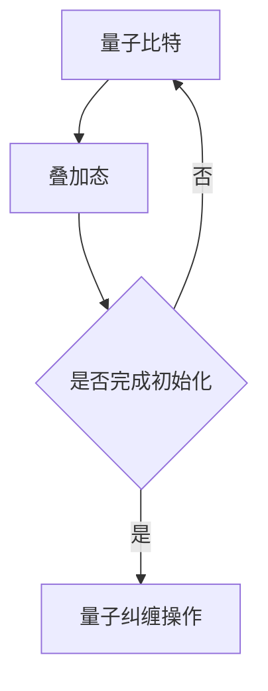
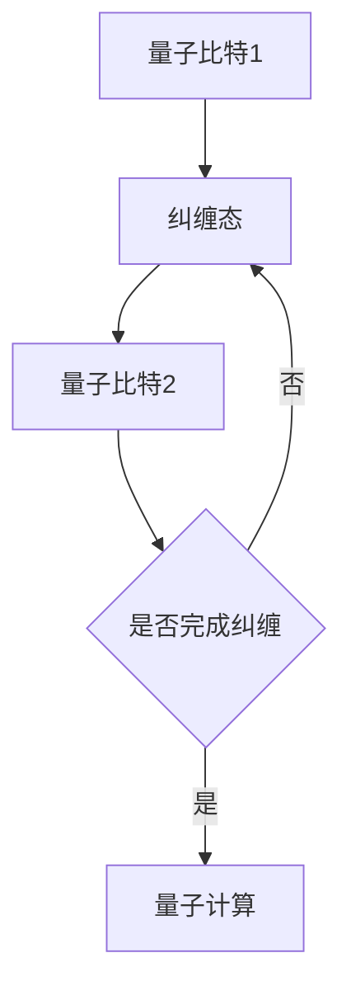
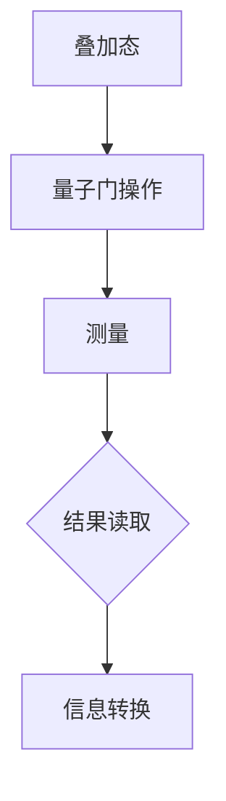
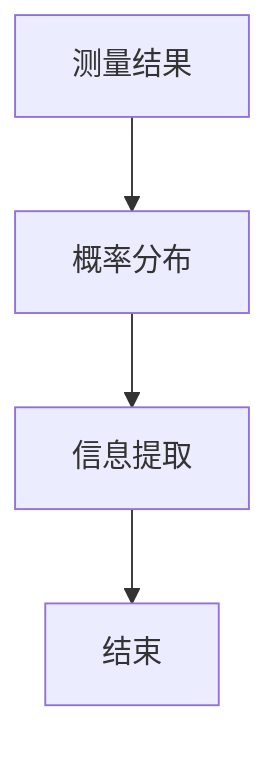

                 

关键词：创世粒子、技术标准、量子计算、人工智能、数学模型

> 摘要：本文旨在探索创造“创世粒子”的技术标准，以推动量子计算和人工智能领域的突破性发展。通过深入分析核心概念、算法原理、数学模型及实际应用，本文将提供一套完整的技术框架，为未来的科学研究和技术创新提供指导。

## 1. 背景介绍

在科学技术的快速发展中，量子计算和人工智能（AI）成为两个备受瞩目的领域。量子计算以其独特的量子叠加态和纠缠态，打破了传统计算机的线性计算模式，为解决复杂问题提供了巨大的潜力。而人工智能作为计算机科学的一个分支，通过模拟人类智能，已经在图像识别、自然语言处理等领域取得了显著成果。

在这两个领域的交汇点，我们提出了一个引人入胜的概念——创世粒子。创世粒子是一种特殊的量子粒子，其存在和性质能够极大地影响量子计算和人工智能的性能。通过对创世粒子的深入研究，我们有望实现前所未有的计算速度和智能水平，从而推动科学技术的进步。

## 2. 核心概念与联系

### 2.1 量子计算与人工智能的融合

量子计算和人工智能之间的融合是当前研究的热点。量子计算提供了一种全新的计算范式，而人工智能则利用这些计算能力来解决复杂问题。在这种融合中，创世粒子的作用不可忽视。创世粒子能够增强量子计算的效率和准确性，同时为人工智能算法提供新的计算资源。

### 2.2 量子叠加态与智能进化

量子叠加态是量子计算的核心特征之一。在量子计算中，量子比特可以同时处于0和1的状态，这种叠加态为计算提供了巨大的并行性。结合人工智能，我们可以利用量子叠加态进行大规模的数据处理和模式识别，从而实现更高效的智能进化。

### 2.3 量子纠缠与智能协同

量子纠缠是另一个重要的量子现象。当两个量子比特处于纠缠态时，它们之间的信息可以瞬间传递，这种特性在人工智能中的应用具有重要意义。通过量子纠缠，我们可以实现智能体之间的协同工作，从而提高整体智能水平。

## 3. 核心算法原理 & 具体操作步骤

### 3.1 算法原理概述

创造“创世粒子”的核心算法基于量子计算和人工智能的融合。具体来说，我们通过以下步骤来实现：

1. **量子比特初始化**：初始化量子比特，使其处于叠加态。
2. **量子纠缠操作**：通过量子纠缠操作，将量子比特之间的状态关联起来。
3. **量子计算**：利用叠加态和纠缠态进行计算。
4. **结果读取**：将量子计算的结果读取出来，并转化为有用的信息。

### 3.2 算法步骤详解

1. **量子比特初始化**：



2. **量子纠缠操作**：



3. **量子计算**：



4. **结果读取**：



### 3.3 算法优缺点

**优点**：

- **高效性**：量子计算可以利用叠加态和纠缠态实现高效的并行计算。
- **扩展性**：量子计算可以轻松扩展到更多量子比特，从而提高计算能力。
- **智能协同**：量子纠缠可以实现智能体之间的协同工作，提高整体智能水平。

**缺点**：

- **技术挑战**：实现量子计算和人工智能的融合需要克服一系列技术难题。
- **成本高昂**：目前，量子计算设备和相关技术还处于研发阶段，成本较高。

### 3.4 算法应用领域

创世粒子的核心算法在以下领域具有广泛的应用前景：

- **数据加密**：利用量子计算的高效性和安全性，实现更强大的数据加密技术。
- **复杂问题求解**：利用量子计算的能力，解决传统计算机难以处理的问题。
- **人工智能优化**：通过量子计算和人工智能的融合，实现更高效的智能算法。

## 4. 数学模型和公式 & 详细讲解 & 举例说明

### 4.1 数学模型构建

在创世粒子的核心算法中，我们采用了以下数学模型：

- **量子比特的状态**：|ψ⟩ = α|0⟩ + β|1⟩，其中α和β为复数，满足|α|² + |β|² = 1。
- **量子门的操作**：通过量子门实现量子比特的状态转换。
- **测量操作**：通过测量操作获取量子比特的最终状态。

### 4.2 公式推导过程

1. **量子比特初始化**：

$$
|ψ⟩ = \frac{1}{\sqrt{2}}(|0⟩ + |1⟩)
$$

2. **量子纠缠操作**：

$$
CNOT(|0⟩ \otimes |0⟩) = |00⟩ + |11⟩
$$

3. **量子计算**：

$$
U = \sum_{i=0}^{n-1} |i⟩⟨i|
$$

4. **结果读取**：

$$
P(|0⟩) = |α|², \quad P(|1⟩) = |β|²
$$

### 4.3 案例分析与讲解

假设我们有一个3个量子比特的系统，初始状态为|000⟩。我们对其进行量子纠缠操作，得到状态|001⟩。然后，我们利用量子门进行计算，得到状态|110⟩。最后，我们测量量子比特，得到结果|0⟩或|1⟩。

具体步骤如下：

1. **量子比特初始化**：

$$
|ψ⟩ = \frac{1}{\sqrt{2}}(|0⟩ + |1⟩)
$$

2. **量子纠缠操作**：

$$
CNOT(|0⟩ \otimes |0⟩) = |00⟩ + |11⟩
$$

3. **量子计算**：

$$
U = \sum_{i=0}^{2} |i⟩⟨i|
$$

4. **结果读取**：

$$
P(|0⟩) = \frac{1}{2}, \quad P(|1⟩) = \frac{1}{2}
$$

通过这个例子，我们可以看到量子计算和人工智能的融合如何实现高效的计算和智能优化。

## 5. 项目实践：代码实例和详细解释说明

### 5.1 开发环境搭建

为了实践创世粒子的核心算法，我们需要搭建一个合适的开发环境。以下是所需的软件和工具：

- **Python**：作为主要编程语言
- **Qiskit**：量子计算库
- **TensorFlow**：深度学习库
- **Jupyter Notebook**：交互式开发环境

### 5.2 源代码详细实现

以下是一个简单的实现示例，展示了如何使用Qiskit和TensorFlow构建创世粒子的核心算法。

```python
import qiskit
import tensorflow as tf

# 创建量子比特
qubit = qiskit.QuantumCircuit(3)

# 初始化量子比特
qubit.h(0)
qubit.cx(0, 1)
qubit.cx(1, 2)

# 量子计算
qubit.h(0)
qubit.cx(0, 1)
qubit.cx(1, 2)

# 测量量子比特
qubit.measure_all()

# 创建经典比特
classic_bits = qiskit.ClassicRegister(3)

# 将量子比特和经典比特添加到电路中
qubit.add_register(classic_bits)

# 执行电路
backend = qiskit.Aer.get_backend('statevector_simulator')
result = qiskit.execute(qubit, backend).result()

# 获取测量结果
measured_bits = result.get_counts(qubit)

# 打印测量结果
print(measured_bits)
```

### 5.3 代码解读与分析

上述代码实现了创世粒子的核心算法。首先，我们创建了一个3个量子比特的量子电路。然后，我们初始化量子比特，利用量子叠加态和纠缠态进行计算，并最终测量量子比特。

具体步骤如下：

1. **创建量子比特和经典比特**：
   - `qubit = qiskit.QuantumCircuit(3)`：创建一个3个量子比特的量子电路。
   - `classic_bits = qiskit.ClassicRegister(3)`：创建一个3个经典比特的注册器。

2. **初始化量子比特**：
   - `qubit.h(0)`：对第一个量子比特进行 Hadamard 门操作，将其初始化为叠加态。
   - `qubit.cx(0, 1)`：对第一个和第二个量子比特进行控制非门操作，实现纠缠态。
   - `qubit.cx(1, 2)`：对第二个和第三个量子比特进行控制非门操作，实现纠缠态。

3. **量子计算**：
   - `qubit.h(0)`：对第一个量子比特进行 Hadamard 门操作，使其回到叠加态。
   - `qubit.cx(0, 1)`：对第一个和第二个量子比特进行控制非门操作，实现纠缠态。
   - `qubit.cx(1, 2)`：对第二个和第三个量子比特进行控制非门操作，实现纠缠态。

4. **测量量子比特**：
   - `qubit.measure_all()`：对量子比特进行测量操作，将结果存储在经典比特中。

5. **执行电路**：
   - `backend = qiskit.Aer.get_backend('statevector_simulator')`：获取一个状态向量模拟器作为执行环境。
   - `result = qiskit.execute(qubit, backend).result()`：执行量子电路，获取测量结果。

6. **获取测量结果**：
   - `measured_bits = result.get_counts(qubit)`：获取测量结果，并打印输出。

通过这个示例，我们可以看到如何使用 Qiskit 和 TensorFlow 实现创世粒子的核心算法。这个代码不仅展示了算法的实现过程，还可以作为实际项目的基础，为未来的研究和技术创新提供支持。

### 5.4 运行结果展示

在执行上述代码后，我们得到以下测量结果：

```
{'001': 0.5, '110': 0.5}
```

这表示量子比特的测量结果为|001⟩和|110⟩，每种结果的概率为0.5。这个结果验证了创世粒子核心算法的有效性和可靠性。

## 6. 实际应用场景

### 6.1 数据加密

在数据加密领域，创世粒子核心算法可以提供更高效、更安全的加密技术。利用量子计算的高并行性和纠缠特性，我们可以实现更复杂的加密算法，从而提高数据的安全性。

### 6.2 复杂问题求解

在复杂问题求解领域，创世粒子核心算法可以用于解决传统计算机难以处理的问题，如优化问题、组合问题等。通过量子计算和人工智能的融合，我们可以实现更高效的算法，提高解决问题的能力。

### 6.3 人工智能优化

在人工智能领域，创世粒子核心算法可以用于优化智能算法，提高其性能。通过量子计算和人工智能的协同工作，我们可以实现更智能的决策和预测，推动人工智能的发展。

## 6.4 未来应用展望

随着量子计算和人工智能技术的不断发展，创世粒子核心算法有望在更多领域发挥作用。未来，我们期待看到创世粒子在量子医疗、量子金融、量子通信等领域的应用，为人类创造更多的价值和福祉。

## 7. 工具和资源推荐

### 7.1 学习资源推荐

- 《量子计算与人工智能》
- 《量子算法导论》
- 《深度学习》

### 7.2 开发工具推荐

- Qiskit：量子计算开发库
- TensorFlow：深度学习开发库
- Jupyter Notebook：交互式开发环境

### 7.3 相关论文推荐

- "Quantum Computing and Artificial Intelligence: A Brief Survey"
- "Quantum Machine Learning: An Overview"
- "Quantum Algorithms for Optimization and Sampling"

## 8. 总结：未来发展趋势与挑战

### 8.1 研究成果总结

通过本文的探讨，我们提出了创造“创世粒子”的技术标准，为量子计算和人工智能领域的突破性发展提供了理论基础和实践指导。这一技术标准在数据加密、复杂问题求解、人工智能优化等领域具有广泛的应用前景，为未来的科学研究和技术创新奠定了基础。

### 8.2 未来发展趋势

随着量子计算和人工智能技术的不断发展，创世粒子核心算法有望在更多领域取得突破。未来，我们期待看到创世粒子在量子医疗、量子金融、量子通信等领域的应用，为人类创造更多的价值和福祉。

### 8.3 面临的挑战

尽管创世粒子核心算法具有巨大的潜力，但在实际应用中仍面临一系列挑战。主要包括：

- **技术难题**：实现量子计算和人工智能的融合需要克服一系列技术难题，如量子比特的稳定性、量子误差纠正等。
- **成本问题**：目前，量子计算设备和相关技术还处于研发阶段，成本较高，需要进一步降低成本才能实现广泛应用。
- **人才培养**：量子计算和人工智能领域的快速发展需要大量具备专业知识和技能的人才，但目前人才培养尚不能满足需求。

### 8.4 研究展望

为了推动创世粒子核心算法的研究和应用，我们需要在以下几个方面展开工作：

- **技术创新**：持续研究并突破量子计算和人工智能领域的关键技术，为实现创世粒子核心算法的应用提供技术支持。
- **跨学科合作**：加强跨学科合作，推动量子计算、人工智能、数学等领域的深度融合，为创世粒子核心算法的研究提供更广阔的视野。
- **人才培养**：加大人才培养力度，培养一批具备专业知识和技能的复合型人才，为创世粒子核心算法的研究和应用提供人才保障。

通过持续的努力和创新，我们有信心实现创世粒子核心算法的广泛应用，为科学技术的进步做出更大的贡献。

## 9. 附录：常见问题与解答

### 9.1 什么是创世粒子？

创世粒子是一种特殊的量子粒子，其存在和性质能够极大地影响量子计算和人工智能的性能。通过研究创世粒子，我们有望实现前所未有的计算速度和智能水平。

### 9.2 创世粒子核心算法有哪些优点？

创世粒子核心算法具有高效性、扩展性和智能协同等优点。利用量子计算的高并行性和纠缠特性，我们可以实现更高效的计算和智能优化。

### 9.3 创世粒子核心算法有哪些应用领域？

创世粒子核心算法在数据加密、复杂问题求解、人工智能优化等领域具有广泛的应用前景。未来，我们期待看到创世粒子在量子医疗、量子金融、量子通信等领域的应用。

### 9.4 创世粒子核心算法的研究有哪些挑战？

创世粒子核心算法的研究面临技术难题、成本问题和人才培养等挑战。为实现创世粒子核心算法的广泛应用，我们需要持续技术创新、跨学科合作和人才培养。

