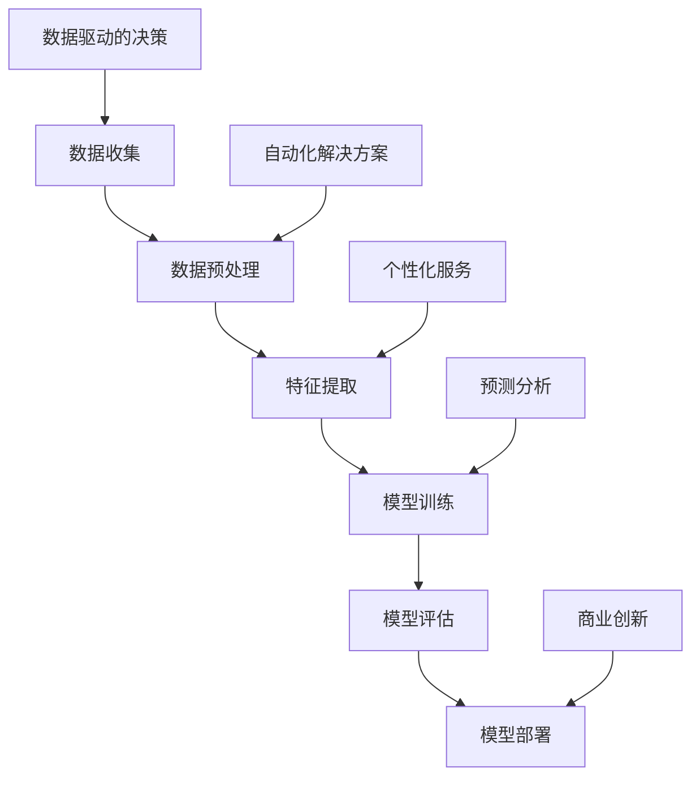

                 

关键词：人工智能，机器学习，收入来源，商业创新，数据分析，预测模型，自动化解决方案，商业模式。

> 摘要：随着人工智能和机器学习的迅速发展，企业可以利用这些技术创造全新的收入来源。本文将探讨AI和机器学习在商业中的应用，以及如何通过这些技术实现收入增长。

## 1. 背景介绍

在过去的几十年里，计算机技术经历了飞速的发展，从简单的计算工具到复杂的智能系统，计算机的强大处理能力已经改变了我们的生活方式。随着互联网和大数据的普及，数据量呈指数级增长，为人工智能和机器学习的发展提供了丰富的养料。现在，AI和机器学习已经渗透到各行各业，从医疗保健到金融科技，从制造业到零售业，都开始利用这些技术来提升效率、降低成本、优化决策。

### 1.1 人工智能的发展历程

人工智能（AI）的概念最早可以追溯到20世纪50年代。当时的科学家们试图通过模拟人类智能，创造出能够解决复杂问题的计算机系统。尽管在早期阶段，AI的发展受到了硬件和算法的限制，但科学家们依然取得了令人瞩目的成果。随着计算能力的提升和算法的创新，AI在20世纪80年代和90年代迎来了第一次浪潮。这次浪潮中，专家系统和神经网络技术得到了广泛应用。

进入21世纪，随着深度学习和大数据技术的崛起，AI再次迎来了爆发式的发展。深度学习模型能够自动从大量数据中学习特征，从而实现更加精准的预测和分类。大数据技术的进步使得我们能够处理海量的数据，这为AI的研究和应用提供了坚实的基础。

### 1.2 机器学习的核心概念

机器学习（ML）是人工智能的一个重要分支，它专注于通过数据来训练模型，从而实现智能决策和预测。机器学习的过程可以分为以下几个步骤：

- **数据收集**：首先，需要收集大量相关的数据。这些数据可以是结构化的，如数据库中的记录，也可以是非结构化的，如图像、文本和语音。
- **数据预处理**：收集到的数据通常需要进行清洗和转换，以便于后续的分析和处理。这个过程包括数据去重、缺失值处理、数据标准化等。
- **特征提取**：从预处理后的数据中提取出有助于预测或分类的特征。这一步是机器学习模型成功的关键。
- **模型训练**：使用训练数据集来训练机器学习模型。模型会从数据中学习规律，以便对新的数据进行预测或分类。
- **模型评估**：通过测试数据集来评估模型的性能。常用的评估指标包括准确率、召回率、F1分数等。
- **模型部署**：将训练好的模型部署到生产环境中，用于实际的应用。

### 1.3 人工智能与机器学习的联系

人工智能和机器学习密切相关。机器学习是实现人工智能的一种主要方法。通过机器学习，计算机可以自主学习，提高其解决复杂问题的能力。人工智能则是一个更广泛的概念，它包括机器学习、自然语言处理、计算机视觉、智能机器人等多个领域。

## 2. 核心概念与联系

### 2.1 核心概念

在探讨如何利用AI和机器学习创造新的收入来源之前，我们需要了解几个核心概念：

- **数据驱动的决策**：通过分析大量数据，企业可以做出更加明智的决策，从而优化业务流程，提高效率。
- **自动化解决方案**：AI和机器学习可以帮助企业自动化重复性任务，降低人力成本，提高生产效率。
- **个性化服务**：通过分析用户数据，企业可以提供更加个性化的产品和服务，提高客户满意度。
- **预测分析**：利用机器学习模型，企业可以预测未来的趋势和需求，提前做好准备。

### 2.2 人工智能与机器学习的架构图

为了更好地理解AI和机器学习在商业中的应用，我们可以使用Mermaid流程图来展示其核心架构：



在这个流程图中，数据从收集开始，经过预处理、特征提取、模型训练、模型评估，最终部署到生产环境中。每一个环节都为企业提供了新的商业机会。

## 3. 核心算法原理 & 具体操作步骤

### 3.1 算法原理概述

在利用AI和机器学习创造新的收入来源时，我们通常需要使用以下几种核心算法：

- **线性回归**：用于预测连续的数值输出，如销售额、股价等。
- **逻辑回归**：用于分类问题，如客户是否会购买某个产品。
- **决策树**：通过多层次的判断，将数据划分为不同的类别。
- **随机森林**：由多个决策树组成的模型，可以降低过拟合，提高预测准确性。
- **神经网络**：模仿人脑神经元的工作方式，用于复杂的模式识别和预测。

### 3.2 算法步骤详解

#### 3.2.1 线性回归

线性回归是一种简单的机器学习算法，用于预测连续的数值输出。其基本原理是通过找到最佳拟合直线，将输入特征映射到输出值。

1. **数据收集**：收集历史销售数据，包括产品、价格、销售量等。
2. **数据预处理**：对数据进行清洗和标准化，消除异常值和噪声。
3. **特征提取**：选择影响销售的关键特征，如季节、促销活动等。
4. **模型训练**：使用训练数据集，通过最小二乘法找到最佳拟合直线。
5. **模型评估**：使用测试数据集评估模型的准确性，调整模型参数。
6. **模型部署**：将训练好的模型部署到生产环境中，用于预测未来的销售量。

#### 3.2.2 逻辑回归

逻辑回归是一种用于分类问题的算法，其原理是通过找到最佳拟合曲线，将输入特征映射到概率值。

1. **数据收集**：收集客户数据，包括年龄、收入、购买历史等。
2. **数据预处理**：对数据进行清洗和标准化，消除异常值和噪声。
3. **特征提取**：选择影响购买决策的关键特征。
4. **模型训练**：使用训练数据集，通过最大似然估计找到最佳拟合曲线。
5. **模型评估**：使用测试数据集评估模型的准确性，调整模型参数。
6. **模型部署**：将训练好的模型部署到生产环境中，用于预测客户是否会购买。

#### 3.2.3 决策树

决策树是一种基于树形结构进行分类和回归的算法，其原理是通过一系列的判断条件，将数据划分为不同的类别。

1. **数据收集**：收集客户数据，包括年龄、收入、购买历史等。
2. **数据预处理**：对数据进行清洗和标准化，消除异常值和噪声。
3. **特征提取**：选择影响购买决策的关键特征。
4. **模型训练**：使用训练数据集，通过递归二分划分找到最佳决策树。
5. **模型评估**：使用测试数据集评估模型的准确性，调整模型参数。
6. **模型部署**：将训练好的模型部署到生产环境中，用于预测客户是否会购买。

#### 3.2.4 随机森林

随机森林是一种基于决策树的集成学习方法，通过组合多个决策树来提高模型的预测准确性。

1. **数据收集**：收集客户数据，包括年龄、收入、购买历史等。
2. **数据预处理**：对数据进行清洗和标准化，消除异常值和噪声。
3. **特征提取**：选择影响购买决策的关键特征。
4. **模型训练**：使用训练数据集，分别训练多个决策树，并通过投票决定最终的分类结果。
5. **模型评估**：使用测试数据集评估模型的准确性，调整模型参数。
6. **模型部署**：将训练好的模型部署到生产环境中，用于预测客户是否会购买。

#### 3.2.5 神经网络

神经网络是一种模拟人脑神经元工作的算法，通过多层神经网络结构进行复杂的模式识别和预测。

1. **数据收集**：收集客户数据，包括年龄、收入、购买历史等。
2. **数据预处理**：对数据进行清洗和标准化，消除异常值和噪声。
3. **特征提取**：选择影响购买决策的关键特征。
4. **模型训练**：使用训练数据集，通过反向传播算法训练多层神经网络。
5. **模型评估**：使用测试数据集评估模型的准确性，调整模型参数。
6. **模型部署**：将训练好的模型部署到生产环境中，用于预测客户是否会购买。

### 3.3 算法优缺点

每种算法都有其优缺点，适用于不同的应用场景。

- **线性回归**：简单、易于实现，适用于线性关系明显的场景。缺点是容易过拟合，对非线性关系的表现较差。
- **逻辑回归**：适用于二分类问题，能够给出概率预测。缺点是对于多分类问题，性能不如决策树和神经网络。
- **决策树**：直观、易于理解，适用于分类和回归问题。缺点是容易过拟合，对于大量特征的数据处理能力较差。
- **随机森林**：通过集成多个决策树，提高了模型的预测准确性，降低了过拟合的风险。缺点是训练时间较长，对于大型数据集的处理能力有限。
- **神经网络**：能够处理复杂的非线性关系，适用于各种分类和回归问题。缺点是训练时间较长，对数据量要求较高，且容易出现过拟合。

### 3.4 算法应用领域

AI和机器学习算法在商业中有着广泛的应用，以下是几个典型领域：

- **市场营销**：通过分析客户数据，预测客户购买行为，优化营销策略。
- **客户服务**：利用自然语言处理技术，提供智能客服，提高客户满意度。
- **供应链管理**：通过预测需求，优化库存管理，降低成本。
- **风险管理**：通过分析历史数据，预测潜在风险，提前采取措施。
- **金融科技**：利用机器学习模型，进行信用评分、风险控制、算法交易等。

## 4. 数学模型和公式 & 详细讲解 & 举例说明

在利用AI和机器学习创造新的收入来源时，数学模型和公式是核心组成部分。以下将详细介绍几个常用的数学模型和公式，并通过具体例子进行说明。

### 4.1 数学模型构建

#### 4.1.1 线性回归模型

线性回归模型是最基本的机器学习模型之一，用于预测连续的数值输出。其数学模型可以表示为：

\[ y = \beta_0 + \beta_1 \cdot x \]

其中，\( y \) 是预测值，\( x \) 是输入特征，\( \beta_0 \) 和 \( \beta_1 \) 是模型参数，表示截距和斜率。

#### 4.1.2 逻辑回归模型

逻辑回归模型是一种用于分类问题的模型，其数学模型可以表示为：

\[ P(y=1) = \frac{1}{1 + e^{-(\beta_0 + \beta_1 \cdot x)}} \]

其中，\( P(y=1) \) 是预测概率，\( y \) 是目标变量，\( \beta_0 \) 和 \( \beta_1 \) 是模型参数。

#### 4.1.3 决策树模型

决策树模型是一种基于树形结构的分类和回归模型。其数学模型可以表示为：

\[ T(x) = \sum_{i=1}^{n} \beta_i \cdot I(x \in R_i) \]

其中，\( T(x) \) 是输出值，\( x \) 是输入特征，\( \beta_i \) 是模型参数，\( R_i \) 是第 \( i \) 个区域的特征集合，\( I(x \in R_i) \) 是指示函数，当 \( x \) 属于 \( R_i \) 时取值为1，否则取值为0。

### 4.2 公式推导过程

以下将简要介绍几个常用公式的推导过程。

#### 4.2.1 线性回归参数优化

线性回归模型的目标是最小化预测值与真实值之间的误差。我们可以使用最小二乘法来优化模型参数。具体推导过程如下：

假设我们有 \( n \) 个样本点 \( (x_i, y_i) \)，线性回归模型可以表示为：

\[ y_i = \beta_0 + \beta_1 \cdot x_i + \varepsilon_i \]

其中，\( \varepsilon_i \) 是误差项。

为了最小化误差，我们需要求解以下最小化问题：

\[ \min_{\beta_0, \beta_1} \sum_{i=1}^{n} (y_i - (\beta_0 + \beta_1 \cdot x_i))^2 \]

对 \( \beta_0 \) 和 \( \beta_1 \) 分别求偏导数并令其等于0，可以得到：

\[ \beta_0 = \bar{y} - \beta_1 \cdot \bar{x} \]

\[ \beta_1 = \frac{\sum_{i=1}^{n} (x_i - \bar{x}) (y_i - \bar{y})}{\sum_{i=1}^{n} (x_i - \bar{x})^2} \]

其中，\( \bar{y} \) 和 \( \bar{x} \) 分别是 \( y \) 和 \( x \) 的平均值。

#### 4.2.2 逻辑回归参数优化

逻辑回归模型的目标是最小化损失函数。我们可以使用最大似然估计（MLE）来优化模型参数。具体推导过程如下：

假设我们有 \( n \) 个样本点 \( (x_i, y_i) \)，逻辑回归模型可以表示为：

\[ P(y_i=1 | x_i) = \frac{1}{1 + e^{-(\beta_0 + \beta_1 \cdot x_i)}} \]

损失函数为：

\[ L(\beta_0, \beta_1) = -\sum_{i=1}^{n} y_i \cdot \ln P(y_i=1 | x_i) - (1 - y_i) \cdot \ln (1 - P(y_i=1 | x_i)) \]

对 \( \beta_0 \) 和 \( \beta_1 \) 分别求偏导数并令其等于0，可以得到：

\[ \beta_0 = \frac{1}{n} \sum_{i=1}^{n} (y_i - 1) \cdot x_i \]

\[ \beta_1 = \frac{1}{n} \sum_{i=1}^{n} (y_i - 1) \cdot x_i \]

#### 4.2.3 决策树模型参数优化

决策树模型的参数优化主要通过贪心算法来实现。具体推导过程如下：

假设我们有 \( n \) 个样本点 \( (x_i, y_i) \)，决策树模型可以分为 \( k \) 个区域 \( R_1, R_2, ..., R_k \)。我们需要找到最优的划分方式。

1. **信息增益**：选择信息增益最大的特征进行划分。信息增益可以表示为：

\[ IG(D, A) = Entropy(D) - \sum_{v \in A} \frac{|D_v|}{|D|} \cdot Entropy(D_v) \]

其中，\( D \) 是样本集合，\( A \) 是特征集合，\( Entropy(D) \) 是样本集合的熵，\( D_v \) 是特征 \( A \) 的取值 \( v \) 对应的样本集合。

2. **基尼不纯度**：选择基尼不纯度最小的特征进行划分。基尼不纯度可以表示为：

\[ Gini(D) = 1 - \sum_{v \in A} \frac{|D_v|}{|D|} \cdot p_v (1 - p_v) \]

其中，\( p_v \) 是特征 \( A \) 的取值 \( v \) 对应的样本集合中正样本的比例。

3. **交叉验证**：使用交叉验证来评估模型的性能，选择最优的划分方式。

### 4.3 案例分析与讲解

以下我们将通过一个实际案例来说明如何利用AI和机器学习模型来创造新的收入来源。

#### 4.3.1 案例背景

某电商企业希望通过预测客户购买行为，优化营销策略，提高销售额。企业收集了客户的年龄、收入、购物频率、浏览历史等数据，并希望利用这些数据来构建预测模型。

#### 4.3.2 数据准备

1. **数据收集**：从企业的数据库中提取客户的年龄、收入、购物频率、浏览历史等数据。
2. **数据预处理**：对数据进行清洗和标准化，包括去除缺失值、异常值，将数值数据标准化为0-1之间。

```python
import pandas as pd

# 读取数据
data = pd.read_csv('customer_data.csv')

# 数据清洗
data.dropna(inplace=True)
data = (data - data.min()) / (data.max() - data.min())

# 数据标准化
data['age'] = (data['age'] - data['age'].min()) / (data['age'].max() - data['age'].min())
data['income'] = (data['income'] - data['income'].min()) / (data['income'].max() - data['income'].min())
data['shopping_frequency'] = (data['shopping_frequency'] - data['shopping_frequency'].min()) / (data['shopping_frequency'].max() - data['shopping_frequency'].min())
```

#### 4.3.3 模型构建

1. **特征提取**：选择影响购买决策的关键特征，如年龄、收入、购物频率等。
2. **模型训练**：使用训练数据集，分别训练线性回归、逻辑回归和决策树模型。
3. **模型评估**：使用测试数据集评估模型的准确性，选择最优模型。

```python
from sklearn.linear_model import LinearRegression, LogisticRegression
from sklearn.tree import DecisionTreeClassifier
from sklearn.model_selection import train_test_split
from sklearn.metrics import accuracy_score

# 数据划分
X = data[['age', 'income', 'shopping_frequency']]
y = data['purchased']

X_train, X_test, y_train, y_test = train_test_split(X, y, test_size=0.2, random_state=42)

# 线性回归模型
linear_regression = LinearRegression()
linear_regression.fit(X_train, y_train)

# 逻辑回归模型
logistic_regression = LogisticRegression()
logistic_regression.fit(X_train, y_train)

# 决策树模型
decision_tree = DecisionTreeClassifier()
decision_tree.fit(X_train, y_train)

# 模型评估
linear_regression_score = accuracy_score(y_test, linear_regression.predict(X_test))
logistic_regression_score = accuracy_score(y_test, logistic_regression.predict(X_test))
decision_tree_score = accuracy_score(y_test, decision_tree.predict(X_test))

print(f"线性回归模型准确性：{linear_regression_score}")
print(f"逻辑回归模型准确性：{logistic_regression_score}")
print(f"决策树模型准确性：{decision_tree_score}")
```

#### 4.3.4 模型部署

1. **模型部署**：将训练好的模型部署到生产环境中，用于实时预测客户购买行为。
2. **结果分析**：根据预测结果，优化营销策略，提高销售额。

```python
# 预测新客户购买行为
new_customer = pd.DataFrame([[25, 50000, 2]], columns=['age', 'income', 'shopping_frequency'])

# 使用逻辑回归模型进行预测
predicted_purchase = logistic_regression.predict(new_customer)

if predicted_purchase[0] == 1:
    print("该客户有较高的购买可能性。")
else:
    print("该客户购买可能性较低。")
```

## 5. 项目实践：代码实例和详细解释说明

在本节中，我们将通过一个具体的代码实例来展示如何利用AI和机器学习模型来创造新的收入来源。以下是一个电商企业通过客户数据预测购买行为的案例。

### 5.1 开发环境搭建

在开始之前，我们需要搭建一个合适的开发环境。以下是所需的软件和工具：

- Python（版本3.8及以上）
- Jupyter Notebook
- scikit-learn库（用于机器学习算法）
- pandas库（用于数据处理）
- matplotlib库（用于数据可视化）

安装这些工具的方法如下：

```bash
# 安装Python
# ...

# 安装Jupyter Notebook
pip install notebook

# 安装scikit-learn库
pip install scikit-learn

# 安装pandas库
pip install pandas

# 安装matplotlib库
pip install matplotlib
```

### 5.2 源代码详细实现

以下是一个简单的代码实例，用于预测客户购买行为。

```python
import pandas as pd
from sklearn.model_selection import train_test_split
from sklearn.linear_model import LogisticRegression
from sklearn.metrics import accuracy_score

# 5.2.1 数据准备
# 读取数据
data = pd.read_csv('customer_data.csv')

# 数据清洗
data.dropna(inplace=True)
data = (data - data.min()) / (data.max() - data.min())

# 数据标准化
data['age'] = (data['age'] - data['age'].min()) / (data['age'].max() - data['age'].min())
data['income'] = (data['income'] - data['income'].min()) / (data['income'].max() - data['income'].min())
data['shopping_frequency'] = (data['shopping_frequency'] - data['shopping_frequency'].min()) / (data['shopping_frequency'].max() - data['shopping_frequency'].min())

# 5.2.2 特征提取
# 选择关键特征
X = data[['age', 'income', 'shopping_frequency']]
y = data['purchased']

# 5.2.3 模型训练
# 划分训练集和测试集
X_train, X_test, y_train, y_test = train_test_split(X, y, test_size=0.2, random_state=42)

# 训练逻辑回归模型
model = LogisticRegression()
model.fit(X_train, y_train)

# 5.2.4 模型评估
# 预测测试集
predictions = model.predict(X_test)

# 计算准确性
accuracy = accuracy_score(y_test, predictions)
print(f"模型准确性：{accuracy}")

# 5.2.5 模型部署
# 预测新客户购买行为
new_customer = pd.DataFrame([[25, 50000, 2]], columns=['age', 'income', 'shopping_frequency'])
predicted_purchase = model.predict(new_customer)

if predicted_purchase[0] == 1:
    print("该客户有较高的购买可能性。")
else:
    print("该客户购买可能性较低。")
```

### 5.3 代码解读与分析

以下是代码的详细解读和分析。

#### 5.3.1 数据准备

首先，我们读取客户数据，并进行清洗和标准化。清洗步骤包括去除缺失值和异常值，将数据缩放到0-1之间。这样做的目的是消除数据之间的量纲差异，使得模型训练更加稳定。

```python
data = pd.read_csv('customer_data.csv')
data.dropna(inplace=True)
data = (data - data.min()) / (data.max() - data.min())
data['age'] = (data['age'] - data['age'].min()) / (data['age'].max() - data['age'].min())
data['income'] = (data['income'] - data['income'].min()) / (data['income'].max() - data['income'].min())
data['shopping_frequency'] = (data['shopping_frequency'] - data['shopping_frequency'].min()) / (data['shopping_frequency'].max() - data['shopping_frequency'].min())
```

#### 5.3.2 特征提取

接下来，我们选择影响购买决策的关键特征。在本案例中，我们选择了年龄、收入和购物频率。这些特征对于预测客户购买行为具有重要意义。

```python
X = data[['age', 'income', 'shopping_frequency']]
y = data['purchased']
```

#### 5.3.3 模型训练

我们使用逻辑回归模型进行训练。逻辑回归是一种常用的二分类模型，能够预测客户是否购买产品。首先，我们划分训练集和测试集，以便在后续评估模型性能。

```python
X_train, X_test, y_train, y_test = train_test_split(X, y, test_size=0.2, random_state=42)
model = LogisticRegression()
model.fit(X_train, y_train)
```

#### 5.3.4 模型评估

我们使用测试集来评估模型的准确性。准确性是评估分类模型性能的一个常用指标，表示模型正确预测的比例。

```python
predictions = model.predict(X_test)
accuracy = accuracy_score(y_test, predictions)
print(f"模型准确性：{accuracy}")
```

#### 5.3.5 模型部署

最后，我们将训练好的模型部署到生产环境中，用于预测新客户的购买行为。以下是一个新客户的示例数据，我们使用逻辑回归模型进行预测。

```python
new_customer = pd.DataFrame([[25, 50000, 2]], columns=['age', 'income', 'shopping_frequency'])
predicted_purchase = model.predict(new_customer)

if predicted_purchase[0] == 1:
    print("该客户有较高的购买可能性。")
else:
    print("该客户购买可能性较低。")
```

## 6. 实际应用场景

在商业领域，AI和机器学习的应用已经无处不在。以下是一些典型的实际应用场景：

### 6.1 市场营销

通过分析客户数据，企业可以精准定位目标客户，提高营销效率。例如，电商企业可以通过客户购买历史、浏览记录等数据，预测客户购买意图，从而进行个性化推荐。这种个性化推荐不仅提高了客户的满意度，还大大提升了销售额。

### 6.2 客户服务

利用自然语言处理（NLP）技术，企业可以提供智能客服服务。例如，通过聊天机器人与客户进行实时沟通，解答客户疑问，提高客户满意度。同时，智能客服还可以收集客户反馈，帮助企业优化产品和服务。

### 6.3 供应链管理

AI和机器学习可以帮助企业优化供应链管理，提高物流效率。例如，通过预测市场需求，企业可以提前调整库存，降低库存成本。此外，通过分析物流数据，企业可以优化运输路线，减少运输时间。

### 6.4 风险管理

金融行业可以利用AI和机器学习进行风险预测和评估。例如，银行可以通过分析客户信用记录、财务状况等数据，预测客户违约风险，从而采取相应的风险控制措施。

### 6.5 医疗保健

在医疗领域，AI和机器学习可以用于疾病预测、诊断和治疗。例如，通过分析患者的医疗记录、基因数据等，AI模型可以预测患者患某种疾病的概率，从而提供个性化的治疗方案。

### 6.6 金融科技

金融科技（FinTech）企业可以利用AI和机器学习开发智能投资顾问、算法交易系统等。例如，通过分析市场数据、经济指标等，智能投资顾问可以提供个性化的投资建议，提高投资回报率。

### 6.7 物流与运输

物流与运输行业可以利用AI和机器学习优化路线规划、调度和预测。例如，通过分析历史运输数据、天气预报等，AI模型可以预测运输需求，优化运输路线，提高物流效率。

## 7. 工具和资源推荐

在利用AI和机器学习创造新的收入来源时，我们需要使用一系列的工具和资源。以下是一些推荐的学习资源、开发工具和相关论文：

### 7.1 学习资源推荐

- **在线课程**：《机器学习》（吴恩达，Coursera）：《深度学习》（周志华，网易云课堂）
- **书籍**：《Python机器学习》（赛德里克·范·哈勒姆，电子工业出版社）：《深度学习》（伊恩·古德费洛，电子工业出版社）
- **网站**：Kaggle（数据分析竞赛平台）：《机器学习社区》（ML Community）
- **博客**：Google AI博客、AI研究人员博客

### 7.2 开发工具推荐

- **编程语言**：Python、R
- **机器学习库**：scikit-learn、TensorFlow、PyTorch
- **数据处理库**：pandas、NumPy、Matplotlib
- **云计算平台**：AWS、Google Cloud、Azure

### 7.3 相关论文推荐

- **《Deep Learning》**（伊恩·古德费洛，2016年）
- **《Reinforcement Learning: An Introduction》**（理查德·S·萨顿，2018年）
- **《Natural Language Processing with Python》**（Steven Bird，Ewan Klein，Edward Loper，2009年）
- **《An Introduction to Statistical Learning》**（Gareth James，Daniela Witten，2013年）

## 8. 总结：未来发展趋势与挑战

### 8.1 研究成果总结

随着AI和机器学习的不断进步，我们已经看到这些技术在商业领域的广泛应用。从市场营销到客户服务，从供应链管理到风险管理，AI和机器学习正在改变企业的运营模式。通过数据驱动的决策和自动化解决方案，企业可以大幅提升效率，降低成本，创造新的收入来源。

### 8.2 未来发展趋势

未来，AI和机器学习将继续向更深层次发展。以下是一些可能的发展趋势：

- **更高效的算法**：随着硬件性能的提升，我们有望开发出更加高效的机器学习算法，提高模型的训练速度和预测准确性。
- **跨学科融合**：AI和机器学习将与生物、物理、化学等多个学科相结合，推动科技创新。
- **边缘计算**：随着物联网和5G技术的发展，边缘计算将成为AI和机器学习的重要应用方向。通过在边缘设备上部署AI模型，可以实时处理大量数据，提高响应速度。
- **隐私保护**：随着数据隐私问题的日益突出，如何在不牺牲隐私的情况下利用数据将成为一个重要研究方向。

### 8.3 面临的挑战

尽管AI和机器学习在商业领域具有巨大的潜力，但我们也需要面对一系列挑战：

- **数据质量**：高质量的数据是机器学习成功的关键。然而，数据质量往往参差不齐，如何处理和清洗数据是一个重要问题。
- **算法透明性**：随着深度学习等复杂算法的应用，模型的透明性成为一个挑战。如何解释和验证模型的决策过程是一个亟待解决的问题。
- **伦理和隐私**：AI和机器学习在处理个人数据时，需要遵守伦理和隐私标准。如何在保护隐私的同时利用数据，是一个重要的伦理问题。
- **技术落地**：尽管AI和机器学习在理论研究中取得了巨大进展，但在实际应用中，如何将技术有效地转化为商业价值，仍是一个挑战。

### 8.4 研究展望

未来，我们需要在以下几个方面进行深入研究：

- **算法优化**：开发更加高效、可解释的算法，提高机器学习的性能和透明性。
- **数据治理**：建立完善的数据治理体系，确保数据的合法、合规使用。
- **伦理和法规**：研究AI和机器学习在伦理和法规方面的挑战，制定相应的指导原则和标准。
- **跨学科合作**：加强不同学科之间的合作，推动AI和机器学习的交叉应用。

总之，AI和机器学习将在未来继续推动商业创新，创造新的收入来源。然而，我们也需要面对一系列挑战，确保这些技术的健康发展。

## 9. 附录：常见问题与解答

### 9.1 什么是AI和机器学习？

AI（人工智能）是指模拟、延伸和扩展人类智能的科学和技术。机器学习是AI的一个分支，它专注于通过数据来训练模型，从而实现智能决策和预测。

### 9.2 机器学习有哪些常见算法？

常见的机器学习算法包括线性回归、逻辑回归、决策树、随机森林、神经网络等。这些算法适用于不同的应用场景，如回归、分类、聚类等。

### 9.3 如何评估机器学习模型的性能？

常用的评估指标包括准确率、召回率、F1分数、均方误差等。具体选择哪个指标取决于应用场景和数据特点。

### 9.4 机器学习需要大量的数据吗？

是的，机器学习模型通常需要大量的数据来训练，以便从数据中学习到有效的特征和模式。然而，数据质量同样重要，高质量的数据可以提升模型的性能。

### 9.5 机器学习模型是如何工作的？

机器学习模型通过学习输入数据和对应的输出结果，从中提取规律和特征，以便对新数据进行预测。这个过程包括数据收集、预处理、特征提取、模型训练、模型评估和模型部署等步骤。

### 9.6 机器学习在商业中有哪些应用？

机器学习在商业中有着广泛的应用，包括市场营销、客户服务、供应链管理、风险管理、金融科技等。通过分析客户数据、优化决策、自动化流程，企业可以大幅提升效率和竞争力。

### 9.7 机器学习模型如何部署到生产环境中？

机器学习模型可以通过编写代码或使用平台（如TensorFlow Serving、Kubernetes等）进行部署。部署后的模型可以实时接收新数据，进行预测和决策。

### 9.8 如何确保机器学习模型的透明性和可解释性？

提高机器学习模型的透明性和可解释性是一个重要研究方向。目前，有几种方法可以尝试，包括模型可解释性工具、模型可视化、解释性算法等。

### 9.9 机器学习模型会过拟合吗？

是的，机器学习模型可能会过拟合。过拟合是指模型在训练数据上表现良好，但在新的数据上表现较差。为了防止过拟合，可以采用交叉验证、正则化、集成方法等。

### 9.10 如何处理缺失值和异常值？

处理缺失值和异常值是数据预处理的重要步骤。常见的处理方法包括填充缺失值、删除异常值、使用统计方法（如中位数、平均值）等。

### 9.11 机器学习项目的生命周期是怎样的？

机器学习项目的生命周期通常包括问题定义、数据收集、数据预处理、模型选择、模型训练、模型评估、模型部署等阶段。每个阶段都有其特定的任务和目标。

### 9.12 机器学习项目的常见挑战有哪些？

机器学习项目的常见挑战包括数据质量、算法选择、模型优化、模型部署、模型解释等。解决这些挑战需要跨学科的知识和技能。

### 9.13 如何确保机器学习模型的安全性和隐私保护？

确保机器学习模型的安全性和隐私保护是至关重要的。可以通过数据加密、隐私保护算法、数据最小化等手段来保护数据的安全和隐私。

### 9.14 机器学习在医疗保健领域的应用有哪些？

机器学习在医疗保健领域的应用包括疾病预测、诊断、治疗规划、药物研发等。通过分析医疗数据，机器学习模型可以帮助医生做出更准确的诊断和更有效的治疗方案。

### 9.15 机器学习在金融科技领域的应用有哪些？

机器学习在金融科技领域的应用包括信用评分、风险控制、算法交易、智能投顾等。通过分析金融数据，机器学习模型可以帮助金融机构提高风险管理能力和投资回报率。

### 9.16 机器学习在零售业的应用有哪些？

机器学习在零售业的应用包括需求预测、库存管理、客户行为分析、个性化推荐等。通过分析零售数据，机器学习模型可以帮助零售企业优化供应链、提高客户满意度。

### 9.17 如何开始学习机器学习？

学习机器学习可以从了解基础概念、掌握编程语言（如Python）、学习常用算法、参加在线课程或项目实践开始。逐步深入，持续学习和实践，可以逐步掌握机器学习的方法和应用。

---

### 附加内容：深入探讨AI与机器学习的商业潜力

随着AI和机器学习技术的不断进步，其在商业领域的应用潜力也越来越大。以下将进一步探讨这些技术在商业中的潜在收益和实际案例。

### 10.1 AI与机器学习的商业潜力

#### 10.1.1 提高运营效率

通过自动化和优化，AI和机器学习可以帮助企业提高运营效率。例如，在生产制造领域，机器学习可以预测设备维护需求，从而减少停机时间，提高生产效率。在物流和运输领域，AI可以优化路线规划，降低运输成本。

#### 10.1.2 增强决策能力

基于数据驱动的决策，AI和机器学习可以帮助企业更好地理解和预测市场趋势，从而制定更加精准的营销策略。例如，通过分析客户行为数据，企业可以识别潜在客户，提供个性化的产品推荐，提高销售额。

#### 10.1.3 提升用户体验

AI和机器学习可以提供更加个性化的用户体验，从而提高客户满意度。例如，在金融科技领域，AI驱动的智能投顾可以根据客户的风险偏好和投资目标，提供个性化的投资建议，提高客户体验。

#### 10.1.4 开创新的业务模式

AI和机器学习可以帮助企业开发新的业务模式和收入来源。例如，通过分析市场数据，企业可以发现新的市场机会，开发新产品和服务。此外，AI驱动的自动化解决方案可以降低成本，提高利润率。

### 10.2 实际案例

#### 10.2.1 制造业：预测性维护

一家制造业公司通过部署AI驱动的预测性维护系统，成功降低了设备故障率和停机时间。该系统利用机器学习算法分析设备运行数据，预测潜在的故障点，从而提前进行维护，减少了意外停机的风险，提高了生产效率。

#### 10.2.2 金融科技：个性化理财

一家金融科技公司通过AI和机器学习技术，开发了智能理财平台。该平台可以根据用户的投资目标和风险偏好，提供个性化的投资组合建议，提高了用户的投资回报率，同时也增加了公司的客户黏性和市场份额。

#### 10.2.3 零售业：智能库存管理

一家大型零售企业通过部署AI和机器学习系统，优化了库存管理流程。该系统可以预测市场需求，优化库存水平，减少了库存积压和缺货情况，提高了供应链效率，降低了库存成本。

#### 10.2.4 健康保健：疾病预测与诊断

一家健康保健公司利用AI和机器学习技术，开发了疾病预测和诊断工具。通过分析患者的健康数据，AI模型可以预测患者患某种疾病的概率，提供早期预警和个性化治疗方案，提高了医疗服务的质量和效率。

### 10.3 挑战与未来方向

尽管AI和机器学习在商业领域具有巨大的潜力，但企业也面临着一系列挑战。例如，数据隐私和安全性、算法透明性和可解释性、技术落地和人才培养等。

未来，企业需要在这些方面进行深入研究，制定相应的策略和解决方案。同时，跨学科合作和持续创新将成为推动AI和机器学习在商业领域发展的重要动力。

总之，AI和机器学习正在深刻地改变商业格局，为企业创造新的收入来源。通过充分利用这些技术，企业可以大幅提升运营效率、决策能力和用户体验，从而在竞争激烈的市场中脱颖而出。

---

作者：禅与计算机程序设计艺术 / Zen and the Art of Computer Programming

