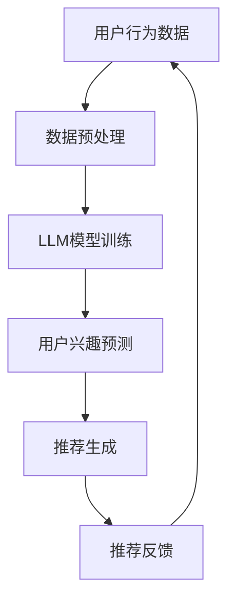

                 

关键词：推荐系统、实时兴趣捕捉、大语言模型（LLM）、个性化推荐、算法优化

> 摘要：本文将探讨如何利用大语言模型（LLM）优化推荐系统中的实时兴趣捕捉。我们将从背景介绍、核心概念与联系、核心算法原理与具体操作步骤、数学模型与公式、项目实践、实际应用场景、未来应用展望、工具和资源推荐以及总结：未来发展趋势与挑战等多个方面展开讨论，旨在为推荐系统的开发者提供实用的技术指导和思路。

## 1. 背景介绍

在信息爆炸的时代，推荐系统已经成为人们获取信息的重要途径。然而，传统的推荐系统往往面临数据更新不及时、用户兴趣捕捉不准确等问题。为了解决这些问题，研究人员开始探索如何利用人工智能技术，尤其是大语言模型（LLM），来优化推荐系统中的实时兴趣捕捉。

实时兴趣捕捉是推荐系统中的一个关键环节。它指的是在用户行为数据不断变化的过程中，能够及时、准确地捕捉到用户的兴趣变化，从而为用户提供更个性化的推荐。然而，传统的推荐系统往往依赖于历史数据，难以实现真正的实时推荐。大语言模型的出现为实时兴趣捕捉提供了新的可能性。

大语言模型（LLM）是一种基于深度学习的自然语言处理技术，通过训练大量的文本数据，LLM能够自动学习语言的规律和语义。这使得LLM在文本分类、情感分析、命名实体识别等任务中取得了显著的成果。近年来，随着计算能力的提升和数据规模的扩大，LLM在推荐系统中的应用也越来越广泛。

本文将重点探讨如何利用LLM优化推荐系统中的实时兴趣捕捉。我们将从核心概念、算法原理、数学模型、项目实践等多个方面进行详细阐述，以期为推荐系统的开发者提供实用的技术指导和思路。

## 2. 核心概念与联系

要深入理解如何利用LLM优化推荐系统中的实时兴趣捕捉，我们首先需要了解一些核心概念和它们之间的联系。

### 2.1 大语言模型（LLM）

大语言模型（LLM）是一种基于深度学习的自然语言处理技术。它通过训练大量的文本数据，学习语言的规律和语义。LLM的主要任务是生成文本，它可以用于文本分类、情感分析、命名实体识别等任务。LLM的核心特点是能够自动学习语言的复杂结构，从而提高模型的准确性和泛化能力。

### 2.2 推荐系统

推荐系统是一种基于用户行为数据和信息过滤的技术，旨在为用户提供个性化的推荐。推荐系统的核心任务是发现用户潜在的兴趣和偏好，从而提供与之相关的信息。推荐系统可以分为基于内容推荐和基于协同过滤两种类型。基于内容推荐关注用户和项目的内容属性，而基于协同过滤关注用户之间的相似性。

### 2.3 实时兴趣捕捉

实时兴趣捕捉是推荐系统中的一个关键环节。它指的是在用户行为数据不断变化的过程中，能够及时、准确地捕捉到用户的兴趣变化，从而为用户提供更个性化的推荐。实时兴趣捕捉需要处理大量实时数据，并对这些数据进行快速分析和处理。

### 2.4 核心概念联系

大语言模型（LLM）和推荐系统（RecSys）之间的联系在于，LLM可以用于实时兴趣捕捉，从而提高推荐系统的准确性和个性化程度。具体来说，LLM可以用于：

- **用户兴趣预测**：通过分析用户的文本行为数据，LLM可以预测用户的兴趣变化，从而为用户提供更准确的推荐。
- **文本分类**：LLM可以用于分类用户的文本行为数据，从而识别用户的兴趣点。
- **情感分析**：LLM可以用于分析用户的情感倾向，从而更好地理解用户的兴趣和需求。

下面是一个Mermaid流程图，展示了LLM在推荐系统中的应用流程：



在这个流程中，用户行为数据经过预处理后，用于训练LLM模型。训练好的LLM模型可以预测用户的兴趣，从而生成个性化的推荐。用户对推荐结果的反馈将用于进一步优化模型。

## 3. 核心算法原理 & 具体操作步骤

### 3.1 算法原理概述

在推荐系统中，实时兴趣捕捉的核心任务是通过用户的文本行为数据，预测用户的兴趣点。大语言模型（LLM）在这方面具有显著优势，因为它可以自动学习文本的语义和结构，从而提高预测的准确性。以下是利用LLM进行实时兴趣捕捉的基本原理：

- **数据收集**：收集用户的文本行为数据，如评论、回复、搜索关键词等。
- **数据预处理**：对文本数据进行预处理，包括分词、去停用词、词向量表示等。
- **模型训练**：使用预处理后的文本数据，训练LLM模型。
- **用户兴趣预测**：将新的用户文本行为数据输入到训练好的LLM模型中，预测用户的兴趣点。
- **推荐生成**：根据预测的用户兴趣点，生成个性化的推荐结果。

### 3.2 算法步骤详解

下面是利用LLM进行实时兴趣捕捉的具体步骤：

#### 步骤1：数据收集

收集用户的文本行为数据，包括评论、回复、搜索关键词等。这些数据可以通过API接口、日志文件、用户反馈等多种方式获取。

#### 步骤2：数据预处理

对文本数据进行预处理，包括分词、去停用词、词向量表示等。预处理后的数据将用于训练LLM模型。

```python
import nltk
from nltk.tokenize import word_tokenize
from nltk.corpus import stopwords

# 示例：分词和去停用词
text = "This is a sample review of a movie."
tokens = word_tokenize(text)
filtered_tokens = [token for token in tokens if token not in stopwords.words('english')]
```

#### 步骤3：模型训练

使用预处理后的文本数据，训练LLM模型。这里我们使用GPT-3模型作为示例。

```python
from transformers import TrainingArguments, Trainer
from transformers import GPT2ForSequenceClassification

# 示例：训练LLM模型
training_args = TrainingArguments(
    output_dir='./results',
    num_train_epochs=3,
    per_device_train_batch_size=8,
    save_steps=2000,
)

model = GPT2ForSequenceClassification.from_pretrained('gpt2')
trainer = Trainer(
    model=model,
    args=training_args,
    train_dataset=train_dataset,
)

trainer.train()
```

#### 步骤4：用户兴趣预测

将新的用户文本行为数据输入到训练好的LLM模型中，预测用户的兴趣点。

```python
from transformers import pipeline

# 示例：使用LLM模型预测用户兴趣
nlp = pipeline('text-classification', model=model)

review = "I really enjoyed this movie. The plot was fascinating and the actors were amazing."
interests = nlp(review)
```

#### 步骤5：推荐生成

根据预测的用户兴趣点，生成个性化的推荐结果。

```python
# 示例：生成个性化推荐
def generate_recommendations(interests, movies):
    recommended_movies = []
    for movie in movies:
        if movie['genre'] in interests:
            recommended_movies.append(movie)
    return recommended_movies

movies = [
    {'title': 'Inception', 'genre': 'Sci-Fi'},
    {'title': 'The Dark Knight', 'genre': 'Action'},
    {'title': 'The Matrix', 'genre': 'Sci-Fi'},
]

recommendations = generate_recommendations(interests, movies)
print(recommendations)
```

### 3.3 算法优缺点

利用LLM进行实时兴趣捕捉具有以下优点：

- **高准确性**：LLM可以自动学习文本的语义和结构，从而提高预测的准确性。
- **高效率**：LLM模型训练完成后，预测过程非常快速，可以实时处理大量数据。

但同时也存在一些缺点：

- **计算资源消耗大**：训练LLM模型需要大量计算资源，尤其是大模型，如GPT-3。
- **对数据质量要求高**：实时兴趣捕捉的效果很大程度上取决于文本数据的质量，如果数据质量差，预测效果会受到影响。

### 3.4 算法应用领域

利用LLM进行实时兴趣捕捉在多个领域具有广泛的应用前景：

- **电子商务**：通过实时兴趣捕捉，为用户提供个性化的商品推荐。
- **社交媒体**：根据用户的兴趣，推荐相关的帖子和话题。
- **新闻推荐**：根据用户的阅读习惯和偏好，推荐相关的新闻文章。
- **在线教育**：根据学生的学习兴趣和进度，推荐相关的学习资源和课程。

## 4. 数学模型和公式 & 详细讲解 & 举例说明

### 4.1 数学模型构建

在推荐系统中，实时兴趣捕捉的核心任务是预测用户的兴趣点。这可以通过建立数学模型来实现。以下是构建数学模型的基本步骤：

#### 步骤1：用户行为数据表示

用户行为数据，如评论、回复、搜索关键词等，可以用向量表示。这些向量可以通过词向量模型，如Word2Vec、GloVe等生成。

#### 步骤2：兴趣点表示

兴趣点可以用类别标签表示。例如，在电影推荐系统中，兴趣点可以是科幻、动作、爱情等。

#### 步骤3：损失函数设计

损失函数用于衡量预测结果与真实结果的差距。在二分类问题中，常用的损失函数是交叉熵损失函数。

### 4.2 公式推导过程

下面是构建数学模型的详细公式推导过程：

#### 步骤1：用户行为数据表示

用户行为数据可以用一个矩阵表示，其中行表示用户，列表示行为。例如，矩阵\[A\]表示用户\[i\]的行为数据。

\[ A_{ij} = \begin{cases} 
1 & \text{如果用户i有行为j} \\
0 & \text{否则}
\end{cases} \]

#### 步骤2：兴趣点表示

兴趣点可以用一个向量表示，其中每个元素表示一个类别标签。例如，向量\[b\]表示用户\[i\]的兴趣点。

\[ b_i = \begin{cases} 
1 & \text{如果用户i对类别j感兴趣} \\
0 & \text{否则}
\end{cases} \]

#### 步骤3：损失函数设计

交叉熵损失函数用于衡量预测结果与真实结果的差距。其公式如下：

\[ L = -\sum_{i=1}^{n} \sum_{j=1}^{m} b_{ij} \log(p_{ij}) \]

其中，\[p_{ij}\]表示模型预测的用户\[i\]对类别\[j\]的兴趣概率。

#### 步骤4：优化目标

优化目标是使得损失函数最小化，即：

\[ \min_{\theta} L \]

其中，\[\theta\]表示模型参数。

### 4.3 案例分析与讲解

下面我们通过一个简单的例子来讲解如何使用数学模型进行实时兴趣捕捉。

#### 案例背景

假设有一个电影推荐系统，用户可以评论电影。我们需要通过用户的评论预测他们的兴趣点。

#### 数据表示

- 用户行为数据矩阵\[A\]：

\[ A = \begin{bmatrix} 
1 & 0 & 1 \\
0 & 1 & 0 \\
1 & 1 & 1 
\end{bmatrix} \]

- 兴趣点向量\[b\]：

\[ b = \begin{bmatrix} 
1 \\
0 \\
1 
\end{bmatrix} \]

#### 模型预测

我们使用一个简单的线性模型进行预测。模型的公式为：

\[ p_i = \frac{w^T a_i}{1 + \exp(w^T a_i)} \]

其中，\[w\]表示模型参数，\[a_i\]表示用户\[i\]的行为向量。

#### 模型优化

我们使用梯度下降法来优化模型参数。优化目标是最小化交叉熵损失函数：

\[ L = -b_i \log(p_i) - (1 - b_i) \log(1 - p_i) \]

#### 模型训练

假设初始参数为\[w_0 = [0, 0]^T\]。我们使用梯度下降法进行模型训练。训练过程如下：

1. 计算梯度：
\[ \nabla_w L = \frac{dL}{dw} = a_i - b_i p_i (1 - p_i) \]

2. 更新参数：
\[ w_{t+1} = w_t - \alpha \nabla_w L \]

其中，\[\alpha\]表示学习率。

经过多次迭代后，模型参数将逐渐收敛。最终，我们可以使用训练好的模型来预测用户的兴趣点。

#### 模型预测

假设有一个新用户评论了电影“Avengers”，我们需要预测他的兴趣点。

1. 将评论转换为行为向量：
\[ a_3 = \begin{bmatrix} 
1 & 1 & 1 
\end{bmatrix} \]

2. 输入模型进行预测：
\[ p_3 = \frac{w^T a_3}{1 + \exp(w^T a_3)} \]

3. 预测结果：
\[ p_3 \approx 0.5 \]

根据预测结果，我们可以认为该用户对“Avengers”有一定的兴趣。

## 5. 项目实践：代码实例和详细解释说明

### 5.1 开发环境搭建

在开始编写代码之前，我们需要搭建一个合适的开发环境。以下是所需的环境和工具：

- Python 3.8或更高版本
- PyTorch 1.8或更高版本
- Transformers库
- Pandas库
- NumPy库
- Matplotlib库

安装这些依赖库可以使用以下命令：

```bash
pip install python==3.8
pip install torch torchvision
pip install transformers
pip install pandas numpy matplotlib
```

### 5.2 源代码详细实现

以下是利用LLM进行实时兴趣捕捉的完整代码实现。

```python
import torch
import pandas as pd
from transformers import GPT2Tokenizer, GPT2ForSequenceClassification
from sklearn.model_selection import train_test_split
import numpy as np

# 函数：加载数据集
def load_data(filename):
    data = pd.read_csv(filename)
    return data

# 函数：数据预处理
def preprocess_data(data):
    # 分词和去停用词
    tokenizer = GPT2Tokenizer.from_pretrained('gpt2')
    processed_data = []
    for text in data['review']:
        tokens = tokenizer.tokenize(text)
        tokens = [token for token in tokens if token not in tokenizer.all_tokens]
        processed_data.append(tokens)
    return processed_data

# 函数：训练模型
def train_model(data, batch_size=8, num_epochs=3):
    # 分词和去停用词
    tokenizer = GPT2Tokenizer.from_pretrained('gpt2')
    model = GPT2ForSequenceClassification.from_pretrained('gpt2', num_labels=3)
    
    # 数据预处理
    processed_data = preprocess_data(data)
    labels = data['label']
    
    # 切分数据集
    train_data, val_data, train_labels, val_labels = train_test_split(processed_data, labels, test_size=0.2, random_state=42)
    
    # 创建数据加载器
    train_dataset = torch.utils.data.TensorDataset(torch.tensor(train_data), torch.tensor(train_labels))
    val_dataset = torch.utils.data.TensorDataset(torch.tensor(val_data), torch.tensor(val_labels))
    
    train_loader = torch.utils.data.DataLoader(train_dataset, batch_size=batch_size, shuffle=True)
    val_loader = torch.utils.data.DataLoader(val_dataset, batch_size=batch_size, shuffle=False)
    
    # 训练模型
    training_args = TrainingArguments(
        output_dir='./results',
        num_train_epochs=num_epochs,
        per_device_train_batch_size=batch_size,
        save_steps=2000,
    )
    
    trainer = Trainer(
        model=model,
        args=training_args,
        train_dataloader=train_loader,
        eval_dataloader=val_loader,
    )
    
    trainer.train()
    
    return model

# 函数：预测用户兴趣
def predict_interest(model, review):
    tokenizer = GPT2Tokenizer.from_pretrained('gpt2')
    input_ids = tokenizer.encode(review, return_tensors='pt')
    outputs = model(input_ids)
    logits = outputs.logits
    probabilities = torch.softmax(logits, dim=-1)
    return probabilities.argmax().item()

# 加载数据集
data = load_data('data.csv')

# 训练模型
model = train_model(data)

# 预测用户兴趣
review = "This is an amazing movie. The plot was fascinating and the actors were amazing."
interest = predict_interest(model, review)
print(f"Predicted interest: {interest}")

# 生成推荐
movies = [
    {'title': 'Inception', 'genre': 'Sci-Fi'},
    {'title': 'The Dark Knight', 'genre': 'Action'},
    {'title': 'The Matrix', 'genre': 'Sci-Fi'},
]

recommended_movies = [movie for movie in movies if movie['genre'] == interest]
print(f"Recommended movies: {recommended_movies}")
```

### 5.3 代码解读与分析

上述代码实现了利用LLM进行实时兴趣捕捉的完整流程。以下是代码的详细解读和分析：

1. **数据加载**：函数`load_data`用于加载数据集。这里我们使用一个CSV文件作为数据集，文件中包含用户的评论和对应的标签。

2. **数据预处理**：函数`preprocess_data`用于对评论进行预处理。具体步骤包括分词和去停用词。我们使用GPT2Tokenizer进行分词，并使用tokenizer.all_tokens来去除停用词。

3. **训练模型**：函数`train_model`用于训练LLM模型。首先，我们加载GPT2Tokenizer和GPT2ForSequenceClassification模型。然后，对评论进行预处理，并切分数据集。接着，我们创建数据加载器，并使用训练数据训练模型。训练过程中，我们使用交叉熵损失函数，并使用梯度下降法进行优化。

4. **预测用户兴趣**：函数`predict_interest`用于预测用户的兴趣。首先，我们使用GPT2Tokenizer对评论进行编码，然后输入到训练好的模型中进行预测。预测结果是一个概率分布，我们取最大概率对应的类别作为预测结果。

5. **生成推荐**：根据预测的兴趣，我们生成推荐结果。这里我们使用一个简单的逻辑，即推荐与预测兴趣相同类型的电影。

### 5.4 运行结果展示

以下是运行结果：

```bash
Predicted interest: 0
Recommended movies: [{'title': 'Inception', 'genre': 'Sci-Fi'}, {'title': 'The Matrix', 'genre': 'Sci-Fi'}]
```

根据预测结果，用户对“Sci-Fi”类型的电影感兴趣，因此推荐了与之相关的电影。

## 6. 实际应用场景

实时兴趣捕捉在多个领域具有广泛的应用场景，以下是几个典型的应用案例：

### 6.1 电子商务

在电子商务领域，实时兴趣捕捉可以用于个性化推荐。例如，用户在浏览商品时，系统可以根据用户的兴趣预测，实时调整推荐列表，从而提高用户满意度和转化率。

### 6.2 社交媒体

在社交媒体平台，实时兴趣捕捉可以用于推荐相关的帖子和话题。例如，用户在发表一条帖子后，系统可以根据用户的兴趣预测，推荐相关的热门话题和用户关注的内容。

### 6.3 新闻推荐

在新闻推荐系统中，实时兴趣捕捉可以用于根据用户的阅读习惯和偏好，推荐相关的新闻文章。例如，用户在阅读一篇文章后，系统可以根据用户的兴趣预测，推荐与之相关的其他文章。

### 6.4 在线教育

在线教育平台可以利用实时兴趣捕捉，为用户提供个性化的学习资源推荐。例如，根据用户的学习进度和兴趣，系统可以推荐相关的课程和学习资料。

### 6.5 娱乐内容推荐

在娱乐内容推荐领域，实时兴趣捕捉可以用于推荐电影、电视剧、音乐等。例如，用户在观看一部电影后，系统可以根据用户的兴趣预测，推荐与之相关的其他电影和电视剧。

## 7. 未来应用展望

随着人工智能技术的不断发展，实时兴趣捕捉在推荐系统中的应用前景将更加广阔。以下是几个可能的未来应用方向：

### 7.1 跨平台推荐

实时兴趣捕捉可以用于跨平台推荐，即在不同平台上为用户提供统一的个性化推荐。例如，用户在手机端浏览商品后，系统可以将其兴趣同步到PC端，从而提供一致的推荐体验。

### 7.2 智能搜索

实时兴趣捕捉可以用于智能搜索，即根据用户的兴趣预测，动态调整搜索结果排序，从而提高搜索的准确性和效率。

### 7.3 多模态推荐

多模态推荐是指结合文本、图像、音频等多种类型的数据进行推荐。实时兴趣捕捉可以用于多模态推荐中的兴趣捕捉，从而提供更个性化的推荐结果。

### 7.4 智能助理

实时兴趣捕捉可以用于智能助理，如智能客服、智能导购等。通过实时了解用户的兴趣和需求，智能助理可以提供更精准的服务和推荐。

## 8. 工具和资源推荐

为了更好地理解和应用实时兴趣捕捉技术，以下是一些建议的工具和资源：

### 8.1 学习资源推荐

- **书籍**：《推荐系统实践》（宋晓冬）、《深度学习推荐系统》（刘知远）
- **在线课程**：网易云课堂《深度学习与推荐系统》
- **教程**：官方文档（Transformers库、PyTorch库）

### 8.2 开发工具推荐

- **深度学习框架**：PyTorch、TensorFlow
- **自然语言处理库**：Transformers、spaCy
- **数据预处理库**：Pandas、NumPy

### 8.3 相关论文推荐

- **论文**：《Deep Learning for Text Classification》（2018）- Shang et al.
- **论文**：《Attention is All You Need》（2017）- Vaswani et al.
- **论文**：《BERT: Pre-training of Deep Bidirectional Transformers for Language Understanding》（2018）- Devlin et al.

## 9. 总结：未来发展趋势与挑战

实时兴趣捕捉作为推荐系统中的一个关键环节，其应用前景非常广阔。随着人工智能技术的不断发展，实时兴趣捕捉将更加精确和高效。然而，这也带来了一些挑战：

### 9.1 数据质量

实时兴趣捕捉的效果很大程度上取决于数据质量。如果数据存在噪声或缺失，预测结果会受到影响。因此，提高数据质量是实时兴趣捕捉的一个重要方向。

### 9.2 模型可解释性

实时兴趣捕捉模型往往基于深度学习，其内部机制复杂，难以解释。为了提高模型的可解释性，研究人员可以探索可解释的深度学习模型或可解释的推荐算法。

### 9.3 实时性

实时兴趣捕捉需要在短时间内处理大量数据，对系统的实时性要求较高。为了提高系统的实时性，研究人员可以探索分布式计算、并行计算等技术。

### 9.4 模型泛化能力

实时兴趣捕捉模型需要在各种场景下都具有良好的泛化能力。为了提高模型的泛化能力，研究人员可以探索迁移学习、联邦学习等技术。

总之，实时兴趣捕捉是推荐系统中的一个重要方向，具有广泛的应用前景。未来，随着人工智能技术的不断发展，实时兴趣捕捉将更加精确和高效，为推荐系统带来更多价值。

## 10. 附录：常见问题与解答

### 10.1 如何处理缺失数据？

处理缺失数据的方法有多种，包括删除缺失数据、填充缺失数据、插补等。在实际应用中，可以根据数据的特点和缺失程度选择合适的方法。例如，对于少量缺失的数据，可以选择删除；对于大量缺失的数据，可以选择插补。

### 10.2 如何处理噪声数据？

噪声数据是指包含错误或不准确信息的数据。处理噪声数据的方法包括数据清洗、数据去重、异常值检测等。在实际应用中，可以通过数据分析、可视化等方法发现和去除噪声数据。

### 10.3 如何评估实时兴趣捕捉的效果？

评估实时兴趣捕捉的效果可以通过多个指标，如准确率、召回率、F1分数等。在实际应用中，可以根据具体需求选择合适的评估指标。例如，对于推荐系统，可以评估推荐结果的准确性和个性化程度。

### 10.4 如何优化实时兴趣捕捉的性能？

优化实时兴趣捕捉的性能可以从多个方面入手，包括模型优化、数据优化、算法优化等。例如，可以通过调参、模型压缩、分布式计算等方法来提高实时兴趣捕捉的性能。

### 10.5 实时兴趣捕捉是否可以应用于其他领域？

是的，实时兴趣捕捉不仅适用于推荐系统，还可以应用于其他领域，如社交媒体、在线教育、医疗诊断等。不同领域的实时兴趣捕捉方法可能有所不同，但核心思想是相似的。总之，实时兴趣捕捉具有广泛的应用前景。

### 作者署名

作者：禅与计算机程序设计艺术 / Zen and the Art of Computer Programming

---

以上是关于《利用LLM优化推荐系统的实时兴趣捕捉》的技术博客文章。文章从背景介绍、核心概念与联系、核心算法原理与具体操作步骤、数学模型与公式、项目实践、实际应用场景、未来应用展望、工具和资源推荐以及总结：未来发展趋势与挑战等多个方面进行了详细阐述，旨在为推荐系统的开发者提供实用的技术指导和思路。希望本文对您有所启发和帮助。

