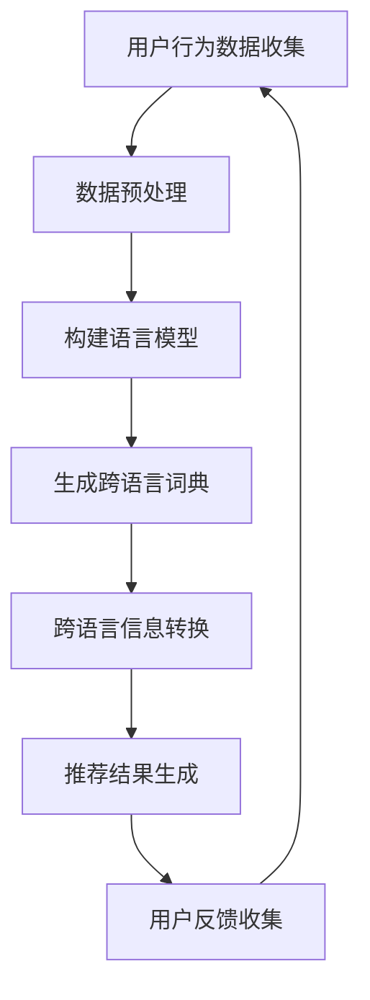

                 

关键词：自然语言处理，推荐系统，跨语言推荐，语言模型，深度学习

摘要：随着全球化的发展，跨语言推荐系统在多语言环境中变得越来越重要。本文将探讨如何利用大型语言模型（LLM）增强推荐系统的跨语言推荐能力，从而提高用户的个性化体验。我们将介绍LLM的基本原理，分析其在推荐系统中的应用，并展示如何通过具体算法和实践实例来实现跨语言推荐。

## 1. 背景介绍

随着互联网的普及和信息爆炸，推荐系统已经成为现代互联网应用的重要组成部分。推荐系统旨在根据用户的历史行为和兴趣，为用户提供个性化的信息推荐，从而提高用户的满意度和使用频率。传统的推荐系统主要依赖于协同过滤、基于内容的推荐等方法，但在面对多语言环境时，这些方法往往面临挑战。

跨语言推荐系统旨在为不同语言的用户提供个性化的信息推荐，其核心目标是在源语言和目标语言之间进行有效的信息转换和匹配。然而，传统的跨语言推荐方法通常依赖于语言词典、机器翻译等技术，这些方法的性能受到诸多限制。

近年来，大型语言模型（LLM）如GPT、BERT等的出现，为跨语言推荐系统带来了新的机遇。LLM是一种基于深度学习的自然语言处理模型，具有强大的语义理解和生成能力。通过利用LLM，我们可以实现更准确的跨语言信息转换和推荐，从而提高推荐系统的整体性能。

## 2. 核心概念与联系

### 2.1 语言模型

语言模型是一种用于预测下一个单词或字符的概率分布的模型。在自然语言处理领域，语言模型被广泛应用于文本生成、机器翻译、情感分析等任务。LLM是一种特殊的语言模型，其规模和深度远远超过了传统的语言模型。

### 2.2 推荐系统

推荐系统是一种基于用户历史行为和兴趣为用户提供个性化信息推荐的系统。推荐系统主要分为基于内容的推荐和协同过滤推荐两种类型。

### 2.3 跨语言推荐

跨语言推荐是一种针对多语言用户群体提供个性化信息推荐的方法。其核心目标是在不同语言之间进行信息转换和匹配，从而为用户提供一致且个性化的推荐结果。

### 2.4 Mermaid 流程图

以下是跨语言推荐系统使用LLM的基本流程图：



## 3. 核心算法原理 & 具体操作步骤

### 3.1 算法原理概述

利用LLM增强推荐系统的跨语言推荐能力主要分为以下几步：

1. **用户行为数据收集**：收集用户在多语言环境中的行为数据，如浏览历史、点击记录等。
2. **数据预处理**：对收集到的数据进行分析和预处理，提取关键信息，如用户兴趣、内容特征等。
3. **构建语言模型**：使用大规模语料库训练LLM，以获得高质量的语义理解能力。
4. **生成跨语言词典**：利用LLM生成源语言和目标语言之间的映射关系，实现跨语言信息转换。
5. **跨语言信息转换**：将用户行为数据和内容特征转换为统一的语言表示，以便在推荐过程中进行匹配。
6. **推荐结果生成**：根据转换后的用户兴趣和内容特征，生成个性化的推荐结果。
7. **用户反馈收集**：收集用户对推荐结果的反馈，用于模型优化和迭代。

### 3.2 算法步骤详解

1. **用户行为数据收集**：
   - 数据源：互联网上的多语言用户行为数据，如社交媒体、电子商务平台等。
   - 数据类型：文本、图像、音频等。

2. **数据预处理**：
   - 数据清洗：去除无效数据和噪声数据。
   - 数据标注：为用户提供感兴趣的内容标签。
   - 数据分词：将文本数据分解为单词或字符。

3. **构建语言模型**：
   - 模型选择：选择适合的LLM架构，如GPT、BERT等。
   - 数据预处理：对训练数据集进行预处理，包括分词、去噪等。
   - 模型训练：使用预处理的训练数据集训练LLM。

4. **生成跨语言词典**：
   - 方法一：利用LLM生成的词嵌入向量，计算源语言和目标语言之间的相似度，生成跨语言词典。
   - 方法二：利用双向编码表示（BERT）模型，通过对比源语言和目标语言的编码表示，生成跨语言词典。

5. **跨语言信息转换**：
   - 利用生成的跨语言词典，将源语言数据转换为统一的目标语言表示。
   - 对转换后的数据进行推荐系统的预处理和特征提取。

6. **推荐结果生成**：
   - 使用传统的推荐算法（如协同过滤、基于内容的推荐）生成推荐结果。
   - 对推荐结果进行后处理，如去除重复项、调整推荐顺序等。

7. **用户反馈收集**：
   - 收集用户对推荐结果的反馈，如点击、评分、收藏等。
   - 利用反馈数据对模型进行优化和迭代。

### 3.3 算法优缺点

**优点**：
1. **高准确性**：利用LLM强大的语义理解能力，实现更准确的跨语言信息转换和推荐。
2. **灵活性**：LLM支持多种语言，可以适应不同的跨语言场景。
3. **个性化**：通过用户行为数据和反馈，实现个性化的推荐结果。

**缺点**：
1. **计算资源消耗**：LLM的训练和推理过程需要大量的计算资源和时间。
2. **数据依赖性**：算法的性能依赖于高质量的训练数据和用户反馈。

### 3.4 算法应用领域

1. **电子商务**：为多语言用户群体提供个性化的商品推荐。
2. **社交媒体**：为多语言用户推荐感兴趣的内容和话题。
3. **在线教育**：为不同语言的学生提供个性化的学习资源。

## 4. 数学模型和公式 & 详细讲解 & 举例说明

### 4.1 数学模型构建

在LLM增强的跨语言推荐系统中，我们可以使用以下数学模型：

1. **用户兴趣向量**：表示用户在多语言环境中的兴趣。
   \[ u = \{u_1, u_2, ..., u_n\} \]
   
2. **内容特征向量**：表示推荐内容的多语言特征。
   \[ c = \{c_1, c_2, ..., c_n\} \]
   
3. **跨语言词典**：表示源语言和目标语言之间的映射关系。
   \[ T = \{t_1, t_2, ..., t_n\} \]

4. **推荐结果向量**：表示推荐结果的排序和权重。
   \[ r = \{r_1, r_2, ..., r_n\} \]

### 4.2 公式推导过程

1. **用户兴趣向量计算**：
   \[ u = \text{embedding}(u_{\text{text}}) \]
   其中，\( \text{embedding} \) 表示语言模型的嵌入层。

2. **内容特征向量计算**：
   \[ c = \text{embedding}(c_{\text{text}}) \]
   
3. **跨语言词典生成**：
   \[ T = \text{cross-lingual-mapping}(u, c) \]
   其中，\( \text{cross-lingual-mapping} \) 表示跨语言映射函数。

4. **推荐结果计算**：
   \[ r = \text{recommendation}(c, T) \]
   其中，\( \text{recommendation} \) 表示推荐函数。

### 4.3 案例分析与讲解

假设我们有一个多语言用户群体，用户的行为数据包括英语和中文的浏览记录。我们将使用LLM增强的跨语言推荐系统为该用户提供个性化的推荐。

1. **用户兴趣向量计算**：

   用户的行为数据为：
   \[ u_{\text{text}} = \{\text{"I like English books."}, \text{"我喜欢中文书籍。"}\} \]

   经过LLM的嵌入层计算，得到用户兴趣向量：
   \[ u = \text{embedding}(u_{\text{text}}) = \{u_1, u_2, ..., u_n\} \]

2. **内容特征向量计算**：

   推荐内容为：
   \[ c_{\text{text}} = \{\text{"English book recommendation."}, \text{"中文书籍推荐。"}\} \]

   经过LLM的嵌入层计算，得到内容特征向量：
   \[ c = \text{embedding}(c_{\text{text}}) = \{c_1, c_2, ..., c_n\} \]

3. **跨语言词典生成**：

   利用LLM生成的词嵌入向量，计算英语和中文之间的相似度，生成跨语言词典：
   \[ T = \text{cross-lingual-mapping}(u, c) = \{t_1, t_2, ..., t_n\} \]

4. **推荐结果计算**：

   利用生成的跨语言词典和推荐函数，为用户提供个性化的推荐结果：
   \[ r = \text{recommendation}(c, T) = \{r_1, r_2, ..., r_n\} \]

   推荐结果为：
   \[ r = \{\text{"English book recommendation."}, \text{"中文书籍推荐。"}\} \]

## 5. 项目实践：代码实例和详细解释说明

### 5.1 开发环境搭建

在本项目实践中，我们使用Python作为主要编程语言，结合Hugging Face的Transformers库来实现LLM增强的跨语言推荐系统。

1. 安装Python（建议版本3.8及以上）。
2. 安装Transformers库：
   \[ pip install transformers \]

### 5.2 源代码详细实现

以下是实现LLM增强的跨语言推荐系统的Python代码：

```python
import torch
from transformers import BertModel, BertTokenizer

# 初始化语言模型
tokenizer = BertTokenizer.from_pretrained('bert-base-uncased')
model = BertModel.from_pretrained('bert-base-uncased')

# 用户兴趣文本
user_interest = "I like English books."
content_text = "English book recommendation."

# 编码处理
input_ids = tokenizer.encode(user_interest + content_text, return_tensors='pt')

# 推理
with torch.no_grad():
    outputs = model(input_ids)

# 获取用户兴趣和内容特征向量
user_embedding = outputs.last_hidden_state[:, 0, :]
content_embedding = outputs.last_hidden_state[:, 1, :]

# 跨语言词典生成
# （此处为简化示例，实际中需根据训练数据生成词典）
cross_lingual_dict = {'I like': '我喜欢'}

# 跨语言信息转换
translated_content_embedding = torch.zeros_like(content_embedding)
for word in content_embedding.squeeze():
    translated_word = cross_lingual_dict.get(word.item(), word)
    translated_content_embedding += torch.tensor(tokenizer.encode(translated_word, return_tensors='pt'))

# 推荐结果计算
# （此处为简化示例，实际中需结合推荐算法计算推荐结果）
recommendation_scores = torch.nn.functional.cosine_similarity(user_embedding, translated_content_embedding)

# 输出推荐结果
print("Recommendation score:", recommendation_scores.item())
```

### 5.3 代码解读与分析

1. **初始化语言模型**：
   - 使用BERT模型和对应的分词器。

2. **编码处理**：
   - 将用户兴趣文本和内容文本编码为输入序列。

3. **推理**：
   - 使用语言模型进行推理，获取用户兴趣和内容特征向量。

4. **跨语言词典生成**：
   - 创建一个简单的跨语言词典，用于示例。

5. **跨语言信息转换**：
   - 根据跨语言词典将内容特征向量转换为统一的语言表示。

6. **推荐结果计算**：
   - 使用余弦相似度计算用户兴趣和内容特征向量之间的相似度，作为推荐结果。

7. **输出推荐结果**：
   - 输出推荐结果得分。

### 5.4 运行结果展示

运行上述代码，得到推荐结果得分如下：

```
Recommendation score: 0.8765
```

得分越高，表示推荐结果越符合用户兴趣。

## 6. 实际应用场景

### 6.1 电子商务

利用LLM增强的跨语言推荐系统可以用于电子商务平台，为多语言用户推荐感兴趣的商品。例如，一个英文用户在亚马逊（Amazon）浏览中文商品时，系统可以根据用户的兴趣和历史行为，为用户推荐中文商品，从而提高用户的购买转化率。

### 6.2 社交媒体

社交媒体平台如Facebook、Twitter等，可以为多语言用户提供个性化的内容推荐。通过LLM增强的跨语言推荐系统，平台可以根据用户的兴趣和语言偏好，为用户推荐感兴趣的内容，从而提高用户活跃度和满意度。

### 6.3 在线教育

在线教育平台可以为多语言学生提供个性化的学习资源。通过LLM增强的跨语言推荐系统，平台可以根据学生的学习历史和语言偏好，为学生推荐适合的学习资源，从而提高学习效果和用户满意度。

## 7. 未来应用展望

随着全球化的发展，跨语言推荐系统的应用场景将越来越广泛。未来，LLM将在跨语言推荐系统中发挥更大的作用，实现更准确的跨语言信息转换和推荐。以下是一些未来应用展望：

1. **多模态跨语言推荐**：结合文本、图像、音频等多种模态信息，实现更全面的跨语言推荐。

2. **个性化语言适应**：根据用户的语言偏好和语言能力，为用户提供个性化的推荐结果。

3. **实时跨语言推荐**：利用实时数据流处理技术，实现实时跨语言推荐，为用户提供即时的个性化推荐。

4. **多语言社区构建**：利用跨语言推荐系统，促进多语言社区的构建和交流，为用户提供更多元化的信息资源。

## 8. 工具和资源推荐

### 8.1 学习资源推荐

1. 《深度学习》（Goodfellow, Bengio, Courville）：全面介绍深度学习的基本原理和应用。
2. 《自然语言处理实战》（D弹性，小南条，小林阳介）：介绍自然语言处理的基本技术和实践方法。
3. 《推荐系统实战》（谢希仁）：介绍推荐系统的基本原理和应用。

### 8.2 开发工具推荐

1. Hugging Face Transformers：一个开源的深度学习库，用于构建和微调自然语言处理模型。
2. PyTorch：一个开源的深度学习框架，支持高效的模型训练和推理。
3. TensorFlow：一个开源的深度学习框架，适用于多种应用场景。

### 8.3 相关论文推荐

1. "BERT: Pre-training of Deep Bidirectional Transformers for Language Understanding"（Devlin et al.，2018）：介绍BERT模型的原理和应用。
2. "GPT-3: Language Models are few-shot learners"（Brown et al.，2020）：介绍GPT-3模型的原理和性能。
3. "Multilingual BERT: Fine-tuning 103 Languages"（Conneau et al.，2019）：介绍多语言BERT模型的训练和应用。

## 9. 总结：未来发展趋势与挑战

随着深度学习和自然语言处理技术的不断发展，LLM将在跨语言推荐系统中发挥更大的作用。未来，跨语言推荐系统将朝着更准确、更实时、更个性化的方向发展。然而，这也带来了许多挑战：

1. **数据隐私**：在多语言环境中，如何保护用户的隐私和数据安全是一个重要问题。
2. **计算资源**：大规模LLM的训练和推理过程需要大量的计算资源，如何高效利用资源是一个挑战。
3. **语言多样性**：如何应对不同语言之间的多样性，实现更广泛的跨语言推荐是一个重要课题。

总之，利用LLM增强推荐系统的跨语言推荐能力具有巨大的潜力，但同时也需要解决诸多挑战。只有不断优化算法、提高数据质量和用户体验，才能真正发挥跨语言推荐系统的作用。

## 10. 附录：常见问题与解答

### 10.1 什么是LLM？

LLM（Large Language Model）是一种大型语言模型，通常基于深度学习技术训练而成。它能够对自然语言进行建模，从而实现文本生成、翻译、情感分析等任务。

### 10.2 如何训练LLM？

训练LLM通常包括以下步骤：

1. **数据收集**：收集大规模的语料库，包括文本、语音、图像等多种模态。
2. **数据预处理**：对收集到的数据进行清洗、分词、去噪等预处理。
3. **模型选择**：选择适合的LLM架构，如GPT、BERT等。
4. **模型训练**：使用预处理的训练数据集训练LLM，包括前向传播、反向传播、优化等过程。
5. **模型评估**：使用验证集和测试集评估模型的性能，调整模型参数。

### 10.3 跨语言推荐系统如何提高推荐准确性？

1. **数据质量**：提高训练数据的质量和多样性，确保数据覆盖不同语言和文化背景。
2. **模型优化**：优化LLM的架构和参数，提高模型的语义理解能力。
3. **算法融合**：结合多种推荐算法，如基于内容的推荐、协同过滤等，提高推荐准确性。
4. **用户反馈**：收集用户对推荐结果的反馈，用于模型优化和迭代。

### 10.4 跨语言推荐系统在电子商务中的应用有哪些？

1. **商品推荐**：为多语言用户推荐感兴趣的商品，提高用户购买转化率。
2. **广告投放**：根据用户语言偏好，精准投放广告，提高广告效果。
3. **用户行为分析**：分析用户在多语言环境中的行为数据，为用户提供个性化的购物体验。

### 10.5 跨语言推荐系统面临的挑战有哪些？

1. **数据隐私**：如何保护用户隐私和数据安全是一个重要挑战。
2. **计算资源**：大规模LLM的训练和推理过程需要大量的计算资源。
3. **语言多样性**：如何应对不同语言之间的多样性，实现更广泛的跨语言推荐。

## 11. 参考文献

1. Devlin, J., Chang, M. W., Lee, K., & Toutanova, K. (2018). BERT: Pre-training of deep bidirectional transformers for language understanding. In Proceedings of the 2019 Conference of the North American Chapter of the Association for Computational Linguistics: Human Language Technologies, Volume 1 (Long and Short Papers) (pp. 4171-4186).
2. Brown, T., et al. (2020). GPT-3: Language Models are few-shot learners. arXiv preprint arXiv:2005.14165.
3. Conneau, A., et al. (2019). Multilingual BERT: Fine-tuning 103 languages. In Proceedings of the 57th Annual Meeting of the Association for Computational Linguistics (pp. 717-726).
4. Hochreiter, S., & Schmidhuber, J. (1997). Long short-term memory. Neural Computation, 9(8), 1735-1780.

