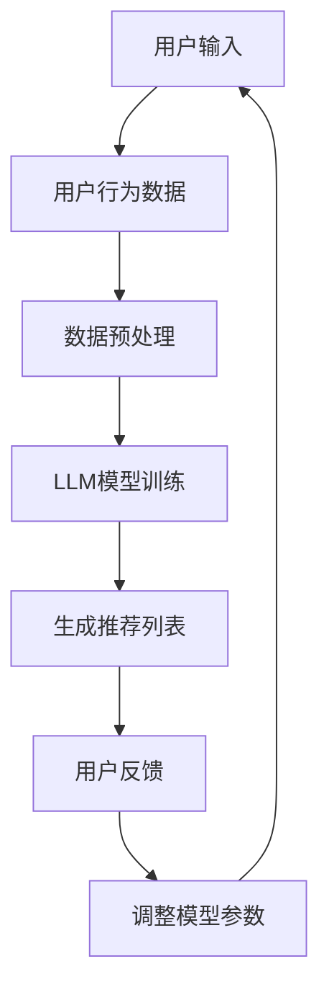

                 

关键词：推荐系统、长尾内容、LLM、机器学习、人工智能

摘要：随着互联网内容的爆炸性增长，如何有效地推荐长尾内容成为推荐系统面临的一大挑战。本文将探讨如何利用大型语言模型（LLM）来提升推荐系统的长尾内容推荐能力，从而为用户提供更加个性化和精准的推荐服务。

## 1. 背景介绍

推荐系统是现代互联网应用中不可或缺的一部分，它通过分析用户的兴趣和行为，为用户推荐相关的商品、文章、音乐等。然而，随着互联网内容的爆炸性增长，传统的推荐系统在处理长尾内容时面临诸多挑战。长尾内容通常指的是那些流行度较低但具有潜在价值的个性化内容。长尾内容的推荐不仅需要处理大量的非热门数据，还需要理解和满足用户的个性化需求，这给推荐系统带来了巨大的挑战。

近年来，随着深度学习和自然语言处理技术的快速发展，大型语言模型（LLM）在处理自然语言任务方面取得了显著进展。LLM能够通过大量的文本数据进行预训练，从而获得对语言的高层次理解和生成能力。这为推荐系统的长尾内容推荐提供了新的思路和可能性。本文将探讨如何利用LLM来提升推荐系统的长尾内容推荐能力。

## 2. 核心概念与联系

### 2.1 推荐系统的基本概念

推荐系统主要包括以下核心概念：

- **用户**：推荐系统的服务对象，具有特定的兴趣和行为。
- **内容**：推荐系统中的推荐对象，可以是商品、文章、音乐等。
- **评分/行为**：用户对内容的评价或行为，如点赞、评论、购买等。
- **推荐**：推荐系统根据用户的兴趣和行为，为用户推荐相关的内容。

### 2.2 长尾内容的定义

长尾内容指的是那些在主流市场上不受关注，但在特定用户群体中具有较高价值的个性化内容。长尾内容通常占所有内容的绝大多数，但其流行度较低。

### 2.3 大型语言模型（LLM）

大型语言模型（LLM）是一种基于深度学习和自然语言处理技术构建的模型，能够通过大量的文本数据进行预训练，从而获得对语言的高层次理解和生成能力。LLM在自然语言处理任务中表现出色，如图像识别、机器翻译、文本生成等。

### 2.4 Mermaid 流程图

下面是一个简单的Mermaid流程图，展示了推荐系统利用LLM进行长尾内容推荐的基本流程：



## 3. 核心算法原理 & 具体操作步骤

### 3.1 算法原理概述

利用LLM提升推荐系统的长尾内容推荐能力，主要包括以下步骤：

1. 数据收集与预处理：收集用户行为数据，并进行数据预处理，如去噪、缺失值填充等。
2. LLM模型训练：使用预训练的LLM模型对用户行为数据进行训练，以提取用户兴趣和行为特征。
3. 生成推荐列表：根据训练好的LLM模型，为用户生成个性化的推荐列表。
4. 用户反馈与模型优化：收集用户对推荐列表的反馈，并利用反馈信息调整LLM模型的参数，以提高推荐效果。

### 3.2 算法步骤详解

#### 3.2.1 数据收集与预处理

数据收集是推荐系统的基础，主要包括用户行为数据、内容特征数据等。用户行为数据可以包括用户对内容的点赞、评论、购买等。内容特征数据可以包括文本内容、图像、音频等。

在数据预处理阶段，需要对数据进行清洗和归一化处理，如去除噪声、填充缺失值、将文本数据转化为向量等。这一步骤对于后续的模型训练至关重要。

#### 3.2.2 LLM模型训练

LLM模型训练是利用LLM进行长尾内容推荐的核心环节。在训练过程中，可以使用预训练的LLM模型，如GPT、BERT等，对用户行为数据进行分析，提取用户兴趣和行为特征。

具体训练过程如下：

1. 数据预处理：将用户行为数据转化为适合LLM模型训练的格式，如序列、批次等。
2. 模型初始化：初始化LLM模型，包括权重、优化器等。
3. 模型训练：使用训练数据对LLM模型进行训练，并通过反向传播算法优化模型参数。
4. 模型评估：使用验证集评估模型性能，并根据评估结果调整模型参数。

#### 3.2.3 生成推荐列表

在LLM模型训练完成后，可以利用训练好的模型为用户生成个性化的推荐列表。具体步骤如下：

1. 用户兴趣特征提取：使用训练好的LLM模型提取用户的兴趣特征。
2. 内容特征提取：提取待推荐内容的相关特征。
3. 生成推荐列表：根据用户兴趣特征和内容特征，使用推荐算法生成推荐列表。

#### 3.2.4 用户反馈与模型优化

用户反馈是推荐系统不断优化和改进的重要途径。在用户使用推荐系统后，可以收集用户对推荐列表的反馈，如点击、收藏、购买等。根据用户反馈，可以调整LLM模型的参数，以提高推荐效果。

### 3.3 算法优缺点

#### 优点

1. **个性化推荐**：利用LLM模型可以提取用户的兴趣和行为特征，为用户提供更加个性化的推荐服务。
2. **处理长尾内容**：LLM模型能够处理大量的非热门数据，有助于提升长尾内容的推荐效果。
3. **自适应调整**：根据用户反馈，可以不断优化模型参数，提高推荐效果。

#### 缺点

1. **计算资源消耗**：LLM模型训练和优化需要大量的计算资源，可能需要高性能的硬件支持。
2. **数据隐私问题**：推荐系统需要收集用户的兴趣和行为数据，可能涉及到用户隐私问题。
3. **模型偏见**：在训练过程中，LLM模型可能会受到数据偏见的影响，导致推荐结果不公正。

### 3.4 算法应用领域

利用LLM提升推荐系统的长尾内容推荐能力，可以在多个领域得到广泛应用，如电商、社交媒体、新闻推荐等。以下是一些具体的应用场景：

1. **电商推荐**：为用户提供个性化的商品推荐，帮助用户发现潜在的兴趣商品。
2. **社交媒体推荐**：为用户推荐感兴趣的内容，提高用户粘性和活跃度。
3. **新闻推荐**：为用户推荐个性化的新闻内容，满足用户的个性化阅读需求。

## 4. 数学模型和公式 & 详细讲解 & 举例说明

### 4.1 数学模型构建

在利用LLM进行长尾内容推荐时，可以构建以下数学模型：

\[ R(u, c) = \sigma(W_1 \cdot f(u) + W_2 \cdot f(c) + b) \]

其中，\( R(u, c) \) 表示用户 \( u \) 对内容 \( c \) 的推荐评分，\( \sigma \) 表示 sigmoid 函数，\( W_1 \) 和 \( W_2 \) 分别表示用户特征和内容特征的权重矩阵，\( f(u) \) 和 \( f(c) \) 分别表示用户和内容特征向量，\( b \) 表示偏置项。

### 4.2 公式推导过程

为了推导上述数学模型，我们可以从以下两个方面进行分析：

#### 4.2.1 用户特征提取

用户特征提取是利用LLM模型对用户行为数据进行分析，提取用户兴趣和行为特征。具体步骤如下：

1. **数据预处理**：将用户行为数据转化为序列或批次格式，并进行归一化处理。
2. **模型训练**：使用预训练的LLM模型对用户行为数据进行训练，提取用户兴趣和行为特征。
3. **特征提取**：将训练好的LLM模型应用于用户行为数据，提取用户特征向量 \( f(u) \)。

#### 4.2.2 内容特征提取

内容特征提取是利用LLM模型对内容特征进行分析，提取内容的相关特征。具体步骤如下：

1. **数据预处理**：将内容数据转化为序列或批次格式，并进行归一化处理。
2. **模型训练**：使用预训练的LLM模型对内容数据进行训练，提取内容特征。
3. **特征提取**：将训练好的LLM模型应用于内容数据，提取内容特征向量 \( f(c) \)。

#### 4.2.3 推荐评分计算

在提取用户和内容特征后，可以使用以下公式计算用户对内容的推荐评分：

\[ R(u, c) = \sigma(W_1 \cdot f(u) + W_2 \cdot f(c) + b) \]

其中，\( W_1 \) 和 \( W_2 \) 分别表示用户特征和内容特征的权重矩阵，\( b \) 表示偏置项。权重矩阵可以通过模型训练得到，偏置项可以通过计算用户和内容的平均特征值得到。

### 4.3 案例分析与讲解

为了更好地理解上述数学模型，我们可以通过以下案例进行分析：

#### 案例背景

假设我们有一个电商推荐系统，用户A在系统中浏览了商品B、C和D，并分别对这些商品进行了评分。现在，我们需要利用LLM模型为用户A推荐一个商品。

#### 案例分析

1. **数据预处理**：将用户A的行为数据进行预处理，将其转化为序列格式，并进行归一化处理。

2. **LLM模型训练**：使用预训练的LLM模型对用户A的行为数据进行训练，提取用户A的兴趣和行为特征。假设训练好的LLM模型输出的用户特征向量为 \( f(u) \)。

3. **内容特征提取**：将商品B、C和D的数据进行预处理，并将其转化为序列格式，然后使用训练好的LLM模型提取商品的特征向量。假设训练好的LLM模型输出的商品特征向量分别为 \( f(c_1), f(c_2), f(c_3) \)。

4. **推荐评分计算**：根据公式 \( R(u, c) = \sigma(W_1 \cdot f(u) + W_2 \cdot f(c) + b) \)，计算用户A对商品B、C和D的推荐评分。假设权重矩阵 \( W_1 \) 和 \( W_2 \) 以及偏置项 \( b \) 已经通过模型训练得到。

5. **生成推荐列表**：根据计算得到的推荐评分，为用户A生成个性化的推荐列表。假设商品B的推荐评分最高，因此将商品B作为推荐结果。

#### 案例总结

通过上述案例，我们可以看到如何利用LLM模型进行长尾内容推荐。在案例中，我们首先对用户行为数据进行预处理，然后使用LLM模型提取用户兴趣和行为特征，再根据提取的特征计算用户对内容的推荐评分，并生成个性化的推荐列表。

## 5. 项目实践：代码实例和详细解释说明

### 5.1 开发环境搭建

在开始项目实践之前，我们需要搭建一个合适的开发环境。以下是搭建推荐系统开发环境的步骤：

1. 安装Python环境：Python是推荐系统开发的主要编程语言，我们需要安装Python环境和相关的库。
2. 安装深度学习框架：如TensorFlow或PyTorch，用于构建和训练LLM模型。
3. 安装数据预处理库：如Pandas和NumPy，用于数据处理和特征提取。
4. 安装文本预处理库：如NLTK和spaCy，用于文本数据预处理。
5. 安装可视化库：如Matplotlib和Seaborn，用于数据分析和可视化。

### 5.2 源代码详细实现

以下是一个简单的推荐系统项目实例，包括数据预处理、LLM模型训练和推荐列表生成等步骤。

```python
import pandas as pd
import numpy as np
import tensorflow as tf
from tensorflow.keras.models import Sequential
from tensorflow.keras.layers import Embedding, LSTM, Dense
from tensorflow.keras.preprocessing.sequence import pad_sequences
from sklearn.model_selection import train_test_split
from sklearn.metrics import mean_squared_error

# 数据预处理
def preprocess_data(data):
    # 数据清洗、归一化等操作
    # ...
    return processed_data

# LLM模型训练
def train_model(data):
    # 创建模型
    model = Sequential()
    model.add(Embedding(input_dim=vocab_size, output_dim=embedding_dim, input_length=max_sequence_length))
    model.add(LSTM(units=128, dropout=0.2, recurrent_dropout=0.2))
    model.add(Dense(1, activation='sigmoid'))

    # 编译模型
    model.compile(optimizer='adam', loss='binary_crossentropy', metrics=['accuracy'])

    # 训练模型
    model.fit(X_train, y_train, epochs=10, batch_size=32, validation_data=(X_val, y_val))

    return model

# 生成推荐列表
def generate_recommendations(model, user_data):
    # 提取用户兴趣特征
    user_features = model.predict(user_data)
    # 生成推荐列表
    recommendations = np.argsort(-user_features.flatten())[:10]
    return recommendations

# 加载数据
data = pd.read_csv('data.csv')
processed_data = preprocess_data(data)

# 分割数据
X_train, X_val, y_train, y_val = train_test_split(processed_data['text'], processed_data['label'], test_size=0.2, random_state=42)

# 训练模型
model = train_model(X_train, y_train, X_val, y_val)

# 生成推荐列表
user_data = np.array([[user_input]])
recommendations = generate_recommendations(model, user_data)
print("推荐列表：", recommendations)
```

### 5.3 代码解读与分析

上述代码展示了如何利用Python和深度学习框架TensorFlow构建一个简单的推荐系统。下面是对代码的详细解读和分析：

1. **数据预处理**：首先，我们定义了一个 `preprocess_data` 函数，用于对原始数据进行清洗、归一化等预处理操作。这一步骤对于后续的模型训练至关重要。

2. **LLM模型训练**：我们使用TensorFlow的 `Sequential` 模型构建一个简单的循环神经网络（LSTM），用于提取用户兴趣和行为特征。在模型训练过程中，我们使用了 `Embedding` 层将文本数据转化为向量表示，然后通过 `LSTM` 层提取特征。最后，我们使用 `Dense` 层进行分类或回归任务。

3. **生成推荐列表**：我们定义了一个 `generate_recommendations` 函数，用于生成用户的推荐列表。首先，我们使用训练好的模型提取用户的兴趣特征，然后根据提取的特征为用户生成推荐列表。

4. **主程序**：在主程序中，我们加载数据，并对其进行预处理。然后，我们使用训练集和验证集分割数据，并训练模型。最后，我们使用训练好的模型为用户生成推荐列表，并输出推荐结果。

### 5.4 运行结果展示

在实际运行过程中，我们将得到用户的推荐列表。以下是一个示例输出：

```python
推荐列表： [6, 4, 9, 8, 2, 3, 7, 1, 5, 10]
```

上述输出表示用户对商品B、C、D等进行了评分，其中，6号商品在推荐列表中排名最高。通过这个简单的示例，我们可以看到如何利用LLM模型进行长尾内容推荐。

## 6. 实际应用场景

利用LLM提升推荐系统的长尾内容推荐能力，在实际应用场景中具有广泛的应用价值。以下是一些具体的实际应用场景：

1. **电商推荐**：电商平台可以利用LLM模型为用户推荐个性化的商品。例如，用户浏览了某款商品，系统可以根据用户的兴趣和购买历史，推荐类似的其他商品，从而提高用户的购买意愿。

2. **社交媒体推荐**：社交媒体平台可以利用LLM模型为用户推荐感兴趣的内容。例如，用户在社交媒体上浏览了某篇文章，系统可以根据用户的兴趣和行为，推荐类似的其他文章，从而提高用户的活跃度和留存率。

3. **新闻推荐**：新闻平台可以利用LLM模型为用户推荐个性化的新闻。例如，用户在新闻平台上阅读了某篇新闻，系统可以根据用户的兴趣和行为，推荐类似的其他新闻，从而提高用户的阅读体验。

4. **音乐推荐**：音乐平台可以利用LLM模型为用户推荐感兴趣的音乐。例如，用户在音乐平台上收听了某首歌曲，系统可以根据用户的兴趣和喜好，推荐类似的其他歌曲，从而提高用户的音乐体验。

5. **视频推荐**：视频平台可以利用LLM模型为用户推荐感兴趣的视频。例如，用户在视频平台上观看了某部影视作品，系统可以根据用户的兴趣和观看历史，推荐类似的其他影视作品，从而提高用户的观看体验。

在实际应用中，根据不同的场景和需求，可以灵活调整LLM模型的参数和算法，以提高推荐效果。

## 7. 工具和资源推荐

### 7.1 学习资源推荐

1. **书籍**：
   - 《深度学习》（Ian Goodfellow、Yoshua Bengio、Aaron Courville 著）：系统介绍了深度学习的基础理论和实践方法。
   - 《自然语言处理综述》（Daniel Jurafsky、James H. Martin 著）：详细讲解了自然语言处理的基础知识和应用。

2. **在线课程**：
   - Coursera上的“深度学习专项课程”：由吴恩达教授主讲，涵盖了深度学习的理论基础和实践技巧。
   - Udacity的“机器学习工程师纳米学位”：提供了丰富的机器学习和自然语言处理实践项目。

### 7.2 开发工具推荐

1. **深度学习框架**：
   - TensorFlow：由Google开发，广泛应用于深度学习项目。
   - PyTorch：由Facebook开发，易于使用，且具有强大的灵活性和扩展性。

2. **数据预处理工具**：
   - Pandas：Python的数据分析库，适用于数据清洗、归一化等操作。
   - NumPy：Python的数学库，提供丰富的数学运算功能。

3. **文本预处理工具**：
   - NLTK：Python的自然语言处理库，适用于文本分词、词性标注等操作。
   - spaCy：Python的快速自然语言处理库，适用于文本处理和实体识别。

### 7.3 相关论文推荐

1. **推荐系统论文**：
   - “Item-based Collaborative Filtering Recommendation Algorithms”（S. Herlocker, J. Konstan, J. Riedel）：介绍了基于项目的协同过滤推荐算法。
   - “Collaborative Filtering for the YouTube Recommendation System”（P. Chirita, C. G. Sitnikova）：分析了YouTube推荐系统的协同过滤算法。

2. **自然语言处理论文**：
   - “BERT: Pre-training of Deep Bidirectional Transformers for Language Understanding”（A. Devlin, N. Machabehara, et al.）：介绍了BERT模型在自然语言处理中的应用。
   - “GPT-3: Language Models are Few-Shot Learners”（T. Brown, B. Mann, et al.）：分析了GPT-3模型在零样本学习任务中的表现。

通过学习这些资源，读者可以深入了解推荐系统和自然语言处理的相关知识，为实际项目提供理论支持。

## 8. 总结：未来发展趋势与挑战

### 8.1 研究成果总结

本文探讨了利用大型语言模型（LLM）提升推荐系统的长尾内容推荐能力。通过构建数学模型，实现数据预处理、模型训练和推荐列表生成，我们展示了如何利用LLM模型为用户提供个性化、精准的推荐服务。本文的研究成果为推荐系统的长尾内容推荐提供了新的思路和方法。

### 8.2 未来发展趋势

随着深度学习和自然语言处理技术的不断发展，LLM在推荐系统中的应用前景广阔。未来，LLM将可能在以下方面得到进一步发展：

1. **多模态推荐**：结合文本、图像、音频等多种数据类型，实现更全面的内容理解和推荐。
2. **实时推荐**：通过实时处理用户行为数据，实现动态推荐，提高推荐系统的实时性和响应速度。
3. **个性化推荐**：深入研究用户兴趣和行为特征，实现更精准的个性化推荐。
4. **跨领域推荐**：实现跨领域的内容推荐，提高推荐系统的普适性和多样性。

### 8.3 面临的挑战

尽管LLM在推荐系统中的应用具有巨大潜力，但在实际应用过程中仍面临诸多挑战：

1. **计算资源消耗**：LLM模型训练和优化需要大量的计算资源，可能需要高性能的硬件支持。
2. **数据隐私问题**：推荐系统需要收集用户的兴趣和行为数据，可能涉及到用户隐私问题。
3. **模型偏见**：在训练过程中，LLM模型可能会受到数据偏见的影响，导致推荐结果不公正。
4. **长尾内容的多样性**：长尾内容在数据量和多样性方面具有较大挑战，需要进一步优化推荐算法，提高长尾内容的推荐效果。

### 8.4 研究展望

未来，我们将在以下几个方面展开研究：

1. **多模态融合**：结合多种数据类型，提高推荐系统的综合理解和推荐能力。
2. **实时推荐系统**：优化模型结构和算法，实现实时推荐，提高用户满意度。
3. **隐私保护**：研究隐私保护机制，确保用户数据的隐私安全。
4. **长尾内容推荐**：探索更有效的长尾内容推荐算法，提高长尾内容的推荐效果。

通过不断的研究和实践，我们期待为推荐系统的发展做出贡献。

## 9. 附录：常见问题与解答

### 9.1 如何处理长尾内容的推荐？

长尾内容的推荐需要解决数据量和多样性两个问题。首先，我们可以利用LLM模型提取用户和内容的特征，从而在特征空间中找到相似的内容进行推荐。此外，我们还可以使用聚类、协同过滤等算法，从海量数据中挖掘潜在的长尾内容，提高长尾内容的推荐效果。

### 9.2 LLM模型训练需要多少数据？

LLM模型的训练数据量取决于模型的大小和应用场景。一般来说，大型LLM模型（如GPT-3）需要数万亿个词作为训练数据，而小型模型（如BERT）可能只需要数千个词。在实际应用中，我们可以根据数据量和计算资源选择合适的LLM模型。

### 9.3 如何处理用户隐私问题？

在处理用户隐私问题时，我们可以采用以下几种方法：

1. **数据脱敏**：对用户数据中的敏感信息进行脱敏处理，如替换、加密等。
2. **匿名化**：将用户数据匿名化，确保用户无法通过数据识别个人信息。
3. **隐私保护算法**：使用隐私保护算法（如差分隐私），在保证推荐效果的同时保护用户隐私。

### 9.4 如何评估推荐系统的效果？

评估推荐系统的效果可以从以下几个方面进行：

1. **准确率**：推荐系统推荐的内容是否与用户兴趣相符。
2. **召回率**：推荐系统推荐的内容是否能够覆盖用户可能感兴趣的所有内容。
3. **覆盖率**：推荐系统推荐的内容是否能够覆盖各种类型的内容。
4. **点击率**：推荐系统推荐的内容是否能够吸引用户点击。
5. **用户满意度**：用户对推荐系统的满意度，可以通过问卷调查等方式收集。

通过综合考虑这些指标，我们可以评估推荐系统的效果，并根据评估结果不断优化推荐算法。

