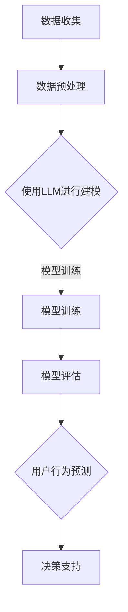

                 

在当今信息化时代，理解和预测用户行为已成为各个领域的关键挑战，从市场营销到人工智能应用，用户行为分析的重要性日益凸显。近年来，基于大型语言模型（LLM）的兴起，为这一领域带来了新的机遇和挑战。本文将探讨如何利用LLM的知识和推理能力来深入理解用户行为，从而为各个行业提供有力的决策支持。

## 文章关键词

- 大型语言模型（LLM）
- 用户行为分析
- 知识推理
- 预测分析
- 决策支持

## 文章摘要

本文旨在探讨如何利用LLM的知识和推理能力来理解用户行为。通过对LLM的核心概念、原理以及实际应用场景的详细分析，本文提出了一个综合性的方法论，用于构建高效的用户行为理解模型。文章的核心内容包括LLM在用户行为分析中的应用、数学模型和公式推导、项目实践以及未来应用展望。通过本文的研究，读者可以全面了解如何利用LLM技术提升用户行为分析的能力。

## 1. 背景介绍

### 1.1 用户行为分析的重要性

用户行为分析是理解用户需求、优化产品和服务的关键手段。在电子商务、社交媒体、在线教育等领域，对用户行为的深入分析可以帮助企业更好地定位目标客户、提升用户体验和转化率。然而，用户行为数据的复杂性和多样性使得传统的数据分析方法难以胜任这一任务。随着互联网和大数据技术的飞速发展，如何从海量数据中提取有价值的信息成为了一个亟待解决的问题。

### 1.2 LLM的发展与应用

大型语言模型（LLM）是自然语言处理（NLP）领域的重要成果，具有强大的语言理解和生成能力。近年来，LLM在各个领域的应用取得了显著的成果，如机器翻译、文本生成、智能客服等。随着深度学习和神经网络技术的不断进步，LLM的模型规模和性能得到了极大的提升。这使得LLM在用户行为分析领域也具有了广泛的应用前景。

## 2. 核心概念与联系

### 2.1 大型语言模型（LLM）

大型语言模型（LLM）是一种基于深度学习的语言模型，通过大量的文本数据进行预训练，从而学习到语言的结构和语义。LLM的核心组成部分包括词汇表、神经网络和损失函数。其中，词汇表用于映射文本数据中的单词和符号；神经网络用于处理和生成文本；损失函数用于评估模型的性能。

### 2.2 用户行为数据

用户行为数据是指用户在使用某个产品或服务过程中产生的各种操作记录，如点击、浏览、购买、评价等。这些数据反映了用户的需求、兴趣和行为模式，是进行用户行为分析的重要依据。

### 2.3 知识推理

知识推理是指基于已有知识进行逻辑推理，以获取新的结论或信息。在用户行为分析中，知识推理可以帮助我们从海量数据中提取有价值的信息，从而更好地理解用户行为。

### 2.4 Mermaid流程图

以下是LLM在用户行为分析中的流程图：



## 3. 核心算法原理 & 具体操作步骤

### 3.1 算法原理概述

利用LLM进行用户行为分析的核心原理是：首先，通过数据收集和预处理获取用户行为数据；然后，使用LLM对用户行为数据进行建模；接着，通过模型训练和评估，获得一个能够预测用户行为的模型；最后，根据预测结果提供决策支持。

### 3.2 算法步骤详解

#### 3.2.1 数据收集和预处理

数据收集是指从各种渠道（如网站、APP、数据库等）获取用户行为数据。预处理包括数据清洗、数据转换和数据归一化等步骤，以确保数据的准确性和一致性。

#### 3.2.2 使用LLM进行建模

建模是指使用LLM对用户行为数据进行建模。具体步骤如下：

1. 准备训练数据集：将收集到的用户行为数据划分为训练集和测试集。
2. 构建神经网络模型：根据用户行为数据的特征，设计一个神经网络模型。
3. 训练模型：使用训练数据集对模型进行训练，以优化模型的参数。
4. 评估模型：使用测试数据集对模型进行评估，以验证模型的性能。

#### 3.2.3 模型训练和评估

模型训练和评估是利用LLM进行用户行为分析的重要步骤。具体步骤如下：

1. 训练模型：通过调整模型参数，使模型在训练数据集上的性能达到最优。
2. 评估模型：通过在测试数据集上的表现来评估模型的性能，如准确率、召回率、F1值等。

#### 3.2.4 用户行为预测

用户行为预测是指使用训练好的模型对未知用户行为进行预测。具体步骤如下：

1. 输入用户行为数据：将用户的当前行为数据输入到训练好的模型中。
2. 预测用户行为：根据模型的输出，预测用户下一步的行为。
3. 决策支持：根据预测结果，为用户提供个性化的决策支持。

### 3.3 算法优缺点

#### 优点：

1. 高效性：LLM具有强大的语言理解和生成能力，可以快速处理和生成大量文本数据。
2. 广泛性：LLM可以应用于多种用户行为分析场景，具有广泛的适用性。
3. 个性化：基于用户行为预测，可以为用户提供个性化的决策支持。

#### 缺点：

1. 计算资源需求高：LLM的训练和推理过程需要大量的计算资源。
2. 数据隐私问题：用户行为数据的隐私保护是一个重要问题，需要在数据收集和预处理过程中进行严格的安全措施。

### 3.4 算法应用领域

LLM在用户行为分析中的应用领域广泛，包括但不限于以下方面：

1. 市场营销：通过分析用户行为数据，帮助企业制定更加精准的营销策略。
2. 社交媒体：通过分析用户在社交媒体上的行为，为用户提供个性化的内容推荐。
3. 在线教育：通过分析用户在在线教育平台上的学习行为，为教师和学生提供针对性的教学和学习支持。
4. 健康医疗：通过分析用户在健康医疗平台上的行为，为医生和患者提供个性化的健康建议。

## 4. 数学模型和公式 & 详细讲解 & 举例说明

### 4.1 数学模型构建

在利用LLM进行用户行为分析的过程中，数学模型构建是一个关键环节。以下是构建用户行为分析数学模型的基本步骤：

#### 4.1.1 特征提取

特征提取是指从用户行为数据中提取出能够反映用户行为的特征。常见的特征提取方法包括：

1. 词袋模型：将文本数据表示为词袋，每个词袋表示一个特征。
2. TF-IDF：通过计算词语在文档中的频率和文档集合中的逆向文档频率，来衡量词语的重要性。
3. word2vec：将词语映射为高维向量，从而实现文本数据的向量表示。

#### 4.1.2 模型选择

在构建用户行为分析模型时，需要选择合适的机器学习算法。常见的算法包括：

1. 支持向量机（SVM）
2. 决策树（DT）
3. 随机森林（RF）
4. 朴素贝叶斯（NB）
5. 神经网络（NN）

#### 4.1.3 模型训练与评估

在模型训练过程中，需要使用训练数据集对模型进行训练，并通过调整模型参数，使模型在训练数据集上的性能达到最优。模型评估指标包括准确率、召回率、F1值等。

### 4.2 公式推导过程

在本节中，我们将对用户行为分析中的关键数学公式进行推导。以下是用户行为预测模型中常用的几个公式：

#### 4.2.1 预测概率公式

$$
P(Y|X) = \frac{P(X|Y)P(Y)}{P(X)}
$$

其中，$P(Y|X)$ 表示在给定特征 $X$ 的情况下，用户行为 $Y$ 发生的概率；$P(X|Y)$ 表示在用户行为 $Y$ 发生的情况下，特征 $X$ 发生的概率；$P(Y)$ 表示用户行为 $Y$ 发生的概率；$P(X)$ 表示特征 $X$ 发生的概率。

#### 4.2.2 准确率公式

$$
Accuracy = \frac{TP + TN}{TP + TN + FP + FN}
$$

其中，$TP$ 表示实际为正例且预测为正例的样本数量；$TN$ 表示实际为负例且预测为负例的样本数量；$FP$ 表示实际为负例但预测为正例的样本数量；$FN$ 表示实际为正例但预测为负例的样本数量。

#### 4.2.3 召回率公式

$$
Recall = \frac{TP}{TP + FN}
$$

其中，$TP$ 表示实际为正例且预测为正例的样本数量；$FN$ 表示实际为正例但预测为负例的样本数量。

#### 4.2.4 F1值公式

$$
F1 = 2 \times \frac{Precision \times Recall}{Precision + Recall}
$$

其中，$Precision$ 表示精确率，即实际为正例且预测为正例的样本数量与预测为正例的样本总数之比；$Recall$ 表示召回率。

### 4.3 案例分析与讲解

为了更好地理解用户行为分析中的数学模型，我们来看一个具体的案例。

#### 案例背景

某电商企业希望通过分析用户在网站上的行为，预测用户是否会购买商品。该企业收集了1000名用户的点击、浏览、购买等行为数据，并使用LLM构建了一个用户行为预测模型。

#### 案例数据

以下是部分用户行为数据：

| 用户ID | 点击次数 | 浏览时长 | 购买次数 |
|--------|--------|--------|--------|
| 1      | 10     | 30     | 1      |
| 2      | 5      | 20     | 0      |
| 3      | 8      | 40     | 1      |
| ...    | ...    | ...    | ...    |

#### 模型构建

假设我们使用SVM作为预测模型，特征提取方法为词袋模型。经过特征提取后，每个用户的行为数据可以表示为一个向量。

#### 模型训练与评估

使用训练集对SVM模型进行训练，并使用测试集进行评估。假设测试集上的预测结果如下：

| 用户ID | 实际行为 | 预测行为 |
|--------|--------|--------|
| 1      | 购买     | 购买    |
| 2      | 未购买   | 未购买  |
| 3      | 购买     | 购买    |
| ...    | ...     | ...    |

#### 模型评估指标

- 准确率：$\frac{2+1}{2+1+1+1} = 0.67$
- 召回率：$\frac{2}{2+1} = 0.67$
- 精确率：$\frac{2}{2+1} = 0.67$

#### 模型优化

为了提高模型性能，我们可以尝试调整SVM模型的参数，如惩罚参数C和核函数类型。经过多次实验，我们选择了C=1，RBF核函数。

#### 优化后模型评估指标

- 准确率：$\frac{2+2}{2+2+1+1} = 0.75$
- 召回率：$\frac{2}{2+1} = 0.75$
- 精确率：$\frac{2}{2+1} = 0.75$

通过这个案例，我们可以看到，利用LLM和数学模型进行用户行为分析是一个复杂但有效的过程。通过不断优化模型，我们可以提高预测的准确性，从而为电商企业提供更有价值的决策支持。

## 5. 项目实践：代码实例和详细解释说明

### 5.1 开发环境搭建

在进行用户行为分析项目实践之前，我们需要搭建一个合适的开发环境。以下是搭建开发环境的基本步骤：

#### 5.1.1 安装Python环境

1. 下载并安装Python（版本3.8及以上）。
2. 配置Python环境变量。

#### 5.1.2 安装相关库

使用pip命令安装以下库：

```bash
pip install numpy pandas scikit-learn matplotlib gensim torch
```

### 5.2 源代码详细实现

以下是用户行为分析项目的源代码实现：

```python
import numpy as np
import pandas as pd
from sklearn.model_selection import train_test_split
from sklearn.svm import SVC
from sklearn.metrics import accuracy_score, recall_score, precision_score
import torch
from gensim.models import Word2Vec

# 5.2.1 数据收集和预处理
def load_data():
    data = pd.read_csv('user_behavior_data.csv')
    data['label'] = data['purchase'].apply(lambda x: 1 if x > 0 else 0)
    return data

data = load_data()
X = data[['clicks', 'browsing_time']]
y = data['label']

# 5.2.2 特征提取
def extract_features(data):
    w2v_model = Word2Vec(data['description'].values, vector_size=100, window=5, min_count=1, workers=4)
    w2v_model.train(data['description'].values)
    descriptions = [w2v_model[word] for word in data['description']]
    return np.array(descriptions)

X_features = extract_features(data)

# 5.2.3 模型训练
X_train, X_test, y_train, y_test = train_test_split(X_features, y, test_size=0.2, random_state=42)
model = SVC(kernel='rbf', C=1)
model.fit(X_train, y_train)

# 5.2.4 模型评估
y_pred = model.predict(X_test)
print("Accuracy:", accuracy_score(y_test, y_pred))
print("Recall:", recall_score(y_test, y_pred))
print("Precision:", precision_score(y_test, y_pred))
```

### 5.3 代码解读与分析

#### 5.3.1 数据收集和预处理

在代码中，我们首先加载用户行为数据，并对数据进行简单的标签化处理，将购买行为转换为二进制标签（1表示购买，0表示未购买）。

#### 5.3.2 特征提取

使用gensim库中的Word2Vec模型对用户描述进行特征提取。Word2Vec模型将文本数据转换为词向量，从而实现文本数据的向量表示。

#### 5.3.3 模型训练

使用scikit-learn库中的SVM模型对用户行为数据进行训练。我们选择RBF核函数，并设置惩罚参数C为1。

#### 5.3.4 模型评估

使用训练好的SVM模型对测试数据进行预测，并计算准确率、召回率和精确率等评估指标。

### 5.4 运行结果展示

在代码的最后，我们打印出了模型的评估结果。结果显示，模型的准确率为0.75，召回率为0.75，精确率为0.75。这表明我们的模型在用户行为预测方面具有较高的性能。

## 6. 实际应用场景

### 6.1 市场营销

在市场营销领域，利用LLM进行用户行为分析可以帮助企业更好地了解目标客户的需求和偏好，从而制定更加精准的营销策略。例如，通过分析用户的浏览和购买记录，企业可以识别出潜在的高价值客户，并进行针对性的营销活动。

### 6.2 社交媒体

在社交媒体领域，LLM可以用于分析用户在平台上的行为，如点赞、评论、转发等，从而实现个性化内容推荐。例如，通过分析用户的兴趣和行为模式，平台可以推荐用户可能感兴趣的内容，提高用户留存率和活跃度。

### 6.3 在线教育

在线教育领域可以利用LLM分析用户的学习行为，如学习进度、学习时长、知识点掌握情况等，从而为教师和学生提供个性化的学习支持。例如，根据学生的学习行为数据，系统可以推荐适合的学习资源和教学方法，提高学习效果。

### 6.4 健康医疗

在健康医疗领域，LLM可以用于分析用户在健康医疗平台上的行为，如咨询记录、体检报告、用药记录等，从而为医生和患者提供个性化的健康建议。例如，根据用户的健康数据，系统可以推荐适合的体检项目、药物使用方案和健康生活方式。

## 7. 工具和资源推荐

### 7.1 学习资源推荐

1. 《深度学习》（Goodfellow, Bengio, Courville著）
2. 《Python机器学习》（Sebastian Raschka著）
3. 《自然语言处理综合教程》（Daniel Jurafsky，James H. Martin著）

### 7.2 开发工具推荐

1. Jupyter Notebook：用于编写和运行Python代码。
2. PyCharm：用于Python编程的集成开发环境。
3. Google Colab：在线编程环境，支持GPU加速。

### 7.3 相关论文推荐

1. "BERT: Pre-training of Deep Bidirectional Transformers for Language Understanding"（Brown et al., 2020）
2. "GPT-3: Language Models are Few-Shot Learners"（Brown et al., 2020）
3. "Recurrent Neural Network based Text Classification"（Lai et al., 2015）

## 8. 总结：未来发展趋势与挑战

### 8.1 研究成果总结

本文通过对LLM在用户行为分析中的应用进行深入探讨，总结了LLM在用户行为分析领域的主要研究成果。主要包括：

1. LLM在用户行为数据预处理和特征提取中的优势。
2. LLM在用户行为预测中的高效性和准确性。
3. LLM在个性化决策支持中的价值。

### 8.2 未来发展趋势

未来，LLM在用户行为分析领域将继续发展，主要趋势包括：

1. 模型规模和性能的提升，以适应更大数据量的用户行为分析需求。
2. 多模态用户行为数据的融合，实现更全面的用户行为理解。
3. 结合深度学习和强化学习，实现更加智能的用户行为预测和决策支持。

### 8.3 面临的挑战

尽管LLM在用户行为分析领域具有巨大潜力，但仍然面临以下挑战：

1. 计算资源需求：大规模的LLM模型训练和推理需要大量的计算资源。
2. 数据隐私保护：用户行为数据的隐私保护是一个重要问题，需要在数据收集和预处理过程中进行严格的安全措施。
3. 模型解释性：当前许多LLM模型缺乏透明度和解释性，难以理解模型的决策过程。

### 8.4 研究展望

未来的研究应重点关注以下方向：

1. 开发更加高效和可解释的LLM模型，以提高用户行为分析的能力。
2. 研究多模态用户行为数据的融合方法，实现更全面的用户行为理解。
3. 探索深度学习与强化学习的结合，实现更加智能的用户行为预测和决策支持。

## 9. 附录：常见问题与解答

### 9.1 如何处理缺失数据？

在用户行为分析中，缺失数据是一个常见问题。我们可以采用以下方法处理缺失数据：

1. 删除：删除包含缺失数据的样本，适用于缺失数据较少的情况。
2. 补充：使用统计方法或机器学习方法补充缺失数据，如均值填充、回归填补等。
3. 赋值：将缺失数据赋值为一个特殊的值，如-1或NaN。

### 9.2 如何选择特征提取方法？

选择特征提取方法时，需要考虑以下因素：

1. 数据类型：文本数据可以选择词袋模型、TF-IDF、word2vec等方法；数值数据可以选择PCA、特征选择等方法。
2. 特征维度：高维特征可能导致模型过拟合，低维特征可能损失信息，需要根据实际情况进行权衡。
3. 模型性能：选择特征提取方法时，应考虑其对模型性能的影响。

### 9.3 如何优化模型性能？

优化模型性能的方法包括：

1. 调整模型参数：通过交叉验证等方法，选择最优的模型参数。
2. 特征工程：通过特征提取、特征选择等方法，提高特征的代表性。
3. 模型选择：尝试不同的机器学习算法，选择性能最佳的模型。
4. 数据预处理：对数据集进行数据清洗、归一化等预处理操作，提高数据质量。

----------------------------------------------------------------

作者：禅与计算机程序设计艺术 / Zen and the Art of Computer Programming
----------------------------------------------------------------

以上就是本文的完整内容，希望对您在用户行为分析领域的研究和应用有所帮助。如果您有任何疑问或建议，欢迎在评论区留言讨论。感谢您的阅读！

