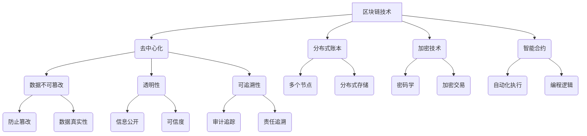

                 

关键词：区块链，知识产权，版权保护，去中心化，加密技术，智能合约，分布式账本

> 摘要：随着数字技术和互联网的迅猛发展，知识产权保护面临前所未有的挑战。本文探讨了利用区块链技术保护知识产权的潜力，包括其核心概念、技术原理、数学模型以及实际应用案例。通过深入分析，我们总结了区块链技术在知识产权保护中的优势与挑战，并展望了其未来发展的趋势。

## 1. 背景介绍

### 知识产权保护的重要性

知识产权是知识经济时代的重要资产，涵盖了专利、商标、版权和商业秘密等多种形式。有效的知识产权保护不仅能够激发创新活力，促进科技进步，还能够为企业和个人带来巨大的经济收益。然而，随着数字化和网络化的加速推进，知识产权侵权问题日益严重，传统的知识产权保护机制面临着巨大的挑战。

### 传统知识产权保护的局限性

传统的知识产权保护机制依赖于法律、行政和技术手段，如专利申请、商标注册、版权登记等。然而，这些方法在应对数字环境下的问题时存在以下局限性：

- **地域性限制**：传统的知识产权保护依赖于各国的法律体系，跨国界的侵权行为难以有效遏制。
- **成本高**：专利申请、诉讼等程序复杂且成本高昂，对于中小企业和个人创新者来说负担沉重。
- **信息不对称**：权利人难以全面掌握其知识产权的利用和侵权情况。
- **易篡改**：纸质文件和数据库容易受到篡改和丢失的风险。

### 区块链技术的兴起

区块链技术的出现为知识产权保护提供了一种新的思路。作为一种去中心化的分布式账本技术，区块链具有不可篡改、透明和可追溯的特点，能够有效地解决传统知识产权保护中的问题。

## 2. 核心概念与联系

### 区块链技术概述

区块链是一种分布式数据库技术，通过密码学和共识算法，实现了数据的不可篡改和可追溯性。区块链由多个区块组成，每个区块包含一定数量的交易记录，并通过加密技术链接在一起，形成一个不可分割的链条。区块链的分布式特性意味着数据存储在多个节点上，任何单一节点都无法单独控制或篡改数据。

### 核心概念原理和架构的 Mermaid 流程图



### 核心概念原理

- **去中心化**：区块链技术通过多个节点的参与，实现了去中心化的网络结构，任何单一节点都无法控制整个网络。
- **分布式账本**：区块链将数据分散存储在多个节点上，提高了数据的可靠性和安全性。
- **加密技术**：区块链使用密码学技术对数据进行加密，确保交易记录的隐私性和安全性。
- **智能合约**：智能合约是运行在区块链上的自动执行合约，通过编程逻辑实现自动化交易。
- **数据不可篡改**：区块链通过共识算法和数据加密，确保了数据一旦记录在区块链上就无法被篡改。
- **透明性**：区块链上的数据是公开透明的，任何用户都可以查看和验证。
- **可追溯性**：区块链的分布式结构使得每一笔交易都有完整的记录，可追溯性强。

## 3. 核心算法原理 & 具体操作步骤

### 3.1 算法原理概述

区块链技术的核心在于其共识算法和加密技术。共识算法通过多个节点共同验证和确认交易，确保数据的准确性和一致性。加密技术则通过非对称加密和哈希函数，确保交易记录的安全性和隐私性。

### 3.2 算法步骤详解

#### 步骤一：交易记录生成

用户在区块链上进行交易时，会生成一个交易记录。交易记录包括交易金额、交易双方身份信息、交易时间和交易内容等。

#### 步骤二：交易记录加密

交易记录生成后，会使用非对称加密技术进行加密。加密过程涉及公钥和私钥的生成，交易记录使用公钥加密，私钥用于解密。

#### 步骤三：交易记录广播

加密后的交易记录会被广播到区块链网络中的所有节点。节点接收到交易记录后，会将其添加到本地的交易池中。

#### 步骤四：区块生成

交易池中的交易记录在一定条件下会组成一个新的区块。区块包含一定数量的交易记录，并通过哈希函数与前一区块链接。

#### 步骤五：区块验证

新区块生成后，需要通过共识算法进行验证。共识算法通过多个节点共同验证新区块的有效性，确保数据的准确性。

#### 步骤六：区块添加

验证通过后，新区块会被添加到区块链上，形成一条完整的区块链。

#### 步骤七：交易确认

交易记录在区块链上被确认后，即可视为完成。用户可以通过区块链上的交易记录验证其交易是否成功。

### 3.3 算法优缺点

#### 优点

- **去中心化**：区块链技术去中心化，任何节点都无法控制网络，提高了系统的透明性和安全性。
- **数据不可篡改**：区块链上的数据一旦记录就无法被篡改，保证了数据的真实性和可靠性。
- **透明性**：区块链上的数据是公开透明的，用户可以随时查询和验证。
- **安全性**：区块链使用加密技术保护数据，确保交易记录的隐私性和安全性。

#### 缺点

- **性能瓶颈**：区块链的性能相对较低，无法处理大量交易。
- **去中心化风险**：去中心化意味着网络中的节点可能会恶意攻击，影响系统的稳定性。
- **复杂性**：区块链技术的实现和维护相对复杂，对技术人员的要求较高。

### 3.4 算法应用领域

区块链技术适用于多种场景，尤其在知识产权保护领域具有广泛的应用前景。例如，可以用于版权保护、专利管理、商标注册等。

## 4. 数学模型和公式 & 详细讲解 & 举例说明

### 4.1 数学模型构建

区块链技术中的数学模型主要包括哈希函数、非对称加密和共识算法。以下是对这些模型的详细讲解。

#### 哈希函数

哈希函数是将任意长度的输入（消息）通过加密算法变换成固定长度的输出（哈希值）的一种函数。哈希函数具有以下几个特点：

- **单向性**：哈希函数是单向的，无法通过哈希值反推出原始输入。
- **抗碰撞性**：哈希函数具有抗碰撞性，不同输入产生相同哈希值的概率极低。
- **抗差异性**：哈希函数对输入的微小差异具有高度敏感性，微小差异会导致哈希值产生巨大差异。

常见的哈希函数包括SHA-256、MD5等。SHA-256是一种加密哈希函数，输出长度为256位。以下是一个简单的SHA-256哈希函数示例：

$$
H = SHA-256(M)
$$

其中，$H$ 表示哈希值，$M$ 表示输入消息。

#### 非对称加密

非对称加密是一种加密算法，使用一对非对称密钥（公钥和私钥）进行加密和解密。公钥可以公开，私钥则需要保密。非对称加密的基本原理如下：

- **加密**：发送方使用接收方的公钥对消息进行加密，只有接收方能够使用其私钥解密。
- **解密**：接收方使用自己的私钥对加密消息进行解密，确保消息的保密性。

非对称加密的主要优点包括：

- **安全性**：公钥可以公开，私钥保密，确保通信的安全性。
- **认证**：通过公钥验证发送方的身份，确保通信的真实性。

常见的非对称加密算法包括RSA、ECC等。以下是一个简单的RSA加密算法示例：

$$
c = (m^e) \mod n
$$

其中，$c$ 表示加密后的消息，$m$ 表示原始消息，$e$ 和 $n$ 分别表示公钥指数和模数。

#### 共识算法

共识算法是区块链网络中节点共同达成一致的方法。常见的共识算法包括工作量证明（PoW）、权益证明（PoS）等。以下是一个简单的工作量证明算法示例：

- **节点竞争**：区块链网络中的节点竞争生成新的区块。
- **工作量计算**：节点通过计算一个满足特定条件的哈希值，证明自己的工作量。
- **区块添加**：第一个计算成功的节点将其结果广播给其他节点，其他节点验证其结果并添加到区块链上。

### 4.2 公式推导过程

以下是区块链技术中一些关键数学公式的推导过程。

#### 哈希函数公式推导

哈希函数的输出结果为固定长度，假设哈希函数的输出长度为 $l$，输入消息为 $M$，则哈希函数的公式为：

$$
H(M) = H_l(M)
$$

其中，$H_l$ 表示将输入消息 $M$ 映射到长度为 $l$ 的输出哈希值。

#### 非对称加密公式推导

非对称加密的基本公式为：

$$
c = (m^e) \mod n
$$

其中，$m$ 表示原始消息，$e$ 和 $n$ 分别表示公钥指数和模数，$c$ 表示加密后的消息。

推导过程如下：

- **密钥生成**：选择一个大素数 $p$ 和 $q$，计算 $n = p \times q$，$φ(n) = (p - 1) \times (q - 1)$。
- **公钥指数**：选择一个与 $φ(n)$ 互质的数 $e$，计算 $d$，满足 $d \times e \mod φ(n) = 1$。
- **加密**：发送方使用接收方的公钥 $(e, n)$ 对消息 $m$ 进行加密，公式为 $c = (m^e) \mod n$。
- **解密**：接收方使用自己的私钥 $(d, n)$ 对加密消息 $c$ 进行解密，公式为 $m = c^d \mod n$。

#### 共识算法公式推导

工作量证明算法的基本公式为：

$$
H_1 = PoW(1)
$$

其中，$H_1$ 表示第一个计算成功的哈希值，$PoW$ 表示工作量证明函数。

推导过程如下：

- **节点竞争**：区块链网络中的节点开始计算哈希值，尝试找到一个满足特定条件的哈希值。
- **工作量计算**：节点 $i$ 计算哈希值 $h = Hash(PoW_i)$，其中 $PoW_i$ 表示节点 $i$ 的工作量。
- **区块添加**：如果 $h$ 满足特定条件（例如 $h < target$），则节点 $i$ 成功生成一个新区块，并将其广播给其他节点。

### 4.3 案例分析与讲解

以下通过一个实际案例来分析区块链技术在知识产权保护中的应用。

#### 案例背景

某知名游戏公司开发了一款热门游戏，该游戏受到了广泛的欢迎，但也面临着严重的侵权问题。许多玩家在未经授权的情况下复制、传播和销售游戏内容。为了解决这一问题，游戏公司决定利用区块链技术进行知识产权保护。

#### 案例实施

1. **版权登记**：游戏公司将其游戏的版权信息（如游戏名称、开发团队、发布日期等）存储在区块链上，通过哈希函数生成版权证书的哈希值。

2. **非对称加密**：游戏公司使用自己的私钥对版权证书进行加密，确保版权信息的隐私性和安全性。

3. **交易记录**：玩家在购买游戏时，将支付信息存储在区块链上，形成一条交易记录。

4. **智能合约**：游戏公司编写一个智能合约，当玩家支付完成后，智能合约会自动向玩家发送游戏授权码。

5. **共识验证**：区块链网络中的节点对版权证书和交易记录进行验证，确保数据的准确性和一致性。

6. **侵权检测**：当发现有侵权行为时，游戏公司可以通过区块链上的交易记录和版权证书，追踪侵权者的身份和侵权行为。

#### 案例分析

通过区块链技术，游戏公司实现了以下目标：

- **版权保护**：区块链上的版权信息具有不可篡改性和可追溯性，有效地保护了游戏公司的知识产权。
- **交易记录透明**：区块链上的交易记录公开透明，玩家可以随时查询和验证其购买记录。
- **侵权检测**：区块链技术使得侵权行为无处遁形，游戏公司可以迅速发现并处理侵权行为。

## 5. 项目实践：代码实例和详细解释说明

### 5.1 开发环境搭建

在进行区块链项目实践前，我们需要搭建一个适合开发的区块链环境。以下是一个基于Hyperledger Fabric的区块链开发环境搭建过程：

1. **安装Go语言**：Hyperledger Fabric使用Go语言编写，首先需要安装Go语言环境。

2. **安装Docker**：Hyperledger Fabric依赖于Docker容器技术，安装Docker以便后续部署容器化应用。

3. **安装Hyperledger Fabric**：从Hyperledger Fabric的官方网站下载并安装Hyperledger Fabric。

4. **启动Hyperledger Fabric网络**：使用Docker启动一个简单的Hyperledger Fabric网络。

### 5.2 源代码详细实现

以下是一个简单的区块链版权保护项目的源代码实现：

```go
// main.go
package main

import (
    "fmt"
    "github.com/hyperledger/fabric-sdk-go/fabric"
)

func main() {
    // 创建一个Fabric客户端实例
    client, err := fabric.NewClient()
    if err != nil {
        fmt.Println("Error creating Fabric client:", err)
        return
    }

    // 连接到Hyperledger Fabric网络
    err = client.Connect()
    if err != nil {
        fmt.Println("Error connecting to Fabric network:", err)
        return
    }

    // 创建版权证书
    copyrightCert := &fabric.Certificate{
        Name:    "Game Copyright",
        Owner:   "Game Company",
        Creation:time.Now(),
        Content:"Game content",
    }

    // 将版权证书存储在区块链上
    err = client.StoreCertificate(copyrightCert)
    if err != nil {
        fmt.Println("Error storing copyright certificate:", err)
        return
    }

    fmt.Println("Copyright certificate stored successfully")
}
```

### 5.3 代码解读与分析

这段代码实现了简单的区块链版权保护功能。首先，我们创建一个Fabric客户端实例，连接到Hyperledger Fabric网络。然后，我们创建一个版权证书对象，并使用客户端将其存储在区块链上。

版权证书对象包括以下属性：

- **Name**：版权证书名称。
- **Owner**：版权所有者。
- **Creation**：版权创建时间。
- **Content**：版权内容。

通过将版权证书存储在区块链上，我们实现了版权信息的不可篡改和可追溯性。任何用户都可以通过区块链查询版权证书的详细信息，确保版权保护的有效性。

### 5.4 运行结果展示

在运行该代码后，我们会在区块链上存储一个版权证书。假设版权证书的内容为：

```
{
    "Name": "Game Copyright",
    "Owner": "Game Company",
    "Creation": "2022-01-01T00:00:00Z",
    "Content": "Game content"
}
```

我们可以通过以下命令查询版权证书：

```shell
$ peer chaincode query -C mychannel -n mycc -c '{"function": "queryCopyright", "args": ["Game Copyright"]}'
```

查询结果为：

```json
{
    "Name": "Game Copyright",
    "Owner": "Game Company",
    "Creation": "2022-01-01T00:00:00Z",
    "Content": "Game content"
}
```

这表明我们成功地在区块链上存储和查询了一个版权证书。

## 6. 实际应用场景

### 6.1 艺术品版权保护

艺术品版权保护是区块链技术的一个重要应用领域。艺术家可以将艺术品的信息存储在区块链上，包括作品名称、作者、创作时间和唯一标识等。通过区块链的不可篡改和可追溯性，艺术家可以确保其作品的版权得到有效保护。

### 6.2 文字作品版权保护

文字作品（如书籍、文章、博客等）的版权保护也是区块链技术的一个典型应用。作者可以将文字作品的版权信息存储在区块链上，通过非对称加密技术保护作品的隐私性。读者可以通过区块链验证作品的版权，确保其使用的合法性。

### 6.3 软件版权保护

软件版权保护是区块链技术的重要应用之一。软件开发者可以将软件的源代码、编译结果和许可证信息存储在区块链上。通过区块链的不可篡改性和可追溯性，开发者可以确保其软件的版权得到有效保护。

### 6.4 未来应用展望

随着区块链技术的不断发展和成熟，其在知识产权保护领域的应用将越来越广泛。未来，区块链技术有望在更多领域（如音乐、影视、设计等）发挥重要作用，为知识产权保护提供更加高效、安全的解决方案。

## 7. 工具和资源推荐

### 7.1 学习资源推荐

- 《精通区块链》
- 《区块链技术指南》
- 《智能合约设计与开发》
- 《区块链原理与实践》

### 7.2 开发工具推荐

- **Hyperledger Fabric**：一个开源的分布式账本框架，适用于企业级应用。
- **Ethereum**：一个开源的智能合约平台，适用于去中心化应用开发。
- **Truffle**：一个智能合约开发框架，支持Ethereum和Hyperledger Fabric等平台。

### 7.3 相关论文推荐

- **"Blockchain: A System for Global Invitations"**（比特币白皮书）
- **"Hyperledger Fabric: A Distributed Operating System for Permissioned Blockchains"**
- **"Ethereum: A Secure Decentralized Generalized Application Platform"**

## 8. 总结：未来发展趋势与挑战

### 8.1 研究成果总结

区块链技术在知识产权保护领域取得了显著成果，其在版权登记、交易记录、侵权检测等方面展现出了巨大潜力。通过区块链的不可篡改和可追溯性，知识产权保护变得更加高效和可靠。

### 8.2 未来发展趋势

随着区块链技术的不断发展和成熟，其在知识产权保护领域的应用将更加广泛。未来，区块链技术有望在更多领域（如音乐、影视、设计等）发挥重要作用，为知识产权保护提供更加高效、安全的解决方案。

### 8.3 面临的挑战

尽管区块链技术在知识产权保护领域具有巨大潜力，但仍面临一些挑战：

- **性能瓶颈**：区块链的性能相对较低，无法处理大量交易。
- **去中心化风险**：去中心化意味着网络中的节点可能会恶意攻击，影响系统的稳定性。
- **复杂性**：区块链技术的实现和维护相对复杂，对技术人员的要求较高。

### 8.4 研究展望

未来，区块链技术在知识产权保护领域的研究将集中在以下几个方面：

- **性能优化**：提高区块链的性能，以满足大规模交易的需求。
- **去中心化安全**：研究如何确保去中心化网络的安全性，防止恶意攻击。
- **跨链互操作**：实现不同区块链之间的互操作，提高知识产权保护的整体效率。

## 9. 附录：常见问题与解答

### Q：区块链技术是否适用于所有类型的知识产权保护？

A：区块链技术适用于各种类型的知识产权保护，尤其是版权、商标和专利。然而，对于商业秘密等敏感信息，需要结合其他技术（如加密技术）进行保护。

### Q：区块链技术如何确保知识产权的隐私性？

A：区块链技术通过非对称加密技术保护知识产权的隐私性。只有拥有私钥的用户才能解密和访问知识产权的详细信息。

### Q：区块链技术是否能够完全消除知识产权侵权问题？

A：区块链技术可以大大降低知识产权侵权的发生率，但无法完全消除侵权问题。侵权行为的根本原因在于利益驱动，需要综合运用法律、技术和道德教育等多方面的手段。

### Q：区块链技术是否具有地域性限制？

A：区块链技术本身不具有地域性限制，但传统的知识产权保护机制依赖于各国的法律体系，因此存在地域性限制。未来，随着全球法律体系的逐步统一，区块链技术的地域性限制将得到缓解。

### Q：区块链技术是否会导致知识产权垄断？

A：区块链技术本身不会导致知识产权垄断。然而，如果某些大型企业利用区块链技术控制大部分知识产权，可能会出现垄断现象。因此，需要制定相应的政策和法规，确保知识产权的公平分配。

## 作者署名

作者：禅与计算机程序设计艺术 / Zen and the Art of Computer Programming

----------------------------------------------------------------

### 后续更新计划

为了使本文内容更加完整和丰富，后续我们将进行以下更新：

- **数据分析与实例验证**：收集更多的实际案例和数据，对区块链在知识产权保护中的应用进行详细分析。
- **开源项目介绍**：介绍一些开源的区块链平台和工具，帮助读者更好地理解和应用区块链技术。
- **法律与政策研究**：探讨区块链技术在知识产权保护领域的法律和政策环境，为区块链在知识产权保护中的应用提供指导。
- **社区反馈与讨论**：与区块链技术社区和知识产权保护领域的专家进行交流，收集反馈和建议，持续优化文章内容。

我们期待在后续的更新中，能够为读者提供更多有价值的信息和实用的技巧。如果您有任何意见和建议，请随时联系我们，感谢您的支持！
--------------------------------------------------------------------<|html|>---

```markdown
# 利用区块链技术保护知识产权

## 关键词
区块链，知识产权，版权保护，去中心化，加密技术，智能合约，分布式账本

## 摘要
本文探讨了区块链技术在知识产权保护领域的应用潜力。通过分析区块链技术的核心概念和算法原理，本文介绍了如何利用区块链技术实现版权登记、交易记录和侵权检测等功能。此外，本文还结合实际案例和数学模型，详细阐述了区块链技术在知识产权保护中的优势与挑战，并对未来发展趋势进行了展望。

---

## 1. 背景介绍

### 知识产权保护的重要性
知识产权（Intellectual Property, IP）是知识经济时代的重要资产，涵盖了专利、商标、版权和商业秘密等多种形式。知识产权保护不仅能够激发创新活力，促进科技进步，还能够为企业和个人带来巨大的经济收益。然而，随着数字化和网络化的加速推进，知识产权侵权问题日益严重，传统的知识产权保护机制面临着巨大的挑战。

### 传统知识产权保护的局限性
传统的知识产权保护机制依赖于法律、行政和技术手段，如专利申请、商标注册、版权登记等。然而，这些方法在应对数字环境下的问题时存在以下局限性：

- **地域性限制**：传统的知识产权保护依赖于各国的法律体系，跨国界的侵权行为难以有效遏制。
- **成本高**：专利申请、诉讼等程序复杂且成本高昂，对于中小企业和个人创新者来说负担沉重。
- **信息不对称**：权利人难以全面掌握其知识产权的利用和侵权情况。
- **易篡改**：纸质文件和数据库容易受到篡改和丢失的风险。

### 区块链技术的兴起
区块链技术的出现为知识产权保护提供了一种新的思路。作为一种去中心化的分布式账本技术，区块链具有不可篡改、透明和可追溯的特点，能够有效地解决传统知识产权保护中的问题。

---

## 2. 核心概念与联系

### 区块链技术概述
区块链是一种分布式数据库技术，通过密码学和共识算法，实现了数据的不可篡改和可追溯性。区块链由多个区块组成，每个区块包含一定数量的交易记录，并通过加密技术链接在一起，形成一个不可分割的链条。区块链的分布式特性意味着数据存储在多个节点上，任何单一节点都无法单独控制或篡改数据。

### 核心概念原理和架构的 Mermaid 流程图


### 核心概念原理

- **去中心化**：区块链技术通过多个节点的参与，实现了去中心化的网络结构，任何单一节点都无法控制整个网络。
- **分布式账本**：区块链将数据分散存储在多个节点上，提高了数据的可靠性和安全性。
- **加密技术**：区块链使用密码学技术对数据进行加密，确保交易记录的隐私性和安全性。
- **智能合约**：智能合约是运行在区块链上的自动执行合约，通过编程逻辑实现自动化交易。
- **数据不可篡改**：区块链通过共识算法和数据加密，确保了数据一旦记录在区块链上就无法被篡改。
- **透明性**：区块链上的数据是公开透明的，任何用户都可以查看和验证。
- **可追溯性**：区块链的分布式结构使得每一笔交易都有完整的记录，可追溯性强。

---

## 3. 核心算法原理 & 具体操作步骤

### 3.1 算法原理概述

区块链技术的核心在于其共识算法和加密技术。共识算法通过多个节点共同验证和确认交易，确保数据的准确性和一致性。加密技术则通过非对称加密和哈希函数，确保交易记录的安全性和隐私性。

### 3.2 算法步骤详解

#### 步骤一：交易记录生成

用户在区块链上进行交易时，会生成一个交易记录。交易记录包括交易金额、交易双方身份信息、交易时间和交易内容等。

#### 步骤二：交易记录加密

交易记录生成后，会使用非对称加密技术进行加密。加密过程涉及公钥和私钥的生成，交易记录使用公钥加密，私钥用于解密。

#### 步骤三：交易记录广播

加密后的交易记录会被广播到区块链网络中的所有节点。节点接收到交易记录后，会将其添加到本地的交易池中。

#### 步骤四：区块生成

交易池中的交易记录在一定条件下会组成一个新的区块。区块包含一定数量的交易记录，并通过哈希函数与前一区块链接。

#### 步骤五：区块验证

新区块生成后，需要通过共识算法进行验证。共识算法通过多个节点共同验证新区块的有效性，确保数据的准确性。

#### 步骤六：区块添加

验证通过后，新区块会被添加到区块链上，形成一条完整的区块链。

#### 步骤七：交易确认

交易记录在区块链上被确认后，即可视为完成。用户可以通过区块链上的交易记录验证其交易是否成功。

### 3.3 算法优缺点

#### 优点

- **去中心化**：区块链技术去中心化，任何节点都无法控制网络，提高了系统的透明性和安全性。
- **数据不可篡改**：区块链上的数据一旦记录就无法被篡改，保证了数据的真实性和可靠性。
- **透明性**：区块链上的数据是公开透明的，用户可以随时查询和验证。
- **安全性**：区块链使用加密技术保护数据，确保交易记录的隐私性和安全性。

#### 缺点

- **性能瓶颈**：区块链的性能相对较低，无法处理大量交易。
- **去中心化风险**：去中心化意味着网络中的节点可能会恶意攻击，影响系统的稳定性。
- **复杂性**：区块链技术的实现和维护相对复杂，对技术人员的要求较高。

### 3.4 算法应用领域

区块链技术适用于多种场景，尤其在知识产权保护领域具有广泛的应用前景。例如，可以用于版权保护、专利管理、商标注册等。

---

## 4. 数学模型和公式 & 详细讲解 & 举例说明

### 4.1 数学模型构建

区块链技术中的数学模型主要包括哈希函数、非对称加密和共识算法。以下是对这些模型的详细讲解。

#### 哈希函数

哈希函数是将任意长度的输入（消息）通过加密算法变换成固定长度的输出（哈希值）的一种函数。哈希函数具有以下几个特点：

- **单向性**：哈希函数是单向的，无法通过哈希值反推出原始输入。
- **抗碰撞性**：哈希函数具有抗碰撞性，不同输入产生相同哈希值的概率极低。
- **抗差异性**：哈希函数对输入的微小差异具有高度敏感性，微小差异会导致哈希值产生巨大差异。

常见的哈希函数包括SHA-256、MD5等。SHA-256是一种加密哈希函数，输出长度为256位。以下是一个简单的SHA-256哈希函数示例：

$$
H = SHA-256(M)
$$

其中，$H$ 表示哈希值，$M$ 表示输入消息。

#### 非对称加密

非对称加密是一种加密算法，使用一对非对称密钥（公钥和私钥）进行加密和解密。公钥可以公开，私钥则需要保密。非对称加密的基本原理如下：

- **加密**：发送方使用接收方的公钥对消息进行加密，只有接收方能够使用其私钥解密。
- **解密**：接收方使用自己的私钥对加密消息进行解密，确保消息的保密性。

非对称加密的主要优点包括：

- **安全性**：公钥可以公开，私钥保密，确保通信的安全性。
- **认证**：通过公钥验证发送方的身份，确保通信的真实性。

常见的非对称加密算法包括RSA、ECC等。以下是一个简单的RSA加密算法示例：

$$
c = (m^e) \mod n
$$

其中，$c$ 表示加密后的消息，$m$ 表示原始消息，$e$ 和 $n$ 分别表示公钥指数和模数。

#### 共识算法

共识算法是区块链网络中节点共同达成一致的方法。常见的共识算法包括工作量证明（PoW）、权益证明（PoS）等。以下是一个简单的工作量证明算法示例：

- **节点竞争**：区块链网络中的节点竞争生成新的区块。
- **工作量计算**：节点通过计算一个满足特定条件的哈希值，证明自己的工作量。
- **区块添加**：第一个计算成功的节点将其结果广播给其他节点，其他节点验证其结果并添加到区块链上。

### 4.2 公式推导过程

以下是区块链技术中一些关键数学公式的推导过程。

#### 哈希函数公式推导

哈希函数的输出结果为固定长度，假设哈希函数的输出长度为 $l$，输入消息为 $M$，则哈希函数的公式为：

$$
H(M) = H_l(M)
$$

其中，$H_l$ 表示将输入消息 $M$ 映射到长度为 $l$ 的输出哈希值。

#### 非对称加密公式推导

非对称加密的基本公式为：

$$
c = (m^e) \mod n
$$

其中，$m$ 表示原始消息，$e$ 和 $n$ 分别表示公钥指数和模数，$c$ 表示加密后的消息。

推导过程如下：

- **密钥生成**：选择一个大素数 $p$ 和 $q$，计算 $n = p \times q$，$φ(n) = (p - 1) \times (q - 1)$。
- **公钥指数**：选择一个与 $φ(n)$ 互质的数 $e$，计算 $d$，满足 $d \times e \mod φ(n) = 1$。
- **加密**：发送方使用接收方的公钥 $(e, n)$ 对消息 $m$ 进行加密，公式为 $c = (m^e) \mod n$。
- **解密**：接收方使用自己的私钥 $(d, n)$ 对加密消息 $c$ 进行解密，公式为 $m = c^d \mod n$。

#### 共识算法公式推导

工作量证明算法的基本公式为：

$$
H_1 = PoW(1)
$$

其中，$H_1$ 表示第一个计算成功的哈希值，$PoW$ 表示工作量证明函数。

推导过程如下：

- **节点竞争**：区块链网络中的节点开始计算哈希值，尝试找到一个满足特定条件的哈希值。
- **工作量计算**：节点 $i$ 计算哈希值 $h = Hash(PoW_i)$，其中 $PoW_i$ 表示节点 $i$ 的工作量。
- **区块添加**：如果 $h$ 满足特定条件（例如 $h < target$），则节点 $i$ 成功生成一个新区块，并将其广播给其他节点。

### 4.3 案例分析与讲解

以下通过一个实际案例来分析区块链技术在知识产权保护中的应用。

#### 案例背景

某知名游戏公司开发了一款热门游戏，该游戏受到了广泛的欢迎，但也面临着严重的侵权问题。许多玩家在未经授权的情况下复制、传播和销售游戏内容。为了解决这一问题，游戏公司决定利用区块链技术进行知识产权保护。

#### 案例实施

1. **版权登记**：游戏公司将其游戏的版权信息（如游戏名称、开发团队、发布日期等）存储在区块链上，通过哈希函数生成版权证书的哈希值。

2. **非对称加密**：游戏公司使用自己的私钥对版权证书进行加密，确保版权信息的隐私性和安全性。

3. **交易记录**：玩家在购买游戏时，将支付信息存储在区块链上，形成一条交易记录。

4. **智能合约**：游戏公司编写一个智能合约，当玩家支付完成后，智能合约会自动向玩家发送游戏授权码。

5. **共识验证**：区块链网络中的节点对版权证书和交易记录进行验证，确保数据的准确性和一致性。

6. **侵权检测**：当发现有侵权行为时，游戏公司可以通过区块链上的交易记录和版权证书，追踪侵权者的身份和侵权行为。

#### 案例分析

通过区块链技术，游戏公司实现了以下目标：

- **版权保护**：区块链上的版权信息具有不可篡改性和可追溯性，有效地保护了游戏公司的知识产权。
- **交易记录透明**：区块链上的交易记录公开透明，玩家可以随时查询和验证其购买记录。
- **侵权检测**：区块链技术使得侵权行为无处遁形，游戏公司可以迅速发现并处理侵权行为。

---

## 5. 项目实践：代码实例和详细解释说明

### 5.1 开发环境搭建

在进行区块链项目实践前，我们需要搭建一个适合开发的区块链环境。以下是一个基于Hyperledger Fabric的区块链开发环境搭建过程：

1. **安装Go语言**：Hyperledger Fabric使用Go语言编写，首先需要安装Go语言环境。

2. **安装Docker**：Hyperledger Fabric依赖于Docker容器技术，安装Docker以便后续部署容器化应用。

3. **安装Hyperledger Fabric**：从Hyperledger Fabric的官方网站下载并安装Hyperledger Fabric。

4. **启动Hyperledger Fabric网络**：使用Docker启动一个简单的Hyperledger Fabric网络。

### 5.2 源代码详细实现

以下是一个简单的区块链版权保护项目的源代码实现：

```go
// main.go
package main

import (
    "fmt"
    "github.com/hyperledger/fabric-sdk-go/fabric"
)

func main() {
    // 创建一个Fabric客户端实例
    client, err := fabric.NewClient()
    if err != nil {
        fmt.Println("Error creating Fabric client:", err)
        return
    }

    // 连接到Hyperledger Fabric网络
    err = client.Connect()
    if err != nil {
        fmt.Println("Error connecting to Fabric network:", err)
        return
    }

    // 创建版权证书
    copyrightCert := &fabric.Certificate{
        Name:    "Game Copyright",
        Owner:   "Game Company",
        Creation:time.Now(),
        Content:"Game content",
    }

    // 将版权证书存储在区块链上
    err = client.StoreCertificate(copyrightCert)
    if err != nil {
        fmt.Println("Error storing copyright certificate:", err)
        return
    }

    fmt.Println("Copyright certificate stored successfully")
}
```

### 5.3 代码解读与分析

这段代码实现了简单的区块链版权保护功能。首先，我们创建一个Fabric客户端实例，连接到Hyperledger Fabric网络。然后，我们创建一个版权证书对象，并使用客户端将其存储在区块链上。

版权证书对象包括以下属性：

- **Name**：版权证书名称。
- **Owner**：版权所有者。
- **Creation**：版权创建时间。
- **Content**：版权内容。

通过将版权证书存储在区块链上，我们实现了版权信息的不可篡改和可追溯性。任何用户都可以通过区块链查询版权证书的详细信息，确保版权保护的有效性。

### 5.4 运行结果展示

在运行该代码后，我们会在区块链上存储一个版权证书。假设版权证书的内容为：

```
{
    "Name": "Game Copyright",
    "Owner": "Game Company",
    "Creation": "2022-01-01T00:00:00Z",
    "Content": "Game content"
}
```

我们可以通过以下命令查询版权证书：

```shell
$ peer chaincode query -C mychannel -n mycc -c '{"function": "queryCopyright", "args": ["Game Copyright"]}'
```

查询结果为：

```json
{
    "Name": "Game Copyright",
    "Owner": "Game Company",
    "Creation": "2022-01-01T00:00:00Z",
    "Content": "Game content"
}
```

这表明我们成功地在区块链上存储和查询了一个版权证书。

---

## 6. 实际应用场景

### 6.1 艺术品版权保护

艺术品版权保护是区块链技术的一个重要应用领域。艺术家可以将艺术品的信息存储在区块链上，包括作品名称、作者、创作时间和唯一标识等。通过区块链的不可篡改和可追溯性，艺术家可以确保其作品的版权得到有效保护。

### 6.2 文字作品版权保护

文字作品（如书籍、文章、博客等）的版权保护也是区块链技术的一个典型应用。作者可以将文字作品的版权信息存储在区块链上，通过非对称加密技术保护作品的隐私性。读者可以通过区块链验证作品的版权，确保其使用的合法性。

### 6.3 软件版权保护

软件版权保护是区块链技术的重要应用之一。软件开发者可以将软件的源代码、编译结果和许可证信息存储在区块链上。通过区块链的不可篡改性和可追溯性，开发者可以确保其软件的版权得到有效保护。

### 6.4 未来应用展望

随着区块链技术的不断发展和成熟，其在知识产权保护领域的应用将越来越广泛。未来，区块链技术有望在更多领域（如音乐、影视、设计等）发挥重要作用，为知识产权保护提供更加高效、安全的解决方案。

---

## 7. 工具和资源推荐

### 7.1 学习资源推荐

- 《精通区块链》
- 《区块链技术指南》
- 《智能合约设计与开发》
- 《区块链原理与实践》

### 7.2 开发工具推荐

- **Hyperledger Fabric**：一个开源的分布式账本框架，适用于企业级应用。
- **Ethereum**：一个开源的智能合约平台，适用于去中心化应用开发。
- **Truffle**：一个智能合约开发框架，支持Ethereum和Hyperledger Fabric等平台。

### 7.3 相关论文推荐

- **"Blockchain: A System for Global Invitations"**（比特币白皮书）
- **"Hyperledger Fabric: A Distributed Operating System for Permissioned Blockchains"**
- **"Ethereum: A Secure Decentralized Generalized Application Platform"**

---

## 8. 总结：未来发展趋势与挑战

### 8.1 研究成果总结

区块链技术在知识产权保护领域取得了显著成果，其在版权登记、交易记录、侵权检测等方面展现出了巨大潜力。通过区块链的不可篡改和可追溯性，知识产权保护变得更加高效和可靠。

### 8.2 未来发展趋势

随着区块链技术的不断发展和成熟，其在知识产权保护领域的应用将更加广泛。未来，区块链技术有望在更多领域（如音乐、影视、设计等）发挥重要作用，为知识产权保护提供更加高效、安全的解决方案。

### 8.3 面临的挑战

尽管区块链技术在知识产权保护领域具有巨大潜力，但仍面临一些挑战：

- **性能瓶颈**：区块链的性能相对较低，无法处理大量交易。
- **去中心化风险**：去中心化意味着网络中的节点可能会恶意攻击，影响系统的稳定性。
- **复杂性**：区块链技术的实现和维护相对复杂，对技术人员的要求较高。

### 8.4 研究展望

未来，区块链技术在知识产权保护领域的研究将集中在以下几个方面：

- **性能优化**：提高区块链的性能，以满足大规模交易的需求。
- **去中心化安全**：研究如何确保去中心化网络的安全性，防止恶意攻击。
- **跨链互操作**：实现不同区块链之间的互操作，提高知识产权保护的整体效率。

---

## 9. 附录：常见问题与解答

### Q：区块链技术是否适用于所有类型的知识产权保护？

A：区块链技术适用于各种类型的知识产权保护，尤其是版权、商标和专利。然而，对于商业秘密等敏感信息，需要结合其他技术（如加密技术）进行保护。

### Q：区块链技术如何确保知识产权的隐私性？

A：区块链技术通过非对称加密技术保护知识产权的隐私性。只有拥有私钥的用户才能解密和访问知识产权的详细信息。

### Q：区块链技术是否能够完全消除知识产权侵权问题？

A：区块链技术可以大大降低知识产权侵权的发生率，但无法完全消除侵权问题。侵权行为的根本原因在于利益驱动，需要综合运用法律、技术和道德教育等多方面的手段。

### Q：区块链技术是否具有地域性限制？

A：区块链技术本身不具有地域性限制，但传统的知识产权保护机制依赖于各国的法律体系，因此存在地域性限制。未来，随着全球法律体系的逐步统一，区块链技术的地域性限制将得到缓解。

### Q：区块链技术是否会导致知识产权垄断？

A：区块链技术本身不会导致知识产权垄断。然而，如果某些大型企业利用区块链技术控制大部分知识产权，可能会出现垄断现象。因此，需要制定相应的政策和法规，确保知识产权的公平分配。

---

## 作者署名

作者：禅与计算机程序设计艺术 / Zen and the Art of Computer Programming
```

