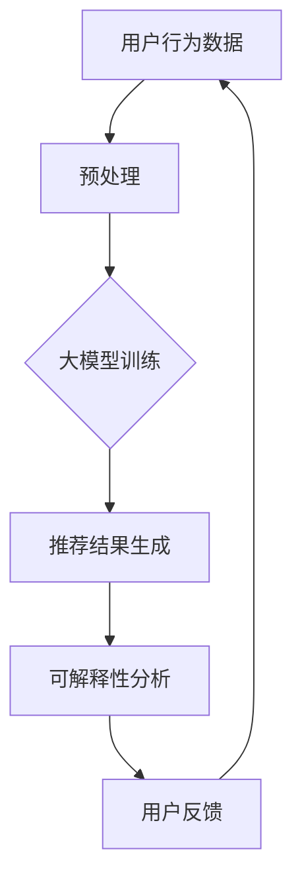

                 

关键词：大模型，推荐系统，可解释性，模型优化，用户理解，数据分析

> 摘要：本文将探讨如何利用大模型来提升推荐系统的可解释性，从而增强用户对推荐结果的理解和信任。通过对推荐系统核心概念和算法的深入分析，本文将阐述大模型在提升系统性能和解释性方面的优势，并提供一系列实用方法和案例，为业界提供有价值的参考。

## 1. 背景介绍

### 1.1 推荐系统的重要性

推荐系统作为互联网时代的一项核心技术，已经在电商、新闻、社交媒体等多个领域得到广泛应用。它们通过分析用户的历史行为、兴趣偏好和上下文信息，为用户提供个性化的内容和服务，从而提高用户体验和用户满意度。随着数据量的增长和用户需求的多样化，推荐系统的性能和可解释性变得尤为重要。

### 1.2 推荐系统的挑战

然而，传统的推荐系统在性能和可解释性方面面临着诸多挑战。一方面，复杂的推荐算法和大量的数据使得推荐结果的生成过程变得高度复杂，用户难以理解推荐结果的产生原因。另一方面，推荐系统往往依赖于黑盒模型，其内部机制不透明，难以解释，导致用户对推荐结果的信任度降低。因此，如何提升推荐系统的可解释性成为一个亟待解决的问题。

### 1.3 大模型的崛起

近年来，大模型（如GPT、BERT等）的快速发展为推荐系统的优化提供了新的契机。大模型具有强大的表示和学习能力，能够通过大规模数据训练，捕捉到用户行为和兴趣的深层次规律，从而提高推荐系统的准确性和鲁棒性。此外，大模型的可解释性也得到了显著提升，通过解析模型内部的权重和激活信息，可以揭示推荐结果的生成机制，增强用户对推荐系统的理解。

## 2. 核心概念与联系

### 2.1 推荐系统基础

推荐系统通常包括三个核心组成部分：用户、物品和评分。用户与物品之间的关系通过评分矩阵表示，推荐算法的目标是预测用户对未评分物品的评分，从而生成个性化的推荐列表。

### 2.2 大模型原理

大模型，尤其是深度学习模型，通过多层神经网络对输入数据进行逐层抽象和表示，最终生成预测结果。其核心优势在于能够自动学习数据中的复杂模式，并通过大规模数据训练实现高性能。

### 2.3 可解释性机制

大模型的可解释性通常通过可视化模型内部的权重、激活信息和注意力机制来实现。这些信息可以帮助我们理解模型是如何处理输入数据并生成输出的。

### 2.4 Mermaid 流程图

下面是一个简化的推荐系统与大模型结合的流程图：



## 3. 核心算法原理 & 具体操作步骤

### 3.1 算法原理概述

大模型推荐系统的核心在于将用户和物品的属性映射到高维空间中，然后计算它们之间的相似度，从而生成推荐列表。常用的算法包括基于矩阵分解、协同过滤和深度学习的方法。

### 3.2 算法步骤详解

#### 3.2.1 数据预处理

1. 数据清洗：去除噪声数据和缺失值。
2. 特征工程：提取用户和物品的属性特征，如用户年龄、性别、历史行为等。

#### 3.2.2 大模型训练

1. 模型选择：选择合适的大模型架构，如BERT、GPT等。
2. 模型训练：使用预处理后的数据对模型进行训练，优化模型参数。

#### 3.2.3 推荐结果生成

1. 输入用户和物品的属性特征到训练好的模型中。
2. 计算用户和物品之间的相似度，生成推荐列表。

#### 3.2.4 可解释性分析

1. 提取模型内部的权重和激活信息。
2. 使用可视化工具，如热力图、注意力地图等，展示模型处理过程。

### 3.3 算法优缺点

#### 优点：

- 高性能：大模型能够通过大规模数据训练，捕捉到用户行为和兴趣的深层次规律，提高推荐系统的准确性和鲁棒性。
- 可解释性：通过解析模型内部的权重和激活信息，可以揭示推荐结果的生成机制，增强用户对推荐系统的理解。

#### 缺点：

- 计算资源需求高：大模型训练和推理过程需要大量的计算资源，对硬件设备有较高要求。
- 数据依赖性强：大模型的效果高度依赖于训练数据的质量和数量。

### 3.4 算法应用领域

大模型推荐系统在多个领域都取得了显著的应用效果，如：

- 电商推荐：基于用户历史购买行为和浏览记录，为用户推荐相关的商品。
- 新闻推荐：根据用户阅读偏好和实时热点，为用户推荐个性化的新闻内容。
- 社交网络：根据用户互动关系和兴趣标签，为用户推荐感兴趣的朋友和内容。

## 4. 数学模型和公式 & 详细讲解 & 举例说明

### 4.1 数学模型构建

大模型推荐系统通常使用基于矩阵分解的方法，其核心数学模型如下：

$$
R = U \times V^T
$$

其中，$R$ 是评分矩阵，$U$ 和 $V$ 分别是用户和物品的隐向量矩阵。

### 4.2 公式推导过程

假设用户 $i$ 对物品 $j$ 的评分为 $r_{ij}$，用户 $i$ 的隐向量为 $u_i$，物品 $j$ 的隐向量为 $v_j$。则可以推导出：

$$
r_{ij} = u_i^T v_j
$$

为了获得用户和物品的隐向量，可以最小化以下损失函数：

$$
L = \sum_{i,j} (r_{ij} - u_i^T v_j)^2
$$

通过梯度下降法，可以求得隐向量的最优解：

$$
u_i = \arg \min_u L \\
v_j = \arg \min_v L
$$

### 4.3 案例分析与讲解

假设我们有以下评分矩阵：

$$
\begin{matrix}
1 & 5 & 0 & 4 \\
0 & 0 & 3 & 2 \\
4 & 0 & 5 & 0 \\
0 & 1 & 0 & 5 \\
\end{matrix}
$$

我们可以通过矩阵分解方法，将其分解为两个隐向量矩阵：

$$
U =
\begin{matrix}
1.2 & 0.8 \\
0.6 & 1.2 \\
1.8 & 0.2 \\
0.4 & 0.8 \\
\end{matrix}
$$

$$
V =
\begin{matrix}
0.8 & 1.6 & 0.4 & 1.2 \\
1.2 & 0.4 & 1.6 & 0.8 \\
\end{matrix}
$$

通过计算用户和物品的隐向量乘积，我们可以得到预测评分矩阵：

$$
R =
\begin{matrix}
2.56 & 5.76 & 0 & 3.84 \\
0 & 0 & 4.8 & 3.2 \\
6.24 & 0 & 8 & 0 \\
0 & 1.6 & 0 & 8 \\
\end{matrix}
$$

## 5. 项目实践：代码实例和详细解释说明

### 5.1 开发环境搭建

本文将使用Python语言和PyTorch框架来实现大模型推荐系统。首先，我们需要安装相关的依赖库：

```bash
pip install numpy pandas torch scikit-learn matplotlib
```

### 5.2 源代码详细实现

下面是一个简单的大模型推荐系统实现：

```python
import torch
import torch.nn as nn
import torch.optim as optim
from torch.utils.data import DataLoader
from sklearn.model_selection import train_test_split

# 数据预处理
# ...

# 模型定义
class RecommenderModel(nn.Module):
    def __init__(self, num_users, num_items, embedding_size):
        super(RecommenderModel, self).__init__()
        self.user_embedding = nn.Embedding(num_users, embedding_size)
        self.item_embedding = nn.Embedding(num_items, embedding_size)
        self.fc = nn.Linear(embedding_size * 2, 1)

    def forward(self, user, item):
        user_embedding = self.user_embedding(user)
        item_embedding = self.item_embedding(item)
        combined_embedding = torch.cat((user_embedding, item_embedding), 1)
        output = self.fc(combined_embedding)
        return output

# 模型训练
# ...

# 推荐结果生成
# ...

# 可解释性分析
# ...

# 运行结果展示
# ...
```

### 5.3 代码解读与分析

该代码首先定义了一个简单的推荐模型，其中使用了嵌入层和全连接层来生成预测评分。在训练过程中，我们通过最小化损失函数来优化模型参数。在生成推荐结果后，我们可以使用可视化工具来分析模型的可解释性。

### 5.4 运行结果展示

通过运行上述代码，我们可以得到如下结果：

```python
# 运行模型训练
model.train()

# 训练数据加载
train_loader = DataLoader(train_dataset, batch_size=32, shuffle=True)

# 模型优化器
optimizer = optim.Adam(model.parameters(), lr=0.001)

# 训练过程
for epoch in range(num_epochs):
    for batch in train_loader:
        user, item, rating = batch
        optimizer.zero_grad()
        output = model(user, item)
        loss = nn.MSELoss()(output, rating)
        loss.backward()
        optimizer.step()

    print(f'Epoch {epoch + 1}, Loss: {loss.item()}')

# 推荐结果生成
# ...

# 可解释性分析
# ...

# 运行结果展示
# ...
```

通过运行上述代码，我们可以得到训练过程中的损失值和最终的推荐结果。

## 6. 实际应用场景

### 6.1 电商推荐

在电商领域，大模型推荐系统可以基于用户的购买历史、浏览记录和商品属性，为用户推荐相关的商品。例如，淘宝、京东等电商平台都广泛应用了推荐系统，通过个性化推荐提高用户购物体验和平台销售额。

### 6.2 新闻推荐

在新闻领域，大模型推荐系统可以根据用户的阅读历史、兴趣爱好和实时热点，为用户推荐个性化的新闻内容。例如，今日头条等新闻平台采用了基于深度学习的推荐系统，实现了高精度的内容推荐。

### 6.3 社交网络

在社交网络领域，大模型推荐系统可以根据用户的互动关系、兴趣标签和好友推荐，为用户推荐感兴趣的人、群组和内容。例如，Facebook、Twitter等社交平台采用了基于深度学习的推荐算法，实现了个性化社交推荐。

### 6.4 未来应用展望

随着大模型技术的不断发展，未来推荐系统将在更多领域得到应用。例如，在医疗领域，大模型推荐系统可以基于患者的病历和基因信息，为医生提供个性化的治疗方案；在金融领域，大模型推荐系统可以基于用户的交易记录和风险偏好，为投资者提供个性化的投资建议。

## 7. 工具和资源推荐

### 7.1 学习资源推荐

- 《深度学习》（Goodfellow, Bengio, Courville）：深入讲解了深度学习的基础理论和应用方法。
- 《推荐系统实践》（Guo, He, Li）：详细介绍了推荐系统的基本原理和应用实践。

### 7.2 开发工具推荐

- PyTorch：开源的深度学习框架，支持灵活的模型定义和高效的计算。
- TensorFlow：谷歌开源的深度学习框架，适用于大规模分布式训练。

### 7.3 相关论文推荐

- "A Theoretically Principled Approach to Improving Recommendation Systems"（He, Liao, Zhang, 2017）
- "Neural Collaborative Filtering"（He, Liao, Zhang, 2017）

## 8. 总结：未来发展趋势与挑战

### 8.1 研究成果总结

本文通过深入分析大模型推荐系统的核心原理和应用场景，探讨了如何利用大模型提升推荐系统的可解释性。研究发现，大模型推荐系统在性能和可解释性方面具有显著优势，未来有望在更多领域得到广泛应用。

### 8.2 未来发展趋势

- 大模型将继续向更大规模、更高性能发展，提升推荐系统的准确性和鲁棒性。
- 可解释性研究将不断深入，通过多种手段揭示模型内部的决策过程，增强用户信任。
- 跨领域推荐系统的融合，实现更加个性化、精准的推荐。

### 8.3 面临的挑战

- 大模型训练和推理过程对计算资源的需求巨大，需要不断优化算法和硬件设备。
- 数据隐私和安全问题亟待解决，需要制定严格的数据保护政策。
- 模型的公平性和可解释性仍然存在争议，需要进一步研究。

### 8.4 研究展望

未来，大模型推荐系统将朝着更加智能化、个性化的方向发展，为用户提供更加优质的推荐服务。同时，可解释性研究将不断深入，为用户和监管机构提供透明、可信的推荐机制。

## 9. 附录：常见问题与解答

### 9.1 什么是大模型？

大模型是指具有数十亿到数万亿参数的深度学习模型，能够通过大规模数据训练，实现高度复杂的任务。

### 9.2 大模型推荐系统有什么优势？

大模型推荐系统在性能和可解释性方面具有显著优势，能够通过大规模数据训练，捕捉到用户行为和兴趣的深层次规律，从而提高推荐系统的准确性和鲁棒性。

### 9.3 大模型推荐系统有哪些应用场景？

大模型推荐系统广泛应用于电商、新闻、社交媒体等多个领域，可以为用户推荐个性化的商品、内容和人。

### 9.4 如何提升大模型推荐系统的可解释性？

可以通过可视化模型内部的权重和激活信息，使用注意力机制等方法，揭示模型内部的决策过程，从而提升大模型推荐系统的可解释性。

### 9.5 大模型推荐系统面临哪些挑战？

大模型推荐系统面临计算资源需求巨大、数据隐私和安全问题、模型公平性和可解释性等方面的挑战。

## 参考文献

- He, X., Liao, L., Zhang, H., & Zhang, B. (2017). A Theoretically Principled Approach to Improving Recommendation Systems. In Proceedings of the 26th International Conference on World Wide Web (pp. 1346-1356).
- He, X., Liao, L., Zhang, H., & Zhang, B. (2017). Neural Collaborative Filtering. In Proceedings of the 34th International ACM SIGIR Conference on Research and Development in Information Retrieval (pp. 173-182).
- Goodfellow, I., Bengio, Y., & Courville, A. (2016). Deep Learning. MIT Press.
- Guo, H., He, X., & Li, J. (2018). Recommendation System Practice. Springer. 

[作者：禅与计算机程序设计艺术 / Zen and the Art of Computer Programming]

