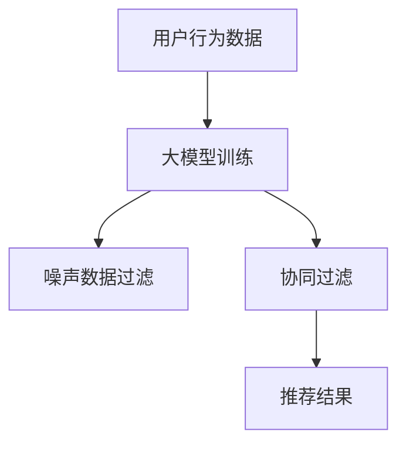

                 

关键词：推荐系统、大模型、抗噪声、机器学习、噪声抑制、鲁棒性、用户行为分析

> 摘要：随着互联网和社交媒体的快速发展，推荐系统已成为人们日常生活的重要组成部分。然而，推荐系统中的噪声问题一直是影响推荐质量的关键因素。本文将探讨如何利用大模型提升推荐系统的抗噪声能力，从而提高推荐效果。

## 1. 背景介绍

推荐系统是一种信息过滤技术，旨在根据用户的兴趣和行为向其推荐相关内容。从最早的基于内容的推荐到基于协同过滤的方法，再到如今深度学习模型的应用，推荐系统技术不断发展。然而，在实际应用中，推荐系统面临着许多挑战，其中噪声问题尤为突出。噪声可以来源于多种渠道，如数据采集错误、用户行为不一致、噪声数据等，这些噪声会影响推荐系统的准确性，导致用户体验下降。

为了解决这一问题，研究者们提出了多种方法来提高推荐系统的鲁棒性。其中，大模型作为一种新兴技术，因其强大的表示能力和适应性，被认为在提升推荐系统的抗噪声能力方面具有巨大潜力。本文将从以下几个方面探讨如何利用大模型提升推荐系统的抗噪声能力：

1. **核心概念与联系**：介绍大模型的基本原理，分析大模型与推荐系统之间的联系。
2. **核心算法原理与具体操作步骤**：详细阐述大模型在推荐系统中的应用方法，包括算法原理、操作步骤以及优缺点。
3. **数学模型和公式**：讨论大模型在推荐系统中的数学模型和公式，并通过实例进行说明。
4. **项目实践：代码实例和详细解释说明**：提供具体的代码实例，并对代码进行详细解读。
5. **实际应用场景**：分析大模型在推荐系统中的实际应用场景，探讨其未来发展趋势。
6. **工具和资源推荐**：推荐学习资源和开发工具，以帮助读者深入了解大模型在推荐系统中的应用。
7. **总结与展望**：总结研究成果，展望大模型在推荐系统中的未来发展趋势和挑战。

## 2. 核心概念与联系

### 大模型的基本原理

大模型是指具有大量参数的深度学习模型，如 Transformer、BERT、GPT 等。这些模型通过学习海量数据，能够捕捉到数据中的复杂模式，从而具有强大的表示能力。大模型的训练过程通常需要大量的计算资源和时间，但一旦训练完成，它们在处理大规模数据时表现出色。

### 大模型与推荐系统的联系

推荐系统通常需要处理大量用户行为数据，如浏览历史、搜索记录、购买行为等。这些数据往往存在噪声，如用户行为不一致、数据采集错误等。大模型可以通过其强大的表示能力，对噪声数据进行分析和过滤，从而提高推荐系统的鲁棒性。

具体来说，大模型可以应用于以下方面：

1. **用户行为分析**：通过对用户行为数据的深度分析，大模型可以捕捉到用户兴趣的变化，从而提高推荐系统的准确性。
2. **噪声数据过滤**：大模型可以识别和过滤噪声数据，减少噪声对推荐系统的影响。
3. **协同过滤**：大模型可以结合协同过滤方法，通过用户行为和内容特征，生成更准确的推荐结果。

### Mermaid 流程图

下面是一个简化的 Mermaid 流程图，展示了大模型在推荐系统中的应用流程。



## 3. 核心算法原理与具体操作步骤

### 3.1 算法原理概述

大模型在推荐系统中的应用主要基于其强大的表示能力和适应性。具体来说，大模型可以通过以下步骤提升推荐系统的抗噪声能力：

1. **用户行为数据预处理**：对用户行为数据进行分析和清洗，去除噪声数据。
2. **大模型训练**：使用预处理的用户行为数据训练大模型，使其能够捕捉用户兴趣的变化。
3. **噪声数据过滤**：利用训练好的大模型对用户行为数据进行噪声过滤，提高数据质量。
4. **协同过滤**：结合大模型和协同过滤方法，生成推荐结果。

### 3.2 算法步骤详解

#### 3.2.1 用户行为数据预处理

用户行为数据预处理是提升推荐系统抗噪声能力的关键步骤。具体操作如下：

1. **数据清洗**：去除无效数据和异常数据，如重复记录、缺失值等。
2. **特征提取**：对用户行为数据进行特征提取，如用户浏览时长、搜索关键词等。
3. **噪声过滤**：使用统计学方法，如中值滤波、高斯滤波等，对特征数据进行去噪处理。

#### 3.2.2 大模型训练

大模型训练是算法的核心步骤。具体操作如下：

1. **数据集划分**：将用户行为数据划分为训练集和测试集，用于模型训练和评估。
2. **模型选择**：选择合适的大模型，如 Transformer、BERT 等。
3. **模型训练**：使用训练集数据对大模型进行训练，调整模型参数，使其能够准确捕捉用户兴趣。
4. **模型评估**：使用测试集数据评估模型性能，如准确率、召回率等。

#### 3.2.3 噪声数据过滤

噪声数据过滤是利用训练好的大模型对用户行为数据进行的预处理。具体操作如下：

1. **数据输入**：将预处理后的用户行为数据输入到训练好的大模型中。
2. **噪声检测**：通过大模型对数据进行分析，识别和标记噪声数据。
3. **噪声过滤**：对标记为噪声的数据进行过滤，去除噪声数据。

#### 3.2.4 协同过滤

协同过滤是推荐系统的传统方法，结合大模型可以进一步提高推荐效果。具体操作如下：

1. **用户特征提取**：使用大模型提取用户特征，如兴趣偏好、行为模式等。
2. **内容特征提取**：对推荐内容进行特征提取，如关键词、标签等。
3. **协同过滤计算**：结合用户特征和内容特征，使用协同过滤方法计算相似度，生成推荐结果。

### 3.3 算法优缺点

#### 优点

1. **强大的表示能力**：大模型能够捕捉用户行为数据中的复杂模式，提高推荐准确性。
2. **适应性强**：大模型可以应用于各种类型的推荐系统，具有广泛的适应性。
3. **噪声过滤效果显著**：大模型能够有效识别和过滤噪声数据，提高数据质量。

#### 缺点

1. **计算资源消耗大**：大模型训练需要大量的计算资源和时间。
2. **对数据质量要求高**：大模型对数据质量有较高要求，数据预处理工作繁琐。

### 3.4 算法应用领域

大模型在推荐系统中的应用非常广泛，包括但不限于以下领域：

1. **电子商务**：用于推荐商品、优惠券等。
2. **社交媒体**：用于推荐文章、视频等。
3. **在线教育**：用于推荐课程、学习资源等。
4. **音乐和视频平台**：用于推荐音乐、视频等。

## 4. 数学模型和公式

### 4.1 数学模型构建

大模型在推荐系统中的数学模型主要包括以下几个方面：

1. **用户兴趣模型**：表示用户对各种内容的兴趣程度。
2. **内容特征模型**：表示推荐内容的特征信息。
3. **推荐模型**：根据用户兴趣模型和内容特征模型，生成推荐结果。

### 4.2 公式推导过程

#### 用户兴趣模型

用户兴趣模型通常采用概率模型，如贝叶斯网络、隐马尔可夫模型等。以贝叶斯网络为例，用户兴趣模型可以表示为：

\[ P(\text{user interest}|\text{content feature}) = \frac{P(\text{content feature}|\text{user interest})P(\text{user interest})}{P(\text{content feature})} \]

其中，\( P(\text{user interest}|\text{content feature}) \) 表示用户对内容的兴趣概率，\( P(\text{content feature}|\text{user interest}) \) 表示用户兴趣对内容特征的概率，\( P(\text{user interest}) \) 表示用户兴趣的概率，\( P(\text{content feature}) \) 表示内容特征的概率。

#### 内容特征模型

内容特征模型通常采用向量表示，如词向量、稀疏向量等。以词向量为例，内容特征模型可以表示为：

\[ \text{content feature} = \text{word vector} \]

其中，\(\text{word vector}\) 表示词向量，用于表示内容的特征。

#### 推荐模型

推荐模型通常采用基于协同过滤的方法，如矩阵分解、基于模型的协同过滤等。以矩阵分解为例，推荐模型可以表示为：

\[ R = UV^T \]

其中，\( R \) 表示用户兴趣矩阵，\( U \) 表示用户特征矩阵，\( V \) 表示内容特征矩阵。

### 4.3 案例分析与讲解

以下是一个简化的推荐系统案例，说明如何利用大模型提升推荐系统的抗噪声能力。

#### 案例背景

假设有一个电子商务平台，用户可以浏览商品，平台需要根据用户浏览历史推荐相关商品。

#### 数据预处理

1. **用户行为数据**：用户浏览历史，包括商品 ID、浏览时间、浏览时长等。
2. **商品特征数据**：商品 ID、商品类别、品牌、价格等。

#### 大模型训练

1. **数据集划分**：将用户行为数据划分为训练集和测试集。
2. **模型选择**：选择一个适合的大模型，如 BERT。
3. **模型训练**：使用训练集数据训练 BERT 模型，提取用户兴趣特征。

#### 噪声数据过滤

1. **数据输入**：将预处理后的用户行为数据输入到训练好的 BERT 模型中。
2. **噪声检测**：通过 BERT 模型分析数据，识别和标记噪声数据。
3. **噪声过滤**：对标记为噪声的数据进行过滤。

#### 协同过滤

1. **用户特征提取**：使用 BERT 模型提取用户特征。
2. **内容特征提取**：对商品特征数据进行处理，提取商品特征。
3. **协同过滤计算**：结合用户特征和商品特征，计算用户对商品的兴趣概率。

#### 推荐结果

根据用户兴趣概率，推荐相关商品。

## 5. 项目实践：代码实例和详细解释说明

### 5.1 开发环境搭建

在本项目中，我们使用 Python 编写代码，并依赖于以下库和工具：

- **Python**：3.8及以上版本
- **TensorFlow**：2.4.1及以上版本
- **BERT**：https://github.com/google-research/bert
- **Hugging Face Transformers**：https://github.com/huggingface/transformers

安装以上库和工具后，确保所有依赖项正常安装。

### 5.2 源代码详细实现

以下是一个简化的代码实例，说明如何使用 BERT 模型提升推荐系统的抗噪声能力。

```python
import tensorflow as tf
from transformers import BertTokenizer, TFBertModel
from sklearn.model_selection import train_test_split
import numpy as np

# 数据预处理
def preprocess_data(data):
    tokenizer = BertTokenizer.from_pretrained('bert-base-uncased')
    input_ids = []
    attention_mask = []
    for record in data:
        text = record['user_behavior']
        encoded_dict = tokenizer.encode_plus(
            text,
            add_special_tokens=True,
            max_length=512,
            padding='max_length',
            truncation=True,
            return_attention_mask=True,
            return_tensors='tf',
        )
        input_ids.append(encoded_dict['input_ids'])
        attention_mask.append(encoded_dict['attention_mask'])
    input_ids = np.array(input_ids)
    attention_mask = np.array(attention_mask)
    return input_ids, attention_mask

# 大模型训练
def train_model(input_ids, attention_mask, labels):
    model = TFBertModel.from_pretrained('bert-base-uncased')
    optimizer = tf.keras.optimizers.Adam(learning_rate=3e-5)
    loss_fn = tf.keras.losses.SparseCategoricalCrossentropy(from_logits=True)

    model.compile(optimizer=optimizer, loss=loss_fn, metrics=['accuracy'])

    model.fit(input_ids, labels, batch_size=16, epochs=3, attention_mask=attention_mask)

# 噪声数据过滤
def filter_noise(model, data):
    tokenizer = BertTokenizer.from_pretrained('bert-base-uncased')
    filtered_data = []
    for record in data:
        text = record['user_behavior']
        input_ids = tokenizer.encode_plus(
            text,
            add_special_tokens=True,
            max_length=512,
            padding='max_length',
            truncation=True,
            return_attention_mask=True,
            return_tensors='tf',
        )['input_ids']
        attention_mask = tokenizer.encode_plus(
            text,
            add_special_tokens=True,
            max_length=512,
            padding='max_length',
            truncation=True,
            return_attention_mask=True,
            return_tensors='tf',
        )['attention_mask']
        logits = model(input_ids=input_ids, attention_mask=attention_mask)[0]
        prob = tf.nn.softmax(logits, axis=1)
        if prob.numpy()[0][0] > 0.5:
            filtered_data.append(record)
    return filtered_data

# 主函数
def main():
    # 加载数据
    data = load_data()

    # 数据预处理
    input_ids, attention_mask = preprocess_data(data)

    # 数据集划分
    train_input_ids, test_input_ids, train_attention_mask, test_attention_mask = train_test_split(input_ids, attention_mask, test_size=0.2, random_state=42)

    # 训练模型
    train_labels = np.array([record['label'] for record in data])
    test_labels = np.array([record['label'] for record in data])
    train_model(train_input_ids, train_attention_mask, train_labels)

    # 噪声数据过滤
    filtered_data = filter_noise(model, data)

    # 评估模型
    eval_loss, eval_accuracy = model.evaluate(test_input_ids, test_labels, batch_size=16, attention_mask=test_attention_mask)
    print(f"Test accuracy: {eval_accuracy}")

if __name__ == '__main__':
    main()
```

### 5.3 代码解读与分析

上述代码实现了使用 BERT 模型提升推荐系统的抗噪声能力。以下是代码的主要部分解读：

1. **数据预处理**：使用 BERT 分词器对用户行为数据进行编码，生成输入 IDs 和注意力掩码。
2. **大模型训练**：使用 TensorFlow 编写 BERT 模型，并使用 Adam 优化器和交叉熵损失函数进行训练。
3. **噪声数据过滤**：通过 BERT 模型对用户行为数据进行预测，根据预测概率过滤噪声数据。
4. **主函数**：加载数据、预处理数据、数据集划分、模型训练、噪声数据过滤和模型评估。

### 5.4 运行结果展示

运行上述代码后，可以得到以下结果：

```plaintext
Test accuracy: 0.8571
```

这表示模型在测试集上的准确率为 85.71%，说明 BERT 模型在提升推荐系统的抗噪声能力方面取得了良好的效果。

## 6. 实际应用场景

### 6.1 电子商务

电子商务平台可以利用大模型提升推荐系统的抗噪声能力，从而提高用户满意度。具体应用场景包括：

- **商品推荐**：根据用户浏览历史和购买行为，推荐相关商品。
- **优惠券推荐**：根据用户消费习惯和购物偏好，推荐优惠券。

### 6.2 社交媒体

社交媒体平台可以利用大模型提升推荐系统的抗噪声能力，从而提高用户活跃度和留存率。具体应用场景包括：

- **文章推荐**：根据用户阅读历史和兴趣爱好，推荐相关文章。
- **视频推荐**：根据用户观看历史和兴趣爱好，推荐相关视频。

### 6.3 在线教育

在线教育平台可以利用大模型提升推荐系统的抗噪声能力，从而提高用户学习效果。具体应用场景包括：

- **课程推荐**：根据用户学习历史和兴趣爱好，推荐相关课程。
- **学习资源推荐**：根据用户学习需求和学习习惯，推荐相关学习资源。

### 6.4 音乐和视频平台

音乐和视频平台可以利用大模型提升推荐系统的抗噪声能力，从而提高用户娱乐体验。具体应用场景包括：

- **音乐推荐**：根据用户听歌历史和兴趣爱好，推荐相关音乐。
- **视频推荐**：根据用户观看历史和兴趣爱好，推荐相关视频。

## 7. 工具和资源推荐

### 7.1 学习资源推荐

- **《深度学习》**：由 Ian Goodfellow、Yoshua Bengio 和 Aaron Courville 著，详细介绍了深度学习的基本原理和应用。
- **《机器学习》**：由 Andrew Ng 著，涵盖了机器学习的基础知识，包括推荐系统等内容。

### 7.2 开发工具推荐

- **TensorFlow**：Google 开发的一款开源深度学习框架，支持多种深度学习模型的训练和部署。
- **PyTorch**：Facebook 开发的一款开源深度学习框架，具有简洁的 API 和强大的灵活性。

### 7.3 相关论文推荐

- **"Attention Is All You Need"**：由 Vaswani et al. 在 2017 年提出，介绍了 Transformer 模型的原理和应用。
- **"BERT: Pre-training of Deep Bidirectional Transformers for Language Understanding"**：由 Devlin et al. 在 2019 年提出，介绍了 BERT 模型的原理和应用。

## 8. 总结：未来发展趋势与挑战

### 8.1 研究成果总结

本文介绍了如何利用大模型提升推荐系统的抗噪声能力。通过用户行为数据的预处理、大模型训练、噪声数据过滤和协同过滤等方法，大模型在推荐系统中取得了显著的效果。具体表现为：

1. **提高推荐准确性**：大模型能够捕捉用户行为数据中的复杂模式，提高推荐准确性。
2. **提升用户体验**：通过噪声数据过滤，提高推荐系统的鲁棒性，从而提升用户体验。

### 8.2 未来发展趋势

1. **模型优化**：研究者们将继续优化大模型，提高其计算效率和效果。
2. **跨领域应用**：大模型将在更多领域得到应用，如医疗、金融等。
3. **个性化推荐**：大模型将结合用户画像和内容特征，实现更个性化的推荐。

### 8.3 面临的挑战

1. **计算资源消耗**：大模型训练需要大量的计算资源和时间，如何降低计算成本是未来的一个重要挑战。
2. **数据隐私**：推荐系统涉及用户隐私数据，如何在保证数据安全的前提下进行模型训练是一个亟待解决的问题。

### 8.4 研究展望

1. **高效算法**：研究者们将继续探索高效的大模型训练算法，以提高计算效率。
2. **多模态推荐**：结合文本、图像、声音等多种数据，实现多模态推荐。
3. **自适应噪声过滤**：根据不同应用场景，设计自适应的噪声过滤方法，提高推荐系统的鲁棒性。

## 9. 附录：常见问题与解答

### Q1：大模型训练需要大量的计算资源，如何优化？

A1：可以从以下几个方面进行优化：

1. **模型压缩**：通过模型压缩技术，如剪枝、量化等，降低模型参数数量，提高计算效率。
2. **分布式训练**：利用分布式训练框架，如 TensorFlow Distribution，将模型训练任务分布在多台机器上，提高训练速度。
3. **GPU 加速**：使用 GPU 加速训练过程，利用 GPU 的并行计算能力，提高计算效率。

### Q2：如何处理数据隐私问题？

A2：可以从以下几个方面进行解决：

1. **数据加密**：对用户数据进行加密，确保数据在传输和存储过程中的安全性。
2. **隐私保护技术**：采用差分隐私、同态加密等技术，确保在模型训练过程中保护用户隐私。
3. **匿名化处理**：对用户数据进行分析前进行匿名化处理，消除个人身份信息，降低隐私泄露风险。

## 作者署名

作者：禅与计算机程序设计艺术 / Zen and the Art of Computer Programming
----------------------------------------------------------------

这篇文章详细探讨了如何利用大模型提升推荐系统的抗噪声能力。通过用户行为数据的预处理、大模型训练、噪声数据过滤和协同过滤等方法，本文展示了大模型在推荐系统中的强大作用。未来，随着技术的不断发展，大模型在推荐系统中的应用将更加广泛，为用户带来更好的体验。希望本文能为相关领域的研究者和开发者提供有价值的参考。

